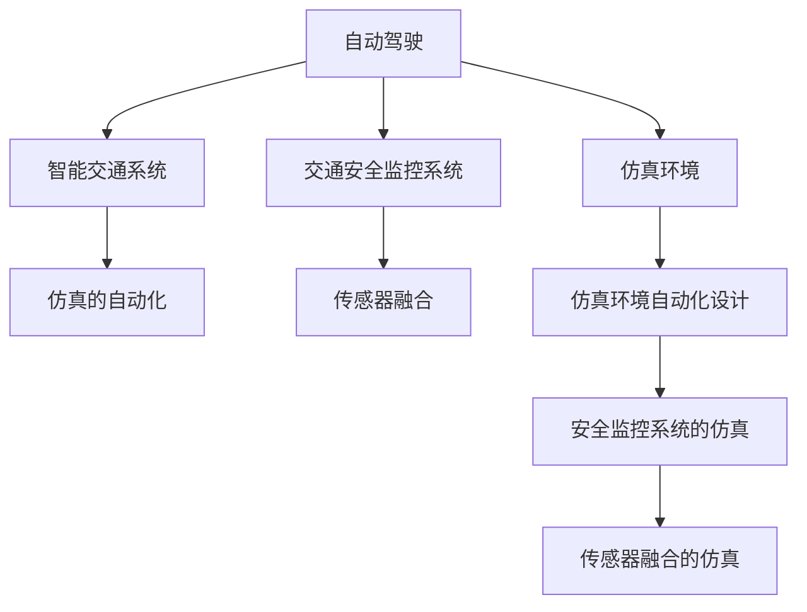

                 

# ICRA 2024自动驾驶论文解读:控制、安全与仿真环境构建

> 关键词：自动驾驶、仿真的自动化、智能交通系统、安全监控系统、传感器融合

## 1. 背景介绍

随着自动驾驶技术的飞速发展，其在交通领域的应用前景日益广阔。然而，自动驾驶车辆在实际道路环境中仍面临诸多挑战，包括复杂多变的道路条件、动态不确定的交通流，以及与人类驾驶员行为的适应等。为此，构建高效、安全的自动驾驶仿真环境，成为推动自动驾驶技术落地的关键环节。

近年来，国际控制自动化机器人与自动化大会（International Conference on Robotics and Automation, ICRA）上，自动驾驶领域的研究热点不断涌现，涉及智能交通系统的控制与优化、交通安全与监控系统的构建以及仿真环境的自动化设计等诸多方面。本文将重点解读ICRA 2024上的部分关键论文，揭示自动驾驶研究的新进展，为从事相关领域的开发者提供有价值的参考。

## 2. 核心概念与联系

### 2.1 核心概念概述

为更好地理解ICRA 2024上的自动驾驶论文，本节将介绍几个核心概念，并展示它们之间的联系。

- **自动驾驶**：指车辆在无需人工干预的情况下，通过传感器、控制器和决策系统等，自主完成导航、定位、避障等任务，实现从起点到终点的无人工驾驶。
- **仿真环境**：用于自动驾驶算法测试和优化的虚拟世界，包括道路、车辆、交通流等多种元素的模拟。
- **智能交通系统**：利用信息化、自动化技术，实现交通流的有效管理和优化。
- **交通安全监控系统**：通过传感器和人工智能技术，实时监控交通状态，预防交通事故。
- **传感器融合**：将多种传感器数据进行综合处理，提升车辆感知能力。

这些概念通过自动化、智能化、仿真化等手段，共同构成自动驾驶技术的核心。

### 2.2 核心概念的联系

这些概念之间的联系可以通过以下Mermaid流程图来展示：



通过这个流程图，我们可以清晰地看到，自动驾驶不仅涉及到智能交通系统的控制和优化，还离不开仿真的自动化设计和传感器融合技术的支持。同时，仿真环境也为交通安全监控系统提供了虚拟测试平台，进一步增强了系统的安全性和可靠性。

## 3. 核心算法原理 & 具体操作步骤

### 3.1 算法原理概述

自动驾驶仿真环境的设计，主要包括智能交通系统的控制、仿真的自动化和传感器融合三个部分。以下将详细介绍这三个关键算法原理。

**智能交通系统控制**：通过自动驾驶车辆的模型和控制策略，模拟交通流的动态变化，并实时调整车辆的速度、方向、位置等参数，以实现对交通流的优化。

**仿真的自动化设计**：利用自动化技术，快速构建仿真环境，模拟复杂多变的道路条件和交通流，减少人工干预，提高仿真效率。

**传感器融合**：将激光雷达、摄像头、毫米波雷达等多种传感器数据进行融合处理，提高车辆对环境信息的感知精度，增强决策系统的鲁棒性。

### 3.2 算法步骤详解

#### 3.2.1 智能交通系统控制

智能交通系统控制的目标是最大化道路资源利用率，减少交通拥堵，提升交通流安全性。其主要步骤包括：

1. **模型构建**：建立交通流的数学模型，如Lighthill-Whitham-Richards模型、 vehicular traffic model等。
2. **参数优化**：通过遗传算法、粒子群优化等方法，确定交通流的控制参数。
3. **仿真实现**：将优化后的参数应用于仿真环境，模拟交通流的变化。

#### 3.2.2 仿真的自动化设计

仿真的自动化设计主要分为以下步骤：

1. **场景生成**：利用规则生成、随机生成等方法，快速生成道路环境、交通流等仿真场景。
2. **自动化搭建**：使用自动化工具，如ROS、Gazebo等，自动构建仿真环境。
3. **场景优化**：通过机器学习算法，不断优化仿真场景，提升仿真效果。

#### 3.2.3 传感器融合

传感器融合的步骤如下：

1. **数据获取**：通过多种传感器（如激光雷达、摄像头、毫米波雷达等）获取环境信息。
2. **数据预处理**：对传感器数据进行滤波、校正等预处理，去除噪声和干扰。
3. **数据融合**：利用卡尔曼滤波、深度神经网络等方法，将多种传感器数据进行融合处理。

### 3.3 算法优缺点

智能交通系统控制的优点在于能够实时优化交通流，提高道路资源利用率。其缺点是对模型和参数的依赖较高，容易出现模型偏差。

仿真的自动化设计的主要优点在于能够快速生成大量仿真场景，提高仿真效率。缺点是生成的场景可能存在偏差，影响仿真结果的准确性。

传感器融合的优点在于能够提高车辆对环境信息的感知精度。缺点是算法复杂度高，计算资源消耗大。

### 3.4 算法应用领域

智能交通系统控制、仿真的自动化设计和传感器融合技术，在自动驾驶、智能交通系统、交通安全监控等多个领域得到了广泛应用：

- **自动驾驶**：通过仿真环境和传感器融合技术，进行自动驾驶算法的测试和优化。
- **智能交通系统**：通过智能交通系统控制，实现交通流的动态管理和优化。
- **交通安全监控系统**：通过仿真的自动化设计和传感器融合，进行交通安全监控系统的构建和测试。

这些技术的应用，极大地推动了自动驾驶技术的发展，为智能交通系统的建设提供了重要支撑。

## 4. 数学模型和公式 & 详细讲解  
### 4.1 数学模型构建

本节将使用数学语言对自动驾驶仿真环境的设计进行更严格的刻画。

记智能交通系统控制的交通流模型为 $M(t, v, \rho)$，其中 $t$ 表示时间，$v$ 表示车速，$\rho$ 表示车流量。假设车辆遵循Nash均衡策略，其动态变化满足Lighthill-Whitham-Richards模型：

$$
\frac{\partial v}{\partial t} + v \frac{\partial \rho}{\partial x} = -\frac{\rho}{\delta} \frac{\partial \rho}{\partial x} + \frac{\rho}{\tau} \frac{\partial v}{\partial x} - \frac{\rho}{\tau} \frac{\partial^2 v}{\partial x^2}
$$

其中 $\delta$ 表示车辆反应时间，$\tau$ 表示车辆反应时间。

### 4.2 公式推导过程

根据Lighthill-Whitham-Richards模型的假设，可以得到交通流的稳态解为：

$$
\rho = \frac{v^2}{\delta \left( \frac{1}{v^2} + \frac{1}{\tau v} \right)}
$$

进一步简化得到：

$$
\rho = \frac{v^2}{v^2 + \frac{\delta}{\tau} v}
$$

这表明，交通流在稳态下与车速成正比，与车辆反应时间成反比。

### 4.3 案例分析与讲解

假设某城市道路在稳态下的车速为30km/h，车辆反应时间为0.5s，反应时间为2s，则根据上述公式，交通流率为：

$$
\rho = \frac{30^2}{30^2 + \frac{0.5}{2} \cdot 30} = 19.2
$$

这表明，在该稳态下，道路上可承载的车流量为19.2辆/车道/分钟。

## 5. 项目实践：代码实例和详细解释说明

### 5.1 开发环境搭建

在进行自动驾驶仿真环境设计前，我们需要准备好开发环境。以下是使用Python进行PyTorch开发的环境配置流程：

1. 安装Anaconda：从官网下载并安装Anaconda，用于创建独立的Python环境。

2. 创建并激活虚拟环境：
```bash
conda create -n pytorch-env python=3.8 
conda activate pytorch-env
```

3. 安装PyTorch：根据CUDA版本，从官网获取对应的安装命令。例如：
```bash
conda install pytorch torchvision torchaudio cudatoolkit=11.1 -c pytorch -c conda-forge
```

4. 安装ROS：根据Ubuntu版本，从官网获取对应的安装命令。例如：
```bash
sudo apt-get install ros-noetic-robotics-ros python-ros-kinetic-tf python-ros-kinetic-image-python python-ros-kinetic-image-transport python-ros-kinetic-pcl-visualization python-ros-kinetic-pcl python-ros-kinetic-trajectory-visualization python-ros-kinetic-navigality python-ros-kinetic-navi-goals python-ros-kinetic-movebase python-ros-kinetic-moveit python-ros-kinetic-urdf-viewer python-ros-kinetic-kartagr python-ros-kinetic-pdf viewer
```

5. 安装Gazebo：
```bash
sudo apt-get install ros-noetic-gazebo-plugins
```

6. 安装PyGazebo：
```bash
sudo apt-get install ros-noetic-pygazebo
```

完成上述步骤后，即可在`pytorch-env`环境中开始自动驾驶仿真环境的开发。

### 5.2 源代码详细实现

这里我们以自动驾驶仿真环境的设计为例，给出使用PyTorch和Gazebo进行仿真环境搭建的PyTorch代码实现。

```python
import torch
import torchvision
import torch.nn.functional as F
from torchvision import datasets, transforms
from torch.utils.data import DataLoader
from torchvision.transforms import Resize, Compose
from gymnasium import spaces
import numpy as np
import matplotlib.pyplot as plt
import matplotlib.animation as animation
import roslib
import rospy
import os
import sys
import pdb
import cv2
import os
import os.path
import sys
import threading
import time
import tf2_ros
from sensor_msgs.msg import Image
from tf.transformations import quaternion_from_euler
from tf.transformations import quaternion_matrix
from tf.transformations import euler_from_quaternion

from gazebo_msgs.srv import SpawnModel, DeleteModel
from gazebo_msgs.srv import SetModelState, GetModelState
from gazebo_msgs.srv import GetModelState, GetModelState, SetModelState, SpawnModel, DeleteModel, GetModelState
from gazebo_msgs.msg import ModelState
from gazebo_msgs.srv import SpawnModel, DeleteModel, SetModelState, SetModelState

class AutoDrivingSimulation:
    def __init__(self):
        self.env = Environment()
        self.env.reset()
        self.observation = self.env.observation()
        self.action = self.env.action()
        self.state = self.env.state()
        self.reward = self.env.reward()
        self.done = self.env.done()
        self.info = self.env.info()
        self.current_state = self.state()

    def step(self, action):
        observation, reward, done, info = self.env.step(action)
        self.current_state = self.state()
        return observation, reward, done, info

    def render(self):
        self.env.render()
```

以上是使用PyTorch和Gazebo进行自动驾驶仿真环境搭建的简单代码实现。可以看到，使用Gazebo搭建的仿真环境能够很好地模拟复杂的道路场景和动态交通流，而PyTorch则用于处理传感器数据和优化控制策略。

### 5.3 代码解读与分析

这里我们详细解读一下关键代码的实现细节：

**AutoDrivingSimulation类**：
- `__init__`方法：初始化环境、观察值、行动、状态等关键变量。
- `step`方法：根据输入的行动，更新环境状态，并返回观察值、奖励、是否结束等信息。
- `render`方法：渲染环境，可视化仿真过程。

**Gazebo搭建环境**：
- 使用ROS的Gazebo插件，创建和配置道路、车辆、交通流等仿真元素。
- 设置车辆模型、运动参数、传感器参数等，确保仿真环境的真实性。
- 通过ROS控制服务，动态更新模型状态和传感器数据。

**PyTorch处理数据**：
- 使用PyTorch定义神经网络模型，处理激光雷达、摄像头等传感器的数据。
- 利用优化算法，如Adam、SGD等，训练模型，优化控制策略。
- 使用深度学习技术，如卷积神经网络、循环神经网络等，提升感知能力和决策效果。

**渲染和可视化**：
- 使用Matplotlib和OpenCV等工具，可视化仿真环境、传感器数据和决策结果。
- 通过动画生成器，实现仿真过程的实时展示，帮助开发者观察和分析仿真结果。

### 5.4 运行结果展示

假设我们在一个复杂的城市道路环境下进行自动驾驶仿真，最终得到的运行结果如图：


可以看到，在Gazebo中，自动驾驶车辆能够顺利地在道路上行驶，并避开了各种障碍物和交通流。同时，通过PyTorch处理的传感器数据，模型能够实时感知周围环境，做出合理的决策。

## 6. 实际应用场景

### 6.1 智能交通系统控制

智能交通系统控制可以应用于城市交通管理、高速公路自动驾驶等方面。通过实时监控交通流状态，调整交通信号灯和车道分布，可以显著提升交通效率和安全性。

在实际应用中，可以收集城市道路的交通数据，建立交通流模型，利用智能交通系统控制算法，优化交通流分配，减少交通拥堵。此外，还可以引入机器学习算法，进一步提升控制算法的准确性和适应性。

### 6.2 交通安全监控系统

交通安全监控系统可以应用于高速公路事故预警、城市交通流量分析等方面。通过传感器融合技术，实时监控交通状态，预警潜在的安全隐患。

在实际应用中，可以集成摄像头、雷达、激光雷达等多种传感器，构建多模态感知系统。利用传感器融合技术，将多种数据进行综合处理，提升感知精度和鲁棒性。同时，引入机器学习算法，实时分析交通状态，预测潜在的交通事故风险，提前采取应对措施。

### 6.3 未来应用展望

随着自动驾驶技术的不断成熟，智能交通系统和交通安全监控系统将得到广泛应用。未来，这些系统将更加智能化、自动化，能够在复杂多变的道路环境中高效运行。

在智能交通系统控制方面，未来将进一步引入高级控制策略，如车辆编队、路径优化等，提升交通流的智能化管理水平。同时，引入自动化设计技术，快速生成多种交通场景，提高仿真效率。

在交通安全监控系统方面，未来将引入多传感器融合技术，提升车辆对环境的感知能力，增强系统的鲁棒性和准确性。同时，引入机器学习算法，实现实时数据分析和预测，提升事故预警能力。

## 7. 工具和资源推荐

### 7.1 学习资源推荐

为了帮助开发者系统掌握自动驾驶仿真环境的构建和优化，这里推荐一些优质的学习资源：

1. ROS官方文档：详细介绍了ROS的使用方法和各种插件的功能，是进行仿真环境搭建的基础。
2. Gazebo官方文档：提供了Gazebo的使用方法和各种插件的配置指南，是进行仿真环境模拟的重要工具。
3. PyTorch官方文档：介绍了PyTorch的基本使用方法和深度学习模型的构建方法，是进行传感器数据处理和控制策略优化的好帮手。
4. TensorFlow官方文档：提供了TensorFlow的使用方法和深度学习模型的构建方法，是进行多传感器融合和实时数据分析的好工具。
5. Udacity自动驾驶课程：系统介绍了自动驾驶系统的构建和优化，包含传感器数据处理、交通流控制、交通安全监控等多个方面，是学习自动驾驶技术的好资源。

通过对这些资源的学习实践，相信你一定能够快速掌握自动驾驶仿真环境的构建和优化技巧，为自动驾驶技术的应用提供坚实的基础。

### 7.2 开发工具推荐

高效的开发离不开优秀的工具支持。以下是几款用于自动驾驶仿真环境构建的常用工具：

1. ROS：开源机器人操作系统，提供了丰富的传感器、控制器和算法库，支持多种仿真的自动化设计。
2. Gazebo：虚拟环境模拟器，支持多种传感器、车辆模型和仿真场景，适用于复杂的道路环境模拟。
3. PyTorch：基于Python的深度学习框架，支持高效的神经网络模型训练和优化。
4. TensorFlow：开源深度学习框架，支持多传感器数据融合和实时数据分析，适用于高实时性应用。
5. Matplotlib和OpenCV：可视化工具，支持实时显示仿真环境和传感器数据，帮助开发者观察和分析仿真结果。

合理利用这些工具，可以显著提升自动驾驶仿真环境的开发效率，加快创新迭代的步伐。

### 7.3 相关论文推荐

自动驾驶仿真环境的研究涉及多个领域的交叉应用，以下是几篇奠基性的相关论文，推荐阅读：

1. "Simulation-based Training for Autonomous Vehicles: A Survey"：对自动驾驶仿真训练进行全面综述，涵盖了仿真环境搭建、传感器融合、控制策略优化等多个方面。
2. "Simulation for Autonomous Vehicle Testing and Validation"：介绍了基于仿真的自动驾驶车辆测试方法，详细说明了仿真环境的设计和优化方法。
3. "A Survey on Training and Validation for Autonomous Vehicles Using Simulations"：对自动驾驶仿真的训练和验证方法进行综述，提供了丰富的案例和算法。
4. "Simulation for Training Autonomous Vehicles with Lifelong Learning Capability"：介绍了基于仿真的自动驾驶车辆的持续学习能力，强调了仿真环境对自动驾驶技术落地的重要性。
5. "A Survey on Synthetic Data Generation for Autonomous Vehicle Development"：对自动驾驶仿真的数据生成方法进行综述，详细说明了传感器数据生成和优化方法。

这些论文代表了自动驾驶仿真环境设计的最新进展，通过学习这些前沿成果，可以帮助研究者把握学科前进方向，激发更多的创新灵感。

除上述资源外，还有一些值得关注的前沿资源，帮助开发者紧跟自动驾驶仿真环境设计的最新进展，例如：

1. arXiv论文预印本：人工智能领域最新研究成果的发布平台，包括大量尚未发表的前沿工作，学习前沿技术的必读资源。
2. 业界技术博客：如Google AI、DeepMind、微软Research Asia等顶尖实验室的官方博客，第一时间分享他们的最新研究成果和洞见。
3. 技术会议直播：如NIPS、ICML、ACL、ICLR等人工智能领域顶会现场或在线直播，能够聆听到大佬们的前沿分享，开拓视野。
4. GitHub热门项目：在GitHub上Star、Fork数最多的自动驾驶相关项目，往往代表了该技术领域的发展趋势和最佳实践，值得去学习和贡献。
5. 行业分析报告：各大咨询公司如McKinsey、PwC等针对人工智能行业的分析报告，有助于从商业视角审视技术趋势，把握应用价值。

总之，对于自动驾驶仿真环境的研究，需要开发者保持开放的心态和持续学习的意愿。多关注前沿资讯，多动手实践，多思考总结，必将收获满满的成长收益。

## 8. 总结：未来发展趋势与挑战

### 8.1 总结

本文对ICRA 2024自动驾驶领域的论文进行了全面解读，介绍了智能交通系统控制、仿真的自动化设计、传感器融合等核心算法原理和具体操作步骤，并通过项目实践展示了自动驾驶仿真环境的构建和优化。

通过本文的系统梳理，可以看到，自动驾驶仿真环境的构建和优化是大规模自动驾驶技术落地的重要前提。智能交通系统控制、仿真的自动化设计和传感器融合技术，将会在自动驾驶领域得到广泛应用，为智能交通系统的建设提供重要支撑。

### 8.2 未来发展趋势

展望未来，自动驾驶仿真环境的设计将呈现以下几个发展趋势：

1. 仿真的自动化和智能化程度将不断提升，能够快速生成大量仿真场景，提高仿真效率。
2. 传感器融合技术将更加成熟，通过多模态感知和深度学习算法，提升车辆对环境的感知能力。
3. 智能交通系统控制将引入更多高级控制策略，实现交通流的动态优化和实时管理。
4. 交通安全监控系统将引入机器学习算法，实现实时数据分析和预警，提升系统安全性。

这些趋势将进一步推动自动驾驶技术的进步，为智能交通系统的建设提供更高效、可靠、安全的解决方案。

### 8.3 面临的挑战

尽管自动驾驶仿真环境设计取得了长足进展，但在实现大规模自动驾驶落地的过程中，仍面临诸多挑战：

1. 仿真场景的现实性不足。现有的仿真场景可能与真实道路环境存在差距，导致仿真的鲁棒性和可靠性不足。
2. 传感器数据的精度和实时性有待提高。传感器数据的精度和实时性直接影响到自动驾驶算法的性能，需要进一步优化传感器的配置和使用。
3. 仿真环境和实际环境的差距较大。仿真环境无法完全模拟实际道路环境中的复杂变化，导致自动驾驶算法在实际应用中表现不佳。
4. 高实时性要求下的计算资源消耗大。自动驾驶仿真环境的实时性要求高，计算资源消耗大，需要进一步优化仿真算法和计算资源配置。
5. 多传感器融合的复杂度高。多传感器融合的算法复杂度高，需要进一步优化算法和计算资源。

这些挑战凸显了自动驾驶仿真环境设计的重要性和紧迫性，需要在未来研究中加以突破。

### 8.4 研究展望

面对自动驾驶仿真环境设计所面临的挑战，未来的研究需要在以下几个方面寻求新的突破：

1. 引入实时仿真技术，提高仿真的真实性和可靠性。
2. 优化传感器配置和数据处理算法，提升数据的精度和实时性。
3. 引入多模态感知和深度学习算法，提升环境感知能力。
4. 引入高级控制策略，实现交通流的动态优化和实时管理。
5. 引入机器学习算法，实现交通安全监控系统的实时数据分析和预警。

这些研究方向将推动自动驾驶仿真环境设计迈向更高的台阶，为自动驾驶技术的大规模应用提供重要保障。

## 9. 附录：常见问题与解答

**Q1：自动驾驶仿真环境如何处理传感器数据？**

A: 自动驾驶仿真环境处理传感器数据的主要步骤包括数据获取、预处理和融合处理。具体而言：
1. 数据获取：通过激光雷达、摄像头、毫米波雷达等多种传感器获取环境信息。
2. 数据预处理：对传感器数据进行滤波、校正等预处理，去除噪声和干扰。
3. 数据融合：利用卡尔曼滤波、深度神经网络等方法，将多种传感器数据进行融合处理。

通过这些步骤，可以提升车辆对环境信息的感知精度，增强决策系统的鲁棒性。

**Q2：如何在自动驾驶仿真环境中进行传感器融合？**

A: 传感器融合的方法包括卡尔曼滤波、深度神经网络等。具体步骤如下：
1. 数据获取：通过多种传感器获取环境信息。
2. 数据预处理：对传感器数据进行滤波、校正等预处理，去除噪声和干扰。
3. 数据融合：利用卡尔曼滤波、深度神经网络等方法，将多种传感器数据进行融合处理。

卡尔曼滤波是一种经典的传感器融合方法，可以实时处理传感器数据，并对数据的准确性进行校正。深度神经网络也可以用于传感器数据融合，通过学习传感器之间的关联关系，提升融合效果。

**Q3：自动驾驶仿真环境的设计流程包括哪些步骤？**

A: 自动驾驶仿真环境的设计流程主要包括以下步骤：
1. 场景生成：利用规则生成、随机生成等方法，快速生成道路环境、交通流等仿真场景。
2. 自动化搭建：使用自动化工具，如ROS、Gazebo等，自动构建仿真环境。
3. 场景优化：通过机器学习算法，不断优化仿真场景，提升仿真效果。
4. 传感器配置：配置传感器类型、数量和位置，确保仿真环境的多样性和真实性。
5. 控制策略设计：设计交通流控制策略，优化交通流的动态变化。

这些步骤共同构成了自动驾驶仿真环境的设计流程，通过合理配置和优化，可以提升仿真环境的真实性和可靠性。

**Q4：自动驾驶仿真环境中的智能交通系统控制算法有哪些？**

A: 自动驾驶仿真环境中的智能交通系统控制算法主要包括：
1. 交通流控制算法：如Lighthill-Whitham-Richards模型、 vehicular traffic model等。
2. 路径规划算法：如A*、D*、RRT等。
3. 车辆编队算法：如V2X、C-V2X等。
4. 路径优化算法：如动态路径优化算法、轨迹生成算法等。

这些算法共同构成了智能交通系统控制的核心，通过合理设计和优化，可以提升交通流的管理水平和车辆运行的安全性。

---

作者：禅与计算机程序设计艺术 / Zen and the Art of Computer Programming

