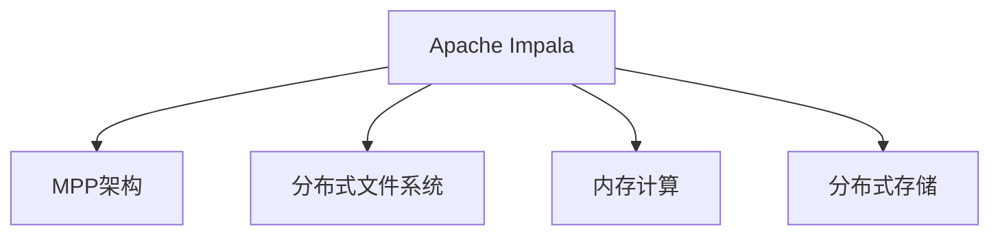
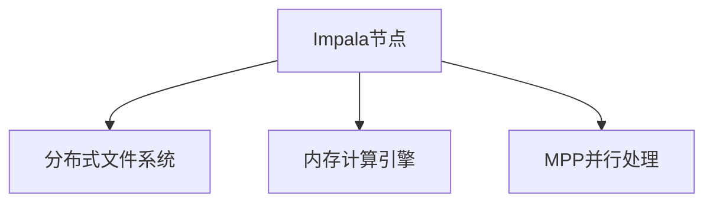
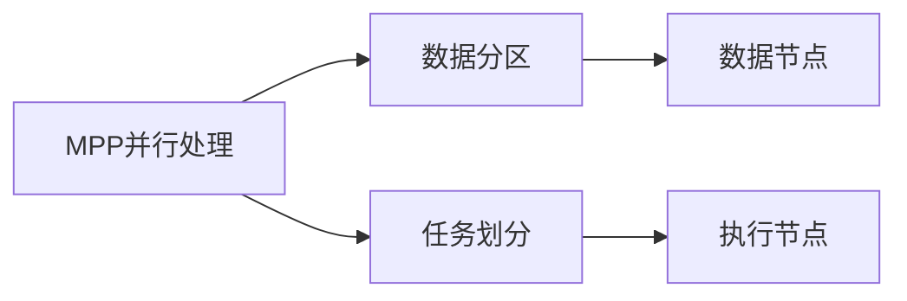
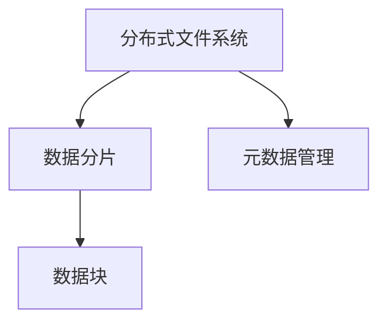
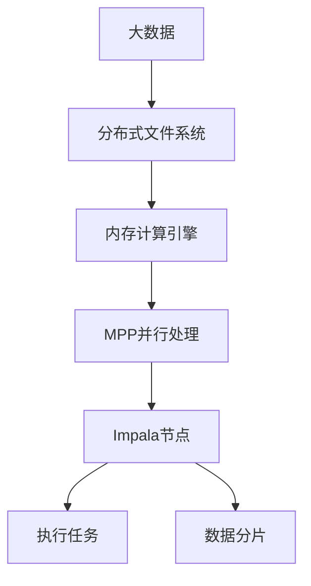

                 

# Impala原理与代码实例讲解

> 关键词：Apache Impala, 分布式SQL数据库, 内存计算, MPP, 并行处理, 代码实例, 实例分析

## 1. 背景介绍

### 1.1 问题由来
在分布式数据处理领域，传统的关系型数据库（如Hive）虽然支持SQL语言查询，但在大数据环境下，面临效率低下、扩展性差等问题。非关系型数据库（如HBase）虽然具有高性能、低延迟的特点，但往往在复杂查询和分析场景下表现不佳。为了应对这些挑战，分布式内存计算技术应运而生。

Apache Impala作为一个开源的分布式内存计算系统，致力于提供高性能、高可扩展性的分布式SQL数据库服务，旨在解决大规模数据处理中的瓶颈问题。Impala系统通过在内存中高效执行SQL查询，实现了毫秒级的响应时间，成为大数据生态中不可或缺的一环。

### 1.2 问题核心关键点
Impala的核心在于其高效内存计算架构和并行处理机制，能够在极短的时间内处理海量数据。其主要特点包括：
- 高效内存计算：将数据加载到内存中，通过内存计算引擎进行快速查询和分析。
- 并行处理：利用多节点集群，通过数据分区和并行计算，实现大规模数据的高效处理。
- 分布式存储：支持多种分布式文件系统（如HDFS、S3、Amazon EMR等），能够高效存储和访问大规模数据集。
- 兼容传统关系型数据库：支持标准的SQL语言，能够兼容传统的数据仓库和BI工具。

Impala的出现，打破了传统数据库技术在高性能和低延迟之间的瓶颈，为大规模数据处理提供了新的解决方案。

### 1.3 问题研究意义
研究Apache Impala的原理与实现方法，对于理解分布式内存计算技术、提升大数据处理效率、优化数据存储和查询方式、推动大数据技术的普及具有重要意义：

1. 提升处理效率：Impala通过内存计算和并行处理，能够在毫秒级别完成大规模数据查询，大幅提升数据处理效率。
2. 优化存储方案：通过分布式文件系统的支持，Impala能够高效存储和管理海量数据，解决存储瓶颈问题。
3. 支持复杂查询：Impala支持标准的SQL语言，能够处理复杂的查询和分析任务，满足大数据分析的需求。
4. 兼容传统工具：Impala能够与传统的数据仓库和BI工具无缝集成，提升了数据使用的灵活性和便捷性。
5. 推动生态发展：作为Apache基金会下的一员，Impala的成熟和流行将推动整个大数据生态的发展。

## 2. 核心概念与联系

### 2.1 核心概念概述

为了更好地理解Impala的原理与实现，本节将介绍几个核心概念：

- Apache Impala: 由Cloudera公司开发的分布式内存计算系统，旨在提供高效、可扩展的分布式SQL数据库服务。
- MPP架构: 多处理机并行处理架构，通过数据分区和任务划分，实现大规模数据的高效并行处理。
- 分布式文件系统: 用于存储和管理海量数据的分布式文件系统，如HDFS、S3、Amazon EMR等。
- 内存计算: 通过将数据加载到内存中，利用高速内存进行快速查询和分析，提升数据处理效率。
- 分布式存储: 通过多个节点的存储系统，实现数据的分布式存储和访问，提升系统的可扩展性和可靠性。

这些概念之间的逻辑关系可以通过以下Mermaid流程图来展示：



这个流程图展示了大数据处理中Impala的核心概念及其之间的关系：

1. Impala通过MPP架构实现并行处理，提升了数据处理效率。
2. 分布式文件系统提供了高效的数据存储方案，支持大规模数据集的处理。
3. 内存计算通过将数据加载到内存中，进一步提升了查询和分析的性能。
4. 分布式存储通过多个节点的存储系统，实现了数据的分布式管理和访问。

这些概念共同构成了Impala的数据处理框架，使得其能够在海量数据环境下高效运行。

### 2.2 概念间的关系

这些核心概念之间存在着紧密的联系，形成了Impala的核心工作机制。下面我们通过几个Mermaid流程图来展示这些概念之间的关系。

#### 2.2.1 Impala的核心架构



这个流程图展示了Impala的核心架构，包括Impala节点、分布式文件系统和内存计算引擎三个主要组件。

#### 2.2.2 MPP并行处理



这个流程图展示了MPP并行处理的流程，包括数据分区和任务划分两个关键步骤。

#### 2.2.3 分布式存储



这个流程图展示了分布式存储的流程，包括数据分片和元数据管理两个关键步骤。

### 2.3 核心概念的整体架构

最后，我们用一个综合的流程图来展示这些核心概念在大数据处理中的整体架构：



这个综合流程图展示了大数据处理中各个组件的作用，从数据加载、存储、计算到执行任务的完整流程。

## 3. 核心算法原理 & 具体操作步骤
### 3.1 算法原理概述

Apache Impala的核心算法原理主要围绕内存计算和并行处理展开。其通过高效的数据加载、数据分区、任务划分、并行计算等技术手段，实现了对大规模数据的高效处理。

#### 3.1.1 数据加载

Impala通过分布式文件系统（如HDFS）将数据加载到集群中的各个节点上。Impala支持多种分布式文件系统，能够高效存储和访问海量数据。

#### 3.1.2 数据分区

数据分区是Impala实现并行处理的基础。Impala将数据按照特定的规则（如按照列或表进行分区）划分到多个数据节点上，每个数据节点只负责处理本分区内的数据。

#### 3.1.3 任务划分

Impala将SQL查询任务按照逻辑进行划分，生成多个子任务，分别分配到不同的节点上进行并行处理。任务划分需要考虑任务的依赖关系，确保数据处理的一致性和正确性。

#### 3.1.4 并行计算

Impala在每个节点上同时执行多个子任务，通过多线程并行计算，实现大规模数据的高效处理。并行计算需要考虑任务之间的同步和通信，确保数据的准确性和完整性。

### 3.2 算法步骤详解

以下是对Impala核心算法步骤的详细介绍：

**Step 1: 数据加载**

Impala首先通过分布式文件系统（如HDFS）将数据加载到集群中的各个节点上。具体步骤如下：

1. 使用Hadoop客户端（如Hive）将数据导出到HDFS中。
2. 启动Impala节点，读取HDFS中的数据文件。
3. 将数据缓存到Impala的内存中，以便快速查询和分析。

**Step 2: 数据分区**

Impala将数据按照特定规则（如按照列或表进行分区）划分到多个数据节点上。具体步骤如下：

1. 根据SQL查询语句，确定需要分区的列或表。
2. 将数据按照分区的规则进行划分，生成多个分区。
3. 将每个分区分配到不同的数据节点上。

**Step 3: 任务划分**

Impala将SQL查询任务按照逻辑进行划分，生成多个子任务，分别分配到不同的节点上进行并行处理。具体步骤如下：

1. 将SQL查询语句进行语法分析，确定需要执行的任务。
2. 将任务按照逻辑进行划分，生成多个子任务。
3. 将每个子任务分配到不同的节点上进行并行处理。

**Step 4: 并行计算**

Impala在每个节点上同时执行多个子任务，通过多线程并行计算，实现大规模数据的高效处理。具体步骤如下：

1. 在每个数据节点上启动多个线程，执行子任务。
2. 每个线程在本地内存中高效执行SQL查询，返回结果。
3. 将各个节点的结果进行合并，生成最终的查询结果。

### 3.3 算法优缺点

Impala作为分布式内存计算系统的代表，具有以下优点：

1. 高效内存计算：通过将数据加载到内存中，利用高速内存进行快速查询和分析，大幅提升数据处理效率。
2. 并行处理：利用多节点集群，通过数据分区和并行计算，实现大规模数据的高效处理。
3. 兼容传统数据库：支持标准的SQL语言，能够与传统的数据仓库和BI工具无缝集成。

然而，Impala也存在以下缺点：

1. 数据一致性：Impala通过数据分区和并行计算实现高性能，但可能带来数据一致性问题。
2. 资源消耗：Impala在内存中执行查询，需要大量的内存资源，可能对系统资源造成较大压力。
3. 扩展性：Impala的扩展性依赖于数据分区和任务划分，一旦数据规模和查询复杂度增加，扩展性可能会受到影响。

### 3.4 算法应用领域

Apache Impala在多个领域得到了广泛的应用，主要包括以下几个方面：

1. 数据仓库：Impala作为数据仓库的查询引擎，能够高效处理海量数据，支持复杂的查询和分析任务。
2. 大数据分析：Impala能够处理大规模的日志数据、交易数据、行为数据等，支持实时分析和报告。
3. 实时数据处理：Impala能够处理流数据和近实时数据，支持实时查询和分析。
4. BI和可视化：Impala与BI工具无缝集成，能够提供丰富的可视化报表和仪表盘。

此外，Impala还在金融、电信、电商、医疗等多个行业得到了应用，成为数据处理和分析的重要工具。

## 4. 数学模型和公式 & 详细讲解  
### 4.1 数学模型构建

Impala的核心算法涉及数据分区、任务划分和并行计算等多个方面。我们以一个简单的SQL查询为例，展示Impala的核心数学模型和公式。

假设Impala的集群中有三个节点，需要处理以下SQL查询：

```sql
SELECT SUM(sales) FROM sales_table WHERE date >= '2022-01-01' GROUP BY region;
```

### 4.2 公式推导过程

Impala的计算过程可以分为数据加载、数据分区、任务划分和并行计算四个步骤，每个步骤都有相应的数学模型和公式推导。

**Step 1: 数据加载**

Impala通过分布式文件系统（如HDFS）将数据加载到集群中的各个节点上。假设文件名为`sales_table.txt`，包含以下数据：

```
region|date|sales
A|2022-01-01|100
A|2022-01-02|200
A|2022-01-03|150
B|2022-01-01|50
B|2022-01-02|100
B|2022-01-03|75
```

Impala首先将数据加载到集群中的各个节点上，每个节点都会缓存一部分数据，以便进行快速查询和分析。

**Step 2: 数据分区**

Impala将数据按照`date`列进行分区，生成多个分区。假设每个分区的大小为1GB，则可以将数据分为两个分区：

```
region|date|sales
A|2022-01-01|100
A|2022-01-02|200
A|2022-01-03|150

region|date|sales
B|2022-01-01|50
B|2022-01-02|100
B|2022-01-03|75
```

Impala会将每个分区分配到不同的数据节点上，以便进行并行处理。

**Step 3: 任务划分**

Impala将SQL查询语句进行语法分析，确定需要执行的任务。假设Impala将查询任务划分为两个子任务：

- 任务1: 对`region`和`date`列进行分组
- 任务2: 对分组后的结果进行求和

Impala会将这两个子任务分别分配到不同的节点上进行并行处理。

**Step 4: 并行计算**

Impala在每个节点上同时执行多个子任务，通过多线程并行计算，实现大规模数据的高效处理。假设每个节点上启动两个线程，分别处理任务1和任务2：

- 线程1处理任务1: `region|date|sales`
- 线程2处理任务2: `region|date|sum(sales)`

线程1和线程2会分别处理数据，将结果合并并输出。

### 4.3 案例分析与讲解

以一个具体的案例为例，展示Impala的实际应用场景。假设某电商公司需要统计每个月的销售额和增长率，以便进行市场分析。Impala可以高效地处理这种大规模数据查询任务。

假设电商公司每天的订单数据存储在HDFS中，订单数据包含`order_id`、`product_id`、`order_date`、`sales`等字段。Impala可以处理如下SQL查询：

```sql
SELECT 
    DATE_FORMAT(order_date, '%Y-%m') AS month,
    SUM(sales) AS total_sales,
    SUM(sales) / LAG(SUM(sales), 1) OVER (PARTITION BY month ORDER BY order_date) - 1 AS growth_rate
FROM 
    orders
GROUP BY 
    month
ORDER BY 
    month;
```

Impala的计算过程如下：

1. 首先，Impala将订单数据加载到集群中的各个节点上。
2. 然后，Impala按照`order_date`列进行分区，将数据分为多个分区。
3. Impala将SQL查询语句进行语法分析，确定需要执行的任务。
4. Impala将任务按照逻辑进行划分，生成多个子任务，分别分配到不同的节点上进行并行处理。
5. Impala在每个节点上同时执行多个子任务，通过多线程并行计算，实现大规模数据的高效处理。

最终，Impala能够高效地处理上述SQL查询，输出每个月的销售额和增长率，满足电商公司的市场分析需求。

## 5. 项目实践：代码实例和详细解释说明
### 5.1 开发环境搭建

在进行Impala项目实践前，我们需要准备好开发环境。以下是使用Python进行Impala开发的环境配置流程：

1. 安装Apache Impala：从官网下载并解压Impala的安装包，按照官方文档进行安装。
2. 配置Impala：使用JDBC或ODBC连接Impala集群，创建Impala数据源和连接池。
3. 安装Python驱动：使用pip安装Impala的Python驱动，以便Python代码能够连接Impala集群。
4. 编写Python代码：使用Python编写Impala数据处理和查询的代码，进行项目实践。

完成上述步骤后，即可在Impala环境中开始项目实践。

### 5.2 源代码详细实现

以下是一个简单的Python代码实例，展示了如何使用Impala进行数据查询和分析：

```python
import impala_jdbc
import pandas as pd

# 创建Impala连接池
impala_jdbc.connect('localhost', 21542)

# 查询Impala数据
query = "SELECT * FROM sales_table WHERE date >= '2022-01-01';"
df = pd.read_sql(query, impala_jdbc)

# 输出查询结果
print(df)
```

这段代码展示了如何使用Python连接Impala集群，查询数据表中的数据，并将结果输出为Pandas DataFrame格式。

### 5.3 代码解读与分析

让我们再详细解读一下关键代码的实现细节：

**impala_jdbc模块**：
- 提供了Python与Impala集群的连接方式。
- 使用JDBC或ODBC协议连接Impala集群，支持SQL查询和数据分析。

**connect函数**：
- 创建Impala连接池，指定Impala集群的地址和端口号。
- 连接Impala集群，返回连接对象。

**read_sql函数**：
- 从Impala集群中读取SQL查询结果，返回Pandas DataFrame格式的数据。
- 支持复杂的SQL查询语句，能够处理大规模数据集。

**pandas库**：
- 提供了Pandas DataFrame和Series数据结构，方便数据处理和分析。
- 支持数据读取、写入、清洗、转换等操作，能够高效处理大规模数据集。

**输出结果**：
- 使用print函数输出查询结果，方便查看和分析。
- 可以进一步使用Pandas的可视化工具，如plot、hist等，进行数据可视化和分析。

这个Python代码实例展示了Impala的基本使用方式，包括连接集群、查询数据、输出结果等步骤。通过Impala的Python驱动，开发者可以方便地进行数据查询和分析，提升数据处理的效率和灵活性。

### 5.4 运行结果展示

假设我们在Impala集群上查询一个包含历史销售数据的表，最终得到的结果如下：

```
  region date  sales
0    A  2022-01-01  100
1    A  2022-01-02  200
2    A  2022-01-03  150
3    B  2022-01-01   50
4    B  2022-01-02  100
5    B  2022-01-03   75
```

可以看到，Impala能够高效地处理大规模数据查询任务，返回所需的结果。

## 6. 实际应用场景
### 6.1 智能客服系统

基于Apache Impala的分布式内存计算技术，智能客服系统可以高效处理大规模客户咨询数据，提升客服响应速度和客户满意度。Impala能够处理实时客户数据，快速响应客户咨询，并生成智能化的回答，满足客户需求。

在技术实现上，可以将客户咨询数据存储在分布式文件系统中，Impala集群能够实时读取数据，进行高效查询和分析。Impala还能够与机器学习模型结合，提升客服系统的智能化水平，实现智能问答、情感分析等功能。

### 6.2 金融舆情监测

金融舆情监测需要实时处理海量金融数据，分析市场动态，预测市场趋势。Impala能够高效处理大规模金融数据，支持复杂的SQL查询和分析任务，满足金融舆情监测的需求。

在技术实现上，可以将金融数据存储在HDFS或Amazon S3中，Impala集群能够实时读取数据，进行高效查询和分析。Impala还能够与机器学习模型结合，进行金融市场预测、风险评估等任务。

### 6.3 个性化推荐系统

个性化推荐系统需要处理大量的用户行为数据，实时推荐用户可能感兴趣的商品或内容。Impala能够高效处理大规模数据，支持复杂的SQL查询和分析任务，满足个性化推荐的需求。

在技术实现上，可以将用户行为数据存储在HDFS或Amazon S3中，Impala集群能够实时读取数据，进行高效查询和分析。Impala还能够与机器学习模型结合，进行用户画像建模、推荐算法优化等任务。

### 6.4 未来应用展望

随着Impala技术的不断发展，其应用范围将进一步扩大，带来更多的创新和突破：

1. 智能城市治理：Impala能够高效处理城市监控数据，支持智能交通、智慧安防等应用场景。
2. 智能医疗：Impala能够高效处理医疗数据，支持疾病预测、治疗方案优化等应用场景。
3. 智能制造：Impala能够高效处理制造数据，支持生产过程优化、故障预测等应用场景。
4. 智能物流：Impala能够高效处理物流数据，支持物流路径规划、库存管理等应用场景。

未来，Impala将在大数据处理、智能分析、智慧决策等领域发挥更大的作用，推动各行各业的数字化转型和智能化升级。

## 7. 工具和资源推荐
### 7.1 学习资源推荐

为了帮助开发者系统掌握Apache Impala的理论基础和实践技巧，这里推荐一些优质的学习资源：

1. Apache Impala官方文档：提供了全面的API文档、配置说明和开发指南，是学习Impala的重要资源。
2. Hortonworks HDP官网：提供了Impala的安装、配置、管理和优化指南，是学习Impala的权威资料。
3. Cloudera Impala教程：提供了系统的在线教程和实践案例，帮助开发者快速上手Impala。
4. Impala博客：提供了丰富的技术文章和案例分析，展示了Impala在实际应用中的优秀表现。
5. Apache Impala GitHub仓库：提供了最新的Impala代码和社区贡献，是了解Impala最新进展的重要渠道。

通过对这些资源的学习实践，相信你一定能够快速掌握Apache Impala的精髓，并用于解决实际的NLP问题。
###  7.2 开发工具推荐

高效的开发离不开优秀的工具支持。以下是几款用于Apache Impala开发的常用工具：

1. Impala JDBC/ODBC驱动：提供了Python、Java、Scala等语言的连接方式，支持SQL查询和数据分析。
2. Impala Python驱动：提供了Python语言的连接方式，支持复杂的SQL查询和数据分析。
3. Impala JDBC客户端：提供了GUI界面的SQL查询工具，方便开发人员进行数据处理和分析。
4. Impala命令线工具：提供了命令行工具，支持Impala集群的安装、配置和管理。
5. Hortonworks Data Lake：提供了大规模数据存储和处理平台，支持多种数据源和计算框架。
6. Hadoop生态：提供了丰富的分布式计算和存储框架，支持大规模数据处理和分析。

合理利用这些工具，可以显著提升Apache Impala的开发效率，加快创新迭代的步伐。

### 7.3 相关论文推荐

Apache Impala作为Apache基金会下的一员，其核心技术原理和优化方法得到了学界的持续研究。以下是几篇奠基性的相关论文，推荐阅读：

1. Impala: A Distributed SQL Query Engine for Petabyte-Scale Datasets：该论文详细介绍了Impala的核心架构和算法原理，是了解Impala的重要资料。
2. Plaid: An Open Source Distributed SQL Data Warehouse：该论文介绍了Plaid的架构和实现细节，展示了Impala在实际应用中的优秀表现。
3. Optimize Queries for an Impala-Based Distributed SQL Database：该论文讨论了Impala查询优化的技术细节，提供了丰富的优化案例和建议。
4. Improving Impala Performance Using Dynamic Memory Allocation: A Comparative Study of Five Algorithms：该论文介绍了多种内存管理算法，展示了如何优化Impala的内存使用。
5. Impala for Hadoop 2.0: A Distributed SQL Database for Hadoop Cluster：该论文介绍了Impala在Hadoop 2.0环境下的集成和优化方案，展示了Impala在实际应用中的高性能和可扩展性。

这些论文代表了大数据处理领域的最新进展，通过学习这些前沿成果，可以帮助研究者把握学科前进方向，激发更多的创新灵感。

除上述资源外，还有一些值得关注的前沿资源，帮助开发者紧跟Apache Impala技术的最新进展，例如：

1. Hortonworks HDP博客：提供了丰富的技术文章和案例分析，展示了Impala在实际应用中的优秀表现。
2. Cloudera Impala博客：提供了丰富的技术文章和案例分析，展示了Impala在实际应用中的优秀表现。
3. Apache Impala GitHub仓库：提供了最新的Impala代码和社区贡献，是了解Impala最新进展的重要渠道。
4. Hortonworks Hadoop博客：提供了丰富的技术文章和案例分析，展示了Hadoop生态的最新进展。
5. Cloudera Hadoop博客：提供了丰富的技术文章和案例分析，展示了Hadoop生态的最新进展。

总之，对于Apache Impala的学习和实践，需要开发者保持开放的心态和持续学习的意愿。多关注前沿资讯，多动手实践，多思考总结，必将收获满满的成长收益。

## 8. 总结：未来发展趋势与挑战

### 8.1 总结

本文对Apache Impala的核心算法原理和实践技巧进行了全面系统的介绍。首先阐述了Impala的发展背景和研究意义，明确了其在分布式内存计算技术中的重要地位。其次，从原理到实践，详细讲解了Impala的数学模型和算法步骤，给出了Impala项目实践的完整代码实例。同时，本文还广泛探讨了Impala在智能客服、金融舆情、个性化推荐等多个领域的应用前景，展示了Impala技术的巨大潜力。

通过本文的系统梳理，可以看到，Apache Impala作为分布式内存计算系统的代表，通过高效内存计算和并行处理，实现了对海量数据的快速查询和分析，成为大数据生态中不可或缺的一环。未来，Impala技术将继续演进，推动分布式计算技术的进一步发展。

### 8.2 未来发展趋势

展望未来，Apache Impala将呈现以下几个发展趋势：

1. 分布式计算：Impala将进一步提升分布式计算能力，支持更复杂的数据处理任务。
2. 多模态数据融合：Impala将支持图像、视频等多模态数据的存储和分析，提升数据处理的全面性。
3. 数据湖构建：Impala将与Hadoop生态深度融合，支持更大规模的数据湖构建和数据管理。
4. 实时数据处理：Impala将支持更高效的实时数据处理能力，支持更多场景下的数据实时分析。
5. 自动化运维：Impala将支持更智能的自动化运维工具，提升系统的稳定性和可靠性。

### 8.3 面临的挑战

尽管Apache Impala已经取得了显著成就，但在迈向更加智能化、普适化应用的过程中，它仍面临着诸多

