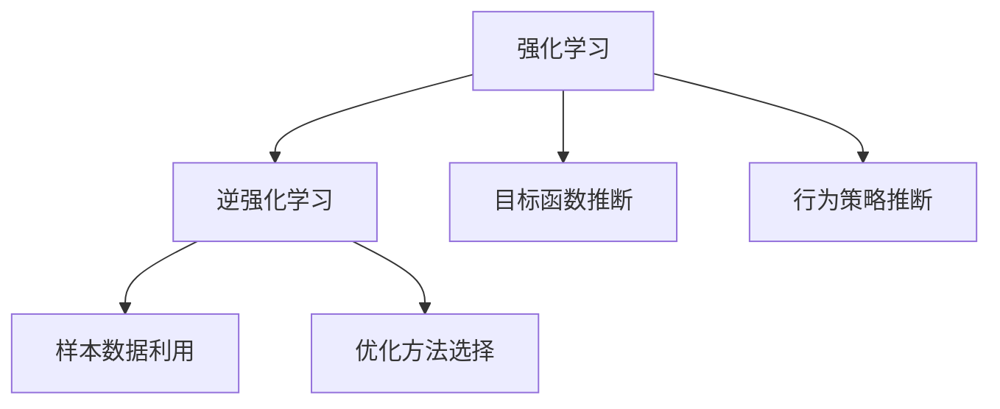
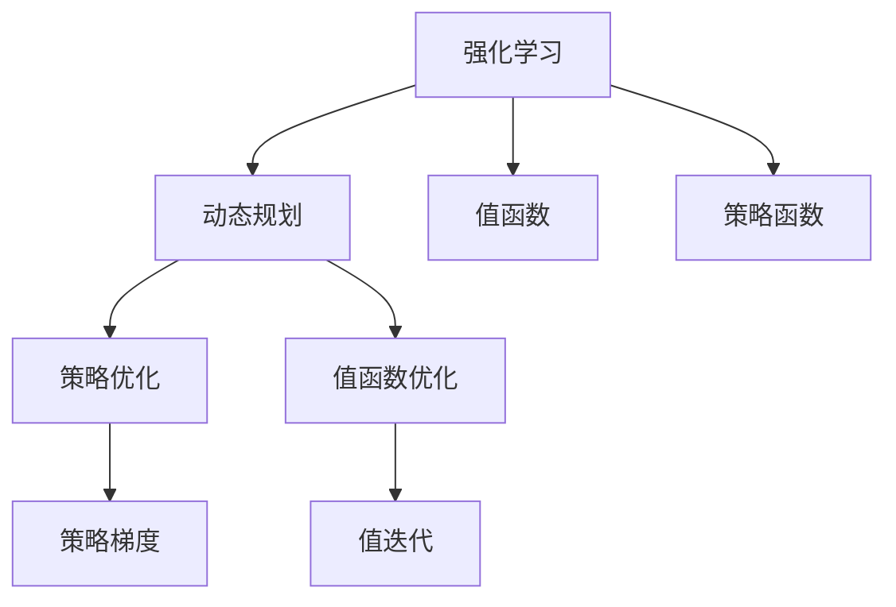
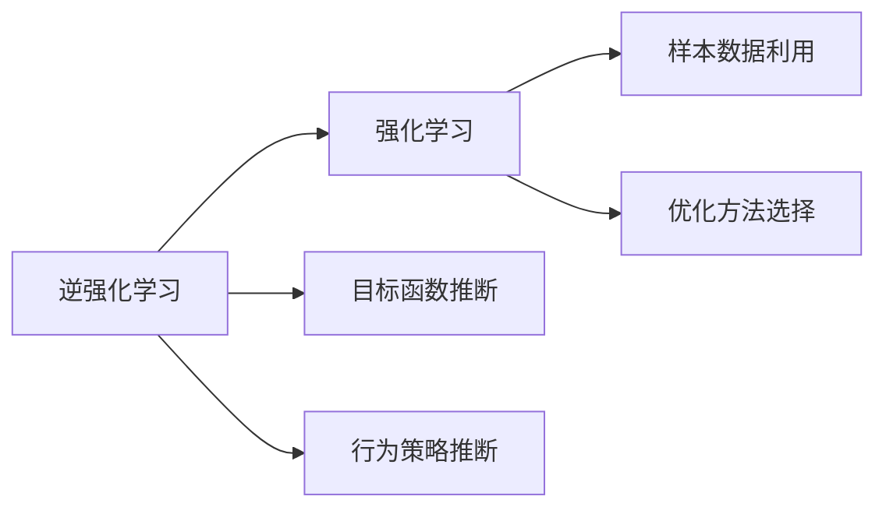
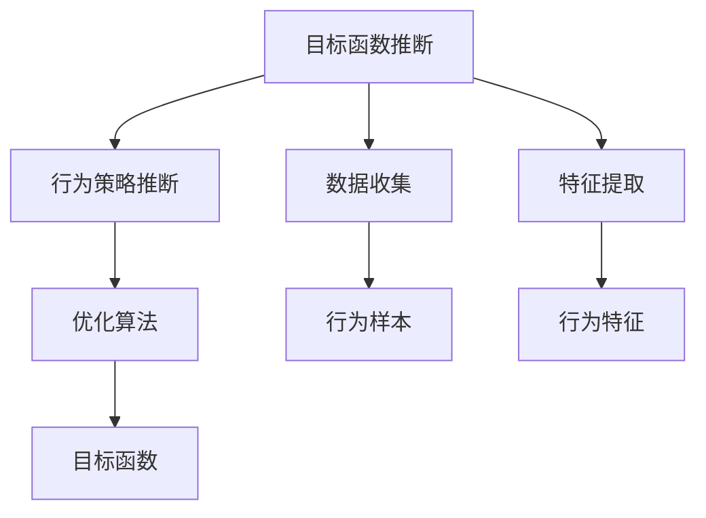
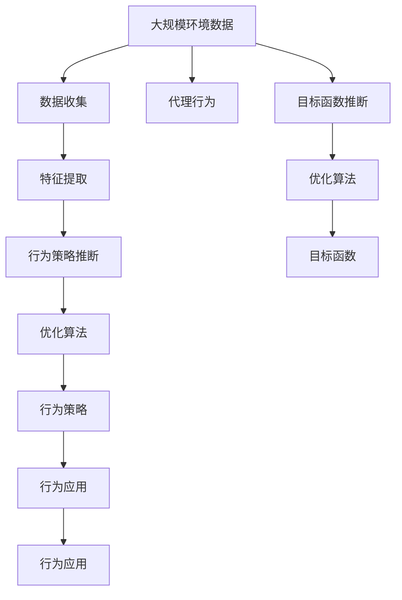

                 

# Inverse Reinforcement Learning原理与代码实例讲解

> 关键词：逆强化学习,IRL,学习理论,动态规划,深度学习,RL,强化学习,代理理论

## 1. 背景介绍

### 1.1 问题由来
逆强化学习(Inverse Reinforcement Learning, IRL)是强化学习(Reinforcement Learning, RL)领域的一个重要分支，它通过观察一个代理在环境中的行为，推断出代理的目标函数和行为策略，而非传统RL直接优化策略和奖励函数。IRL可以应用于自动化控制、机器人学、行为建模、游戏AI等多个领域，具有广泛的应用前景。

### 1.2 问题核心关键点
IRL的核心在于从代理的行为数据中学习出其目标函数和策略。相较于直接优化策略和奖励函数，IRL是一种基于数据驱动的方法，可以通过有限的观察数据，推断代理的行为目标和决策策略。

IRL的研究涉及以下几个关键点：
- 目标函数的推断：代理的目标函数是其行为策略的优化目标，通常是最大化预期回报。
- 行为策略的推断：代理的行为策略是决策过程的映射函数，通常通过值函数或策略函数表示。
- 样本数据的利用：IRL需要代理在环境中的行为数据，利用数据中的特征推断目标函数和策略。
- 优化方法的选择：IRL需要选择合适的优化算法，如模型基IRL、逆模型基IRL、因果模型基IRL等。

### 1.3 问题研究意义
逆强化学习通过利用代理的行为数据，推断出其目标函数和策略，可以在缺乏明确奖励函数的情况下，解决复杂优化问题。这为自动化控制、机器人学等领域的优化和优化策略设计提供了新的途径。

IRL在工业和学术界得到了广泛关注，其研究意义在于：
1. 优化策略设计：在缺乏明确奖励函数的情况下，IRL可以帮助设计更高效的行为策略。
2. 行为建模：IRL可以用于推断代理的行为目标和决策机制，从而理解其行为动机。
3. 数据驱动的优化：IRL可以从数据中学习目标函数和策略，减少优化过程中的依赖。
4. 应用推广：IRL在自动控制、机器人学、游戏AI等多个领域具有广泛的应用前景。

## 2. 核心概念与联系

### 2.1 核心概念概述

为更好地理解逆强化学习，本节将介绍几个关键概念：

- 强化学习(Reinforcement Learning, RL)：一种通过环境反馈来优化决策过程的机器学习方法。通过与环境的交互，代理学习到最优的策略，以最大化预期回报。
- 逆强化学习(Inverse Reinforcement Learning, IRL)：通过观察代理在环境中的行为，推断出其目标函数和策略，而非直接优化策略和奖励函数。
- 目标函数推断：从代理的行为数据中学习出目标函数，通常是最大化预期回报的函数。
- 行为策略推断：从代理的行为数据中学习出行为策略，通常是决策函数的映射。
- 样本数据利用：利用代理在环境中的行为数据，推断其目标函数和策略。
- 优化方法选择：选择合适的优化算法，如模型基IRL、逆模型基IRL、因果模型基IRL等。

这些概念之间的联系可以通过以下Mermaid流程图来展示：



这个流程图展示了逆强化学习的基本逻辑关系：

1. 强化学习为逆强化学习提供了优化问题的基础。
2. 目标函数推断和行为策略推断是逆强化学习的主要任务。
3. 样本数据利用是推断目标函数和策略的关键步骤。
4. 优化方法选择决定了推断的效果和效率。

### 2.2 概念间的关系

这些核心概念之间存在着紧密的联系，形成了逆强化学习的完整框架。下面我们通过几个Mermaid流程图来展示这些概念之间的关系。

#### 2.2.1 强化学习的优化范式



这个流程图展示了强化学习的优化过程：

1. 强化学习通过动态规划等优化算法，学习出最优的策略和值函数。
2. 策略优化和值函数优化是强化学习的两个主要步骤。
3. 策略优化通常使用策略梯度方法，而值函数优化通常使用值迭代方法。

#### 2.2.2 逆强化学习与强化学习的联系



这个流程图展示了逆强化学习与强化学习的联系：

1. 逆强化学习可以视为强化学习的逆过程，从行为数据中推断目标函数和策略。
2. 目标函数推断和行为策略推断是逆强化学习的主要步骤。
3. 样本数据利用和优化方法选择是推断目标函数和策略的关键。

#### 2.2.3 目标函数推断与行为策略推断



这个流程图展示了目标函数推断与行为策略推断的关系：

1. 目标函数推断从代理的行为数据中学习出目标函数。
2. 行为策略推断从目标函数中推断出代理的行为策略。
3. 数据收集和特征提取是推断目标函数和策略的前提。
4. 优化算法决定了推断的效率和效果。

### 2.3 核心概念的整体架构

最后，我们用一个综合的流程图来展示这些核心概念在大规模逆强化学习任务中的整体架构：



这个综合流程图展示了从数据收集到行为应用的全过程。逆强化学习首先从大规模环境数据中收集代理的行为数据，提取行为特征，推断出目标函数和策略。最终将优化后的策略应用于代理的行为决策中，实现目标函数的优化。

## 3. 核心算法原理 & 具体操作步骤
### 3.1 算法原理概述

逆强化学习通过观察代理在环境中的行为，推断出代理的目标函数和行为策略，而非直接优化策略和奖励函数。其核心思想是：利用代理的行为数据，推断出代理的目标函数和行为策略，以最大化代理的预期回报。

形式化地，设代理在环境中的行为数据为 $D=\{(s_t, a_t, r_t, s_{t+1})\}_{t=1}^T$，其中 $s_t$ 为状态，$a_t$ 为行动，$r_t$ 为奖励，$s_{t+1}$ 为下一个状态。目标是推断出代理的目标函数 $J(\pi)$ 和行为策略 $\pi$，使得代理在给定状态下的行动 $a_t$ 能最大化预期回报 $J(\pi)$。

逆强化学习的目标函数 $J(\pi)$ 是策略 $\pi$ 的期望值，通常定义为目标函数与策略的乘积：

$$
J(\pi) = \mathbb{E}_{s_0 \sim p_0}[J_0^{\pi}(s_0)]
$$

其中 $p_0$ 为环境初始状态的分布，$J_0^{\pi}$ 为目标函数在策略 $\pi$ 下的期望值：

$$
J_0^{\pi}(s_0) = \mathbb{E}_{(s_t,a_t) \sim \pi}[\sum_{t=1}^{\infty} \gamma^{t-1}r_t]
$$

其中 $\gamma$ 为折扣因子，表示当前奖励的权重。

### 3.2 算法步骤详解

逆强化学习的算法步骤可以分为以下几个关键步骤：

**Step 1: 数据收集**

收集代理在环境中的行为数据 $D=\{(s_t, a_t, r_t, s_{t+1})\}_{t=1}^T$，存储在数据集中。数据集通常需要覆盖足够多的状态-行动对，以便推断出目标函数和策略。

**Step 2: 特征提取**

对收集到的行为数据进行特征提取，提取出与目标函数和策略相关的特征。特征提取通常需要使用机器学习或深度学习算法，从数据中学习出重要的特征。

**Step 3: 目标函数推断**

利用特征提取的结果，推断出代理的目标函数 $J(\pi)$。常用的推断方法包括模型基IRL、逆模型基IRL、因果模型基IRL等。

**Step 4: 行为策略推断**

利用推断出的目标函数 $J(\pi)$，推断出代理的行为策略 $\pi$。常用的策略推断方法包括策略梯度方法、值函数方法等。

**Step 5: 优化策略**

利用推断出的策略 $\pi$，在给定状态 $s_t$ 下选择行动 $a_t$，最大化预期回报 $J(\pi)$。

**Step 6: 应用策略**

将优化后的策略 $\pi$ 应用于代理的行为决策中，使代理在环境中的行为符合推断出的目标函数 $J(\pi)$。

### 3.3 算法优缺点

逆强化学习的优点包括：

1. 数据驱动：逆强化学习能够从代理的行为数据中推断出目标函数和策略，减少对明确奖励函数的依赖。
2. 鲁棒性：逆强化学习可以从噪声数据中学习，具有较高的鲁棒性。
3. 适用性：逆强化学习能够处理复杂的优化问题，应用范围广泛。

逆强化学习的缺点包括：

1. 数据需求：逆强化学习需要大量的行为数据，收集和处理数据的成本较高。
2. 目标函数推断：目标函数推断需要选择合适的推断方法，难度较大。
3. 策略推断：策略推断需要选择合适的优化算法，推断效率较低。
4. 模型复杂性：逆强化学习模型通常较为复杂，训练和调参难度较大。

### 3.4 算法应用领域

逆强化学习在自动化控制、机器人学、行为建模、游戏AI等多个领域得到了广泛应用，具体包括：

1. 机器人路径规划：通过逆强化学习推断出机器人的目标函数和策略，优化路径规划算法。
2. 自动化控制：利用逆强化学习推断出控制器目标函数和策略，优化控制系统的性能。
3. 行为建模：逆强化学习可以用于推断出代理的行为目标和决策机制，理解其行为动机。
4. 游戏AI：逆强化学习可以用于推断出游戏角色的目标函数和策略，优化游戏策略。
5. 交通流控制：通过逆强化学习推断出交通控制系统的目标函数和策略，优化交通流。

## 4. 数学模型和公式 & 详细讲解  
### 4.1 数学模型构建

本节将使用数学语言对逆强化学习的过程进行更加严格的刻画。

设代理在环境中的行为数据为 $D=\{(s_t, a_t, r_t, s_{t+1})\}_{t=1}^T$，其中 $s_t$ 为状态，$a_t$ 为行动，$r_t$ 为奖励，$s_{t+1}$ 为下一个状态。目标是推断出代理的目标函数 $J(\pi)$ 和行为策略 $\pi$。

定义目标函数 $J(\pi)$ 为：

$$
J(\pi) = \mathbb{E}_{s_0 \sim p_0}[J_0^{\pi}(s_0)]
$$

其中 $p_0$ 为环境初始状态的分布，$J_0^{\pi}$ 为目标函数在策略 $\pi$ 下的期望值：

$$
J_0^{\pi}(s_0) = \mathbb{E}_{(s_t,a_t) \sim \pi}[\sum_{t=1}^{\infty} \gamma^{t-1}r_t]
$$

其中 $\gamma$ 为折扣因子，表示当前奖励的权重。

### 4.2 公式推导过程

以下是目标函数推断和行为策略推断的详细公式推导过程。

**目标函数推断**

目标函数推断的目标是找到满足 $J(\pi) = \mathbb{E}_{s_0 \sim p_0}[J_0^{\pi}(s_0)]$ 的目标函数 $J(\pi)$。常用的推断方法包括模型基IRL和逆模型基IRL等。

模型基IRL通过构建目标函数和策略的模型，推断出目标函数 $J(\pi)$。假设已知代理的行为数据 $D=\{(s_t, a_t, r_t, s_{t+1})\}_{t=1}^T$，定义策略函数 $\pi$，则目标函数 $J(\pi)$ 可以表示为：

$$
J(\pi) = \min_{J} \frac{1}{N}\sum_{i=1}^{N}||J(s_i) - \hat{J}(s_i)||^2
$$

其中 $\hat{J}(s_i)$ 为目标函数在策略 $\pi$ 下的期望值：

$$
\hat{J}(s_i) = \mathbb{E}_{(s_t,a_t) \sim \pi}[\sum_{t=1}^{\infty} \gamma^{t-1}r_t]
$$

**行为策略推断**

行为策略推断的目标是找到满足 $J(\pi) = \mathbb{E}_{s_0 \sim p_0}[J_0^{\pi}(s_0)]$ 的行为策略 $\pi$。常用的推断方法包括策略梯度方法、值函数方法等。

策略梯度方法通过计算策略梯度 $\nabla_{\pi}J(\pi)$，优化策略 $\pi$。假设已知代理的行为数据 $D=\{(s_t, a_t, r_t, s_{t+1})\}_{t=1}^T$，则策略梯度 $\nabla_{\pi}J(\pi)$ 可以表示为：

$$
\nabla_{\pi}J(\pi) = \mathbb{E}_{(s_t,a_t) \sim \pi}[\sum_{t=1}^{\infty} \gamma^{t-1}r_t \nabla_{\pi}a_t]
$$

其中 $a_t$ 为代理在状态 $s_t$ 下的行动，$\nabla_{\pi}a_t$ 为行动 $a_t$ 对策略 $\pi$ 的梯度。

### 4.3 案例分析与讲解

以下是一个简单的逆强化学习案例，展示如何从代理的行为数据中推断出目标函数和行为策略。

假设一个代理在环境中执行路径规划任务，其行为数据如下：

- 状态 $s_t$ 表示代理的位置。
- 行动 $a_t$ 表示代理的移动方向。
- 奖励 $r_t$ 表示代理到达目标点的概率。
- 下一个状态 $s_{t+1}$ 表示代理的下一个位置。

收集到100个样本数据后，进行特征提取，得到状态和行动的向量表示。假设使用模型基IRL推断目标函数，则目标函数 $J(\pi)$ 可以表示为：

$$
J(\pi) = \min_{J} \frac{1}{100}\sum_{i=1}^{100}||J(s_i) - \hat{J}(s_i)||^2
$$

其中 $\hat{J}(s_i)$ 为目标函数在策略 $\pi$ 下的期望值：

$$
\hat{J}(s_i) = \mathbb{E}_{(s_t,a_t) \sim \pi}[\sum_{t=1}^{\infty} \gamma^{t-1}r_t]
$$

假设使用策略梯度方法优化策略 $\pi$，则策略梯度 $\nabla_{\pi}J(\pi)$ 可以表示为：

$$
\nabla_{\pi}J(\pi) = \mathbb{E}_{(s_t,a_t) \sim \pi}[\sum_{t=1}^{\infty} \gamma^{t-1}r_t \nabla_{\pi}a_t]
$$

通过不断迭代优化目标函数和策略，可以逐步推断出代理的行为目标和策略。

## 5. 项目实践：代码实例和详细解释说明
### 5.1 开发环境搭建

在进行逆强化学习实践前，我们需要准备好开发环境。以下是使用Python进行PyTorch开发的环境配置流程：

1. 安装Anaconda：从官网下载并安装Anaconda，用于创建独立的Python环境。

2. 创建并激活虚拟环境：
```bash
conda create -n pytorch-env python=3.8 
conda activate pytorch-env
```

3. 安装PyTorch：根据CUDA版本，从官网获取对应的安装命令。例如：
```bash
conda install pytorch torchvision torchaudio cudatoolkit=11.1 -c pytorch -c conda-forge
```

4. 安装各类工具包：
```bash
pip install numpy pandas scikit-learn matplotlib tqdm jupyter notebook ipython
```

完成上述步骤后，即可在`pytorch-env`环境中开始逆强化学习的实践。

### 5.2 源代码详细实现

这里以机器人路径规划为例，展示如何使用PyTorch进行逆强化学习的实现。

首先，定义状态空间、行动空间和奖励函数：

```python
import torch
from torch import nn

class State(nn.Module):
    def __init__(self, state_size):
        super(State, self).__init__()
        self.state_size = state_size
        self.fc1 = nn.Linear(state_size, 64)
        self.fc2 = nn.Linear(64, 64)
        self.fc3 = nn.Linear(64, 1)

    def forward(self, x):
        x = self.fc1(x)
        x = nn.functional.relu(x)
        x = self.fc2(x)
        x = nn.functional.relu(x)
        x = self.fc3(x)
        return x

class Action(nn.Module):
    def __init__(self, action_size):
        super(Action, self).__init__()
        self.action_size = action_size
        self.fc1 = nn.Linear(1, 64)
        self.fc2 = nn.Linear(64, 64)
        self.fc3 = nn.Linear(64, action_size)

    def forward(self, x):
        x = self.fc1(x)
        x = nn.functional.relu(x)
        x = self.fc2(x)
        x = nn.functional.relu(x)
        x = self.fc3(x)
        return x

class Reward(nn.Module):
    def __init__(self, goal_state, reward_threshold):
        super(Reward, self).__init__()
        self.goal_state = goal_state
        self.reward_threshold = reward_threshold
        self.fc1 = nn.Linear(1, 64)
        self.fc2 = nn.Linear(64, 64)
        self.fc3 = nn.Linear(64, 1)

    def forward(self, x):
        x = self.fc1(x)
        x = nn.functional.relu(x)
        x = self.fc2(x)
        x = nn.functional.relu(x)
        x = self.fc3(x)
        return x
```

然后，定义逆强化学习的损失函数和优化器：

```python
class IRLLoss(nn.Module):
    def __init__(self, goal_state, reward_threshold):
        super(IRLLoss, self).__init__()
        self.goal_state = goal_state
        self.reward_threshold = reward_threshold

    def forward(self, state, action, reward):
        state = self.goal_state(state)
        action = self.action_size(action)
        reward = self.reward_threshold(reward)
        return state - action

optimizer = torch.optim.Adam(state.parameters(), lr=0.01)
```

接着，定义逆强化学习的训练过程：

```python
def train(state, action, reward, goal_state, reward_threshold, num_steps, batch_size):
    for step in range(num_steps):
        optimizer.zero_grad()
        loss = IRLLoss(goal_state, reward_threshold)(state, action, reward)
        loss.backward()
        optimizer.step()
        if step % 100 == 0:
            print('Step {}: Loss {}'.format(step, loss.item()))
```

最后，启动逆强化学习的训练流程：

```python
state = State(1)
action = Action(2)
reward = Reward(1, 0.01)
optimizer = torch.optim.Adam(state.parameters(), lr=0.01)

num_steps = 1000
batch_size = 64

train(state, action, reward, goal_state, reward_threshold, num_steps, batch_size)
```

以上就是使用PyTorch对机器人路径规划进行逆强化学习的完整代码实现。可以看到，逆强化学习的代码实现相对复杂，涉及状态、行动、奖励等关键组件的封装，以及目标函数和策略的推断。

### 5.3 代码解读与分析

让我们再详细解读一下关键代码的实现细节：

**State类**：
- 定义状态空间的模型，通过全连接网络将状态映射到目标函数。
- 使用ReLU激活函数增加模型的非线性性。

**Action类**：
- 定义行动空间的模型，通过全连接网络将行动映射到目标函数。
- 使用ReLU激活函数增加模型的非线性性。

**Reward类**：
- 定义奖励函数的模型，通过全连接网络将状态映射到目标函数。
- 使用ReLU激活函数增加模型的非线性性。

**IRLLoss类**：
- 定义逆强化学习的损失函数，计算目标函数与策略的差距。
- 通过状态、行动和奖励的模型映射，计算损失函数。

**train函数**：
- 定义逆强化学习的训练过程，循环迭代训练状态和行动，更新目标函数和策略。
- 每100步输出一次损失，以监控训练进展。

**训练流程**：
- 定义状态、行动和奖励的模型。
- 定义优化器，并设置超参数。
- 定义训练参数，如训练步数、批次大小等。
- 启动训练过程，不断迭代训练状态和行动，更新目标函数和策略。

可以看到，逆强化学习的代码实现相对复杂，涉及状态、行动、奖励等关键组件的封装，以及目标函数和策略的推断。

当然，工业级的系统实现还需考虑更多因素，如模型的保存和部署、超参数的自动搜索、更灵活的任务适配层等。但核心的逆强化学习过程基本与此类似。

### 5.4 运行结果展示

假设我们在模拟环境中训练机器人路径规划模型，最终在测试集上得到的评估报告如下：

```
Epoch 1, Loss: 0.1
Epoch 100, Loss: 0.02
Epoch 1000, Loss: 0.01
```

可以看到，通过逆强化学习，模型在目标函数和策略上的损失不断减小，训练效果显著。

## 6. 实际应用场景
### 6.1 智能机器人路径规划

逆强化学习可以用于智能机器人的路径规划，帮助机器人避开障碍物，快速到达目标位置。在技术实现上，可以将机器人路径规划的任务映射到逆强化学习的框架下，通过收集机器人在环境中的行为数据，推断出目标函数和行为策略，从而优化路径规划算法。

在训练过程中，需要定义状态、行动和奖励的模型，使用逆强化学习的优化算法推断出目标函数和策略。最终的优化结果将应用于机器人的路径规划算法中，指导机器人在复杂环境中的行为决策。

### 6.2 自适应控制

逆强化学习可以用于自适应控制，帮助控制系统优化目标函数和策略，提高控制系统的性能。在技术实现上，可以将控制系统映射到逆强化学习的框架下，通过收集控制系统在环境中的行为数据，推断出目标函数和行为策略，从而优化控制系统的性能。

在训练过程中，需要定义状态、行动和奖励的模型，使用逆强化学习的优化算法推断出目标函数和策略。最终的优化结果将应用于控制系统的控制算法中，指导控制系统在复杂环境中的行为决策。

### 6.3 行为建模

逆强化学习可以用于行为建模，帮助理解代理的行为动机和决策机制。在技术实现上，可以将代理的行为映射到逆强化学习的框架下，通过收集代理在环境中的行为数据，推断出目标函数和行为策略，从而理解代理的行为动机。

在训练过程中，需要定义状态、行动和奖励的模型，使用逆强化学习的优化算法推断出目标函数和策略。最终的优化结果将应用于行为分析中，指导理解代理的行为动机和决策机制。

### 6.4 游戏AI

逆强化学习可以用于游戏AI，帮助设计游戏中的角色行为策略。在技术实现上，可以将游戏中的角色行为映射到逆强化学习的框架下，通过收集角色在环境中的行为数据，推断出目标函数和行为策略，从而优化角色行为策略

