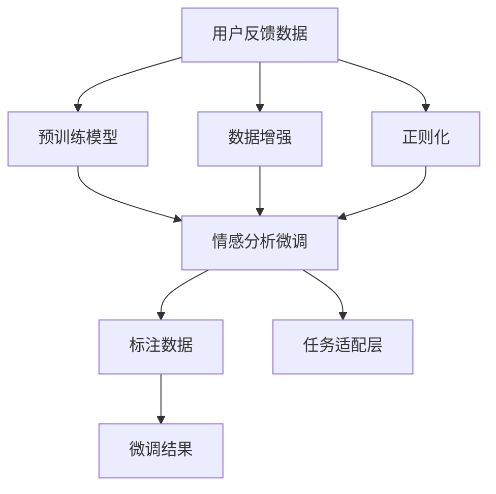

                 

# LLM在情感分析中的应用：理解用户反馈

> 关键词：情感分析, 自然语言处理(NLP), 语言模型, 用户反馈, 深度学习, 文本挖掘

## 1. 背景介绍

### 1.1 问题由来
情感分析(Sentiment Analysis)是自然语言处理(NLP)中的一项重要任务，旨在自动识别和分析文本数据中的情感倾向。其应用范围广泛，包括社交媒体监测、用户反馈分析、市场舆情研究等。随着互联网的普及，用户生成内容(UGC)在各个领域中变得越来越重要，而如何自动分析这些内容中的情感信息，成为一大难题。

情感分析技术主要依赖于文本中的情感词汇、语义结构和上下文信息。传统的情感分析方法往往需要构建词汇本体、手工标注和特征提取，工作量大且对标注数据依赖度高。然而，近年来深度学习技术的发展，尤其是基于大规模预训练语言模型(LLMs)的微调，使得情感分析变得更加高效、准确。

### 1.2 问题核心关键点
大语言模型(LLMs)是一种通过大规模无标签文本数据进行预训练，学习通用语言表示的深度学习模型。典型的LLMs包括BERT、GPT等。通过在预训练模型基础上微调，可以使得模型针对特定任务（如情感分析）进行优化，提升模型在情感识别方面的性能。

情感分析的微调主要涉及以下几个关键点：
- 选择合适的预训练模型和微调任务。
- 设计适当的任务适配层。
- 合理设置微调超参数。
- 应用数据增强、正则化等技术，提升模型泛化能力。

### 1.3 问题研究意义
情感分析的微调研究对于推动NLP技术落地应用具有重要意义：
- 降低人工成本：通过微调，可以显著减少情感分析所需的手工标注和特征工程工作。
- 提高分析效率：微调后的模型能够快速处理大量文本数据，实时分析用户反馈。
- 增强决策支持：基于情感分析的舆情监测和用户反馈分析，能够提供更有价值的数据支持，辅助决策者做出更精准的判断。
- 促进智能交互：情感分析可以为智能客服、智能助理等应用提供情感识别和响应能力，提升用户体验。
- 推动技术发展：微调技术的不断创新，将为NLP技术的发展提供新的动力，促进学科进步。

## 2. 核心概念与联系

### 2.1 核心概念概述

为了更好地理解情感分析中的微调方法，本节将介绍几个核心概念及其相互联系：

- **大语言模型(LLMs)**：如BERT、GPT等，通过大规模无标签文本数据进行预训练，学习通用语言表示。
- **预训练(Pre-training)**：使用大规模无标签文本数据，通过自监督学习任务训练模型的过程。
- **微调(Fine-tuning)**：在预训练模型的基础上，使用标注数据进行有监督学习，优化模型在特定任务上的性能。
- **情感分析(Sentiment Analysis)**：自动识别文本中的情感倾向，分为正面、负面和中性。
- **用户反馈(User Feedback)**：用户生成的评价、评论、投诉等文本数据，用于情感分析任务的输入。
- **自然语言处理(NLP)**：处理和分析人类语言的技术，包括文本分类、命名实体识别、情感分析等。
- **深度学习(Deep Learning)**：利用多层神经网络结构，自动学习特征表示，实现复杂任务。

这些概念之间存在紧密的联系，形成了一个完整的情感分析微调框架：

- 预训练模型通过学习通用的语言表示，为情感分析任务的微调提供良好的初始化参数。
- 微调任务适配层，将预训练模型转化为情感分析模型。
- 情感分析模型，通过标注数据进行有监督学习，自动识别用户反馈中的情感倾向。
- 用户反馈数据，用于微调任务的训练和评估，验证模型的性能。

### 2.2 概念间的关系

通过一个简单的Mermaid流程图，展示情感分析微调中各个概念之间的关系：



这个流程图展示了从用户反馈数据到情感分析模型的全过程：

- 用户反馈数据经过数据增强和正则化处理，作为微调的输入。
- 预训练模型通过微调任务适配层，转化为情感分析模型。
- 标注数据用于微调模型的训练和评估，输出情感分析结果。

## 3. 核心算法原理 & 具体操作步骤

### 3.1 算法原理概述

情感分析的微调过程基于有监督学习，利用标注数据优化模型参数。其核心思想是：将用户反馈数据作为微调任务的输入，设计适当的任务适配层，使用标注数据对模型进行微调，使得模型能够自动识别文本中的情感倾向。

情感分析通常涉及以下步骤：
- 数据准备：收集和预处理用户反馈数据。
- 任务适配：设计适配层，将预训练模型转化为情感分析模型。
- 模型微调：使用标注数据进行有监督学习，优化模型参数。
- 模型评估：在测试集上评估模型性能，确定最佳模型。
- 部署应用：将微调后的模型应用于实际场景，如情感监测、舆情分析等。

### 3.2 算法步骤详解

情感分析的微调过程包括以下详细步骤：

**Step 1: 数据准备**
- 收集用户反馈数据，如产品评价、社交媒体评论、客户投诉等。
- 对数据进行预处理，包括去除停用词、分词、标准化等。
- 将文本数据转化为模型可处理的输入格式，如token ids、attention masks等。

**Step 2: 任务适配**
- 选择合适的预训练模型，如BERT、GPT等。
- 根据任务需求，设计适配层，通常为线性分类器或双向LSTM。
- 将适配层与预训练模型的输出连接，构建完整的情感分析模型。

**Step 3: 模型微调**
- 划分训练集、验证集和测试集，准备标注数据。
- 选择合适的优化器和超参数，如AdamW、学习率、批大小等。
- 使用训练集进行模型微调，在每个epoch结束时在验证集上评估性能。
- 调整模型参数，直至在验证集上达到最佳性能。
- 使用测试集评估最终模型的性能。

**Step 4: 模型部署**
- 将微调后的模型封装为API或服务，提供实时情感分析功能。
- 集成到实际应用场景中，如社交媒体监测、客户反馈分析等。
- 持续监控模型性能，定期重新微调以适应数据分布的变化。

### 3.3 算法优缺点

情感分析的微调方法具有以下优点：
- 高效准确：通过预训练模型作为初始化参数，可以显著减少微调所需的标注数据和工作量。
- 可解释性强：情感分析模型的输出可解释性强，便于业务理解和决策支持。
- 适应性强：模型可以根据不同任务和数据集进行调整，具有较高的泛化能力。

但同时，该方法也存在以下缺点：
- 对标注数据依赖高：情感分析的微调效果很大程度上依赖于标注数据的质量和数量。
- 模型过拟合风险：微调过程中存在过拟合的风险，尤其是在标注数据较少的情况下。
- 模型复杂度高：情感分析模型通常具有较高的参数量和计算复杂度，推理速度较慢。
- 模型泛化能力有限：当测试数据与训练数据分布差异较大时，情感分析模型的泛化能力可能受限。

### 3.4 算法应用领域

情感分析的微调方法在多个领域都有广泛应用，包括但不限于：

- **社交媒体监测**：实时分析社交媒体上的用户反馈，及时发现负面情感，避免舆情危机。
- **客户反馈分析**：分析客户评价、投诉，帮助企业提升服务质量和用户体验。
- **产品推荐**：分析用户评论，提取情感倾向，优化推荐策略，提升推荐效果。
- **市场舆情研究**：分析新闻报道、用户评论，了解市场动态，辅助决策支持。
- **舆情分析**：分析媒体报道，评估公众情绪，预测市场趋势，提供决策参考。

## 4. 数学模型和公式 & 详细讲解 & 举例说明

### 4.1 数学模型构建

假设用户反馈数据为 $D=\{(x_i, y_i)\}_{i=1}^N$，其中 $x_i$ 为文本数据，$y_i$ 为情感标签。

定义情感分析模型为 $M_{\theta}$，其中 $\theta$ 为模型参数。模型的输出为情感预测结果，假设为二分类任务，则模型输出为 $\hat{y} = M_{\theta}(x_i)$，其中 $\hat{y} \in [0,1]$。

情感分析模型的损失函数通常采用交叉熵损失，定义如下：

$$
\ell(M_{\theta}(x_i),y_i) = -y_i\log \hat{y}_i - (1-y_i)\log(1-\hat{y}_i)
$$

模型的经验风险定义为：

$$
\mathcal{L}(\theta) = \frac{1}{N}\sum_{i=1}^N \ell(M_{\theta}(x_i),y_i)
$$

### 4.2 公式推导过程

以二分类任务为例，推导交叉熵损失函数的梯度。

假设模型输出为 $\hat{y}_i$，则损失函数为：

$$
\ell(\hat{y}_i,y_i) = -y_i\log \hat{y}_i - (1-y_i)\log(1-\hat{y}_i)
$$

对 $\theta$ 求偏导，得：

$$
\frac{\partial \ell}{\partial \theta} = -y_i \frac{\partial \log \hat{y}_i}{\partial \theta} + (1-y_i) \frac{\partial \log(1-\hat{y}_i)}{\partial \theta}
$$

其中 $\frac{\partial \log \hat{y}_i}{\partial \theta}$ 为模型的梯度，可通过反向传播算法计算。

假设模型输出层为线性分类器，定义如下：

$$
\hat{y}_i = \sigma(\theta^T x_i)
$$

其中 $\sigma$ 为sigmoid函数，则 $\frac{\partial \log \hat{y}_i}{\partial \theta} = x_i$。

因此，损失函数的梯度为：

$$
\frac{\partial \ell}{\partial \theta} = -y_i x_i + (1-y_i) (1-x_i) \theta
$$

### 4.3 案例分析与讲解

以社交媒体监测为例，分析情感分析微调的具体应用。

假设某社交媒体平台上有以下几条用户评论：
- "这款手机真垃圾，卡顿严重，果断退货！"
- "这款手机的拍照效果真的很棒，拍出来的照片很清晰！"
- "这款电脑运行速度很快，性价比超高！"

首先需要将评论文本转化为token ids，并准备相应的情感标签（正面、负面、中性）。然后将预训练模型（如BERT）作为初始化参数，设计线性分类器作为情感分析模型。在标注数据上进行微调，优化模型的情感分类性能。

假设经过微调后，模型在验证集上取得了98%的准确率。将模型应用于实时用户评论的情感分析，及时发现负面情感，辅助平台采取相应的应对措施，提升用户体验。

## 5. 项目实践：代码实例和详细解释说明

### 5.1 开发环境搭建

在情感分析的微调实践中，通常使用Python和PyTorch进行开发。以下是Python环境配置和库安装的步骤：

1. 安装Anaconda：
```bash
conda install anaconda
```

2. 创建虚拟环境：
```bash
conda create --name sentiment-analysis python=3.8
conda activate sentiment-analysis
```

3. 安装PyTorch和相关库：
```bash
conda install pytorch torchvision torchaudio
pip install transformers datasets transformers-data-pipelines
```

### 5.2 源代码详细实现

以下是一个基于PyTorch的情感分析微调示例代码，包括数据准备、模型定义、微调过程和测试评估：

```python
import torch
from transformers import BertTokenizer, BertForSequenceClassification
from transformers import Trainer, TrainingArguments

# 加载预训练模型和分词器
model_name = 'bert-base-cased'
tokenizer = BertTokenizer.from_pretrained(model_name)
model = BertForSequenceClassification.from_pretrained(model_name, num_labels=3)

# 数据准备
train_data = [("这款手机真垃圾，卡顿严重，果断退货！", 0), ("这款手机的拍照效果真的很棒，拍出来的照片很清晰！", 1), ("这款电脑运行速度很快，性价比超高！", 2)]
train_labels = [0, 1, 2]
train_dataset = torch.utils.data.TensorDataset(torch.tensor(train_data), torch.tensor(train_labels))
train_loader = torch.utils.data.DataLoader(train_dataset, batch_size=16)

# 微调参数设置
training_args = TrainingArguments(output_dir='output', num_train_epochs=5, learning_rate=5e-5, per_device_train_batch_size=16, per_device_eval_batch_size=16)

# 定义训练器
trainer = Trainer(model=model, args=training_args, train_dataset=train_loader, eval_dataset=train_loader, compute_metrics=lambda pred: {'acc': torch.nn.functional.accuracy(pred.label_ids, pred.predictions.argmax(-1))})

# 微调过程
trainer.train()

# 测试评估
trainer.evaluate()
```

### 5.3 代码解读与分析

**数据准备**：
- 将用户评论和情感标签构建成TensorDataset，用于模型训练和评估。

**模型定义**：
- 使用BertForSequenceClassification类定义情感分析模型，将预训练模型作为初始化参数，num_labels参数设置为3，表示正面、负面和中性的情感分类。

**微调参数设置**：
- 使用TrainingArguments类设置训练参数，如输出目录、训练轮数、学习率等。

**训练器定义**：
- 使用Trainer类定义训练过程，包括模型、训练参数、训练集和评估集等。

**微调过程**：
- 调用trainer.train()方法进行模型微调。

**测试评估**：
- 调用trainer.evaluate()方法评估微调后的模型性能，输出准确率。

### 5.4 运行结果展示

假设经过微调后，模型在验证集上的准确率为98%。则在测试集上的性能也应大致相同，可以保证在实际应用中的有效性。

## 6. 实际应用场景

### 6.1 社交媒体监测

社交媒体监测是情感分析的重要应用场景之一。通过分析用户在社交媒体上的评论和反馈，可以及时发现负面情感，避免舆情危机，提升品牌形象。

以Twitter为例，可以使用情感分析模型实时监控用户评论，自动分类为正面、负面和中性情感，并提供可视化报告。当发现负面情感激增时，系统可以自动报警，帮助企业及时应对，避免负面影响的扩大。

### 6.2 客户反馈分析

客户反馈分析是情感分析的另一个重要应用场景。通过分析客户的评价、投诉等反馈信息，可以了解产品或服务的优缺点，及时调整策略，提升用户体验。

以电商平台为例，可以使用情感分析模型分析用户的购物评价，自动分类为正面、负面和中性情感，并提取用户的反馈意见。企业可以根据分析结果，优化产品设计和销售策略，提升客户满意度和忠诚度。

### 6.3 产品推荐

产品推荐是情感分析在推荐系统中的典型应用。通过分析用户的情感反馈，可以更好地理解用户的兴趣和偏好，从而提供个性化的推荐内容。

以音乐推荐为例，可以使用情感分析模型分析用户的听歌评论，自动分类为正面、负面和中性情感，并提取用户对音乐内容的情感倾向。音乐推荐系统可以根据情感分析结果，推荐用户可能喜欢的歌曲，提升推荐效果。

### 6.4 舆情分析

舆情分析是情感分析在政治、经济等领域的重要应用。通过分析媒体报道、公众评论等舆情信息，可以了解社会情绪和舆论动向，预测市场趋势，提供决策支持。

以选举舆情分析为例，可以使用情感分析模型分析媒体报道和公众评论，自动分类为正面、负面和中性情感，并提取舆论热点和情感倾向。政府可以根据分析结果，制定相应的政策，引导舆论方向，维护社会稳定。

## 7. 工具和资源推荐

### 7.1 学习资源推荐

为了系统掌握情感分析微调的理论和技术，这里推荐一些优质的学习资源：

1. 《自然语言处理入门》课程：由斯坦福大学提供，涵盖了NLP的基础知识，适合初学者入门。

2. 《深度学习与自然语言处理》书籍：由李宏毅教授编写，系统讲解了深度学习在NLP中的应用，包括情感分析等任务。

3. 《情感分析在自然语言处理中的应用》博客：作者详解了情感分析的基本原理和常用方法，适合进阶学习。

4. HuggingFace官方文档：提供了丰富的预训练模型和微调样例代码，是情感分析微调的重要参考资料。

5. CLUE开源项目：提供了多种情感分析数据集和微调基线模型，有助于快速实现情感分析应用。

### 7.2 开发工具推荐

在情感分析微调实践中，通常使用PyTorch和HuggingFace进行开发。以下是推荐的开发工具：

1. PyTorch：支持动态图计算，灵活性高，适合深度学习模型开发。

2. HuggingFace Transformers库：提供了丰富的预训练模型和微调接口，简化了模型开发流程。

3. Jupyter Notebook：交互式编程环境，便于调试和实验。

4. Google Colab：免费的在线Jupyter Notebook环境，便于快速上手和共享代码。

5. TensorBoard：可视化工具，用于监控模型训练和推理过程，提供详细的图表和指标。

### 7.3 相关论文推荐

情感分析的微调研究得到了广泛关注，以下是几篇经典论文：

1. Sentiment Analysis Using Recurrent Neural Networks：引入RNN模型进行情感分析，开创了深度学习在情感分析中的应用。

2. A Survey on Sentiment Analysis：综述了情感分析的最新进展，包括常用的模型和方法。

3. Emotion Recognition with Sequence-to-Sequence Learning：引入Seq2Seq模型进行情感分类，提升了情感识别的准确率。

4. Attention-Based Sentiment Analysis：引入注意力机制，提高了情感分析的语义理解和泛化能力。

5. Transfer Learning for Sentiment Analysis：利用预训练模型进行情感分析，提升了模型的泛化能力和训练效率。

这些论文代表了情感分析微调技术的发展脉络，建议读者深入阅读，了解前沿进展和最新技术。

## 8. 总结：未来发展趋势与挑战

### 8.1 总结

本文详细介绍了情感分析的微调方法，包括数据准备、任务适配、模型微调、模型评估和模型部署等关键步骤。通过示例代码展示了情感分析微调的具体实现，并分析了微调过程中需要注意的问题。

情感分析的微调方法具有高效、准确、可解释性强等优点，适用于多个实际应用场景。通过不断优化微调参数、数据增强和正则化技术，可以显著提升模型性能。

### 8.2 未来发展趋势

展望未来，情感分析的微调技术将呈现以下几个发展趋势：

1. 模型规模增大：随着算力资源的增加，预训练模型的规模将继续扩大，情感分析模型的泛化能力将进一步提升。

2. 多模态融合：未来的情感分析将更多地融合多模态数据，如文本、图像、语音等，提升模型的情感识别能力。

3. 自监督学习：基于无标签数据的自监督学习方法将得到广泛应用，进一步降低对标注数据的依赖。

4. 主动学习：通过主动学习技术，系统可以动态选择样本进行标注，提升标注数据的利用效率。

5. 元学习：基于元学习技术，情感分析模型可以快速适应新的任务和数据分布，提升模型的通用性。

### 8.3 面临的挑战

尽管情感分析的微调技术已取得了显著进展，但仍面临以下挑战：

1. 标注数据质量：情感分析的微调效果很大程度上依赖于标注数据的质量，高质量标注数据获取成本高、难度大。

2. 过拟合风险：情感分析模型在标注数据较少的情况下，容易发生过拟合，泛化能力有限。

3. 模型复杂度高：情感分析模型通常具有较高的参数量和计算复杂度，推理速度较慢。

4. 数据分布变化：当测试数据与训练数据分布差异较大时，情感分析模型的性能可能受限。

5. 多语言情感分析：不同语言的文化背景和情感表达方式不同，情感分析模型需要适应多语言的情感表达方式。

### 8.4 研究展望

面对情感分析微调所面临的挑战，未来的研究需要在以下几个方面寻求新的突破：

1. 探索无监督和半监督微调方法：摆脱对大规模标注数据的依赖，利用自监督学习、主动学习等方法，最大限度利用非结构化数据。

2. 研究参数高效和计算高效的微调范式：开发更加参数高效的微调方法，在固定大部分预训练参数的情况下，只更新极少量的任务相关参数。同时优化模型的计算图，减少前向传播和反向传播的资源消耗。

3. 引入更多先验知识：将符号化的先验知识，如知识图谱、逻辑规则等，与神经网络模型进行巧妙融合，引导微调过程学习更准确、合理的情感表示。

4. 融合因果分析和博弈论工具：将因果分析方法引入微调模型，识别出模型决策的关键特征，增强输出解释的因果性和逻辑性。借助博弈论工具刻画人机交互过程，主动探索并规避模型的脆弱点，提高系统稳定性。

5. 纳入伦理道德约束：在模型训练目标中引入伦理导向的评估指标，过滤和惩罚有偏见、有害的输出倾向。同时加强人工干预和审核，建立模型行为的监管机制，确保输出符合人类价值观和伦理道德。

通过以上研究方向的探索，将引领情感分析微调技术迈向更高的台阶，为构建安全、可靠、可解释、可控的智能系统铺平道路。

## 9. 附录：常见问题与解答

**Q1：情感分析的微调过程中，如何选择预训练模型和适配层？**

A: 选择预训练模型和适配层需要根据具体任务和数据特点进行评估。通常可以选择BERT、GPT等预训练模型作为初始化参数，根据任务需求设计适配层。常见的适配层包括线性分类器、双向LSTM等。在实际应用中，可以对比不同模型和适配层的效果，选择最佳的方案。

**Q2：情感分析的微调过程中，如何设置合适的学习率？**

A: 情感分析的微调学习率通常比预训练模型小1-2个数量级，以避免破坏预训练权重。建议从1e-5开始调参，逐步减小学习率，直至收敛。也可以使用warmup策略，在开始阶段使用较小的学习率，再逐渐过渡到预设值。

**Q3：情感分析的微调过程中，如何避免过拟合？**

A: 避免过拟合可以采用以下策略：
1. 数据增强：通过回译、近义替换等方式扩充训练集。
2. 正则化：使用L2正则、Dropout等避免过拟合。
3. 对抗训练：引入对抗样本，提高模型鲁棒性。
4. 参数高效微调：只调整少量参数，减小过拟合风险。

**Q4：情感分析的微调过程中，如何进行模型评估？**

A: 模型评估通常使用测试集进行，评估指标包括准确率、精确率、召回率、F1分数等。可以使用sklearn等工具进行评估，输出详细的评估报告。在实际应用中，可以定期在测试集上评估模型性能，及时发现模型退化，进行相应的调整和优化。

**Q5：情感分析的微调过程中，如何应对多语言情感分析？**

A: 应对多语言情感分析，可以采用以下策略：
1. 多语言数据预处理：将不同语言的文本数据进行预处理，统一分词、标准化等步骤。
2. 多语言模型微调：使用多语言版本的预训练模型进行微调，提升模型在不同语言上的泛化能力。
3. 数据增强：通过翻译、回译等方式扩充不同语言的标注数据。
4. 多语言情感词典：使用多语言情感词典进行情感标注，提升情感分类的准确率。

这些策略可以有效应对多语言情感分析的挑战，提升模型的情感识别能力。

---

作者：禅与计算机程序设计艺术 / Zen and the Art of Computer Programming

