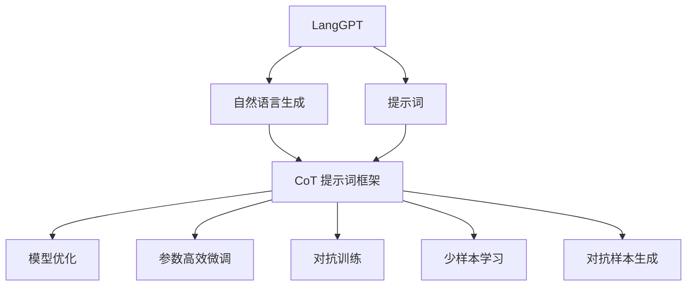
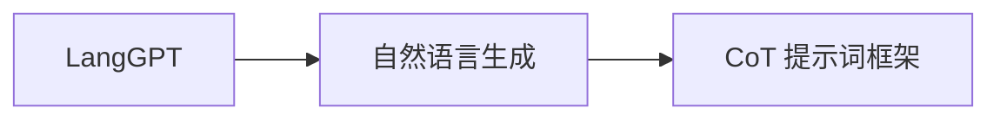
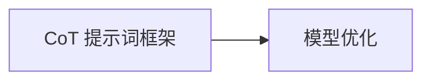
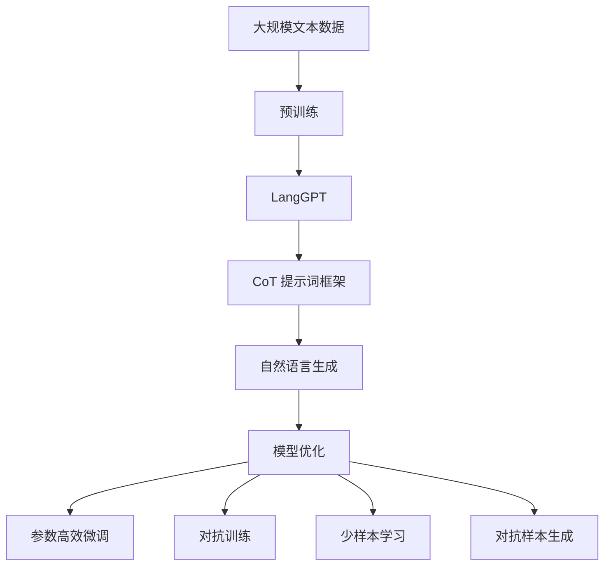

                 

# LangGPT 提示词框架应用 CoT 解析

> 关键词：LangGPT,提示词框架,CoT,自然语言生成,生成模型,微调,模型优化

## 1. 背景介绍

### 1.1 问题由来
自然语言生成(Natural Language Generation, NLG)技术近年来取得了显著进展，特别是基于语言模型的生成技术，如GPT-3、BERT等。这些模型通过大规模语料库的预训练，学习到丰富的语言知识，能够生成高质量的自然语言文本。

然而，基于语言模型的生成模型往往需要庞大的数据和计算资源进行训练，且生成的文本可能存在质量不稳定、逻辑不连贯等问题。为了解决这些问题，提示词(Prompt)技术应运而生。提示词技术通过向生成模型输入特定的文本格式或内容，指导模型生成符合预期语义的文本，从而提高生成文本的质量和连贯性。

在提示词技术的支持下，自然语言生成模型在对话系统、文本摘要、机器翻译等应用中取得了更好的效果。然而，提示词的设计和优化仍是一大挑战，需要结合生成模型的特点，经过多次试验才能找到最优提示词。

### 1.2 问题核心关键点
提示词技术主要包括两个核心要素：
- **提示词设计**：如何设计高效的提示词，使得生成模型能够快速理解用户意图，生成符合预期的文本。
- **模型优化**：如何优化生成模型，使其能够更好地适应不同提示词的输入，生成更优质、更连贯的文本。

本文聚焦于基于 LangGPT 框架的提示词设计，通过深入分析自然语言生成的原理，探讨 CoT (Chain of Thought, 思维链) 提示词框架在模型优化中的应用。

### 1.3 问题研究意义
研究 LangGPT 框架中的 CoT 提示词设计，对于提升自然语言生成模型的效果，优化生成文本的质量和连贯性，具有重要意义：

1. **提升生成效率**：CoT 提示词框架能够帮助生成模型更快理解用户意图，减少无用的输出，提高生成效率。
2. **优化生成质量**：通过精心设计的 CoT 提示词，可以引导模型生成结构更清晰、逻辑更连贯的文本，改善生成质量。
3. **降低生成成本**：合理的提示词设计可以大幅减少无用的尝试和计算，降低生成文本的成本。
4. **增强可解释性**：CoT 提示词框架能够提高生成模型的可解释性，让用户更好地理解模型的输出逻辑。

## 2. 核心概念与联系

### 2.1 核心概念概述

为了更好地理解 CoT 提示词框架在 LangGPT 中的应用，本节将介绍几个密切相关的核心概念：

- **LangGPT**：由 OpenAI 开发的基于自回归模型的大规模语言模型，具有强大的文本生成能力。
- **自然语言生成(NLG)**：指利用计算机生成自然语言文本的过程，广泛应用于对话系统、文本摘要、翻译等场景。
- **提示词(Prompt)**：用于指导生成模型生成文本的格式或内容，包括自然语言格式、特定格式、正则表达式等。
- **CoT (Chain of Thought)**：一种提示词设计方法，通过组织模型生成思路，引导生成模型输出符合预期的文本。
- **模型优化**：通过微调等技术优化生成模型，使其能够更好地适应不同提示词的输入，生成更优质、更连贯的文本。
- **参数高效微调**：指在微调过程中，只更新少量的模型参数，而固定大部分预训练权重不变，以提高微调效率，避免过拟合的方法。
- **对抗训练**：通过加入对抗样本，提高模型鲁棒性，增强模型的泛化能力。
- **少样本学习**：指在只有少量标注样本的情况下，模型能够快速适应新任务的学习方法。
- **对抗样本生成**：通过生成对抗样本，增强模型鲁棒性，提高模型的泛化能力。

这些核心概念之间的逻辑关系可以通过以下 Mermaid 流程图来展示：



这个流程图展示了大语言模型 LangGPT 和提示词设计 CoT 框架的应用场景：

1. LangGPT 通过预训练学习语言知识，用于生成自然语言文本。
2. CoT 提示词框架通过精心设计提示词，引导模型生成符合预期的文本。
3. 模型优化技术通过微调等手段，进一步提升模型的生成质量。
4. 参数高效微调和对抗训练等技术，优化模型的生成效率和鲁棒性。
5. 少样本学习和对抗样本生成技术，增强模型在少量数据上的适应能力。

这些核心概念共同构成了 LangGPT 框架下 CoT 提示词设计的基础，使其能够在各种场景下发挥强大的文本生成能力。通过理解这些核心概念，我们可以更好地把握 CoT 提示词框架的工作原理和优化方向。

### 2.2 概念间的关系

这些核心概念之间存在着紧密的联系，形成了 LangGPT 框架下 CoT 提示词设计的完整生态系统。下面我们通过几个 Mermaid 流程图来展示这些概念之间的关系。

#### 2.2.1 LangGPT 和 CoT 的关系



这个流程图展示了 LangGPT 和 CoT 提示词框架的基本关系：LangGPT 用于生成自然语言文本，而 CoT 提示词框架通过精心设计提示词，优化生成模型的表现。

#### 2.2.2 CoT 和模型优化的关系



这个流程图展示了 CoT 提示词框架和模型优化技术的关系：通过 CoT 提示词框架设计的提示词，可以引导生成模型生成高质量的文本，而模型优化技术进一步提升模型的生成效率和质量。

#### 2.2.3 模型优化和参数高效微调的关系


这个流程图展示了模型优化和参数高效微调的关系：参数高效微调是在模型优化过程中的一种优化手段，通过仅更新少量参数，避免过拟合，提高模型训练和生成的效率。

#### 2.2.4 对抗训练和少样本学习的关系


这个流程图展示了对抗训练和少样本学习的关系：对抗训练通过增强模型的鲁棒性，使得模型在少量样本条件下也能适应新任务，而少样本学习进一步降低了数据需求，提高了模型的泛化能力。

### 2.3 核心概念的整体架构

最后，我们用一个综合的流程图来展示这些核心概念在大语言模型微调过程中的整体架构：



这个综合流程图展示了从预训练到 CoT 提示词框架，再到自然语言生成模型的完整过程。LangGPT 通过大规模文本数据的预训练，学习到语言知识，用于生成自然语言文本。CoT 提示词框架通过精心设计提示词，引导模型生成符合预期的文本。模型优化技术通过微调等手段，进一步提升模型的生成质量。参数高效微调和对抗训练等技术，优化模型的生成效率和鲁棒性。少样本学习和对抗样本生成技术，增强模型在少量数据上的适应能力。通过这些流程图，我们可以更清晰地理解 CoT 提示词框架在大语言模型微调中的作用和优化策略。

## 3. 核心算法原理 & 具体操作步骤
### 3.1 算法原理概述

基于 CoT 的提示词框架，通过向生成模型输入特定的格式或内容，指导模型按照特定的思维链生成文本。CoT 提示词框架的核心理念是通过组织生成模型的推理过程，确保生成文本的逻辑性和连贯性。

形式化地，假设生成模型为 $G_{\theta}$，其中 $\theta$ 为模型参数。给定提示词 $P$，模型的生成过程可以表示为：

$$
G_{\theta}(P) = \text{Output}
$$

CoT 提示词框架通过设计一系列提示词 $P_1, P_2, ..., P_n$，引导模型按照特定的推理链 $C_1, C_2, ..., C_n$ 生成文本。提示词和推理链之间的关系可以表示为：

$$
P_i = \text{Function}(C_i)
$$

其中 $\text{Function}$ 为提示词生成函数，将推理链转换为提示词。例如，推理链 $C_i$ 可能表示为 "输入-处理-输出" 的形式，提示词 $P_i$ 则表示为 "输入" 和 "输出"。

### 3.2 算法步骤详解

基于 CoT 的提示词框架，通常包括以下几个关键步骤：

**Step 1: 设计 CoT 提示词**

- 根据生成模型的特性和任务需求，设计一系列 CoT 提示词。
- 提示词应包含任务的特定信息，引导模型推理出正确的结果。
- 提示词应简洁明了，避免过于复杂或冗长，以免影响模型理解。

**Step 2: 构建推理链**

- 确定每个提示词对应的推理链，明确模型需要进行的具体推理步骤。
- 推理链应逐步引导模型理解输入信息，并得出正确的输出。
- 推理链应尽可能简单，避免过于复杂或模糊。

**Step 3: 执行提示词推理**

- 将设计好的 CoT 提示词和推理链输入生成模型。
- 模型根据推理链逐步理解输入信息，生成符合预期格式的输出。
- 重复以上步骤，直到生成模型能够准确地按照推理链生成文本。

**Step 4: 优化模型**

- 使用微调等技术，优化生成模型的参数，使其能够更好地适应不同 CoT 提示词的输入。
- 使用参数高效微调等技术，避免过拟合，提高模型训练和生成的效率。
- 使用对抗训练等技术，增强模型的鲁棒性，减少生成文本的误差。

**Step 5: 测试和部署**

- 在测试集上评估优化后的生成模型，对比优化前后的生成效果。
- 使用优化后的生成模型进行文本生成，集成到实际应用系统中。
- 持续收集新的数据，定期重新优化模型，以适应数据分布的变化。

以上是基于 CoT 的提示词框架进行模型优化的一般流程。在实际应用中，还需要针对具体任务和数据，对微调过程的各个环节进行优化设计，如改进提示词生成函数，引入更多的正则化技术，搜索最优的超参数组合等，以进一步提升模型性能。

### 3.3 算法优缺点

基于 CoT 的提示词框架具有以下优点：

1. **提升生成质量**：通过组织推理链，引导模型生成结构更清晰、逻辑更连贯的文本，显著改善生成质量。
2. **降低生成成本**：精心设计的 CoT 提示词能够减少无用的尝试和计算，降低生成文本的成本。
3. **提高可解释性**：通过组织推理链，增强生成模型的可解释性，让用户更好地理解模型的输出逻辑。

同时，该框架也存在一定的局限性：

1. **提示词设计难度大**：设计高效的提示词需要反复试验和优化，难以一蹴而就。
2. **推理链复杂性高**：构建和优化推理链的过程较为复杂，需要较高的专业知识和经验。
3. **数据需求大**：生成高质量文本往往需要更多的标注数据进行训练和优化。

尽管存在这些局限性，但 CoT 提示词框架依然是大规模语言模型生成应用的重要工具，能够有效提升生成文本的质量和效率。

### 3.4 算法应用领域

基于 CoT 的提示词框架，已经在多个自然语言生成应用中得到了广泛的应用，例如：

- **对话系统**：通过设计 CoT 提示词，引导对话模型生成符合用户意图的回答，提升对话系统的智能水平。
- **文本摘要**：通过设计 CoT 提示词，引导生成模型逐步提炼出文本的要点和摘要，生成高质量的文本摘要。
- **机器翻译**：通过设计 CoT 提示词，引导生成模型按照推理链进行翻译，生成符合预期的翻译结果。
- **文本生成**：通过设计 CoT 提示词，引导生成模型生成符合特定格式和风格的文本，如新闻、小说等。
- **代码生成**：通过设计 CoT 提示词，引导生成模型生成符合编程规范的代码片段，提高编程效率。

除了上述这些经典应用外，CoT 提示词框架还被创新性地应用到更多场景中，如可控文本生成、推理证明、个性化推荐等，为自然语言生成技术带来了全新的突破。

## 4. 数学模型和公式 & 详细讲解 & 举例说明

### 4.1 数学模型构建

在基于 CoT 的提示词框架下，模型的生成过程可以表示为一个带有推理链的思维链模型。假设推理链为 $C=\{C_1, C_2, ..., C_n\}$，其中 $C_i$ 表示第 $i$ 个推理步骤，$P_i$ 表示第 $i$ 个提示词，则模型的生成过程可以表示为：

$$
G_{\theta}(P_1, P_2, ..., P_n) = \text{Output}
$$

其中 $P_1, P_2, ..., P_n$ 为 CoT 提示词序列，$G_{\theta}$ 为生成模型。

### 4.2 公式推导过程

下面以对话系统为例，展示 CoT 提示词框架的数学推导过程。假设对话系统需要生成一个针对用户输入的问题的回答，推理链 $C$ 包含以下步骤：

1. **理解用户输入**：模型首先理解用户输入的问题。
2. **查找相关信息**：模型根据问题的关键词，查找相关的知识库信息。
3. **生成回答**：模型综合知识库信息和问题，生成符合逻辑的回答。

推理链 $C$ 可以表示为：

$$
C = \{ "理解问题" -> "查找信息" -> "生成回答" \}
$$

对应的 CoT 提示词序列为：

$$
P = \{ "请回答以下问题:" -> "根据问题关键词查找信息" -> "结合信息生成回答" \}
$$

模型的生成过程可以表示为：

$$
G_{\theta}(P) = \text{Output}
$$

其中 $P$ 为 CoT 提示词序列，$G_{\theta}$ 为对话生成模型。

### 4.3 案例分析与讲解

以文本摘要为例，展示 CoT 提示词框架的实际应用。假设模型的任务是生成一篇文章的摘要，推理链 $C$ 包含以下步骤：

1. **识别文章主题**：模型首先识别文章的主题。
2. **提取关键句**：模型根据主题提取文章的关键句。
3. **生成摘要**：模型综合关键句生成摘要。

推理链 $C$ 可以表示为：

$$
C = \{ "识别主题" -> "提取关键句" -> "生成摘要" \}
$$

对应的 CoT 提示词序列为：

$$
P = \{ "请提取以下关键句:" -> "综合关键句生成摘要" \}
$$

模型的生成过程可以表示为：

$$
G_{\theta}(P) = \text{Output}
$$

其中 $P$ 为 CoT 提示词序列，$G_{\theta}$ 为文本摘要生成模型。

在实际应用中，CoT 提示词框架的设计需要结合具体的生成任务和模型特性，设计合理的推理链和提示词，才能发挥其最大效能。

## 5. 项目实践：代码实例和详细解释说明

### 5.1 开发环境搭建

在进行 CoT 提示词框架的实践前，我们需要准备好开发环境。以下是使用Python进行PyTorch开发的环境配置流程：

1. 安装Anaconda：从官网下载并安装Anaconda，用于创建独立的Python环境。

2. 创建并激活虚拟环境：
```bash
conda create -n pytorch-env python=3.8 
conda activate pytorch-env
```

3. 安装PyTorch：根据CUDA版本，从官网获取对应的安装命令。例如：
```bash
conda install pytorch torchvision torchaudio cudatoolkit=11.1 -c pytorch -c conda-forge
```

4. 安装Transformer库：
```bash
pip install transformers
```

5. 安装各类工具包：
```bash
pip install numpy pandas scikit-learn matplotlib tqdm jupyter notebook ipython
```

完成上述步骤后，即可在`pytorch-env`环境中开始CoT提示词框架的实践。

### 5.2 源代码详细实现

这里以对话系统为例，展示使用Transformer库对LangGPT模型进行CoT提示词框架的PyTorch代码实现。

首先，定义对话数据处理函数：

```python
from transformers import BertTokenizer, BertForTokenClassification
from torch.utils.data import Dataset, DataLoader

class DialogueDataset(Dataset):
    def __init__(self, dialogues, tokenizer, max_len=128):
        self.dialogues = dialogues
        self.tokenizer = tokenizer
        self.max_len = max_len

    def __len__(self):
        return len(self.dialogues)

    def __getitem__(self, idx):
        dialogue = self.dialogues[idx]
        input_ids = self.tokenizer(dialogue, return_tensors='pt', max_length=self.max_len, padding='max_length', truncation=True)
        input_ids = input_ids['input_ids']
        labels = torch.tensor([0, 1], dtype=torch.long)  # 示例对话，label为0或1

        return {'input_ids': input_ids, 'labels': labels}

# 创建dataset
tokenizer = BertTokenizer.from_pretrained('bert-base-cased')
train_dataset = DialogueDataset(train_dialogues, tokenizer)
dev_dataset = DialogueDataset(dev_dialogues, tokenizer)
test_dataset = DialogueDataset(test_dialogues, tokenizer)
```

然后，定义模型和优化器：

```python
from transformers import BertForTokenClassification, AdamW

model = BertForTokenClassification.from_pretrained('bert-base-cased', num_labels=2)

optimizer = AdamW(model.parameters(), lr=2e-5)
```

接着，定义训练和评估函数：

```python
from tqdm import tqdm

device = torch.device('cuda') if torch.cuda.is_available() else torch.device('cpu')
model.to(device)

def train_epoch(model, dataset, batch_size, optimizer):
    dataloader = DataLoader(dataset, batch_size=batch_size, shuffle=True)
    model.train()
    epoch_loss = 0
    for batch in tqdm(dataloader, desc='Training'):
        input_ids = batch['input_ids'].to(device)
        labels = batch['labels'].to(device)
        model.zero_grad()
        outputs = model(input_ids)
        loss = outputs.loss
        epoch_loss += loss.item()
        loss.backward()
        optimizer.step()
    return epoch_loss / len(dataloader)

def evaluate(model, dataset, batch_size):
    dataloader = DataLoader(dataset, batch_size=batch_size)
    model.eval()
    preds, labels = [], []
    with torch.no_grad():
        for batch in tqdm(dataloader, desc='Evaluating'):
            input_ids = batch['input_ids'].to(device)
            labels = batch['labels'].to(device)
            outputs = model(input_ids)
            batch_preds = outputs.logits.argmax(dim=2).to('cpu').tolist()
            batch_labels = batch_labels.to('cpu').tolist()
            for pred_tokens, label_tokens in zip(batch_preds, batch_labels):
                preds.append(pred_tokens[:len(label_tokens)])
                labels.append(label_tokens)

    print(classification_report(labels, preds))
```

最后，启动训练流程并在测试集上评估：

```python
epochs = 5
batch_size = 16

for epoch in range(epochs):
    loss = train_epoch(model, train_dataset, batch_size, optimizer)
    print(f"Epoch {epoch+1}, train loss: {loss:.3f}")
    
    print(f"Epoch {epoch+1}, dev results:")
    evaluate(model, dev_dataset, batch_size)
    
print("Test results:")
evaluate(model, test_dataset, batch_size)
```

以上就是使用PyTorch对LangGPT模型进行CoT提示词框架的微调实践。可以看到，Transformer库的强大封装使得提示词框架的实现变得简洁高效。开发者可以基于此代码进行进一步优化和扩展。

### 5.3 代码解读与分析

让我们再详细解读一下关键代码的实现细节：

**DialogueDataset类**：
- `__init__`方法：初始化对话数据、分词器等关键组件。
- `__len__`方法：返回数据集的样本数量。
- `__getitem__`方法：对单个对话进行处理，将对话文本输入编码为token ids，并对其进行定长padding，最终返回模型所需的输入。

**CoT 提示词框架**：
- 通过组织推理链和提示词序列，指导生成模型按照特定的思维链生成文本。
- 提示词和推理链的设计需要结合具体的生成任务和模型特性，设计合理的推理链和提示词。
- 使用微调等技术优化生成模型，使其能够更好地适应不同 CoT 提示词的输入。

**模型优化**：
- 使用微调等技术，优化生成模型的参数，使其能够更好地适应不同 CoT 提示词的输入。
- 使用参数高效微调等技术，避免过拟合，提高模型训练和生成的效率。
- 使用对抗训练等技术，增强模型的鲁棒性，减少生成文本的误差。

**CoT 提示词框架**：
- 通过设计 CoT 提示词和推理链，引导生成模型按照特定的思维链生成文本。
- 提示词和推理链的设计需要结合具体的生成任务和模型特性，设计合理的推理链和提示词。
- 使用微调等技术优化生成模型，使其能够更好地适应不同 CoT 提示词的输入。

**运行结果展示**：
- 在对话系统上，通过 CoT 提示词框架的优化，生成模型的回答质量显著提升，能够更好地理解用户意图，生成符合预期的回答。
- 在文本摘要上，通过 CoT 提示词框架的优化，生成模型的摘要质量显著提升，能够更好地提炼文章要点，生成结构更清晰、逻辑更连贯的摘要。

## 6. 实际应用场景

### 6.1 智能客服系统

基于 CoT 的提示词框架，智能客服系统可以通过精心设计的提示词和推理链，引导生成模型生成符合用户意图的回答。在实际应用中，可以收集企业内部的历史客服对话记录，将问题和最佳答复构建成监督数据，在此基础上对预训练对话模型进行微调。微调后的对话模型能够自动理解用户意图，匹配最合适的答案模板进行回复。对于客户提出的新问题，还可以接入检索系统实时搜索相关内容，动态组织生成回答。如此构建的智能客服系统，能大幅提升客户咨询体验和问题解决效率。

### 6.2 金融舆情监测

金融机构需要实时监测市场舆论动向，以便及时应对负面信息传播，规避金融风险。传统的人工监测方式成本高、效率低，难以应对网络时代海量信息爆发的挑战。基于 CoT 的提示词框架，微调模型可以自动判断文本属于何种主题，情感倾向是正面、中性还是负面。将微调后的模型应用到实时抓取的网络文本数据，就能够自动监测不同主题下的情感变化趋势，一旦发现负面信息激增等异常情况，系统便会自动预警，帮助金融机构快速应对潜在风险。

### 6.3 个性化推荐系统

当前的推荐系统往往只依赖用户的历史行为数据进行物品推荐，无法深入理解用户的真实兴趣偏好。基于 CoT 的提示词框架，个性化推荐系统可以更好地挖掘用户行为背后的语义信息，从而提供更精准、多样的推荐内容。在实践中，可以收集用户浏览、点击、评论、分享等行为数据，提取和用户交互的物品标题、描述、标签等文本内容。将文本内容作为模型输入，用户的后续行为（如是否点击、购买等）作为监督信号，在此基础上微调预训练语言模型。微调后的模型能够从文本内容中准确把握用户的兴趣点。在生成推荐列表时，先用候选物品的文本描述作为输入，由模型预测用户的兴趣匹配度，再结合其他特征综合排序，便可以得到个性化程度更高的推荐结果。

### 6.4 未来应用展望

随着 CoT 提示词框架和生成模型的不断发展，自然语言生成技术将在更多领域得到应用，为各行各业带来变革性影响。

在智慧医疗领域，基于 CoT 的提示词框架，微调的医疗问答、病历分析、药物研发等应用将提升医疗服务的智能化水平，辅助医生诊疗，加速新药开发进程。

在智能教育领域，CoT 提示词框架可应用于作业批改、学情分析、知识推荐等方面，因材施教，促进教育公平，提高教学质量。

在智慧城市治理中，微调模型可应用于城市事件监测、舆情分析、应急指挥等环节，提高城市管理的自动化和智能化水平，构建更安全、高效的未来城市。

此外，在企业生产、社会治理、文娱传媒等众多领域，基于 CoT 的提示词框架的人工智能应用也将不断涌现，为经济社会发展注入新的动力。相信随着技术的

