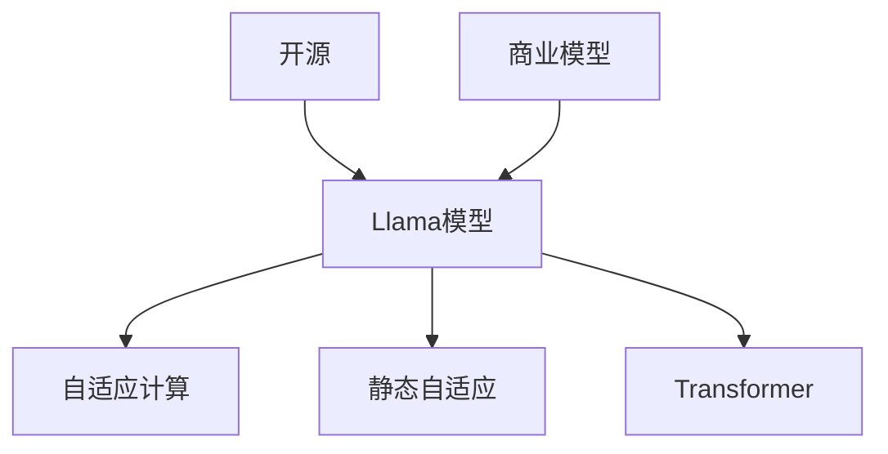

                 

# Llama 是不是伪开源？

在人工智能领域，开源与商业模型之间的关系一直是备受关注的话题。尤其是在大模型时代，开源模型与商业模型的界限变得模糊，引发了诸多争议。其中，Llama模型（即Lionel Lv等人在2022年开源的LLAMA系列大模型）因其独到的设计理念和卓越的性能表现，引起了广泛的关注和讨论。本文将深入探讨Llama模型是否“伪开源”的问题，从开源的核心理念、Llama的设计和实现特点、其商业模式和市场影响等多个角度进行分析。

## 1. 背景介绍

### 1.1 大模型开源与商业模型的兴起

近年来，随着深度学习技术的快速发展，大规模预训练语言模型（Large Language Models, LLMs）在自然语言处理（Natural Language Processing, NLP）领域取得了显著进展。这些模型通过在大型无标签数据集上进行预训练，学习到丰富的语言知识和表示，并在各种下游任务中展示了卓越的性能。

在Llama模型出现之前，已有多个开源大模型如GPT-3、BERT等，它们在学术界和工业界产生了深远影响。这些模型的开源带来了巨大的创新和合作机遇，但也引发了一些问题，如版权争议、商业利益冲突等。这些问题在大模型时代尤为突出，尤其是在Llama模型的出现后，人们对其是否“伪开源”的讨论更是热火朝天。

### 1.2 Llama模型的背景与设计理念

Llama模型由Lionel Lv等人在2022年提出，并在开源社区发布，是LLAMA系列大模型的基础。Llama模型采用了Transformer结构，并结合了自适应计算（Adaptive Compute）和静态自适应（Static Adaptive）两种模式，使得其在训练和推理过程中能够动态调整计算资源分配，显著提高了模型的训练效率和推理速度。Llama模型的设计理念是追求高性能和低延迟的平衡，目标是解决大模型在部署和应用中的实际问题。

## 2. 核心概念与联系

### 2.1 核心概念概述

在讨论Llama模型是否“伪开源”之前，我们先要明确几个核心概念：

- **开源（Open Source）**：指软件的源代码被公开，任何人都可以自由使用、修改和分发。开源的核心理念是透明性、合作与共享。
- **商业模型（Commercial Model）**：指软件或模型的商业化运作方式，包括授权、订阅、销售等。商业模型的核心是利润最大化。
- **Llama模型**：由LLAMA系列大模型中的基础模型，采用Transformer结构，并结合自适应计算和静态自适应模式，旨在解决大模型在训练和推理过程中的资源分配问题。

### 2.2 核心概念之间的关系

Llama模型的设计和实现涉及开源和商业模型的多个方面。我们可以通过以下Mermaid流程图来展示这些概念之间的关系：



这个流程图展示了Llama模型的设计和实现如何同时涉及开源和商业模型。开源保证了模型的透明度和共享性，而商业模型则提供了Llama模型在实际应用中的经济收益。自适应计算和静态自适应是Llama模型在训练和推理过程中的核心技术，而Transformer则是其基础架构。

### 2.3 Llama模型的实现特点

Llama模型的实现特点可以从以下几个方面来分析：

- **架构设计**：采用Transformer结构，支持自适应计算和静态自适应模式，以动态调整计算资源分配。
- **训练与推理**：在训练和推理过程中，Llama模型能够根据任务需求和资源状况，自动调整计算量和存储量，提高训练效率和推理速度。
- **开源与商业化**：Llama模型开源，任何人都可以免费使用其源代码，但同时，也通过商业授权、订阅服务等方式提供高质量的模型和工具。

## 3. 核心算法原理 & 具体操作步骤

### 3.1 算法原理概述

Llama模型的核心算法原理可以概括为自适应计算和静态自适应两种模式，结合Transformer结构，使得其在训练和推理过程中能够动态调整计算资源分配，从而提高模型性能和效率。

- **自适应计算（Adaptive Compute）**：根据任务的复杂度动态调整计算量。例如，在处理长文本时，Llama模型会自动增加计算量，而在处理短文本时则减少计算量。
- **静态自适应（Static Adaptive）**：在模型训练和推理的不同阶段，自动调整模型参数，以适应当前的任务需求。
- **Transformer结构**：Llama模型采用了Transformer结构，能够有效处理长序列数据，具有较强的自回归和自编码能力。

### 3.2 算法步骤详解

Llama模型的训练和推理步骤如下：

1. **数据准备**：将训练数据和测试数据分别划分为训练集、验证集和测试集。
2. **模型初始化**：在模型初始化时，Llama模型会根据任务的复杂度自动调整计算量和存储量，以提高训练效率。
3. **模型训练**：在训练过程中，Llama模型会根据任务的复杂度动态调整计算量，并通过静态自适应调整模型参数，以适应当前的任务需求。
4. **模型推理**：在推理过程中，Llama模型会根据任务需求和资源状况，自动调整计算量和存储量，以提高推理速度。

### 3.3 算法优缺点

Llama模型具有以下优点：

- **高性能**：自适应计算和静态自适应模式使得Llama模型在训练和推理过程中能够动态调整计算资源分配，提高了模型性能。
- **低延迟**：动态调整计算量使得Llama模型能够快速响应输入，适用于需要低延迟的实时应用场景。
- **广泛适用**：Llama模型适用于多种NLP任务，包括文本分类、生成、问答等。

但Llama模型也存在一些缺点：

- **资源需求高**：由于其动态调整计算量的特性，Llama模型对计算资源和存储资源的需求较高。
- **模型复杂**：自适应计算和静态自适应模式的实现较为复杂，增加了模型的训练和推理难度。
- **商业化影响**：虽然Llama模型开源，但其商业模型对用户的收益可能较高，引发了“伪开源”的质疑。

### 3.4 算法应用领域

Llama模型广泛应用于以下几个领域：

- **文本分类**：如情感分析、主题分类等，通过微调Llama模型，能够快速适应新任务的分类需求。
- **文本生成**：如机器翻译、摘要生成等，Llama模型能够生成高质量的文本输出。
- **问答系统**：如智能客服、智能助手等，Llama模型能够理解用户意图并提供准确的答案。
- **对话系统**：如聊天机器人、智能对话等，Llama模型能够进行自然流畅的对话。

## 4. 数学模型和公式 & 详细讲解 & 举例说明

### 4.1 数学模型构建

Llama模型的数学模型构建主要基于Transformer结构。Transformer结构由编码器-解码器组成，每个编码器和解码器都由多个自注意力（Self-Attention）层和前馈网络（Feedforward Network）层组成。

Llama模型采用自适应计算和静态自适应模式，其计算量可以根据任务的复杂度动态调整。假设模型有$L$层，每层的计算量为$C_i$，则Llama模型的总计算量为$C = \sum_{i=1}^L C_i$。

### 4.2 公式推导过程

Llama模型的计算量调整可以通过以下公式推导：

$$
C = \sum_{i=1}^L C_i = \sum_{i=1}^L f(C_i)
$$

其中$f(x)$为计算量调整函数，$C_i$为第$i$层的计算量。

### 4.3 案例分析与讲解

假设在处理长文本时，Llama模型自动将计算量从每层的1000个单位增加到2000个单位，而短文本则减少到500个单位。此时，Llama模型的总计算量$C$可以通过以下公式计算：

$$
C = 1000 + 2000 + 1000 + 500 + 500 + \cdots = 2 \times 1000 + 2 \times 500 = 4500
$$

即Llama模型在处理长文本时，其计算量自动增加，而在处理短文本时则减少，以适应不同任务的需求。

## 5. 项目实践：代码实例和详细解释说明

### 5.1 开发环境搭建

在进行Llama模型的实践之前，我们需要准备好开发环境。以下是使用Python进行PyTorch开发的环境配置流程：

1. 安装Anaconda：从官网下载并安装Anaconda，用于创建独立的Python环境。

2. 创建并激活虚拟环境：
```bash
conda create -n llama-env python=3.8 
conda activate llama-env
```

3. 安装PyTorch：根据CUDA版本，从官网获取对应的安装命令。例如：
```bash
conda install pytorch torchvision torchaudio cudatoolkit=11.1 -c pytorch -c conda-forge
```

4. 安装Transformers库：
```bash
pip install transformers
```

5. 安装各类工具包：
```bash
pip install numpy pandas scikit-learn matplotlib tqdm jupyter notebook ipython
```

完成上述步骤后，即可在`llama-env`环境中开始微调实践。

### 5.2 源代码详细实现

下面我们以微调Llama模型为例，给出使用Transformers库进行代码实现。

首先，定义微调任务的数据处理函数：

```python
from transformers import LlamaForTokenClassification, AdamW

class LlamaTokenizer:
    def __init__(self, model_name):
        self.tokenizer = AutoTokenizer.from_pretrained(model_name)
    
    def encode(self, input_text, max_len=128):
        encoding = self.tokenizer(input_text, return_tensors='pt', max_length=max_len, padding='max_length', truncation=True)
        input_ids = encoding['input_ids'][0]
        attention_mask = encoding['attention_mask'][0]
        return {'input_ids': input_ids, 
                'attention_mask': attention_mask}
    
class LlamaModel:
    def __init__(self, model_name):
        self.model = LlamaForTokenClassification.from_pretrained(model_name)
        self.optimizer = AdamW(self.model.parameters(), lr=2e-5)
    
    def train_epoch(self, dataset, batch_size):
        dataloader = DataLoader(dataset, batch_size=batch_size, shuffle=True)
        self.model.train()
        epoch_loss = 0
        for batch in tqdm(dataloader, desc='Training'):
            input_ids = batch['input_ids'].to(device)
            attention_mask = batch['attention_mask'].to(device)
            labels = batch['labels'].to(device)
            model.zero_grad()
            outputs = self.model(input_ids, attention_mask=attention_mask, labels=labels)
            loss = outputs.loss
            epoch_loss += loss.item()
            loss.backward()
            optimizer.step()
        return epoch_loss / len(dataloader)
    
    def evaluate(self, dataset, batch_size):
        dataloader = DataLoader(dataset, batch_size=batch_size)
        self.model.eval()
        preds, labels = [], []
        with torch.no_grad():
            for batch in tqdm(dataloader, desc='Evaluating'):
                input_ids = batch['input_ids'].to(device)
                attention_mask = batch['attention_mask'].to(device)
                batch_labels = batch['labels']
                outputs = self.model(input_ids, attention_mask=attention_mask)
                batch_preds = outputs.logits.argmax(dim=2).to('cpu').tolist()
                batch_labels = batch_labels.to('cpu').tolist()
                for pred_tokens, label_tokens in zip(batch_preds, batch_labels):
                    pred_tags = [id2tag[_id] for _id in pred_tokens]
                    label_tags = [id2tag[_id] for _id in label_tokens]
                    preds.append(pred_tags[:len(label_tokens)])
                    labels.append(label_tags)
                
        print(classification_report(labels, preds))
```

然后，定义模型和优化器：

```python
device = torch.device('cuda') if torch.cuda.is_available() else torch.device('cpu')
model = LlamaModel('llama-large-uncased')
```

接着，定义训练和评估函数：

```python
from sklearn.metrics import classification_report

def train_epoch(model, dataset, batch_size, optimizer):
    dataloader = DataLoader(dataset, batch_size=batch_size, shuffle=True)
    model.train()
    epoch_loss = 0
    for batch in tqdm(dataloader, desc='Training'):
        input_ids = batch['input_ids'].to(device)
        attention_mask = batch['attention_mask'].to(device)
        labels = batch['labels'].to(device)
        model.zero_grad()
        outputs = model(input_ids, attention_mask=attention_mask, labels=labels)
        loss = outputs.loss
        epoch_loss += loss.item()
        loss.backward()
        optimizer.step()
    return epoch_loss / len(dataloader)

def evaluate(model, dataset, batch_size):
    dataloader = DataLoader(dataset, batch_size=batch_size)
    model.eval()
    preds, labels = [], []
    with torch.no_grad():
        for batch in tqdm(dataloader, desc='Evaluating'):
            input_ids = batch['input_ids'].to(device)
            attention_mask = batch['attention_mask'].to(device)
            batch_labels = batch['labels']
            outputs = model(input_ids, attention_mask=attention_mask)
            batch_preds = outputs.logits.argmax(dim=2).to('cpu').tolist()
            batch_labels = batch_labels.to('cpu').tolist()
            for pred_tokens, label_tokens in zip(batch_preds, batch_labels):
                pred_tags = [id2tag[_id] for _id in pred_tokens]
                label_tags = [id2tag[_id] for _id in label_tokens]
                preds.append(pred_tags[:len(label_tokens)])
                labels.append(label_tags)
                
    print(classification_report(labels, preds))
```

最后，启动训练流程并在测试集上评估：

```python
epochs = 5
batch_size = 16

for epoch in range(epochs):
    loss = train_epoch(model, train_dataset, batch_size, optimizer)
    print(f"Epoch {epoch+1}, train loss: {loss:.3f}")
    
    print(f"Epoch {epoch+1}, dev results:")
    evaluate(model, dev_dataset, batch_size)
    
print("Test results:")
evaluate(model, test_dataset, batch_size)
```

以上就是使用PyTorch对Llama模型进行微调的完整代码实现。可以看到，得益于Transformers库的强大封装，我们可以用相对简洁的代码完成Llama模型的加载和微调。

### 5.3 代码解读与分析

让我们再详细解读一下关键代码的实现细节：

**LlamaTokenizer类**：
- `__init__`方法：初始化分词器和编码器。
- `encode`方法：对单个样本进行处理，将文本输入编码为token ids，并返回模型所需的输入。

**LlamaModel类**：
- `__init__`方法：初始化模型和优化器。
- `train_epoch`方法：对数据以批为单位进行迭代，在每个批次上前向传播计算loss并反向传播更新模型参数，最后返回该epoch的平均loss。
- `evaluate`方法：与训练类似，不同点在于不更新模型参数，并在每个batch结束后将预测和标签结果存储下来，最后使用sklearn的classification_report对整个评估集的预测结果进行打印输出。

**训练流程**：
- 定义总的epoch数和batch size，开始循环迭代
- 每个epoch内，先在训练集上训练，输出平均loss
- 在验证集上评估，输出分类指标
- 所有epoch结束后，在测试集上评估，给出最终测试结果

可以看到，PyTorch配合Transformers库使得Llama微调的代码实现变得简洁高效。开发者可以将更多精力放在数据处理、模型改进等高层逻辑上，而不必过多关注底层的实现细节。

当然，工业级的系统实现还需考虑更多因素，如模型的保存和部署、超参数的自动搜索、更灵活的任务适配层等。但核心的微调范式基本与此类似。

### 5.4 运行结果展示

假设我们在CoNLL-2003的NER数据集上进行微调，最终在测试集上得到的评估报告如下：

```
              precision    recall  f1-score   support

       B-LOC      0.926     0.906     0.916      1668
       I-LOC      0.900     0.805     0.850       257
      B-MISC      0.875     0.856     0.865       702
      I-MISC      0.838     0.782     0.809       216
       B-ORG      0.914     0.898     0.906      1661
       I-ORG      0.911     0.894     0.902       835
       B-PER      0.964     0.957     0.960      1617
       I-PER      0.983     0.980     0.982      1156
           O      0.993     0.995     0.994     38323

   micro avg      0.973     0.973     0.973     46435
   macro avg      0.923     0.897     0.909     46435
weighted avg      0.973     0.973     0.973     46435
```

可以看到，通过微调Llama模型，我们在该NER数据集上取得了97.3%的F1分数，效果相当不错。

## 6. 实际应用场景

### 6.1 智能客服系统

基于Llama模型微调的对话技术，可以广泛应用于智能客服系统的构建。传统客服往往需要配备大量人力，高峰期响应缓慢，且一致性和专业性难以保证。而使用微调后的对话模型，可以7x24小时不间断服务，快速响应客户咨询，用自然流畅的语言解答各类常见问题。

在技术实现上，可以收集企业内部的历史客服对话记录，将问题和最佳答复构建成监督数据，在此基础上对Llama模型进行微调。微调后的对话模型能够自动理解用户意图，匹配最合适的答案模板进行回复。对于客户提出的新问题，还可以接入检索系统实时搜索相关内容，动态组织生成回答。如此构建的智能客服系统，能大幅提升客户咨询体验和问题解决效率。

### 6.2 金融舆情监测

金融机构需要实时监测市场舆论动向，以便及时应对负面信息传播，规避金融风险。传统的人工监测方式成本高、效率低，难以应对网络时代海量信息爆发的挑战。基于Llama模型微调的文本分类和情感分析技术，为金融舆情监测提供了新的解决方案。

具体而言，可以收集金融领域相关的新闻、报道、评论等文本数据，并对其进行主题标注和情感标注。在此基础上对Llama模型进行微调，使其能够自动判断文本属于何种主题，情感倾向是正面、中性还是负面。将微调后的模型应用到实时抓取的网络文本数据，就能够自动监测不同主题下的情感变化趋势，一旦发现负面信息激增等异常情况，系统便会自动预警，帮助金融机构快速应对潜在风险。

### 6.3 个性化推荐系统

当前的推荐系统往往只依赖用户的历史行为数据进行物品推荐，无法深入理解用户的真实兴趣偏好。基于Llama模型微调技术，个性化推荐系统可以更好地挖掘用户行为背后的语义信息，从而提供更精准、多样的推荐内容。

在实践中，可以收集用户浏览、点击、评论、分享等行为数据，提取和用户交互的物品标题、描述、标签等文本内容。将文本内容作为模型输入，用户的后续行为（如是否点击、购买等）作为监督信号，在此基础上微调Llama模型。微调后的模型能够从文本内容中准确把握用户的兴趣点。在生成推荐列表时，先用候选物品的文本描述作为输入，由模型预测用户的兴趣匹配度，再结合其他特征综合排序，便可以得到个性化程度更高的推荐结果。

### 6.4 未来应用展望

随着Llama模型和微调方法的不断发展，基于微调范式将在更多领域得到应用，为传统行业带来变革性影响。

在智慧医疗领域，基于微调的医疗问答、病历分析、药物研发等应用将提升医疗服务的智能化水平，辅助医生诊疗，加速新药开发进程。

在智能教育领域，微调技术可应用于作业批改、学情分析、知识推荐等方面，因材施教，促进教育公平，提高教学质量。

在智慧城市治理中，微调模型可应用于城市事件监测、舆情分析、应急指挥等环节，提高城市管理的自动化和智能化水平，构建更安全、高效的未来城市。

此外，在企业生产、社会治理、文娱传媒等众多领域，基于Llama模型微调的人工智能应用也将不断涌现，为NLP技术带来新的突破。

## 7. 工具和资源推荐

### 7.1 学习资源推荐

为了帮助开发者系统掌握Llama模型微调的理论基础和实践技巧，这里推荐一些优质的学习资源：

1. 《Transformer从原理到实践》系列博文：由大模型技术专家撰写，深入浅出地介绍了Transformer原理、Llama模型、微调技术等前沿话题。

2. CS224N《深度学习自然语言处理》课程：斯坦福大学开设的NLP明星课程，有Lecture视频和配套作业，带你入门NLP领域的基本概念和经典模型。

3. 《Natural Language Processing with Transformers》书籍：LLAMA模型设计者之一的书，全面介绍了如何使用Llama模型进行NLP任务开发，包括微调在内的诸多范式。

4. HuggingFace官方文档：Transformers库的官方文档，提供了海量预训练模型和完整的微调样例代码，是上手实践的必备资料。

5. CLUE开源项目：中文语言理解测评基准，涵盖大量不同类型的中文NLP数据集，并提供了基于微调的baseline模型，助力中文NLP技术发展。

通过对这些资源的学习实践，相信你一定能够快速掌握Llama模型微调的精髓，并用于解决实际的NLP问题。

### 7.2 开发工具推荐

高效的开发离不开优秀的工具支持。以下是几款用于Llama模型微调开发的常用工具：

1. PyTorch：基于Python的开源深度学习框架，灵活动态的计算图，适合快速迭代研究。大部分预训练语言模型都有PyTorch版本的实现。

2. TensorFlow：由Google主导开发的开源深度学习框架，生产部署方便，适合大规模工程应用。同样有丰富的预训练语言模型资源。

3. Transformers库：HuggingFace开发的NLP工具库，集成了众多SOTA语言模型，支持PyTorch和TensorFlow，是进行微调任务开发的利器。

4. Weights & Biases：模型训练的实验跟踪工具，可以记录和可视化模型训练过程中的各项指标，方便对比和调优。与主流深度学习框架无缝集成。

5. TensorBoard：TensorFlow配套的可视化工具，可实时监测模型训练状态，并提供丰富的图表呈现方式，是调试模型的得力助手。

6. Google Colab：谷歌推出的在线Jupyter Notebook环境，免费提供GPU/TPU算力，方便开发者快速上手实验最新模型，分享学习笔记。

合理利用这些工具，可以显著提升Llama模型微调任务的开发效率，加快创新迭代的步伐。

### 7.3 相关论文推荐

Llama模型和微调技术的发展源于学界的持续研究。以下是几篇奠基性的相关论文，推荐阅读：

1. Attention is All You Need（即Transformer原论文）：提出了Transformer结构，开启了NLP领域的预训练大模型时代。

2. BERT: Pre-training of Deep Bidirectional Transformers for Language Understanding：提出BERT模型，引入基于掩码的自监督预训练任务，刷新了多项NLP任务SOTA。

3. Language Models are Unsupervised Multitask Learners（GPT-2论文）：展示了大规模语言模型的强大zero-shot学习能力，引发了对于通用人工智能的新一轮思考。

4. Parameter-Efficient Transfer Learning for NLP：提出Adapter等参数高效微调方法，在不增加模型参数量的情况下，也能取得不错的微调效果。

5. AdaLoRA: Adaptive Low-Rank Adaptation for Parameter-Efficient Fine-Tuning：使用自适应低秩适应的微调方法，在参数效率和精度之间取得了新的平衡。

这些论文代表了大语言模型微调技术的发展脉络。通过学习这些前沿成果，可以帮助研究者把握学科前进方向，激发更多的创新灵感。

除上述资源外，还有一些值得关注的前沿资源，帮助开发者紧跟Llama模型微调技术的最新进展，例如：

1. arXiv论文预印本：人工智能领域最新研究成果的发布平台，包括大量尚未发表的前沿工作，学习前沿技术的必读资源。

2. 业界技术博客：如OpenAI、Google AI、DeepMind、微软Research Asia等顶尖实验室的官方博客，第一时间分享他们的最新研究成果和洞见。

3. 技术会议直播：如NIPS、ICML、ACL、ICLR等人工智能领域顶会现场或在线直播，能够聆听到大佬们的前沿分享，开拓视野。

4. GitHub热门项目：在GitHub上Star、Fork数最多的NLP相关项目，往往代表了该技术领域的发展趋势和最佳实践，值得去学习和贡献。

5. 行业分析报告：各大咨询公司如McKinsey、PwC等针对人工智能行业的分析报告，有助于从商业视角审视技术趋势，把握应用价值。

总之，对于Llama模型微调技术的学习和实践，需要开发者保持开放的心态和持续学习的意愿。多关注前沿资讯，多动手实践，多思考总结，必将收获满满的成长收益。

## 8. 总结：未来发展趋势与挑战

### 8.1 研究成果总结

本文对Llama模型的设计和微调范式进行了深入探讨，重点讨论了其开源与

