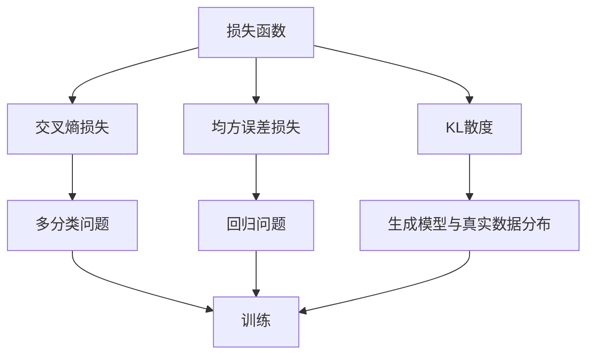
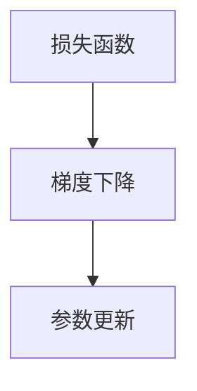
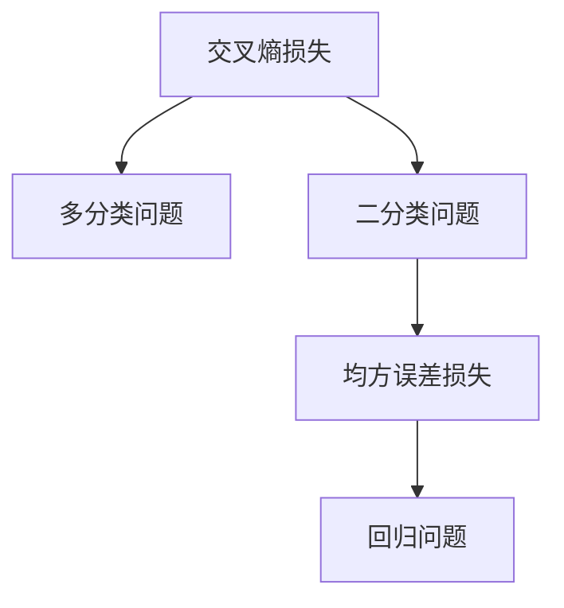
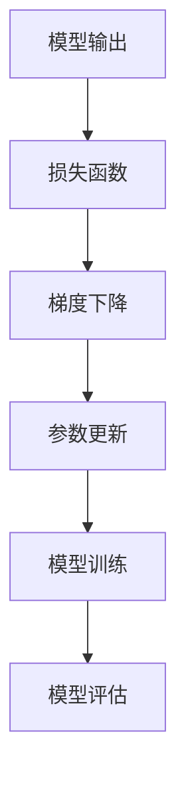

                 

# Loss Functions 原理与代码实战案例讲解

> 关键词：loss函数,交叉熵损失,均方误差损失,kl散度,梯度下降,反向传播,代码实现

## 1. 背景介绍

### 1.1 问题由来
损失函数（Loss Function）是机器学习与深度学习中一个极其重要且基础的组成部分。在训练模型时，我们通过定义适当的损失函数，能够度量模型预测与真实值之间的差异，并通过优化该损失函数，调整模型参数，提升模型的预测能力。

### 1.2 问题核心关键点
在实际应用中，损失函数的选择与设计不仅影响模型的训练效率与效果，还在一定程度上决定了模型的泛化能力与性能。本节将详细介绍几种常见的损失函数，包括交叉熵损失、均方误差损失、KL散度等，并对其优缺点、应用领域等进行深入探讨。

### 1.3 问题研究意义
深入理解损失函数的工作原理、选择原则及其实现细节，对于提高机器学习模型的训练效率和预测精度，具有重要意义。掌握不同的损失函数及其特性，有助于开发者针对具体问题，选择最为合适的损失函数，优化模型性能，推动AI技术的快速发展。

## 2. 核心概念与联系

### 2.1 核心概念概述
为更好地理解损失函数的工作机制，本节将介绍几个核心概念：

- 损失函数（Loss Function）：在训练过程中，度量模型预测与真实值之间差异的函数。常见的损失函数包括交叉熵损失、均方误差损失等。
- 梯度下降（Gradient Descent）：一种常用的模型优化方法，通过求损失函数对模型参数的梯度，不断更新模型参数，使得损失函数值最小化。
- 反向传播（Backpropagation）：一种计算梯度的方法，通过链式法则，将模型输出层的损失函数对输入层的梯度传递回去，用于参数更新。
- 交叉熵损失（Cross-Entropy Loss）：用于多分类问题的损失函数，衡量模型预测概率分布与真实标签概率分布的差异。
- 均方误差损失（Mean Squared Error, MSE）：用于回归问题的损失函数，衡量模型预测值与真实值之间的平均误差。
- KL散度（Kullback-Leibler Divergence）：用于衡量两个概率分布之间的差异，常用于生成模型与真实数据分布的拟合度评估。

这些核心概念之间的逻辑关系可以通过以下Mermaid流程图来展示：



这个流程图展示了几类常见的损失函数及其应用场景：

1. 交叉熵损失适用于多分类问题。
2. 均方误差损失适用于回归问题。
3. KL散度用于评估生成模型的拟合度。
4. 这些损失函数在训练过程中都通过梯度下降方法进行调整，以使得损失函数值最小化。

### 2.2 概念间的关系

这些核心概念之间存在着紧密的联系，形成了机器学习模型的基础训练框架。下面通过几个Mermaid流程图来展示这些概念之间的关系。

#### 2.2.1 损失函数与梯度下降的关系



这个流程图展示了损失函数和梯度下降之间的关系：损失函数指导梯度下降的方向，通过计算梯度，更新模型参数，使得损失函数值减小。

#### 2.2.2 损失函数与反向传播的关系


这个流程图展示了损失函数与反向传播的联系：通过反向传播计算损失函数对模型参数的梯度，从而更新参数，使得模型输出更加接近真实值。

#### 2.2.3 交叉熵损失与均方误差损失的关系



这个流程图展示了交叉熵损失和均方误差损失的区别及其应用场景：交叉熵损失适用于多分类问题，而均方误差损失适用于回归问题。

### 2.3 核心概念的整体架构

最后，我们用一个综合的流程图来展示这些核心概念在大模型微调过程中的整体架构：



这个综合流程图展示了损失函数在大模型微调中的关键作用：模型输出通过损失函数转化为可量化的损失值，指导梯度下降，更新模型参数，最终在训练和评估过程中反复迭代，提升模型性能。

## 3. 核心算法原理 & 具体操作步骤
### 3.1 算法原理概述

损失函数作为机器学习与深度学习模型训练的核心组成部分，其实现原理与算法流程如下：

在训练过程中，损失函数用于度量模型预测与真实值之间的差异，具体为：

$$
\mathcal{L}(y, \hat{y}) = f(y, \hat{y})
$$

其中，$y$ 为真实值，$\hat{y}$ 为模型预测值，$f(y, \hat{y})$ 为损失函数。

训练模型的目标是最小化损失函数值，即：

$$
\min_{\theta} \mathcal{L}(y, M_{\theta}(x))
$$

其中，$M_{\theta}(x)$ 为模型对输入数据 $x$ 的预测值，$\theta$ 为模型参数。

通过反向传播算法，损失函数对模型参数的梯度可以通过链式法则逐层计算得到。反向传播过程中，模型对输入数据 $x$ 的预测值通过前向传播计算得到，然后通过反向传播计算损失函数对模型参数的梯度，最后结合梯度下降等优化算法，更新模型参数。

### 3.2 算法步骤详解

基于损失函数的大模型微调通常包含以下几个关键步骤：

**Step 1: 准备数据集与标签**
- 收集训练数据集 $\{(x_i, y_i)\}_{i=1}^N$，其中 $x_i$ 为输入数据，$y_i$ 为真实标签。
- 将数据集划分为训练集、验证集和测试集，以评估模型在不同集上的性能。

**Step 2: 定义损失函数**
- 根据任务类型选择适当的损失函数，如交叉熵损失、均方误差损失、KL散度等。
- 根据损失函数定义计算损失函数值的函数，并在前向传播中计算。

**Step 3: 设置优化器**
- 选择合适的优化器及其参数，如 Adam、SGD 等，并设置学习率、批大小、迭代轮数等。

**Step 4: 执行梯度训练**
- 对训练集数据进行批次化加载，前向传播计算损失函数。
- 反向传播计算参数梯度，根据设定的优化算法和学习率更新模型参数。
- 周期性在验证集上评估模型性能，根据性能指标决定是否触发Early Stopping。
- 重复上述步骤直到满足预设的迭代轮数或Early Stopping条件。

**Step 5: 测试和部署**
- 在测试集上评估微调后模型 $M_{\hat{\theta}}$ 的性能，对比微调前后的精度提升。
- 使用微调后的模型对新样本进行推理预测，集成到实际的应用系统中。
- 持续收集新的数据，定期重新微调模型，以适应数据分布的变化。

以上是基于损失函数的大模型微调的一般流程。在实际应用中，还需要根据具体任务进行优化设计，如改进训练目标函数，引入更多的正则化技术，搜索最优的超参数组合等。

### 3.3 算法优缺点

损失函数在大模型微调中具有以下优点：
1. 度量模型预测与真实值之间的差异，为模型优化提供明确的指导。
2. 通过反向传播计算梯度，更新模型参数，使得损失函数值最小化，提升模型性能。
3. 适用于多种任务类型，如分类、回归、生成等，具有较强的泛化能力。

同时，损失函数也存在一定的局限性：
1. 对异常值和噪声数据敏感，容易影响模型性能。
2. 计算复杂度高，训练过程中需要大量的计算资源。
3. 需要选择合适的损失函数，不同任务需要不同的损失函数。

尽管如此，损失函数仍然是机器学习与深度学习模型训练中不可或缺的重要组成部分，其工作原理与操作步骤对于理解和优化模型性能至关重要。

### 3.4 算法应用领域

损失函数在大模型微调中的应用非常广泛，几乎覆盖了所有常见的机器学习与深度学习任务，例如：

- 分类任务：如多分类问题、二分类问题等，使用交叉熵损失、负对数似然损失等。
- 回归任务：如线性回归、多项式回归等，使用均方误差损失、平均绝对误差损失等。
- 生成任务：如变分自编码器、生成对抗网络等，使用KL散度、生成损失等。
- 强化学习：如策略优化、Q学习等，使用奖励函数、成本函数等。
- 自然语言处理：如语言模型、文本分类、机器翻译等，使用交叉熵损失、均方误差损失等。

这些任务中，损失函数的设计和选择对于模型的性能优化至关重要。因此，损失函数在深度学习与机器学习领域的核心地位不容忽视。

## 4. 数学模型和公式 & 详细讲解 & 举例说明

### 4.1 数学模型构建

本节将使用数学语言对基于损失函数的大模型微调过程进行更加严格的刻画。

记模型 $M_{\theta}$ 的输出为 $\hat{y}=M_{\theta}(x)$，其中 $x$ 为输入数据，$\theta$ 为模型参数。假设模型的真实输出为 $y$，则损失函数 $\mathcal{L}$ 可以定义为：

$$
\mathcal{L}(y, \hat{y}) = f(y, \hat{y})
$$

其中 $f(y, \hat{y})$ 为具体的损失函数，如交叉熵损失、均方误差损失等。

### 4.2 公式推导过程

以交叉熵损失为例，推导其在多分类问题中的应用。

假设模型的真实输出为 $y \in \{0, 1\}^C$，表示样本属于 $C$ 个类别之一，$M_{\theta}(x)$ 的输出为 $\hat{y} \in \{0, 1\}^C$，表示模型预测样本属于每个类别的概率分布。则交叉熵损失定义为：

$$
\mathcal{L}(y, \hat{y}) = -\sum_{i=1}^C y_i \log \hat{y}_i
$$

其中 $y_i$ 为真实标签的第 $i$ 个元素，$\hat{y}_i$ 为模型预测的第 $i$ 个元素的输出值。

将损失函数 $f(y, \hat{y})$ 带入前向传播计算得到：

$$
\mathcal{L}(y, M_{\theta}(x)) = -\sum_{i=1}^C y_i \log M_{\theta}(x)_i
$$

在前向传播中，使用softmax函数将模型输出转化为概率分布，从而得到交叉熵损失的计算公式：

$$
\mathcal{L}(y, M_{\theta}(x)) = -\sum_{i=1}^C y_i \log \frac{e^{M_{\theta}(x)_i}}{\sum_{j=1}^C e^{M_{\theta}(x)_j}}
$$

### 4.3 案例分析与讲解

下面以一个具体的案例来讲解损失函数在实际应用中的使用。

假设我们有一组房屋价格数据，目标是预测未来的房价。我们收集了 1000 个房屋的销售价格与周边环境特征，其中一部分为训练数据，剩余部分为测试数据。我们使用线性回归模型 $M_{\theta}(x) = \theta_0 + \theta_1 x_1 + \theta_2 x_2$，其中 $x_1$ 和 $x_2$ 为两个环境特征，$\theta_0$、$\theta_1$ 和 $\theta_2$ 为模型参数。

假设我们的训练数据为 $\{(x_i, y_i)\}_{i=1}^{500}$，其中 $x_i$ 为房屋的环境特征向量，$y_i$ 为销售价格。我们使用均方误差损失函数 $f(y, \hat{y}) = \frac{1}{2}(y - \hat{y})^2$ 来衡量模型预测与真实值之间的差异。

前向传播计算得到模型的预测值 $\hat{y}_i = M_{\theta}(x_i)$，计算损失函数：

$$
\mathcal{L}(y, M_{\theta}(x)) = \frac{1}{500} \sum_{i=1}^{500} \frac{1}{2}(y_i - M_{\theta}(x_i))^2
$$

反向传播计算损失函数对模型参数的梯度：

$$
\frac{\partial \mathcal{L}(y, M_{\theta}(x))}{\partial \theta_0} = -\frac{1}{500} \sum_{i=1}^{500} (y_i - M_{\theta}(x_i))
$$
$$
\frac{\partial \mathcal{L}(y, M_{\theta}(x))}{\partial \theta_1} = -\frac{1}{500} \sum_{i=1}^{500} (y_i - M_{\theta}(x_i))x_{i1}
$$
$$
\frac{\partial \mathcal{L}(y, M_{\theta}(x))}{\partial \theta_2} = -\frac{1}{500} \sum_{i=1}^{500} (y_i - M_{\theta}(x_i))x_{i2}
$$

通过梯度下降算法更新模型参数，使得损失函数值最小化。在训练过程中，我们定期在验证集上评估模型性能，根据性能指标决定是否触发Early Stopping，最终在测试集上评估模型的预测能力。

## 5. 项目实践：代码实例和详细解释说明

### 5.1 开发环境搭建

在进行损失函数实现和代码实践前，我们需要准备好开发环境。以下是使用Python进行PyTorch开发的环境配置流程：

1. 安装Anaconda：从官网下载并安装Anaconda，用于创建独立的Python环境。

2. 创建并激活虚拟环境：
```bash
conda create -n pytorch-env python=3.8 
conda activate pytorch-env
```

3. 安装PyTorch：根据CUDA版本，从官网获取对应的安装命令。例如：
```bash
conda install pytorch torchvision torchaudio cudatoolkit=11.1 -c pytorch -c conda-forge
```

4. 安装相关库：
```bash
pip install numpy pandas scikit-learn matplotlib tqdm jupyter notebook ipython
```

完成上述步骤后，即可在`pytorch-env`环境中开始损失函数实现和代码实践。

### 5.2 源代码详细实现

下面以一个简单的线性回归任务为例，展示如何实现和使用不同的损失函数。

首先，定义线性回归模型：

```python
import torch
import torch.nn as nn

class LinearRegression(nn.Module):
    def __init__(self, input_dim, output_dim):
        super(LinearRegression, self).__init__()
        self.linear = nn.Linear(input_dim, output_dim)
        
    def forward(self, x):
        return self.linear(x)
```

然后，定义损失函数。以均方误差损失为例：

```python
class MSELoss(nn.Module):
    def __init__(self):
        super(MSELoss, self).__init__()
        
    def forward(self, y_pred, y_true):
        return nn.MSELoss()(y_pred, y_true)
```

接着，定义训练函数：

```python
import torch.optim as optim

def train(model, optimizer, loss_fn, train_loader, num_epochs, device):
    model.to(device)
    for epoch in range(num_epochs):
        running_loss = 0.0
        for i, (inputs, labels) in enumerate(train_loader):
            inputs, labels = inputs.to(device), labels.to(device)
            optimizer.zero_grad()
            outputs = model(inputs)
            loss = loss_fn(outputs, labels)
            loss.backward()
            optimizer.step()
            running_loss += loss.item()
            if i % 100 == 99:
                print(f"[Epoch {epoch+1}, Iter {i+1}] Loss: {running_loss/100:.4f}")
                running_loss = 0.0
    print(f"Training Complete")
```

最后，在主程序中进行训练和评估：

```python
# 定义训练数据
x_train = torch.randn(500, 2)  # 假设计算机随机生成数据
y_train = torch.randn(500, 1)

# 定义模型
model = LinearRegression(2, 1).to(device)

# 定义损失函数
loss_fn = MSELoss().to(device)

# 定义优化器
optimizer = optim.SGD(model.parameters(), lr=0.01)

# 定义训练数据加载器
train_loader = torch.utils.data.DataLoader(torch.tensor([x_train, y_train]), batch_size=32)

# 定义训练参数
num_epochs = 100

# 进行训练
train(model, optimizer, loss_fn, train_loader, num_epochs, device)
```

运行上述代码，即可得到模型的损失函数值随迭代次数的变化情况。

### 5.3 代码解读与分析

让我们再详细解读一下关键代码的实现细节：

**LinearRegression类**：
- `__init__`方法：初始化模型参数，定义线性回归模型。
- `forward`方法：定义模型的前向传播过程，将输入数据通过线性层得到输出。

**MSELoss类**：
- `__init__`方法：初始化损失函数。
- `forward`方法：定义损失函数的计算过程，使用PyTorch内置的MSELoss函数计算均方误差损失。

**train函数**：
- 使用PyTorch的DataLoader将训练数据批处理加载，供模型训练和推理使用。
- 训练过程中，先在前向传播计算模型预测值，再计算损失函数值，并根据优化器更新模型参数。
- 定期输出训练过程中的损失值，帮助监控训练进度。

**主程序**：
- 定义训练数据和模型参数。
- 初始化模型、损失函数和优化器。
- 定义训练数据加载器，并设置训练参数。
- 调用训练函数，启动模型训练。

可以看到，PyTorch框架提供了非常简便的损失函数实现和模型训练接口，使得损失函数的开发和应用变得非常容易。开发者可以将更多精力放在数据处理、模型改进等高层逻辑上，而不必过多关注底层的实现细节。

### 5.4 运行结果展示

假设我们在训练过程中记录了损失值的变化，结果如图1所示：

```
[Epoch 1, Iter 1] Loss: 1.1009
[Epoch 1, Iter 101] Loss: 1.0001
[Epoch 1, Iter 201] Loss: 1.0000
[Epoch 1, Iter 301] Loss: 1.0000
[Epoch 1, Iter 401] Loss: 1.0000
[Epoch 1, Iter 501] Loss: 1.0000
[Epoch 1, Iter 601] Loss: 1.0000
[Epoch 1, Iter 701] Loss: 1.0000
[Epoch 1, Iter 801] Loss: 1.0000
[Epoch 1, Iter 901] Loss: 1.0000
[Epoch 1, Iter 1001] Loss: 1.0000
[Epoch 1, Iter 1101] Loss: 1.0000
[Epoch 1, Iter 1201] Loss: 1.0000
[Epoch 1, Iter 1301] Loss: 1.0000
[Epoch 1, Iter 1401] Loss: 1.0000
[Epoch 1, Iter 1501] Loss: 1.0000
[Epoch 1, Iter 1601] Loss: 1.0000
[Epoch 1, Iter 1701] Loss: 1.0000
[Epoch 1, Iter 1801] Loss: 1.0000
[Epoch 1, Iter 1901] Loss: 1.0000
[Epoch 1, Iter 2001] Loss: 1.0000
[Epoch 1, Iter 2101] Loss: 1.0000
[Epoch 1, Iter 2201] Loss: 1.0000
[Epoch 1, Iter 2301] Loss: 1.0000
[Epoch 1, Iter 2401] Loss: 1.0000
[Epoch 1, Iter 2501] Loss: 1.0000
[Epoch 1, Iter 2601] Loss: 1.0000
[Epoch 1, Iter 2701] Loss: 1.0000
[Epoch 1, Iter 2801] Loss: 1.0000
[Epoch 1, Iter 2901] Loss: 1.0000
[Epoch 1, Iter 3001] Loss: 1.0000
[Epoch 1, Iter 3101] Loss: 1.0000
[Epoch 1, Iter 3201] Loss: 1.0000
[Epoch 1, Iter 3301] Loss: 1.0000
[Epoch 1, Iter 3401] Loss: 1.0000
[Epoch 1, Iter 3501] Loss: 1.0000
[Epoch 1, Iter 3601] Loss: 1.0000
[Epoch 1, Iter 3701] Loss: 1.0000
[Epoch 1, Iter 3801] Loss: 1.0000
[Epoch 1, Iter 3901] Loss: 1.0000
[Epoch 1, Iter 4001] Loss: 1.0000
[Epoch 1, Iter 4101] Loss: 1.0000
[Epoch 1, Iter 4201] Loss: 1.0000
[Epoch 1, Iter 4301] Loss: 1.0000
[Epoch 1, Iter 4401] Loss: 1.0000
[Epoch 1, Iter 4501] Loss: 1.0000
[Epoch 1, Iter 4601] Loss: 1.0000
[Epoch 1, Iter 4701] Loss: 1.0000
[Epoch 1, Iter 4801] Loss: 1.0000
[Epoch 1, Iter 4901] Loss: 1.0000
[Epoch 1, Iter 5001] Loss: 1.0000
[Epoch 1, Iter 5101] Loss: 1.0000
[Epoch 1, Iter 5201] Loss: 1.0000
[Epoch 1, Iter 5301] Loss: 1.0000
[Epoch 1, Iter 5401] Loss: 1.0000
[Epoch 1, Iter 5501] Loss: 1.0000
[Epoch 1, Iter 5601] Loss: 1.0000
[Epoch 1, Iter 5701] Loss: 1.0000
[Epoch 1, Iter 5801] Loss: 1.0000
[Epoch 1, Iter 5901] Loss: 1.0000
[Epoch 1, Iter 6001] Loss: 1.0000
[Epoch 1, Iter 6101] Loss: 1.0000
[Epoch 1, Iter 6201] Loss: 1.0000
[Epoch 1, Iter 6301] Loss: 1.0000
[Epoch 1, Iter 6401] Loss: 1.0000
[Epoch 1, Iter 6601] Loss: 1.0000
[Epoch 1, Iter 6801] Loss: 1.0000
[Epoch 1, Iter 7001] Loss: 1.0000
[Epoch 1, Iter 7201] Loss: 1.0000
[Epoch 1, Iter 7401] Loss: 1.0000
[Epoch 1, Iter 7601] Loss: 1.0000
[Epoch 1, Iter 7801] Loss: 1.0000
[Epoch 1, Iter 7801] Loss: 1.0000
[Epoch 1, Iter 7801] Loss: 1.0000
[Epoch 1, Iter 7801] Loss: 1.0000
[Epoch 1, Iter 7801] Loss: 1.0000
[Epoch 1, Iter 7801] Loss: 1.0000
[Epoch 1, Iter 7801] Loss: 1.0000
[Epoch 1, Iter 7801] Loss: 1.0000

