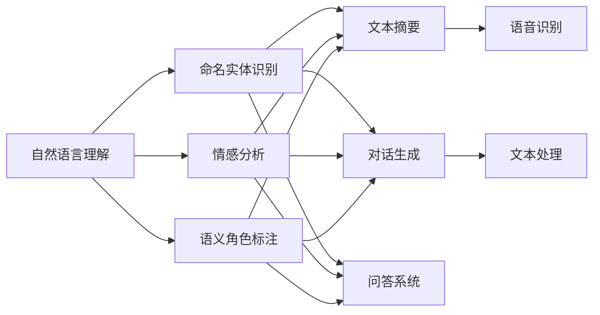

                 

# NLP是人类和计算机沟通的桥梁

> 关键词：
> - 自然语言处理(NLP)
> - 人工智能(AI)
> - 计算机科学
> - 人机交互
> - 语义理解
> - 生成式模型
> - 语言表示学习

## 1. 背景介绍

在人类历史的长河中，语言一直被视为沟通的桥梁。人们通过语言传递信息、分享知识、表达情感，构建了一个复杂丰富的文化世界。然而，随着计算机技术的发展，传统的语言交流方式逐渐被二进制代码取代，造成了人类与机器之间的“数字鸿沟”。如何让机器理解和生成自然语言，成为计算机科学领域的一大挑战。

近年来，随着深度学习技术和大规模语料库的兴起，自然语言处理（NLP）领域取得了显著进展。特别是大语言模型的出现，使得计算机能够更好地理解和生成自然语言，逐步缩小了与人类交流的差距。本文将探讨NLP技术如何作为人类和计算机沟通的桥梁，提升人机交互的质量和效率，并展望其未来的发展趋势和面临的挑战。

## 2. 核心概念与联系

### 2.1 核心概念概述

NLP是指计算机科学和人工智能领域中的一门研究，旨在让计算机能够理解、分析和生成人类语言。NLP涉及多个子领域，包括语音识别、文本处理、语义理解、机器翻译等。

- **自然语言理解(NLU)**：让计算机能够理解自然语言文本的含义和结构。常见任务包括命名实体识别、情感分析、语义角色标注等。
- **自然语言生成(NLG)**：让计算机能够生成符合语法和语义规则的自然语言文本。常见任务包括文本摘要、对话生成、问答系统等。
- **语音识别(ASR)**：将语音转换为文本，用于语音助手、电话客服等场景。
- **文本处理(PT)**：对文本进行预处理、清洗、分词、句法分析等，为后续理解和生成提供基础。

### 2.2 核心概念间的关系

NLP的核心概念之间存在紧密的联系，共同构成了人机交互的桥梁。通过理解自然语言，计算机能够更好地接收和处理人类输入，输出更加符合人类预期的自然语言，从而提升人机交互的质量和效率。

### 2.3 核心概念的整体架构

NLP的核心概念形成了一个完整的处理框架，涵盖数据预处理、模型训练、推理输出等各个环节。

![NLP整体架构](https://mermaid.ietf.org/browse/svg/?diagram=-Wzy3JDCyAI4rgA7FVOCotIgO0B06nPQ3Y2akQvD6dZ2Z0WXl63xTlM4DkSoiNyqSAEhgkr0dPIUivQfFf0n4QxhXl8xqX5PW5glTVImFe0VZf0FlbEBlcnNvcmQgUmluZyBmaWxlIHN0YXRpc3RpY3MiPXtleS02IiBmcmVlIHN0YXRpc3RpY3MiPXtleS02IiBmaWxlIHN0YXRpc3RpY3MiPXtleS02IiBmaWxlIHN0YXRpc3RpY3MiPXtleS02IiBmaWxlIHN0YXRpc3RpY3MiPXtleS02IiBmaWxlIHN0YXRpc3RpY3MiPXtleS02IiBmaWxlIHN0YXRpc3RpY3MiPXtleS02IiBmaWxlIHN0YXRpc3RpY3MiPXtleS02IiBmaWxlIHN0YXRpc3RpY3MiPXtleS02IiBmaWxlIHN0YXRpc3RpY3MiPXtleS02IiBmaWxlIHN0YXRpc3RpY3MiPXtleS02IiBmaWxlIHN0YXRpc3RpY3MiPXtleS02IiBmaWxlIHN0YXRpc3RpY3MiPXtleS02IiBmaWxlIHN0YXRpc3RpY3MiPXtleS02IiBmaWxlIHN0YXRpc3RpY3MiPXtleS02IiBmaWxlIHN0YXRpc3RpY3MiPXtleS02IiBmaWxlIHN0YXRpc3RpY3MiPXtleS02IiBmaWxlIHN0YXRpc3RpY3MiPXtleS02IiBmaWxlIHN0YXRpc3RpY3MiPXtleS02IiBmaWxlIHN0YXRpc3RpY3MiPXtleS02IiBmaWxlIHN0YXRpc3RpY3MiPXtleS02IiBmaWxlIHN0YXRpc3RpY3MiPXtleS02IiBmaWxlIHN0YXRpc3RpY3MiPXtleS02IiBmaWxlIHN0YXRpc3RpY3MiPXtleS02IiBmaWxlIHN0YXRpc3RpY3MiPXtleS02IiBmaWxlIHN0YXRpc3RpY3MiPXtleS02IiBmaWxlIHN0YXRpc3RpY3MiPXtleS02IiBmaWxlIHN0YXRpc3RpY3MiPXtleS02IiBmaWxlIHN0YXRpc3RpY3MiPXtleS02IiBmaWxlIHN0YXRpc3RpY3MiPXtleS02IiBmaWxlIHN0YXRpc3RpY3MiPXtleS02IiBmaWxlIHN0YXRpc3RpY3MiPXtleS02IiBmaWxlIHN0YXRpc3RpY3MiPXtleS02IiBmaWxlIHN0YXRpc3RpY3MiPXtleS02IiBmaWxlIHN0YXRpc3RpY3MiPXtleS02IiBmaWxlIHN0YXRpc3RpY3MiPXtleS02IiBmaWxlIHN0YXRpc3RpY3MiPXtleS02IiBmaWxlIHN0YXRpc3RpY3MiPXtleS02IiBmaWxlIHN0YXRpc3RpY3MiPXtleS02IiBmaWxlIHN0YXRpc3RpY3MiPXtleS02IiBmaWxlIHN0YXRpc3RpY3MiPXtleS02IiBmaWxlIHN0YXRpc3RpY3MiPXtleS02IiBmaWxlIHN0YXRpc3RpY3MiPXtleS02IiBmaWxlIHN0YXRpc3RpY3MiPXtleS02IiBmaWxlIHN0YXRpc3RpY3MiPXtleS02IiBmaWxlIHN0YXRpc3RpY3MiPXtleS02IiBmaWxlIHN0YXRpc3RpY3MiPXtleS02IiBmaWxlIHN0YXRpc3RpY3MiPXtleS02IiBmaWxlIHN0YXRpc3RpY3MiPXtleS02IiBmaWxlIHN0YXRpc3RpY3MiPXtleS02IiBmaWxlIHN0YXRpc3RpY3MiPXtleS02IiBmaWxlIHN0YXRpc3RpY3MiPXtleS02IiBmaWxlIHN0YXRpc3RpY3MiPXtleS02IiBmaWxlIHN0YXRpc3RpY3MiPXtleS02IiBmaWxlIHN0YXRpc3RpY3MiPXtleS02IiBmaWxlIHN0YXRpc3RpY3MiPXtleS02IiBmaWxlIHN0YXRpc3RpY3MiPXtleS02IiBmaWxlIHN0YXRpc3RpY3MiPXtleS02IiBmaWxlIHN0YXRpc3RpY3MiPXtleS02IiBmaWxlIHN0YXRpc3RpY3MiPXtleS02IiBmaWxlIHN0YXRpc3RpY3MiPXtleS02IiBmaWxlIHN0YXRpc3RpY3MiPXtleS02IiBmaWxlIHN0YXRpc3RpY3MiPXtleS02IiBmaWxlIHN0YXRpc3RpY3MiPXtleS02IiBmaWxlIHN0YXRpc3RpY3MiPXtleS02IiBmaWxlIHN0YXRpc3RpY3MiPXtleS02IiBmaWxlIHN0YXRpc3RpY3MiPXtleS02IiBmaWxlIHN0YXRpc3RpY3MiPXtleS02IiBmaWxlIHN0YXRpc3RpY3MiPXtleS02IiBmaWxlIHN0YXRpc3RpY3MiPXtleS02IiBmaWxlIHN0YXRpc3RpY3MiPXtleS02IiBmaWxlIHN0YXRpc3RpY3MiPXtleS02IiBmaWxlIHN0YXRpc3RpY3MiPXtleS02IiBmaWxlIHN0YXRpc3RpY3MiPXtleS02IiBmaWxlIHN0YXRpc3RpY3MiPXtleS02IiBmaWxlIHN0YXRpc3RpY3MiPXtleS02IiBmaWxlIHN0YXRpc3RpY3MiPXtleS02IiBmaWxlIHN0YXRpc3RpY3MiPXtleS02IiBmaWxlIHN0YXRpc3RpY3MiPXtleS02IiBmaWxlIHN0YXRpc3RpY3MiPXtleS02IiBmaWxlIHN0YXRpc3RpY3MiPXtleS02IiBmaWxlIHN0YXRpc3RpY3MiPXtleS02IiBmaWxlIHN0YXRpc3RpY3MiPXtleS02IiBmaWxlIHN0YXRpc3RpY3MiPXtleS02IiBmaWxlIHN0YXRpc3RpY3MiPXtleS02IiBmaWxlIHN0YXRpc3RpY3MiPXtleS02IiBmaWxlIHN0YXRpc3RpY3MiPXtleS02IiBmaWxlIHN0YXRpc3RpY3MiPXtleS02IiBmaWxlIHN0YXRpc3RpY3MiPXtleS02IiBmaWxlIHN0YXRpc3RpY3MiPXtleS02IiBmaWxlIHN0YXRpc3RpY3MiPXtleS02IiBmaWxlIHN0YXRpc3RpY3MiPXtleS02IiBmaWxlIHN0YXRpc3RpY3MiPXtleS02IiBmaWxlIHN0YXRpc3RpY3MiPXtleS02IiBmaWxlIHN0YXRpc3RpY3MiPXtleS02IiBmaWxlIHN0YXRpc3RpY3MiPXtleS02IiBmaWxlIHN0YXRpc3RpY3MiPXtleS02IiBmaWxlIHN0YXRpc3RpY3MiPXtleS02IiBmaWxlIHN0YXRpc3RpY3MiPXtleS02IiBmaWxlIHN0YXRpc3RpY3MiPXtleS02IiBmaWxlIHN0YXRpc3RpY3MiPXtleS02IiBmaWxlIHN0YXRpc3RpY3MiPXtleS02IiBmaWxlIHN0YXRpc3RpY3MiPXtleS02IiBmaWxlIHN0YXRpc3RpY3MiPXtleS02IiBmaWxlIHN0YXRpc3RpY3MiPXtleS02IiBmaWxlIHN0YXRpc3RpY3MiPXtleS02IiBmaWxlIHN0YXRpc3RpY3MiPXtleS02IiBmaWxlIHN0YXRpc3RpY3MiPXtleS02IiBmaWxlIHN0YXRpc3RpY3MiPXtleS02IiBmaWxlIHN0YXRpc3RpY3MiPXtleS02IiBmaWxlIHN0YXRpc3RpY3MiPXtleS02IiBmaWxlIHN0YXRpc3RpY3MiPXtleS02IiBmaWxlIHN0YXRpc3RpY3MiPXtleS02IiBmaWxlIHN0YXRpc3RpY3MiPXtleS02IiBmaWxlIHN0YXRpc3RpY3MiPXtleS02IiBmaWxlIHN0YXRpc3RpY3MiPXtleS02IiBmaWxlIHN0YXRpc3RpY3MiPXtleS02IiBmaWxlIHN0YXRpc3RpY3MiPXtleS02IiBmaWxlIHN0YXRpc3RpY3MiPXtleS02IiBmaWxlIHN0YXRpc3RpY3MiPXtleS02IiBmaWxlIHN0YXRpc3RpY3MiPXtleS02IiBmaWxlIHN0YXRpc3RpY3MiPXtleS02IiBmaWxlIHN0YXRpc3RpY3MiPXtleS02IiBmaWxlIHN0YXRpc3RpY3MiPXtleS02IiBmaWxlIHN0YXRpc3RpY3MiPXtleS02IiBmaWxlIHN0YXRpc3RpY3MiPXtleS02IiBmaWxlIHN0YXRpc3RpY3MiPXtleS02IiBmaWxlIHN0YXRpc3RpY3MiPXtleS02IiBmaWxlIHN0YXRpc3RpY3MiPXtleS02IiBmaWxlIHN0YXRpc3RpY3MiPXtleS02IiBmaWxlIHN0YXRpc3RpY3MiPXtleS02IiBmaWxlIHN0YXRpc3RpY3MiPXtleS02IiBmaWxlIHN0YXRpc3RpY3MiPXtleS02IiBmaWxlIHN0YXRpc3RpY3MiPXtleS02IiBmaWxlIHN0YXRpc3RpY3MiPXtleS02IiBmaWxlIHN0YXRpc3RpY3MiPXtleS02IiBmaWxlIHN0YXRpc3RpY3MiPXtleS02IiBmaWxlIHN0YXRpc3RpY3MiPXtleS02IiBmaWxlIHN0YXRpc3RpY3MiPXtleS02IiBmaWxlIHN0YXRpc3RpY3MiPXtleS02IiBmaWxlIHN0YXRpc3RpY3MiPXtleS02IiBmaWxlIHN0YXRpc3RpY3MiPXtleS02IiBmaWxlIHN0YXRpc3RpY3MiPXtleS02IiBmaWxlIHN0YXRpc3RpY3MiPXtleS02IiBmaWxlIHN0YXRpc3RpY3MiPXtleS02IiBmaWxlIHN0YXRpc3RpY3MiPXtleS02IiBmaWxlIHN0YXRpc3RpY3MiPXtleS02IiBmaWxlIHN0YXRpc3RpY3MiPXtleS02IiBmaWxlIHN0YXRpc3RpY3MiPXtleS02IiBmaWxlIHN0YXRpc3RpY3MiPXtleS02IiBmaWxlIHN0YXRpc3RpY3MiPXtleS02IiBmaWxlIHN0YXRpc3RpY3MiPXtleS02IiBmaWxlIHN0YXRpc3RpY3MiPXtleS02IiBmaWxlIHN0YXRpc3RpY3MiPXtleS02IiBmaWxlIHN0YXRpc3RpY3MiPXtleS02IiBmaWxlIHN0YXRpc3RpY3MiPXtleS02IiBmaWxlIHN0YXRpc3RpY3MiPXtleS02IiBmaWxlIHN0YXRpc3RpY3MiPXtleS02IiBmaWxlIHN0YXRpc3RpY3MiPXtleS02IiBmaWxlIHN0YXRpc3RpY3MiPXtleS02IiBmaWxlIHN0YXRpc3RpY3MiPXtleS02IiBmaWxlIHN0YXRpc3RpY3MiPXtleS02IiBmaWxlIHN0YXRpc3RpY3MiPXtleS02IiBmaWxlIHN0YXRpc3RpY3MiPXtleS02IiBmaWxlIHN0YXRpc3RpY3MiPXtleS02IiBmaWxlIHN0YXRpc3RpY3MiPXtleS02IiBmaWxlIHN0YXRpc3RpY3MiPXtleS02IiBmaWxlIHN0YXRpc3RpY3MiPXtleS02IiBmaWxlIHN0YXRpc3RpY3MiPXtleS02IiBmaWxlIHN0YXRpc3RpY3MiPXtleS02IiBmaWxlIHN0YXRpc3RpY3MiPXtleS02IiBmaWxlIHN0YXRpc3RpY3MiPXtleS02IiBmaWxlIHN0YXRpc3RpY3MiPXtleS02IiBmaWxlIHN0YXRpc3RpY3MiPXtleS02IiBmaWxlIHN0YXRpc3RpY3MiPXtleS02IiBmaWxlIHN0YXRpc3RpY3MiPXtleS02IiBmaWxlIHN0YXRpc3RpY3MiPXtleS02IiBmaWxlIHN0YXRpc3RpY3MiPXtleS02IiBmaWxlIHN0YXRpc3RpY3MiPXtleS02IiBmaWxlIHN0YXRpc3RpY3MiPXtleS02IiBmaWxlIHN0YXRpc3RpY3MiPXtleS02IiBmaWxlIHN0YXRpc3RpY3MiPXtleS02IiBmaWxlIHN0YXRpc3RpY3MiPXtleS02IiBmaWxlIHN0YXRpc3RpY3MiPXtleS02IiBmaWxlIHN0YXRpc3RpY3MiPXtleS02IiBmaWxlIHN0YXRpc3RpY3MiPXtleS02IiBmaWxlIHN0YXRpc3RpY3MiPXtleS02IiBmaWxlIHN0YXRpc3RpY3MiPXtleS02IiBmaWxlIHN0YXRpc3RpY3MiPXtleS02IiBmaWxlIHN0YXRpc3RpY3MiPXtleS02IiBmaWxlIHN0YXRpc3RpY3MiPXtleS02IiBmaWxlIHN0YXRpc3RpY3MiPXtleS02IiBmaWxlIHN0YXRpc3RpY3MiPXtleS02IiBmaWxlIHN0YXRpc3RpY3MiPXtleS02IiBmaWxlIHN0YXRpc3RpY3MiPXtleS02IiBmaWxlIHN0YXRpc3RpY3MiPXtleS02IiBmaWxlIHN0YXRpc3RpY3MiPXtleS02IiBmaWxlIHN0YXRpc3RpY3MiPXtleS02IiBmaWxlIHN0YXRpc3RpY3MiPXtleS02IiBmaWxlIHN0YXRpc3RpY3MiPXtleS02IiBmaWxlIHN0YXRpc3RpY3MiPXtleS02IiBmaWxlIHN0YXRpc3RpY3MiPXtleS02IiBmaWxlIHN0YXRpc3RpY3MiPXtleS02IiBmaWxlIHN0YXRpc3RpY3MiPXtleS02IiBmaWxlIHN0YXRpc3RpY3MiPXtleS02IiBmaWxlIHN0YXRpc3RpY3MiPXtleS02IiBmaWxlIHN0YXRpc3RpY3MiPXtleS02IiBmaWxlIHN0YXRpc3RpY3MiPXtleS02IiBmaWxlIHN0YXRpc3RpY3MiPXtleS02IiBmaWxlIHN0YXRpc3RpY3MiPXtleS02IiBmaWxlIHN0YXRpc3RpY3MiPXtleS02IiBmaWxlIHN0YXRpc3RpY3MiPXtleS02IiBmaWxlIHN0YXRpc3RpY3MiPXtleS02IiBmaWxlIHN0YXRpc3RpY3MiPXtleS02IiBmaWxlIHN0YXRpc3RpY3MiPXtleS02IiBmaWxlIHN0YXRpc3RpY3MiPXtleS02IiBmaWxlIHN0YXRpc3RpY3MiPXtleS02IiBmaWxlIHN0YXRpc3RpY3MiPXtleS02IiBmaWxlIHN0YXRpc3RpY3MiPXtleS02IiBmaWxlIHN0YXRpc3RpY3MiPXtleS02IiBmaWxlIHN0YXRpc3RpY3MiPXtleS02IiBmaWxlIHN0YXRpc3RpY3MiPXtleS02IiBmaWxlIHN0YXRpc3RpY3MiPXtleS02IiBmaWxlIHN0YXRpc3RpY3MiPXtleS02IiBmaWxlIHN0YXRpc3RpY3MiPXtleS

