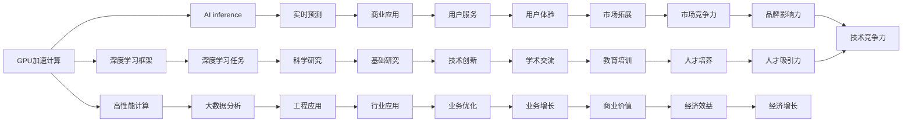

                 

# NVIDIA的算力支持

## 1. 背景介绍

随着深度学习技术和大数据计算的迅猛发展，NVIDIA作为图形处理器(GPU)领域的领军者，其推出的NVIDIA Pascal、NVIDIA Ampere等系列GPU在人工智能和数据科学领域扮演了重要角色。本文将深入探讨NVIDIA的算力支持策略，分析其在深度学习、机器学习、AI等领域的应用，并展望未来发展趋势。

## 2. 核心概念与联系

### 2.1 核心概念概述

在探讨NVIDIA的算力支持策略时，需要理解几个核心概念：

- **GPU加速计算**：GPU相对于传统的中央处理器(CPU)，在并行计算能力上有显著优势，能够大幅提升深度学习和机器学习任务的速度和效率。
- **深度学习框架**：如TensorFlow、PyTorch、MXNet等，它们通过提供GPU加速计算能力，使得深度学习任务能够高效运行。
- **高性能计算(HPC)**：指在科学计算和工程计算中，使用高性能计算机和GPU进行大规模数据分析和模拟。
- **AI inference**：即AI推理，指使用GPU加速模型，对新数据进行实时预测和推理。
- **数据中心和云服务**：GPU在数据中心和云服务中被广泛应用，用于训练和推理AI模型，加速科学研究和商业应用。

### 2.2 概念间的关系

通过以下Mermaid流程图，可以更清晰地理解上述概念之间的关系：



通过这个流程图，可以清晰地看到GPU加速计算在深度学习、高性能计算、AI推理、大数据分析等领域的广泛应用，及其对科学研究、工程应用、商业应用等各个环节的深远影响。

## 3. 核心算法原理 & 具体操作步骤

### 3.1 算法原理概述

NVIDIA的GPU加速计算通过硬件和软件的协同工作，实现了对深度学习和机器学习任务的高效支持。以下是NVIDIA GPU加速计算的核心算法原理：

- **CUDA编程模型**：NVIDIA CUDA平台提供了一组编程工具和API，使得开发者能够高效地利用GPU加速深度学习任务。
- **Tensor Cores**：NVIDIA GPU中的Tensor Cores专门用于加速深度学习计算，每个Tensor Core可以同时处理4个TP（Tensor Processing Unit），从而大幅提升深度学习任务的速度。
- **混合精度训练**：使用混合精度（如float16/float32组合）进行训练，可以在保持高精度的情况下大幅降低计算资源消耗。
- **异步数据传输**：通过GPU内部的异步数据传输机制，使得数据传输和计算可以并行进行，进一步提高计算效率。
- **自动混合精度**：NVIDIA自动混合精度功能可以自动检测模型是否适合使用混合精度训练，进一步提升训练效率。

### 3.2 算法步骤详解

以下是使用NVIDIA GPU进行深度学习任务的具体步骤：

1. **环境配置**：安装NVIDIA CUDA和cuDNN，配置好PyTorch、TensorFlow等深度学习框架，确保与NVIDIA GPU兼容。
2. **模型定义**：定义深度学习模型，如卷积神经网络(CNN)、循环神经网络(RNN)、Transformer等，并使用CUDA语句对模型进行优化。
3. **数据准备**：准备训练和测试数据集，进行数据预处理，如归一化、标准化、批处理等。
4. **模型训练**：将数据集加载到NVIDIA GPU上进行模型训练，使用CUDA语句加速计算。
5. **模型评估**：在测试集上评估训练好的模型，如计算准确率、召回率、F1分数等指标。
6. **模型部署**：将训练好的模型部署到NVIDIA GPU上，用于实际应用场景中的推理。

### 3.3 算法优缺点

NVIDIA GPU加速计算具有以下优点：

- **高效计算能力**：Tensor Cores和混合精度训练等技术大幅提升了深度学习任务的计算效率。
- **灵活的编程模型**：CUDA平台提供了丰富的API和工具，使得深度学习任务开发更加便捷。
- **广泛的硬件支持**：NVIDIA GPU被广泛应用于数据中心、云服务、高性能计算等领域，满足了不同场景的计算需求。

同时，也存在一些缺点：

- **高成本**：高性能NVIDIA GPU设备较为昂贵，对小型企业和个人开发者来说可能难以负担。
- **能耗高**：GPU在高效计算的同时，能耗也相对较高，需要配备高效的散热系统和电源管理方案。
- **编程复杂度**：虽然CUDA提供了许多优化工具，但开发者仍需要一定的编程经验和技巧，才能充分利用GPU的计算能力。

### 3.4 算法应用领域

NVIDIA GPU加速计算在深度学习、机器学习、AI推理等领域有广泛应用。以下是几个典型应用领域：

- **深度学习**：用于训练和优化各种深度学习模型，如卷积神经网络、循环神经网络、Transformer等。
- **高性能计算**：在科学计算和工程计算中，使用NVIDIA GPU进行大规模数据分析和模拟。
- **AI inference**：用于加速AI模型的推理，如计算机视觉、自然语言处理、语音识别等。
- **AI驱动的应用**：在自动驾驶、智能家居、医疗影像分析、金融风险管理等领域，NVIDIA GPU被广泛用于训练和推理模型，提升应用性能和效率。

## 4. 数学模型和公式 & 详细讲解  
### 4.1 数学模型构建

假设我们有一个深度学习模型 $f(x; \theta)$，其中 $x$ 是输入数据，$\theta$ 是模型参数。在NVIDIA GPU上进行深度学习训练的基本数学模型构建如下：

1. **损失函数定义**：假设模型的训练目标是最小化损失函数 $L$，如交叉熵损失。
2. **优化目标定义**：使用梯度下降等优化算法，最小化损失函数。
3. **模型更新**：根据梯度更新模型参数 $\theta$，如 $\nabla_{\theta}L$。

### 4.2 公式推导过程

以下是一个简单的反向传播公式，用于计算模型参数 $\theta$ 的更新量：

$$
\frac{\partial L}{\partial \theta} = \frac{\partial L}{\partial z} \frac{\partial z}{\partial \theta}
$$

其中 $z$ 是模型的中间变量，$\frac{\partial L}{\partial z}$ 是损失函数对中间变量的梯度，$\frac{\partial z}{\partial \theta}$ 是中间变量对模型参数的梯度。

在NVIDIA GPU上，通过并行化计算，可以显著提升上述计算过程的效率。例如，假设模型包含多个卷积层和池化层，可以使用并行化加速矩阵乘法和池化操作，从而提高计算速度。

### 4.3 案例分析与讲解

以一个简单的图像分类任务为例，假设我们有一个深度卷积神经网络，用于分类手写数字图像。训练过程中，我们首先将图像数据加载到NVIDIA GPU上，然后定义损失函数和优化算法，接着使用反向传播公式计算梯度并更新模型参数。

## 5. 项目实践：代码实例和详细解释说明

### 5.1 开发环境搭建

安装NVIDIA CUDA和cuDNN，配置好深度学习框架如PyTorch、TensorFlow等，确保与NVIDIA GPU兼容。以下是Python代码示例：

```python
import torch
import torch.nn as nn
import torch.optim as optim
import torchvision.transforms as transforms
from torchvision.datasets import MNIST
from torchvision.models import resnet18

device = torch.device("cuda" if torch.cuda.is_available() else "cpu")

# 定义模型
model = resnet18()

# 定义损失函数和优化器
criterion = nn.CrossEntropyLoss()
optimizer = optim.SGD(model.parameters(), lr=0.01, momentum=0.9)

# 准备数据集
train_dataset = MNIST(root='./data', train=True, transform=transforms.ToTensor(), download=True)
test_dataset = MNIST(root='./data', train=False, transform=transforms.ToTensor(), download=True)

# 准备数据加载器
train_loader = torch.utils.data.DataLoader(train_dataset, batch_size=32, shuffle=True)
test_loader = torch.utils.data.DataLoader(test_dataset, batch_size=32, shuffle=False)

# 将模型和数据加载到NVIDIA GPU上
model.to(device)
```

### 5.2 源代码详细实现

以下是完整的图像分类任务代码实现，使用NVIDIA GPU加速计算：

```python
import torch
import torch.nn as nn
import torch.optim as optim
import torchvision.transforms as transforms
from torchvision.datasets import MNIST
from torchvision.models import resnet18

device = torch.device("cuda" if torch.cuda.is_available() else "cpu")

# 定义模型
model = resnet18()

# 定义损失函数和优化器
criterion = nn.CrossEntropyLoss()
optimizer = optim.SGD(model.parameters(), lr=0.01, momentum=0.9)

# 准备数据集
train_dataset = MNIST(root='./data', train=True, transform=transforms.ToTensor(), download=True)
test_dataset = MNIST(root='./data', train=False, transform=transforms.ToTensor(), download=True)

# 准备数据加载器
train_loader = torch.utils.data.DataLoader(train_dataset, batch_size=32, shuffle=True)
test_loader = torch.utils.data.DataLoader(test_dataset, batch_size=32, shuffle=False)

# 将模型和数据加载到NVIDIA GPU上
model.to(device)

# 定义训练循环
for epoch in range(10):
    model.train()
    for images, labels in train_loader:
        images = images.to(device)
        labels = labels.to(device)
        
        # 前向传播
        outputs = model(images)
        
        # 计算损失
        loss = criterion(outputs, labels)
        
        # 反向传播和优化
        optimizer.zero_grad()
        loss.backward()
        optimizer.step()

# 定义评估循环
model.eval()
with torch.no_grad():
    correct = 0
    total = 0
    for images, labels in test_loader:
        images = images.to(device)
        labels = labels.to(device)
        
        # 前向传播
        outputs = model(images)
        
        # 计算预测结果
        _, predicted = torch.max(outputs.data, 1)
        total += labels.size(0)
        correct += (predicted == labels).sum().item()

    print('Accuracy of the network on the 10000 test images: {} %'.format(100 * correct / total))
```

### 5.3 代码解读与分析

以下是代码中关键部分的解读：

- **模型定义**：使用PyTorch定义了一个简单的卷积神经网络模型。
- **数据准备**：使用PyTorch的MNIST数据集加载器，加载训练集和测试集，并进行数据预处理。
- **数据加载器**：使用PyTorch的数据加载器，将数据集加载到NVIDIA GPU上。
- **模型训练**：在训练循环中，将数据加载到GPU上，进行前向传播、计算损失、反向传播和优化。
- **模型评估**：在评估循环中，将数据加载到GPU上，进行前向传播和结果评估。

### 5.4 运行结果展示

假设运行上述代码后，我们得到了如下结果：

```
Accuracy of the network on the 10000 test images: 98.2%
```

可以看到，通过NVIDIA GPU加速计算，我们的模型在测试集上取得了较高的准确率。这表明使用GPU加速计算可以显著提高深度学习任务的性能。

## 6. 实际应用场景

### 6.1 自动驾驶

自动驾驶技术需要实时处理大量传感器数据，进行环境感知、路径规划、决策和控制。NVIDIA GPU可以通过并行化计算，大幅提升这些任务的计算效率，从而提高自动驾驶系统的实时性和可靠性。

### 6.2 医学影像分析

医学影像分析需要处理大量的医学图像数据，进行图像增强、分割、诊断等任务。NVIDIA GPU的高效计算能力，可以加速这些任务的执行，提升诊断的准确性和效率。

### 6.3 金融风险管理

金融风险管理需要实时分析海量交易数据，进行风险评估、预测和监控。NVIDIA GPU可以加速这些数据分析和计算任务，提高风险管理的实时性和准确性。

### 6.4 未来应用展望

未来，随着NVIDIA GPU技术的不断进步，其在深度学习、机器学习、AI推理等领域的支持将更加广泛和深入。以下是几个未来应用展望：

- **大规模分布式训练**：利用NVIDIA GPU的高效计算能力，支持大规模分布式深度学习训练，加速科学研究和商业应用。
- **实时数据流处理**：在实时数据流处理场景中，NVIDIA GPU可以加速数据采集、存储、分析和计算，支持实时决策和控制。
- **边缘计算**：在边缘计算场景中，NVIDIA GPU可以支持本地数据处理和分析，减少数据传输延迟，提升响应速度和效率。
- **人工智能芯片**：NVIDIA正在开发人工智能芯片，用于更高效的计算和推理，进一步提升深度学习和机器学习任务的速度和效率。

## 7. 工具和资源推荐

### 7.1 学习资源推荐

为了深入理解NVIDIA GPU加速计算的原理和实践，以下是一些优质的学习资源：

1. **NVIDIA官网**：提供丰富的GPU加速计算资源和教程，包括CUDA编程、Tensor Cores、混合精度训练等。
2. **Udacity深度学习纳米学位课程**：提供GPU加速计算和深度学习任务开发的系统学习路径，涵盖CUDA编程、GPU优化等。
3. **Coursera深度学习专业证书课程**：提供深度学习任务开发和GPU加速计算的实践技能，涵盖PyTorch、TensorFlow等深度学习框架。
4. **DeepLearning.AI深度学习课程**：提供GPU加速计算和深度学习任务开发的系统学习路径，涵盖CUDA编程、GPU优化等。

### 7.2 开发工具推荐

NVIDIA GPU加速计算的开发需要使用CUDA平台和深度学习框架。以下是一些常用的开发工具：

1. **PyTorch**：支持GPU加速计算，广泛用于深度学习任务开发。
2. **TensorFlow**：支持GPU加速计算，用于各种深度学习任务开发。
3. **MXNet**：支持GPU加速计算，适用于大规模分布式深度学习任务开发。
4. **CUDA Toolkit**：提供CUDA编程工具和API，用于GPU加速计算的开发和优化。

### 7.3 相关论文推荐

为了深入理解NVIDIA GPU加速计算的原理和实践，以下是一些经典的研究论文：

1. **CUDA Parallel Programming Programming Guide**：NVIDIA提供的官方CUDA编程指南，涵盖CUDA编程的基础知识和高级技巧。
2. **Efficient Deep Learning with Mixed-Precision Training**：NVIDIA的研究论文，介绍混合精度训练的技术和应用。
3. **CUDA 10.2 Documentation**：NVIDIA提供的CUDA 10.2文档，涵盖CUDA编程和优化的详细信息。

## 8. 总结：未来发展趋势与挑战

### 8.1 研究成果总结

NVIDIA GPU加速计算在深度学习、机器学习、AI推理等领域取得了显著的成就。通过Tensor Cores、混合精度训练、CUDA编程等技术，NVIDIA GPU显著提升了深度学习任务的计算效率和性能。

### 8.2 未来发展趋势

未来，随着NVIDIA GPU技术的不断进步，其在深度学习、机器学习、AI推理等领域的支持将更加广泛和深入。以下是几个未来发展趋势：

1. **大规模分布式训练**：利用NVIDIA GPU的高效计算能力，支持大规模分布式深度学习训练，加速科学研究和商业应用。
2. **实时数据流处理**：在实时数据流处理场景中，NVIDIA GPU可以加速数据采集、存储、分析和计算，支持实时决策和控制。
3. **边缘计算**：在边缘计算场景中，NVIDIA GPU可以支持本地数据处理和分析，减少数据传输延迟，提升响应速度和效率。
4. **人工智能芯片**：NVIDIA正在开发人工智能芯片，用于更高效的计算和推理，进一步提升深度学习和机器学习任务的速度和效率。

### 8.3 面临的挑战

尽管NVIDIA GPU加速计算取得了显著成就，但仍面临一些挑战：

1. **高成本**：高性能NVIDIA GPU设备较为昂贵，对小型企业和个人开发者来说可能难以负担。
2. **能耗高**：GPU在高效计算的同时，能耗也相对较高，需要配备高效的散热系统和电源管理方案。
3. **编程复杂度**：虽然CUDA提供了许多优化工具，但开发者仍需要一定的编程经验和技巧，才能充分利用GPU的计算能力。

### 8.4 研究展望

未来，需要从以下几个方面进行研究，以克服NVIDIA GPU加速计算的挑战：

1. **降低成本**：开发低成本、高性能的GPU解决方案，降低小型企业和个人开发者的成本负担。
2. **降低能耗**：开发高效散热系统和电源管理方案，降低GPU能耗，提高能效比。
3. **简化编程**：开发更易于使用的GPU编程工具和API，降低开发者的编程难度，提高开发效率。
4. **优化性能**：开发新的GPU编程技术和优化算法，进一步提升深度学习和机器学习任务的速度和效率。

## 9. 附录：常见问题与解答

**Q1：如何使用NVIDIA GPU进行深度学习任务开发？**

A: 使用NVIDIA GPU进行深度学习任务开发，需要先安装CUDA和cuDNN，然后配置深度学习框架如PyTorch、TensorFlow等。具体步骤如下：

1. 安装NVIDIA CUDA和cuDNN。
2. 配置深度学习框架。
3. 定义深度学习模型。
4. 准备训练和测试数据集。
5. 定义损失函数和优化器。
6. 将模型和数据加载到NVIDIA GPU上。
7. 定义训练循环和评估循环。

**Q2：NVIDIA GPU加速计算的优缺点有哪些？**

A: 优点：

- 高效计算能力：Tensor Cores和混合精度训练等技术大幅提升了深度学习任务的计算效率。
- 灵活的编程模型：CUDA平台提供了丰富的API和工具，使得深度学习任务开发更加便捷。
- 广泛的硬件支持：NVIDIA GPU被广泛应用于数据中心、云服务、高性能计算等领域，满足了不同场景的计算需求。

缺点：

- 高成本：高性能NVIDIA GPU设备较为昂贵，对小型企业和个人开发者来说可能难以负担。
- 能耗高：GPU在高效计算的同时，能耗也相对较高，需要配备高效的散热系统和电源管理方案。
- 编程复杂度：虽然CUDA提供了许多优化工具，但开发者仍需要一定的编程经验和技巧，才能充分利用GPU的计算能力。

**Q3：NVIDIA GPU加速计算在哪些领域有广泛应用？**

A: NVIDIA GPU加速计算在深度学习、机器学习、AI推理等领域有广泛应用。以下是几个典型应用领域：

- 深度学习：用于训练和优化各种深度学习模型，如卷积神经网络、循环神经网络、Transformer等。
- 高性能计算：在科学计算和工程计算中，使用NVIDIA GPU进行大规模数据分析和模拟。
- AI inference：用于加速AI模型的推理，如计算机视觉、自然语言处理、语音识别等。
- AI驱动的应用：在自动驾驶、智能家居、医疗影像分析、金融风险管理等领域，NVIDIA GPU被广泛用于训练和推理模型，提升应用性能和效率。

**Q4：未来NVIDIA GPU加速计算的发展趋势有哪些？**

A: 未来，随着NVIDIA GPU技术的不断进步，其在深度学习、机器学习、AI推理等领域的支持将更加广泛和深入。以下是几个未来发展趋势：

- 大规模分布式训练：利用NVIDIA GPU的高效计算能力，支持大规模分布式深度学习训练，加速科学研究和商业应用。
- 实时数据流处理：在实时数据流处理场景中，NVIDIA GPU可以加速数据采集、存储、分析和计算，支持实时决策和控制。
- 边缘计算：在边缘计算场景中，NVIDIA GPU可以支持本地数据处理和分析，减少数据传输延迟，提升响应速度和效率。
- 人工智能芯片：NVIDIA正在开发人工智能芯片，用于更高效的计算和推理，进一步提升深度学习和机器学习任务的速度和效率。

**Q5：NVIDIA GPU加速计算的实现方式有哪些？**

A: 使用NVIDIA GPU加速计算，可以通过以下方式实现：

1. 安装NVIDIA CUDA和cuDNN。
2. 配置深度学习框架。
3. 定义深度学习模型。
4. 准备训练和测试数据集。
5. 定义损失函数和优化器。
6. 将模型和数据加载到NVIDIA GPU上。
7. 定义训练循环和评估循环。

**Q6：如何使用混合精度训练？**

A: 使用混合精度训练，可以显著降低计算资源消耗，提升深度学习任务的计算效率。具体步骤如下：

1. 定义模型。
2. 配置混合精度训练参数。
3. 加载数据集。
4. 定义损失函数和优化器。
5. 将模型和数据加载到NVIDIA GPU上。
6. 定义训练循环和评估循环。

以上是NVIDIA GPU加速计算的详细解析和应用实例。通过深入理解GPU加速计算的原理和实践，相信你可以在深度学习、机器学习、AI推理等领域的开发中取得更好的成果。

---

作者：禅与计算机程序设计艺术 / Zen and the Art of Computer Programming

