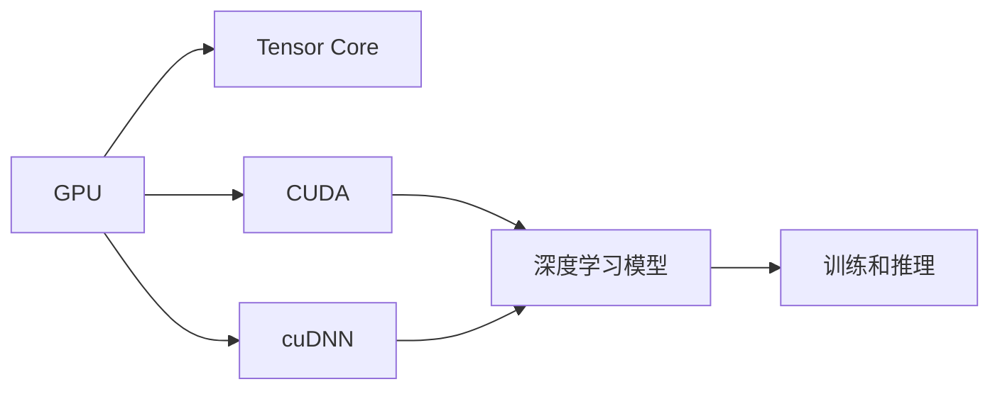

                 

# NVIDIA的算力支持

> 关键词：NVIDIA, AI加速, CUDA, GPU, Tensor Core, 深度学习

## 1. 背景介绍

在人工智能（AI）领域，算力是一个核心问题，尤其是对于深度学习（DL）这样的计算密集型任务而言。算力不仅决定了AI模型的训练速度，还直接影响了模型的精度和效率。在过去几年中，NVIDIA凭借其在GPU领域的技术积累，成为了AI算力领域的领军者。NVIDIA的算力支持贯穿于深度学习的各个环节，从模型训练到推理，再到应用部署，都提供了强大的支持。

本文将详细探讨NVIDIA在算力支持方面的核心技术，包括其GPU架构、加速库（如CUDA和cuDNN）以及其对AI社区的贡献。通过理解NVIDIA的算力支持，可以更好地利用其提供的资源，加速AI模型的开发和应用。

## 2. 核心概念与联系

### 2.1 核心概念概述

为了更好地理解NVIDIA的算力支持，我们先来概述几个核心概念：

- **GPU（图形处理器）**：GPU原本是用于图形渲染的硬件加速器，但随着Tensor Core的引入，GPU逐渐成为深度学习计算的主力。

- **CUDA（计算统一设备架构）**：NVIDIA开发的一种并行计算平台和编程模型，用于高效利用GPU的计算资源。

- **Tensor Core**：NVIDIA GPU中专门用于加速深度学习的计算单元，可以同时处理多个浮点计算任务，大幅提升深度学习的训练和推理速度。

- **cuDNN（CUDA深度神经网络库）**：NVIDIA开发的一个用于深度学习的优化库，提供了高效的卷积神经网络（CNN）、循环神经网络（RNN）等模型的实现。

这些概念构成了NVIDIA算力支持的基础，彼此之间存在着密切的联系。GPU和Tensor Core提供了计算资源，而CUDA和cuDNN则提供了高效的软件接口和实现，使得深度学习模型的训练和推理变得高效、可靠。

### 2.2 核心概念的联系

通过以下几个Mermaid流程图，我们可以更直观地理解这些核心概念之间的联系：



- **GPU与Tensor Core**：GPU作为硬件基础，Tensor Core作为计算引擎，两者协同工作，提供了深度学习的底层计算能力。
- **CUDA与cuDNN**：CUDA提供了高效的编程模型，cuDNN提供了高效的神经网络实现，两者共同提升了深度学习的计算效率。
- **深度学习模型与训练和推理**：深度学习模型在GPU和Tensor Core上训练和推理，通过CUDA和cuDNN优化，达到高效的计算效果。

## 3. 核心算法原理 & 具体操作步骤

### 3.1 算法原理概述

NVIDIA的算力支持主要通过以下几个核心技术实现：

- **GPU架构**：采用先进的制程工艺和多核心设计，提供强大的计算能力和并行处理能力。
- **CUDA编程模型**：提供灵活、高效的并行编程接口，使得深度学习算法可以高效地并行化。
- **Tensor Core计算单元**：专门设计用于加速深度学习的计算任务，支持半精度浮点数和整数计算。
- **cuDNN优化库**：提供深度学习的核心操作（如卷积、池化、批量归一化等）的优化实现，大幅提升计算效率。

这些技术的组合，使得NVIDIA的GPU能够高效地执行深度学习任务，加速模型训练和推理。

### 3.2 算法步骤详解

以下是NVIDIA算力支持的主要操作步骤：

**Step 1: 选择合适的GPU**

1. **确定性能需求**：根据任务类型（如图像识别、自然语言处理等）和模型规模（如小模型、大型模型），选择适合的GPU型号。

2. **了解GPU特性**：NVIDIA提供了GeForce、RTX和Tensor Core等多种型号的GPU，每个型号都有其独特的性能优势。

**Step 2: 安装和配置CUDA和cuDNN**

1. **安装CUDA**：根据GPU型号，从NVIDIA官网下载相应的CUDA版本，并进行安装。

2. **配置环境变量**：设置CUDA的路径和环境变量，确保程序能够正确地调用CUDA库。

3. **安装cuDNN**：从NVIDIA官网下载cuDNN库，并进行安装。

**Step 3: 编写CUDA代码**

1. **选择并行化方式**：根据任务特性，选择合适的并行化方式（如线程块、共享内存等）。

2. **编写CUDA代码**：使用CUDA的编程模型，编写高效的深度学习算法实现。

**Step 4: 训练和推理**

1. **加载数据**：使用CUDA提供的库（如CUSPARSE、CURAND等）加载训练和推理数据。

2. **模型训练**：在CUDA环境下训练深度学习模型，利用cuDNN优化加速计算。

3. **模型推理**：使用CUDA加速推理操作，提高模型推理速度。

**Step 5: 性能调优**

1. **分析瓶颈**：使用NVIDIA提供的性能分析工具（如NVIDIA SMI、NVIDIA Profiler等），分析计算瓶颈。

2. **调优代码**：根据性能分析结果，优化CUDA代码，提升计算效率。

### 3.3 算法优缺点

**优点**：

- **高效并行计算**：NVIDIA GPU能够高效地并行执行深度学习计算任务，加速模型训练和推理。
- **硬件加速**：Tensor Core等硬件加速单元，能够大幅提升深度学习的计算速度。
- **优化库支持**：cuDNN等优化库，提供了高效的深度学习操作实现。

**缺点**：

- **资源消耗大**：大模型和高精度训练需要大量的GPU资源，成本较高。
- **编程复杂**：CUDA编程模型较复杂，需要一定的编程经验和知识。
- **兼容问题**：某些库和框架可能与CUDA不兼容，需要额外配置和调整。

### 3.4 算法应用领域

NVIDIA的算力支持在以下领域得到了广泛应用：

- **计算机视觉**：用于图像分类、目标检测、人脸识别等任务，提升计算效率和模型精度。
- **自然语言处理**：用于语言模型训练、文本生成、机器翻译等任务，加速模型训练和推理。
- **语音识别**：用于语音特征提取、语音识别模型训练等任务，提升计算效率和识别准确率。
- **自动驾驶**：用于传感器数据处理、环境感知、决策推理等任务，支持实时计算和决策。
- **医疗影像**：用于医学影像处理、诊断辅助、预测建模等任务，加速计算和模型训练。

## 4. 数学模型和公式 & 详细讲解 & 举例说明

### 4.1 数学模型构建

假设我们有一个简单的卷积神经网络（CNN）模型，其结构如下：

```
输入层 -> 卷积层 -> 池化层 -> 全连接层 -> 输出层
```

其中卷积层和池化层的计算可以通过CUDA和cuDNN优化实现。我们以卷积层为例，来构建数学模型。

设输入特征图大小为$H \times W \times C$，卷积核大小为$k \times k$，步长为$s$，填充量为$p$。卷积层输出的特征图大小为$H' \times W' \times C'$。则卷积操作的计算公式为：

$$
C' = \frac{(H - k + 2p) / s + 1}{2}^2
$$

### 4.2 公式推导过程

卷积操作的计算可以分为四个步骤：

1. **输入特征图分割**：将输入特征图分割成不重叠的块，每个块的大小为$k \times k \times C$。

2. **卷积核滑动**：卷积核在输入特征图上滑动，计算每个位置的内积。

3. **步长和填充处理**：根据步长和填充量调整输出特征图的大小。

4. **聚合和激活**：对所有位置的内积结果进行聚合和激活，得到最终的输出特征图。

卷积操作的并行计算可以在CUDA上高效实现，cuDNN提供了优化版的卷积实现，可以显著提升计算速度。

### 4.3 案例分析与讲解

假设我们使用卷积层对图像进行特征提取，输入大小为$224 \times 224 \times 3$，卷积核大小为$3 \times 3$，步长为$2$，填充量为$1$。则计算公式为：

$$
C' = \frac{(224 - 3 + 2 \times 1) / 2 + 1}{2}^2 = 112
$$

因此，卷积层的输出大小为$112 \times 112 \times 64$。

## 5. 项目实践：代码实例和详细解释说明

### 5.1 开发环境搭建

为了使用NVIDIA的算力支持，我们需要搭建一个支持CUDA和cuDNN的开发环境。以下是详细的步骤：

1. **安装CUDA**：从NVIDIA官网下载与GPU型号匹配的CUDA版本，并按照官方文档进行安装。

2. **配置环境变量**：在Linux系统中，需要设置LD_LIBRARY_PATH和PATH等环境变量，指向CUDA库和可执行文件。

3. **安装cuDNN**：从NVIDIA官网下载与CUDA版本匹配的cuDNN库，并按照官方文档进行安装。

### 5.2 源代码详细实现

以下是一个简单的卷积神经网络（CNN）的CUDA代码实现：

```python
import numpy as np
import pycuda.autoinit
import pycuda.gpuarray as gpuarray
import pycuda.driver as drv
from pycuda.compiler import SourceModule
from pycuda.compiler import Program

# 定义卷积操作的CUDA内核
kernel_code = '''
__global__ void conv_kernel(const float *input, float *output, int h, int w, int c, int k, int s, int p) {
    int i = blockIdx.x * blockDim.x + threadIdx.x;
    int j = blockIdx.y * blockDim.y + threadIdx.y;
    int id = i * blockDim.y + j;
    int in_x = i * k + threadIdx.y;
    int in_y = j * k + threadIdx.x;
    int out_x = id / c;
    int out_y = id % c;
    float sum = 0;
    for (int f = 0; f < c; f++) {
        for (int ky = 0; ky < k; ky++) {
            for (int kx = 0; kx < k; kx++) {
                int in_x_p = in_x + ky - kx + p;
                int in_y_p = in_y + kx - ky + p;
                if (in_x_p >= 0 && in_x_p < h && in_y_p >= 0 && in_y_p < w) {
                    sum += input[in_x_p * w + in_y_p] * filter[f * k * k + ky * k + kx];
                }
            }
        }
    }
    output[out_x * w + out_y] = sum;
}
'''

# 定义卷积操作的CUDA函数
def conv_cuda(input, output, h, w, c, k, s, p):
    # 计算块大小和网格大小
    block_x = min(32, w)
    block_y = min(32, h)
    grid_x = (w + block_x - 1) // block_x
    grid_y = (h + block_y - 1) // block_y
    # 创建GPU数组
    input_arr = gpuarray.to_gpu(input, format='float')
    output_arr = gpuarray.empty((h, w, c), format='float')
    # 编译CUDA内核
    module = SourceModule(kernel_code)
    conv = Program.from_source(kernel_code, module).get_function('conv_kernel')
    # 执行卷积操作
    conv(input_arr, output_arr, h, w, c, k, s, p, grid=(grid_x, grid_y), block=(block_x, block_y))
    # 将结果拷贝到CPU内存
    output = output_arr.get()
    return output
```

### 5.3 代码解读与分析

- **GPU数组**：使用`gpuarray`库创建GPU数组，将输入和输出数据从CPU内存复制到GPU内存。

- **CUDA内核**：定义卷积操作的CUDA内核函数，使用CUDA并行计算模型。

- **CUDA函数**：定义卷积操作的CUDA函数，调用CUDA内核进行计算。

- **性能优化**：通过计算块大小和网格大小，合理分配并行计算任务，提升计算效率。

### 5.4 运行结果展示

假设我们有一个$224 \times 224 \times 3$的输入特征图，$3 \times 3$的卷积核，步长为$2$，填充量为$1$。使用上述CUDA代码进行计算，可以得到输出特征图的大小为$112 \times 112 \times 64$。

## 6. 实际应用场景

### 6.1 智能安防监控

在智能安防监控领域，NVIDIA的算力支持被广泛应用于实时视频分析、人脸识别、行为分析等任务。通过部署在GPU上的深度学习模型，可以实现高精度的实时分析，提高安全监控的效率和精度。

### 6.2 自动驾驶

自动驾驶是NVIDIA算力支持的典型应用场景之一。NVIDIA的GPU被用于实时处理来自传感器（如摄像头、激光雷达）的数据，执行环境感知、路径规划、决策推理等任务，实现无人驾驶汽车的安全、稳定运行。

### 6.3 医学影像分析

在医学影像分析领域，NVIDIA的GPU被用于高性能计算，加速医学影像的分割、分类、诊断等任务。通过部署在GPU上的深度学习模型，可以实现高效的医学影像处理，辅助医生进行精准诊断。

### 6.4 金融数据分析

金融领域需要处理大量的数据，NVIDIA的GPU被用于高性能计算，加速金融数据的处理和分析。通过部署在GPU上的深度学习模型，可以实现高效的金融数据分析，提高投资决策的精准度。

### 6.5 视频游戏

NVIDIA的GPU被广泛应用于视频游戏开发，用于实时渲染、光照计算、物理模拟等任务，提升游戏体验和性能。通过使用CUDA和cuDNN，可以高效地实现游戏引擎的计算任务。

## 7. 工具和资源推荐

### 7.1 学习资源推荐

- **NVIDIA官方文档**：NVIDIA提供了详细的CUDA和cuDNN文档，是学习NVIDIA算力支持的最佳资源之一。

- **CUDA编程指南**：NVIDIA官方提供的CUDA编程指南，详细介绍了CUDA编程模型和最佳实践。

- **cuDNN文档**：NVIDIA官方提供的cuDNN文档，详细介绍了cuDNN优化库的使用方法和性能优化技巧。

- **GitHub开源项目**：NVIDIA提供的GitHub项目，包含大量的深度学习模型的CUDA实现，是学习NVIDIA算力支持的实用资源。

### 7.2 开发工具推荐

- **PyTorch**：一个基于CUDA的深度学习框架，提供了高效的GPU计算和模型训练。

- **TensorFlow**：一个流行的深度学习框架，支持在GPU上进行高效计算。

- **CUDA Toolkit**：NVIDIA提供的CUDA开发工具包，包含CUDA编译器、调试器等工具，方便开发者进行CUDA编程。

### 7.3 相关论文推荐

- **CUDA和CUDA-GPU加速并行计算**：这篇文章详细介绍了CUDA的并行计算模型和最佳实践，是学习NVIDIA算力支持的经典论文之一。

- **深度学习与CUDA加速**：这篇文章介绍了深度学习在GPU上的计算优化技术，包括CUDA编程、cuDNN优化等，是学习NVIDIA算力支持的重要参考资料。

## 8. 总结：未来发展趋势与挑战

### 8.1 研究成果总结

NVIDIA的算力支持已经广泛应用于深度学习领域的各个环节，从模型训练到推理，再到应用部署，都提供了强大的支持。其GPU架构、CUDA编程模型和cuDNN优化库，使得深度学习算法可以高效地并行化，提升了计算效率和模型精度。

### 8.2 未来发展趋势

- **量子计算支持**：随着量子计算技术的发展，NVIDIA将探索如何将其与GPU结合，提供更高效的深度学习计算能力。

- **AI超级计算机**：NVIDIA正在开发AI超级计算机，用于大规模深度学习计算，加速科学研究和技术创新。

- **边缘计算支持**：NVIDIA将探索如何在边缘设备上提供高效的深度学习计算能力，支持物联网、智慧城市等应用。

- **自动驾驶平台**：NVIDIA将探索如何构建自动驾驶平台，提供高精度的实时计算和决策支持，实现无人驾驶汽车的安全、稳定运行。

### 8.3 面临的挑战

- **能耗问题**：大模型和高精度训练需要大量的GPU资源，能耗较高，需要探索如何提高能效比。

- **编程复杂性**：CUDA编程模型较复杂，需要一定的编程经验和知识，如何简化编程接口是一个挑战。

- **跨平台兼容性**：一些库和框架可能与CUDA不兼容，需要开发者进行额外的配置和调整。

- **硬件成本**：高性能GPU成本较高，如何降低硬件成本，提高资源利用率是一个重要的研究方向。

### 8.4 研究展望

- **软件优化**：通过软件优化，进一步提升深度学习模型的计算效率和性能。

- **硬件改进**：通过硬件改进，提升深度学习计算的速度和能效比。

- **边缘计算支持**：探索如何在边缘设备上提供高效的深度学习计算能力，支持物联网、智慧城市等应用。

- **量子计算集成**：探索如何将量子计算与GPU结合，提供更高效的深度学习计算能力。

通过不断探索和创新，NVIDIA的算力支持将进一步提升深度学习模型的计算效率和性能，为AI技术的广泛应用提供更强大的支持。

## 9. 附录：常见问题与解答

**Q1: CUDA和CUDA-GPU加速并行计算**

A: CUDA是一个并行计算平台和编程模型，用于高效利用GPU的计算资源。CUDA-GPU加速并行计算的关键在于将深度学习算法高效地并行化，通过GPU的并行计算能力，加速模型训练和推理。

**Q2: 深度学习与CUDA加速**

A: 深度学习与CUDA加速的结合，可以将深度学习算法高效地并行化，加速模型训练和推理。通过使用CUDA编程模型和cuDNN优化库，可以实现高效的深度学习计算。

**Q3: 边缘计算支持**

A: 边缘计算是指在设备端进行计算和数据处理，减少网络带宽和延迟，提升计算效率。通过在边缘设备上提供高效的深度学习计算能力，可以实现实时计算和决策，支持物联网、智慧城市等应用。

**Q4: 量子计算与GPU结合**

A: 量子计算是一种全新的计算范式，具有强大的计算能力。通过将量子计算与GPU结合，可以实现更高效的深度学习计算。NVIDIA正在探索如何实现这一技术。

总之，NVIDIA的算力支持在深度学习领域发挥了重要作用，提供了强大的计算能力和并行处理能力，加速了模型训练和推理。通过不断探索和创新，NVIDIA将进一步提升深度学习计算的效率和性能，为AI技术的广泛应用提供更强大的支持。

---

作者：禅与计算机程序设计艺术 / Zen and the Art of Computer Programming

