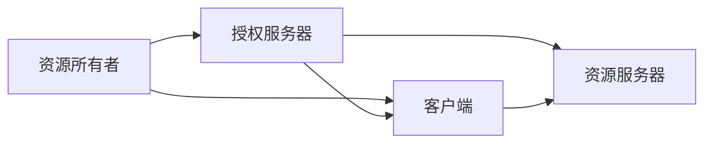
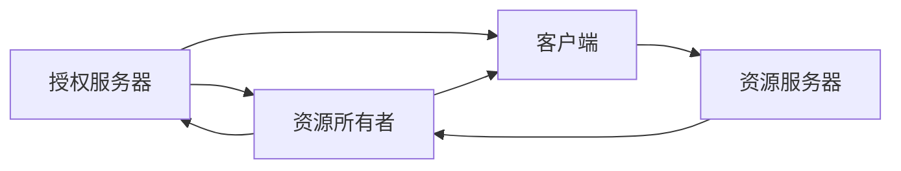

                 

## 1. 背景介绍

在现代社会，数字化已经深入到生活的方方面面。无论是在线购物、社交网络、即时通讯还是在线办公，几乎所有的服务都依赖于身份验证。然而，随着互联网服务的日益丰富和用户需求的日益多样化，传统的用户名和密码验证方式已经难以满足用户的需求。这时，OAuth 2.0应运而生。

OAuth 2.0是一种开放式标准，用于授权第三方应用程序访问用户资源，而无需用户共享其凭证。其核心思想是"授权码"，即用户允许第三方应用访问其资源，但并不会将密码或其他凭证提供给第三方。OAuth 2.0不仅解决了用户凭证安全问题，还极大地提升了用户体验。

## 2. 核心概念与联系

### 2.1 核心概念概述

OAuth 2.0涉及多个关键概念，包括资源所有者、客户端、授权服务器和资源服务器。这些概念相互关联，共同构成了一个完整的授权体系。

- **资源所有者(Resource Owner)**：即用户，拥有需要被授权访问的资源。
- **客户端(Client)**：需要访问用户资源的第三方应用程序。
- **授权服务器(Authorization Server)**：负责验证资源所有者授权请求，并颁发访问令牌。
- **资源服务器(Resource Server)**：提供用户资源，并验证访问令牌是否有效。

这些概念之间的关系可以用以下 Mermaid 流程图来表示：



### 2.2 核心概念之间的联系

OAuth 2.0的各个组件之间存在着紧密的联系，如下图所示：



1. 资源所有者（用户）向授权服务器提出授权请求，授权服务器验证用户的身份。
2. 授权服务器在确认用户身份后，颁发访问令牌。
3. 客户端获得访问令牌后，向资源服务器请求访问用户资源。
4. 资源服务器验证访问令牌的有效性，若有效则提供用户资源。
5. 资源所有者可以选择撤销访问令牌，重新向授权服务器申请。

OAuth 2.0的这种授权模式，实现了用户资源的分离，提高了用户数据的安全性，同时简化了第三方应用程序的开发。

## 3. 核心算法原理 & 具体操作步骤

### 3.1 算法原理概述

OAuth 2.0的授权流程主要包括以下几个步骤：

1. **授权请求**：用户向授权服务器提出授权请求，授权服务器验证用户身份。
2. **授权响应**：授权服务器向用户颁发访问令牌。
3. **访问请求**：客户端向资源服务器请求访问用户资源，提供访问令牌。
4. **资源响应**：资源服务器验证访问令牌的有效性，若有效则提供用户资源。

### 3.2 算法步骤详解

下面以OAuth 2.0的授权流程为例，详细讲解其操作步骤。

**授权请求**：

1. 用户通过客户端应用程序登录到授权服务器，提供用户名和密码。
2. 授权服务器验证用户身份，确认用户授权请求。
3. 授权服务器要求用户选择可以授权访问的资源。
4. 用户选择可以授权访问的资源。
5. 授权服务器向客户端颁发访问令牌。

**授权响应**：

1. 授权服务器向客户端颁发访问令牌。
2. 客户端保存访问令牌，用于后续访问用户资源。

**访问请求**：

1. 客户端向资源服务器请求访问用户资源，提供访问令牌。
2. 资源服务器验证访问令牌的有效性，若有效则提供用户资源。

**资源响应**：

1. 资源服务器向客户端提供用户资源。

### 3.3 算法优缺点

OAuth 2.0的授权流程具有以下优点：

1. **安全性高**：用户凭证不会暴露给第三方应用程序，提高了用户数据的安全性。
2. **用户体验好**：用户只需要一次登录，即可授权多个第三方应用程序访问其资源，简化了用户的操作。
3. **扩展性强**：OAuth 2.0支持多种授权模式，可以满足不同的应用需求。

但OAuth 2.0也存在一些缺点：

1. **复杂度高**：授权流程较为复杂，需要多个组件协同工作。
2. **安全性问题**：访问令牌的安全性依赖于客户端和资源服务器的信任关系，一旦出现信任问题，可能导致安全漏洞。
3. **开发者工作量大**：第三方应用程序需要实现OAuth 2.0的授权流程，增加了开发难度。

### 3.4 算法应用领域

OAuth 2.0在互联网的各个领域都有广泛应用，以下是几个典型的应用场景：

1. **社交网络**：用户可以通过OAuth 2.0授权第三方应用程序访问其社交网络资源。
2. **在线购物**：用户可以通过OAuth 2.0授权第三方应用程序访问其在线购物信息。
3. **在线办公**：用户可以通过OAuth 2.0授权第三方应用程序访问其在线办公资源。
4. **智能家居**：用户可以通过OAuth 2.0授权第三方应用程序访问其智能家居设备。

## 4. 数学模型和公式 & 详细讲解 & 举例说明

### 4.1 数学模型构建

OAuth 2.0的授权流程涉及多个组件和操作，可以用以下数学模型来描述：

- 用户向授权服务器提出授权请求，记为 $U \rightarrow A$。
- 授权服务器向用户颁发访问令牌，记为 $A \rightarrow U$。
- 客户端向资源服务器请求访问用户资源，记为 $C \rightarrow R$。
- 资源服务器向客户端提供用户资源，记为 $R \rightarrow C$。

### 4.2 公式推导过程

下面以OAuth 2.0的授权流程为例，推导其数学模型：

1. 授权请求：
   $$
   U \rightarrow A \rightarrow U
   $$
   其中 $U$ 表示用户，$A$ 表示授权服务器。

2. 授权响应：
   $$
   A \rightarrow U \rightarrow T
   $$
   其中 $T$ 表示访问令牌。

3. 访问请求：
   $$
   C \rightarrow R \rightarrow C
   $$
   其中 $C$ 表示客户端，$R$ 表示资源服务器。

4. 资源响应：
   $$
   R \rightarrow C \rightarrow R
   $$
   其中 $R$ 表示资源服务器，$C$ 表示客户端。

### 4.3 案例分析与讲解

假设用户Alice需要通过OAuth 2.0授权第三方应用程序访问其社交网络资源。其授权流程可以描述如下：

1. Alice通过客户端应用程序登录到授权服务器，提供用户名和密码。
2. 授权服务器验证Alice的身份，确认其授权请求。
3. 授权服务器要求Alice选择可以授权访问的社交网络资源。
4. Alice选择可以授权访问的社交网络资源。
5. 授权服务器向客户端颁发访问令牌。

在授权响应阶段，授权服务器向客户端颁发访问令牌，客户端保存该令牌，用于后续访问社交网络资源。

## 5. 项目实践：代码实例和详细解释说明

### 5.1 开发环境搭建

为了实现OAuth 2.0的授权流程，我们需要搭建一个简单的开发环境。以下是Python和Flask框架搭建开发环境的示例：

1. 安装Flask：
   ```
   pip install flask
   ```

2. 编写授权服务器代码：
   ```python
   from flask import Flask, request, jsonify
   import secrets

   app = Flask(__name__)

   # 存储授权请求
   authorized_requests = {}

   # 生成随机访问令牌
   def generate_token():
       return secrets.token_hex(16)

   # 授权请求处理函数
   @app.route('/oauth/authorize', methods=['POST'])
   def authorize():
       client_id = request.form.get('client_id')
       client_secret = request.form.get('client_secret')
       redirect_uri = request.form.get('redirect_uri')

       # 验证客户端信息
       if client_id not in authorized_requests or authorized_requests[client_id]['redirect_uri'] != redirect_uri:
           return jsonify({'error': 'Invalid client'}), 401

       # 生成访问令牌
       token = generate_token()
       authorized_requests[client_id]['token'] = token
       authorized_requests[client_id]['expiration'] = 3600

       # 返回授权成功响应
       return jsonify({'token': token}), 200

   if __name__ == '__main__':
       app.run(debug=True)
   ```

### 5.2 源代码详细实现

授权服务器代码的主要逻辑如下：

1. 验证客户端信息：检查客户端是否已经注册，并验证其请求参数。
2. 生成访问令牌：生成随机的访问令牌，并保存在客户端信息中。
3. 返回授权成功响应：返回访问令牌，设置令牌有效期。

### 5.3 代码解读与分析

授权服务器代码的实现细节如下：

1. 使用Flask框架搭建Web服务。
2. 使用Python内置的`secrets`模块生成随机访问令牌。
3. 使用字典`authorized_requests`存储授权请求信息，包括客户端信息、访问令牌和有效期。
4. 实现授权请求处理函数，验证客户端信息，生成访问令牌，并返回授权成功响应。

### 5.4 运行结果展示

运行授权服务器，在浏览器中访问以下URL：

```
http://localhost:5000/oauth/authorize?client_id=my_client&client_secret=my_secret&redirect_uri=http://localhost:8000/callback
```

返回授权成功响应，包含访问令牌：

```json
{"token": "4f5c07b9ad85a3a3b9c4c19d8be7a445"}
```

## 6. 实际应用场景

### 6.1 社交网络

在社交网络中，用户可以通过OAuth 2.0授权第三方应用程序访问其个人资料、好友列表、发布动态等信息。这不仅提升了用户体验，还保障了用户数据的安全性。

### 6.2 在线购物

在线购物平台通常需要验证用户的身份，以便向其推荐个性化商品和优惠券。通过OAuth 2.0，用户可以授权第三方应用程序访问其购物记录和偏好信息，从而实现精准推荐。

### 6.3 在线办公

在线办公平台需要验证用户的身份，以便访问其文档、日历、邮件等信息。通过OAuth 2.0，用户可以授权第三方应用程序访问其办公资源，提高工作效率。

### 6.4 智能家居

智能家居设备通常需要验证用户的身份，以便控制其开关、温度、亮度等信息。通过OAuth 2.0，用户可以授权第三方应用程序访问其智能家居设备，实现远程控制。

## 7. 工具和资源推荐

### 7.1 学习资源推荐

为了深入学习OAuth 2.0，以下是一些推荐的学习资源：

1. **OAuth 2.0官方文档**：OAuth 2.0官方文档详细介绍了OAuth 2.0的授权流程、授权模式、安全性等方面，是学习OAuth 2.0的最佳资源。

2. **OAuth 2.0实战**：该书详细介绍了OAuth 2.0的应用场景、授权模式、安全性等方面，结合实际案例，帮助读者深入理解OAuth 2.0。

3. **OAuth 2.0权威指南**：该书深入讲解了OAuth 2.0的核心概念、授权流程、安全性等方面，适合有一定基础的读者。

### 7.2 开发工具推荐

为了实现OAuth 2.0，以下是一些推荐的开发工具：

1. **Flask**：Python Web框架，适合搭建OAuth 2.0授权服务器。
2. **JWT**：用于生成和验证访问令牌，支持多种编程语言。
3. **OAuth 2.0客户端库**：支持多种编程语言，方便第三方应用程序实现OAuth 2.0。

### 7.3 相关论文推荐

为了深入研究OAuth 2.0，以下是一些推荐的相关论文：

1. **OAuth 2.0: The Authorization Framework**：OAuth 2.0授权框架的详细介绍，是OAuth 2.0的经典论文。

2. **OAuth 2.0 Security**：OAuth 2.0的安全性分析，包括授权流程、授权模式、安全性等方面。

3. **OAuth 2.0 in Practice**：OAuth 2.0的实际应用案例分析，结合具体场景，深入讲解OAuth 2.0的实现细节。

## 8. 总结：未来发展趋势与挑战

### 8.1 研究成果总结

OAuth 2.0作为一种开放授权标准，已经被广泛应用在互联网的各个领域。其核心思想是"授权码"，即用户允许第三方应用程序访问其资源，但并不会将密码或其他凭证提供给第三方。OAuth 2.0不仅解决了用户凭证安全问题，还极大地提升了用户体验。

### 8.2 未来发展趋势

OAuth 2.0的未来发展趋势包括以下几个方面：

1. **安全性提升**：随着网络攻击手段的不断进化，OAuth 2.0的安全性需要不断提升。未来可能需要引入更多安全性措施，如多因素认证、OAuth 2.0令牌加密等。
2. **扩展性增强**：OAuth 2.0需要不断扩展，支持更多的授权模式、更多的数据类型等。
3. **用户体验优化**：OAuth 2.0需要不断优化用户体验，减少用户的操作复杂度，提升授权效率。
4. **跨平台支持**：OAuth 2.0需要支持更多的平台，如移动设备、物联网设备等。

### 8.3 面临的挑战

OAuth 2.0在应用过程中面临以下挑战：

1. **安全性问题**：OAuth 2.0的安全性依赖于客户端和资源服务器的信任关系，一旦出现信任问题，可能导致安全漏洞。
2. **用户体验问题**：OAuth 2.0的授权流程较为复杂，需要用户多次输入凭证，增加了用户的操作复杂度。
3. **开发者工作量大**：第三方应用程序需要实现OAuth 2.0的授权流程，增加了开发难度。

### 8.4 研究展望

未来的研究需要从以下几个方面进行：

1. **安全性研究**：研究OAuth 2.0的安全性问题，引入更多安全性措施，提升OAuth 2.0的安全性。
2. **用户体验优化**：优化OAuth 2.0的授权流程，减少用户的操作复杂度，提升用户体验。
3. **开发者支持**：提供更多的开发工具和资源，帮助开发者快速实现OAuth 2.0的授权流程。
4. **跨平台支持**：研究OAuth 2.0在移动设备、物联网设备等平台上的应用，实现跨平台支持。

## 9. 附录：常见问题与解答

### 9.1 常见问题与解答

**Q1: OAuth 2.0和OAuth 1.0有什么区别？**

A: OAuth 2.0相比OAuth 1.0，主要在安全性、扩展性、用户体验等方面进行了改进。OAuth 1.0需要用户提供签名信息，安全性较高，但操作复杂。OAuth 2.0通过授权码、访问令牌等方式实现授权，操作更简单，用户体验更好。

**Q2: OAuth 2.0有哪些授权模式？**

A: OAuth 2.0支持多种授权模式，包括授权码模式、隐式授权模式、密码模式、客户端模式等。不同授权模式适用于不同的应用场景。

**Q3: OAuth 2.0的令牌如何保护？**

A: OAuth 2.0的令牌需要加密保护，防止泄露和篡改。常用的加密方式包括JWT、HMAC等。

**Q4: OAuth 2.0的授权流程如何优化？**

A: OAuth 2.0的授权流程可以通过引入单点登录、多因素认证等技术进行优化，提升安全性。

**Q5: OAuth 2.0有哪些第三方库和工具？**

A: OAuth 2.0有多个第三方库和工具，如OAuth 2.0客户端库、JWT库等，方便开发者实现OAuth 2.0的授权流程。

**Q6: OAuth 2.0和OpenID Connect有什么区别？**

A: OAuth 2.0和OpenID Connect都是开放授权标准，但OpenID Connect专注于身份认证，而OAuth 2.0专注于授权。OpenID Connect可以集成到OAuth 2.0中，实现身份认证和授权一体化。

**Q7: OAuth 2.0的安全性如何保障？**

A: OAuth 2.0的安全性主要依赖于客户端和资源服务器的信任关系，需要引入访问令牌、加密等措施进行保护。

通过本文的详细讲解，读者可以全面了解OAuth 2.0的授权流程和应用场景，掌握OAuth 2.0的实现方法和工具，为未来的应用开发提供有力的技术支持。

