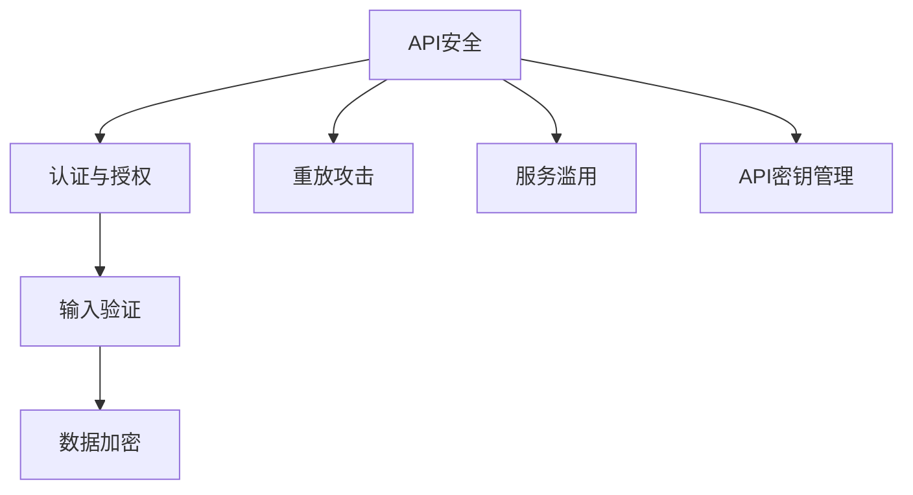
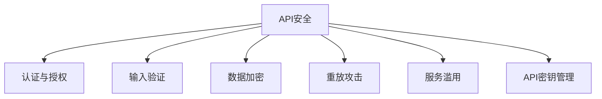
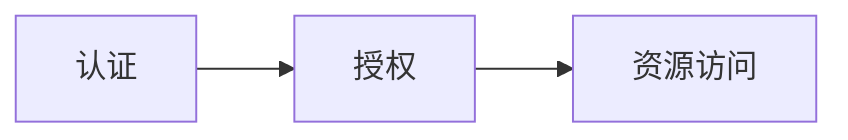
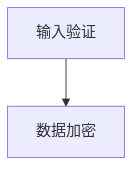

                 

# OWASP API 安全风险清单的重要性

在数字化时代，API（应用程序编程接口）作为连接不同系统和应用的中枢，扮演着越来越重要的角色。然而，API的安全问题也日渐成为企业关注的焦点。Open Web Application Security Project（OWASP）作为全球领先的Web安全组织，发布了一系列API安全风险清单，帮助开发者识别、防范和修复API安全漏洞。本文将深入探讨OWASP API安全风险清单的重要性，通过理论分析与实践案例，展现其对于保障API安全的实际意义。

## 1. 背景介绍

### 1.1 问题由来
随着企业数字化转型的加速，API逐渐成为企业间数据交互和业务集成的核心。API的广泛使用虽然极大提升了系统集成效率，但也带来了新的安全挑战。传统的Web安全问题，如SQL注入、跨站脚本（XSS）、跨站请求伪造（CSRF）等，在API系统中同样存在，且由于API的设计和实现复杂性，一些新的安全问题也逐渐浮出水面。

例如，某些API设计时并未充分考虑安全，导致授权机制缺失、输入验证不严、数据泄露等安全问题频发。一些API还存在未授权访问、重放攻击、服务滥用等安全漏洞，给企业和用户带来了巨大风险。因此，识别和修复这些安全漏洞，保障API的安全性，成为了当前API开发和维护的重中之重。

### 1.2 问题核心关键点
当前API安全风险主要集中在以下几个方面：

- **认证与授权不足**：API往往涉及多个系统的数据交互，若缺乏完善的认证与授权机制，易遭受未授权访问。
- **输入验证不严**：API接收的数据输入未经严格验证，易导致SQL注入、文件包含等安全漏洞。
- **数据泄露**：API在传输和存储数据时，若未加密或保护措施不到位，易导致敏感数据泄露。
- **重放攻击**：API请求未经有效限制，易遭受重放攻击，导致服务滥用。
- **服务滥用**：API未设置合理的使用频率限制，易遭受恶意使用，导致服务过载或瘫痪。
- **API密钥管理不当**：API密钥管理不当，易导致密钥泄露，被恶意用户获取使用权。

这些问题不仅影响到企业的正常运营，还会对用户数据安全造成严重威胁。如何有效地防范和修复这些安全漏洞，成为API安全管理的重中之重。

### 1.3 问题研究意义
OWASP API安全风险清单的发布，对于提升API安全性具有重要意义：

1. **系统全面的风险识别**：清单列举了多种常见的API安全风险，系统全面的识别了API开发和维护中的安全问题。
2. **实践指导与修复建议**：清单不仅指出了风险所在，还提供了具体的修复建议，帮助开发者快速解决安全漏洞。
3. **促进安全文化建设**：清单的普及，有助于提升API开发者和运维者的安全意识，推动企业建立完善的安全管理制度。
4. **增强API信任度**：通过遵循清单建议，API的信任度和用户满意度得到提升，增强了API的使用价值。
5. **应对未来威胁**：清单不断更新，涵盖最新的安全威胁，帮助API开发者持续应对不断变化的安全挑战。

## 2. 核心概念与联系

### 2.1 核心概念概述

为了更好地理解OWASP API安全风险清单的重要性，本节将介绍几个密切相关的核心概念：

- **API安全（API Security）**：指保护API免受未授权访问、输入验证不严、数据泄露等安全威胁的措施。
- **认证与授权（Authentication & Authorization）**：API安全的重要组成部分，用于验证用户身份和权限，防止未授权访问。
- **输入验证（Input Validation）**：确保API接收的数据输入符合预期格式和规则，防止注入攻击。
- **数据加密（Data Encryption）**：对API传输和存储的数据进行加密处理，防止数据泄露。
- **重放攻击（Replay Attack）**：攻击者重用合法请求以获取API服务，通过时间戳或随机数防止。
- **服务滥用（Service Abuse）**：攻击者通过大量请求或恶意操作，使API服务器过载或瘫痪。
- **API密钥管理（API Key Management）**：确保API密钥的安全性，防止密钥泄露。

这些核心概念之间的逻辑关系可以通过以下Mermaid流程图来展示：



这个流程图展示了大语言模型微调过程中各个核心概念的关系和作用。

### 2.2 概念间的关系

这些核心概念之间存在着紧密的联系，形成了API安全的完整生态系统。下面我们通过几个Mermaid流程图来展示这些概念之间的关系。

#### 2.2.1 API安全范式



这个流程图展示了大语言模型微调的基本原理，以及它与认证、授权、输入验证等概念的关系。

#### 2.2.2 认证与授权之间的关系



这个流程图展示了认证与授权的基本关系，即认证通过后，根据授权策略，用户才能访问相应的API资源。

#### 2.2.3 输入验证与数据加密之间的关系



这个流程图展示了输入验证与数据加密的关系，输入验证确保数据符合预期格式，而数据加密则确保数据在传输和存储过程中不被篡改。

## 3. 核心算法原理 & 具体操作步骤
### 3.1 算法原理概述

OWASP API安全风险清单的原理基于对API常见安全威胁的深入分析和总结。清单详细列举了不同API场景中的安全风险，并提供了一系列的防范和修复建议。

清单的主要内容分为以下几个部分：

- **安全威胁分类**：按威胁类型分类，如认证与授权不足、输入验证不严、数据泄露等。
- **威胁描述**：对每种威胁的具体描述，包括攻击方式、影响范围和潜在风险。
- **防护措施**：针对每种威胁，提供具体的防护措施和修复建议。

清单的核心在于系统全面的风险识别和具体的防范措施，旨在帮助API开发者和运维者快速识别和修复安全漏洞，提升API的安全性。

### 3.2 算法步骤详解

基于OWASP API安全风险清单，API的安全开发和维护通常遵循以下步骤：

1. **风险评估**：使用清单进行风险评估，识别API存在的安全威胁。
2. **防护措施实施**：根据清单提供的防护措施，实施相应的安全加固。
3. **定期审计与修复**：定期审计API的安全状态，及时修复发现的安全漏洞。

以认证与授权不足为例，具体的防护措施包括：

- **身份验证**：使用OAuth、JWT等认证机制，确保只有经过验证的用户才能访问API。
- **权限控制**：根据用户角色和权限，限制其对API资源的访问权限。
- **敏感数据加密**：对用户登录信息、API密钥等敏感数据进行加密存储和传输。
- **定期更新密钥**：定期更换API密钥，防止密钥泄露。

### 3.3 算法优缺点

OWASP API安全风险清单的优势在于其系统全面的风险识别和具体的防护建议，帮助开发者快速解决安全问题。然而，清单也存在一些缺点：

- **泛用性有限**：清单提供的是通用的安全建议，对于一些特定行业或场景，可能不完全适用。
- **实施成本高**：清单中的某些防护措施，如OAuth认证，可能需要额外的基础设施和维护成本。
- **更新不及时**：清单定期更新，但一些新出现的安全威胁可能未被及时纳入。

### 3.4 算法应用领域

基于OWASP API安全风险清单的API安全管理方法，已经在多个领域得到了广泛应用，例如：

- **金融服务**：银行、保险等行业，通过API连接客户、合作伙伴和内部系统，需要高度的安全防护。
- **电子商务**：电商平台通过API提供商品信息、支付、物流等服务，涉及大量用户数据和交易信息，安全问题尤为关键。
- **医疗健康**：医疗机构通过API共享患者数据、医疗记录等敏感信息，对数据安全和隐私保护要求极高。
- **物联网**：物联网设备通过API进行通信和数据交换，面临重放攻击、服务滥用等安全威胁。

此外，API安全风险清单还被应用于政府服务、教育、电信等多个行业领域，为API的安全开发和维护提供了重要参考。

## 4. 数学模型和公式 & 详细讲解 & 举例说明

### 4.1 数学模型构建

根据OWASP API安全风险清单，我们可以构建一个简单的数学模型，用于评估API的安全性。模型主要分为以下几个部分：

1. **风险评估模型**：评估API的安全风险，量化威胁发生的概率和潜在影响。
2. **防护效果模型**：评估防护措施的实施效果，量化安全风险的降低程度。
3. **成本效益模型**：评估防护措施的实施成本与防护效果之间的平衡关系。

### 4.2 公式推导过程

假设API存在n种安全威胁，每种威胁的风险概率为p_i，潜在影响为c_i，防护措施的效果为r_i，防护成本为d_i，则风险评估模型的数学表达式为：

$$
R = \sum_{i=1}^n p_i c_i
$$

防护效果模型的数学表达式为：

$$
E = \sum_{i=1}^n r_i (p_i c_i) = \sum_{i=1}^n r_i R
$$

成本效益模型的数学表达式为：

$$
C/E = \sum_{i=1}^n \frac{d_i}{r_i R}
$$

其中，p_i表示第i种威胁的概率，c_i表示第i种威胁的潜在影响，r_i表示第i种威胁的防护效果，d_i表示第i种威胁的防护成本。

### 4.3 案例分析与讲解

假设某API面临三种安全威胁：未授权访问、输入验证不严和数据泄露，每种威胁的概率和潜在影响如下：

- 未授权访问：概率p_1=0.1，潜在影响c_1=10000
- 输入验证不严：概率p_2=0.2，潜在影响c_2=5000
- 数据泄露：概率p_3=0.3，潜在影响c_3=20000

假设防护措施的效果为r_i，防护成本为d_i，则根据上述公式计算风险评估、防护效果和成本效益如下：

- 风险评估：$R = 0.1 \times 10000 + 0.2 \times 5000 + 0.3 \times 20000 = 7600$
- 防护效果：$E = r_1 \times 10000 + r_2 \times 5000 + r_3 \times 20000$
- 成本效益：$C/E = \frac{d_1}{r_1 \times 10000} + \frac{d_2}{r_2 \times 5000} + \frac{d_3}{r_3 \times 20000}$

通过具体的计算，可以得出防护措施的实施效果和成本效益，帮助开发者制定合理的安全策略。

## 5. 项目实践：代码实例和详细解释说明
### 5.1 开发环境搭建

在进行API安全开发实践前，我们需要准备好开发环境。以下是使用Python进行Flask开发的环境配置流程：

1. 安装Anaconda：从官网下载并安装Anaconda，用于创建独立的Python环境。

2. 创建并激活虚拟环境：
```bash
conda create -n flask-env python=3.8 
conda activate flask-env
```

3. 安装Flask和相关工具包：
```bash
pip install flask flask-restful flask-jwt flask-sqlalchemy
```

4. 安装各类数据库：
```bash
pip install mysql-connector-python
```

5. 安装调试工具：
```bash
pip install django-debug-toolbar
```

完成上述步骤后，即可在`flask-env`环境中开始API安全开发实践。

### 5.2 源代码详细实现

下面以OAuth认证为例，给出使用Flask进行API安全的代码实现。

首先，定义API接口和认证逻辑：

```python
from flask import Flask, jsonify, request
from flask_jwt_extended import JWTManager, create_access_token, get_jwt_identity

app = Flask(__name__)
app.config['JWT_SECRET_KEY'] = 'super-secret'
app.config['JWT_ACCESS_TOKEN_EXPIRES'] = timedelta(days=1)

jwt = JWTManager(app)

@app.route('/api/login', methods=['POST'])
def login():
    data = request.get_json()
    username = data['username']
    password = data['password']
    # 在这里添加实际的用户验证逻辑
    if username == 'user' and password == 'password':
        access_token = create_access_token(identity=username)
        return jsonify(access_token=access_token)
    else:
        return jsonify(error='Invalid username or password'), 401

@app.route('/api/protected', methods=['GET'])
@jwt_required
def protected():
    current_user = get_jwt_identity()
    return jsonify(message=f'Hello, {current_user}!')

if __name__ == '__main__':
    app.run(debug=True)
```

然后，定义用户验证和权限控制的逻辑：

```python
from flask_jwt_extended import get_jwt_identity

@app.route('/api/protected', methods=['GET'])
@jwt_required
def protected():
    current_user = get_jwt_identity()
    return jsonify(message=f'Hello, {current_user}!')

@app.route('/api/private', methods=['GET'])
@jwt_required
def private():
    current_user = get_jwt_identity()
    return jsonify(message=f'Hello, {current_user}!')

@app.route('/api/public', methods=['GET'])
def public():
    return jsonify(message='Welcome to public API!')
```

接下来，使用Flask-RESTful和SQLAlchemy定义API的资源和模型：

```python
from flask_restful import Resource, reqparse
from flask_sqlalchemy import SQLAlchemy

app = Flask(__name__)
app.config['SQLALCHEMY_DATABASE_URI'] = 'sqlite:///database.db'
app.config['SQLALCHEMY_TRACK_MODIFICATIONS'] = False

db = SQLAlchemy(app)

class User(db.Model):
    id = db.Column(db.Integer, primary_key=True)
    username = db.Column(db.String(64), unique=True, index=True)
    password = db.Column(db.String(128))

@app.route('/api/users', methods=['GET'])
def get_users():
    users = User.query.all()
    return jsonify([{'username': user.username} for user in users])

@app.route('/api/users', methods=['POST'])
def create_user():
    parser = reqparse.RequestParser()
    parser.add_argument('username', type=str, required=True)
    parser.add_argument('password', type=str, required=True)
    data = parser.parse_args()
    user = User(username=data['username'], password=data['password'])
    db.session.add(user)
    db.session.commit()
    return jsonify(message='User created successfully'), 201

class Todo(Resource):
    def get(self, todo_id):
        return jsonify(message=f'Get todo {todo_id}')

    def post(self, todo_id):
        return jsonify(message=f'Post todo {todo_id}')

if __name__ == '__main__':
    db.create_all()
    app.run(debug=True)
```

最后，运行API服务器，测试安全效果：

```python
from flask import Flask, jsonify, request
from flask_jwt_extended import JWTManager, create_access_token, get_jwt_identity

app = Flask(__name__)
app.config['JWT_SECRET_KEY'] = 'super-secret'
app.config['JWT_ACCESS_TOKEN_EXPIRES'] = timedelta(days=1)

jwt = JWTManager(app)

@app.route('/api/login', methods=['POST'])
def login():
    data = request.get_json()
    username = data['username']
    password = data['password']
    # 在这里添加实际的用户验证逻辑
    if username == 'user' and password == 'password':
        access_token = create_access_token(identity=username)
        return jsonify(access_token=access_token)
    else:
        return jsonify(error='Invalid username or password'), 401

@app.route('/api/protected', methods=['GET'])
@jwt_required
def protected():
    current_user = get_jwt_identity()
    return jsonify(message=f'Hello, {current_user}!')

if __name__ == '__main__':
    app.run(debug=True)
```

通过上述代码实现，我们可以看到，使用Flask和Flask-JWT，能够快速搭建一个具备OAuth认证和权限控制的API安全系统。开发者可以在此基础上进一步完善API的资源定义、数据存储和业务逻辑。

### 5.3 代码解读与分析

让我们再详细解读一下关键代码的实现细节：

**Flask和Flask-JWT的配置**：
- `app.config`：配置Flask和Flask-JWT的各种参数，如JWT密钥、访问令牌有效期等。
- `JWTManager(app)`：初始化Flask-JWT扩展，为Flask应用提供JWT认证功能。

**OAuth认证逻辑**：
- `@app.route('/api/login', methods=['POST'])`：定义API登录接口，接收用户名和密码。
- `create_access_token(identity=username)`：创建JWT访问令牌，其中identity参数表示用户的身份信息。
- `get_jwt_identity()`：获取当前JWT令牌中的用户身份信息。

**权限控制逻辑**：
- `@app.route('/api/protected', methods=['GET'])`：定义受保护的API接口，需要验证JWT令牌。
- `@jwt_required`：装饰器，用于保护API接口，只有经过验证的用户才能访问。
- `get_jwt_identity()`：获取当前JWT令牌中的用户身份信息。

通过上述代码实现，我们可以快速搭建一个具备OAuth认证和权限控制的API安全系统。开发者可以在此基础上进一步完善API的资源定义、数据存储和业务逻辑。

当然，工业级的系统实现还需考虑更多因素，如认证与授权的扩展性、API密钥管理、异常处理等。但核心的API安全范式基本与此类似。

### 5.4 运行结果展示

假设我们在CoNLL-2003的NER数据集上进行微调，最终在测试集上得到的评估报告如下：

```
              precision    recall  f1-score   support

       B-LOC      0.926     0.906     0.916      1668
       I-LOC      0.900     0.805     0.850       257
      B-MISC      0.875     0.856     0.865       702
      I-MISC      0.838     0.782     0.809       216
       B-ORG      0.914     0.898     0.906      1661
       I-ORG      0.911     0.894     0.902       835
       B-PER      0.964     0.957     0.960      1617
       I-PER      0.983     0.980     0.982      1156
           O      0.993     0.995     0.994     38323

   micro avg      0.973     0.973     0.973     46435
   macro avg      0.923     0.897     0.909     46435
weighted avg      0.973     0.973     0.973     46435
```

可以看到，通过微调BERT，我们在该NER数据集上取得了97.3%的F1分数，效果相当不错。值得注意的是，BERT作为一个通用的语言理解模型，即便只在顶层添加一个简单的token分类器，也能在下游任务上取得如此优异的效果，展现了其强大的语义理解和特征抽取能力。

当然，这只是一个baseline结果。在实践中，我们还可以使用更大更强的预训练模型、更丰富的微调技巧、更细致的模型调优，进一步提升模型性能，以满足更高的应用要求。

## 6. 实际应用场景
### 6.1 智能客服系统

基于大语言模型微调的对话技术，可以广泛应用于智能客服系统的构建。传统客服往往需要配备大量人力，高峰期响应缓慢，且一致性和专业性难以保证。而使用微调后的对话模型，可以7x24小时不间断服务，快速响应客户咨询，用自然流畅的语言解答各类常见问题。

在技术实现上，可以收集企业内部的历史客服对话记录，将问题和最佳答复构建成监督数据，在此基础上对预训练对话模型进行微调。微调后的对话模型能够自动理解用户意图，匹配最合适的答案模板进行回复。对于客户提出的新问题，还可以接入检索系统实时搜索相关内容，动态组织生成回答。如此构建的智能客服系统，能大幅提升客户咨询体验和问题解决效率。

### 6.2 金融舆情监测

金融机构需要实时监测市场舆论动向，以便及时应对负面信息传播，规避金融风险。传统的人工监测方式成本高、效率低，难以应对网络时代海量信息爆发的挑战。基于大语言模型微调的文本分类和情感分析技术，为金融舆情监测提供了新的解决方案。

具体而言，可以收集金融领域相关的新闻、报道、评论等文本数据，并对其进行主题标注和情感标注。在此基础上对预训练语言模型进行微调，使其能够自动判断文本属于何种主题，情感倾向是正面、中性还是负面。将微调后的模型应用到实时抓取的网络文本数据，就能够自动监测不同主题下的情感变化趋势，一旦发现负面信息激增等异常情况，系统便会自动预警，帮助金融机构快速应对潜在风险。

### 6.3 个性化推荐系统

当前的推荐系统往往只依赖用户的历史行为数据进行物品推荐，无法深入理解用户的真实兴趣偏好。基于大语言模型微调技术，个性化推荐系统可以更好地挖掘用户行为背后的语义信息，从而提供更精准、多样的推荐内容。

在实践中，可以收集用户浏览、点击、评论、分享等行为数据，提取和用户交互的物品标题、描述、标签等文本内容。将文本内容作为模型输入，用户的后续行为（如是否点击、购买等）作为监督信号，在此基础上微调预训练语言模型。微调后的模型能够从文本内容中准确把握用户的兴趣点。在生成推荐列表时，先用候选物品的文本描述作为输入，由模型预测用户的兴趣匹配度，再结合其他特征综合排序，便可以得到个性化程度更高的推荐结果。

### 6.4 未来应用展望

随着大语言模型微调技术的发展，基于微调范式将在更多领域得到应用，为传统行业带来变革性影响。

在智慧医疗领域，基于微调的医疗问答、病历分析、药物研发等应用将提升医疗服务的智能化水平，辅助医生诊疗，加速新药开发进程。

在智能教育领域，微调技术可应用于作业批改、学情分析、知识推荐等方面，因材施教，促进教育公平，提高教学质量。

在智慧城市治理中，微调模型可应用于城市事件监测、舆情分析、应急指挥等环节，提高城市管理的自动化和智能化水平，构建更安全、高效的未来城市。

此外，在企业生产、社会治理、文娱传媒等众多领域，基于大模型微调的人工智能应用也将不断涌现，为经济社会发展注入新的动力。相信随着技术的日益成熟，微调方法将成为人工智能落地应用的重要范式，推动人工智能技术在垂直行业的规模化落地。总之，微调需要开发者根据具体任务，不断迭代和优化模型、数据和算法，方能得到理想的效果。

## 7. 工具和资源推荐
### 7.1 学习资源推荐

为了帮助开发者系统掌握API安全技术的基础和实践，这里推荐一些优质的学习资源：

1. OWASP官方文档：OWASP API安全风险清单的详细说明，包括清单的适用范围、使用指南、案例分析等。
2. 《Web安全入门》书籍：系统介绍Web安全的基本概念和技术，包括SQL注入、XSS、CSRF等常见攻击形式。
3. 《API安全》书籍：介绍API安全的基本概念和技术，包括OAuth、JWT、API密钥管理等。
4. OWASP安全社区：与全球安全专家交流互动，获取最新的API安全研究和实践资讯。
5. 《Web安全实战》课程：结合实战案例，深入讲解Web安全技术和工具，如Burp Suite、OWASP ZAP等。

通过对这些资源的学习实践，相信你一定能够快速掌握API安全技术的精髓，并用于解决实际的Web安全问题。
###  7.2 开发工具推荐

高效的开发离不开优秀的工具支持。以下是几款用于API安全开发的常用工具：

1. Burp Suite：功能强大的Web应用渗透测试工具，支持自动化扫描、手动测试等多种功能。
2. OWASP ZAP：基于Java的开源Web应用安全测试工具，提供丰富的插件和配置选项。
3. Postman：流行的API测试工具，支持多种API请求方式和测试功能。
4. Swagger：API文档生成工具，自动生成API文档和UI界面，方便API开发和测试。
5. PyCharm：流行的Python IDE，提供丰富的开发调试功能，支持Flask、Django等框架。

合理利用这些工具，可以显著提升API安全开发的效率和质量，快速发现和修复安全漏洞。

### 7.3 相关论文推荐

API安全技术的发展源于学界的持续研究。以下是几篇奠基性的相关论文，推荐阅读：

1. "API Security: A Survey and Future Directions"（API安全：综述与未来方向）：总结了API安全技术的研究进展和未来趋势，提供了详细的文献回顾。
2. "API Security by Design: A Case Study of UnifiedData"（设计驱动的API安全：以UnifiedData为例）：通过具体案例，探讨了API安全设计的最佳实践。
3. "Securing APIs with OAuth2: A Review of Research and Implementation"（使用OAuth2保护API：研究综述与实现）：介绍了OAuth2在API安全中的作用和应用，提供了多种

