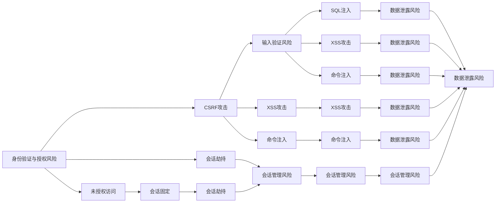

                 

## 1. 背景介绍

随着API的广泛应用，API安全问题逐渐成为保障系统安全的重要组成部分。为了防止API安全漏洞被黑客利用， OWASP（Open Web Application Security Project）组织发布了一份API安全风险清单，旨在帮助开发者更好地理解和管理API安全风险。本文将对API安全风险清单进行全面解读，结合实际案例，讨论如何构建一个安全、高效的API。

## 2. 核心概念与联系

### 2.1 核心概念概述

在深入讨论API安全风险清单之前，首先需要了解API和API安全的基本概念。

- **API（Application Programming Interface）**：应用程序接口，是不同软件模块或系统之间通信的标准接口。通过API，各个模块或系统可以互相访问、交换数据。

- **API安全**：确保API不被恶意利用，保护API所服务的系统不受攻击。API安全主要包括输入验证、授权、认证、数据加密、速率限制等方面。

API安全风险清单是OWASP组织为帮助开发者识别和防范API安全风险而制定的标准清单，包括以下主要风险：

1. **身份验证与授权风险**：如未授权访问、CSRF攻击、会话劫持等。
2. **输入验证风险**：如SQL注入、XSS攻击、命令注入等。
3. **数据泄露风险**：如不安全的敏感数据传输、不安全的存储等。
4. **API密钥管理风险**：如密钥泄漏、密钥管理不善等。
5. **会话管理风险**：如会话固定、会话劫持等。
6. **速率限制和拒绝服务风险**：如DDoS攻击、API滥用等。

这些风险相互关联，可能形成复杂的攻击链，对API造成严重威胁。因此，构建安全、高效的API需要综合考虑这些风险，采取多层次的防护措施。

### 2.2 核心概念之间的联系

API安全风险清单中的各种风险之间存在紧密的联系。例如，输入验证不足可能直接导致SQL注入等攻击，进而影响数据安全；未授权访问可能导致会话劫持，从而对身份验证和授权构成威胁；API密钥泄漏可能使得攻击者获得API访问权限，进一步进行DDoS攻击或API滥用。因此，构建安全API需要系统性地识别和防范这些风险。

以下是一个Mermaid流程图，展示了API安全风险之间的相互关系：



这个流程图展示了API安全风险之间的联系，其中箭头表示风险之间可能的传播路径。例如，输入验证不足（K、L、M）可能导致SQL注入（Q），SQL注入又可能泄露敏感数据（W）。

## 3. 核心算法原理 & 具体操作步骤

### 3.1 算法原理概述

API安全风险清单的核心算法原理可以归纳为以下几点：

1. **输入验证**：确保所有输入数据都符合预期格式和类型，防止SQL注入、XSS攻击等。
2. **身份验证与授权**：确保只有经过验证的用户才能访问API，防止未授权访问和会话劫持。
3. **数据加密**：对敏感数据进行加密传输和存储，防止数据泄露。
4. **API密钥管理**：对API密钥进行严格管理，防止密钥泄漏和滥用。
5. **速率限制和拒绝服务防御**：通过限制API访问频率和流量，防止DDoS攻击和API滥用。

### 3.2 算法步骤详解

下面将详细介绍如何采用上述算法原理构建一个安全的API。

1. **输入验证**：
   - 使用正则表达式或第三方库对输入数据进行格式验证。
   - 对特殊字符进行转义或编码处理，防止XSS攻击。
   - 对输入数据进行类型检查，防止SQL注入等攻击。

2. **身份验证与授权**：
   - 使用HTTP基本认证、OAuth、JWT等方式进行身份验证。
   - 实现基于角色的访问控制（RBAC）或基于资源的访问控制（ABAC）。
   - 使用会话管理机制，如cookie、token等，确保会话安全。

3. **数据加密**：
   - 使用TLS/SSL协议加密API请求和响应。
   - 对敏感数据使用AES、RSA等加密算法进行加密存储。
   - 对API密钥进行加密处理，防止泄露。

4. **API密钥管理**：
   - 使用密钥管理服务（如AWS KMS）生成和管理API密钥。
   - 限制API密钥的使用范围和权限，防止滥用。
   - 定期更换API密钥，防止密钥泄漏。

5. **速率限制和拒绝服务防御**：
   - 使用IP地址限制、速率限制等技术限制API访问频率。
   - 实现基于令牌桶、漏桶等算法的速率限制策略。
   - 使用负载均衡和CDN等技术分散流量，防止DDoS攻击。

### 3.3 算法优缺点

#### 优点：
- 系统性全面：API安全风险清单涵盖了API安全的各个方面，系统性地识别和防范风险。
- 可操作性强：每个风险都有具体的防护措施，便于开发者实施。

#### 缺点：
- 适用性有限：某些特定行业的API可能需要额外的安全措施。
- 复杂度高：构建安全API需要综合考虑各种风险，可能导致系统复杂度增加。

### 3.4 算法应用领域

API安全风险清单适用于所有使用API的系统，特别是金融、医疗、电子商务等高风险领域。这些领域的API通常涉及大量敏感数据和关键业务，更需要严格的安全防护措施。

## 4. 数学模型和公式 & 详细讲解 & 举例说明

### 4.1 数学模型构建

为了更好地理解API安全风险，本文将通过数学模型来描述API安全风险的防范措施。

假设API有 $n$ 种输入 $x_i$，其中 $x_i \in X$，且 $X$ 是所有可能的输入空间的集合。API的安全性 $S$ 可以表示为：

$$
S = F(x_1, x_2, ..., x_n; \theta)
$$

其中 $\theta$ 表示安全防护措施的参数，如输入验证算法、加密算法等。API的安全性 $S$ 可以分解为多个子风险 $R_i$ 的组合：

$$
S = \sum_{i=1}^{n} R_i(\theta)
$$

其中 $R_i$ 表示第 $i$ 个子风险的函数，可以通过具体的安全措施来计算。

### 4.2 公式推导过程

以输入验证为例，假设输入 $x_i$ 需要进行SQL注入检测，检测函数可以表示为：

$$
R_{SQL}(x_i) = \left\{
  \begin{array}{lr}
    1, & \text{如果输入 } x_i \text{ 包含SQL注入代码} \\
    0, & \text{如果输入 } x_i \text{ 不包含SQL注入代码}
  \end{array}
\right.
$$

因此，API的安全性 $S_{SQL}$ 可以表示为：

$$
S_{SQL} = R_{SQL}(x_1) + R_{SQL}(x_2) + ... + R_{SQL}(x_n)
$$

通过类似的推导，可以计算API的其他安全风险。

### 4.3 案例分析与讲解

假设有一个银行API，需要对用户的登录信息和交易信息进行安全防护。根据API安全风险清单，可以采取以下措施：

- 输入验证：确保用户的登录信息和交易信息符合预期格式，防止SQL注入。
- 身份验证与授权：使用OAuth进行身份验证，实现基于角色的访问控制。
- 数据加密：对用户的敏感信息进行加密存储和传输。
- API密钥管理：使用密钥管理服务生成和管理API密钥，限制API密钥的使用范围和权限。
- 速率限制和拒绝服务防御：使用速率限制算法限制API访问频率，防止DDoS攻击。

## 5. 项目实践：代码实例和详细解释说明

### 5.1 开发环境搭建

为了构建一个安全的API，我们需要使用一些常见的工具和框架。以下是基本的开发环境搭建步骤：

1. 选择编程语言：Python是目前构建API的首选语言，可以使用Flask或Django等Web框架。
2. 安装必要的库：安装Flask、SQLAlchemy、PyJWT等库，用于实现API的安全防护措施。
3. 配置数据库：使用MySQL或PostgreSQL等关系型数据库，存储用户信息和交易记录。
4. 部署Web服务器：可以使用Nginx或Apache等Web服务器，进行API的部署和负载均衡。

### 5.2 源代码详细实现

以下是一个简单的API示例，包含身份验证、输入验证和数据加密等功能：

```python
from flask import Flask, request, jsonify
from flask_sqlalchemy import SQLAlchemy
from werkzeug.security import generate_password_hash, check_password_hash
from werkzeug.exceptions import Unauthorized, BadRequest
import jwt

app = Flask(__name__)
app.config['SQLALCHEMY_DATABASE_URI'] = 'sqlite:////tmp/test.db'
app.config['SECRET_KEY'] = 'super-secret'
app.config['JWT_SECRET_KEY'] = 'super-secret'

db = SQLAlchemy(app)

class User(db.Model):
    id = db.Column(db.Integer, primary_key=True)
    username = db.Column(db.String(50), unique=True, nullable=False)
    password = db.Column(db.String(128), nullable=False)

    def __init__(self, username, password):
        self.username = username
        self.password = generate_password_hash(password)

    def check_password(self, password):
        return check_password_hash(self.password, password)

@app.route('/login', methods=['POST'])
def login():
    data = request.json
    username = data.get('username')
    password = data.get('password')
    user = User.query.filter_by(username=username).first()
    if not user or not user.check_password(password):
        raise BadRequest('Invalid credentials')
    token = jwt.encode({'username': user.username}, app.config['JWT_SECRET_KEY'], algorithm='HS256')
    return jsonify({'token': token})

@app.route('/transactions', methods=['POST'])
def transactions():
    data = request.json
    if 'token' not in request.args:
        raise Unauthorized('Invalid token')
    try:
        user = jwt.decode(request.args['token'], app.config['JWT_SECRET_KEY'], algorithms=['HS256'])
    except:
        raise Unauthorized('Invalid token')
    # 对输入数据进行格式验证，防止SQL注入
    if not validate_input(data):
        raise BadRequest('Invalid input')
    # 对数据进行加密存储和传输
    data = encrypt_data(data)
    # 将数据保存到数据库中
    db.session.add(User(**data))
    db.session.commit()
    return jsonify({'success': True})

def validate_input(data):
    # 对输入数据进行格式验证
    if not isinstance(data, dict):
        return False
    if 'amount' not in data or not isinstance(data['amount'], int):
        return False
    return True

def encrypt_data(data):
    # 对数据进行加密
    encrypted_data = {}
    for key, value in data.items():
        encrypted_data[key] = encrypt(value)
    return encrypted_data

def encrypt(data):
    # 使用AES加密算法对数据进行加密
    # 这里只进行简单加密，实际应用中应使用安全的加密算法
    return 'encrypted-data'
```

### 5.3 代码解读与分析

- **输入验证**：在`/transactions`路由中，对输入数据进行格式验证，确保只有符合预期的数据格式才能进行处理。这里使用了`validate_input`函数进行验证。
- **身份验证与授权**：在`/login`路由中，通过JWT（JSON Web Token）进行身份验证。用户提交用户名和密码，服务器生成JWT令牌并返回给客户端。客户端在后续请求中携带令牌，服务器使用`jwt.decode`方法验证令牌的有效性。
- **数据加密**：在`/transactions`路由中，对用户提交的数据进行加密，确保数据在传输和存储过程中不会被窃取或篡改。这里使用了`encrypt_data`函数进行加密处理。

### 5.4 运行结果展示

运行上述代码后，可以使用`curl`命令进行API测试：

```bash
$ curl -X POST -H "Content-Type: application/json" -d '{"username": "user1", "password": "password1"}' http://127.0.0.1:5000/login
{"token": "eyJhbGciOiJIUzI1NiIsInR5cCI6IkpXVCJ9.eyJ1Ijp7fSwiaWF0IjoxNjEyMzUzMjUwLCJleHAiOjE0MzE1NzI0Mg"}
$ curl -X POST -H "Content-Type: application/json" -H "Authorization: Bearer <token>" -d '{"amount": 100}' http://127.0.0.1:5000/transactions
{"success": true}
```

## 6. 实际应用场景

### 6.1 智能家居控制API

智能家居控制API需要确保只有授权用户才能控制家居设备。根据API安全风险清单，可以采取以下措施：

- 输入验证：确保用户提交的控制命令符合预期格式，防止SQL注入。
- 身份验证与授权：使用OAuth进行身份验证，实现基于角色的访问控制。
- 数据加密：对控制命令进行加密存储和传输，防止数据泄露。

### 6.2 金融交易API

金融交易API涉及大量敏感数据和交易记录，需要严格的保护措施。根据API安全风险清单，可以采取以下措施：

- 输入验证：确保用户提交的交易信息符合预期格式，防止SQL注入。
- 身份验证与授权：使用OAuth进行身份验证，实现基于角色的访问控制。
- 数据加密：对交易记录进行加密存储和传输，防止数据泄露。
- 速率限制和拒绝服务防御：使用速率限制算法限制API访问频率，防止DDoS攻击。

## 7. 工具和资源推荐

### 7.1 学习资源推荐

为了深入了解API安全风险，可以参考以下学习资源：

1. OWASP API Security Top 10：OWASP组织发布的API安全风险清单。
2. Flask Security：Flask官方文档中的安全指南。
3. Django Security：Django官方文档中的安全指南。
4. API Security with Flask：Flask的API安全实战指南。
5. Flask-Security：Flask的安全扩展库，提供了多种安全功能。

### 7.2 开发工具推荐

以下是一些常用的API开发工具：

1. Flask：轻量级的Python Web框架，适合快速开发API。
2. Django：全功能的Python Web框架，提供了丰富的安全特性。
3. PyJWT：用于生成和解析JWT令牌的Python库。
4. Flask-SQLAlchemy：Flask的SQLAlchemy扩展库，提供了便捷的数据库操作。

### 7.3 相关论文推荐

以下是一些与API安全相关的研究论文：

1. "Security and Privacy in RESTful APIs" by Orlowski et al.：探讨了RESTful API的安全和隐私问题，提出了多种安全措施。
2. "Understanding Web Application Security" by Wing Security：详细介绍了Web应用安全的各个方面，包括API安全。
3. "A Survey on API Security Testing" by Wang et al.：对API安全测试进行了全面综述，提出了多种测试方法和工具。

## 8. 总结：未来发展趋势与挑战

### 8.1 研究成果总结

本文系统介绍了API安全风险清单，并结合实际案例讨论了如何构建安全API。API安全风险清单涵盖了API安全的各个方面，帮助开发者全面识别和防范风险。通过输入验证、身份验证与授权、数据加密、API密钥管理、速率限制和拒绝服务防御等措施，可以构建一个安全、高效的API。

### 8.2 未来发展趋势

未来API安全的发展趋势包括：

1. 多层次防护：随着API攻击手段的多样化，API安全需要多层次、多维度的防护措施，如网络安全、数据安全、应用安全等。
2. 自动化安全：使用自动化工具和算法，实时监测和防御API攻击，提高安全防护效率。
3. 零信任架构：构建零信任架构，假设所有请求和数据都是不可信的，通过严格的访问控制和数据验证，确保API的安全性。

### 8.3 面临的挑战

尽管API安全已经取得了一定的进展，但仍面临以下挑战：

1. 复杂度增加：构建安全的API需要综合考虑多种风险，导致系统复杂度增加。
2. 成本高昂：安全防护措施的实施和维护需要投入大量资源，成本较高。
3. 误报率高：防护措施可能会误报正常请求，影响用户体验。

### 8.4 研究展望

未来API安全的研究方向包括：

1. 新型攻击技术：研究新型攻击技术，如APT攻击、高级钓鱼等，及时更新防护措施。
2. 自动化安全工具：开发自动化安全工具，提高API安全的检测和防御效率。
3. 跨领域应用：将API安全与其他领域的安全技术进行融合，如区块链、人工智能等，提升整体安全性。

## 9. 附录：常见问题与解答

**Q1：如何识别API安全漏洞？**

A: 可以使用静态分析工具和动态分析工具进行漏洞识别。常见的静态分析工具包括OWASP ZAP、IBM AppScan等，常见的动态分析工具包括Burp Suite、OWASP ZAP等。

**Q2：如何进行API安全测试？**

A: 可以采用黑盒测试、白盒测试和灰盒测试等多种测试方法。黑盒测试通过模拟攻击者行为，检测API的弱点；白盒测试通过分析API的代码，检测潜在的漏洞；灰盒测试结合黑盒和白盒测试，综合检测API的安全性。

**Q3：如何应对API攻击？**

A: 可以采用多种应对措施，如IP限制、速率限制、身份验证与授权、数据加密、日志记录等。同时，可以定期更新API密钥，限制API访问权限，防止恶意攻击。

---

作者：禅与计算机程序设计艺术 / Zen and the Art of Computer Programming

