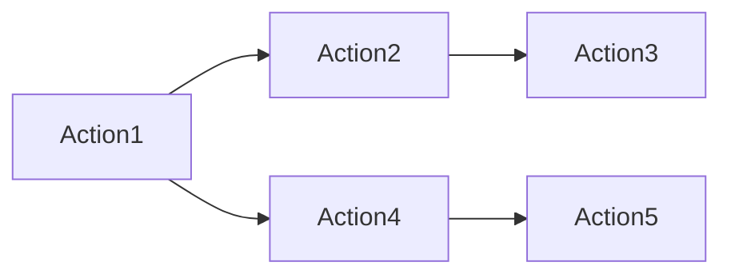

                 

# Oozie原理与代码实例讲解

> 关键词：Hadoop, Apache Oozie, workflow, workflow editor, XML, Python, workflow scheduling

## 1. 背景介绍

### 1.1 问题由来
在当今大数据时代，企业需要处理和分析越来越多的数据。为了高效地管理和自动化这些数据处理流程，Hadoop生态系统中的Apache Oozie应运而生。Oozie是一个开源的工作流协调服务，它可以帮助组织自动化、管理、调度和监控Hadoop MapReduce、Spark等计算框架中的工作流。

### 1.2 问题核心关键点
Oozie的核心价值在于其工作流协调能力。通过定义和调度工作流，Oozie可以自动化执行数据处理任务，从而提高效率，减少人为错误，并确保任务的可靠性和稳定性。Oozie的工作流主要由一系列的Action组成，每个Action执行特定的任务，如运行MapReduce作业、执行Python脚本、上传/下载文件等。

### 1.3 问题研究意义
研究Oozie的工作流协调原理和实现方法，对于企业自动化数据处理流程、提升数据处理效率、降低运营成本具有重要意义。通过Oozie，企业可以更灵活、高效地管理和调度大数据处理任务，从而提升整体数据处理能力。

## 2. 核心概念与联系

### 2.1 核心概念概述

为更好地理解Oozie的工作流协调原理，本节将介绍几个关键概念：

- **Apache Hadoop**：是一个开源的分布式计算框架，由Apache基金会赞助和维护。Hadoop的核心组件包括HDFS和MapReduce。
- **Apache Oozie**：是一个开源的工作流协调服务，基于XML和Python编写，用于自动化和调度Hadoop作业。
- **工作流(Workflow)**：一系列任务的序列，每个任务称为Action。工作流可以自动执行这些任务，从而实现复杂的数据处理流程。
- **Action**：是工作流中的基本操作单元，可以执行各种任务，如运行MapReduce作业、执行Python脚本、上传/下载文件等。
- **工作流编辑器(Workflow Editor)**：一个用户友好的界面，用于定义和管理工作流。

这些概念构成了Oozie的核心架构，帮助企业自动化和调度数据处理任务。

### 2.2 概念间的关系

这些概念之间的联系可以通过以下Mermaid流程图来展示：

```mermaid
graph LR
    A[Apache Hadoop] --> B[Apache Oozie]
    B --> C[工作流(Workflow)]
    C --> D[Action]
    D --> E[工作流编辑器(Workflow Editor)]
    E --> F[Python]
    E --> G[XML]
    F --> H[运行MapReduce作业]
    G --> I[调度文件上传]
```

这个流程图展示了Hadoop、Oozie、工作流、Action和工作流编辑器之间的关系：

1. Hadoop是Oozie的基础，Oozie用于协调和调度Hadoop作业。
2. 工作流由一系列Action组成，Action是工作流的执行单元。
3. Action可以执行各种任务，如运行MapReduce作业、执行Python脚本等。
4. 工作流编辑器提供用户界面，用于定义和管理工作流。
5. Python和XML是Oozie的两种主要编程语言，用于编写Action和定义工作流。

这些概念共同构成了Oozie的核心架构，使得Oozie能够有效地管理和调度大数据处理任务。

## 3. 核心算法原理 & 具体操作步骤
### 3.1 算法原理概述

Oozie的工作流协调原理基于以下三个基本步骤：

1. **定义工作流**：通过工作流编辑器，用户定义一系列Action，组成工作流。每个Action可以执行特定任务，如运行MapReduce作业、执行Python脚本、上传/下载文件等。
2. **调度工作流**：Oozie通过XML文件定义的工作流，将各个Action按照一定的顺序和依赖关系调度执行。
3. **监控和日志**：Oozie自动监控工作流的执行状态，并记录详细的日志，以便于故障排查和性能优化。

### 3.2 算法步骤详解

下面是Oozie工作流协调的具体步骤：

1. **安装Oozie**：首先需要安装Apache Oozie，可以通过yum命令在Linux系统中安装。
2. **配置Hadoop**：确保Hadoop环境已正确配置，并可以在Oozie中使用。
3. **编写工作流**：使用XML或Python编写工作流，定义一系列Action。
4. **创建工作流文件**：将XML或Python代码保存为Oozie工作流文件。
5. **提交工作流**：通过Oozie客户端或Web界面，提交工作流文件到Oozie服务器。
6. **执行工作流**：Oozie自动调度执行工作流中的Action，完成数据处理任务。
7. **监控工作流**：Oozie实时监控工作流状态，记录详细的日志，帮助故障排查和性能优化。

### 3.3 算法优缺点

Oozie的工作流协调原理具有以下优点：

1. **自动化执行**：通过定义和调度工作流，Oozie可以自动化执行复杂的Data Processing任务，减少人为错误，提高效率。
2. **灵活性高**：Oozie支持多种计算框架和Action类型，可以根据实际需求灵活定义工作流。
3. **可靠性高**：Oozie自动监控工作流状态，记录详细的日志，帮助故障排查和性能优化，保证任务可靠性。

同时，Oozie也存在一些缺点：

1. **学习曲线陡峭**：由于Oozie的工作流定义和管理需要一定的编程和配置能力，初学者的学习曲线较陡峭。
2. **性能开销**：Oozie的调度和管理功能需要一定的计算资源，可能会对性能产生一定影响。
3. **依赖性高**：Oozie高度依赖于Hadoop环境，一旦Hadoop环境出现问题，Oozie也可能会受到影响。

### 3.4 算法应用领域

Oozie的工作流协调原理广泛应用于数据处理和管理的多个领域：

- **大数据处理**：用于自动化和调度Hadoop作业，处理大规模数据集。
- **ETL流程**：用于定义和调度数据抽取、转换和加载流程，实现数据集成。
- **数据分析和报告**：用于自动化执行数据分析任务，生成报告和报表。
- **机器学习模型训练**：用于自动化训练和部署机器学习模型，进行模型更新和迭代。
- **数据备份和恢复**：用于自动化备份和恢复数据，确保数据安全。

## 4. 数学模型和公式 & 详细讲解 & 举例说明

### 4.1 数学模型构建

Oozie的工作流协调原理基于数据流图模型，模型主要由节点(Node)和边(Edge)组成，每个节点表示一个Action，边表示Action之间的依赖关系。下面是一个简单的Oozie工作流数据流图模型：



在这个数据流图中，Action1和Action4之间存在依赖关系，Action3和Action5之间存在依赖关系，但Action2和Action3之间不存在依赖关系。

### 4.2 公式推导过程

Oozie的工作流调度是基于有向无环图(Directed Acyclic Graph, DAG)的，通过拓扑排序算法进行调度。拓扑排序算法的核心思想是：对于有向无环图，如果存在一条从节点A到节点B的路径，则节点A必须先于节点B执行。

假设一个工作流包含$n$个Action，它们之间的依赖关系可以表示为一个有向图$G=(N,E)$，其中$N$表示Action节点集合，$E$表示Action节点之间的依赖关系集合。拓扑排序算法的基本步骤为：

1. **初始化**：将所有Action节点加入待处理队列$Q$中。
2. **循环处理**：从队列中取出一个节点，如果该节点没有前置节点，则执行该Action；否则将前置节点加入待处理队列中。
3. **结束条件**：当所有Action节点都被处理完毕后，排序结束。

### 4.3 案例分析与讲解

假设有一个简单的数据流图模型，表示数据处理流程：


使用拓扑排序算法进行调度：

1. **初始化**：将Action1和Action2加入队列中。
2. **循环处理**：取出Action1，执行Action1；将Action4加入队列中。取出Action2，执行Action2；将Action3和Action5加入队列中。取出Action4，执行Action4；将Action5加入队列中。取出Action3，执行Action3。取出Action5，执行Action5。
3. **结束条件**：所有Action节点都被处理完毕。

最终，Action1、Action2、Action4、Action3、Action5按照顺序依次执行，完成数据处理任务。

## 5. 项目实践：代码实例和详细解释说明

### 5.1 开发环境搭建

在开始Oozie项目实践前，需要先搭建好开发环境。以下是使用Hadoop集群搭建Oozie的流程：

1. **安装Hadoop**：在Linux系统中安装Apache Hadoop。
2. **安装Oozie**：在Hadoop目录下安装Apache Oozie。
3. **配置环境**：在Oozie目录下配置hadoop-site.xml和core-site.xml文件。
4. **启动Oozie**：启动Oozie服务，可以通过web界面或Oozie客户端进行管理。

### 5.2 源代码详细实现

下面是一个简单的Oozie工作流示例，用于执行Hadoop MapReduce作业：

```xml
<workflow-app xmlns:oozie="uri:oozie:workflow:0.5" name="my-job">
    <start to="start"/>
    <action name="start" doAs="my-job">
        <map-reduce>
            <job-track>
                <track-uri>hdfs://localhost:9000/user/my-job</track-uri>
            </job-track>
        </map-reduce>
    </action>
    <end name="end"/>
</workflow-app>
```

在这个工作流中，Start节点代表工作流的开始，End节点代表工作流的结束，Action节点表示一个具体的Hadoop MapReduce作业。

### 5.3 代码解读与分析

**Start节点**：定义工作流的开始。

**Action节点**：定义具体任务，如Hadoop MapReduce作业。

**End节点**：定义工作流的结束。

**map-reduce元素**：用于定义Hadoop MapReduce作业，包括作业跟踪信息。

### 5.4 运行结果展示

假设在工作流中执行了一个简单的Hadoop MapReduce作业，通过Oozie的Web界面查看执行结果：

1. **工作流状态**：Oozie实时监控工作流状态，显示当前执行的Action节点和剩余Action节点。
2. **日志信息**：Oozie记录详细的日志信息，包括Action执行时间、日志内容、异常信息等，帮助故障排查和性能优化。

## 6. 实际应用场景

### 6.1 大数据处理

在大数据处理场景中，Oozie用于自动化和调度Hadoop作业，处理大规模数据集。例如，可以使用Oozie自动执行数据清洗、数据存储、数据查询等任务。

### 6.2 ETL流程

在ETL流程中，Oozie用于定义和调度数据抽取、转换和加载流程，实现数据集成。例如，可以使用Oozie自动执行数据提取、数据转换、数据加载等任务。

### 6.3 数据分析和报告

在数据分析和报告场景中，Oozie用于自动化执行数据分析任务，生成报告和报表。例如，可以使用Oozie自动执行数据统计、数据可视化、数据报表生成等任务。

### 6.4 未来应用展望

随着Hadoop生态系统的不断发展，Oozie的自动化和调度能力将更加强大。未来的发展方向包括：

1. **支持更多计算框架**：Oozie将支持更多的计算框架，如Spark、Flink等，满足不同数据处理需求。
2. **增强工作流管理能力**：Oozie将提供更强大的工作流管理和调度能力，支持更复杂的数据处理流程。
3. **增强可扩展性**：Oozie将支持更高效的工作流调度和资源管理，满足大规模数据处理需求。
4. **增强可监控性**：Oozie将提供更详细的日志和监控信息，帮助故障排查和性能优化。
5. **增强可定制性**：Oozie将提供更灵活的工作流定义和管理方式，满足不同用户的需求。

## 7. 工具和资源推荐

### 7.1 学习资源推荐

为了帮助开发者系统掌握Oozie的工作流协调原理和实现方法，这里推荐一些优质的学习资源：

1. **Apache Oozie官方文档**：官方文档提供了详细的Oozie安装、配置和使用指南，是学习Oozie的最佳资源。
2. **《Hadoop Oozie实战》书籍**：介绍了Oozie的基本概念、工作流设计和管理方法，适合初学者入门。
3. **《Oozie实战教程》博客**：提供详细的Oozie工作流定义和管理示例，帮助开发者快速上手。
4. **Hadoop社区论坛**：社区论坛是Oozie用户交流和分享的最佳平台，可以获取最新的技术动态和实践经验。

通过对这些资源的学习实践，相信你一定能够快速掌握Oozie的工作流协调原理，并用于解决实际的NLP问题。

### 7.2 开发工具推荐

高效的开发离不开优秀的工具支持。以下是几款用于Oozie开发和管理的常用工具：

1. **Web界面**：Oozie提供了详细的Web界面，方便用户定义和管理工作流。
2. **Oozie客户端**：通过Oozie客户端，用户可以方便地提交、执行和管理工作流。
3. **Hadoop集群管理工具**：如Ambari、Cloudera Manager等，用于管理和监控Hadoop集群环境。
4. **日志分析工具**：如Apache Flink、Apache Spark等，用于分析和处理日志信息。
5. **可视化工具**：如Grafana、Prometheus等，用于实时监控和可视化工作流状态。

合理利用这些工具，可以显著提升Oozie开发和管理的效率，加快创新迭代的步伐。

### 7.3 相关论文推荐

Oozie的工作流协调原理源于学界的持续研究。以下是几篇奠基性的相关论文，推荐阅读：

1. "Oozie: Workflow Coordination for Hadoop"：介绍了Oozie的基本概念和工作流调度算法。
2. "Scalable Workflows for MapReduce"：研究了基于工作流的Hadoop作业调度和优化方法。
3. "MapReduce Workflow Scheduling for Large-scale Data Processing"：探讨了基于工作流的Hadoop作业调度和优化技术。
4. "Oozie: A Workflow Coordinator for Hadoop"：介绍了Oozie的开发背景和基本架构。
5. "Oozie: A Workflow Coordinator for Hadoop"：进一步研究了Oozie的工作流调度和优化技术。

这些论文代表了大语言模型微调技术的发展脉络。通过学习这些前沿成果，可以帮助研究者把握学科前进方向，激发更多的创新灵感。

除上述资源外，还有一些值得关注的前沿资源，帮助开发者紧跟Oozie的最新进展，例如：

1. **arXiv论文预印本**：人工智能领域最新研究成果的发布平台，包括大量尚未发表的前沿工作，学习前沿技术的必读资源。
2. **业界技术博客**：如Apache Hadoop、Apache Oozie、Hadoop社区等顶尖实验室的官方博客，第一时间分享他们的最新研究成果和洞见。
3. **技术会议直播**：如Hadoop Summit、Hadoop Conference等大会现场或在线直播，能够聆听到大佬们的前沿分享，开拓视野。
4. **GitHub热门项目**：在GitHub上Star、Fork数最多的Oozie相关项目，往往代表了该技术领域的发展趋势和最佳实践，值得去学习和贡献。
5. **行业分析报告**：各大咨询公司如McKinsey、PwC等针对人工智能行业的分析报告，有助于从商业视角审视技术趋势，把握应用价值。

总之，对于Oozie的工作流协调原理的学习和实践，需要开发者保持开放的心态和持续学习的意愿。多关注前沿资讯，多动手实践，多思考总结，必将收获满满的成长收益。

## 8. 总结：未来发展趋势与挑战

### 8.1 研究成果总结

本文对Oozie的工作流协调原理进行了全面系统的介绍。首先阐述了Oozie的来源背景和研究意义，明确了工作流协调在自动化数据处理流程中的核心价值。其次，从原理到实践，详细讲解了工作流协调的基本步骤和实现方法，给出了Oozie工作流定义和管理的完整代码实例。同时，本文还广泛探讨了Oozie工作流在多个行业领域的应用场景，展示了工作流协调的广泛应用前景。此外，本文精选了Oozie相关的学习资源和开发工具，力求为读者提供全方位的技术指引。

通过本文的系统梳理，可以看到，Oozie的工作流协调原理已经深入应用在Hadoop生态系统中，极大地提升了数据处理效率和系统稳定性。未来，伴随Hadoop生态系统的不断发展，Oozie的自动化和调度能力将更加强大，进一步推动大数据技术在企业中的应用。

### 8.2 未来发展趋势

展望未来，Oozie的工作流协调原理将呈现以下几个发展趋势：

1. **自动化程度提升**：随着AI技术的进步，Oozie将更多地引入自动化和智能化功能，帮助企业自动化更复杂的数据处理任务。
2. **更灵活的工作流设计**：Oozie将提供更灵活的工作流定义和管理方式，支持更复杂的数据处理流程。
3. **更高效的资源管理**：Oozie将支持更高效的资源管理和调度，满足大规模数据处理需求。
4. **更强大的监控和故障排查**：Oozie将提供更详细的日志和监控信息，帮助故障排查和性能优化。
5. **更广泛的应用场景**：Oozie将支持更多计算框架和数据处理任务，广泛应用于更多行业领域。

### 8.3 面临的挑战

尽管Oozie的工作流协调原理已经取得了不小的进展，但在迈向更加智能化、普适化应用的过程中，它仍面临诸多挑战：

1. **学习曲线陡峭**：Oozie的工作流定义和管理需要一定的编程和配置能力，初学者的学习曲线较陡峭。
2. **性能开销**：Oozie的调度和管理功能需要一定的计算资源，可能会对性能产生一定影响。
3. **依赖性高**：Oozie高度依赖于Hadoop环境，一旦Hadoop环境出现问题，Oozie也可能会受到影响。
4. **可扩展性**：Oozie需要支持更高效的工作流调度和资源管理，满足大规模数据处理需求。
5. **可监控性**：Oozie需要提供更详细的日志和监控信息，帮助故障排查和性能优化。

### 8.4 研究展望

面对Oozie工作流协调面临的挑战，未来的研究需要在以下几个方面寻求新的突破：

1. **增强自动化和智能化功能**：通过引入更多AI技术，如机器学习、深度学习等，增强Oozie的自动化和智能化功能，帮助企业自动化更复杂的数据处理任务。
2. **提升灵活性和可扩展性**：通过改进工作流定义和管理方式，提供更灵活和可扩展的工作流支持，满足不同企业的需求。
3. **优化资源管理和调度**：通过优化资源管理和调度算法，提高Oozie的性能和资源利用率。
4. **增强监控和故障排查能力**：通过增强日志和监控信息，帮助企业更好地进行故障排查和性能优化。
5. **支持更多计算框架和数据处理任务**：通过支持更多的计算框架和数据处理任务，扩展Oozie的应用场景，满足更多企业的需求。

这些研究方向的探索，必将引领Oozie的工作流协调技术迈向更高的台阶，为大数据技术在企业中的应用提供更加强大和可靠的基础。面向未来，Oozie的工作流协调原理将继续推动大数据处理技术的不断进步，助力企业数字化转型和智能化升级。

## 9. 附录：常见问题与解答

**Q1：Oozie是否适用于所有数据处理场景？**

A: Oozie适用于多种数据处理场景，如大数据处理、ETL流程、数据分析和报告等。但对于一些特殊场景，如实时数据处理、流数据处理等，可能需要其他工具和框架的支持。

**Q2：Oozie是否需要部署在Hadoop集群上？**

A: Oozie高度依赖于Hadoop环境，需要在Hadoop集群上部署和运行。一旦Hadoop环境出现问题，Oozie也可能会受到影响。因此，需要确保Hadoop集群的稳定性和可用性。

**Q3：如何优化Oozie的工作流调度？**

A: 优化Oozie的工作流调度需要从多个方面入手，如改进拓扑排序算法、优化资源管理、增强监控能力等。可以通过引入更多的自动化和智能化功能，提高工作流调度的效率和稳定性。

**Q4：如何提高Oozie的性能？**

A: 提高Oozie的性能需要从多个方面入手，如改进工作流调度算法、优化资源管理、增强监控能力等。可以通过引入更多的自动化和智能化功能，提高工作流调度的效率和稳定性。

**Q5：如何降低Oozie的学习曲线？**

A: 降低Oozie的学习曲线需要提供更多的用户文档和示例代码，帮助用户更好地理解和使用Oozie。同时，可以引入更多的可视化工具和图形界面，简化工作流定义和管理过程。

这些问题的答案展示了Oozie工作流协调的广泛应用前景和潜在挑战，帮助开发者更好地理解和应用Oozie技术。总之，Oozie作为Hadoop生态系统中的重要组成部分，将继续在数据处理和管理中发挥重要作用，助力企业数字化转型和智能化升级。

