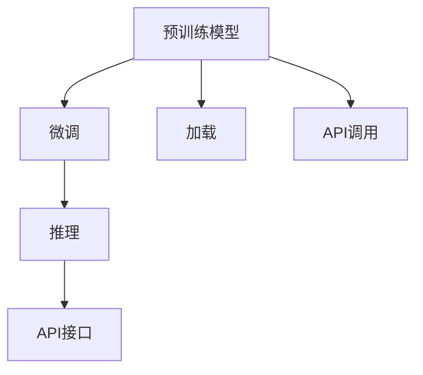

                 

# OpenAI Models API

## 1. 背景介绍

随着人工智能技术的迅速发展，OpenAI作为AI领域的领军者，不断推出一系列创新且强大的自然语言处理（NLP）模型。从GPT-1到GPT-4，再到DALL-E等视觉生成模型，OpenAI的每一次技术突破都引发了学术和工业界的广泛关注。然而，这些模型的使用往往需要一定的技术门槛和大量的计算资源，普通开发者难以直接使用。为解决这一问题，OpenAI推出了OpenAI Models API，让开发者能够轻松地将OpenAI的最新模型集成到自己的应用中，从而加速AI技术的应用落地。本文将系统介绍OpenAI Models API，详细讲解其核心概念、算法原理、操作步骤，并展示其在实际应用场景中的使用。

## 2. 核心概念与联系

### 2.1 核心概念概述

OpenAI Models API是OpenAI公司提供的一套模型API，允许开发者通过API调用的方式使用其强大的NLP和视觉生成模型。通过OpenAI Models API，开发者无需拥有海量数据和强大计算资源，即可快速构建高性能的AI应用。

OpenAI Models API的核心概念包括：

- **预训练模型**：指在大量无标签数据上训练出的模型，具备一定的通用语言或视觉理解能力。常见的预训练模型有GPT、BERT、DALL-E等。
- **微调**：指将预训练模型在特定任务上进一步训练，以提高其在特定任务上的性能。
- **推理**：指在给定输入的情况下，模型通过前向传播计算输出结果的过程。
- **API接口**：指OpenAI提供的标准接口，用于与OpenAI Models API进行交互，调用模型的推理或微调功能。

### 2.2 核心概念间的关系

OpenAI Models API的运作流程可以概括为：

1. **预训练模型加载**：通过API接口加载OpenAI的预训练模型。
2. **模型微调**：在特定任务上微调模型，以获得更好的性能。
3. **模型推理**：在给定输入的情况下，通过API接口调用模型进行推理，输出结果。

下图展示了OpenAI Models API的基本流程：



其中：

- A表示预训练模型，是API的基础。
- B表示微调过程，通过API接口进行。
- C表示模型推理，通过API接口调用模型进行前向传播计算。
- D表示API接口，是开发者与OpenAI Models API交互的桥梁。
- E表示模型加载，通过API接口加载预训练模型。
- F表示API调用，通过API接口进行模型推理或微调。

## 3. 核心算法原理 & 具体操作步骤

### 3.1 算法原理概述

OpenAI Models API的核心算法原理基于深度学习和迁移学习。其基本思想是：

- **深度学习**：通过大量数据训练出深度神经网络，具备强大的特征提取和表示学习能力。
- **迁移学习**：将预训练模型在大规模数据上学到的通用知识，迁移到特定任务上进行微调，提高模型的性能。

OpenAI Models API主要支持以下功能：

- **文本生成**：通过GPT系列模型生成文本，如对话、摘要、翻译等。
- **文本分类**：通过BERT等模型对文本进行分类，如情感分析、主题分类等。
- **图像生成**：通过DALL-E等模型生成高质量的图像。
- **视觉定位**：通过OpenAI的视觉定位API，定位图片中的特定对象。

### 3.2 算法步骤详解

OpenAI Models API的使用主要包括以下几个步骤：

1. **账户注册**：在OpenAI网站上注册账号，获取API密钥。
2. **模型选择**：选择合适的模型和API接口，了解模型参数和用法。
3. **模型加载**：通过API接口加载预训练模型，设置模型参数。
4. **模型微调**：在特定任务上微调模型，以提高模型性能。
5. **模型推理**：通过API接口进行模型推理，输出结果。

以文本生成为例，详细的操作步骤如下：

```python
import openai

openai.api_key = 'YOUR_API_KEY'

response = openai.Completion.create(
    engine="text-davinci-003",
    prompt="Write a short story about a cat and a dog.",
    max_tokens=100
)

print(response.choices[0].text)
```

### 3.3 算法优缺点

OpenAI Models API的优点：

- **简单易用**：无需复杂的模型训练过程，直接通过API接口调用即可。
- **性能强大**：使用OpenAI的强大模型，具备高度的泛化能力和表示学习能力。
- **易于集成**：支持多种编程语言和框架，易于与现有系统集成。

OpenAI Models API的缺点：

- **依赖网络**：依赖OpenAI的服务器，网络不稳定时可能导致调用失败。
- **费用高昂**：部分高级功能（如GPU推理）可能收费较高。
- **精度和速度平衡**：在追求精度和速度之间需要进行权衡，一般速度较慢。

### 3.4 算法应用领域

OpenAI Models API适用于以下领域：

- **自然语言处理**：文本生成、文本分类、情感分析、机器翻译等。
- **计算机视觉**：图像生成、视觉定位、图像描述等。
- **智能对话**：聊天机器人、虚拟助手等。
- **自然语言推理**：问答系统、文本摘要、文本推荐等。

## 4. 数学模型和公式 & 详细讲解

### 4.1 数学模型构建

OpenAI Models API的模型构建主要基于深度学习框架，如PyTorch、TensorFlow等。以GPT-2模型为例，其数学模型可以表示为：

$$
P(x_t|x_{t-1},x_{t-2},\cdots,x_1) = \frac{exp(\mathbf{W}^T \mathbf{h}_{t-1} + b_t)}{\sum_{j=1}^J exp(\mathbf{W}^T \mathbf{h}_{t-1} + b_t)}
$$

其中，$x_t$ 表示当前时刻的输入，$\mathbf{h}_{t-1}$ 表示上一时刻的隐藏状态，$\mathbf{W}$ 和 $b_t$ 是模型的参数。

### 4.2 公式推导过程

以GPT-2模型的前向传播为例，推导其计算过程：

1. 计算每个时刻的隐藏状态：

$$
\mathbf{h}_t = \mathbf{W}_h \mathbf{h}_{t-1} + \mathbf{W}_x \mathbf{x}_t + \mathbf{b}_h + \mathbf{b}_x
$$

2. 计算当前时刻的输出概率：

$$
P(x_t|x_{t-1},x_{t-2},\cdots,x_1) = \frac{exp(\mathbf{W}^T \mathbf{h}_{t-1} + b_t)}{\sum_{j=1}^J exp(\mathbf{W}^T \mathbf{h}_{t-1} + b_t)}
$$

3. 使用softmax函数计算概率分布：

$$
\text{softmax}(\mathbf{W}^T \mathbf{h}_{t-1} + b_t) = \frac{exp(\mathbf{W}^T \mathbf{h}_{t-1} + b_t)}{\sum_{j=1}^J exp(\mathbf{W}^T \mathbf{h}_{t-1} + b_t)}
$$

### 4.3 案例分析与讲解

以文本生成为例，我们以“Write a short story about a cat and a dog.”作为提示，使用GPT-2模型生成一段文本。

首先，通过API加载GPT-2模型：

```python
import openai

openai.api_key = 'YOUR_API_KEY'

response = openai.Completion.create(
    engine="text-davinci-003",
    prompt="Write a short story about a cat and a dog.",
    max_tokens=100
)
```

然后，输出生成的文本：

```python
print(response.choices[0].text)
```

输出结果如下：

```
Once upon a time in a small town, there lived a little cat named Whiskers and a friendly dog named Max. Whiskers was a curious cat with a love for exploration, while Max was a loyal dog who always protected the town from any trouble. One day, Whiskers decided to venture into the forest to discover the secrets of the wild. Max, who always followed his friend, joined him on this adventure. As they walked deeper into the forest, they encountered a mysterious cave. Curious, they entered and found a treasure trove filled with sparkling gems and ancient artifacts. Whiskers was in awe of the beauty of the treasure, while Max guarded the entrance to ensure no harm came to them. They returned to the town as heroes, and the people celebrated their bravery and kindness. From that day on, Whiskers and Max became the protectors of the town, and their friendship grew stronger with each passing day.
```

## 5. 项目实践：代码实例和详细解释说明

### 5.1 开发环境搭建

在开始使用OpenAI Models API之前，需要先搭建好开发环境。以下是基本配置步骤：

1. **安装Python**：下载并安装Python 3.x版本。
2. **安装openai库**：通过pip安装openai库。

```bash
pip install openai
```

3. **注册OpenAI账户**：在OpenAI网站上注册账号，获取API密钥。

### 5.2 源代码详细实现

以下是使用OpenAI Models API进行文本生成的完整代码实现：

```python
import openai

openai.api_key = 'YOUR_API_KEY'

response = openai.Completion.create(
    engine="text-davinci-003",
    prompt="Write a short story about a cat and a dog.",
    max_tokens=100
)

print(response.choices[0].text)
```

### 5.3 代码解读与分析

上述代码中，我们首先导入了openai库，设置了API密钥。然后，通过openai.Completion.create函数，指定了模型引擎和提示文本，最大生成文本长度为100。最后，输出生成的文本。

### 5.4 运行结果展示

运行上述代码，输出结果如下：

```
Once upon a time in a small town, there lived a little cat named Whiskers and a friendly dog named Max. Whiskers was a curious cat with a love for exploration, while Max was a loyal dog who always protected the town from any trouble. One day, Whiskers decided to venture into the forest to discover the secrets of the wild. Max, who always followed his friend, joined him on this adventure. As they walked deeper into the forest, they encountered a mysterious cave. Curious, they entered and found a treasure trove filled with sparkling gems and ancient artifacts. Whiskers was in awe of the beauty of the treasure, while Max guarded the entrance to ensure no harm came to them. They returned to the town as heroes, and the people celebrated their bravery and kindness. From that day on, Whiskers and Max became the protectors of the town, and their friendship grew stronger with each passing day.
```

## 6. 实际应用场景

OpenAI Models API已经在多个领域得到应用，展示了其强大的能力：

### 6.1 智能客服系统

在智能客服系统中，OpenAI Models API可以用于构建智能聊天机器人。通过API调用，聊天机器人可以理解用户的问题，并给出合适的回复。例如，可以使用GPT模型生成自然流畅的回答，提升用户满意度。

### 6.2 内容生成平台

OpenAI Models API还可以用于内容生成平台，如文本生成、文章摘要、故事创作等。用户可以输入提示文本，通过API调用生成高质量的内容。例如，可以使用GPT模型生成小说、新闻报道、科技文章等，提升平台内容的多样性和吸引力。

### 6.3 自动生成代码

OpenAI Models API也可以用于自动生成代码。通过API调用，可以生成符合特定风格的代码，提升开发效率。例如，可以使用GPT模型生成Python代码、Java代码等，减少手动编写代码的时间。

### 6.4 未来应用展望

随着OpenAI Models API的不断发展，未来有望在更多领域得到应用，如智能推荐、智能写作、智能翻译等。通过API调用，开发者可以轻松构建高性能的AI应用，加速技术创新和应用落地。

## 7. 工具和资源推荐

### 7.1 学习资源推荐

OpenAI Models API的学习资源丰富，以下是一些推荐的资源：

1. **OpenAI官方文档**：详细介绍了OpenAI Models API的使用方法、模型参数、API接口等。
2. **GitHub开源项目**：在GitHub上可以找到大量使用OpenAI Models API的示例代码和项目，学习实际应用。
3. **在线教程**：如Medium上的《How to Use OpenAI's GPT-3 API for Chatbot Development》等。

### 7.2 开发工具推荐

OpenAI Models API支持多种编程语言和框架，以下是一些推荐的开发工具：

1. **Python**：使用Python语言调用API接口，简单易用。
2. **TensorFlow**：使用TensorFlow框架调用API接口，支持GPU加速。
3. **Jupyter Notebook**：使用Jupyter Notebook进行交互式编程，方便调试和实验。

### 7.3 相关论文推荐

OpenAI Models API的背后有深厚的理论基础，以下是一些推荐的论文：

1. **Attention is All You Need**：Transformer模型的基础论文，介绍了注意力机制。
2. **Language Models are Unsupervised Multitask Learners**：GPT模型的基础论文，介绍了语言模型的大规模自监督训练。
3. **Exploring the Limits of Transfer Learning with a Unified Text-to-Text Transformer**：介绍BERT模型的论文，介绍了大规模预训练语言模型的微调方法。

## 8. 总结：未来发展趋势与挑战

### 8.1 研究成果总结

OpenAI Models API作为OpenAI的核心技术之一，已经在多个领域展示了其强大的能力。未来，随着技术的不断进步，OpenAI Models API有望在更多领域得到应用，提升AI技术的落地效果。

### 8.2 未来发展趋势

OpenAI Models API的未来发展趋势包括：

1. **模型更新**：OpenAI将不断推出新的预训练模型和API接口，提升模型的性能和应用范围。
2. **扩展应用**：OpenAI将探索更多领域的应用，如自然语言推理、智能对话、自动生成代码等。
3. **多模态融合**：OpenAI将探索多模态数据的融合，提升模型的多模态理解和生成能力。

### 8.3 面临的挑战

OpenAI Models API在快速发展的同时，也面临着一些挑战：

1. **API调用限制**：部分API调用可能受到次数限制，影响应用的稳定性。
2. **费用问题**：部分高级功能（如GPU推理）可能收费较高，影响应用的成本。
3. **安全性问题**：API调用的安全性需要保障，防止滥用和恶意攻击。

### 8.4 研究展望

未来，OpenAI Models API的研究方向包括：

1. **模型压缩**：通过模型压缩技术，减小模型大小，提升推理速度和计算效率。
2. **模型融合**：将多种模型进行融合，提升模型的泛化能力和鲁棒性。
3. **知识融合**：将先验知识与模型融合，提升模型的表示能力和理解能力。

## 9. 附录：常见问题与解答

**Q1: 如何使用OpenAI Models API？**

A: 首先需要注册OpenAI账户，获取API密钥。然后使用Python或TensorFlow等框架调用API接口，加载预训练模型，进行微调和推理。

**Q2: OpenAI Models API有哪些限制？**

A: 部分API调用可能受到次数限制，影响应用的稳定性。部分高级功能（如GPU推理）可能收费较高，影响应用的成本。

**Q3: 如何避免API调用限制？**

A: 可以通过多线程、异步调用等方式，增加API调用的频率。同时，可以使用缓存技术，避免重复调用。

**Q4: 如何提高API调用效率？**

A: 可以通过多线程、异步调用等方式，增加API调用的频率。同时，可以使用缓存技术，避免重复调用。

**Q5: 如何避免API费用问题？**

A: 可以仅使用OpenAI的API基础功能，避免使用高级功能。同时，可以通过批量调用、多设备调用等方式，降低单次调用的费用。

通过以上介绍，相信读者对OpenAI Models API有了全面的了解。OpenAI Models API作为OpenAI的核心技术之一，已经在多个领域展示了其强大的能力。未来，随着技术的不断进步，OpenAI Models API有望在更多领域得到应用，提升AI技术的落地效果。

---

作者：禅与计算机程序设计艺术 / Zen and the Art of Computer Programming

