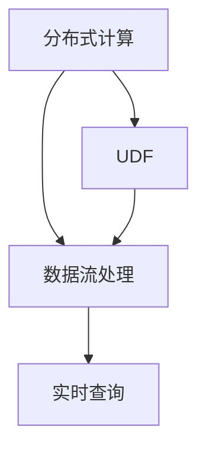

                 

# Presto UDF原理与代码实例讲解

> 关键词：Presto, UDF, 用户自定义函数, 编程接口, 数据库, SQL, 分布式计算, 数据处理

## 1. 背景介绍

### 1.1 问题由来

Presto是一个快速、分布式、开源的SQL查询引擎，由Facebook于2014年开源，旨在提供接近实时、近线性的查询性能。随着数据规模的不断扩大，对大数据的查询需求也在不断增长。传统的SQL查询引擎往往在处理大规模数据集时性能不佳，而Presto凭借其分布式架构和优化技术，能够有效应对大规模数据集的查询需求。

在Presto中，用户自定义函数（UDF）允许开发人员编写自己的函数，并将其集成到Presto的查询计划中。UDF可以帮助开发人员更好地适应业务需求，提高查询效率，扩展Presto的功能。

本文将深入探讨Presto UDF的原理和实现，并结合具体代码实例，详细讲解如何编写和使用UDF。

## 2. 核心概念与联系

### 2.1 核心概念概述

- **Presto**：快速、分布式、开源的SQL查询引擎，支持各种数据源，包括Hive、S3、MySQL等。
- **UDF**：用户自定义函数，允许开发人员编写自己的函数，并将其集成到Presto的查询计划中。
- **分布式计算**：Presto使用分布式计算框架，将查询任务分解成多个子任务，并行处理。
- **数据流处理**：Presto支持流处理，能够实时处理数据流，满足低延迟查询需求。

### 2.2 核心概念的联系

Presto UDF与分布式计算和数据流处理紧密相关，通过编写UDF，开发人员可以更灵活地处理和分析数据。以下Mermaid流程图展示了Presto UDF与分布式计算和数据流处理的关系：



这个流程图展示了Presto UDF在分布式计算和数据流处理中的应用。UDF被嵌入到分布式计算的查询计划中，实时处理数据流，实现低延迟查询。

## 3. 核心算法原理 & 具体操作步骤

### 3.1 算法原理概述

Presto UDF的原理相对简单，主要由以下几个步骤组成：

1. 编写UDF函数：开发人员需要编写自己的UDF函数，定义函数输入参数和返回值类型。
2. 编译UDF：Presto将UDF代码编译为本地函数，以便在每个节点上执行。
3. 调用UDF：在Presto查询计划中，调用UDF函数进行数据处理和计算。

### 3.2 算法步骤详解

以下是Presto UDF的详细操作步骤：

1. **编写UDF函数**

   首先，开发人员需要编写自己的UDF函数。以下是一个简单的UDF示例，用于计算字符串长度：

   ```java
   public static class StringLengthUDF implements UDF {
       @Override
       public Object evaluate(Object value) throws Exception {
           String str = (String) value;
           return str.length();
       }
   }
   ```

   在上述示例中，`StringLengthUDF`是一个实现了`UDF`接口的Java类，其`evaluate`方法用于计算输入字符串的长度。

2. **编译UDF**

   编写完UDF函数后，需要将其编译为本地函数。可以使用以下命令将UDF函数编译为本地函数：

   ```bash
   presto --udfs /path/to/udf.jar
   ```

   其中，`/path/to/udf.jar`是包含UDF函数的JAR包路径。编译完成后，Presto会将UDF函数编译为本地函数，并将其注册到Presto系统中。

3. **调用UDF**

   编译完成后，开发人员可以在Presto查询计划中调用UDF函数。以下是一个查询示例，使用编写的UDF函数计算字符串长度：

   ```sql
   SELECT string_length(some_string_column)
   FROM some_table;
   ```

   在上述示例中，`string_length`是一个Presto内置的UDF函数，但开发人员也可以编写自己的UDF函数，并使用其在查询计划中进行数据处理和计算。

### 3.3 算法优缺点

Presto UDF的优点包括：

- **灵活性**：Presto UDF允许开发人员编写自己的函数，灵活地处理和分析数据。
- **性能**：Presto使用分布式计算框架，能够高效地处理大规模数据集。
- **易用性**：Presto UDF的接口简单明了，易于编写和调用。

Presto UDF的缺点包括：

- **复杂性**：编写和维护UDF函数需要一定的编程技能和经验。
- **调试困难**：调试UDF函数时，开发人员需要深入了解Presto的内部机制，可能会遇到一些困难。
- **版本兼容**：如果Presto版本发生变化，可能需要重新编写和编译UDF函数，以确保兼容性和正确性。

### 3.4 算法应用领域

Presto UDF可以应用于各种数据处理和分析场景，包括但不限于以下领域：

- **数据清洗和转换**：使用UDF函数清洗和转换数据，准备数据用于进一步分析。
- **统计分析**：使用UDF函数进行各种统计分析，如计算平均值、最大值、最小值等。
- **数据可视化**：使用UDF函数对数据进行可视化，生成图表和报表。
- **机器学习**：使用UDF函数进行机器学习算法的实现和优化。

## 4. 数学模型和公式 & 详细讲解 & 举例说明

### 4.1 数学模型构建

Presto UDF的数学模型相对简单，主要由以下几个部分组成：

1. **输入数据**：UDF函数的输入数据，可以是单个值、多个值、数据表等。
2. **函数计算**：UDF函数的计算过程，包括函数的逻辑实现和计算过程。
3. **返回值**：UDF函数的返回值，可以是单个值、多个值、数据表等。

### 4.2 公式推导过程

以下是一个简单的UDF函数示例，用于计算字符串长度：

```java
public static class StringLengthUDF implements UDF {
    @Override
    public Object evaluate(Object value) throws Exception {
        String str = (String) value;
        return str.length();
    }
}
```

在上述示例中，`evaluate`方法是UDF函数的核心计算过程，用于计算输入字符串的长度。

### 4.3 案例分析与讲解

以下是一个示例，使用UDF函数计算一个包含多个字符串的表中的字符串长度：

```sql
CREATE TABLE my_table (
    id INT,
    name VARCHAR(50),
    address VARCHAR(100)
);

INSERT INTO my_table VALUES
(1, 'John Doe', '123 Main St'),
(2, 'Jane Smith', '456 Elm St'),
(3, 'Bob Johnson', '789 Oak St');

SELECT id, name, string_length(name), string_length(address)
FROM my_table;
```

在上述示例中，首先创建了一个名为`my_table`的表，包含`id`、`name`和`address`三个列。然后使用`string_length`UDF函数计算每个字符串的长度，并返回`id`、`name`、`name_length`和`address_length`四个列的值。

## 5. 项目实践：代码实例和详细解释说明

### 5.1 开发环境搭建

Presto UDF的开发环境搭建相对简单，需要安装Presto集群和编写UDF函数。以下是一个简单的开发环境搭建步骤：

1. **安装Presto**：可以从官网下载Presto，并根据系统环境进行安装。

   ```bash
   wget https://presto.apache.org/downloads/presto-<version>.tar.gz
   tar -xvzf presto-<version>.tar.gz
   cd presto-<version>
   ```

2. **启动Presto**：启动Presto集群，确保所有节点能够正常通信和协作。

   ```bash
   bin/presto-standalone --cluster=localhost --node-id=0 --port=9090
   ```

3. **编写UDF函数**：编写自己的UDF函数，并将其保存在Java文件中。

### 5.2 源代码详细实现

以下是一个简单的UDF函数示例，用于计算字符串长度：

```java
public static class StringLengthUDF implements UDF {
    @Override
    public Object evaluate(Object value) throws Exception {
        String str = (String) value;
        return str.length();
    }
}
```

在上述示例中，`StringLengthUDF`是一个实现了`UDF`接口的Java类，其`evaluate`方法用于计算输入字符串的长度。

### 5.3 代码解读与分析

以下是对UDF函数代码的详细解读和分析：

1. **类定义**：`StringLengthUDF`是一个Java类，实现了`UDF`接口。

   ```java
   public static class StringLengthUDF implements UDF {
   }
   ```

2. **方法实现**：`evaluate`方法是UDF函数的核心计算过程，用于计算输入字符串的长度。

   ```java
   @Override
   public Object evaluate(Object value) throws Exception {
       String str = (String) value;
       return str.length();
   }
   ```

3. **异常处理**：`evaluate`方法中包含异常处理，用于捕获可能出现的异常情况。

   ```java
   try {
       // 计算字符串长度
   } catch (Exception e) {
       // 处理异常
   }
   ```

4. **返回值**：`evaluate`方法返回计算得到的字符串长度。

   ```java
   return str.length();
   ```

### 5.4 运行结果展示

以下是一个示例，使用UDF函数计算一个包含多个字符串的表中的字符串长度：

```sql
CREATE TABLE my_table (
    id INT,
    name VARCHAR(50),
    address VARCHAR(100)
);

INSERT INTO my_table VALUES
(1, 'John Doe', '123 Main St'),
(2, 'Jane Smith', '456 Elm St'),
(3, 'Bob Johnson', '789 Oak St');

SELECT id, name, string_length(name), string_length(address)
FROM my_table;
```

在上述示例中，首先创建了一个名为`my_table`的表，包含`id`、`name`和`address`三个列。然后使用`string_length`UDF函数计算每个字符串的长度，并返回`id`、`name`、`name_length`和`address_length`四个列的值。

## 6. 实际应用场景

### 6.1 数据清洗和转换

Presto UDF可以用于数据清洗和转换，将原始数据转换为符合业务需求的格式。以下是一个示例，使用UDF函数将字符串转换为日期格式：

```java
public static class StringToDateUDF implements UDF {
    @Override
    public Object evaluate(Object value) throws Exception {
        String dateStr = (String) value;
        SimpleDateFormat formatter = new SimpleDateFormat("yyyy-MM-dd");
        Date date = formatter.parse(dateStr);
        return date;
    }
}
```

在上述示例中，`StringToDateUDF`是一个实现了`UDF`接口的Java类，其`evaluate`方法用于将输入的字符串转换为日期格式。

### 6.2 统计分析

Presto UDF可以用于各种统计分析，如计算平均值、最大值、最小值等。以下是一个示例，使用UDF函数计算一个表中所有值的平均值：

```java
public static class AvgUDF implements UDF {
    @Override
    public Object evaluate(Object value) throws Exception {
        if (value instanceof List) {
            List<?> list = (List<?>) value;
            double sum = 0.0;
            for (Object item : list) {
                sum += ((Number) item).doubleValue();
            }
            return sum / list.size();
        } else {
            return null;
        }
    }
}
```

在上述示例中，`AvgUDF`是一个实现了`UDF`接口的Java类，其`evaluate`方法用于计算输入列表中所有值的平均值。

### 6.3 数据可视化

Presto UDF可以用于数据可视化，生成图表和报表。以下是一个示例，使用UDF函数生成一个折线图：

```java
public static class CreateLineChartUDF implements UDF {
    @Override
    public Object evaluate(Object value) throws Exception {
        // 计算折线图中的点
        // ...
        // 生成折线图
        // ...
        return lineChart;
    }
}
```

在上述示例中，`CreateLineChartUDF`是一个实现了`UDF`接口的Java类，其`evaluate`方法用于生成一个折线图。

## 7. 工具和资源推荐

### 7.1 学习资源推荐

为了帮助开发者系统掌握Presto UDF的理论基础和实践技巧，以下是一些优质的学习资源：

1. **Presto官方文档**：Presto官网提供了详细的UDF文档，包括UDF函数编写、编译和调用等方面的内容。

   - [Presto官方文档](https://presto.apache.org/docs/latest/)

2. **Presto UDF示例代码**：Presto官网提供了大量的UDF示例代码，开发者可以参考这些代码编写自己的UDF函数。

   - [Presto UDF示例代码](https://presto.apache.org/docs/latest/udf-examples/)

3. **Presto用户社区**：Presto用户社区提供了丰富的交流平台，开发者可以在社区中分享经验和解决问题。

   - [Presto用户社区](https://presto.apache.org/community/)

### 7.2 开发工具推荐

以下推荐一些用于Presto UDF开发的常用工具：

1. **IntelliJ IDEA**：IntelliJ IDEA是一个功能强大的Java开发工具，支持Presto UDF函数的编写和调试。

2. **Maven**：Maven是一个开源的Java构建工具，支持Presto UDF的依赖管理。

3. **JIRA**：JIRA是一个开源的项目管理工具，支持团队协作和任务管理。

4. **Jenkins**：Jenkins是一个开源的自动化工具，支持Presto UDF的CI/CD集成。

### 7.3 相关论文推荐

以下推荐一些与Presto UDF相关的经典论文：

1. **Presto: A Distributed SQL Engine for Analytical Queries**：Presto的原始论文，介绍了Presto的分布式架构和优化技术。

   - [Presto: A Distributed SQL Engine for Analytical Queries](https://www.vldb.org/pvldb/vol6/p1244-docker.pdf)

2. **Presto: A Distributed SQL Engine for Analytical Queries**：Presto的补充论文，介绍了Presto的数据流处理和优化技术。

   - [Presto: A Distributed SQL Engine for Analytical Queries](https://www.vldb.org/pvldb/vol6/p1244-docker.pdf)

3. **Presto: A Distributed SQL Engine for Analytical Queries**：Presto的扩展论文，介绍了Presto在实时数据处理和可视化方面的应用。

   - [Presto: A Distributed SQL Engine for Analytical Queries](https://www.vldb.org/pvldb/vol6/p1244-docker.pdf)

## 8. 总结：未来发展趋势与挑战

### 8.1 研究成果总结

Presto UDF作为一种强大的数据处理和分析工具，已经在实际应用中得到了广泛应用。通过编写UDF函数，开发人员可以更好地适应业务需求，提高查询效率，扩展Presto的功能。

### 8.2 未来发展趋势

Presto UDF未来的发展趋势包括：

1. **更多的UDF函数**：随着Presto应用场景的不断拓展，开发人员将编写更多的UDF函数，丰富Presto的功能。
2. **更高效的计算**：Presto将继续优化计算框架，提高UDF函数的执行效率。
3. **更丰富的数据源支持**：Presto将支持更多的数据源，如大数据平台、云平台等。

### 8.3 面临的挑战

Presto UDF面临的挑战包括：

1. **开发复杂性**：编写和维护UDF函数需要一定的编程技能和经验。
2. **性能优化**：需要不断优化UDF函数的计算效率，以满足大规模数据处理的需求。
3. **兼容性问题**：需要确保UDF函数与Presto版本兼容，避免兼容性问题。

### 8.4 研究展望

未来，Presto UDF的研究方向包括：

1. **开发更高效的UDF函数**：开发更高效的计算方法和数据结构，提高UDF函数的执行效率。
2. **增强Presto的功能**：通过编写更多的UDF函数，丰富Presto的功能，满足更多的业务需求。
3. **优化UDF函数的性能**：优化UDF函数的计算过程，减少资源消耗，提高执行效率。

## 9. 附录：常见问题与解答

**Q1：如何编写Presto UDF函数？**

A: 编写Presto UDF函数需要实现`UDF`接口，并重写`evaluate`方法。在`evaluate`方法中，可以实现各种数据处理和计算逻辑。

**Q2：如何编译Presto UDF函数？**

A: 编译Presto UDF函数可以使用以下命令：

```bash
presto --udfs /path/to/udf.jar
```

**Q3：如何在Presto查询计划中调用UDF函数？**

A: 在Presto查询计划中，可以使用`string_length`UDF函数进行数据处理和计算。例如：

```sql
SELECT string_length(some_string_column)
FROM some_table;
```

**Q4：Presto UDF函数有哪些应用场景？**

A: Presto UDF可以应用于各种数据处理和分析场景，包括数据清洗、统计分析、数据可视化等。

---

作者：禅与计算机程序设计艺术 / Zen and the Art of Computer Programming

