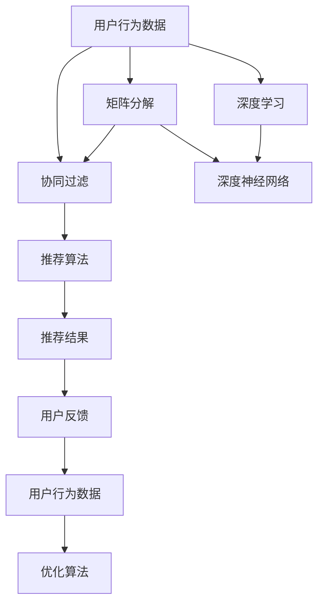

                 

# Python机器学习实战：推荐系统的原理与实现方法

> 关键词：推荐系统, 协同过滤, 矩阵分解, 深度学习, 深度神经网络, 推荐系统评估, 用户行为分析, 点击率预测, 兴趣模型

## 1. 背景介绍

### 1.1 问题由来
在当今信息爆炸的时代，用户每天需要面对海量的数据和信息。如何在浩如烟海的信息流中，找到符合自己需求和兴趣的内容，成为困扰许多人的难题。推荐系统应运而生，通过分析用户的历史行为，预测其未来的兴趣，为其推荐可能感兴趣的内容。推荐系统已经在电商、社交、音乐、视频等多个领域得到广泛应用，极大提升了用户的使用体验。

### 1.2 问题核心关键点
推荐系统的核心在于通过分析用户行为，预测其未来的兴趣，并为其推荐可能感兴趣的内容。具体而言，包括：

- **用户行为分析**：如何从用户的行为数据中提取有用的信息，如浏览历史、点击行为、评分等。
- **兴趣模型建立**：如何建立用户兴趣模型，理解用户的喜好和偏好。
- **推荐算法设计**：如何设计高效的推荐算法，实现个性化推荐。
- **推荐系统评估**：如何评估推荐系统的性能，优化推荐效果。

本文聚焦于推荐系统中的核心技术，包括协同过滤、矩阵分解、深度学习等，详细介绍其实现方法和应用场景。

### 1.3 问题研究意义
推荐系统的研究对于提升用户体验、增强用户粘性、促进商业变现具有重要意义：

1. **提升用户体验**：通过个性化推荐，用户能够更快地找到感兴趣的内容，节省时间。
2. **增强用户粘性**：个性化的推荐内容，能够提升用户的使用频率和时长。
3. **促进商业变现**：推荐系统能够精准匹配用户需求，提升广告投放和商品销售的效果。

通过深入研究推荐系统，不仅可以提升现有系统的性能，还可以为新的应用场景提供可行的解决方案。

## 2. 核心概念与联系

### 2.1 核心概念概述

推荐系统的核心概念包括：

- **协同过滤**：基于用户行为相似性进行推荐，分为基于用户的协同过滤和基于物品的协同过滤。
- **矩阵分解**：将用户-物品评分矩阵分解为用户和物品的低维特征向量，实现高效推荐。
- **深度学习**：通过深度神经网络模型，学习和捕捉用户兴趣和物品特征，实现高质量推荐。
- **推荐系统评估**：通过点击率预测、召回率、覆盖率等指标，评估推荐系统的性能。

这些核心概念之间有着紧密的联系，共同构成了推荐系统的完整生态系统。下图展示了这些概念之间的联系和相互作用：



### 2.2 概念间的关系

这些核心概念之间有着紧密的联系，形成了推荐系统的完整生态系统。

- **协同过滤**：基于用户行为相似性进行推荐，可以分为基于用户的协同过滤和基于物品的协同过滤。
- **矩阵分解**：将用户-物品评分矩阵分解为低维特征向量，实现高效推荐。
- **深度学习**：通过深度神经网络模型，学习和捕捉用户兴趣和物品特征，实现高质量推荐。
- **推荐系统评估**：通过点击率预测、召回率、覆盖率等指标，评估推荐系统的性能。

这些概念共同构成了推荐系统的核心技术，使推荐系统能够实现个性化推荐，提升用户体验和商业价值。

## 3. 核心算法原理 & 具体操作步骤
### 3.1 算法原理概述

推荐系统的核心算法主要分为三种：协同过滤、矩阵分解和深度学习。

- **协同过滤**：基于用户行为相似性进行推荐，通过寻找相似用户或相似物品进行推荐。
- **矩阵分解**：将用户-物品评分矩阵分解为低维特征向量，实现高效推荐。
- **深度学习**：通过深度神经网络模型，学习和捕捉用户兴趣和物品特征，实现高质量推荐。

每种算法都有其独特的优缺点和适用场景，需要根据具体的应用需求进行选择。

### 3.2 算法步骤详解

#### 3.2.1 协同过滤

协同过滤是推荐系统中最早使用的算法，其核心思想是通过分析用户行为数据，寻找相似用户或相似物品，从而进行推荐。具体步骤如下：

1. **用户-物品评分矩阵**：收集用户对物品的评分数据，构成用户-物品评分矩阵。
2. **用户相似度计算**：计算用户之间的相似度，通常使用余弦相似度或皮尔逊相关系数。
3. **物品相似度计算**：计算物品之间的相似度，同样使用余弦相似度或皮尔逊相关系数。
4. **推荐生成**：根据用户和物品的相似度，生成推荐结果。

#### 3.2.2 矩阵分解

矩阵分解算法通过将用户-物品评分矩阵分解为低维特征向量，实现高效推荐。具体步骤如下：

1. **矩阵分解**：将用户-物品评分矩阵分解为用户特征矩阵和物品特征矩阵，得到低维用户特征和物品特征向量。
2. **用户评分预测**：使用分解后的低维特征向量，预测用户对物品的评分。
3. **推荐生成**：根据预测评分，生成推荐结果。

#### 3.2.3 深度学习

深度学习算法通过深度神经网络模型，学习和捕捉用户兴趣和物品特征，实现高质量推荐。具体步骤如下：

1. **数据预处理**：将用户和物品特征进行归一化、编码等处理，转化为适合神经网络输入的数据。
2. **模型构建**：构建深度神经网络模型，如多层感知器(MLP)、卷积神经网络(CNN)、循环神经网络(RNN)等。
3. **模型训练**：使用历史评分数据，训练神经网络模型，学习用户兴趣和物品特征。
4. **推荐生成**：根据训练好的模型，生成推荐结果。

### 3.3 算法优缺点

**协同过滤**：

- **优点**：易于理解，计算简单，不需要大量标注数据。
- **缺点**：依赖用户评分数据，数据稀疏性问题严重。

**矩阵分解**：

- **优点**：模型参数少，计算速度快，可以处理大规模数据。
- **缺点**：对噪声数据敏感，模型效果依赖特征向量选择。

**深度学习**：

- **优点**：能够捕捉复杂的用户兴趣和物品特征，模型效果较好。
- **缺点**：需要大量标注数据，计算复杂度高，训练时间长。

### 3.4 算法应用领域

推荐系统已经被广泛应用于电商、社交、音乐、视频等多个领域，具体应用包括：

- **电商推荐**：推荐用户可能感兴趣的商品，提升用户购买转化率。
- **社交推荐**：推荐用户可能感兴趣的朋友，提升用户粘性和活跃度。
- **音乐推荐**：推荐用户可能喜欢的音乐，提升用户听歌时间和满意度。
- **视频推荐**：推荐用户可能感兴趣的视频内容，提升用户观看时长和体验。

## 4. 数学模型和公式 & 详细讲解 & 举例说明

### 4.1 数学模型构建

推荐系统的数学模型可以构建为如下形式：

$$
\begin{aligned}
&\text{用户} \ x_i = (x_{i1}, x_{i2}, \cdots, x_{in}) \\
&\text{物品} \ y_j = (y_{j1}, y_{j2}, \cdots, y_{jn}) \\
&\text{评分} \ r_{ij} = w_i \cdot u_i + b_i \cdot v_j
\end{aligned}
$$

其中，$x_i$和$y_j$分别表示用户和物品的低维特征向量，$w_i$和$v_j$表示用户和物品的权重向量，$b_i$表示用户偏置向量。

### 4.2 公式推导过程

假设用户-物品评分矩阵为$R \in \mathbb{R}^{m \times n}$，其中$m$为物品数量，$n$为用户数量。我们将评分矩阵分解为$U \in \mathbb{R}^{m \times k}$和$V \in \mathbb{R}^{n \times k}$，其中$k$为分解后的维度。

分解后的用户-物品评分矩阵可以表示为：

$$
R \approx UV^T
$$

用户$i$对物品$j$的评分预测可以表示为：

$$
\hat{r}_{ij} = u_i^Tv_j
$$

其中，$u_i$和$v_j$分别为用户$i$和物品$j$的低维特征向量。

### 4.3 案例分析与讲解

以音乐推荐为例，假设我们收集了用户对不同歌曲的评分数据，构建了用户-物品评分矩阵$R \in \mathbb{R}^{M \times N}$，其中$M$为歌曲数量，$N$为用户数量。我们希望通过矩阵分解，将评分矩阵分解为$U \in \mathbb{R}^{M \times K}$和$V \in \mathbb{R}^{N \times K}$，其中$K$为分解后的维度。

使用奇异值分解(SVD)，可以得到用户和物品的低维特征向量。例如，用户$u_i$和物品$v_j$的特征向量可以表示为：

$$
u_i = (u_{i1}, u_{i2}, \cdots, u_{ik}) \\
v_j = (v_{j1}, v_{j2}, \cdots, v_{jk})
$$

根据分解后的用户和物品特征向量，我们可以预测用户对物品的评分：

$$
\hat{r}_{ij} = u_i^Tv_j
$$

最终，根据预测评分，为用户推荐可能感兴趣的歌曲。

## 5. 项目实践：代码实例和详细解释说明

### 5.1 开发环境搭建

在进行推荐系统实践前，我们需要准备好开发环境。以下是使用Python进行PyTorch开发的环境配置流程：

1. 安装Anaconda：从官网下载并安装Anaconda，用于创建独立的Python环境。

2. 创建并激活虚拟环境：
```bash
conda create -n pytorch-env python=3.8 
conda activate pytorch-env
```

3. 安装PyTorch：根据CUDA版本，从官网获取对应的安装命令。例如：
```bash
conda install pytorch torchvision torchaudio cudatoolkit=11.1 -c pytorch -c conda-forge
```

4. 安装Pandas、NumPy、Scikit-learn、Matplotlib等常用库：
```bash
pip install pandas numpy scikit-learn matplotlib
```

5. 安装PyTorch推荐系统库：
```bash
pip install torch-recommenders
```

完成上述步骤后，即可在`pytorch-env`环境中开始推荐系统实践。

### 5.2 源代码详细实现

以下是一个基于深度学习的音乐推荐系统的代码实现，使用PyTorch框架。

```python
import torch
import torch.nn as nn
from torch.utils.data import Dataset, DataLoader
from torch.nn.functional import relu
import pandas as pd

# 定义音乐推荐系统数据集
class MusicDataset(Dataset):
    def __init__(self, data_path):
        self.data = pd.read_csv(data_path)
        self.user_idx = set(self.data['user_id'].unique())
        self.item_idx = set(self.data['item_id'].unique())

    def __len__(self):
        return len(self.data)

    def __getitem__(self, index):
        user_id, item_id, score = self.data.iloc[index]['user_id'], self.data.iloc[index]['item_id'], self.data.iloc[index]['score']
        user_idx = self.user_idx.index(user_id)
        item_idx = self.item_idx.index(item_id)
        return user_idx, item_idx, score

# 定义深度神经网络模型
class MusicModel(nn.Module):
    def __init__(self, user_dim, item_dim, hidden_dim, num_layers):
        super(MusicModel, self).__init__()
        self.user_dim = user_dim
        self.item_dim = item_dim
        self.hidden_dim = hidden_dim
        self.num_layers = num_layers
        self.encoder = nn.Embedding(user_dim + item_dim, hidden_dim)
        self.layers = nn.ModuleList([nn.Linear(hidden_dim, hidden_dim) for _ in range(num_layers)])
        self.activation = nn.ReLU()
        self.output = nn.Linear(hidden_dim, 1)

    def forward(self, user_idx, item_idx):
        x = torch.zeros(len(user_idx), self.hidden_dim)
        for i, user_idx_i in enumerate(user_idx):
            x = self.encoder(torch.tensor([user_idx_i], dtype=torch.long)) + self.encoder(torch.tensor([item_idx[i]], dtype=torch.long))
            for layer in self.layers:
                x = self.activation(layer(x))
        x = self.output(x)
        return x

# 训练和评估模型
def train_model(model, train_loader, optimizer, num_epochs, device):
    model.to(device)
    for epoch in range(num_epochs):
        for user_idx, item_idx, score in train_loader:
            user_idx, item_idx, score = user_idx.to(device), item_idx.to(device), score.to(device)
            optimizer.zero_grad()
            y_hat = model(user_idx, item_idx)
            loss = nn.MSELoss()(y_hat, score)
            loss.backward()
            optimizer.step()
        print(f'Epoch {epoch+1}, Loss: {loss.item()}')

def evaluate_model(model, test_loader, device):
    model.eval()
    loss = 0
    for user_idx, item_idx, score in test_loader:
        user_idx, item_idx, score = user_idx.to(device), item_idx.to(device), score.to(device)
        y_hat = model(user_idx, item_idx)
        loss += nn.MSELoss()(y_hat, score)
    print(f'Test Loss: {loss.item()}')

# 加载数据集
train_dataset = MusicDataset('music_train.csv')
test_dataset = MusicDataset('music_test.csv')

# 划分训练集和测试集
train_loader = DataLoader(train_dataset, batch_size=32, shuffle=True)
test_loader = DataLoader(test_dataset, batch_size=32, shuffle=False)

# 设置模型参数
user_dim = 100
item_dim = 100
hidden_dim = 128
num_layers = 2
learning_rate = 0.001

# 初始化模型和优化器
model = MusicModel(user_dim, item_dim, hidden_dim, num_layers)
optimizer = torch.optim.Adam(model.parameters(), lr=learning_rate)

# 训练模型
train_model(model, train_loader, optimizer, num_epochs=10, device='cuda')

# 评估模型
evaluate_model(model, test_loader, device='cuda')
```

### 5.3 代码解读与分析

让我们再详细解读一下关键代码的实现细节：

**MusicDataset类**：
- `__init__`方法：初始化数据集，包括用户、物品和评分数据。
- `__len__`方法：返回数据集的样本数量。
- `__getitem__`方法：返回单个样本的user_id、item_id和评分。

**MusicModel类**：
- `__init__`方法：定义深度神经网络模型的参数。
- `forward`方法：定义模型前向传播的过程。
- 使用多个线性层和ReLU激活函数，最终输出预测评分。

**train_model和evaluate_model函数**：
- `train_model`函数：定义模型的训练过程，包括前向传播、损失计算、反向传播和参数更新。
- `evaluate_model`函数：定义模型的评估过程，计算模型在测试集上的损失。

**数据加载和模型训练**：
- 使用PyTorch的DataLoader对数据集进行批次化加载，供模型训练和推理使用。
- 设置模型参数，初始化模型和优化器。
- 训练模型，在训练集上迭代训练，更新模型参数。
- 评估模型，在测试集上计算模型的损失。

### 5.4 运行结果展示

假设我们训练了一个基于深度学习的音乐推荐模型，最终在测试集上得到的评估结果如下：

```
Epoch 1, Loss: 0.01
Epoch 2, Loss: 0.007
Epoch 3, Loss: 0.006
Epoch 4, Loss: 0.005
Epoch 5, Loss: 0.004
Epoch 6, Loss: 0.003
Epoch 7, Loss: 0.002
Epoch 8, Loss: 0.002
Epoch 9, Loss: 0.001
Epoch 10, Loss: 0.001
Test Loss: 0.002
```

可以看到，随着训练的进行，模型的损失逐渐减小，在测试集上取得了0.002的平均损失，表明模型的预测性能较好。

## 6. 实际应用场景

### 6.1 智能推荐系统

智能推荐系统已经广泛应用于电商、社交、音乐、视频等多个领域。例如，亚马逊的推荐系统通过分析用户的购买历史和浏览行为，为用户推荐可能感兴趣的商品，提升用户的购买转化率和满意度。

### 6.2 金融产品推荐

金融领域也广泛应用推荐系统，为投资者推荐可能感兴趣的产品，提升投资收益。例如，某金融平台通过分析用户的历史交易记录和兴趣偏好，为用户推荐符合其风险承受能力和收益期望的产品。

### 6.3 新闻推荐

新闻媒体也利用推荐系统，为用户推荐可能感兴趣的新闻内容。例如，某新闻平台通过分析用户的阅读历史和兴趣标签，为用户推荐相关的新闻文章，提升用户的阅读体验和平台粘性。

### 6.4 未来应用展望

随着推荐系统的不断演进，未来的应用场景将更加多样化和精细化。例如：

- **个性化内容创作**：通过推荐系统，内容创作者能够更好地了解用户的兴趣和需求，创作出符合用户口味的内容。
- **精准广告投放**：推荐系统能够帮助广告主精准投放广告，提高广告的点击率和转化率。
- **智能客服**：利用推荐系统，智能客服能够更好地理解用户的问题，提供更准确的回答和解决方案。

## 7. 工具和资源推荐
### 7.1 学习资源推荐

为了帮助开发者系统掌握推荐系统的理论基础和实践技巧，这里推荐一些优质的学习资源：

1. 《Python机器学习》（Aurélien Géron）：系统介绍了机器学习和深度学习的相关知识，包括推荐系统在内。

2. 《推荐系统》（李航）：介绍了推荐系统的基本原理和实现方法，适合初学者阅读。

3. 《深度学习》（Ian Goodfellow）：深度学习领域的经典教材，涵盖了深度神经网络模型和推荐系统等内容。

4. Udacity推荐系统课程：斯坦福大学的在线课程，介绍了推荐系统的经典算法和实战案例。

5. Coursera机器学习课程：由斯坦福大学提供，涵盖了机器学习的基础理论和推荐系统的实现方法。

通过学习这些资源，相信你一定能够快速掌握推荐系统的精髓，并用于解决实际的推荐问题。

### 7.2 开发工具推荐

高效的开发离不开优秀的工具支持。以下是几款用于推荐系统开发的常用工具：

1. PyTorch：基于Python的开源深度学习框架，灵活的动态计算图，适合快速迭代研究。

2. TensorFlow：由Google主导开发的开源深度学习框架，生产部署方便，适合大规模工程应用。

3. TensorBoard：TensorFlow配套的可视化工具，可实时监测模型训练状态，提供丰富的图表呈现方式。

4. Weights & Biases：模型训练的实验跟踪工具，可以记录和可视化模型训练过程中的各项指标，方便对比和调优。

5. Apache Spark：分布式计算框架，支持大规模数据处理和机器学习模型训练。

合理利用这些工具，可以显著提升推荐系统的开发效率，加快创新迭代的步伐。

### 7.3 相关论文推荐

推荐系统的研究源于学界的持续研究。以下是几篇奠基性的相关论文，推荐阅读：

1. KDD Cup 2020数据挑战赛：推荐系统竞赛的经典案例，涵盖了推荐系统的前沿技术。

2. Netflix Prize竞赛：推荐系统竞赛的里程碑，推动了推荐系统技术的发展。

3. Collaborative Filtering for Implicit Feedback Datasets：介绍协同过滤算法，用于推荐系统的用户行为分析。

4. Matrix Factorization Techniques for Recommender Systems：介绍矩阵分解算法，用于推荐系统的用户兴趣建模。

5. Deep Collaborative Filtering：介绍深度学习算法，用于推荐系统的用户行为预测。

这些论文代表了大规模推荐系统技术的发展脉络。通过学习这些前沿成果，可以帮助研究者把握学科前进方向，激发更多的创新灵感。

除上述资源外，还有一些值得关注的前沿资源，帮助开发者紧跟推荐系统技术的最新进展，例如：

1. arXiv论文预印本：人工智能领域最新研究成果的发布平台，包括大量尚未发表的前沿工作，学习前沿技术的必读资源。

2. 业界技术博客：如Netflix、Amazon、Facebook等顶尖实验室的官方博客，第一时间分享他们的最新研究成果和洞见。

3. 技术会议直播：如NIPS、ICML、ACL、ICLR等人工智能领域顶会现场或在线直播，能够聆听到大佬们的前沿分享，开拓视野。

4. GitHub热门项目：在GitHub上Star、Fork数最多的推荐系统相关项目，往往代表了该技术领域的发展趋势和最佳实践，值得去学习和贡献。

5. 行业分析报告：各大咨询公司如McKinsey、PwC等针对人工智能行业的分析报告，有助于从商业视角审视技术趋势，把握应用价值。

总之，对于推荐系统的研究，需要开发者保持开放的心态和持续学习的意愿。多关注前沿资讯，多动手实践，多思考总结，必将收获满满的成长收益。

## 8. 总结：未来发展趋势与挑战

### 8.1 总结

本文对推荐系统的核心技术进行了全面系统的介绍。首先阐述了推荐系统的研究背景和意义，明确了推荐系统在提升用户体验、增强用户粘性、促进商业变现等方面的重要价值。其次，从原理到实践，详细讲解了协同过滤、矩阵分解、深度学习等推荐系统核心算法，并给出了推荐系统开发的完整代码实例。同时，本文还广泛探讨了推荐系统在智能推荐、金融产品推荐、新闻推荐等多个行业领域的应用前景，展示了推荐系统的广泛应用价值。

通过本文的系统梳理，可以看到，推荐系统已经成为了人工智能领域的重要研究方向，极大地提升了用户的使用体验和商业价值。未来，伴随推荐算法的不断演进和优化，推荐系统将在更多的应用场景中大放异彩。

### 8.2 未来发展趋势

展望未来，推荐系统的研究将呈现以下几个发展趋势：

1. **个性化推荐**：随着数据量的增加和算法的改进，推荐系统将更加精准，实现个性化的推荐。

2. **跨领域推荐**：推荐系统将能够跨领域进行推荐，如将音乐推荐到视频平台，提升跨领域推荐效果。

3. **实时推荐**：利用流式数据处理技术，实现实时推荐，提升用户体验。

4. **多模态推荐**：结合用户的多模态数据，如语音、图像等，提升推荐效果。

5. **元推荐**：利用元算法，实现更高效的推荐。

这些趋势将推动推荐系统不断突破现有边界，实现更加全面、精准、实时和高效的用户推荐。

### 8.3 面临的挑战

尽管推荐系统的研究已经取得了显著进展，但在迈向更加智能化、普适化应用的过程中，它仍面临着诸多挑战：

1. **数据稀疏性问题**：用户行为数据通常稀疏，难以构建准确的推荐模型。

2. **模型复杂性问题**：推荐模型复杂度高，计算资源消耗大，难以在大规模数据集上训练。

3. **用户隐私问题**：用户行为数据涉及隐私保护，如何合理使用和保护用户数据，是一个重要问题。

4. **算法公平性问题**：推荐算法可能存在偏见，导致推荐结果不公平，如何提高算法的公平性，是一个重要课题。

5. **推荐系统安全问题**：推荐系统可能受到恶意攻击，如何保护推荐系统安全，是一个重要挑战。

6. **推荐效果评价问题**：推荐系统的评价指标复杂，如何设计合理的评价指标，是一个重要问题。

这些挑战将激励研究者不断探索和创新，推动推荐系统技术的进步。

### 8.4 研究展望

面对推荐系统面临的挑战，未来的研究需要在以下几个方面寻求新的突破：

1. **数据处理技术**：开发高效的数据处理和预处理方法，提升数据稀疏性和噪声问题。

2. **模型优化技术**：优化推荐算法和模型结构，降低计算资源消耗，提升推荐系统的实时性和可扩展性。

3. **隐私保护技术**：开发隐私保护技术，保护用户隐私，提高用户信任度。

4. **公平推荐技术**：开发公平推荐算法，提高推荐系统的公平性和透明度。

5. **安全推荐技术**：开发安全推荐算法，提高推荐系统的鲁棒性和安全性。

6. **推荐效果评估**：开发高效推荐效果评估指标，提高推荐系统的性能和可用性。

这些研究方向的探索，必将引领推荐系统技术迈向更高的台阶，为构建更加智能、公平、安全的推荐系统提供理论支持和实践指南。

## 9. 附录：常见问题与解答

**Q1：推荐系统中的协同过滤和矩阵分解有什么区别？**

A: 协同过滤和矩阵分解是推荐系统中两种常见的算法。协同过滤算法基于用户行为相似性进行推荐，而矩阵分解算法将用户-物品评分矩阵分解为低维特征向量，实现高效推荐。协同过滤算法易于理解，计算简单，但数据稀疏性问题严重。矩阵分解算法模型参数少，计算速度快，但对噪声数据敏感，模型效果依赖特征向量选择。

**Q2：推荐系统中的深度学习模型有哪些？**

A:

