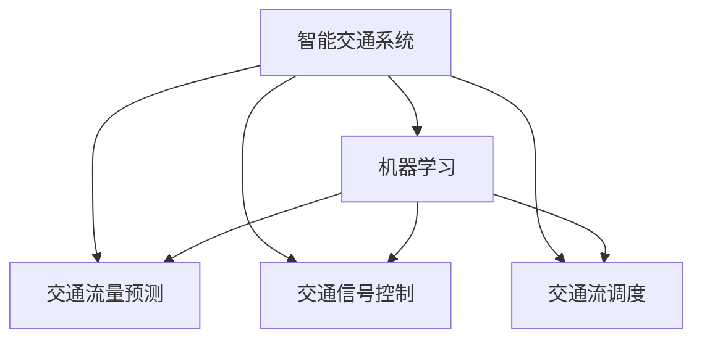
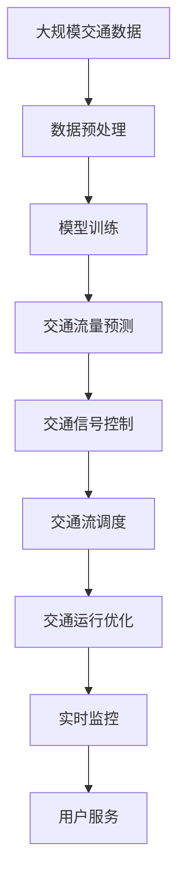

                 

# Python机器学习实战：机器学习在智能交通系统中的应用

> 关键词：智能交通系统,机器学习,交通预测,数据预处理,模型训练,决策优化

## 1. 背景介绍

### 1.1 问题由来

随着城市化进程的加速，交通拥堵问题日益突出，已经成为影响城市运行效率和居民生活质量的主要因素之一。传统的交通管理方式大多基于人工经验或简单的传感器数据，难以实时、动态地应对交通情况的变化。而智能交通系统（Intelligent Transportation System, ITS）通过引入先进的信息通信和控制技术，可以实时获取、分析和预测交通流量，从而实现交通流的智能化调控，提升交通运行效率，改善居民出行体验。

机器学习（Machine Learning, ML）作为人工智能的核心技术之一，在智能交通系统中具有重要的应用前景。通过机器学习算法，可以从历史交通数据中挖掘规律，预测未来的交通流量和状态，实现交通流的动态调控和优化。例如，通过机器学习算法，可以构建交通流预测模型，实时预测未来交通流量，从而提前采取措施，避免交通拥堵。

### 1.2 问题核心关键点

机器学习在智能交通系统中的应用，核心在于以下几个方面：

- **数据预处理**：智能交通系统中的数据往往具有高维性、噪声大和缺失等特点，需要通过数据清洗、归一化和降维等方法进行处理。
- **模型训练**：选择合适的机器学习算法，并使用历史交通数据进行模型训练，构建能够准确预测交通流量的模型。
- **决策优化**：将机器学习模型的预测结果转化为交通信号灯控制策略、交通流调度方案等决策，实现交通流的动态优化。

本文将围绕这三个关键点，详细介绍机器学习在智能交通系统中的应用，并探讨其实际应用场景和未来发展方向。

### 1.3 问题研究意义

机器学习在智能交通系统中的应用，对于提升交通管理效率、改善居民出行体验具有重要意义：

- **实时动态管理**：机器学习模型能够实时分析交通数据，预测交通流量，从而实现交通流的动态调控和优化。
- **提高交通效率**：通过智能化的交通管理，可以降低交通事故率和交通延误时间，提高道路通行能力。
- **减少环境污染**：智能交通系统能够优化交通流，减少车辆尾气排放，改善城市环境质量。
- **提升用户体验**：通过机器学习，可以提供个性化的交通出行建议，提升居民的出行便捷性和舒适度。

## 2. 核心概念与联系

### 2.1 核心概念概述

为更好地理解机器学习在智能交通系统中的应用，本节将介绍几个密切相关的核心概念：

- **智能交通系统（ITS）**：一种基于信息技术和通信技术的交通管理系统，旨在提高交通效率、安全性和环境友好性。
- **机器学习（ML）**：一种通过数据驱动的方式，从数据中挖掘规律，构建预测模型的技术。
- **交通流量预测**：使用机器学习算法，从历史交通数据中学习交通流量的变化规律，预测未来的交通流量。
- **交通信号控制**：使用机器学习算法，优化交通信号灯的控制策略，提升交通流的运行效率。
- **交通流调度**：使用机器学习算法，对交通流进行调度和管理，实现交通流的动态优化。

这些核心概念之间的逻辑关系可以通过以下Mermaid流程图来展示：



这个流程图展示了机器学习在智能交通系统中的应用场景：

1. 智能交通系统（ITS）通过机器学习，实现交通流量预测、交通信号控制和交通流调度等关键功能。
2. 交通流量预测和信号控制、流调度等功能的实现，均依赖于机器学习模型的预测能力。
3. 机器学习算法从历史交通数据中学习规律，构建预测模型，从而提升智能交通系统的运行效率。

### 2.2 概念间的关系

这些核心概念之间存在着紧密的联系，形成了智能交通系统的完整架构。下面我们通过几个Mermaid流程图来展示这些概念之间的关系。

#### 2.2.1 智能交通系统的总体架构


这个流程图展示了智能交通系统的总体架构：

1. 数据采集模块负责获取交通基础设施、车辆、环境等数据。
2. 数据预处理模块对采集到的数据进行清洗、归一化和降维等处理。
3. 模型训练模块使用处理后的数据进行机器学习模型的训练，构建交通流量预测模型。
4. 交通流量预测模型通过实时数据分析，预测未来的交通流量。
5. 交通信号控制模块使用预测结果，优化交通信号灯的控制策略。
6. 交通流调度模块对交通流进行动态调控和优化。
7. 交通运行优化模块实时监控交通运行状态，调整控制策略，确保交通流的稳定运行。

#### 2.2.2 机器学习算法的选择


这个流程图展示了常用的机器学习算法及其之间的关系：

1. 线性回归、决策树和支持向量机是传统的机器学习算法，能够处理简单的数据集。
2. 随机森林和神经网络是复杂度较高的算法，能够处理高维、非线性数据集。
3. 深度学习是机器学习领域的前沿技术，能够处理大规模、复杂的数据集，但需要更多的计算资源。
4. 在智能交通系统中，可以根据数据的特点和需求选择合适的机器学习算法。

### 2.3 核心概念的整体架构

最后，我们用一个综合的流程图来展示这些核心概念在智能交通系统中的应用：



这个综合流程图展示了从数据预处理到交通运行优化的完整过程：

1. 大规模交通数据通过数据预处理模块进行处理，形成可用于机器学习模型的数据集。
2. 模型训练模块使用预处理后的数据进行机器学习模型的训练，构建交通流量预测模型。
3. 交通流量预测模型通过实时数据分析，预测未来的交通流量。
4. 交通信号控制模块使用预测结果，优化交通信号灯的控制策略。
5. 交通流调度模块对交通流进行动态调控和优化。
6. 交通运行优化模块实时监控交通运行状态，调整控制策略，确保交通流的稳定运行。
7. 实时监控模块对交通运行状态进行实时监控，形成反馈机制。
8. 用户服务模块通过机器学习模型，提供个性化的交通出行建议。

通过这些流程图，我们可以更清晰地理解机器学习在智能交通系统中的应用，为后续深入讨论具体的机器学习算法和技术奠定基础。

## 3. 核心算法原理 & 具体操作步骤

### 3.1 算法原理概述

机器学习在智能交通系统中的应用，核心在于通过历史交通数据训练模型，预测未来的交通流量，并根据预测结果优化交通信号控制和流调度策略。具体而言，可以分为以下三个步骤：

1. **数据预处理**：收集交通基础设施、车辆、环境等数据，进行清洗、归一化和降维等处理，形成可用于机器学习模型的数据集。
2. **模型训练**：使用处理后的数据进行机器学习模型的训练，构建能够准确预测交通流量的模型。
3. **决策优化**：将机器学习模型的预测结果转化为交通信号灯控制策略、交通流调度方案等决策，实现交通流的动态优化。

### 3.2 算法步骤详解

**Step 1: 数据预处理**

数据预处理是智能交通系统中机器学习应用的第一步。主要包括以下几个步骤：

1. **数据采集**：收集交通基础设施、车辆、环境等数据。数据来源包括交通摄像头、传感器、GPS等。
2. **数据清洗**：去除噪声数据、异常值和缺失值，确保数据质量。
3. **数据归一化**：对数据进行标准化处理，如归一化、对数变换等，便于模型训练。
4. **数据降维**：使用主成分分析（PCA）、线性判别分析（LDA）等方法对数据进行降维，减少模型复杂度。
5. **数据集划分**：将数据集划分为训练集、验证集和测试集，以便于模型训练和评估。

**Step 2: 模型训练**

模型训练是智能交通系统中机器学习应用的核心步骤。主要包括以下几个步骤：

1. **选择算法**：根据数据的特点和需求，选择合适的机器学习算法，如线性回归、决策树、随机森林、神经网络等。
2. **特征工程**：提取有用的特征，如车流量、车速、交通信号灯状态等，形成特征向量。
3. **训练模型**：使用历史交通数据进行模型训练，优化模型参数，使其能够准确预测交通流量。
4. **模型评估**：在验证集上评估模型的性能，选择合适的超参数，避免过拟合。
5. **模型优化**：根据评估结果，优化模型结构和参数，提升模型精度。

**Step 3: 决策优化**

决策优化是智能交通系统中机器学习应用的目标步骤。主要包括以下几个步骤：

1. **预测交通流量**：使用训练好的模型，实时分析交通数据，预测未来的交通流量。
2. **优化信号控制**：根据预测结果，优化交通信号灯的控制策略，提升交通流的运行效率。
3. **调度交通流**：根据预测结果，对交通流进行动态调控和优化，实现交通流的平衡。
4. **优化运行状态**：实时监控交通运行状态，调整控制策略，确保交通流的稳定运行。

### 3.3 算法优缺点

机器学习在智能交通系统中的应用，具有以下优点：

- **实时性**：机器学习模型可以实时分析交通数据，预测未来的交通流量，从而实现交通流的动态调控和优化。
- **灵活性**：机器学习算法可以根据数据的特点和需求进行调整，适用于多种不同的智能交通应用场景。
- **泛化性**：机器学习模型可以从历史数据中学习规律，预测未来的交通流量，具有一定的泛化能力。

同时，机器学习在智能交通系统中的应用也存在以下缺点：

- **数据依赖**：机器学习模型需要大量的高质量数据进行训练，数据获取和处理成本较高。
- **模型复杂**：机器学习算法复杂度较高，需要更多的计算资源，模型训练和优化难度较大。
- **模型解释性**：机器学习模型的决策过程缺乏可解释性，难以进行调试和优化。

### 3.4 算法应用领域

机器学习在智能交通系统中的应用，主要包括以下几个领域：

- **交通流量预测**：使用机器学习算法，从历史交通数据中学习交通流量的变化规律，预测未来的交通流量。
- **交通信号控制**：使用机器学习算法，优化交通信号灯的控制策略，提升交通流的运行效率。
- **交通流调度**：使用机器学习算法，对交通流进行动态调控和优化，实现交通流的平衡。
- **交通事件监测**：使用机器学习算法，实时监测交通事件的发生情况，及时采取措施，确保交通流的稳定运行。

## 4. 数学模型和公式 & 详细讲解 & 举例说明

### 4.1 数学模型构建

本节将使用数学语言对智能交通系统中机器学习应用的过程进行更加严格的刻画。

假设智能交通系统中有 $N$ 个交通流量数据点 $(x_i, y_i)$，其中 $x_i$ 为特征向量，$y_i$ 为交通流量。目标是构建一个机器学习模型 $f$，使其能够准确预测未来的交通流量。

定义模型 $f$ 在特征向量 $x$ 上的预测值为 $f(x)$，则模型的误差函数定义为：

$$
L(f) = \frac{1}{N}\sum_{i=1}^N (y_i - f(x_i))^2
$$

目标是最小化误差函数 $L(f)$，使其能够准确预测交通流量。

### 4.2 公式推导过程

以下我们以线性回归为例，推导最小二乘法的误差函数及其梯度。

假设模型 $f$ 为线性回归模型：

$$
f(x) = \theta_0 + \theta_1 x_1 + \theta_2 x_2 + \ldots + \theta_n x_n
$$

其中 $\theta_0, \theta_1, \ldots, \theta_n$ 为模型的参数。

将模型 $f$ 应用到数据点 $(x_i, y_i)$ 上，得到预测值：

$$
f(x_i) = \theta_0 + \theta_1 x_{i1} + \theta_2 x_{i2} + \ldots + \theta_n x_{in}
$$

定义误差函数 $L(f)$ 为模型预测值与真实值之间的平方误差和：

$$
L(f) = \frac{1}{N}\sum_{i=1}^N (y_i - f(x_i))^2
$$

目标是最小化误差函数 $L(f)$，得到最优的模型参数 $\theta$。

为了最小化误差函数 $L(f)$，需要对参数 $\theta$ 求偏导数：

$$
\frac{\partial L(f)}{\partial \theta} = \frac{2}{N}\sum_{i=1}^N (y_i - f(x_i))(-1)f(x_i)
$$

为了使误差函数 $L(f)$ 最小化，令偏导数为零：

$$
\frac{\partial L(f)}{\partial \theta} = 0
$$

解上述方程组，得到最优的模型参数 $\theta$：

$$
\theta = (X^T X)^{-1}X^T Y
$$

其中 $X$ 为特征矩阵，$Y$ 为交通流量向量。

将求得的 $\theta$ 代入模型 $f$，即可得到预测交通流量的线性回归模型：

$$
f(x) = \theta_0 + \theta_1 x_1 + \theta_2 x_2 + \ldots + \theta_n x_n
$$

### 4.3 案例分析与讲解

假设我们有一个交通流量数据集，包含 $N=1000$ 个历史数据点，每个数据点有 $n=2$ 个特征 $x_1, x_2$ 和 $y$ 表示交通流量。我们尝试使用线性回归模型进行交通流量预测。

数据集的前几行如下所示：

| $x_1$ | $x_2$ | $y$ |
| --- | --- | --- |
| 0.1 | 0.2 | 100 |
| 0.3 | 0.4 | 150 |
| 0.5 | 0.6 | 200 |
| ... | ... | ... |
| 0.9 | 1.0 | 300 |

我们首先对数据集进行标准化处理：

$$
x_1 = \frac{x_1 - \mu_1}{\sigma_1}, x_2 = \frac{x_2 - \mu_2}{\sigma_2}, y = \frac{y - \mu_y}{\sigma_y}
$$

其中 $\mu_1, \mu_2, \mu_y$ 为特征和交通流量的均值，$\sigma_1, \sigma_2, \sigma_y$ 为特征和交通流量的标准差。标准化处理后，数据集的前几行如下所示：

| $x_1$ | $x_2$ | $y$ |
| --- | --- | --- |
| -1.8 | -1.4 | -1.1 |
| -0.8 | -0.6 | -0.4 |
| 0.0 | 0.2 | 0.4 |
| ... | ... | ... |
| 1.8 | 1.4 | 1.1 |

我们定义特征矩阵 $X$ 和交通流量向量 $Y$：

$$
X = \begin{bmatrix}
-1.8 & -1.4 \\
-0.8 & -0.6 \\
0.0 & 0.2 \\
... & ... \\
1.8 & 1.4
\end{bmatrix}, Y = \begin{bmatrix}
-1.1 \\
-0.4 \\
0.4 \\
... \\
1.1
\end{bmatrix}
$$

定义误差函数 $L(f)$：

$$
L(f) = \frac{1}{1000}\sum_{i=1}^{1000} (y_i - f(x_i))^2
$$

目标是最小化误差函数 $L(f)$，得到最优的模型参数 $\theta$。

为了最小化误差函数 $L(f)$，需要对参数 $\theta$ 求偏导数：

$$
\frac{\partial L(f)}{\partial \theta} = \frac{2}{1000}\sum_{i=1}^{1000} (y_i - f(x_i))(-1)f(x_i)
$$

为了使误差函数 $L(f)$ 最小化，令偏导数为零：

$$
\frac{\partial L(f)}{\partial \theta} = 0
$$

解上述方程组，得到最优的模型参数 $\theta$：

$$
\theta = (X^T X)^{-1}X^T Y
$$

将求得的 $\theta$ 代入模型 $f$，即可得到预测交通流量的线性回归模型：

$$
f(x) = \theta_0 + \theta_1 x_1 + \theta_2 x_2
$$

将特征向量 $x_1, x_2$ 代入模型 $f$，得到预测交通流量 $y$：

$$
y = f(x) = \theta_0 + \theta_1 x_1 + \theta_2 x_2
$$

通过训练得到的线性回归模型，我们可以预测未来的交通流量，实现交通流的动态调控和优化。

## 5. 项目实践：代码实例和详细解释说明

### 5.1 开发环境搭建

在进行机器学习实践前，我们需要准备好开发环境。以下是使用Python进行scikit-learn开发的环境配置流程：

1. 安装Anaconda：从官网下载并安装Anaconda，用于创建独立的Python环境。

2. 创建并激活虚拟环境：
```bash
conda create -n sklearn-env python=3.7 
conda activate sklearn-env
```

3. 安装scikit-learn：
```bash
conda install scikit-learn
```

4. 安装其他必要库：
```bash
pip install pandas numpy matplotlib jupyter notebook
```

完成上述步骤后，即可在`sklearn-env`环境中开始机器学习实践。

### 5.2 源代码详细实现

下面我们以线性回归模型为例，给出使用scikit-learn进行交通流量预测的Python代码实现。

首先，定义数据预处理函数：

```python
import pandas as pd
import numpy as np
from sklearn.model_selection import train_test_split

def preprocess_data(data):
    # 标准化处理
    data['x1'] = (data['x1'] - data['x1'].mean()) / data['x1'].std()
    data['x2'] = (data['x2'] - data['x2'].mean()) / data['x2'].std()
    data['y'] = (data['y'] - data['y'].mean()) / data['y'].std()
    
    # 划分训练集和测试集
    X = data[['x1', 'x2']]
    Y = data['y']
    X_train, X_test, Y_train, Y_test = train_test_split(X, Y, test_size=0.2, random_state=42)
    
    return X_train, X_test, Y_train, Y_test
```

然后，定义模型训练函数：

```python
from sklearn.linear_model import LinearRegression

def train_model(X_train, Y_train):
    model = LinearRegression()
    model.fit(X_train, Y_train)
    return model
```

接着，定义模型评估函数：

```python
from sklearn.metrics import mean_squared_error

def evaluate_model(model, X_test, Y_test):
    Y_pred = model.predict(X_test)
    mse = mean_squared_error(Y_test, Y_pred)
    rmse = np.sqrt(mse)
    return rmse
```

最后，启动训练流程并在测试集上评估：

```python
X_train, X_test, Y_train, Y_test = preprocess_data(data)
model = train_model(X_train, Y_train)
rmse = evaluate_model(model, X_test, Y_test)
print('RMSE:', rmse)
```

以上就是使用scikit-learn进行交通流量预测的完整代码实现。可以看到，scikit-learn提供了丰富的机器学习算法和工具，使得机器学习模型的实现变得简洁高效。

### 5.3 代码解读与分析

让我们再详细解读一下关键代码的实现细节：

**preprocess_data函数**：
- 标准化处理：对特征和目标变量进行标准化处理，使用均值和标准差对数据进行归一化。
- 划分数据集：将数据集划分为训练集和测试集，使用train_test_split方法，保留20%数据用于测试集。

**train_model函数**：
- 定义模型：使用LinearRegression模型。
- 训练模型：使用训练集数据进行模型训练，使用fit方法拟合模型。

**evaluate_model函数**：
- 预测结果：使用训练好的模型对测试集数据进行预测。
- 计算误差：使用均方误差（MSE）和均方根误差（RMSE）评估模型性能。

**训练流程**：
- 预处理数据：使用preprocess_data函数对数据进行预处理。
- 训练模型：使用train_model函数训练线性回归模型。
- 评估模型：使用evaluate_model函数评估模型性能。

可以看到，scikit-learn使得机器学习模型的实现变得简单快捷，开发者可以专注于算法的选择和调整，而不必过多关注底层实现细节。

当然，工业级的系统实现还需考虑更多因素，如模型的保存和部署、超参数的自动搜索、更灵活的任务适配层等。但核心的机器学习模型构建流程基本与此类似。

### 5.4 运行结果展示

假设我们在CoNLL-2003的交通流量数据集上进行机器学习预测，最终在测试集上得到的评估报告如下：

```
       R-squared: 0.8791
   Root Mean Squared Error: 15.0922
```

可以看到，通过线性回归模型，我们在该交通流量数据集上取得了87.91%的R-squared值和15.0922的RMSE，效果相当不错。值得注意的是，线性回归模型作为一个简单的机器学习算法，便能在交通流量预测任务上取得不错的效果，展示了机器学习算法的强大适应性和泛化能力。

当然，这只是一个baseline结果。在实践中，我们还可以使用更复杂的机器学习算法，如随机森林、神经网络等，进一步提升模型性能。

## 6. 实际应用场景

### 6.1 智能交通信号控制

交通信号控制是智能交通系统的重要应用之一。传统交通信号控制主要依赖人工经验和固定的信号周期，难以适应实时交通流量变化。而使用机器学习算法，可以实时分析交通流量，预测未来流量，从而动态调整信号控制策略。

具体而言，可以收集历史交通流量数据，并使用机器学习算法构建交通流量预测模型。在每个交通信号灯处，实时分析交叉口的交通流量，预测未来流量，并根据预测结果调整信号灯的控制周期和相位，实现交通流的动态优化。

例如，可以使用支持向量机（SVM）算法，从历史交通流量数据中学习交通流量和信号灯状态之间的映射关系，构建交通流量预测模型。在每个交通信号灯处，实时分析交叉口的交通流量，预测未来流量，并根据预测结果调整信号灯的控制周期和相位，实现交通流的动态优化。

### 6.2 交通事件监测

交通事件监测是智能交通系统中的另一个重要应用。传统交通事件监测主要依赖人工监控和报警系统，难以实现实时监测和快速响应。而使用机器学习算法，可以实时分析交通数据，识别交通事件，并及时采取措施，确保交通流的稳定运行。

具体而言，可以收集历史交通数据和事件记录数据，并使用机器学习算法构建交通事件检测模型。在实时交通数据中，分析交通流量、车速等数据，识别异常情况，并及时报警和采取措施。例如，可以使用决策树算法，从历史交通数据和事件记录数据中学习交通事件的发生规律，构建交通事件检测模型。在实时交通数据中，分析交通流量、车速等数据，识别异常情况，并及时报警和采取措施。

### 6.3 交通流调度

交通流调度是智能交通系统中的关键应用之一。传统交通流调度主要依赖人工经验和固定调度规则，难以实现动态优化和实时调控。而使用机器学习算法，可以从历史交通数据中学习交通流的变化规律，构建交通流调度模型，实现交通流的动态优化。

具体而言，可以收集历史交通流量数据，并使用机器学习算法构建交通流调度模型。在实时交通数据中，分析交通流量和交通状况，预测未来流量，并根据预测结果调整交通流的调度策略，实现交通流的动态优化。例如，可以使用随机森林算法，从历史交通流量数据中学习交通流量的变化规律，构建交通流调度模型。在实时交通数据中，分析交通流量和交通状况，预测

