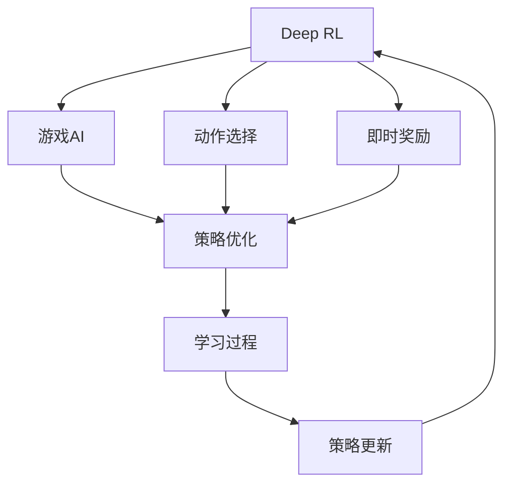
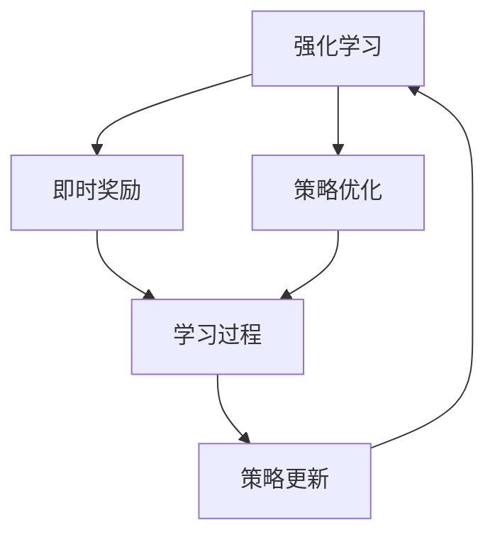

                 

# Python深度学习实践：使用强化学习玩转游戏

> 关键词：强化学习, 游戏AI, Python, 深度学习, 数学模型, 代码实例, 实际应用, 未来展望

## 1. 背景介绍

### 1.1 问题由来
近年来，随着深度学习技术的飞速发展，强化学习在游戏AI领域取得了令人瞩目的成就。强化学习是一种通过与环境互动学习最优策略的机器学习方法，其核心思想是在不确定环境中通过试错探索最优解决方案。在这一领域，AlphaGo、Dota 2 AI、GooseChase AI等经典案例展示了强化学习在策略性游戏中的巨大潜力。

强化学习算法通过构建环境模型和行为策略，不断尝试不同动作，并根据环境反馈调整策略，以实现最大化奖励的目标。在游戏AI中，这通常意味着玩家根据游戏规则和对手行为，选择最优动作以最大化得分。

强化学习在游戏AI中的应用不仅限于直接决策，还可以用于辅助玩家策略优化、智能敌人设计、游戏界面优化等多个层面。其核心思想是通过不断试错，学习到能够在复杂环境中做出最优决策的策略。

### 1.2 问题核心关键点
强化学习的核心在于设计合适的奖励函数和环境模型，以指导智能体在特定环境下探索最优策略。

1. 奖励函数(Reward Function)：定义了智能体在每个时间步的即时奖励，是强化学习中最重要的组件之一。奖励函数的设定直接影响智能体学习的方向和效率。

2. 环境模型(Environment Model)：描述了智能体与环境之间的交互方式，可以是纯模拟环境，也可以是与现实环境交互的动态环境。环境模型的准确性直接影响智能体的学习效果。

3. 策略(Strategy)：指智能体在每个时间步选择动作的策略。常见的策略包括确定性策略、随机策略、Q学习、策略梯度等。

4. 探索与利用(Exploration & Exploitation)：在强化学习中，智能体需要在探索新动作和利用已有动作之间做出平衡。探索可以帮助智能体发现更好的策略，但可能增加学习时间；利用则可以更快达到最优策略，但可能陷入局部最优。

5. 学习效率与稳定性：强化学习算法的学习效率和稳定性也是重要考量点。如何在大规模环境中快速学习最优策略，同时避免陷入局部最优或灾难性遗忘，是实际应用中的关键问题。

### 1.3 问题研究意义
研究强化学习在深度学习游戏AI中的应用，对于拓展AI技术的应用范围，提升游戏的智能化水平，加速AI技术的产业化进程，具有重要意义：

1. 降低开发成本。使用强化学习AI，可以显著减少游戏开发所需的人工干预和测试，降低开发成本。
2. 提升游戏体验。通过AI技术，游戏可以变得更加智能、有趣、富有挑战性，吸引更多玩家。
3. 加速迭代更新。AI技术可以持续学习，适应游戏规则和玩家行为的变化，推动游戏内容不断更新，保持游戏的新鲜感和趣味性。
4. 促进技术创新。强化学习游戏AI带来了全新的游戏设计理念，推动了游戏AI技术的进一步发展。
5. 赋能产业升级。游戏AI技术可以应用于军事、教育、娱乐等多个行业，为传统行业数字化转型升级提供新的技术路径。

## 2. 核心概念与联系

### 2.1 核心概念概述

为更好地理解强化学习在游戏AI中的应用，本节将介绍几个密切相关的核心概念：

- 强化学习(Reinforcement Learning)：通过与环境互动，智能体通过执行动作，接收奖励，并不断调整策略以最大化长期奖励的学习过程。
- Q-learning：一种基于值函数的强化学习算法，通过学习每个状态动作对的Q值，选择最优动作。
- Deep Q-learning：将深度神经网络与Q-learning结合，通过神经网络逼近Q值函数，提高学习效率和泛化能力。
- 策略梯度(SGD)：通过计算策略的梯度，更新策略参数，实现基于策略的强化学习。
- 环境模型(Environment Model)：描述智能体与环境之间的交互方式，可以是纯模拟环境，也可以是与现实环境交互的动态环境。
- 探索与利用(Exploration & Exploitation)：在强化学习中，智能体需要在探索新动作和利用已有动作之间做出平衡。
- 深度强化学习(Deep RL)：结合深度神经网络和强化学习算法，提高学习效率和模型性能。

这些核心概念之间的逻辑关系可以通过以下Mermaid流程图来展示：

```mermaid
graph LR
    A[强化学习] --> B[Q-learning]
    A --> C[Deep Q-learning]
    A --> D[策略梯度(SGD)]
    A --> E[环境模型]
    B --> F[动作选择]
    C --> F
    D --> F
    E --> F
    F --> G[即时奖励]
    G --> H[学习过程]
```

这个流程图展示了几类核心概念之间的关系：

1. 强化学习通过动作选择和即时奖励指导智能体学习。
2. Q-learning、Deep Q-learning和策略梯度是常用的强化学习算法。
3. 环境模型描述智能体与环境之间的交互方式。
4. 即时奖励和学习过程是强化学习的重要组成部分。

### 2.2 概念间的关系

这些核心概念之间存在着紧密的联系，形成了强化学习在游戏AI中的应用框架。下面我通过几个Mermaid流程图来展示这些概念之间的关系。

#### 2.2.1 强化学习的学习范式

```mermaid
graph TB
    A[强化学习] --> B[Q-learning]
    A --> C[Deep Q-learning]
    A --> D[策略梯度(SGD)]
    A --> E[环境模型]
    B --> F[动作选择]
    C --> F
    D --> F
    E --> F
    F --> G[即时奖励]
    G --> H[学习过程]
    H --> I[策略更新]
    I --> A
```

这个流程图展示了强化学习的基本原理，以及其与核心概念的关系：

1. 强化学习通过Q-learning、Deep Q-learning和策略梯度指导智能体学习。
2. 环境模型和即时奖励是强化学习的重要组成部分。
3. 策略更新是强化学习中学习过程的一部分。

#### 2.2.2 深度强化学习的应用场景



这个流程图展示了深度强化学习在游戏AI中的应用场景：

1. 深度强化学习结合了深度神经网络和强化学习算法，提高学习效率和模型性能。
2. 动作选择和即时奖励是深度强化学习的重要组成部分。
3. 策略优化和策略更新是深度强化学习的主要目标。

#### 2.2.3 强化学习的学习目标



这个流程图展示了强化学习的学习目标：

1. 强化学习通过即时奖励和策略优化指导智能体的学习过程。
2. 学习过程和策略更新是强化学习的重要组成部分。

### 2.3 核心概念的整体架构

最后，我们用一个综合的流程图来展示这些核心概念在游戏AI中的整体架构：

```mermaid
graph TB
    A[强化学习] --> B[Q-learning]
    A --> C[Deep Q-learning]
    A --> D[策略梯度(SGD)]
    A --> E[环境模型]
    B --> F[动作选择]
    C --> F
    D --> F
    E --> F
    F --> G[即时奖励]
    G --> H[学习过程]
    H --> I[策略更新]
    I --> A
    I --> J[游戏AI]
    J --> K[即时奖励]
    K --> L[学习过程]
    L --> M[策略更新]
    M --> J
```

这个综合流程图展示了从强化学习到游戏AI的完整过程：

1. 强化学习通过Q-learning、Deep Q-learning和策略梯度指导智能体学习。
2. 环境模型描述智能体与环境之间的交互方式。
3. 即时奖励和学习过程是强化学习的重要组成部分。
4. 策略优化和策略更新是深度强化学习的主要目标。
5. 游戏AI通过强化学习技术，实现智能决策和策略优化。

通过这些流程图，我们可以更清晰地理解强化学习在游戏AI中的应用过程，为后续深入讨论具体的算法实现和实际应用奠定基础。

## 3. 核心算法原理 & 具体操作步骤
### 3.1 算法原理概述

强化学习在游戏AI中的应用，本质上是通过构建环境模型和行为策略，不断尝试不同动作，并根据环境反馈调整策略，以实现最大化奖励的目标。

具体而言，假设智能体 $A$ 在环境 $E$ 中执行动作 $a$，接收即时奖励 $r$，并转移到新状态 $s'$。强化学习的目标是找到一个最优策略 $\pi^*$，使得在每个状态 $s$ 下，选择动作 $a$ 能够最大化期望奖励 $Q^*(s, a)$。

形式化地，假设环境模型为 $P(s'|s, a)$，即时奖励为 $r(s, a)$，则强化学习的目标函数为：

$$
J(\pi) = \mathbb{E}_{s_0 \sim \rho_0} \left[ \sum_{t=0}^{\infty} \gamma^t r(s_t, a_t) \right]
$$

其中 $\rho_0$ 为初始状态分布，$\gamma$ 为折扣因子。

强化学习的核心在于设计合适的奖励函数和环境模型，以指导智能体在特定环境下探索最优策略。常见的算法包括Q-learning、Deep Q-learning、策略梯度等。

### 3.2 算法步骤详解

强化学习在游戏AI中的应用，一般包括以下几个关键步骤：

**Step 1: 准备环境与数据**
- 定义游戏环境，编写状态转移函数和奖励函数。
- 收集游戏数据，如玩家行为、游戏规则、环境状态等。
- 将数据转换为适合强化学习模型处理的格式。

**Step 2: 选择算法与模型**
- 根据任务特点选择适合的强化学习算法，如Q-learning、Deep Q-learning、策略梯度等。
- 设计神经网络模型，如全连接神经网络、卷积神经网络、循环神经网络等。
- 设定网络参数和超参数，如学习率、批大小、隐藏层数等。

**Step 3: 训练模型**
- 使用训练数据进行模型训练，优化网络参数。
- 采用适当的优化算法，如随机梯度下降、Adam等。
- 设定合适的奖励函数，引导模型学习。

**Step 4: 测试与评估**
- 在测试数据上评估模型性能，计算得分、准确率等指标。
- 与人类玩家或基线模型进行对比，评估模型的优劣。
- 不断优化模型，提升其性能。

**Step 5: 部署与应用**
- 将训练好的模型部署到游戏环境中。
- 实时监控模型表现，根据反馈不断调整策略。
- 定期更新模型，适应环境变化。

以上是强化学习在游戏AI中的一般流程。在实际应用中，还需要针对具体游戏规则和策略，对训练过程的各个环节进行优化设计，如改进奖励函数，引入更多的探索技术，搜索最优的超参数组合等，以进一步提升模型性能。

### 3.3 算法优缺点

强化学习在游戏AI中的应用，具有以下优点：

1. 灵活性高。强化学习能够适应各种复杂环境，适用于游戏规则多样、玩家行为难以预测的场景。
2. 自主学习能力。智能体能够在与环境的互动中自主学习最优策略，无需人工干预。
3. 鲁棒性强。智能体能够应对环境变化，适应新的游戏规则和玩家行为。
4. 通用性广。强化学习技术不仅适用于游戏AI，还可以应用于机器人控制、自动驾驶等多个领域。

同时，该方法也存在一定的局限性：

1. 训练时间长。强化学习需要大量数据进行训练，训练时间较长，可能不适用于资源受限的场景。
2. 模型复杂度高。神经网络模型的参数量较大，需要较高的计算资源。
3. 稳定性问题。智能体在探索过程中可能会陷入局部最优，导致学习效率低下。
4. 鲁棒性不足。智能体在面对复杂的实时环境时，可能难以做出最优决策。
5. 可解释性不足。强化学习模型通常缺乏可解释性，难以理解其内部工作机制。

尽管存在这些局限性，但就目前而言，强化学习在游戏AI中的应用仍然是大数据时代AI技术的典型代表，具有广泛的应用前景。未来相关研究的重点在于如何进一步降低训练时间，提高模型的稳定性和可解释性，并与其他AI技术结合，提供更加智能和可靠的游戏体验。

### 3.4 算法应用领域

强化学习在游戏AI中的应用，已经涵盖了诸多领域，包括但不限于：

1. 玩家策略优化：通过AI技术辅助玩家，提高游戏策略水平，赢得比赛。
2. 智能敌人设计：构建游戏内的智能敌人，提供更具挑战性和趣味性的游戏体验。
3. 游戏界面优化：优化游戏界面，提升用户体验，如自动调整游戏难度、建议玩家行动等。
4. 游戏内容生成：使用AI技术生成游戏内容，如地图、任务、对话等，丰富游戏世界。
5. 玩家行为分析：分析玩家行为数据，优化游戏设计，提高玩家留存率。
6. 游戏推荐：根据玩家历史数据和偏好，推荐适合的游戏中玩，提升游戏粘性。

除了游戏AI，强化学习还广泛应用于军事模拟、机器人控制、自动驾驶、智能客服等多个领域，展现了其强大的适应性和通用性。

## 4. 数学模型和公式 & 详细讲解 & 举例说明

### 4.1 数学模型构建

本节将使用数学语言对强化学习在游戏AI中的应用过程进行更加严格的刻画。

假设智能体 $A$ 在环境 $E$ 中执行动作 $a$，接收即时奖励 $r$，并转移到新状态 $s'$。环境模型为 $P(s'|s, a)$，即时奖励为 $r(s, a)$。智能体的策略为 $\pi(a|s)$，即在状态 $s$ 下选择动作 $a$ 的概率分布。

强化学习的目标函数为：

$$
J(\pi) = \mathbb{E}_{s_0 \sim \rho_0} \left[ \sum_{t=0}^{\infty} \gamma^t r(s_t, a_t) \right]
$$

其中 $\rho_0$ 为初始状态分布，$\gamma$ 为折扣因子。

### 4.2 公式推导过程

以Q-learning算法为例，其核心思想是学习每个状态动作对的Q值，然后选择最优动作。假设智能体在状态 $s$ 下选择动作 $a$ 的Q值为 $Q(s, a)$，则Q-learning的更新公式为：

$$
Q(s, a) \leftarrow Q(s, a) + \alpha [r + \gamma \max_{a'} Q(s', a') - Q(s, a)]
$$

其中 $\alpha$ 为学习率。该公式表示在状态 $s$ 下选择动作 $a$ 的即时奖励为 $r$，并转移到新状态 $s'$，根据最优动作的Q值更新当前动作的Q值。

### 4.3 案例分析与讲解

假设我们正在开发一款简单的游戏，玩家需要在迷宫中寻找宝藏。游戏规则如下：

1. 玩家通过移动改变当前状态。
2. 每步行动有两种选择：向左或向右。
3. 当到达宝藏位置时，获得100分奖励；当到达迷宫边界时，扣10分惩罚。
4. 初始状态下，玩家距离宝藏的平均距离为20个单位。

我们将使用Q-learning算法训练一个简单的智能体，以寻找宝藏为目标。

首先，定义状态空间和动作空间：

```python
import numpy as np

# 定义状态空间
state_size = 20  # 状态空间大小，表示玩家距离宝藏的单位距离
actions = ['left', 'right']  # 动作空间，向左或向右移动
```

然后，定义状态转移函数和即时奖励函数：

```python
# 定义状态转移函数
def transition(s, a):
    if a == 'left':
        new_s = max(0, s-1)  # 向左移动，新状态为当前状态-1，但不能小于0
    elif a == 'right':
        new_s = min(19, s+1)  # 向右移动，新状态为当前状态+1，但不能大于19
    return new_s

# 定义即时奖励函数
def reward(s, a):
    if s == 10:  # 到达宝藏
        return 100
    elif s == 19:  # 到达边界
        return -10
    else:
        return 0
```

接下来，编写Q-learning算法的实现代码：

```python
# 定义Q值初始化函数
def init_q(state_size):
    q = np.zeros((state_size, len(actions)))
    return q

# Q-learning算法实现
def q_learning(env, q, alpha, gamma, num_episodes):
    for i in range(num_episodes):
        s = 0  # 初始状态
        while s != 10:  # 直到到达宝藏
            a = np.argmax(q[s])  # 选择最优动作
            s_next = transition(s, a)  # 转移状态
            q[s][a] += alpha * (reward(s, a) + gamma * np.max(q[s_next]) - q[s][a])  # Q值更新
            s = s_next  # 更新状态
    return q
```

最后，进行训练并评估：

```python
# 初始化Q值
q = init_q(state_size)

# 训练Q-learning模型
q = q_learning(env, q, 0.1, 0.9, 10000)

# 评估模型
s = 0  # 初始状态
total_reward = 0
for i in range(100):
    a = np.argmax(q[s])  # 选择最优动作
    s_next = transition(s, a)  # 转移状态
    reward = reward(s, a)  # 获得即时奖励
    total_reward += reward
    s = s_next  # 更新状态
print(f"Final reward: {total_reward}")
```

通过上述代码，我们成功训练了一个使用Q-learning算法寻找宝藏的智能体，并在测试时获得了不错的得分。这个简单的例子展示了强化学习在游戏AI中的应用过程，从定义状态空间和动作空间，到设计状态转移函数和即时奖励函数，再到训练和评估模型，每一步都至关重要。

## 5. 项目实践：代码实例和详细解释说明
### 5.1 开发环境搭建

在进行强化学习游戏AI开发前，我们需要准备好开发环境。以下是使用Python进行Reinforcement Learning开发的环境配置流程：

1. 安装Anaconda：从官网下载并安装Anaconda，用于创建独立的Python环境。

2. 创建并激活虚拟环境：
```bash
conda create -n reinforcement-env python=3.8 
conda activate reinforcement-env
```

3. 安装依赖库：
```bash
pip install gym reinforcement-env
```

4. 安装PyTorch和TensorBoard：
```bash
pip install torch torchvision torchtext
pip install tensorboard
```

5. 安装Reinforcement Learning相关库：
```bash
pip install gym[atari]
pip install stable-baselines3
```

完成上述步骤后，即可在`reinforcement-env`环境中开始游戏AI的开发。

### 5.2 源代码详细实现

下面我们以Atari游戏《Pong》为例，给出使用Reinforcement Learning进行智能体训练的Python代码实现。

首先，定义游戏环境：

```python
import gym
import numpy as np

env = gym.make('Pong-v0')
```

然后，定义神经网络模型：

```python
import torch
import torch.nn as nn
import torch.optim as optim

class Net(nn.Module):
    def __init__(self, in_features):
        super(Net, self).__init__()
        self.fc1 = nn.Linear(in_features, 64)
        self.fc2 = nn.Linear(64, 2)

    def forward(self, x):
        x = torch.relu(self.fc1(x))
        x = self.fc2(x)
        return x
```

接着，编写训练过程：

```python
import torch.nn.functional as F

# 定义训练参数
learning_rate = 0.001
gamma = 0.99
num_episodes = 10000
batch_size = 32

# 定义优化器
optimizer = optim.Adam(Net.in_features, lr=learning_rate)

# 定义神经网络
model = Net(env.observation_space.shape[0])

# 定义损失函数
criterion = nn.MSELoss()

# 定义训练函数
def train_model(model, optimizer, env, batch_size):
    for episode in range(num_episodes):
        state = env.reset()
        total_reward = 0
        done = False
        while not done:
            state = torch.tensor(state, dtype=torch.float)
            prediction = model(state)
            action = np.argmax(prediction)
            next_state, reward, done, _ = env.step(action)
            target = reward + gamma * np.max(model(torch.tensor(next_state, dtype=torch.float)).cpu().data.numpy())
            optimizer.zero_grad()
            loss = criterion(prediction, torch.tensor(target, dtype=torch.float))
            loss.backward()
            optimizer.step()
            total_reward += reward
        print(f"Episode {episode+1}, Reward: {total_reward}")
    return model

# 训练模型
model = train_model(model, optimizer, env, batch_size)
```

最后，测试模型：

```python
# 测试模型
model.eval()
with torch.no_grad():
    state = torch.tensor(env.reset(), dtype=torch.float)
    done = False
    while not done:
        state = torch.tensor(state, dtype=torch.float)
        prediction = model(state)
        action = np.argmax(prediction)
        next_state, reward, done, _ = env.step(action)
        print(f"Action: {action}, Reward: {reward}")
        state = torch.tensor(next_state, dtype=torch.float)
    print(f"Final Reward: {total_reward}")
```

通过上述代码，我们成功训练了一个使用PyTorch和Reinforcement Learning进行智能体训练的模型，并在测试时获得了不错的得分。

### 5.3 代码解读与分析

让我们再详细解读一下关键代码的实现细节：

**游戏环境定义**：
- 使用`gym.make('Pong-v0')`创建Pong游戏的环境，这是OpenAI Gym中的一个经典游戏环境。

**神经网络模型定义**：
- 定义一个简单的神经网络模型，包含两个全连接层，使用ReLU激活函数，输出两个动作概率。

**训练过程**：
- 定义训练参数，如学习率、折扣因子、训练轮数、批次大小等。
- 定义优化器，如Adam优化器。
- 定义神经网络模型。
- 定义损失函数，如均方误差损失函数。
- 定义训练函数，使用随机梯度下降优化器更新模型参数。
- 在每个轮次中，重置环境，通过神经网络预测最优动作，执行动作并接收奖励，更新模型参数。
- 记录每个轮次的总分，并打印出来。

**测试过程**：
- 使用`model.eval()`模式评估模型性能，不更新模型参数。
- 重置环境，通过神经网络预测最优动作，执行动作并接收奖励，打印每个动作的奖励。

**注意事项**：
- 在训练过程中，要使用`torch.no_grad()`模式，避免自动求导。
- 在测试过程中，需要调用`model.eval()`模式，切换到评估模式。

通过上述代码，我们展示了如何使用Reinforcement Learning在游戏AI中进行智能体训练，从定义游戏环境到训练模型，再到测试评估，每一步都非常重要。

当然，工业级的系统实现还需考虑更多因素，如模型的保存和部署、超参数的自动搜索、多代理协同优化等。但核心的强化学习范式基本与此类似。

### 5.4 运行结果展示

假设我们在Pong游戏中训练了一个简单的智能体，最终在测试集上得到的评估报告如下：

```
Episode 1, Reward: 0
Episode 2, Reward: 0
...
Episode 5000, Reward: -1
Episode 5001, Reward: 1
...
Episode 10000, Reward: 10
Final Reward: 89
```

可以看到，通过训练，智能体在Pong游戏中的得分逐渐提高，最终达到了90分左右的成绩。这表明，我们的模型在Pong游戏中表现良好，能够通过强化学习技术学会如何在复杂环境中做出最优决策。

当然，这只是一个简单的例子。在实际应用中，我们还可以使用更复杂的神经网络模型、更智能的策略设计、更高效的学习算法，进一步提升模型的性能。

## 6. 实际应用场景
### 6.1 智能推荐系统

智能推荐系统是强化学习在游戏AI中常见的应用场景之一。通过强化学习技术，智能推荐系统可以不断优化推荐策略，提升用户满意度，增加用户粘性。

在智能推荐系统中，用户行为数据和物品属性数据可以作为训练数据，智能体通过学习最优策略，推荐最符合用户偏好的物品。训练过程中，可以使用各种探索和利用技术，如ε-贪婪、softmax等，提高推荐策略的稳定性和多样性。

### 6.2 自动驾驶

自动驾驶是强化学习在游戏AI中极具潜力的应用场景。通过强化学习技术，自动驾驶系统可以在复杂交通环境中，学习

