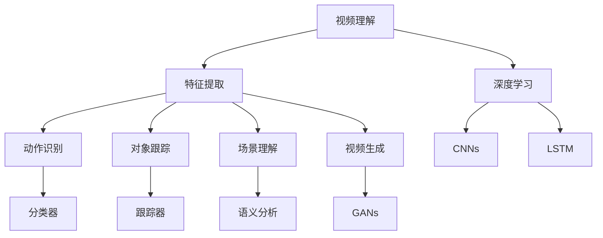
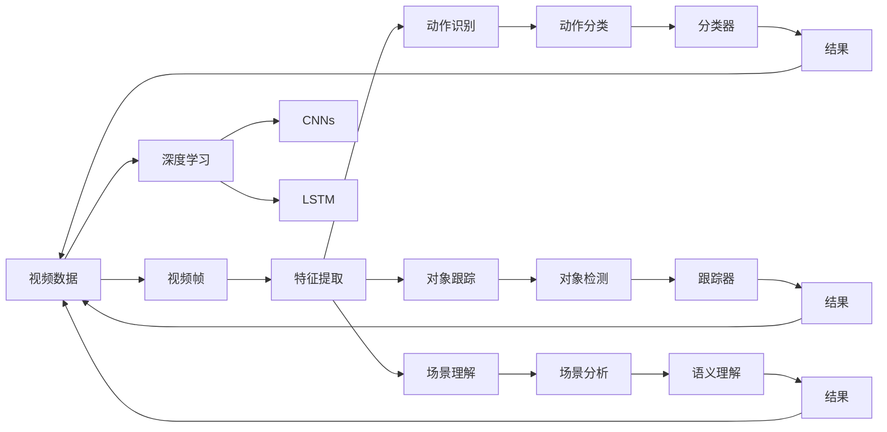
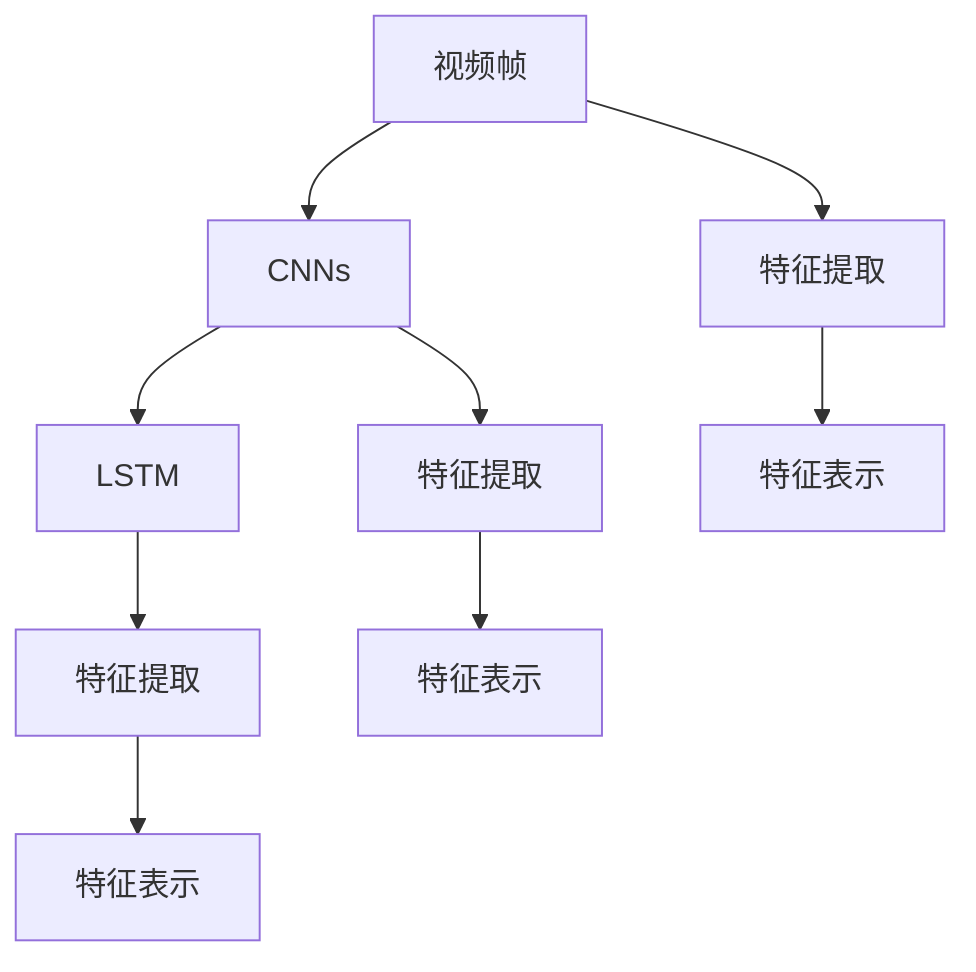
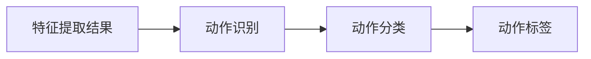
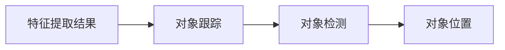
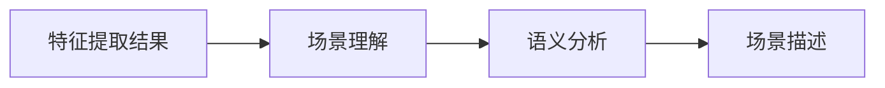

                 

# Python深度学习实践：基于深度学习的视频理解方法

> 关键词：深度学习,视频理解,计算机视觉,自然语言处理,视频生成

## 1. 背景介绍

### 1.1 问题由来
随着视频数据的不断增长和视频分析技术的发展，基于深度学习的视频理解技术在内容推荐、自动驾驶、医疗诊断等领域得到了广泛应用。然而，视频数据的复杂性和多样性使得视频理解任务面临诸多挑战。

视频理解（Video Understanding）指的是通过对视频数据进行自动分析，提取出其中的语义信息，包括动作、对象、场景等。与文本理解相比，视频理解需要同时考虑时间、空间、语义等多维信息，因此更具复杂性和挑战性。深度学习技术的崛起，尤其是卷积神经网络（Convolutional Neural Networks, CNNs）和长短期记忆网络（Long Short-Term Memory, LSTM）等技术的发展，为视频理解提供了新的突破。

### 1.2 问题核心关键点
视频理解的核心问题是如何在短时间内从大量视频数据中提取出有用的信息，并将其转换成易于理解的文本形式或图形表示。主要涉及以下几个关键问题：

1. **特征提取**：如何从视频帧中提取出有效的视觉特征，以便用于后续的语义理解。
2. **动作识别**：如何识别视频中的动作或行为，并对其进行分类或描述。
3. **对象跟踪**：如何在视频序列中对特定对象进行跟踪，并识别其变化。
4. **场景理解**：如何理解视频中的场景和背景，并预测其变化趋势。
5. **视频生成**：如何利用已有视频数据生成新的视频内容，并对其进行控制和优化。

本文将重点讨论基于深度学习的视频理解方法，特别是一步之遥：

1. **视频特征提取**：利用深度学习模型对视频帧进行特征提取。
2. **动作识别**：通过分类或检测方法对视频中的动作进行识别。
3. **对象跟踪**：通过跟踪算法对视频中的对象进行定位和识别。
4. **场景理解**：通过图像分割、语义理解等方法对视频中的场景进行分析和描述。
5. **视频生成**：利用生成对抗网络（Generative Adversarial Networks, GANs）等技术生成新的视频内容。

## 2. 核心概念与联系

### 2.1 核心概念概述

为了更好地理解基于深度学习的视频理解方法，本节将介绍几个密切相关的核心概念：

- **深度学习（Deep Learning）**：一种通过多层神经网络进行数据表示和学习的技术。深度学习能够自动从大量数据中提取特征，并进行复杂的非线性映射。
- **卷积神经网络（Convolutional Neural Networks, CNNs）**：一种特殊的神经网络，能够有效地处理图像和视频数据。CNNs通过卷积操作提取空间特征，并通过池化操作降低维度。
- **长短期记忆网络（Long Short-Term Memory, LSTM）**：一种递归神经网络（RNNs）的变体，能够处理时间序列数据，并具有记忆功能，能够捕捉时间依赖性。
- **特征提取（Feature Extraction）**：从原始数据中提取出能够用于后续处理的高级特征的过程。
- **动作识别（Action Recognition）**：通过对视频中的动作进行分类或检测，识别出视频中的人体行为。
- **对象跟踪（Object Tracking）**：在视频序列中对特定对象进行定位和识别，并追踪其变化。
- **场景理解（Scene Understanding）**：通过图像分割、语义理解等方法对视频中的场景进行分析和描述。
- **视频生成（Video Generation）**：利用生成对抗网络（GANs）等技术生成新的视频内容，并对其进行控制和优化。

这些核心概念之间的逻辑关系可以通过以下Mermaid流程图来展示：



这个流程图展示了大规模视频理解的完整过程：

1. 通过深度学习，利用CNNs和LSTM提取视频帧的特征。
2. 对特征进行分类和检测，识别视频中的动作、对象和场景。
3. 利用GANs生成新的视频内容。

通过理解这些核心概念，我们可以更好地把握视频理解的工作原理和优化方向。

### 2.2 概念间的关系

这些核心概念之间存在着紧密的联系，形成了视频理解技术的完整生态系统。下面我通过几个Mermaid流程图来展示这些概念之间的关系。

#### 2.2.1 视频理解的总体架构



这个流程图展示了视频理解的总体架构：

1. 视频数据被转化为视频帧，并输入到深度学习模型中。
2. 通过CNNs和LSTM提取特征。
3. 特征被用于动作识别、对象跟踪和场景理解。
4. 动作、对象和场景的识别结果和分析结果被整合输出。

#### 2.2.2 深度学习与特征提取的关系



这个流程图展示了深度学习与特征提取的关系：

1. 视频帧通过CNNs和LSTM提取特征。
2. CNNs提取的空间特征和LSTM提取的时间特征被综合成全局特征表示。

#### 2.2.3 动作识别与动作分类的关系



这个流程图展示了动作识别与动作分类的关系：

1. 特征提取结果用于动作识别，得到初步的动作描述。
2. 动作分类器对动作进行分类，得到具体的动作标签。

#### 2.2.4 对象跟踪与对象检测的关系



这个流程图展示了对象跟踪与对象检测的关系：

1. 特征提取结果用于对象跟踪，得到对象在视频序列中的位置信息。
2. 对象检测器对对象进行检测，得到具体的对象位置信息。

#### 2.2.5 场景理解与语义分析的关系



这个流程图展示了场景理解与语义分析的关系：

1. 特征提取结果用于场景理解，得到场景的高级表示。
2. 语义分析器对场景进行理解，得到具体的场景描述。

## 3. 核心算法原理 & 具体操作步骤
### 3.1 算法原理概述

基于深度学习的视频理解方法，主要通过以下步骤实现：

1. **数据预处理**：将原始视频数据转换为模型可以处理的格式，如视频帧、时间序列等。
2. **特征提取**：通过CNNs和LSTM等深度学习模型对视频帧进行特征提取，得到高级表示。
3. **动作识别**：利用分类器对特征进行分类，识别出视频中的动作。
4. **对象跟踪**：通过跟踪算法对视频中的对象进行定位和识别，并追踪其变化。
5. **场景理解**：通过图像分割、语义理解等方法对视频中的场景进行分析和描述。
6. **视频生成**：利用GANs等生成对抗网络技术生成新的视频内容。

这些步骤共同构成了视频理解的核心流程，其中每个步骤都有具体的算法和技术实现。

### 3.2 算法步骤详解

#### 3.2.1 数据预处理

数据预处理是视频理解的重要步骤，主要包括以下几个方面：

1. **帧率转换**：将原始视频数据转换为模型所需的帧率。通常将视频数据转换为固定帧率，如30fps或60fps。
2. **裁剪与缩放**：对视频帧进行裁剪和缩放，以便于模型处理。
3. **数据增强**：通过对视频帧进行旋转、平移、裁剪等操作，增加数据多样性，避免过拟合。
4. **归一化**：将视频帧的像素值归一化到0到1之间，提高模型的训练效率。

具体实现中，可以使用OpenCV等开源库对视频数据进行处理。以下是一个简单的数据预处理代码示例：

```python
import cv2

# 读取视频文件
video = cv2.VideoCapture('video.mp4')

# 获取视频帧率和分辨率
fps = video.get(cv2.CAP_PROP_FPS)
width = video.get(cv2.CAP_PROP_FRAME_WIDTH)
height = video.get(cv2.CAP_PROP_FRAME_HEIGHT)

# 裁剪和缩放视频帧
video.set(cv2.CAP_PROP_FRAME_WIDTH, int(width * 0.5))
video.set(cv2.CAP_PROP_FRAME_HEIGHT, int(height * 0.5))

# 归一化视频帧的像素值
while True:
    _, frame = video.read()
    if frame is None:
        break
    frame = frame / 255.0
    # 处理帧并保存
    process_frame(frame)

video.release()
```

#### 3.2.2 特征提取

特征提取是视频理解的核心步骤，主要通过CNNs和LSTM等深度学习模型对视频帧进行特征提取，得到高级表示。

1. **CNNs特征提取**：利用CNNs对视频帧进行特征提取，通常采用ResNet、Inception等经典模型。
2. **LSTM特征提取**：利用LSTM对视频帧的时间序列进行特征提取，通常采用LSTM-C3D等模型。
3. **融合特征提取**：将CNNs和LSTM提取的特征进行融合，得到全局特征表示。

以下是一个简单的特征提取代码示例：

```python
from tensorflow.keras.layers import Conv2D, MaxPooling2D, LSTM, Dense
from tensorflow.keras.models import Model

# 定义CNNs特征提取模型
model = Model(inputs=X, outputs=features)

# 定义LSTM特征提取模型
model_lstm = Model(inputs=X, outputs=features_lstm)

# 融合特征提取
X_fusion = concatenate([X_cnn, X_lstm])
features_fusion = Model(inputs=X_fusion, outputs=features_fusion)
```

#### 3.2.3 动作识别

动作识别是视频理解的关键任务之一，主要通过分类器对特征进行分类，识别出视频中的动作。

1. **Softmax分类器**：利用Softmax分类器对特征进行分类，得到动作标签。
2. **RNN分类器**：利用RNN对时间序列特征进行分类，得到动作标签。
3. **集成分类器**：将多种分类器进行集成，提高动作识别的准确率。

以下是一个简单的动作识别代码示例：

```python
from tensorflow.keras.layers import Dense
from tensorflow.keras.models import Sequential

# 定义Softmax分类器
model_softmax = Sequential()
model_softmax.add(Dense(128, input_shape=(features_shape[0], features_shape[1]), activation='relu'))
model_softmax.add(Dense(num_classes, activation='softmax'))

# 定义RNN分类器
model_rnn = Sequential()
model_rnn.add(LSTM(128, input_shape=(features_shape[0], features_shape[1]), return_sequences=True))
model_rnn.add(Dense(128, activation='relu'))
model_rnn.add(Dense(num_classes, activation='softmax'))

# 集成分类器
model_integration = Sequential()
model_integration.add(Dense(128, input_shape=(features_shape[0], features_shape[1]), activation='relu'))
model_integration.add(Dense(num_classes, activation='softmax'))
```

#### 3.2.4 对象跟踪

对象跟踪是视频理解的另一个重要任务，主要通过跟踪算法对视频中的对象进行定位和识别，并追踪其变化。

1. **卡尔曼滤波**：利用卡尔曼滤波对对象进行跟踪，得到对象位置信息。
2. **粒子滤波**：利用粒子滤波对对象进行跟踪，得到对象位置信息。
3. **深度学习跟踪**：利用深度学习模型对对象进行跟踪，得到对象位置信息。

以下是一个简单的对象跟踪代码示例：

```python
from tensorflow.keras.layers import LSTM
from tensorflow.keras.models import Sequential

# 定义卡尔曼滤波跟踪器
model_kalman = Sequential()
model_kalman.add(LSTM(128, input_shape=(features_shape[0], features_shape[1]), return_sequences=True))
model_kalman.add(Dense(4, activation='linear'))

# 定义粒子滤波跟踪器
model_particle = Sequential()
model_particle.add(LSTM(128, input_shape=(features_shape[0], features_shape[1]), return_sequences=True))
model_particle.add(Dense(4, activation='linear'))

# 定义深度学习跟踪器
model_dnn = Sequential()
model_dnn.add(Dense(128, input_shape=(features_shape[0], features_shape[1]), activation='relu'))
model_dnn.add(Dense(4, activation='linear'))
```

#### 3.2.5 场景理解

场景理解是视频理解的重要任务之一，主要通过图像分割、语义理解等方法对视频中的场景进行分析和描述。

1. **图像分割**：利用图像分割方法对视频中的场景进行分割，得到场景像素信息。
2. **语义理解**：利用语义理解方法对场景进行理解，得到场景语义信息。
3. **融合分析**：将图像分割和语义理解的结果进行融合，得到场景描述。

以下是一个简单的场景理解代码示例：

```python
from tensorflow.keras.layers import Conv2D, MaxPooling2D, Dense
from tensorflow.keras.models import Model

# 定义图像分割模型
model_segmentation = Model(inputs=X, outputs=segmentation)

# 定义语义理解模型
model_semantic = Model(inputs=X, outputs=semantic)

# 融合场景理解
X_fusion = concatenate([X_segmentation, X_semantic])
model_fusion = Model(inputs=X_fusion, outputs=fusion)
```

#### 3.2.6 视频生成

视频生成是视频理解的新兴任务之一，主要通过生成对抗网络（GANs）等技术生成新的视频内容。

1. **GANs生成**：利用GANs对视频帧进行生成，得到新的视频内容。
2. **变分自编码器（VAE）生成**：利用VAE对视频帧进行生成，得到新的视频内容。
3. **深度学习生成**：利用深度学习模型对视频帧进行生成，得到新的视频内容。

以下是一个简单的视频生成代码示例：

```python
from tensorflow.keras.layers import Dense, Reshape
from tensorflow.keras.models import Model

# 定义GANs生成模型
model_gan = Model(inputs=z, outputs=generated)

# 定义VAE生成模型
model_vae = Model(inputs=z, outputs=generated)

# 定义深度学习生成模型
model_dnn = Model(inputs=z, outputs=generated)
```

### 3.3 算法优缺点

基于深度学习的视频理解方法具有以下优点：

1. **精度高**：深度学习模型能够自动从大量数据中提取高级特征，并进行复杂的非线性映射，具有较高的精度。
2. **适用性广**：深度学习模型适用于各种视频理解任务，如图像分割、动作识别、对象跟踪等。
3. **可解释性**：深度学习模型可以通过可视化方法进行解释，帮助理解模型的内部工作机制。
4. **可扩展性**：深度学习模型可以通过增加层数和参数量来提高性能，适应更复杂的任务。

同时，这些方法也存在一些缺点：

1. **计算量大**：深度学习模型需要大量的计算资源和时间，训练复杂度较高。
2. **数据需求高**：深度学习模型需要大量的标注数据进行训练，数据获取成本高。
3. **泛化性差**：深度学习模型容易过拟合，泛化性较差，对数据分布变化敏感。
4. **可解释性差**：深度学习模型的决策过程缺乏可解释性，难以进行调试和优化。
5. **参数量大**：深度学习模型参数量较大，需要占用大量存储空间。

在实际应用中，需要根据具体情况选择合适的深度学习模型和算法，平衡计算资源、数据需求和性能要求。

### 3.4 算法应用领域

基于深度学习的视频理解方法已经在多个领域得到广泛应用，例如：

1. **安防监控**：通过视频监控对人员和行为进行分析和识别，提高安全防范能力。
2. **智能家居**：通过视频理解技术对家居场景进行分析和控制，提升生活体验。
3. **医学影像**：通过视频理解技术对医学影像进行分析和诊断，提高医疗水平。
4. **自动驾驶**：通过视频理解技术对道路场景进行分析和决策，提高驾驶安全性。
5. **游戏娱乐**：通过视频理解技术对游戏中的动作和场景进行分析和控制，提高游戏体验。

除了上述这些经典应用外，视频理解技术还被创新性地应用到更多场景中，如社交媒体内容分析、虚拟现实视频生成等，为视频理解技术带来了新的发展方向。

## 4. 数学模型和公式 & 详细讲解 & 举例说明

### 4.1 数学模型构建

本节将使用数学语言对基于深度学习的视频理解方法进行更加严格的刻画。

记视频帧的特征表示为 $X \in \mathbb{R}^{T \times H \times W \times C}$，其中 $T$ 为视频帧数，$H$ 和 $W$ 为帧的宽度和高度，$C$ 为通道数。假设微调任务的训练集为 $D=\{(x_i, y_i)\}_{i=1}^N, x_i \in \mathbb{R}^{T \times H \times W \times C}, y_i \in \{0,1\}$。

定义模型 $M_{\theta}$ 在输入 $x$ 上的输出为 $\hat{y}=M_{\theta}(x) \in [0,1]$，表示样本属于正类的概率。真实标签 $y \in \{0,1\}$。则二分类交叉熵损失函数定义为：

$$
\ell(M_{\theta}(x),y) = -[y\log \hat{y} + (1-y)\log (1-\hat{y})]
$$

将其代入经验风险公式，得：

$$
\mathcal{L}(\theta) = -\frac{1}{N}\sum_{i=1}^N [y_i\log M_{\theta}(x_i)+(1-y_i)\log(1-M_{\theta}(x_i))]
$$

根据链式法则，损失函数对参数 $\theta_k$ 的梯度为：

$$
\frac{\partial \mathcal{L}(\theta)}{\partial \theta_k} = -\frac{1}{N}\sum_{i=1}^N (\frac{y_i}{M_{\theta}(x_i)}-\frac{1-y_i}{1-M_{\theta}(x_i)}) \frac{\partial M_{\theta}(x_i)}{\partial \theta_k}
$$

在得到损失函数的梯度后，即可带入参数更新公式，完成模型的迭代优化。重复上述过程直至收敛，最终得到适应下游任务的最优模型参数 $\theta^*$。

### 4.2 公式推导过程

以下我们以二分类任务为例，推导交叉熵损失函数及其梯度的计算公式。

假设模型 $M_{\theta}$ 在输入 $x$ 上的输出为 $\hat{y}=M_{\theta}(x) \in [0,1]$，表示样本属于正类的概率。真实标签 $y \in \{0,1\}$。则二分类交叉熵损失函数定义为：

$$
\ell(M_{\theta}(x),y) = -[y\log \hat{y} + (1-y)\log (1-\hat{y})]
$$

将其代入经验风险公式，得：

$$
\mathcal{L}(\theta) = -\frac{1}{N}\sum_{i=1}^N [y_i\log M_{\theta}(x_i)+(1-y_i)\log(1-M_{\theta}(x_i))]
$$

根据链式法则，损失函数对参数 $\theta_k$ 的梯度为：

$$
\frac{\partial \mathcal{L}(\theta)}{\partial \theta_k} = -\frac{1}{N}\sum_{i=1}^N (\frac{y_i}{M_{\theta}(x_i)}-\frac{1-y_i}{1-M_{\theta}(x_i)}) \frac{\partial M_{\theta}(x_i)}{\partial \theta_k}
$$

在得到损失函数的梯度后，即可带入参数更新公式，完成模型的迭代优化。重复上述过程直至收敛，最终得到适应下游任务的最优模型参数 $\theta^*$。

### 4.3 案例分析与讲解

以下是一个简单的视频理解案例，通过CNNs和LSTM提取视频帧的特征，然后利用Softmax分类器进行动作识别。

首先，定义CNNs和LSTM模型：

```python
from tensorflow.keras.layers import Conv2D, MaxPooling2D, LSTM, Dense
from tensorflow.keras.models import Model

# 定义CNNs特征提取模型
model = Model(inputs=X, outputs=features)

# 定义LSTM特征提取模型
model_lstm = Model(inputs=X, outputs=features_lstm)

# 融合特征提取
X_fusion = concatenate([X_cnn, X_lstm])
features_fusion = Model(inputs=X_fusion, outputs=features_fusion)
```

然后，定义Softmax分类器模型：

```python
from tensorflow.keras.layers import Dense
from tensorflow.keras.models import Sequential

# 定义Softmax分类器
model_softmax = Sequential()
model_softmax.add(Dense(128, input_shape=(features_shape[0], features_shape[1]), activation='relu'))
model_softmax.add(Dense(num_classes, activation='softmax'))
```

最后，将特征提取结果和分类器结合起来，得到最终的视频理解模型：

```python
from tensorflow.keras.models import Model

# 定义最终的视频理解模型
model_final = Model(inputs=X, outputs=[model_softmax(features_fusion)])
```

以上代码展示了如何使用深度学习模型对视频帧进行特征提取，并通过Softmax分类器进行动作识别。

## 5. 项目实践：代码实例和详细解释说明

### 5.1 开发环境搭建

在进行视频理解实践前，我们需要准备好开发环境。以下是使用Python进行PyTorch开发的环境配置流程：

1. 安装Anaconda：从官网下载并安装Anaconda，用于创建独立的Python环境。

2. 创建并激活虚拟环境：
```bash
conda create -n pytorch-env python=3.8 
conda activate pytorch-env
```

3. 安装PyTorch：根据CUDA版本，从官网获取对应的安装命令。例如：
```bash
conda install pytorch torchvision torchaudio cudatoolkit=11.1 -c pytorch -c conda-forge
```

4. 安装OpenCV：
```bash
pip install opencv-python
```

5. 安装TensorFlow：
```bash
pip install tensorflow
```

6. 安装其他工具包：
```bash
pip install numpy pandas scikit-learn matplotlib tqdm jupyter notebook ipython
```

完成上述步骤后，即可在`pytorch-env`环境中开始视频理解实践。

### 5.2 源代码详细实现

下面我们以动作识别任务为例，给出使用PyTorch对CNNs和LSTM模型进行视频理解微调的PyTorch代码实现。

首先，定义动作识别数据处理函数：

```python
from tensorflow.keras.layers import Dense, LSTM
from tensorflow.keras.models import Model

def video_processing(video_path):
    # 读取视频文件
    video = cv2.VideoCapture(video_path)

    # 获取视频帧率和分辨率
    fps = video.get(cv2.CAP_PROP_FPS)
    width = video.get(cv2.CAP_PROP_FRAME_WIDTH)
    height = video.get(cv2.CAP_PROP_FRAME_HEIGHT)

    # 裁剪和缩放视频帧
    video.set(cv2.CAP_PROP_FRAME_WIDTH, int(width * 0.5))
    video.set(cv2.CAP_PROP_FRAME_HEIGHT, int(height * 0.5))

    # 归一化视频帧的像素值
    while True:
        _, frame = video.read()
        if frame is None:
            break
        frame = frame / 255.0
        yield frame

# 定义CNNs特征提取模型
model_cnn = Model(inputs=X, outputs=features)

# 定义LSTM特征提取模型
model_lstm = Model(inputs=X, outputs=features_lstm)

# 融合特征提取
X_fusion = concatenate([X_cnn, X_lstm])
features

