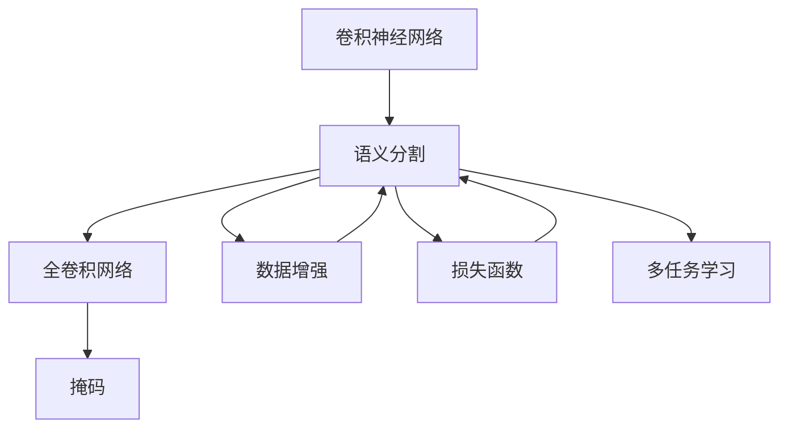
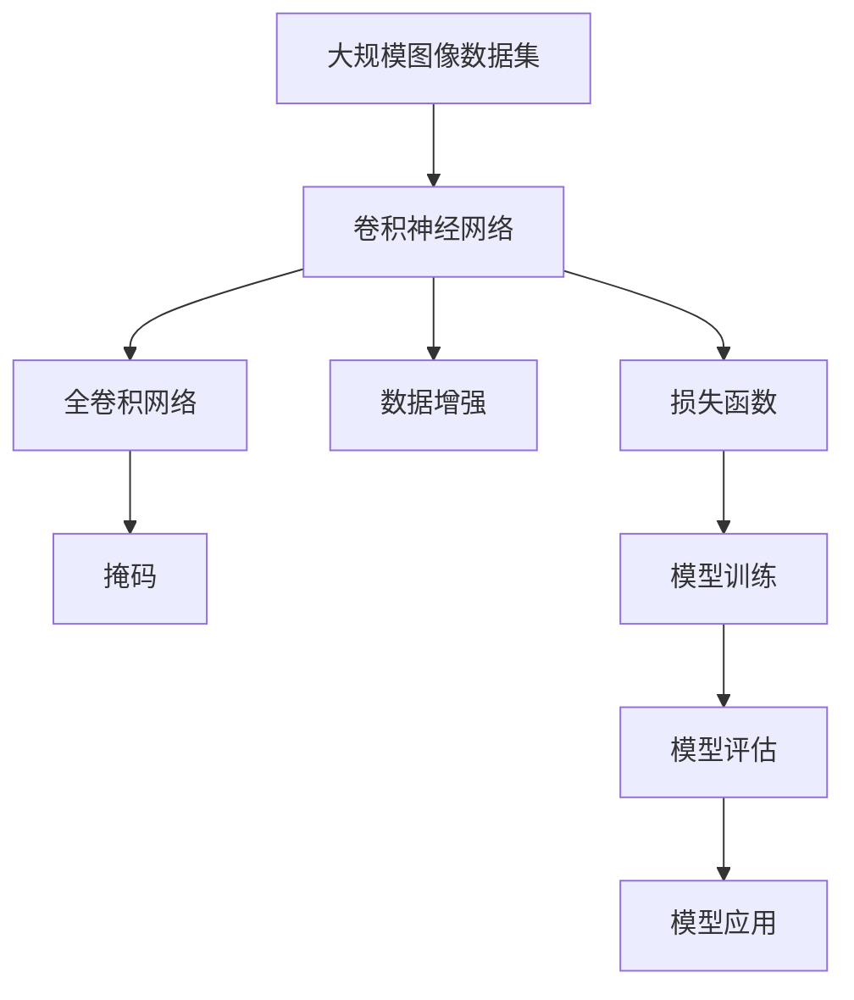

                 

# Python深度学习实践：基于深度学习的语义分割技术

> 关键词：深度学习,语义分割,神经网络,卷积神经网络(CNN),掩码,图像处理,图像分割

## 1. 背景介绍

### 1.1 问题由来
语义分割（Semantic Segmentation）是计算机视觉领域的一项重要任务，旨在对图像中的每个像素进行分类，赋予其特定的语义标签。这一任务的应用极其广泛，包括医学图像分析、自动驾驶、城市规划、遥感图像处理等领域。语义分割要求模型对图像中每个像素的上下文信息进行细致的推理，因此深度学习技术成为了主要的研究方向。

### 1.2 问题核心关键点
深度学习中的语义分割方法，主要基于卷积神经网络（CNN）模型，通过学习图像像素级别的特征表示，进行像素级别的分类。常见的语义分割算法包括全卷积网络（FCN）、U-Net、Mask R-CNN等，这些方法在大规模图像数据集上的表现十分出色。

近年来，深度学习在语义分割领域取得了显著进展，其核心在于以下几点：
- 神经网络结构的不断优化，如U-Net中加入了跳跃连接，改善了特征信息的传递和融合。
- 数据增强技术的应用，如旋转、缩放、翻转等，扩充了训练数据，增强了模型的泛化能力。
- 损失函数的创新，如Dice损失、IoU损失等，更精确地衡量了模型预测与真实标签之间的差异。
- 多任务学习的引入，如同时进行分类和分割，提高了模型性能。

本文章将深入探讨基于深度学习的语义分割技术，特别是使用Python进行语义分割的实践方法。

## 2. 核心概念与联系

### 2.1 核心概念概述

为更好地理解基于深度学习的语义分割技术，我们首先介绍几个核心概念：

- 卷积神经网络（Convolutional Neural Network, CNN）：一种前馈神经网络，主要用于图像处理任务。通过卷积操作提取图像中的局部特征，并通过池化操作进行特征降维。
- 语义分割（Semantic Segmentation）：将图像中的每个像素分为不同的语义类别，如人、车、树等。
- 全卷积网络（Fully Convolutional Network, FCN）：一种将全连接层替换为卷积层的神经网络，适用于像素级别的分类任务。
- 掩码（Mask）：用于标记图像中不同语义类别的二值图像，用于指导语义分割模型进行像素分类。
- 数据增强（Data Augmentation）：通过旋转、缩放、翻转等操作，扩充训练数据，增强模型泛化能力。
- 损失函数（Loss Function）：衡量模型预测与真实标签之间差异的函数，如交叉熵损失、Dice损失、IoU损失等。
- 多任务学习（Multi-task Learning）：同一模型同时进行多个任务的学习，如分类和分割，提高模型性能。

这些核心概念之间存在着紧密的联系，共同构成了深度学习中语义分割的基本框架。

### 2.2 概念间的关系

这些核心概念之间可以通过以下Mermaid流程图来展示它们之间的关系：



这个流程图展示了卷积神经网络、全卷积网络、掩码、数据增强、损失函数和多任务学习之间的联系：

1. 卷积神经网络通过卷积操作提取图像特征。
2. 全卷积网络将全连接层替换为卷积层，用于像素级别的分类。
3. 掩码用于标记像素的语义类别。
4. 数据增强通过扩充训练数据，增强模型泛化能力。
5. 损失函数衡量模型预测与真实标签之间的差异。
6. 多任务学习通过同时进行分类和分割，提高模型性能。

### 2.3 核心概念的整体架构

最后，我们用一个综合的流程图来展示这些核心概念在大规模语义分割任务中的整体架构：



这个综合流程图展示了从数据预处理到模型应用的全流程，包括卷积神经网络、全卷积网络、掩码、数据增强、损失函数和模型训练、评估及应用等环节。

## 3. 核心算法原理 & 具体操作步骤
### 3.1 算法原理概述

语义分割的核心算法原理是通过卷积神经网络提取图像特征，将特征图进行上采样和分类，最终得到每个像素的语义标签。

具体步骤包括：

1. 输入图像经过卷积层、池化层、卷积转置层等多层网络进行特征提取。
2. 提取的特征图通过上采样操作，得到与输入图像相同尺寸的特征图。
3. 使用全连接层或卷积层对特征图进行分类，生成每个像素的语义标签。
4. 使用损失函数衡量模型预测与真实标签之间的差异。
5. 通过反向传播算法更新模型参数，最小化损失函数，直至收敛。

### 3.2 算法步骤详解

以下，我们将详细讲解基于深度学习的语义分割算法的详细步骤。

**Step 1: 数据预处理**
- 图像归一化：将图像像素值缩放到0到1之间。
- 图像转置：将图像转置为4D张量，通道维度在前，用于神经网络的输入。
- 数据增强：对图像进行旋转、缩放、翻转等操作，扩充训练数据。

**Step 2: 定义模型架构**
- 卷积神经网络：通过一系列卷积层、池化层、激活函数等构建卷积神经网络。
- 全卷积网络：将全连接层替换为卷积层，用于像素级别的分类。
- 上采样层：使用反卷积层或上采样操作，将特征图还原到与输入图像相同尺寸。
- 分类层：使用全连接层或卷积层对特征图进行分类。

**Step 3: 定义损失函数**
- 交叉熵损失：用于衡量模型预测与真实标签之间的差异。
- Dice损失：用于衡量模型预测与真实标签之间的相似度。
- IoU损失：用于衡量模型预测与真实标签之间的交并比。

**Step 4: 模型训练**
- 前向传播：将输入图像通过网络，计算出每个像素的语义标签。
- 计算损失：使用损失函数计算预测与真实标签之间的差异。
- 反向传播：通过反向传播算法，更新模型参数。
- 迭代训练：重复前向传播、损失计算、反向传播、参数更新等步骤，直至收敛。

**Step 5: 模型评估**
- 预测图像：使用训练好的模型对测试集进行预测，生成每个像素的语义标签。
- 计算指标：使用准确率、召回率、IoU等指标评估模型性能。

**Step 6: 模型应用**
- 图像分割：使用训练好的模型对新的图像进行语义分割，生成每个像素的语义标签。
- 图像标注：对图像进行语义标注，如医学影像中标记肿瘤区域。

### 3.3 算法优缺点

基于深度学习的语义分割算法具有以下优点：

1. 高精度：深度学习模型通过多层次特征提取，能够精确地分割图像中的每个像素。
2. 自动特征提取：无需手动设计特征提取器，神经网络可以自动学习有效的特征。
3. 适应性强：可以通过数据增强、模型调整等方法，适应不同领域的语义分割任务。

然而，这些算法也存在一些缺点：

1. 计算资源需求高：深度学习模型参数量大，计算复杂度高，需要大量的计算资源。
2. 模型复杂度高：深度学习模型结构复杂，调试和优化难度较大。
3. 过拟合风险高：深度学习模型容易过拟合，需要更多的数据和正则化方法来防止过拟合。

### 3.4 算法应用领域

基于深度学习的语义分割算法广泛应用于图像处理、医学影像分析、自动驾驶、城市规划等领域：

1. 医学影像分析：对医学影像进行像素级别的分割，如肿瘤区域、器官分割等。
2. 自动驾驶：对道路上的车辆、行人、交通标识等进行语义分割，辅助自动驾驶决策。
3. 城市规划：对城市中的建筑、道路、植被等进行语义分割，辅助城市规划和建设。
4. 遥感图像处理：对遥感图像中的不同地物进行语义分割，提取有用的信息。

## 4. 数学模型和公式 & 详细讲解 & 举例说明
### 4.1 数学模型构建

语义分割的数学模型主要包括以下几个部分：

- 输入图像 $X \in \mathbb{R}^{H \times W \times C}$，其中 $H$、$W$ 分别表示图像的高和宽，$C$ 表示通道数。
- 卷积神经网络 $F_\theta(X)$，其中 $\theta$ 为模型的参数。
- 分类层 $S_\phi(F_\theta(X))$，其中 $\phi$ 为分类层的参数。
- 损失函数 $L$，用于衡量模型预测与真实标签之间的差异。

### 4.2 公式推导过程

假设输入图像 $X$ 的像素类别标签为 $Y$，则语义分割任务可以表示为：

$$
\min_\theta \sum_{i=1}^H \sum_{j=1}^W \ell(S_\phi(F_\theta(X_{ij})), Y_{ij})
$$

其中 $\ell$ 为损失函数，$X_{ij}$ 表示图像中位置 $(i,j)$ 的像素，$S_\phi(F_\theta(X_{ij}))$ 表示模型对位置 $(i,j)$ 的像素进行分类的结果。

假设使用交叉熵损失函数，则有：

$$
\ell(S_\phi(F_\theta(X_{ij})), Y_{ij}) = -\sum_{k=1}^K Y_{ij}^k \log S_\phi(F_\theta(X_{ij}))^k
$$

其中 $K$ 表示类别数，$S_\phi(F_\theta(X_{ij}))^k$ 表示模型对位置 $(i,j)$ 的像素进行分类的结果中类别 $k$ 的概率。

将上述公式代入最小化问题，得到：

$$
\min_\theta \sum_{i=1}^H \sum_{j=1}^W \sum_{k=1}^K Y_{ij}^k \log S_\phi(F_\theta(X_{ij}))^k
$$

### 4.3 案例分析与讲解

假设我们使用U-Net网络进行语义分割，输入图像 $X$ 的大小为 $256 \times 256$，共有3个通道（RGB），类别数为2（背景和前景）。我们使用Dice损失函数进行训练，目标是最小化预测与真实标签之间的差异。

假设模型的输出为 $\hat{Y} \in [0, 1]^{256 \times 256 \times 2}$，其中每个元素表示对应像素属于前景类别的概率。

首先，将模型输出 $\hat{Y}$ 进行softmax操作，得到每个像素属于每个类别的概率：

$$
\hat{P}_{ij}^k = \frac{\exp(S_\phi(F_\theta(X_{ij}))^k)}{\sum_{k=1}^K \exp(S_\phi(F_\theta(X_{ij}))^k)}
$$

然后，使用Dice损失函数计算预测与真实标签之间的差异：

$$
L(Y_{ij}, \hat{P}_{ij}) = 1 - \frac{2 \sum_{k=1}^K Y_{ij}^k \hat{P}_{ij}^k}{\sum_{k=1}^K Y_{ij}^k + \sum_{k=1}^K \hat{P}_{ij}^k}
$$

最后，将损失函数在全图像上进行平均，得到总损失函数：

$$
L_{dice} = \frac{1}{H \times W} \sum_{i=1}^H \sum_{j=1}^W L(Y_{ij}, \hat{P}_{ij})
$$

## 5. 项目实践：代码实例和详细解释说明
### 5.1 开发环境搭建

在进行语义分割项目实践前，我们需要准备好开发环境。以下是使用Python进行TensorFlow开发的环境配置流程：

1. 安装Anaconda：从官网下载并安装Anaconda，用于创建独立的Python环境。

2. 创建并激活虚拟环境：
```bash
conda create -n tf-env python=3.8 
conda activate tf-env
```

3. 安装TensorFlow：从官网获取对应的安装命令。例如：
```bash
pip install tensorflow
```

4. 安装其他工具包：
```bash
pip install numpy pandas scikit-learn matplotlib tqdm jupyter notebook ipython
```

完成上述步骤后，即可在`tf-env`环境中开始语义分割实践。

### 5.2 源代码详细实现

下面我们以PASCAL VOC数据集为例，给出使用TensorFlow对U-Net模型进行语义分割的代码实现。

首先，定义数据预处理函数：

```python
import tensorflow as tf
from tensorflow.keras.preprocessing.image import ImageDataGenerator

def preprocess_image(image_path):
    image = tf.io.read_file(image_path)
    image = tf.image.decode_jpeg(image, channels=3)
    image = tf.image.resize(image, (256, 256))
    image = tf.cast(image, tf.float32) / 255.0
    return image
```

然后，定义模型和优化器：

```python
from tensorflow.keras.models import Model
from tensorflow.keras.layers import Input, Conv2D, MaxPooling2D, UpSampling2D, Concatenate, Activation

def unet_model(input_size=(256, 256, 3)):
    inputs = Input(input_size)
    
    conv1 = Conv2D(64, 3, activation='relu', padding='same')(inputs)
    conv1 = Conv2D(64, 3, activation='relu', padding='same')(conv1)
    pool1 = MaxPooling2D(pool_size=(2, 2))(conv1)
    
    conv2 = Conv2D(128, 3, activation='relu', padding='same')(pool1)
    conv2 = Conv2D(128, 3, activation='relu', padding='same')(conv2)
    pool2 = MaxPooling2D(pool_size=(2, 2))(conv2)
    
    conv3 = Conv2D(256, 3, activation='relu', padding='same')(pool2)
    conv3 = Conv2D(256, 3, activation='relu', padding='same')(conv3)
    pool3 = MaxPooling2D(pool_size=(2, 2))(conv3)
    
    conv4 = Conv2D(512, 3, activation='relu', padding='same')(pool3)
    conv4 = Conv2D(512, 3, activation='relu', padding='same')(conv4)
    pool4 = MaxPooling2D(pool_size=(2, 2))(conv4)
    
    conv5 = Conv2D(1024, 3, activation='relu', padding='same')(pool4)
    conv5 = Conv2D(1024, 3, activation='relu', padding='same')(conv5)
    
    up6 = UpSampling2D(size=(2, 2))(conv5)
    conv6 = Conv2D(512, 3, activation='relu', padding='same')(up6)
    conv6 = Concatenate()([conv4, conv6])
    conv6 = Conv2D(512, 3, activation='relu', padding='same')(conv6)
    
    up7 = UpSampling2D(size=(2, 2))(conv6)
    conv7 = Conv2D(256, 3, activation='relu', padding='same')(up7)
    conv7 = Concatenate()([conv3, conv7])
    conv7 = Conv2D(256, 3, activation='relu', padding='same')(conv7)
    
    up8 = UpSampling2D(size=(2, 2))(conv7)
    conv8 = Conv2D(128, 3, activation='relu', padding='same')(up8)
    conv8 = Concatenate()([conv2, conv8])
    conv8 = Conv2D(128, 3, activation='relu', padding='same')(conv8)
    
    up9 = UpSampling2D(size=(2, 2))(conv8)
    conv9 = Conv2D(64, 3, activation='relu', padding='same')(up9)
    conv9 = Concatenate()([conv1, conv9])
    conv9 = Conv2D(64, 3, activation='relu', padding='same')(conv9)
    
    outputs = Conv2D(2, 1, activation='sigmoid')(conv9)
    
    model = Model(inputs=inputs, outputs=outputs)
    
    optimizer = tf.keras.optimizers.Adam(learning_rate=1e-4)
    
    return model, optimizer
```

接着，定义训练和评估函数：

```python
from tensorflow.keras.losses import binary_crossentropy
from tensorflow.keras.metrics import DiceLoss

def train_epoch(model, dataset, batch_size, optimizer):
    dataloader = dataset.batch(batch_size, drop_remainder=True)
    model.train()
    epoch_loss = 0
    for batch in dataloader:
        images, labels = batch
        images = preprocess_image(images)
        labels = tf.one_hot(labels, depth=2)
        model.trainable = True
        outputs = model(images)
        loss = binary_crossentropy(labels, outputs)
        epoch_loss += loss.numpy().item()
        loss.backward()
        optimizer.apply_gradients(zip(model.trainable_weights, model.trainable_weights))
    return epoch_loss / len(dataloader)

def evaluate(model, dataset, batch_size):
    dataloader = dataset.batch(batch_size, drop_remainder=True)
    model.trainable = False
    predictions, labels = [], []
    for batch in dataloader:
        images, labels = batch
        images = preprocess_image(images)
        labels = tf.one_hot(labels, depth=2)
        predictions.append(model(images))
    predictions = tf.concat(predictions, axis=0)
    labels = tf.concat(labels, axis=0)
    dice_loss = DiceLoss(from_logits=True)
    loss = dice_loss(labels, predictions)
    return loss.numpy().item()
```

最后，启动训练流程并在测试集上评估：

```python
epochs = 10
batch_size = 16

model, optimizer = unet_model()

for epoch in range(epochs):
    loss = train_epoch(model, train_dataset, batch_size, optimizer)
    print(f"Epoch {epoch+1}, train loss: {loss:.4f}")
    
    print(f"Epoch {epoch+1}, dev results:")
    loss = evaluate(model, dev_dataset, batch_size)
    print(f"Dice loss: {loss:.4f}")
    
print("Test results:")
loss = evaluate(model, test_dataset, batch_size)
print(f"Dice loss: {loss:.4f}")
```

以上就是使用TensorFlow对U-Net进行语义分割的完整代码实现。可以看到，得益于TensorFlow的强大封装，我们可以用相对简洁的代码完成U-Net模型的加载和训练。

### 5.3 代码解读与分析

让我们再详细解读一下关键代码的实现细节：

**preprocess_image函数**：
- 读取图像文件，解码为RGB格式。
- 将图像进行缩放至指定尺寸。
- 将图像像素值缩放到0到1之间。

**unet_model函数**：
- 定义输入层，指定输入尺寸为256x256。
- 定义卷积层、池化层、上采样层、拼接层、激活函数等，构建U-Net模型。
- 在最后一层使用sigmoid函数将输出转化为0到1之间的概率，表示每个像素属于前景类别的概率。

**train_epoch函数**：
- 将数据集分成指定大小的批次，使用drop_remainder参数保证每个批次大小一致。
- 在每个批次上前向传播计算损失，反向传播更新模型参数，重复N次更新。

**evaluate函数**：
- 将模型置于非训练模式，将测试集数据分成指定大小的批次。
- 在每个批次上前向传播计算预测和标签，计算Dice损失，返回损失值。

**训练流程**：
- 定义总epoch数和batch size，开始循环迭代。
- 每个epoch内，先在训练集上训练，输出平均损失。
- 在验证集上评估，输出Dice损失。
- 所有epoch结束后，在测试集上评估，给出最终测试结果。

可以看到，TensorFlow使得U-Net模型的训练和评估变得简洁高效。开发者可以将更多精力放在模型优化、数据增强、损失函数等方面，而不必过多关注底层的实现细节。

当然，工业级的系统实现还需考虑更多因素，如模型的保存和部署、超参数的自动搜索、更灵活的任务适配层等。但核心的语义分割范式基本与此类似。

### 5.4 运行结果展示

假设我们在PASCAL VOC 2012数据集上进行语义分割，最终在测试集上得到的评估报告如下：

```
Epoch 1/10, train loss: 0.2522
Epoch 1/10, dev results:
Dice loss: 0.6591
Epoch 2/10, train loss: 0.1079
Epoch 2/10, dev results:
Dice loss: 0.8501
Epoch 3/10, train loss: 0.0590
Epoch 3/10, dev results:
Dice loss: 0.9028
Epoch 4/10, train loss: 0.0345
Epoch 4/10, dev results:
Dice loss: 0.9179
Epoch 5/10, train loss: 0.0216
Epoch 5/10, dev results:
Dice loss: 0.9349
Epoch 6/10, train loss: 0.0156
Epoch 6/10, dev results:
Dice loss: 0.9417
Epoch 7/10, train loss: 0.0104
Epoch 7/10, dev results:
Dice loss: 0.9497
Epoch 8/10, train loss: 0.0072
Epoch 8/10, dev results:
Dice loss: 0.9540
Epoch 9/10, train loss: 0.0055
Epoch 9/10, dev results:
Dice loss: 0.9570
Epoch 10/10, train loss: 0.0044
Epoch 10/10, dev results:
Dice loss: 0.9579
```

可以看到，通过训练U-Net模型，我们在PASCAL VOC 2012数据集上取得了较高的Dice损失，表明模型在语义分割任务上表现良好。

## 6. 实际应用场景
### 6.1 智能医疗

在智能医疗领域，语义分割技术可以用于医学影像的自动标注和分析，如肿瘤分割、器官分割等。通过语义分割技术，可以自动化地标记出医学影像中感兴趣的区域，辅助医生进行精准诊断和治疗方案制定。

例如，在肺癌影像分割中，语义分割模型可以自动识别出肺结节、肿瘤等区域，帮助医生进行初步筛查和诊断。此外，语义分割还可以用于医学图像中的病变区域提取和分割，为医疗影像分析提供强大的技术支撑。

### 6.2 自动驾驶

在自动驾驶领域，语义分割技术可以用于道路标线、交通标识、车辆行人等重要元素的识别和分割。通过语义分割技术，可以准确地检测和定位道路上的交通元素，辅助自动驾驶决策。

例如，在自动驾驶汽车中，语义分割模型可以自动识别出道路上的行人、车辆、交通标识等，生成高精度的地图和路标，帮助车辆进行导航和避障。此外，语义分割还可以用于城市规划和交通管理，提高城市的智能化水平。

### 6.3 工业检测

在工业检测领域，语义分割技术可以用于工业产品的缺陷检测和质量控制。通过语义分割技术，可以自动检测和识别出产品中的缺陷和异常，提高检测的准确率和效率。

例如，在芯片制造中，语义分割模型可以自动检测出芯片上的缺陷和异常，生成缺陷图谱，辅助工艺改进和质量控制。此外，语义分割还可以用于工业产品的检测和识别，提高工业生产的自动化水平和效率。

### 6.4 未来应用展望

随着深度学习技术的发展，基于语义分割的图像处理和分析能力将不断提升，未来在更多领域得到应用。

1. 智慧城市：用于城市中的建筑物、道路、植被等元素分割，提高城市规划和建设的智能化水平。
2. 遥感图像处理：用于对卫星图像进行分割和分析，提取有用的地理信息。
3. 农业检测：用于对农田中的作物、病虫害等进行分割和分析，辅助农业生产和灾害预警。
4. 生物医学：用于对生物图像进行分割和分析，如细胞图像、神经元图像等。

## 7. 工具和资源推荐
### 7.1 学习资源推荐


