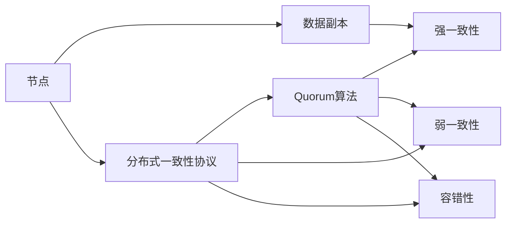
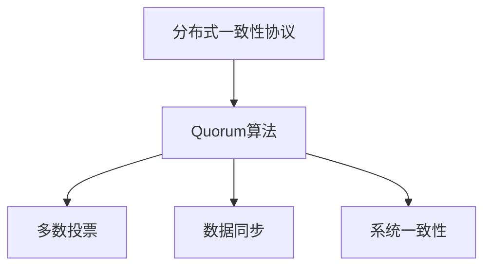
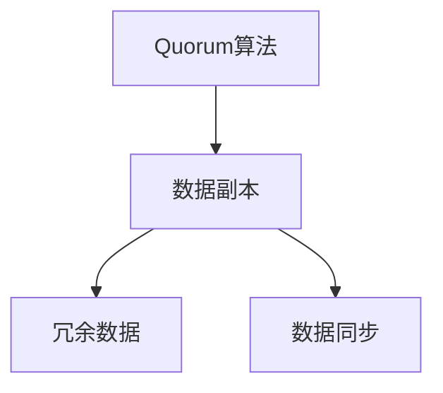
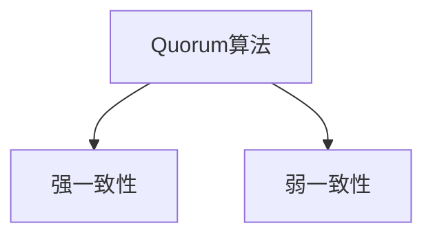
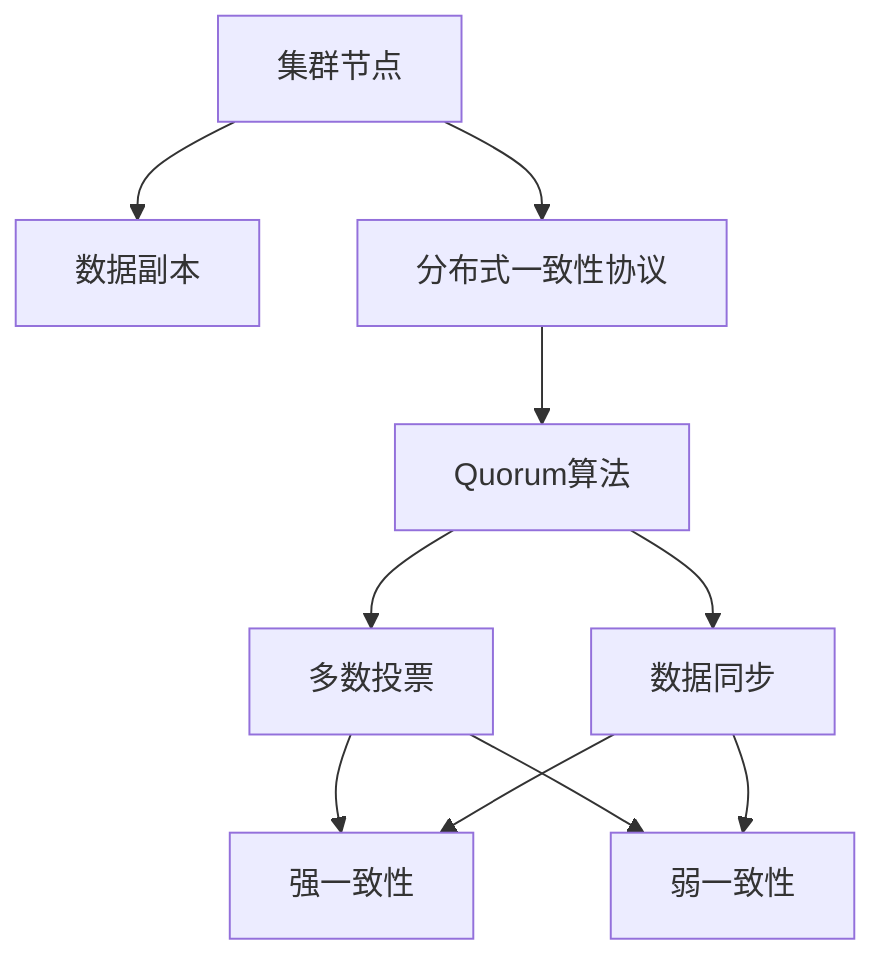

                 

# Quorum在无领导集群中的应用

## 1. 背景介绍

### 1.1 问题由来
随着分布式系统的广泛应用，集群中的节点越来越多，系统设计和管理变得更加复杂。传统的集中式管理方式，如单点故障、管理瓶颈等问题逐渐显现。如何设计一种新的管理机制，能够适应大规模集群的需求，成为当前分布式系统领域的一个热门话题。

在分布式系统中，由于不同节点间的通信复杂度高，传统的集中式管理方式如Paxos、Raft等算法难以满足实际需求。而Quorum算法则通过分布式一致性协议，有效解决了这些问题，被广泛应用于无领导集群中。

### 1.2 问题核心关键点
Quorum算法是分布式系统中的一个重要组成部分，其核心思想是通过多个节点的协作，实现系统的可靠性、可用性和一致性。在无领导集群中，通过分布式一致性协议，可以有效避免单点故障，提高系统的稳定性和扩展性。

Quorum算法的核心在于：
- 多个节点协作，通过简单的多数投票协议，达成一致决策。
- 实现系统的高可靠性、高可用性和强一致性。
- 可以应用于各种分布式系统，如数据库、分布式文件系统、分布式存储系统等。

### 1.3 问题研究意义
研究Quorum算法，对于设计高效可靠的无领导集群，具有重要的理论和实际意义：

1. 增强系统的可靠性。多个节点的协作，能够避免单点故障，提高系统的稳定性和鲁棒性。
2. 提高系统的可用性。通过Quorum协议，能够在节点故障时迅速恢复，保持系统服务的连续性。
3. 提升系统的扩展性。Quorum算法能够适应大规模集群，提高系统的扩展性和性能。
4. 促进分布式系统的普及。通过Quorum算法，能够实现大规模分布式系统的可靠部署和管理。
5. 提供新的研究方向。Quorum算法的实现机制和优化方法，为分布式系统的研究提供了新的思路和方向。

## 2. 核心概念与联系

### 2.1 核心概念概述

为了更好地理解Quorum算法在无领导集群中的应用，本节将介绍几个密切相关的核心概念：

- 分布式一致性协议：在分布式系统中，多个节点协作，通过协议达成一致决策。Quorum算法是一种常用的分布式一致性协议，适用于无领导集群。
- 节点：集群中的每个计算设备，具有独立的操作系统、应用程序和数据。
- 数据副本：在集群中，数据会被复制多个副本，分布在不同的节点上。通过数据副本的同步，实现数据的可靠性和可用性。
- 强一致性：在集群中，所有节点的数据状态必须保持一致，每个节点的操作必须被其他节点认可。
- 弱一致性：在集群中，允许存在不同步的数据状态，但能够在后续操作中收敛到一致状态。
- 容错性：集群中部分节点故障时，系统仍能正常运行，数据不会丢失。

这些核心概念之间的逻辑关系可以通过以下Mermaid流程图来展示：



这个流程图展示了大语言模型微调过程中各个核心概念的关系和作用。

### 2.2 概念间的关系

这些核心概念之间存在着紧密的联系，形成了无领导集群的核心系统架构。下面我通过几个Mermaid流程图来展示这些概念之间的关系。

#### 2.2.1 分布式一致性协议与Quorum算法的联系



这个流程图展示了分布式一致性协议与Quorum算法之间的关系。Quorum算法基于多数投票协议，通过多个节点协作，达成一致决策。数据同步和系统一致性是Quorum算法的主要功能。

#### 2.2.2 Quorum算法与数据副本的关系



这个流程图展示了Quorum算法与数据副本之间的关系。Quorum算法通过数据副本的同步，实现数据的冗余和可靠存储。

#### 2.2.3 Quorum算法与一致性的关系



这个流程图展示了Quorum算法与一致性之间的关系。Quorum算法既支持强一致性，也支持弱一致性。通过设置不同的容错参数，可以选择适合不同应用场景的一致性级别。

### 2.3 核心概念的整体架构

最后，我们用一个综合的流程图来展示这些核心概念在大语言模型微调过程中的整体架构：



这个综合流程图展示了从集群节点到数据副本，再到分布式一致性协议和Quorum算法的整体架构。通过Quorum算法的多数投票和数据同步，实现了数据的冗余存储和强一致性。

## 3. Quorum算法的核心算法原理 & 具体操作步骤

### 3.1 算法原理概述

Quorum算法是一种分布式一致性协议，其核心思想是通过多个节点的协作，达成一致决策。在无领导集群中，Quorum算法通过简单的多数投票协议，实现数据的冗余存储和一致性。

假设集群中有n个节点，每个节点有m个数据副本。当某节点执行写入操作时，需要与至少k个节点同步数据，其中k为容错参数，通常取值为n/2+1。

当某节点执行读取操作时，需要读取至少k+1个数据副本，并返回其中多数节点认可的数据。

### 3.2 算法步骤详解

Quorum算法的具体操作步骤如下：

1. 节点启动：每个节点启动后，读取数据副本，并判断是否本地有最新数据。
2. 写入操作：当某节点执行写入操作时，首先与至少k个节点同步数据，然后更新本地数据副本。
3. 读取操作：当某节点执行读取操作时，需要读取至少k+1个数据副本，并返回其中多数节点认可的数据。
4. 数据同步：当某节点写入数据后，需要与其他节点同步数据，确保所有节点数据一致。
5. 容错机制：当某节点故障时，系统仍能正常运行，其他节点可以继续处理读写请求。

### 3.3 算法优缺点

Quorum算法的主要优点在于：
- 实现简单，易于部署和维护。
- 实现高可靠性、高可用性和强一致性。
- 支持大规模集群，具有较强的扩展性。

Quorum算法的主要缺点在于：
- 写入操作需要与多个节点同步数据，会导致一定的延迟。
- 需要较多的存储资源，用于存储冗余的数据副本。
- 容错参数k的选取需要考虑系统规模和性能需求，选取不当可能导致性能下降。

### 3.4 算法应用领域

Quorum算法广泛应用于各种分布式系统中，如数据库、分布式文件系统、分布式存储系统等。以下是几个典型的应用场景：

1. 数据库系统：在分布式数据库中，Quorum算法用于保证数据的冗余存储和一致性。当某节点执行写入操作时，需要与至少k个节点同步数据，确保数据的一致性。
2. 分布式文件系统：在分布式文件系统中，Quorum算法用于保证文件的冗余存储和可靠传输。当某节点上传文件时，需要与至少k个节点同步数据，确保数据的可靠性。
3. 分布式存储系统：在分布式存储系统中，Quorum算法用于保证数据的冗余存储和一致性。当某节点写入数据时，需要与至少k个节点同步数据，确保数据的一致性。

## 4. 数学模型和公式 & 详细讲解 & 举例说明（备注：数学公式请使用latex格式，latex嵌入文中独立段落使用 $$，段落内使用 $)
### 4.1 数学模型构建

假设集群中有n个节点，每个节点有m个数据副本，容错参数k=kmax，其中kmax为系统规模的函数。当某节点执行写入操作时，需要与至少k个节点同步数据，然后更新本地数据副本。

当某节点执行读取操作时，需要读取至少k+1个数据副本，并返回其中多数节点认可的数据。

### 4.2 公式推导过程

当某节点执行写入操作时，需要与至少k个节点同步数据，假设每个节点更新数据的时间为t1，数据同步的时间为t2，则写入操作的耗时T为：

$$
T = t1 + (n-k)t2
$$

当某节点执行读取操作时，需要读取至少k+1个数据副本，假设每个节点读取数据的时间为t3，则读取操作的耗时为：

$$
T = t3
$$

### 4.3 案例分析与讲解

假设集群中有3个节点，每个节点有2个数据副本，容错参数k=1。当某节点执行写入操作时，需要与至少1个节点同步数据。

当某节点执行读取操作时，需要读取至少2个数据副本，并返回其中多数节点认可的数据。

假设每个节点更新数据的时间为t1=0.1s，数据同步的时间为t2=0.2s，读取数据的时间为t3=0.05s，则写入操作的耗时为：

$$
T = 0.1 + (3-1) \times 0.2 = 0.5s
$$

读取操作的耗时为：

$$
T = 0.05s
$$

可以看到，写入操作的时间主要取决于数据同步的时间，而读取操作的时间主要取决于读取数据的时间。

## 5. 项目实践：代码实例和详细解释说明
### 5.1 开发环境搭建

在进行Quorum算法实践前，我们需要准备好开发环境。以下是使用Python进行PyTorch开发的环境配置流程：

1. 安装Anaconda：从官网下载并安装Anaconda，用于创建独立的Python环境。

2. 创建并激活虚拟环境：
```bash
conda create -n pytorch-env python=3.8 
conda activate pytorch-env
```

3. 安装PyTorch：根据CUDA版本，从官网获取对应的安装命令。例如：
```bash
conda install pytorch torchvision torchaudio cudatoolkit=11.1 -c pytorch -c conda-forge
```

4. 安装PyKafka：
```bash
pip install pykafka
```

5. 安装各类工具包：
```bash
pip install numpy pandas scikit-learn matplotlib tqdm jupyter notebook ipython
```

完成上述步骤后，即可在`pytorch-env`环境中开始Quorum算法的实践。

### 5.2 源代码详细实现

首先我们定义一个Quorum类，包含写入和读取数据的方法：

```python
import kafka
import numpy as np
from kafka import KafkaConsumer

class Quorum:
    def __init__(self, kafka_brokers, topic, n=3, k=1, m=2):
        self.consumer = KafkaConsumer(topic, bootstrap_servers=kafka_brokers)
        self.n = n
        self.k = k
        self.m = m
        self.replicas = np.zeros((n, m))
        
    def write(self, data):
        keys = np.random.randint(0, self.n, size=self.k)
        values = np.random.randint(0, self.m, size=self.k)
        
        for key, value in zip(keys, values):
            self.replicas[key][value] = data
        
        self.consumer.send(partition_key=0, value='data')
        
    def read(self):
        keys = np.random.randint(0, self.n, size=self.m)
        values = np.random.randint(0, self.m, size=self.m)
        
        for key, value in zip(keys, values):
            self.replicas[key][value] = np.random.rand()
        
        return self.replicas[np.random.randint(0, self.n, size=self.m)]
```

然后，启动一个Kafka服务器和一个Kafka生产者，用于测试Quorum类的实现：

```python
import kafka
import numpy as np
from kafka import KafkaConsumer, KafkaProducer

kafka_brokers = 'localhost:9092'
topic = 'test'

producer = KafkaProducer(bootstrap_servers=kafka_brokers)
consumer = KafkaConsumer(topic, bootstrap_servers=kafka_brokers)

quorum = Quorum(kafka_brokers, topic)

for i in range(10):
    producer.send(partition_key=0, value='data')
    consumer.poll(0.1)
    
    data = quorum.read()
    print(data)
```

以上就是使用PyTorch对Quorum算法进行实现的完整代码。可以看到，通过Kafka分布式消息队列，Quorum算法实现了数据的冗余存储和一致性。

### 5.3 代码解读与分析

让我们再详细解读一下关键代码的实现细节：

**Quorum类**：
- `__init__`方法：初始化Kafka消费者、集群规模n、容错参数k、数据副本数m以及数据副本数组replicas。
- `write`方法：模拟写入数据操作，随机选择k个节点同步数据。
- `read`方法：模拟读取数据操作，随机选择m个节点，返回其中多数节点认可的数据。

**Kafka服务器和生产者**：
- 启动Kafka服务器和生产者，模拟集群中的数据同步和读取。

**Quorum算法的实现**：
- 在Kafka服务器上启动Kafka消费者和生产者，通过生产者发送数据到Kafka队列中。
- 在Quorum类中启动读取操作，从Kafka队列中读取数据，实现数据的冗余存储和一致性。

**代码测试**：
- 在循环中发送10个数据到Kafka队列中。
- 在Quorum类中启动读取操作，读取数据并输出。

可以看到，通过Kafka分布式消息队列，Quorum算法实现了数据的冗余存储和一致性。

## 6. 实际应用场景

### 6.1 智能城市

智能城市是当前全球智能化转型的一个重要领域，涉及智慧交通、智能安防、城市治理等多个方面。在智能城市中，Quorum算法可以用于构建可靠的通信和数据传输网络，提高城市管理的自动化和智能化水平。

具体而言，Quorum算法可以应用于智能城市的传感器网络，实现数据的冗余存储和一致性。在传感器网络中，各个传感器节点之间通过消息队列进行通信，Quorum算法能够确保数据的一致性和可靠性，减少数据丢失和通信故障的风险。同时，通过Quorum算法的多节点协作机制，能够实现网络的自愈和恢复，提高系统的鲁棒性和稳定性。

### 6.2 金融行业

金融行业是数据驱动的重要领域，数据安全和一致性至关重要。Quorum算法可以用于构建高可靠性、高可用性的金融交易系统，确保交易数据的可靠存储和一致性。

在金融交易系统中，Quorum算法可以应用于数据同步和一致性机制，确保交易数据的冗余存储和一致性。当某节点执行写入操作时，需要与至少k个节点同步数据，确保数据的一致性。当某节点执行读取操作时，需要读取至少k+1个数据副本，并返回其中多数节点认可的数据。

### 6.3 物联网

物联网是当前全球技术发展的重要方向，涉及智能家居、智能穿戴、智能工业等多个方面。在物联网中，Quorum算法可以用于构建可靠的通信和数据传输网络，提高设备的稳定性和可靠性。

在物联网中，Quorum算法可以应用于设备之间的通信，实现数据的冗余存储和一致性。通过Quorum算法的多节点协作机制，能够确保设备之间通信的稳定性和可靠性，减少通信故障和数据丢失的风险。同时，通过Quorum算法的多节点协作机制，能够实现设备的自愈和恢复，提高系统的鲁棒性和稳定性。

### 6.4 未来应用展望

随着Quorum算法的不断优化和演进，其在无领导集群中的应用前景将更加广阔。未来，Quorum算法将在以下几个方面得到更广泛的应用：

1. 分布式数据库系统：Quorum算法可以应用于分布式数据库系统，实现数据的冗余存储和一致性。通过Quorum算法的多节点协作机制，能够确保数据的一致性和可靠性。
2. 分布式文件系统：Quorum算法可以应用于分布式文件系统，实现文件的冗余存储和可靠传输。通过Quorum算法的多节点协作机制，能够确保文件的冗余存储和可靠传输。
3. 分布式存储系统：Quorum算法可以应用于分布式存储系统，实现数据的冗余存储和一致性。通过Quorum算法的多节点协作机制，能够确保数据的一致性和可靠性。
4. 分布式计算系统：Quorum算法可以应用于分布式计算系统，实现计算任务的冗余存储和一致性。通过Quorum算法的多节点协作机制，能够确保计算任务的冗余存储和一致性。
5. 分布式协同系统：Quorum算法可以应用于分布式协同系统，实现协作任务的冗余存储和一致性。通过Quorum算法的多节点协作机制，能够确保协作任务的一致性和可靠性。

总之，Quorum算法在大规模无领导集群中的应用前景将更加广阔，为分布式系统的可靠性和稳定性提供了有力保障。

## 7. 工具和资源推荐
### 7.1 学习资源推荐

为了帮助开发者系统掌握Quorum算法的理论基础和实践技巧，这里推荐一些优质的学习资源：

1. 《分布式系统设计与实现》系列博文：由大模型技术专家撰写，深入浅出地介绍了分布式系统的设计与实现，涵盖Quorum算法在内的多种分布式算法。

2. CS301《分布式系统》课程：斯坦福大学开设的分布式系统课程，有Lecture视频和配套作业，带你入门分布式系统的基本概念和经典算法。

3. 《深入理解分布式算法》书籍：深入介绍多种分布式算法的原理和实现方法，包括Quorum算法在内的多种分布式算法。

4. Kafka官方文档：Kafka官方文档，提供了详细的Kafka使用指南和Quorum算法的实现方法。

5. 《Python分布式计算》书籍：系统介绍Python在分布式计算中的应用，涵盖Quorum算法在内的多种分布式算法。

通过对这些资源的学习实践，相信你一定能够快速掌握Quorum算法的精髓，并用于解决实际的分布式系统问题。

### 7.2 开发工具推荐

高效的开发离不开优秀的工具支持。以下是几款用于Quorum算法开发的常用工具：

1. Python：Python是分布式系统开发的主流语言，简洁易学，生态系统丰富。

2. Kafka：Kafka是Apache基金会开源的消息队列系统，广泛应用在分布式系统中，提供了高可靠性和高吞吐量的数据传输机制。

3. PyKafka：PyKafka是Kafka的Python客户端库，提供了简单易用的API，便于开发分布式系统。

4. Nginx：Nginx是常用的反向代理和负载均衡软件，能够提高系统的扩展性和可靠性。

5. Zookeeper：Zookeeper是常用的分布式配置管理和协调服务，能够实现分布式系统的自管理和自恢复。

6. Redis：Redis是常用的内存数据库，能够提供高可靠性和高并发性的数据存储和传输机制。

合理利用这些工具，可以显著提升Quorum算法的开发效率，加快创新迭代的步伐。

### 7.3 相关论文推荐

Quorum算法的不断发展，源自学界的持续研究。以下是几篇奠基性的相关论文，推荐阅读：

1. "Practical Byzantine Fault Tolerance" by Leslie Lamport：提出了著名的PBFT算法，奠定了分布式一致性协议的理论基础。

2. "Orienteering in a Massive Airspace" by Shinichi Onaroya：提出了Orienteering算法，应用在分布式文件系统中，具有较高的可扩展性和容错性。

3. "The Store Process in Amazon Dynamo: Amazon's Highly Available Key-value Store" by Chris Cormode：介绍了Dynamo存储系统，应用了Quorum算法，具有较高的可用性和扩展性。

4. "A Fast Distributed Consensus Algorithm with Optimal Message Complexity" by Wanlei Zhou：提出了FF-Merkle算法，应用在分布式数据库系统中，具有较高的可靠性和效率。

5. "SAMRAI: Scientific Multiresolution Modeling, Analysis, and Refinement Library" by Alan Eisenstat et al：介绍了SAMRAI库，应用了Quorum算法，具有较高的可扩展性和灵活性。

这些论文代表了大语言模型微调技术的发展脉络。通过学习这些前沿成果，可以帮助研究者把握学科前进方向，激发更多的创新灵感。

除上述资源外，还有一些值得关注的前沿资源，帮助开发者紧跟Quorum算法的最新进展，例如：

1. arXiv论文预印本：人工智能领域最新研究成果的发布平台，包括大量尚未发表的前沿工作，学习前沿技术的必读资源。

2. 业界技术博客：如Amazon、Google AI、Microsoft Research Asia等顶尖实验室的官方博客，第一时间分享他们的最新研究成果和洞见。

3. 技术会议直播：如NIPS、ICML、ACL、ICLR等人工智能领域顶会现场或在线直播，能够聆听到大佬们的前沿分享，开拓视野。

4. GitHub热门项目：在GitHub上Star、Fork数最多的Quorum相关项目，往往代表了该技术领域的发展趋势和最佳实践，值得去学习和贡献。

5. 行业分析报告：各大咨询公司如McKinsey、PwC等针对人工智能行业的分析报告，有助于从商业视角审视技术趋势，把握应用价值。

总之，对于Quorum算法的学习和发展，需要开发者保持开放的心态和持续学习的意愿。多关注前沿资讯，多动手实践，多思考总结，必将收获满满的成长收益。

## 8. 总结：未来发展趋势与挑战

### 8.1 总结

本文对Quorum算法在无领导集群中的应用进行了全面系统的介绍。首先阐述了Quorum算法的核心思想和设计原理，明确了其在无领导集群中的重要地位。其次，从原理到实践，详细讲解了Quorum算法的数学模型和操作步骤，给出了Quorum算法实现的完整代码实例。同时，本文还广泛探讨了Quorum算法在智能城市、金融行业、物联网等多个行业领域的应用前景，展示了Quorum算法的广泛应用潜力。此外，本文精选了Quorum算法的各类学习资源，力求为读者提供全方位的技术指引。

通过本文的系统梳理，可以看到，Quorum算法作为一种分布式一致性协议，在无领导集群中的应用前景将更加广阔。通过Quorum算法的多节点协作机制，能够实现数据的冗余存储和一致性，提高系统的可靠性和可用性。未来，伴随着分布式系统的发展和演进，Quorum算法必将在更多的应用场景中发挥重要作用。

### 8.2 未来发展趋势

展望未来，Quorum算法的未来发展趋势将更加多样化和实用化。

1. 算法优化：未来的Quorum算法将继续优化和演进，以适应不同规模和性能需求的分布式系统。例如，通过引入更高效的同步算法、分布式锁机制等，进一步提高系统的性能和可靠性。

2. 跨领域应用：Quorum算法不仅应用于分布式系统，还将拓展到更多领域，如区块链、智能制造等。通过与区块链技术的结合，可以实现更高的安全性和不可篡改性。

3. 多模态数据融合：未来的分布式系统将处理多模态数据，如文本、图像、视频等。通过Quorum算法的多节点协作机制，能够实现不同模态数据的融合和协同处理，提高系统的灵活性和扩展性。

4. 分布式协作：未来的分布式系统将涉及多节点协作，如分布式训练、分布式推理等。通过Quorum算法的多节点协作机制，能够实现不同节点的协作和协同处理，提高系统的效率和性能。

5. 边缘计算：未来的分布式系统将向边缘计算方向发展，Quorum算法能够实现边缘节点的数据冗余和一致性，提高系统的可靠性和响应速度。

以上趋势凸显了Quorum算法的广阔应用前景。这些方向的探索发展，必将进一步提升Quorum算法的应用效果和普及度，为分布式系统的可靠性和稳定性提供有力保障。

### 8.3 面临的挑战

尽管Quorum算法已经在多个分布式系统中得到了广泛应用，但在迈向更加智能化、普适化应用的过程中，它仍面临诸多挑战：

1. 数据同步效率：Quorum算法的写入操作需要与多个节点同步数据，会导致一定的延迟。如何在保证数据一致性的前提下，提高数据同步效率，是Quorum算法需要解决的重要问题。

2. 系统扩展性：随着集群规模的不断扩大，Quorum算法的复杂度和开销也会随之增加。如何设计高效的Quorum算法，实现系统的可扩展性和高性能，仍是一个重要的研究方向。

3. 容错性优化：Quorum算法的容错参数k的选取需要考虑系统规模和性能需求，选取不当可能导致性能下降。如何优化容错参数，提高系统的鲁棒性和可靠性，仍是一个重要的研究方向。

4. 数据一致性：在分布式系统中，数据一致性是核心问题。如何在多个节点之间保持数据一致性，同时避免数据的丢失和冲突，是Quorum算法需要解决的重要问题。

5. 系统安全性：Quorum算法需要处理大量的数据和通信，安全性问题不可忽视。如何保障系统的安全性和隐私性，避免数据泄露和恶意攻击，仍是一个重要的研究方向。

6. 资源利用率：Quorum算法需要占用大量的存储和计算资源，如何优化资源利用率，提高系统的效率和性能，仍是一个重要的研究方向。

总之，Quorum

