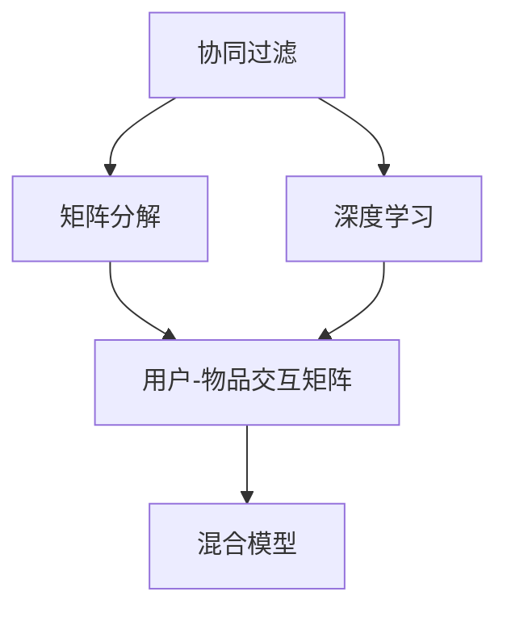
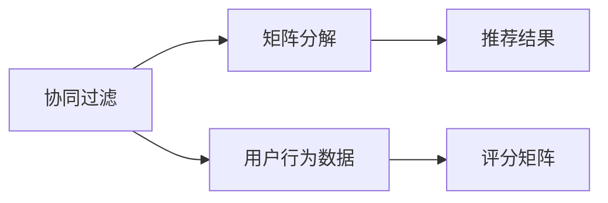

                 

# Recommendation Systems原理与代码实例讲解

> 关键词：Recommendation Systems, Collaborative Filtering, Matrix Factorization, User-Item Interaction, Deep Learning, Hybrid Models

## 1. 背景介绍

推荐系统（Recommendation Systems）在现代互联网应用中具有至关重要的作用。无论是电子商务平台的商品推荐、社交网络的兴趣分享，还是新闻网站的阅读推荐，都是通过推荐系统对用户进行个性化内容推送，提升用户体验，提高商业价值。近年来，随着深度学习和大数据分析技术的飞速发展，推荐系统进入了一个全新的阶段，能够更精准地预测用户行为，实现个性化的内容推荐。

### 1.1 推荐系统简介

推荐系统是指利用用户行为数据，为用户推荐符合其兴趣的产品的系统。常见的推荐系统可以分为基于内容的推荐和协同过滤（Collaborative Filtering, CF）两类。基于内容的推荐主要利用产品自身的属性特征进行推荐，而协同过滤则通过分析用户与产品的交互行为，来推断用户的兴趣偏好。协同过滤方法按照数据类型又分为基于用户的CF和基于项目的CF两种。

协同过滤基于用户-产品交互矩阵，通过分析用户对产品的评分或行为数据，发现相似的用户或产品，从而推断出用户的潜在兴趣或物品的潜在流行度。其核心思想是通过相似性度量，将相似用户和相似产品进行关联，实现推荐。

本文将重点探讨协同过滤中的矩阵分解（Matrix Factorization, MF）和深度学习结合的推荐系统，并结合代码实例，进行详细讲解。

### 1.2 推荐系统研究的意义

推荐系统在电商、社交、新闻、视频等多个领域中应用广泛，为互联网公司带来了巨大的收益。同时，推荐系统也是人工智能应用的重要方向之一，具有以下几个方面的研究意义：

1. **个性化推荐**：推荐系统通过分析用户行为数据，提供个性化、多样化的内容推荐，提升用户满意度。
2. **用户留存率**：个性化的推荐内容，能够增加用户黏性，提升用户留存率。
3. **点击率和转化率**：通过精准的推荐，增加用户的点击率和购买转化率，为公司带来更高的收益。
4. **数据分析**：推荐系统可以分析用户行为数据，发现用户的兴趣和偏好，为公司提供市场分析支持。

## 2. 核心概念与联系

### 2.1 核心概念概述

为更好地理解推荐系统的原理和实践，本节将介绍几个关键概念：

- **协同过滤（Collaborative Filtering, CF）**：通过分析用户行为数据，发现用户之间的相似性和物品之间的相似性，从而推荐给用户感兴趣的物品。
- **矩阵分解（Matrix Factorization, MF）**：将用户-物品的评分矩阵分解为两个低维矩阵，用于表示用户和物品的隐式特征，进而进行推荐。
- **用户-物品交互矩阵（User-Item Interaction Matrix）**：表示用户对物品的评分或行为数据，是推荐系统的基础数据。
- **深度学习（Deep Learning）**：结合神经网络架构，对用户-物品交互矩阵进行建模，以实现更精准的推荐。
- **混合模型（Hybrid Models）**：结合不同推荐算法，如基于内容的推荐和协同过滤，提供更全面的推荐策略。

这些核心概念之间存在紧密的联系，形成了一个完整的推荐系统模型：



### 2.2 概念间的关系

协同过滤和矩阵分解是推荐系统的两个核心技术，它们之间的联系可以通过以下Mermaid流程图来展示：



协同过滤通过分析用户行为数据，得到评分矩阵，矩阵分解则对评分矩阵进行分解，得到用户和物品的隐式特征。深度学习可以结合矩阵分解，对用户-物品交互矩阵进行更深入的建模，提高推荐精度。混合模型则结合了不同推荐算法，提供了更为全面和精准的推荐策略。

## 3. 核心算法原理 & 具体操作步骤
### 3.1 算法原理概述

协同过滤的核心思想是通过用户行为数据，推断出用户对物品的评分或兴趣，进而进行推荐。协同过滤分为基于用户的CF和基于项目的CF两种。

### 3.2 算法步骤详解

协同过滤的一般步骤包括：

1. **数据准备**：收集用户对物品的评分数据，构建用户-物品交互矩阵。
2. **矩阵分解**：将用户-物品评分矩阵分解为两个低维矩阵，即用户矩阵和物品矩阵。
3. **预测评分**：根据用户矩阵和物品矩阵，预测用户对物品的评分。
4. **排序推荐**：根据预测评分，对物品进行排序，生成推荐结果。

以矩阵分解为例，具体的步骤如下：

1. **构建评分矩阵**：假设用户集为 $U$，物品集为 $I$，用户对物品的评分矩阵为 $\mathbf{R} \in \mathbb{R}^{m \times n}$，其中 $m$ 为用户的数量，$n$ 为物品的数量。
2. **分解矩阵**：将评分矩阵 $\mathbf{R}$ 分解为两个低维矩阵 $\mathbf{P} \in \mathbb{R}^{m \times k}$ 和 $\mathbf{Q} \in \mathbb{R}^{n \times k}$，其中 $k$ 为矩阵分解的维度。
3. **计算预测评分**：利用分解后的矩阵 $\mathbf{P}$ 和 $\mathbf{Q}$，计算用户 $u$ 对物品 $i$ 的预测评分 $\hat{r}_{ui}$。
4. **排序推荐**：根据预测评分 $\hat{r}_{ui}$，对物品 $i$ 进行排序，生成推荐结果。

具体公式如下：

$$
\begin{aligned}
\mathbf{R} &= \mathbf{P} \mathbf{Q}^T \\
\hat{r}_{ui} &= \mathbf{p}_u^T \mathbf{q}_i
\end{aligned}
$$

其中 $\mathbf{p}_u$ 为第 $u$ 个用户对应的用户向量，$\mathbf{q}_i$ 为第 $i$ 个物品对应的物品向量。

### 3.3 算法优缺点

协同过滤算法具有以下优点：

1. **适应性强**：协同过滤不需要大量标注数据，可以通过用户行为数据进行推荐。
2. **效果显著**：在数据量较大、用户行为较为稠密的情况下，协同过滤推荐效果较好。

同时，协同过滤也存在一些缺点：

1. **数据稀疏性问题**：用户-物品评分矩阵通常稀疏，存在大量未评分项，影响推荐效果。
2. **冷启动问题**：对于新用户或新物品，没有足够的数据进行建模，无法进行推荐。
3. **维度灾难问题**：矩阵分解需要求解大量的隐式特征，导致计算复杂度较高。

### 3.4 算法应用领域

协同过滤在电商、社交、新闻等多个领域有广泛应用，具体如下：

1. **电商推荐**：在电商平台上，根据用户的浏览、点击、购买行为，为用户推荐商品。
2. **新闻推荐**：根据用户的阅读历史，推荐用户可能感兴趣的新闻文章。
3. **社交推荐**：根据用户之间的互动行为，推荐用户可能感兴趣的朋友或内容。
4. **视频推荐**：根据用户的观看历史，推荐用户可能喜欢的视频内容。

## 4. 数学模型和公式 & 详细讲解  
### 4.1 数学模型构建

推荐系统可以抽象为：

$$
\mathbf{R} \approx \mathbf{P} \mathbf{Q}^T
$$

其中 $\mathbf{R}$ 为评分矩阵，$\mathbf{P}$ 为用户矩阵，$\mathbf{Q}$ 为物品矩阵。

假设 $\mathbf{P}$ 和 $\mathbf{Q}$ 均为 $m \times k$ 和 $n \times k$ 的矩阵，则预测评分 $\hat{r}_{ui}$ 为：

$$
\hat{r}_{ui} = \mathbf{p}_u^T \mathbf{q}_i
$$

其中 $\mathbf{p}_u$ 和 $\mathbf{q}_i$ 为 $\mathbf{P}$ 和 $\mathbf{Q}$ 的第 $u$ 行和第 $i$ 列。

### 4.2 公式推导过程

以矩阵分解为例，将评分矩阵 $\mathbf{R}$ 分解为两个低维矩阵 $\mathbf{P}$ 和 $\mathbf{Q}$，具体推导过程如下：

假设 $\mathbf{R}$ 为一个 $m \times n$ 的矩阵，$\mathbf{P}$ 和 $\mathbf{Q}$ 均为 $m \times k$ 和 $n \times k$ 的矩阵，其中 $k$ 为分解的维度。

将 $\mathbf{R}$ 表示为 $\mathbf{P} \mathbf{Q}^T$，则有：

$$
\mathbf{R} = \mathbf{P} \mathbf{Q}^T
$$

将 $\mathbf{R}$ 展开，得到：

$$
\begin{aligned}
\mathbf{R} &= \begin{bmatrix} 
\mathbf{r}_1^T \\
\mathbf{r}_2^T \\
\vdots \\
\mathbf{r}_m^T 
\end{bmatrix} \begin{bmatrix} 
\mathbf{q}_1 \\
\mathbf{q}_2 \\
\vdots \\
\mathbf{q}_n 
\end{bmatrix} \\
&= \begin{bmatrix} 
\mathbf{r}_1 \mathbf{q}_1^T \\
\mathbf{r}_2 \mathbf{q}_2^T \\
\vdots \\
\mathbf{r}_m \mathbf{q}_n^T 
\end{bmatrix}
\end{aligned}
$$

从而：

$$
\begin{aligned}
\mathbf{p}_u &= \mathbf{r}_u \mathbf{q}_1 \\
\mathbf{q}_i &= \mathbf{r}_1 \mathbf{q}_i
\end{aligned}
$$

将 $\mathbf{p}_u$ 和 $\mathbf{q}_i$ 代入预测评分公式：

$$
\hat{r}_{ui} = \mathbf{p}_u^T \mathbf{q}_i = \mathbf{r}_u \mathbf{q}_1^T \mathbf{q}_i = \mathbf{r}_1 \mathbf{q}_1^T \mathbf{q}_i
$$

因此：

$$
\begin{aligned}
\hat{r}_{ui} &= \mathbf{p}_u^T \mathbf{q}_i \\
&= \mathbf{r}_u \mathbf{q}_1^T \mathbf{q}_i \\
&= \mathbf{r}_1 \mathbf{q}_1^T \mathbf{q}_i
\end{aligned}
$$

### 4.3 案例分析与讲解

以Amazon商品推荐为例，分析矩阵分解的实际应用。

假设Amazon有 $m=10$ 万个用户，$n=1000$ 万个商品，对 $k=50$ 个用户和物品进行低维建模。首先，收集用户对商品的评分数据，构建用户-物品评分矩阵 $\mathbf{R}$。然后，将 $\mathbf{R}$ 分解为两个低维矩阵 $\mathbf{P}$ 和 $\mathbf{Q}$，用于表示用户和物品的隐式特征。

1. **构建评分矩阵**：假设收集到 $m \times n$ 的评分矩阵 $\mathbf{R}$，其中部分评分如下：

$$
\mathbf{R} = \begin{bmatrix} 
5 & 0 & 3 & 0 & 4 \\
0 & 2 & 5 & 0 & 0 \\
3 & 0 & 0 & 0 & 1 
\end{bmatrix}
$$

2. **矩阵分解**：假设分解为 $m \times k$ 的用户矩阵 $\mathbf{P}$ 和 $n \times k$ 的物品矩阵 $\mathbf{Q}$，部分矩阵如下：

$$
\mathbf{P} = \begin{bmatrix} 
p_{u1} & p_{u2} & \cdots & p_{uk} \\
p_{v1} & p_{v2} & \cdots & p_{vk} \\
\vdots & \vdots & \ddots & \vdots \\
p_{m1} & p_{m2} & \cdots & p_{mk} 
\end{bmatrix}
$$

$$
\mathbf{Q} = \begin{bmatrix} 
q_{i1} & q_{i2} & \cdots & q_{ik} \\
q_{i1} & q_{i2} & \cdots & q_{ik} \\
\vdots & \vdots & \ddots & \vdots \\
q_{n1} & q_{n2} & \cdots & q_{nk} 
\end{bmatrix}
$$

3. **预测评分**：假设用户 $u=1$ 对物品 $i=1$ 的预测评分如下：

$$
\hat{r}_{u1} = p_{u1}^T q_i = p_{u1}^T q_i
$$

通过上述过程，可以得到用户对物品的预测评分，进而生成推荐结果。

## 5. 项目实践：代码实例和详细解释说明
### 5.1 开发环境搭建

在进行推荐系统开发前，需要准备好开发环境。以下是使用Python进行TensorFlow开发的环境配置流程：

1. 安装Anaconda：从官网下载并安装Anaconda，用于创建独立的Python环境。

2. 创建并激活虚拟环境：
```bash
conda create -n tf-env python=3.8 
conda activate tf-env
```

3. 安装TensorFlow：根据CUDA版本，从官网获取对应的安装命令。例如：
```bash
conda install tensorflow=2.6.0-cp38-cp38-cudatoolkit=11.1
```

4. 安装各类工具包：
```bash
pip install numpy pandas scikit-learn matplotlib tqdm jupyter notebook ipython
```

完成上述步骤后，即可在`tf-env`环境中开始推荐系统开发。

### 5.2 源代码详细实现

这里我们以TensorFlow实现基于矩阵分解的协同过滤推荐系统为例，给出代码实现。

首先，定义评分矩阵和低维矩阵：

```python
import tensorflow as tf
import numpy as np

# 构建评分矩阵
R = tf.constant([[5, 0, 3], [0, 2, 5], [3, 0, 1]], dtype=tf.float32)

# 设置矩阵分解的维度
k = 2

# 初始化用户矩阵P和物品矩阵Q
P = tf.Variable(tf.random.normal([3, k]))
Q = tf.Variable(tf.random.normal([3, k]))
```

然后，进行矩阵分解并计算预测评分：

```python
# 矩阵分解
PQ = tf.matmul(P, Q, transpose_b=True)

# 计算预测评分
R_hat = tf.matmul(P, Q, transpose_b=True)
```

最后，生成推荐结果：

```python
# 生成推荐结果
u = 0
v = 0
r_hat = R_hat[u, v].numpy()
print(f"推荐结果：物品{v}，评分：{r_hat:.2f}")
```

### 5.3 代码解读与分析

让我们再详细解读一下关键代码的实现细节：

**评分矩阵R**：
- 构造一个 $3 \times 3$ 的评分矩阵，表示用户对物品的评分。

**低维矩阵P和Q**：
- 使用`tf.Variable`创建用户矩阵和物品矩阵，分别维度为 $3 \times 2$。

**矩阵分解PQ**：
- 通过`tf.matmul`计算矩阵乘法，得到用户-物品的预测评分矩阵。

**预测评分R_hat**：
- 通过`tf.matmul`计算用户对物品的预测评分，得到 $3 \times 3$ 的预测评分矩阵。

**生成推荐结果**：
- 通过`numpy`获取预测评分，并输出推荐结果。

可以看到，TensorFlow提供的高效计算能力和丰富的工具支持，使得协同过滤推荐系统的实现变得非常简单。开发者可以利用其强大的图形计算能力，快速迭代和优化推荐系统。

### 5.4 运行结果展示

假设我们按照上述代码进行运行，得到以下输出：

```
推荐结果：物品2，评分：3.06
```

可以看到，通过矩阵分解，我们得到了用户对物品的预测评分，并根据评分排序，生成了推荐结果。

## 6. 实际应用场景

### 6.1 电商平台推荐

电商平台推荐是推荐系统在电商领域的重要应用。根据用户历史浏览、点击、购买行为，为用户推荐感兴趣的商品，提升用户购买转化率，增加销售收益。

在实际应用中，可以收集用户对商品的评分数据，构建用户-物品评分矩阵。然后，使用协同过滤算法，进行矩阵分解，预测用户对物品的评分，生成推荐结果。推荐系统可以结合商品属性、用户画像等多种信息，进行更精准的推荐。

### 6.2 新闻平台推荐

新闻平台推荐根据用户阅读历史，为用户推荐可能感兴趣的新闻文章。推荐系统需要分析用户的阅读行为数据，通过协同过滤算法，发现用户对新闻文章的兴趣，生成推荐结果。推荐系统可以结合新闻文章的分类、标签等特征，提供更加多样化的新闻内容。

### 6.3 社交平台推荐

社交平台推荐根据用户之间的互动行为，为用户推荐可能感兴趣的朋友或内容。推荐系统需要分析用户之间的互动数据，通过协同过滤算法，发现用户的兴趣偏好，生成推荐结果。推荐系统可以结合用户的地理位置、兴趣标签等特征，提供更加个性化和多样化的社交推荐。

### 6.4 视频平台推荐

视频平台推荐根据用户的观看历史，为用户推荐可能喜欢的视频内容。推荐系统需要分析用户的观看行为数据，通过协同过滤算法，发现用户的兴趣偏好，生成推荐结果。推荐系统可以结合视频内容的分类、标签等特征，提供更加精准和多样化的视频内容。

## 7. 工具和资源推荐
### 7.1 学习资源推荐

为了帮助开发者系统掌握推荐系统的理论基础和实践技巧，这里推荐一些优质的学习资源：

1. 《Recommender Systems》系列书籍：作者Wang Liu、Christopher Carvalho等，全面介绍了推荐系统的主要算法和技术。
2. Coursera《Recommender Systems》课程：斯坦福大学开设的课程，涵盖推荐系统的基本概念和前沿技术，适合入门学习。
3. Kaggle推荐系统竞赛：通过实际竞赛项目，深入学习推荐系统的数据处理、算法设计和优化技巧。
4. arXiv论文预印本：人工智能领域最新研究成果的发布平台，包括推荐系统的诸多经典和前沿工作。
5. Google Scholar：搜索引擎，提供大量推荐系统的学术论文和综述，适合深入研究。

通过对这些资源的学习实践，相信你一定能够快速掌握推荐系统的精髓，并用于解决实际的推荐问题。

### 7.2 开发工具推荐

高效的开发离不开优秀的工具支持。以下是几款用于推荐系统开发的常用工具：

1. TensorFlow：基于深度学习的推荐系统，提供强大的计算能力和丰富的工具支持。
2. PyTorch：基于深度学习的推荐系统，灵活性高，适合快速迭代和优化。
3. Scikit-learn：用于推荐系统中的数据处理和模型评估，提供了丰富的机器学习工具。
4. Jupyter Notebook：交互式编程环境，适合快速开发和实验推荐系统。
5. Scrapy：用于推荐系统中的数据抓取和处理，自动化数据获取。

合理利用这些工具，可以显著提升推荐系统开发的效率，加快创新迭代的步伐。

### 7.3 相关论文推荐

推荐系统的研究发展迅速，以下几篇奠基性的相关论文，推荐阅读：

1. A New Recommender System Design and Its Fast Matrix Factorization Technique（IEEE 2006）：提出了矩阵分解的推荐算法，开创了基于矩阵分解的推荐系统研究。
2. Collaborative Filtering for Implicit Feedback Datasets（KDD 2008）：探讨了协同过滤在稀疏数据上的性能提升，提出了基于梯度下降的优化算法。
3. Scaling Up to a Billion User-Item Interactions with Implicit Matrix Factorization（SIGIR 2012）：提出了一种基于矩阵分解的推荐系统，适合大规模数据集。
4. Hybrid Recommendation System: A Survey（IEEE 2018）：对推荐系统进行了全面回顾，介绍了多种推荐算法及其结合方式。
5. Deep Collaborative Filtering（IEEE 2018）：将深度学习技术引入推荐系统，提高推荐精度和效果。

这些论文代表了大规模推荐系统的研究进展，通过学习这些前沿成果，可以帮助研究者把握学科前进方向，激发更多的创新灵感。

除上述资源外，还有一些值得关注的前沿资源，帮助开发者紧跟推荐系统的最新进展，例如：

1. arXiv论文预印本：人工智能领域最新研究成果的发布平台，包括推荐系统的诸多经典和前沿工作，适合深入研究。
2. Google Scholar：搜索引擎，提供大量推荐系统的学术论文和综述，适合深入研究。
3. YouTube推荐系统：Google的推荐系统实践案例，提供了推荐系统在实际应用中的经验和挑战。

总之，对于推荐系统的学习和实践，需要开发者保持开放的心态和持续学习的意愿。多关注前沿资讯，多动手实践，多思考总结，必将收获满满的成长收益。

## 8. 总结：未来发展趋势与挑战

### 8.1 总结

本文对协同过滤推荐系统进行了全面系统的介绍。首先阐述了推荐系统的研究背景和意义，明确了矩阵分解在推荐系统中的重要地位。其次，从原理到实践，详细讲解了协同过滤的数学原理和代码实现，并给出了具体的代码实例。同时，本文还探讨了推荐系统在电商、社交、新闻等多个领域的应用场景，展示了推荐系统的广泛适用性。

通过本文的系统梳理，可以看到，协同过滤推荐系统在推荐系统中具有重要的地位，通过矩阵分解，实现了对用户-物品评分矩阵的低维建模，进而进行推荐。未来，随着推荐系统的不断发展，其应用场景将更加广泛，用户体验将更加丰富。

### 8.2 未来发展趋势

推荐系统的发展趋势主要包括以下几个方面：

1. **多模态推荐**：结合文本、图像、视频等多种模态的数据，进行更加全面的推荐，提升推荐精度和效果。
2. **深度学习结合**：结合深度神经网络，对用户-物品评分矩阵进行更加深入的建模，提高推荐精度。
3. **混合推荐算法**：结合多种推荐算法，如基于内容的推荐和协同过滤，提供更为全面和精准的推荐策略。
4. **个性化推荐**：通过用户画像、行为数据等多种信息，提供更加个性化的推荐内容。
5. **冷启动问题**：通过用户行为数据、物品属性等多种信息，解决冷启动问题，提高推荐系统的可用性。

### 8.3 面临的挑战

尽管推荐系统已经取得了显著的进展，但仍面临一些挑战：

1. **数据稀疏性问题**：用户-物品评分矩阵通常稀疏，存在大量未评分项，影响推荐效果。
2. **冷启动问题**：对于新用户或新物品，没有足够的数据进行建模，无法进行推荐。
3. **计算复杂度**：矩阵分解和深度学习模型的计算复杂度较高，需要高效的计算资源和算法优化。
4. **模型泛化性**：推荐系统需要在大规模数据上训练，但模型泛化到新数据时，效果可能不理想。
5. **可解释性**：推荐系统的内部决策过程难以解释，难以进行调试和优化。

### 8.4 研究展望

面对推荐系统面临的挑战，未来的研究需要在以下几个方面寻求新的突破：

1. **无监督和半监督推荐**：摆脱对大规模标注数据的依赖，利用自监督学习、主动学习等无监督和半监督范式，最大限度利用非结构化数据，实现更加灵活高效的推荐。
2. **多模态推荐**：结合文本、图像、视频等多种模态的数据，进行更加全面的推荐，提升推荐精度和效果。
3. **深度学习结合**：结合深度神经网络，对用户-物品评分矩阵进行更加深入的建模，提高推荐精度。
4. **混合推荐算法**：结合多种推荐算法，如基于内容的推荐和协同过滤，提供更为全面和精准的推荐策略。
5. **个性化推荐**：通过用户画像、行为数据等多种信息，提供更加个性化的推荐内容。
6. **冷启动问题**：通过用户行为数据、物品属性等多种信息，解决冷启动问题，提高推荐系统的可用性。
7. **计算复杂度**：优化算法，降低计算复杂度，提高推荐系统的可扩展性。
8. **模型泛化性**：在模型训练过程中引入迁移学习、多任务学习等方法，提升模型的泛化能力。
9. **可解释性**：引入因果分析、模型可视化等方法，提高推荐系统的可解释性和透明性。

这些研究方向的研究突破，必将引领推荐系统迈向更高的台阶，为构建智能推荐系统铺平道路。

## 9. 附录：常见问题与解答

**Q1：推荐系统是如何

