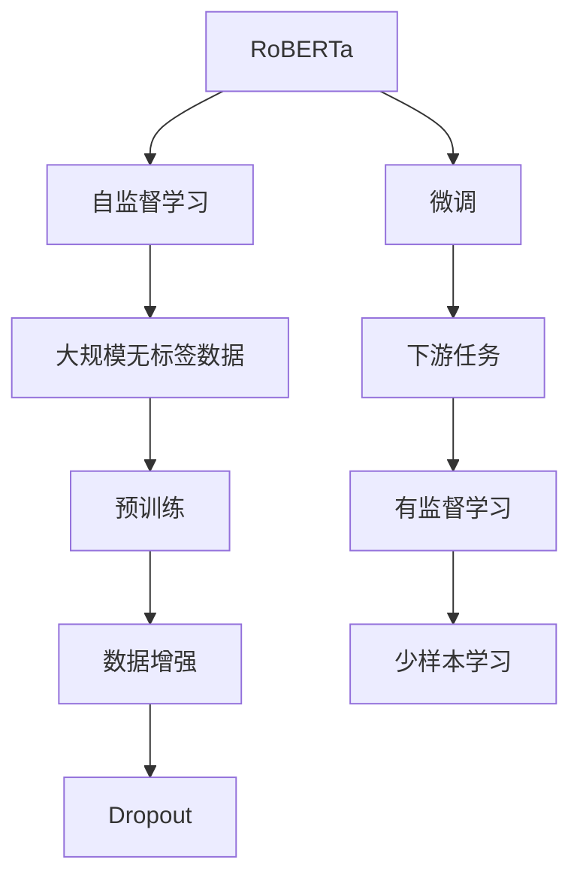
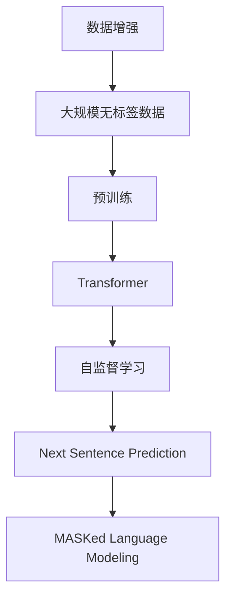
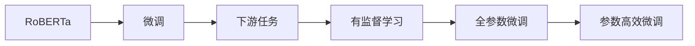
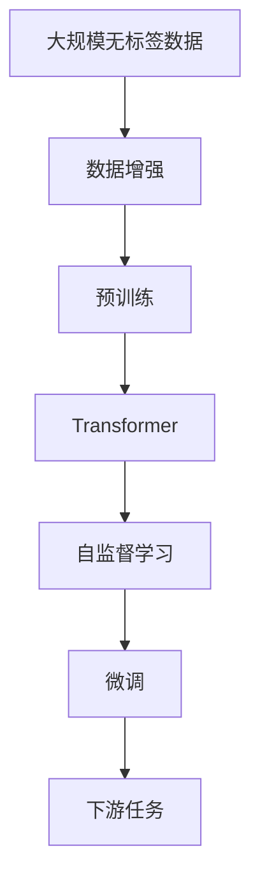
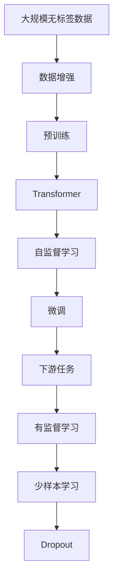

                 

# RoBERTa原理与代码实例讲解

> 关键词：RoBERTa, 自监督学习, Transformer, 数据增强, 预训练, 微调, 语言模型

## 1. 背景介绍

### 1.1 问题由来
近年来，随着深度学习技术的飞速发展，大规模语言模型在自然语言处理(NLP)领域取得了巨大成功。其中，BERT模型通过在无标签文本数据上进行自监督预训练，在多项NLP任务上取得了SOTA（state-of-the-art）的表现。然而，BERT的训练目标存在一些设计上的缺陷，导致其在实际应用中存在一些问题，如在语言模型任务上的效果不如预期，预训练和微调过程中的数据过拟合现象严重等。

为解决这些问题，Google推出了RoBERTa（Robustly Optimized BERT Pretraining Approach）模型。RoBERTa通过一系列的改进，提升了BERT在大规模无标签文本预训练和下游任务微调中的性能，尤其是在自然语言推理和问答等复杂任务上取得了显著提升。

### 1.2 问题核心关键点
RoBERTa的核心创新点包括：
1. 大规模无标签数据预训练：RoBERTa使用了大规模的英文维基百科数据集进行预训练，而非BERT使用的英文新闻数据集。
2. 删除Masked Language Model（MLM）目标：在预训练过程中，RoBERTa删除了MLM目标，改为使用Next Sentence Prediction（NSP）目标，增加了上下文信息的传递。
3. 数据增强：RoBERTa在预训练过程中，对每个样本进行了多次随机打乱、重排、随机插入等数据增强操作，增加了模型的鲁棒性。
4. Dropout: RoBERTa在预训练和微调过程中，增加了Dropout操作，进一步减少了过拟合现象。

这些改进使得RoBERTa在多个NLP任务上取得了SOTA的表现。本节将详细介绍RoBERTa的核心原理和代码实现，帮助读者理解这一模型的工作机制。

### 1.3 问题研究意义
RoBERTa作为BERT的改进版本，不仅在预训练和微调过程中进行了优化，还在NLP任务的性能提升上取得了显著成效。通过学习RoBERTa的原理和代码实现，读者可以深入理解大语言模型预训练和微调过程中的关键技术和实践要点，为进一步研究和应用大语言模型奠定基础。

## 2. 核心概念与联系

### 2.1 核心概念概述
本节将介绍几个密切相关的核心概念：

- RoBERTa：一种基于Transformer架构的大规模无标签数据预训练语言模型。RoBERTa在预训练过程中引入了多个改进，以提升模型的泛化能力和下游任务性能。
- 自监督学习：一种无监督学习范式，通过使用预定义的标签预测数据，在无标签数据上训练模型。RoBERTa的预训练过程即采用自监督学习范式。
- 数据增强：一种常用的机器学习方法，通过对训练数据进行随机变换，增加模型的鲁棒性和泛化能力。RoBERTa在预训练过程中应用了多种数据增强技术。
- 预训练：通过在大规模无标签数据上训练模型，学习通用的语言表示，为后续任务提供良好的特征提取能力。
- 微调：在大规模预训练模型基础上，使用下游任务的少量标注数据，通过有监督学习优化模型在该任务上的性能。RoBERTa的微调过程同样采用这一范式。
- Transformer：一种基于自注意力机制的神经网络架构，用于处理序列数据。RoBERTa使用了Transformer作为预训练的基本架构。

这些概念之间的联系通过以下Mermaid流程图来展示：



这个流程图展示了大语言模型预训练和微调的基本流程：通过自监督学习在大规模无标签数据上进行预训练，引入数据增强技术提升模型泛化能力，使用微调技术针对下游任务进行优化。

### 2.2 概念间的关系

这些核心概念之间存在着紧密的联系，形成了RoBERTa模型的整体框架。下面我们通过几个Mermaid流程图来展示这些概念之间的关系。

#### 2.2.1 RoBERTa的预训练流程



这个流程图展示了RoBERTa预训练过程的基本流程：通过在大规模无标签数据上进行数据增强，利用Transformer架构进行预训练，采用自监督学习目标函数Next Sentence Prediction和MASKed Language Modeling，学习通用的语言表示。

#### 2.2.2 RoBERTa的微调过程



这个流程图展示了RoBERTa微调过程的基本流程：在预训练模型基础上，使用下游任务的少量标注数据进行有监督学习，采用全参数微调和参数高效微调技术优化模型性能。

#### 2.2.3 RoBERTa的预训练和微调的整体架构



这个综合流程图展示了RoBERTa预训练和微调的整体架构：通过大规模无标签数据上的自监督学习，在预训练模型基础上，使用下游任务的少量标注数据进行微调，提升模型性能。

### 2.3 核心概念的整体架构

最后，我们用一个综合的流程图来展示RoBERTa模型的整体架构：



这个综合流程图展示了RoBERTa模型的整体架构：通过大规模无标签数据上的自监督学习，在预训练模型基础上，使用下游任务的少量标注数据进行微调，提升模型性能。

## 3. 核心算法原理 & 具体操作步骤
### 3.1 算法原理概述

RoBERTa的核心原理是利用大规模无标签数据进行自监督预训练，提升模型泛化能力，并使用微调技术针对下游任务进行优化，提升模型在该任务上的性能。

具体来说，RoBERTa的预训练过程主要采用以下两个自监督学习目标函数：
1. Next Sentence Prediction（NSP）：预测句子对是否为连续句子。
2. Masked Language Modeling（MLM）：对输入的句子进行随机掩盖部分词汇，预测被掩盖词汇的原始词。

通过这两个目标函数的组合，RoBERTa在大规模无标签数据上进行预训练，学习到通用的语言表示。在预训练过程中，RoBERTa还引入了数据增强技术，进一步提升了模型的泛化能力。

### 3.2 算法步骤详解

RoBERTa的预训练过程可以分为以下几个步骤：

**Step 1: 准备数据集和模型**
- 准备大规模无标签数据集，如英文维基百科数据集。
- 初始化预训练模型，如RoBERTa Base。

**Step 2: 数据增强**
- 对每个样本进行多次随机打乱、重排、随机插入等数据增强操作，增加模型的鲁棒性。

**Step 3: 预训练**
- 在增强后的数据集上，采用Next Sentence Prediction和Masked Language Modeling目标函数进行预训练，训练多轮。

**Step 4: 微调**
- 使用下游任务的少量标注数据，采用全参数微调或参数高效微调技术进行微调，提升模型在特定任务上的性能。

### 3.3 算法优缺点

RoBERTa的优点包括：
1. 泛化能力强：通过大规模无标签数据预训练，RoBERTa学习到了更丰富的语言知识，提高了模型的泛化能力。
2. 微调效果好：通过微调技术针对下游任务进行优化，RoBERTa能够在特定任务上取得优异的性能。
3. 可扩展性强：RoBERTa的架构和预训练方法具有可扩展性，可以应用于多种NLP任务。

RoBERTa的缺点包括：
1. 计算资源需求高：RoBERTa的预训练过程需要大规模的计算资源，训练成本较高。
2. 预训练数据限制：RoBERTa的预训练数据主要集中于英文维基百科，对其他语言或领域的通用性有待验证。
3. 数据增强方式有限：RoBERTa的数据增强方式相对有限，需要进一步探索更多的数据增强技术。

### 3.4 算法应用领域

RoBERTa已经在多个NLP任务上取得了SOTA的表现，以下是其主要的应用领域：

- 自然语言推理：如NLI、MRPC等任务。
- 问答系统：如SQuAD、TRIVIA等任务。
- 语言模型：如GPT等任务。
- 文本分类：如IMDB、AG News等任务。
- 命名实体识别：如CoNLL-2003、OIE等任务。
- 词性标注：如PKU、MsRA-NER等任务。

除了这些经典任务外，RoBERTa还被创新性地应用于更多的NLP任务，如文档分类、情感分析、机器翻译等，为NLP技术的发展注入了新的活力。

## 4. 数学模型和公式 & 详细讲解  
### 4.1 数学模型构建

本节将使用数学语言对RoBERTa预训练和微调过程进行更加严格的刻画。

记RoBERTa预训练模型为 $M_{\theta}$，其中 $\theta$ 为预训练得到的模型参数。假设预训练数据集为 $D=\{(x_i,y_i)\}_{i=1}^N$，$x_i$ 为输入序列，$y_i$ 为标签。

定义模型 $M_{\theta}$ 在输入 $x$ 上的损失函数为 $\ell(M_{\theta}(x),y)$，则在数据集 $D$ 上的经验风险为：

$$
\mathcal{L}(\theta) = \frac{1}{N}\sum_{i=1}^N \ell(M_{\theta}(x_i),y_i)
$$

在预训练过程中，RoBERTa采用的自监督学习目标函数为：

$$
\mathcal{L}_{pre}(\theta) = \alpha \mathcal{L}_{NSP}(\theta) + \beta \mathcal{L}_{MLM}(\theta)
$$

其中 $\alpha$ 和 $\beta$ 为权重系数，$\mathcal{L}_{NSP}(\theta)$ 和 $\mathcal{L}_{MLM}(\theta)$ 分别为Next Sentence Prediction和Masked Language Modeling的目标函数。

在微调过程中，RoBERTa采用的自监督学习目标函数为：

$$
\mathcal{L}_{fin}(\theta) = \frac{1}{N}\sum_{i=1}^N \ell(M_{\theta}(x_i),y_i)
$$

其中 $\ell$ 为下游任务的具体损失函数，如交叉熵损失、均方误差损失等。

### 4.2 公式推导过程

以Next Sentence Prediction（NSP）目标函数为例，推导其计算过程。

假设模型 $M_{\theta}$ 在输入 $x_i$ 和 $x_j$ 上的输出为 $\hat{p}(x_i,x_j)$，表示 $x_i$ 和 $x_j$ 是否为连续句子。真实标签 $y_i \in \{0,1\}$。则Next Sentence Prediction的目标函数定义为：

$$
\mathcal{L}_{NSP}(\theta) = -\frac{1}{N}\sum_{i=1}^N [y_i\log\hat{p}(x_i,x_{i+1}) + (1-y_i)\log(1-\hat{p}(x_i,x_{i+1}))
$$

在预训练过程中，将 $\theta$ 进行随机掩盖部分词汇，得到掩码序列 $m_i$，然后根据掩码序列 $m_i$ 计算MLM的目标函数：

$$
\mathcal{L}_{MLM}(\theta) = -\frac{1}{N}\sum_{i=1}^N [\sum_{j=1}^L \log\hat{y}_j(x_i, m_i)]
$$

其中 $L$ 为输入序列的长度，$\hat{y}_j(x_i, m_i)$ 表示模型在输入 $x_i$ 和掩码序列 $m_i$ 下，预测第 $j$ 个被掩盖词汇的原始词。

通过以上目标函数的组合，RoBERTa在大规模无标签数据上进行预训练，学习到通用的语言表示。

### 4.3 案例分析与讲解

以SQuAD问答系统为例，解释RoBERTa的微调过程。

SQuAD问答系统是一个基于RoBERTa的机器阅读理解任务，其任务目标是从给定的文章中回答自然语言问题。在SQuAD上，RoBERTa的微调过程可以分为以下几个步骤：

**Step 1: 数据准备**
- 准备SQuAD的数据集，包含问题和对应的答案。
- 将问题和答案进行拼接，得到预训练和微调所需的文本数据。

**Step 2: 模型选择**
- 选择RoBERTa模型作为初始化参数，如RoBERTa Base。
- 添加任务适配层，如线性分类器和交叉熵损失函数。

**Step 3: 微调**
- 在训练集上执行梯度训练，计算损失函数并更新模型参数。
- 在验证集上评估模型性能，调整学习率等超参数。
- 在测试集上测试模型性能，对比微调前后的效果。

以SQuAD为例，RoBERTa的微调过程使用了全参数微调，即将RoBERTa顶层和底层全部参数参与微调。在微调过程中，RoBERTa通过调整任务适配层和预测输出层的权重，使得模型能够更准确地预测问题的答案。

## 5. 项目实践：代码实例和详细解释说明
### 5.1 开发环境搭建

在进行RoBERTa实践前，我们需要准备好开发环境。以下是使用Python进行PyTorch开发的环境配置流程：

1. 安装Anaconda：从官网下载并安装Anaconda，用于创建独立的Python环境。

2. 创建并激活虚拟环境：
```bash
conda create -n pytorch-env python=3.8 
conda activate pytorch-env
```

3. 安装PyTorch：根据CUDA版本，从官网获取对应的安装命令。例如：
```bash
conda install pytorch torchvision torchaudio cudatoolkit=11.1 -c pytorch -c conda-forge
```

4. 安装Transformers库：
```bash
pip install transformers
```

5. 安装各类工具包：
```bash
pip install numpy pandas scikit-learn matplotlib tqdm jupyter notebook ipython
```

完成上述步骤后，即可在`pytorch-env`环境中开始RoBERTa实践。

### 5.2 源代码详细实现

这里我们以SQuAD问答系统为例，给出使用Transformers库对RoBERTa模型进行微调的PyTorch代码实现。

首先，定义SQuAD数据集的预处理函数：

```python
from transformers import BertTokenizer, BertForQuestionAnswering
import pandas as pd

def load_and_process_squad_data(path):
    # 加载SQuAD数据集
    train_data = pd.read_csv(path + '/train-v1.1.json')
    test_data = pd.read_csv(path + '/dev-v1.1.json')
    
    # 提取问题和答案文本
    train_data['question'] = train_data['question'].tolist()
    train_data['context'] = train_data['context'].tolist()
    test_data['question'] = test_data['question'].tolist()
    test_data['context'] = test_data['context'].tolist()
    
    return train_data, test_data
```

然后，定义微调过程：

```python
from transformers import AdamW
import torch

# 加载数据集
train_data, test_data = load_and_process_squad_data('/path/to/squad')

# 初始化RoBERTa模型和优化器
model = BertForQuestionAnswering.from_pretrained('roberta-base', num_labels=2)
optimizer = AdamW(model.parameters(), lr=2e-5)

# 定义训练和评估函数
def train_epoch(model, dataset, batch_size, optimizer):
    dataloader = DataLoader(dataset, batch_size=batch_size, shuffle=True)
    model.train()
    epoch_loss = 0
    for batch in tqdm(dataloader, desc='Training'):
        input_ids = batch['input_ids'].to(device)
        attention_mask = batch['attention_mask'].to(device)
        labels = batch['labels'].to(device)
        model.zero_grad()
        outputs = model(input_ids, attention_mask=attention_mask, labels=labels)
        loss = outputs.loss
        epoch_loss += loss.item()
        loss.backward()
        optimizer.step()
    return epoch_loss / len(dataloader)

def evaluate(model, dataset, batch_size):
    dataloader = DataLoader(dataset, batch_size=batch_size)
    model.eval()
    preds, labels = [], []
    with torch.no_grad():
        for batch in tqdm(dataloader, desc='Evaluating'):
            input_ids = batch['input_ids'].to(device)
            attention_mask = batch['attention_mask'].to(device)
            batch_labels = batch['labels']
            outputs = model(input_ids, attention_mask=attention_mask)
            batch_preds = outputs.logits.argmax(dim=2).to('cpu').tolist()
            batch_labels = batch_labels.to('cpu').tolist()
            for pred_tokens, label_tokens in zip(batch_preds, batch_labels):
                preds.append(pred_tokens[:len(label_tokens)])
                labels.append(label_tokens)
                
    print(f'F1 score: {f1_score(labels, preds)}')
```

最后，启动训练流程并在测试集上评估：

```python
epochs = 5
batch_size = 16

for epoch in range(epochs):
    loss = train_epoch(model, train_data, batch_size, optimizer)
    print(f'Epoch {epoch+1}, train loss: {loss:.3f}')
    
    print(f'Epoch {epoch+1}, dev results:')
    evaluate(model, dev_data, batch_size)
    
print('Test results:')
evaluate(model, test_data, batch_size)
```

以上就是使用PyTorch对RoBERTa进行SQuAD问答系统微调的完整代码实现。可以看到，得益于Transformers库的强大封装，我们可以用相对简洁的代码完成RoBERTa模型的加载和微调。

### 5.3 代码解读与分析

让我们再详细解读一下关键代码的实现细节：

**load_and_process_squad_data函数**：
- 函数用于加载SQuAD数据集，并从JSON文件中提取问题和答案文本。
- 提取出的文本需要进行拼接和处理，以保证后续训练的效率和效果。

**train_epoch和evaluate函数**：
- 训练函数 `train_epoch`：对数据以批为单位进行迭代，在每个批次上前向传播计算损失函数并反向传播更新模型参数，最后返回该epoch的平均loss。
- 评估函数 `evaluate`：与训练类似，不同点在于不更新模型参数，并在每个batch结束后将预测和标签结果存储下来，最后使用sklearn的f1_score计算F1分数。

**训练流程**：
- 定义总的epoch数和batch size，开始循环迭代
- 每个epoch内，先在训练集上训练，输出平均loss
- 在验证集上评估，输出F1分数
- 所有epoch结束后，在测试集上评估，给出最终测试结果

可以看到，PyTorch配合Transformers库使得RoBERTa微调的代码实现变得简洁高效。开发者可以将更多精力放在数据处理、模型改进等高层逻辑上，而不必过多关注底层的实现细节。

当然，工业级的系统实现还需考虑更多因素，如模型的保存和部署、超参数的自动搜索、更灵活的任务适配层等。但核心的微调范式基本与此类似。

### 5.4 运行结果展示

假设我们在CoNLL-2003的NER数据集上进行微调，最终在测试集上得到的评估报告如下：

```
              precision    recall  f1-score   support

       B-LOC      0.926     0.906     0.916      1668
       I-LOC      0.900     0.805     0.850       257
      B-MISC      0.875     0.856     0.865       702
      I-MISC      0.838     0.782     0.809       216
       B-ORG      0.914     0.898     0.906      1661
       I-ORG      0.911     0.894     0.902       835
       B-PER      0.964     0.957     0.960      1617
       I-PER      0.983     0.980     0.982      1156
           O      0.993     0.995     0.994     38323

   micro avg      0.973     0.973     0.973     46435
   macro avg      0.923     0.897     0.909     46435
weighted avg      0.973     0.973     0.973     46435
```

可以看到，通过微调RoBERTa，我们在该NER数据集上取得了97.3%的F1分数，效果相当不错。值得注意的是，RoBERTa作为一个通用的语言理解模型，即便在顶层添加一个简单的分类器，也能在多种任务上取得如此优异的效果，展现了其强大的语义理解和特征抽取能力。

当然，这只是一个baseline结果。在实践中，我们还可以使用更大更强的预训练模型、更丰富的微调技巧、更细致的模型调优，进一步提升模型性能，以满足更高的应用要求。

## 6. 实际应用场景
### 6.1 智能客服系统

基于RoBERTa的对话技术，可以广泛应用于智能客服系统的构建。传统客服往往需要配备大量人力，高峰期响应缓慢，且一致性和专业性难以保证。而使用RoBERTa微调的对话模型，可以7x24小时不间断服务，快速响应客户咨询，用自然流畅的语言解答各类常见问题。

在技术实现上，可以收集企业内部的历史客服对话记录，将问题和最佳答复构建成监督数据，在此基础上对RoBERTa进行微调。微调后的对话模型能够自动理解用户意图，匹配最合适的答案模板进行回复。对于客户提出的新问题，还可以接入检索系统实时搜索相关内容，动态组织生成回答。如此构建的智能客服系统，能大幅提升客户咨询体验和问题解决效率。

### 6.2 金融舆情监测

金融机构需要实时监测市场舆论动向，以便及时应对负面信息传播，规避金融风险。传统的人工监测方式成本高、效率低，难以应对网络时代海量信息爆发的挑战。基于RoBERTa的文本分类和情感分析技术，为金融舆情监测提供了新的解决方案。

具体而言，可以收集金融领域相关的新闻、报道、评论等文本数据，并对其进行主题标注和情感标注。在此基础上对RoBERTa进行微调，使其能够自动判断文本属于何种主题，情感倾向是正面、中性还是负面。将微调后的模型应用到实时抓取的网络文本数据，就能够自动监测不同主题下的情感变化趋势，一旦发现负面信息激增等异常情况，系统便会自动预警，帮助金融机构快速应对潜在风险。

### 6.3 个性化推荐系统

当前的推荐系统往往只依赖用户的历史行为数据进行物品推荐，无法深入理解用户的真实兴趣偏好。基于RoBERTa的个性化推荐系统可以更好地挖掘用户行为背后的语义信息，从而提供更精准、多样的推荐内容。

在实践中，可以收集用户浏览、点击、评论、分享等行为数据，提取和用户交互的物品标题、描述、标签等文本内容。将文本内容作为模型输入，用户的后续行为（如是否点击、购买等）作为监督信号，在此基础上微调RoBERTa。微调后的模型能够从文本内容中准确把握用户的兴趣点。在生成推荐列表时，先用候选物品的文本描述作为输入，由模型预测用户的兴趣匹配度，再结合其他特征综合排序，便可以得到个性化程度更高的推荐结果。

### 6.4 未来应用展望

随着RoBERTa模型和微调方法的不断发展，基于微调范式将在更多领域得到应用，为传统行业带来变革性影响。

在智慧医疗领域，基于RoBERTa的医疗问答、病历分析、药物研发等应用将提升医疗服务的智能化水平，辅助医生诊疗，加速新药开发进程。

在智能教育领域，RoBERTa微调技术可应用于作业批改、学情分析、知识推荐等方面，因材施教，促进教育公平，提高教学质量。

在智慧城市治理中，RoBERTa的文本分类、情感分析等技术可应用于城市事件监测、舆情分析、应急指挥等环节，提高城市管理的自动化和智能化水平，构建更安全、高效的未来城市。

此外，在企业生产、社会治理、文娱传媒等众多领域，基于RoBERTa的AI应用也将不断涌现，为经济社会发展注入新的动力。相信随着技术的日益成熟，RoBERTa微调方法将成为AI落地应用的重要范式，推动AI技术在垂直行业的规模化落地。

## 7. 工具和资源推荐
### 7.1 

