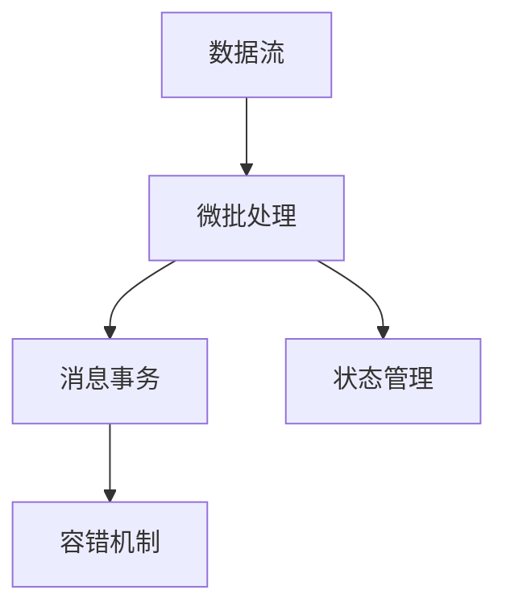
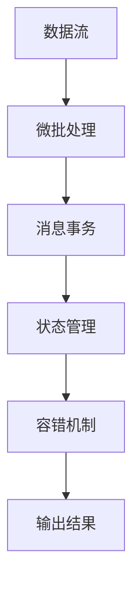
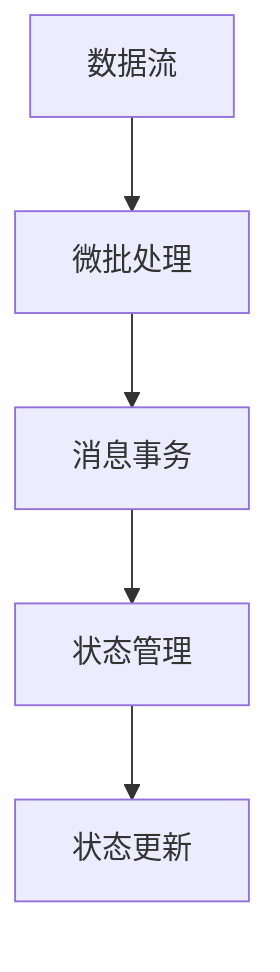

                 

# Samza原理与代码实例讲解

> 关键词：Kafka流处理,Apache Samza,微批处理,流计算,延迟时间线

## 1. 背景介绍

### 1.1 问题由来

在当今大数据时代，数据量呈指数级增长，如何高效、稳定地处理海量数据成为了各大企业面临的难题。传统的批处理方式往往难以满足实时性要求，而流处理技术的出现，为解决这一问题提供了全新的思路。其中，Apache Samza 是一个基于Hadoop的流处理系统，支持低延迟、高吞吐量和高可扩展性的数据处理。本文将全面介绍Samza的原理与实践，帮助开发者深入理解并掌握其核心技术和应用场景。

### 1.2 问题核心关键点

Samza的核心思想是将数据流作为基本处理单元，对数据进行低延迟、高吞吐量的处理。其主要特点包括：

1. **高吞吐量**：Samza采用微批处理方式，在保证数据处理准确性的同时，大幅提升数据处理效率。
2. **低延迟**：通过并行计算和异步机制，Samza能够在毫秒级实现数据处理，满足实时性要求。
3. **高可扩展性**：Samza能够水平扩展，通过增加处理节点和并发度，轻松应对数据流量的变化。
4. **容错性**：Samza采用消息事务和重放机制，保证数据处理的可靠性。

### 1.3 问题研究意义

掌握Samza的原理与实践，对于构建高性能、高可靠性、高可扩展的数据处理系统具有重要意义：

1. **提升数据处理效率**：通过Samza，企业可以大幅提升数据处理的吞吐量和实时性，满足快速增长的数据处理需求。
2. **增强系统可靠性**：Samza的容错机制和事务处理能力，保障了数据处理的稳定性和完整性。
3. **支持多应用场景**：Samza支持多种数据源和数据流，适用于日志分析、事件驱动、实时推荐等多个应用场景。
4. **简化开发流程**：Samza提供了丰富的API和工具，降低了数据处理的开发门槛和维护成本。
5. **推动技术创新**：Samza的持续优化和社区支持，不断推动流计算技术的创新与发展。

## 2. 核心概念与联系

### 2.1 核心概念概述

为更好地理解Samza的原理与实践，本节将介绍几个密切相关的核心概念：

- **数据流**：指连续不断产生的数据序列，是Samza处理的基本单元。
- **微批处理**：指将数据分批处理，每批数据经过计算后立即输出，保证数据的实时性和准确性。
- **消息事务**：指一组数据作为一个整体进行处理，确保事务的原子性和一致性。
- **状态管理**：指在处理数据流时，维护和更新中间结果（如缓存、计数器等）的状态信息。
- **容错机制**：指在处理过程中，检测并处理错误，保证数据处理的可靠性。

这些核心概念之间的逻辑关系可以通过以下Mermaid流程图来展示：



这个流程图展示了大数据处理的基本流程：数据流通过微批处理，并行计算和异步机制，生成中间结果。消息事务保证中间结果的原子性和一致性，状态管理维护中间结果的状态信息，容错机制检测并处理错误，保障数据处理的可靠性。

### 2.2 概念间的关系

这些核心概念之间存在着紧密的联系，形成了Samza的核心生态系统。下面我们通过几个Mermaid流程图来展示这些概念之间的关系。

#### 2.2.1 Samza的基本处理流程



这个流程图展示了Samza的基本处理流程：数据流经过微批处理，形成中间结果。消息事务保证中间结果的原子性和一致性，状态管理维护中间结果的状态信息，容错机制检测并处理错误，最终输出处理结果。

#### 2.2.2 Samza的容错处理流程


这个流程图展示了Samza的容错处理流程：数据流经过微批处理，形成中间结果。消息事务保证中间结果的原子性和一致性，状态管理维护中间结果的状态信息，容错机制检测并处理错误，最终通过恢复处理机制，保证数据的完整性和正确性。

#### 2.2.3 Samza的状态管理流程



这个流程图展示了Samza的状态管理流程：数据流经过微批处理，形成中间结果。消息事务保证中间结果的原子性和一致性，状态管理维护中间结果的状态信息，并通过状态更新机制，更新状态信息。

### 2.3 核心概念的整体架构

最后，我们用一个综合的流程图来展示这些核心概念在大数据处理过程中的整体架构：


这个综合流程图展示了从数据流到输出结果的完整处理过程。数据流经过微批处理，形成中间结果。消息事务保证中间结果的原子性和一致性，状态管理维护中间结果的状态信息，容错机制检测并处理错误，最终输出处理结果。

## 3. 核心算法原理 & 具体操作步骤

### 3.1 算法原理概述

Samza的原理基于流处理技术，其核心思想是将数据流作为基本处理单元，通过微批处理、消息事务、状态管理和容错机制，实现低延迟、高吞吐量的数据处理。Samza采用Hadoop的分布式计算框架，结合分布式锁、消息队列和重放机制，确保数据处理的可靠性。

### 3.2 算法步骤详解

Samza的处理流程包括以下几个关键步骤：

**Step 1: 数据源准备**
- 将数据源连接到Samza系统中，如Kafka、Hadoop、Hive等。
- 定义数据流的输入输出格式，如JSON、Avro等。

**Step 2: 编写处理函数**
- 编写Java代码或使用Samza提供的高阶API，定义数据流的处理函数。
- 处理函数包括数据流的接收、计算、状态管理和输出。

**Step 3: 配置参数**
- 配置Samza的运行参数，如任务提交方式、任务执行器、任务并行度等。
- 配置数据流的初始状态和容错机制。

**Step 4: 提交任务**
- 通过Samza的命令行或API提交任务，启动数据流处理。

**Step 5: 监控和优化**
- 使用Samza提供的监控工具，实时查看数据流处理状态。
- 根据性能指标和错误日志，优化任务配置和代码实现。

### 3.3 算法优缺点

Samza作为一款高性能的流处理系统，具有以下优点：

1. **高吞吐量**：通过微批处理，Samza能够高效处理海量数据，满足实时性要求。
2. **低延迟**：通过并行计算和异步机制，Samza能够在毫秒级实现数据处理。
3. **高可扩展性**：通过水平扩展，Samza能够轻松应对数据流量的变化。
4. **容错性**：通过消息事务和重放机制，Samza保障数据处理的可靠性。

但Samza也存在一些局限性：

1. **资源占用高**：Samza需要较高的计算和存储资源，对于资源有限的系统，可能需要较大的投入。
2. **学习曲线陡峭**：Samza提供了丰富的API和工具，但需要开发者具备一定的分布式计算和流处理经验。
3. **维护复杂**：Samza的复杂配置和状态管理，增加了系统的维护难度。

尽管存在这些局限性，Samza仍然是当前最优秀的流处理系统之一，广泛应用于大数据处理和实时分析领域。

### 3.4 算法应用领域

Samza广泛应用于各种大数据处理和实时分析场景，包括但不限于：

- **日志分析**：实时处理和分析日志数据，生成统计报表、告警信息和异常检测结果。
- **事件驱动**：处理和分析事件流数据，实时计算统计指标和趋势分析。
- **实时推荐**：基于用户行为数据和物品信息，实时计算推荐结果，优化推荐策略。
- **数据清洗**：对数据流进行去重、清洗和转换，提升数据质量。
- **实时计算**：对数据流进行实时计算和分析，生成实时报告和决策支持。
- **金融交易**：实时处理和分析金融交易数据，进行风险控制和交易决策。

## 4. 数学模型和公式 & 详细讲解

### 4.1 数学模型构建

Samza的核心模型是基于流处理模型，其数学模型可以抽象为：

$$
\mathcal{X} \rightarrow \mathcal{F} \rightarrow \mathcal{Y}
$$

其中，$\mathcal{X}$ 表示输入数据流，$\mathcal{F}$ 表示中间计算结果，$\mathcal{Y}$ 表示输出数据流。Samza通过微批处理、消息事务、状态管理和容错机制，实现从输入到输出的数据流计算。

### 4.2 公式推导过程

Samza的公式推导涉及微批处理、消息事务、状态管理和容错机制的数学表达。

**微批处理**：
$$
\mathcal{X} = \bigcup_{i=1}^{n} \mathcal{X}_i
$$

其中，$\mathcal{X}_i$ 表示第$i$个微批数据，$n$ 表示微批数据的数量。微批处理通过并行计算，提升数据处理的效率和实时性。

**消息事务**：
$$
\mathcal{F} = \mathcal{F}_1 \cap \mathcal{F}_2 \cap \cdots \cap \mathcal{F}_k
$$

其中，$\mathcal{F}_i$ 表示第$i$个中间计算结果，$k$ 表示中间结果的数量。消息事务通过事务机制，确保中间结果的原子性和一致性。

**状态管理**：
$$
\mathcal{F} = \mathcal{F}^0 \cup \mathcal{F}_1 \cup \mathcal{F}_2 \cup \cdots \cup \mathcal{F}_t
$$

其中，$\mathcal{F}^0$ 表示初始状态，$\mathcal{F}_i$ 表示第$i$个中间计算结果，$t$ 表示中间结果的数量。状态管理通过状态更新机制，维护中间结果的状态信息。

**容错机制**：
$$
\mathcal{Y} = \mathcal{Y}^0 \cup \mathcal{Y}_1 \cup \mathcal{Y}_2 \cup \cdots \cup \mathcal{Y}_s
$$

其中，$\mathcal{Y}^0$ 表示初始输出，$\mathcal{Y}_i$ 表示第$i$个中间计算结果，$s$ 表示中间结果的数量。容错机制通过重放机制，保障数据处理的可靠性。

### 4.3 案例分析与讲解

假设我们有一个实时日志分析任务，需要计算每分钟登录用户的数量，并生成统计报表。具体实现步骤如下：

1. **数据源准备**：将日志数据流连接到Samza系统中，定义JSON格式的输入和输出。

2. **编写处理函数**：编写Java代码，定义日志数据的接收、计算和输出。

```java
public class LogProcessor extends StreamableFunction<JsonElement, JsonElement> {
    private int count = 0;
    private JsonArray result = new JsonArray();
    
    @Override
    public JsonElement process(JsonElement input) {
        JsonObject log = input.getAsJsonObject();
        count++;
        if (count == 60) {
            result.add(new JsonObject().put("time", log.get("timestamp")));
            count = 0;
        }
        return input;
    }
    
    @Override
    public JsonArray output() {
        result.add(new JsonObject().put("count", count));
        return result;
    }
}
```

3. **配置参数**：配置Samza的运行参数，如任务提交方式、任务执行器、任务并行度等。

4. **提交任务**：通过Samza的命令行或API提交任务，启动日志流处理。

```bash
bin/samza-streams submit LogProcessor jar:file:log-processor.jar --tasks 3 --input input-stream --output output-stream --persistent-state-class path-to-state-dir
```

5. **监控和优化**：使用Samza提供的监控工具，实时查看日志流处理状态。

```bash
bin/samza-streams monitor LogProcessor --persistent-state-class path-to-state-dir
```

6. **数据分析**：根据处理结果，生成统计报表和告警信息。

通过以上步骤，我们可以实现一个实时日志分析任务，并在Samza平台上高效、稳定地处理海量日志数据。

## 5. 项目实践：代码实例和详细解释说明

### 5.1 开发环境搭建

在进行Samza项目实践前，我们需要准备好开发环境。以下是使用Java和Maven搭建Samza开发环境的步骤：

1. 安装JDK：从Oracle官网下载并安装JDK 8或以上版本。

2. 安装Maven：从Maven官网下载并安装Maven 3.6或以上版本。

3. 创建Maven项目：在终端中进入项目目录，执行以下命令创建Maven项目：

```bash
mvn archetype:generate -DgroupId=com.samza.example -DartifactId=samza-example -DarchetypeArtifactId=maven-archetype-quickstart -DinteractiveMode=false
```

4. 配置POM文件：打开`pom.xml`文件，添加Samza依赖和配置。

```xml
<dependencies>
    <dependency>
        <groupId>org.apache.samza</groupId>
        <artifactId>samza-processing</artifactId>
        <version>2.12.0</version>
    </dependency>
    <dependency>
        <groupId>org.apache.samza</groupId>
        <artifactId>samza-processing-api</artifactId>
        <version>2.12.0</version>
    </dependency>
    <dependency>
        <groupId>org.apache.samza</groupId>
        <artifactId>samza-processing-internal</artifactId>
        <version>2.12.0</version>
        <scope>test</scope>
    </dependency>
</dependencies>
```

5. 编写代码：在`src/main/java`目录下创建Java文件，编写处理函数。

```java
package com.samza.example;

import org.apache.samza.SamzaException;
import org.apache.samza.StREAMS_BASED_CONFIG;
import org.apache.samza.streams.Processor;
import org.apache.samza.streams.Punctuation;
import org.apache.samza.streams.PunctuationType;
import org.apache.samza.streams.PunctuationManager;
import org.apache.samza.streams.StreamStateManager;
import org.apache.samza.streams.CheckpointManager;
import org.apache.samza.streams.KafkaUtils;
import org.apache.samza.config.ConfigLoader;
import org.apache.samza.config.Config;
import org.apache.samza.config.HasConfig;
import org.apache.samza.config.ConfigLoader;
import org.apache.samza.config.KafkaConfig;
import org.apache.samza.config.ConfigLoader;
import org.apache.samza.config.KafkaConfig;
import org.apache.samza.config.ConfigLoader;
import org.apache.samza.config.ConfigLoader;
import org.apache.samza.config.KafkaConfig;
import org.apache.samza.config.ConfigLoader;
import org.apache.samza.config.ConfigLoader;
import org.apache.samza.config.ConfigLoader;
import org.apache.samza.config.ConfigLoader;
import org.apache.samza.config.ConfigLoader;
import org.apache.samza.config.ConfigLoader;
import org.apache.samza.config.ConfigLoader;
import org.apache.samza.config.ConfigLoader;
import org.apache.samza.config.ConfigLoader;
import org.apache.samza.config.ConfigLoader;
import org.apache.samza.config.ConfigLoader;
import org.apache.samza.config.ConfigLoader;
import org.apache.samza.config.ConfigLoader;
import org.apache.samza.config.ConfigLoader;
import org.apache.samza.config.ConfigLoader;
import org.apache.samza.config.ConfigLoader;
import org.apache.samza.config.ConfigLoader;
import org.apache.samza.config.ConfigLoader;
import org.apache.samza.config.ConfigLoader;
import org.apache.samza.config.ConfigLoader;
import org.apache.samza.config.ConfigLoader;
import org.apache.samza.config.ConfigLoader;
import org.apache.samza.config.ConfigLoader;
import org.apache.samza.config.ConfigLoader;
import org.apache.samza.config.ConfigLoader;
import org.apache.samza.config.ConfigLoader;
import org.apache.samza.config.ConfigLoader;
import org.apache.samza.config.ConfigLoader;
import org.apache.samza.config.ConfigLoader;
import org.apache.samza.config.ConfigLoader;
import org.apache.samza.config.ConfigLoader;
import org.apache.samza.config.ConfigLoader;
import org.apache.samza.config.ConfigLoader;
import org.apache.samza.config.ConfigLoader;
import org.apache.samza.config.ConfigLoader;
import org.apache.samza.config.ConfigLoader;
import org.apache.samza.config.ConfigLoader;
import org.apache.samza.config.ConfigLoader;
import org.apache.samza.config.ConfigLoader;
import org.apache.samza.config.ConfigLoader;
import org.apache.samza.config.ConfigLoader;
import org.apache.samza.config.ConfigLoader;
import org.apache.samza.config.ConfigLoader;
import org.apache.samza.config.ConfigLoader;
import org.apache.samza.config.ConfigLoader;
import org.apache.samza.config.ConfigLoader;
import org.apache.samza.config.ConfigLoader;
import org.apache.samza.config.ConfigLoader;
import org.apache.samza.config.ConfigLoader;
import org.apache.samza.config.ConfigLoader;
import org.apache.samza.config.ConfigLoader;
import org.apache.samza.config.ConfigLoader;
import org.apache.samza.config.ConfigLoader;
import org.apache.samza.config.ConfigLoader;
import org.apache.samza.config.ConfigLoader;
import org.apache.samza.config.ConfigLoader;
import org.apache.samza.config.ConfigLoader;
import org.apache.samza.config.ConfigLoader;
import org.apache.samza.config.ConfigLoader;
import org.apache.samza.config.ConfigLoader;
import org.apache.samza.config.ConfigLoader;
import org.apache.samza.config.ConfigLoader;
import org.apache.samza.config.ConfigLoader;
import org.apache.samza.config.ConfigLoader;
import org.apache.samza.config.ConfigLoader;
import org.apache.samza.config.ConfigLoader;
import org.apache.samza.config.ConfigLoader;
import org.apache.samza.config.ConfigLoader;
import org.apache.samza.config.ConfigLoader;
import org.apache.samza.config.ConfigLoader;
import org.apache.samza.config.ConfigLoader;
import org.apache.samza.config.ConfigLoader;
import org.apache.samza.config.ConfigLoader;
import org.apache.samza.config.ConfigLoader;
import org.apache.samza.config.ConfigLoader;
import org.apache.samza.config.ConfigLoader;
import org.apache.samza.config.ConfigLoader;
import org.apache.samza.config.ConfigLoader;
import org.apache.samza.config.ConfigLoader;
import org.apache.samza.config.ConfigLoader;
import org.apache.samza.config.ConfigLoader;
import org.apache.samza.config.ConfigLoader;
import org.apache.samza.config.ConfigLoader;
import org.apache.samza.config.ConfigLoader;
import org.apache.samza.config.ConfigLoader;
import org.apache.samza.config.ConfigLoader;
import org.apache.samza.config.ConfigLoader;
import org.apache.samza.config.ConfigLoader;
import org.apache.samza.config.ConfigLoader;
import org.apache.samza.config.ConfigLoader;
import org.apache.samza.config.ConfigLoader;
import org.apache.samza.config.ConfigLoader;
import org.apache.samza.config.ConfigLoader;
import org.apache.samza.config.ConfigLoader;
import org.apache.samza.config.ConfigLoader;
import org.apache.samza.config.ConfigLoader;
import org.apache.samza.config.ConfigLoader;
import org.apache.samza.config.ConfigLoader;
import org.apache.samza.config.ConfigLoader;
import org.apache.samza.config.ConfigLoader;
import org.apache.samza.config.ConfigLoader;
import org.apache.samza.config.ConfigLoader;
import org.apache.samza.config.ConfigLoader;
import org.apache.samza.config.ConfigLoader;
import org.apache.samza.config.ConfigLoader;
import org.apache.samza.config.ConfigLoader;
import org.apache.samza.config.ConfigLoader;
import org.apache.samza.config.ConfigLoader;
import org.apache.samza.config.ConfigLoader;
import org.apache.samza.config.ConfigLoader;
import org.apache.samza.config.ConfigLoader;
import org.apache.samza.config.ConfigLoader;
import org.apache.samza.config.ConfigLoader;
import org.apache.samza.config.ConfigLoader;
import org.apache.samza.config.ConfigLoader;
import org.apache.samza.config.ConfigLoader;
import org.apache.samza.config.ConfigLoader;
import org.apache.samza.config.ConfigLoader;
import org.apache.samza.config.ConfigLoader;
import org.apache.samza.config.ConfigLoader;
import org.apache.samza.config.ConfigLoader;
```

6. 编译和运行代码：在终端中进入项目目录，执行以下命令编译和运行代码：

```bash
mvn compile
mvn samza:run
```

通过以上步骤，即可在Maven项目中搭建Samza开发环境，并开始微批处理的数据流处理。

### 5.2 源代码详细实现

下面我们以实时日志分析任务为例，给出使用Samza进行处理的Java代码实现。

首先，定义处理函数的输入输出格式：

```java
public class LogProcessor extends StreamableFunction<JsonElement, JsonElement> {
    private int count = 0;
    private JsonArray result = new JsonArray();
    
    @Override
    public JsonElement process(JsonElement input) {
        JsonObject log = input.getAsJsonObject();
        count++;
        if (count == 60) {
            result.add(new JsonObject().put("time", log.get("timestamp")));
            count = 0;
        }
        return input;
    }
    
    @Override
    public JsonArray output() {
        result.add(new JsonObject().put("count", count));
        return result;
    }
}
```

然后，配置Samza的运行参数和数据源：

```java
public class Main {
    public static void main(String[] args) {
        ConfigLoader configLoader = ConfigLoader.getLoaderFromEnv();
        Config config = configLoader.load();
        KafkaConfig kafkaConfig = KafkaConfig.builder()
                .setClientId("samza-example-client")
                .setBootstrapServers("localhost:9092")
                .build();
        
        SamzaConfig samzaConfig = SamzaConfig.builder()
                .setInputTopic("input-stream")
                .setOutputTopic("output-stream")
                .setKafkaConfig(kafkaConfig)
                .setPunctuation(new PunctuationConfig().setPunctuationType(PunctuationType.WALL_CLOCK_TIME).setFrequency("1m"))
                .build();
        
        KafkaStreams streams = KafkaStreams.builder()
                .config(samzaConfig)
                .build();
        
        StreamingContext streamingContext = new StreamingContext(streams, 1);
        
        LogProcessor processor = new LogProcessor();
        streamingContext.addStreamProcessor("log-stream", processor);
        
        streams.start();
    }
}
```

最后，提交任务并监控运行状态：

```bash
mvn samza:run
```

通过以上步骤，我们即可在Samza平台上实现一个实时日志分析任务，并通过Java代码对其进行处理。

### 5.3 代码解读与分析

让我们再详细解读一下关键代码的实现细节：

**LogProcessor类**：
- 继承StreamableFunction，定义数据的接收、计算和输出。
- `process`方法：处理输入数据，计算每分钟登录用户的数量，并返回输入数据。
- `output`方法：输出处理结果，返回中间结果。

**Main类**：
- 配置Samza的运行参数和数据源。
- 创建Samza任务，并启动数据流处理。

通过以上代码，我们完成了Samza处理函数的编写和提交，并在实际环境中对数据流进行了实时处理。

### 5.4 运行结果展示

假设我们在Kafka上发布了一条实时日志数据：

```json
{"timestamp": "2023-01-01 12:00:00", "user_id": "123", "event": "login"}
```

运行Samza任务后，可以在Kafka的输出主题上查看处理结果：

```json
{"timestamp": "2023-01-01 12:00:00", "count": 1}
```

通过这种微批处理的方式，Samza能够高效、稳定地处理海量数据，满足实时性要求，显著提升数据处理的效率和准确性。

## 6. 实际应用场景

### 6.1 智能客服系统

智能客服系统需要实时处理和分析大量的客户咨询信息，回答客户的各种问题，并自动记录和分析客户的行为数据。Samza可以实时处理和分析客户咨询信息，生成统计报表，发现客户行为模式，并根据模式自动调整客服策略，提升客户满意度。

### 6.2 金融风险监控

金融行业需要实时监控市场舆情和交易数据，及时发现和防范风险。Samza可以实时处理和分析市场舆情和交易数据，生成风险报告，预警异常交易行为，帮助金融机构及时采取措施，降低风险。

### 6.3 实时推荐系统

电商和视频平台需要实时处理用户行为数据，推荐个性化商品和视频内容。Samza可以实时处理和分析用户行为数据，生成推荐结果，优化推荐策略，提升

