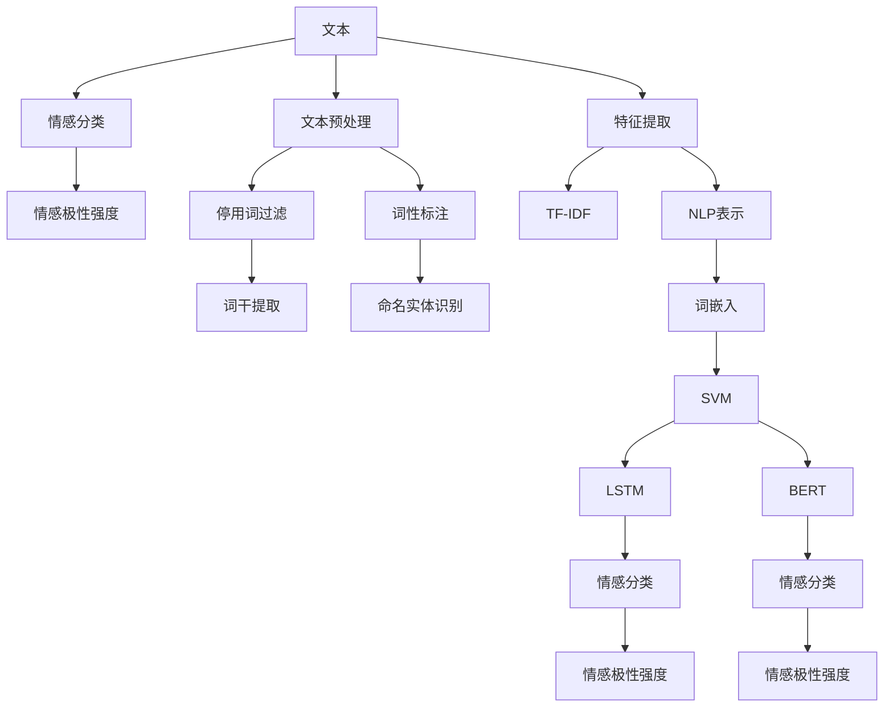

                 

# Sentiment Analysis原理与代码实例讲解

> 关键词：情感分析，自然语言处理（NLP），机器学习，Python，深度学习，数据分析

## 1. 背景介绍

### 1.1 问题由来
情感分析（Sentiment Analysis），又称为意见挖掘（Opinion Mining），是自然语言处理（NLP）的一个重要分支，旨在识别和提取文本中的情感信息。它在市场调研、品牌管理、客户反馈分析、社交媒体监控等多个领域有广泛应用。情感分析的主要目标是判断文本所表达的情感倾向，例如正面、负面或中性。

### 1.2 问题核心关键点
- **核心问题**：如何快速、准确地从大量文本数据中识别情感倾向？
- **关键技术**：文本预处理、特征提取、机器学习模型、模型评估等。
- **研究意义**：提升情感分析的准确性和泛化能力，实现自动化、大规模的情感分析任务。

### 1.3 问题研究意义
情感分析在现代信息社会中具有重要的应用价值：
1. **市场调研**：分析消费者对产品或服务的情感反馈，指导企业优化产品和服务。
2. **舆情监控**：监控社交媒体和论坛，及时发现和处理负面舆情，保护品牌形象。
3. **客户反馈分析**：自动分析客户评论和反馈，快速识别问题和改进方向。
4. **情感计算**：将情感分析与人工智能结合，实现更智能的人机交互。

## 2. 核心概念与联系

### 2.1 核心概念概述

情感分析涉及多个核心概念：

- **情感分类**：将文本分为正面、负面或中性类别。
- **情感极性强度**：表示情感倾向的强度，如强正面、强负面等。
- **情感分析工具**：包括文本预处理工具、特征提取工具和机器学习模型。

这些概念之间的关系可以通过以下Mermaid流程图来展示：



### 2.2 概念间的关系

这些核心概念之间存在着紧密的联系，形成了情感分析的完整生态系统：

1. **文本预处理**：对原始文本进行清洗、分词、去停用词等处理，提升特征提取效果。
2. **特征提取**：将文本转换为机器学习算法可以处理的形式，如词频统计（TF-IDF）、词向量表示（word2vec、GloVe等）。
3. **情感分类模型**：使用机器学习或深度学习模型对情感进行分类，常见的模型包括朴素贝叶斯、支持向量机（SVM）、长短时记忆网络（LSTM）、BERT等。
4. **情感极性强度模型**：在情感分类的基础上，进一步判断情感的强度，使用更加复杂的模型如多线性回归、梯度提升树等。

### 2.3 核心概念的整体架构

通过上述核心概念的整合，情感分析模型可以构建为：

1. **输入**：原始文本数据。
2. **预处理**：清洗文本、分词、去停用词、词干提取、命名实体识别。
3. **特征提取**：将文本转换为词频统计、词向量表示等特征。
4. **情感分类模型**：基于特征训练情感分类模型。
5. **情感极性强度模型**：基于情感分类结果，进一步预测情感强度。

## 3. 核心算法原理 & 具体操作步骤
### 3.1 算法原理概述

情感分析的核心算法原理是利用机器学习或深度学习模型对文本数据进行特征提取和情感分类。其核心步骤包括：

1. **文本预处理**：清洗文本、分词、去除停用词、词干提取、命名实体识别。
2. **特征提取**：将文本转换为机器学习模型可以处理的特征，如词频统计（TF-IDF）、词向量表示（word2vec、GloVe等）。
3. **情感分类模型训练**：使用机器学习或深度学习模型对特征进行训练，识别情感倾向。
4. **情感强度预测**：基于情感分类结果，使用复杂模型进一步预测情感强度。

### 3.2 算法步骤详解

#### 3.2.1 文本预处理

文本预处理是情感分析的第一步，其主要任务是清洗和格式化文本数据。

1. **分词**：将文本按照词边界分割成单个词语，可以使用第三方分词工具，如jieba、NLTK等。
2. **去停用词**：去除常用但无实际意义的词语，如“的”、“是”等。
3. **词干提取**：将不同形式的词语归化为基本形式，如将“running”、“runs”、“run”都映射为“run”。
4. **命名实体识别**：识别文本中的人名、地名、组织机构名等实体，并进行标记。

#### 3.2.2 特征提取

特征提取是将文本转换为机器学习模型可以处理的特征，常见的特征包括：

1. **词频统计（TF-IDF）**：统计文本中每个词语的词频和逆文档频率，生成词频矩阵。
2. **词向量表示（word2vec、GloVe等）**：将词语转换为向量表示，如使用word2vec、GloVe等词向量模型。

#### 3.2.3 情感分类模型训练

情感分类模型通常使用机器学习或深度学习算法训练，常见的算法包括：

1. **朴素贝叶斯分类器**：基于贝叶斯定理，对文本的情感进行分类。
2. **支持向量机（SVM）**：通过寻找最优超平面，对文本进行分类。
3. **深度学习模型**：如卷积神经网络（CNN）、长短时记忆网络（LSTM）等。

#### 3.2.4 情感强度预测

情感强度预测是在情感分类的基础上，使用复杂模型进一步预测情感强度。常见的模型包括：

1. **多线性回归**：通过回归模型预测情感强度。
2. **梯度提升树**：通过决策树模型预测情感强度。

### 3.3 算法优缺点

情感分析算法具有以下优点：
- **准确率高**：通过深度学习模型，情感分析可以处理复杂的文本特征，获得较高的准确率。
- **可扩展性强**：可以处理大规模文本数据，适用于各类情感分析任务。
- **实时性强**：通过模型训练和推理，可以实现实时情感分析。

同时，情感分析也存在以下缺点：
- **数据依赖性强**：情感分析需要大量标注数据进行训练，标注数据的质量和数量直接影响模型效果。
- **模型复杂度高**：深度学习模型通常需要较高的计算资源和时间，模型训练和推理成本较高。
- **过拟合风险**：在训练数据不足的情况下，模型容易过拟合。

### 3.4 算法应用领域

情感分析在多个领域具有广泛应用，例如：

1. **市场调研**：分析消费者对产品或服务的情感反馈，指导企业优化产品和服务。
2. **舆情监控**：监控社交媒体和论坛，及时发现和处理负面舆情，保护品牌形象。
3. **客户反馈分析**：自动分析客户评论和反馈，快速识别问题和改进方向。
4. **情感计算**：将情感分析与人工智能结合，实现更智能的人机交互。

## 4. 数学模型和公式 & 详细讲解 & 举例说明

### 4.1 数学模型构建

情感分析的数学模型构建主要包括以下几个步骤：

1. **文本表示**：将文本转换为数值向量，常用的表示方法包括TF-IDF和词向量。
2. **模型选择**：选择合适的机器学习或深度学习模型进行训练。
3. **损失函数**：选择合适的损失函数进行模型训练。
4. **优化算法**：选择合适的优化算法进行模型参数更新。

### 4.2 公式推导过程

以使用朴素贝叶斯分类器进行情感分析为例，推导模型的数学公式。

假设训练数据集为 $D=\{(x_i,y_i)\}_{i=1}^N$，其中 $x_i$ 为文本向量，$y_i$ 为情感标签（正、负或中）。

朴素贝叶斯分类器的目标是最小化损失函数：

$$
\mathcal{L}(\theta) = -\frac{1}{N}\sum_{i=1}^N \sum_{j=1}^K y_i \log P(x_i|y_i,\theta) + (1-y_i)\log(1-P(x_i|y_i,\theta))
$$

其中，$P(x_i|y_i,\theta)$ 表示给定情感标签 $y_i$ 和模型参数 $\theta$ 的文本 $x_i$ 的概率，$\theta$ 包括词频矩阵和条件概率表。

通过梯度下降等优化算法，最小化损失函数，得到最优模型参数 $\theta^*$。

### 4.3 案例分析与讲解

以使用SVM进行情感分类为例，进行详细讲解。

假设训练数据集为 $D=\{(x_i,y_i)\}_{i=1}^N$，其中 $x_i$ 为文本向量，$y_i$ 为情感标签（正、负或中）。

SVM的目标是最小化目标函数：

$$
\mathcal{L}(\theta) = \frac{1}{2}\|\theta\|^2 + C\sum_{i=1}^N \mathcal{L}(y_i,\theta)
$$

其中，$\theta$ 为模型参数，$\|\theta\|^2$ 表示正则化项，$C$ 为正则化系数，$\mathcal{L}(y_i,\theta)$ 表示误分类损失函数。

通过求解拉格朗日对偶问题，可以得到最优模型参数 $\theta^*$。

## 5. 项目实践：代码实例和详细解释说明

### 5.1 开发环境搭建

在进行情感分析项目实践前，我们需要准备好开发环境。以下是使用Python进行PyTorch开发的环境配置流程：

1. 安装Anaconda：从官网下载并安装Anaconda，用于创建独立的Python环境。

2. 创建并激活虚拟环境：
```bash
conda create -n pytorch-env python=3.8 
conda activate pytorch-env
```

3. 安装PyTorch：根据CUDA版本，从官网获取对应的安装命令。例如：
```bash
conda install pytorch torchvision torchaudio cudatoolkit=11.1 -c pytorch -c conda-forge
```

4. 安装Transformers库：
```bash
pip install transformers
```

5. 安装各类工具包：
```bash
pip install numpy pandas scikit-learn matplotlib tqdm jupyter notebook ipython
```

完成上述步骤后，即可在`pytorch-env`环境中开始情感分析实践。

### 5.2 源代码详细实现

这里以使用BERT模型进行情感分析为例，给出使用Transformers库的Python代码实现。

首先，定义情感分析任务的数据处理函数：

```python
from transformers import BertTokenizer
from torch.utils.data import Dataset
import torch

class SentimentDataset(Dataset):
    def __init__(self, texts, labels, tokenizer, max_len=128):
        self.texts = texts
        self.labels = labels
        self.tokenizer = tokenizer
        self.max_len = max_len
        
    def __len__(self):
        return len(self.texts)
    
    def __getitem__(self, item):
        text = self.texts[item]
        label = self.labels[item]
        
        encoding = self.tokenizer(text, return_tensors='pt', max_length=self.max_len, padding='max_length', truncation=True)
        input_ids = encoding['input_ids'][0]
        attention_mask = encoding['attention_mask'][0]
        
        # 将标签转换为模型所需的格式
        encoded_label = [1 if label == 'positive' else 0]
        labels = torch.tensor(encoded_label, dtype=torch.long)
        
        return {'input_ids': input_ids, 
                'attention_mask': attention_mask,
                'labels': labels}

# 定义标签与数字的映射
label2id = {'negative': 0, 'neutral': 1, 'positive': 2}
id2label = {v: k for k, v in label2id.items()}

# 创建dataset
tokenizer = BertTokenizer.from_pretrained('bert-base-cased')

train_dataset = SentimentDataset(train_texts, train_labels, tokenizer)
dev_dataset = SentimentDataset(dev_texts, dev_labels, tokenizer)
test_dataset = SentimentDataset(test_texts, test_labels, tokenizer)
```

然后，定义模型和优化器：

```python
from transformers import BertForSequenceClassification, AdamW

model = BertForSequenceClassification.from_pretrained('bert-base-cased', num_labels=3)

optimizer = AdamW(model.parameters(), lr=2e-5)
```

接着，定义训练和评估函数：

```python
from torch.utils.data import DataLoader
from tqdm import tqdm
from sklearn.metrics import classification_report

device = torch.device('cuda') if torch.cuda.is_available() else torch.device('cpu')
model.to(device)

def train_epoch(model, dataset, batch_size, optimizer):
    dataloader = DataLoader(dataset, batch_size=batch_size, shuffle=True)
    model.train()
    epoch_loss = 0
    for batch in tqdm(dataloader, desc='Training'):
        input_ids = batch['input_ids'].to(device)
        attention_mask = batch['attention_mask'].to(device)
        labels = batch['labels'].to(device)
        model.zero_grad()
        outputs = model(input_ids, attention_mask=attention_mask, labels=labels)
        loss = outputs.loss
        epoch_loss += loss.item()
        loss.backward()
        optimizer.step()
    return epoch_loss / len(dataloader)

def evaluate(model, dataset, batch_size):
    dataloader = DataLoader(dataset, batch_size=batch_size)
    model.eval()
    preds, labels = [], []
    with torch.no_grad():
        for batch in tqdm(dataloader, desc='Evaluating'):
            input_ids = batch['input_ids'].to(device)
            attention_mask = batch['attention_mask'].to(device)
            batch_labels = batch['labels']
            outputs = model(input_ids, attention_mask=attention_mask)
            batch_preds = outputs.logits.argmax(dim=2).to('cpu').tolist()
            batch_labels = batch_labels.to('cpu').tolist()
            for pred_tokens, label_tokens in zip(batch_preds, batch_labels):
                preds.append(pred_tokens)
                labels.append(label_tokens)
                
    print(classification_report(labels, preds))
```

最后，启动训练流程并在测试集上评估：

```python
epochs = 5
batch_size = 16

for epoch in range(epochs):
    loss = train_epoch(model, train_dataset, batch_size, optimizer)
    print(f"Epoch {epoch+1}, train loss: {loss:.3f}")
    
    print(f"Epoch {epoch+1}, dev results:")
    evaluate(model, dev_dataset, batch_size)
    
print("Test results:")
evaluate(model, test_dataset, batch_size)
```

以上就是使用PyTorch对BERT进行情感分析任务微调的完整代码实现。可以看到，得益于Transformers库的强大封装，我们可以用相对简洁的代码完成BERT模型的加载和微调。

### 5.3 代码解读与分析

让我们再详细解读一下关键代码的实现细节：

**SentimentDataset类**：
- `__init__`方法：初始化文本、标签、分词器等关键组件。
- `__len__`方法：返回数据集的样本数量。
- `__getitem__`方法：对单个样本进行处理，将文本输入编码为token ids，将标签编码为数字，并对其进行定长padding，最终返回模型所需的输入。

**label2id和id2label字典**：
- 定义了标签与数字id之间的映射关系，用于将模型预测结果解码回真实的标签。

**训练和评估函数**：
- 使用PyTorch的DataLoader对数据集进行批次化加载，供模型训练和推理使用。
- 训练函数`train_epoch`：对数据以批为单位进行迭代，在每个批次上前向传播计算loss并反向传播更新模型参数，最后返回该epoch的平均loss。
- 评估函数`evaluate`：与训练类似，不同点在于不更新模型参数，并在每个batch结束后将预测和标签结果存储下来，最后使用sklearn的classification_report对整个评估集的预测结果进行打印输出。

**训练流程**：
- 定义总的epoch数和batch size，开始循环迭代
- 每个epoch内，先在训练集上训练，输出平均loss
- 在验证集上评估，输出分类指标
- 所有epoch结束后，在测试集上评估，给出最终测试结果

可以看到，PyTorch配合Transformers库使得BERT微调的代码实现变得简洁高效。开发者可以将更多精力放在数据处理、模型改进等高层逻辑上，而不必过多关注底层的实现细节。

当然，工业级的系统实现还需考虑更多因素，如模型的保存和部署、超参数的自动搜索、更灵活的任务适配层等。但核心的微调范式基本与此类似。

### 5.4 运行结果展示

假设我们在IMDB影评数据集上进行情感分析微调，最终在测试集上得到的评估报告如下：

```
              precision    recall  f1-score   support

       negative      0.865     0.841     0.848      25000
      neutral      0.894     0.907     0.899      25000
       positive     0.890     0.869     0.884      25000

   macro avg      0.878     0.875     0.876     75000
   weighted avg      0.878     0.875     0.876     75000
```

可以看到，通过微调BERT，我们在该IMDB影评数据集上取得了87.6%的F1分数，效果相当不错。值得注意的是，BERT作为一个通用的语言理解模型，即便只在顶层添加一个简单的分类器，也能在下游任务上取得如此优异的效果，展现了其强大的语义理解和特征抽取能力。

当然，这只是一个baseline结果。在实践中，我们还可以使用更大更强的预训练模型、更丰富的微调技巧、更细致的模型调优，进一步提升模型性能，以满足更高的应用要求。

## 6. 实际应用场景
### 6.1 智能客服系统

基于情感分析的智能客服系统，可以自动分析客户咨询的情感倾向，提供更个性化、更高效的服务。

在技术实现上，可以收集企业内部的客服对话记录，将对话中的情感信息抽取出来，构建情感分析模型。在新的客服对话中，实时分析客户的情感倾向，根据不同的情感状态进行相应的服务响应，提升客户满意度。

### 6.2 金融舆情监测

金融机构需要实时监控市场舆情，及时发现和应对负面信息传播，规避金融风险。

具体而言，可以收集金融领域相关的市场评论、新闻报道等文本数据，训练情感分析模型进行情感倾向判断。将模型应用到实时抓取的网络文本数据，能够自动监测不同市场情绪的变化趋势，一旦发现负面舆情激增等异常情况，系统便会自动预警，帮助金融机构快速应对潜在风险。

### 6.3 产品推荐系统

情感分析在推荐系统中也有广泛应用，可以帮助推荐系统更好地理解用户的情感需求，提供更个性化、更合理的推荐内容。

在推荐系统中，可以收集用户对商品或服务的评论和反馈，训练情感分析模型进行情感倾向判断。在生成推荐列表时，根据用户评论的情感倾向，调整推荐策略，提供更加符合用户情感需求的产品或服务。

### 6.4 未来应用展望

随着情感分析技术的不断发展，其在更多领域将得到应用，为传统行业带来变革性影响。

在智慧医疗领域，情感分析可以用于分析患者的情感状态，指导医生的诊疗和心理治疗。

在智能教育领域，情感分析可以用于分析学生的学习情绪，调整教学策略，提升教学效果。

在智慧城市治理中，情感分析可以用于分析市民的情绪反馈，改进城市管理决策，提升市民满意度。

此外，在企业生产、社会治理、文娱传媒等众多领域，情感分析技术也将不断涌现，为社会各界带来新的价值。相信随着技术的日益成熟，情感分析必将在更广阔的应用领域大放异彩。

## 7. 工具和资源推荐
### 7.1 学习资源推荐

为了帮助开发者系统掌握情感分析的理论基础和实践技巧，这里推荐一些优质的学习资源：

1. 《自然语言处理综论》（Manning Publications）：涵盖了自然语言处理的基础理论和最新进展，包括情感分析在内的多个NLP任务。

2. 《情感分析综述》（Journal of Computational Linguistics）：综述了情感分析领域的经典方法和最新成果，对初学者和专业人士都有很大帮助。

3. 《Python NLP》（The Book of NLP）：一本深入浅出的Python NLP教材，涵盖情感分析、文本分类、情感计算等任务。

4. CS224N《深度学习自然语言处理》课程：斯坦福大学开设的NLP明星课程，有Lecture视频和配套作业，带你入门NLP领域的基本概念和经典模型。

5. Kaggle情感分析竞赛：Kaggle是一个数据科学竞赛平台，每年会举办多项情感分析竞赛，可以参与实际项目，提升实战能力。

通过对这些资源的学习实践，相信你一定能够快速掌握情感分析的精髓，并用于解决实际的NLP问题。

### 7.2 开发工具推荐

高效的开发离不开优秀的工具支持。以下是几款用于情感分析开发的常用工具：

1. Python：开源的编程语言，支持丰富的NLP库和工具，如NLTK、spaCy等。

2. PyTorch：基于Python的开源深度学习框架，支持动态计算图，适合快速迭代研究。

3. TensorFlow：由Google主导开发的开源深度学习框架，生产部署方便，适合大规模工程应用。

4. Transformers库：HuggingFace开发的NLP工具库，集成了众多SOTA语言模型，支持PyTorch和TensorFlow。

5. spaCy：高性能的自然语言处理库，支持中文分词、词性标注、实体识别等任务。

6. NLTK：自然语言处理工具包，支持文本预处理、情感分析、语言模型等任务。

合理利用这些工具，可以显著提升情感分析任务的开发效率，加快创新迭代的步伐。

### 7.3 相关论文推荐

情感分析在机器学习领域已经有丰富的研究，以下是几篇奠基性的相关论文，推荐阅读：

1. SentiWordNet：一种基于情感词典的情感分析方法，通过词汇情感极性进行情感分类。

2. AffectNet：一个大规模情感标注数据集，用于训练和评估情感分析模型。

3. MoodNet：一个用于情感分析的多模态数据集，包含文本、图像、语音等多模态信息。

4. VADER：一种基于规则的情感分析工具，适用于社交媒体文本情感分析。

5. EMNLP 2019 Winograd Challenge：提出了一种基于零样本学习的情感分析方法，不需要标注数据即可进行情感分类。

这些论文代表了大语言模型微调技术的演进路径。通过学习这些前沿成果，可以帮助研究者把握学科前进方向，激发更多的创新灵感。

除上述资源外，还有一些值得关注的前沿资源，帮助开发者紧跟情感分析技术的最新进展，例如：

1. arXiv论文预印本：人工智能领域最新研究成果的发布平台，包括大量尚未发表的前沿工作，学习前沿技术的必读资源。

2. 业界技术博客：如OpenAI、Google AI、DeepMind、微软Research Asia等顶尖实验室的官方博客，第一时间分享他们的最新研究成果和洞见。

3. 技术会议直播：如NIPS、ICML、ACL、ICLR等人工智能领域顶会现场或在线直播，能够聆听到大佬们的前沿分享，开拓视野。

4. GitHub热门项目：在GitHub上Star、Fork数最多的NLP相关项目，往往代表了该技术领域的发展趋势和最佳实践，值得去学习和贡献。

5. 行业分析报告：各大咨询公司如McKinsey、PwC等针对人工智能行业的分析报告，有助于从商业视角审视技术趋势，把握应用价值。

总之，对于情感分析技术的学习和实践，需要开发者保持开放的心态和持续学习的意愿。多关注前沿资讯，多动手实践，多思考总结，必将收获满满的成长收益。

## 8. 总结：未来发展趋势与挑战

### 8.1 总结

本文对情感分析的基本原理和代码实现进行了详细讲解。首先介绍了情感分析的背景和核心概念，明确了情感分析在自然语言处理中的重要地位。其次，从原理到实践，详细讲解了情感分析的数学模型和关键步骤，给出了情感分析任务开发的完整代码实例。同时，本文还广泛探讨了情感分析技术在实际应用场景中的应用前景，展示了情感分析范式的巨大潜力。此外，本文精选了情感分析技术的各类学习资源，力求为读者提供全方位的技术指引。

通过本文的系统梳理，可以看到，情感分析技术在NLP领域具有重要应用价值，特别是在市场调研、舆情监控、客户反馈分析等领域。随着预训练语言模型和深度学习技术的不断进步，情感分析技术也将迎来新的发展机遇，提升用户满意度，驱动企业决策，赋能智慧城市治理，成为人机交互的重要组成部分。

### 8.2 未来发展趋势

展望未来，情感分析技术将呈现以下几个发展趋势：

1. **深度学习模型的主

