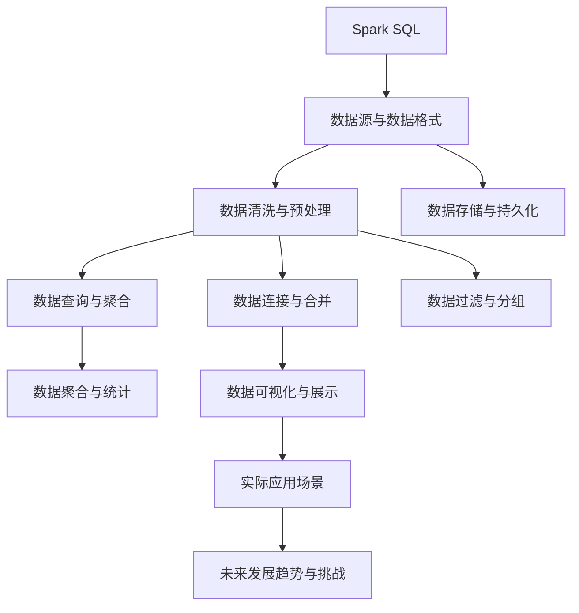

                 

# Spark SQL结构化数据处理原理与代码实例讲解

> 关键词：Spark SQL, 结构化数据, 数据处理, 批处理, 流处理, 数据分析, 查询优化, 数据清洗, 数据可视化, 数据仓库

## 1. 背景介绍

### 1.1 问题由来
随着大数据时代的到来，企业对于数据的处理需求越来越复杂，传统的数据处理方式已无法满足日益增长的需求。Spark SQL作为一种先进的、分布式的数据处理工具，以其强大的计算能力和灵活的查询语法，逐渐成为企业处理结构化数据的首选解决方案。Spark SQL可以处理大规模、多源、异构的数据，支持实时和批处理，同时提供了丰富的数据查询和分析功能。

在实际应用中，Spark SQL已被广泛应用于电商、金融、医疗、政府等多个行业，成为企业数据分析的重要引擎。然而，对于初学者而言，Spark SQL的复杂架构和语法可能会让人望而却步。为了帮助读者更好地理解Spark SQL，本文将从原理到实践，详细介绍Spark SQL的结构化数据处理过程，并结合实际代码实例，展示其在数据处理中的运用。

### 1.2 问题核心关键点
本文将从以下几个方面详细介绍Spark SQL的结构化数据处理过程：
- 数据源与数据格式
- 数据清洗与预处理
- 数据存储与持久化
- 数据查询与聚合
- 数据连接与合并
- 数据过滤与分组
- 数据聚合与统计
- 数据可视化与展示
- 实际应用场景
- 未来发展趋势与挑战

## 2. 核心概念与联系

### 2.1 核心概念概述

#### 2.1.1 Spark SQL
Spark SQL是Apache Spark框架中用于处理结构化数据的子模块。它支持SQL查询语言，可以将数据从多种数据源加载到内存中，进行高效的查询和分析。Spark SQL可以将结构化数据存储为DataFrame对象，提供灵活的数据操作接口。

#### 2.1.2 数据源与数据格式
Spark SQL支持多种数据源，包括Hive、Hadoop、S3、JDBC等，可以读取和写入各种数据格式，如JSON、CSV、Avro、Parquet等。Spark SQL的数据格式要求严格，通常需要将数据转换为Spark SQL支持的标准格式，才能进行后续的数据处理。

#### 2.1.3 数据清洗与预处理
数据清洗是数据处理中的重要环节，包括去重、去脏、去噪声等操作。Spark SQL提供了一系列数据清洗函数，如dropDuplicates、dropNulls、filter等，可以方便地进行数据清洗工作。

#### 2.1.4 数据存储与持久化
Spark SQL支持多种数据存储方式，包括内存、磁盘、HDFS等。可以通过setStorageLevel()方法将DataFrame对象持久化到不同的存储介质，如MEMORY_AND_DISK、MEMORY_ONLY等。

#### 2.1.5 数据查询与聚合
Spark SQL支持SQL查询语言，可以进行复杂的查询和聚合操作，如GROUP BY、JOIN、ORDER BY等。可以使用聚合函数如SUM、AVG、COUNT等进行数据统计。

#### 2.1.6 数据连接与合并
Spark SQL支持多种数据连接方式，如INNER JOIN、LEFT JOIN、RIGHT JOIN等。可以使用UNION、INTERSECT等操作进行数据合并。

#### 2.1.7 数据过滤与分组
Spark SQL提供了一系列过滤函数如WHERE、LIKE等，可以对数据进行过滤。使用GROUP BY操作可以对数据进行分组。

#### 2.1.8 数据聚合与统计
Spark SQL提供了丰富的聚合函数如SUM、AVG、COUNT、MAX、MIN等，可以对数据进行聚合统计。

#### 2.1.9 数据可视化与展示
Spark SQL可以使用Jupyter Notebook、Matplotlib、Spark UI等工具进行数据可视化。可以使用Spark DataFrame的show()方法进行数据展示。

### 2.2 概念间的关系

这些核心概念之间存在着紧密的联系，形成了Spark SQL的数据处理框架。我们通过以下Mermaid流程图来展示这些概念之间的关系：



这个流程图展示了Spark SQL的核心概念及其之间的关系：

1. Spark SQL通过数据源读取数据，将其转换为标准格式。
2. 数据源的数据经过清洗和预处理，确保数据质量和完整性。
3. 数据存储和持久化，使得数据可以高效地读取和写入。
4. 数据查询和聚合操作，进行复杂的查询和统计分析。
5. 数据连接和合并，实现不同数据源之间的数据融合。
6. 数据过滤和分组操作，提取有用信息。
7. 数据可视化展示，提供直观的数据结果。
8. 实际应用场景展示Spark SQL在多个行业中的广泛应用。
9. 未来发展趋势与挑战，探讨Spark SQL未来的发展方向和面临的挑战。

这些概念共同构成了Spark SQL的数据处理生态系统，使其能够在各种场景下发挥强大的数据处理能力。通过理解这些核心概念，我们可以更好地把握Spark SQL的工作原理和优化方向。

## 3. 核心算法原理 & 具体操作步骤

### 3.1 算法原理概述

Spark SQL的数据处理过程基于内存计算模型，通过将数据分割成多个分区，并行地处理每个分区，来实现高效的计算。Spark SQL支持批量处理和流处理两种模式，可以处理大规模数据集的查询和分析。Spark SQL的核心算法包括：

1. 分区和并行处理：将数据按照某个键值进行分区，并行地处理每个分区。
2. 内存管理：通过内存缓存和压缩技术，优化内存使用。
3. 分布式计算：通过Spark集群中的多个节点进行分布式计算。
4. 查询优化：通过Spark的查询优化器进行查询优化，提高查询效率。

### 3.2 算法步骤详解

#### 3.2.1 准备数据
1. 确定数据源和数据格式，选择合适的Spark SQL数据源。
2. 将数据读取到Spark DataFrame中。

#### 3.2.2 数据清洗
1. 使用dropDuplicates、dropNulls等函数进行数据去重和去脏操作。
2. 使用filter、LIKE等函数进行数据过滤。

#### 3.2.3 数据处理
1. 使用SELECT、GROUP BY、JOIN等SQL语句进行数据查询和聚合。
2. 使用setStorageLevel()方法将DataFrame对象持久化到不同的存储介质。

#### 3.2.4 数据可视化
1. 使用Matplotlib、Spark UI等工具进行数据可视化。
2. 使用DataFrame的show()方法进行数据展示。

#### 3.2.5 实际应用
1. 根据实际需求选择合适的数据源和数据格式。
2. 进行数据清洗和预处理，确保数据质量。
3. 进行数据查询和聚合，提取有用信息。
4. 使用可视化工具展示结果。

### 3.3 算法优缺点

Spark SQL的优点包括：
1. 支持大规模数据处理：能够处理大规模数据集的查询和分析。
2. 支持多种数据源和数据格式：支持多种数据源和数据格式，方便数据加载和存储。
3. 支持复杂查询和聚合操作：支持复杂的SQL查询和聚合操作，提供丰富的数据处理功能。
4. 支持流处理：支持实时流数据的处理。
5. 支持内存计算：通过内存缓存和压缩技术，提高计算效率。

Spark SQL的缺点包括：
1. 学习曲线较陡：SQL语法复杂，需要一定的学习成本。
2. 内存使用较大：内存缓存和压缩技术虽然提高计算效率，但也需要较大的内存空间。
3. 分布式计算效率不高：对于小规模数据，分布式计算的优势不明显。
4. 查询优化复杂：SQL查询优化器需要针对具体情况进行调优。

### 3.4 算法应用领域

Spark SQL在多个行业领域都有广泛的应用，包括：

1. 电商：Spark SQL可以实时处理用户行为数据，进行用户画像分析、推荐系统优化等。
2. 金融：Spark SQL可以实时处理交易数据，进行风险评估、欺诈检测等。
3. 医疗：Spark SQL可以实时处理患者数据，进行疾病预测、诊疗优化等。
4. 政府：Spark SQL可以实时处理政府数据，进行公共服务优化、城市管理等。
5. 社交：Spark SQL可以实时处理社交数据，进行舆情分析、广告优化等。

Spark SQL的应用领域广泛，已经深入到各个行业的数据处理中，成为企业数据分析的重要引擎。

## 4. 数学模型和公式 & 详细讲解 & 举例说明

### 4.1 数学模型构建

假设有一个包含用户交易记录的DataFrame对象，如下所示：

```python
from pyspark.sql import SparkSession
from pyspark.sql.functions import *
spark = SparkSession.builder.appName("SparkSQLExample").getOrCreate()
data = spark.read.format("json").option("header", "true").load("user_transactions.json")
```

该DataFrame对象包含用户的交易记录，每一行包含用户ID、交易金额、交易时间等字段。

### 4.2 公式推导过程

#### 4.2.1 数据清洗
假设需要对交易记录进行去重和去脏操作，可以使用dropDuplicates()函数，如下所示：

```python
data_clean = data.dropDuplicates()
```

#### 4.2.2 数据查询
假设需要对交易记录进行查询和聚合，可以使用SELECT和GROUP BY语句，如下所示：

```python
data_grouped = data_clean.groupBy("user_id").agg({"total_amount": "sum", "avg_amount": "avg"})
```

该语句将数据按照用户ID进行分组，计算每个用户的总交易金额和平均交易金额。

#### 4.2.3 数据可视化
假设需要对数据进行可视化展示，可以使用Matplotlib库进行绘制，如下所示：

```python
import matplotlib.pyplot as plt
data_grouped.show()
```

该语句将查询结果展示在Matplotlib的图表中，方便进行直观分析。

### 4.3 案例分析与讲解

#### 4.3.1 案例背景
假设有一个电商公司的订单数据，需要统计每个用户的订单数量和订单总金额。订单数据存储在Hadoop分布式文件系统中。

#### 4.3.2 数据读取
使用Spark SQL读取订单数据，如下所示：

```python
spark = SparkSession.builder.appName("E-commerceOrderAnalysis").getOrCreate()
order_data = spark.read.format("csv").option("header", "true").load("hdfs://path/to/order_data.csv")
```

#### 4.3.3 数据清洗
使用dropDuplicates()函数进行数据去重，如下所示：

```python
order_data_clean = order_data.dropDuplicates()
```

#### 4.3.4 数据查询
使用SELECT和GROUP BY语句进行数据查询和聚合，如下所示：

```python
order_data_grouped = order_data_clean.groupBy("user_id").agg({"order_count": "count", "order_amount": "sum"})
```

#### 4.3.5 数据可视化
使用Matplotlib库进行数据可视化，如下所示：

```python
import matplotlib.pyplot as plt
order_data_grouped.show()
```

该语句将查询结果展示在Matplotlib的图表中，方便进行直观分析。

## 5. 项目实践：代码实例和详细解释说明

### 5.1 开发环境搭建

1. 安装Apache Spark：从官网下载并安装Apache Spark，确保安装版本支持Spark SQL。
2. 安装Spark Python API：在Python中安装Spark Python API，确保能够与Spark集群进行通信。

### 5.2 源代码详细实现

#### 5.2.1 数据读取
使用Spark SQL读取数据，如下所示：

```python
from pyspark.sql import SparkSession
spark = SparkSession.builder.appName("SparkSQLExample").getOrCreate()
data = spark.read.format("csv").option("header", "true").load("path/to/data.csv")
```

#### 5.2.2 数据清洗
使用dropDuplicates()函数进行数据去重，如下所示：

```python
data_clean = data.dropDuplicates()
```

#### 5.2.3 数据查询
使用SELECT和GROUP BY语句进行数据查询和聚合，如下所示：

```python
data_grouped = data_clean.groupBy("user_id").agg({"total_amount": "sum", "avg_amount": "avg"})
```

#### 5.2.4 数据可视化
使用Matplotlib库进行数据可视化，如下所示：

```python
import matplotlib.pyplot as plt
data_grouped.show()
```

### 5.3 代码解读与分析

#### 5.3.1 数据读取
使用Spark SQL读取数据，可以支持多种数据源和数据格式，如Hadoop、Hive、S3、JSON等。

#### 5.3.2 数据清洗
使用dropDuplicates()函数进行数据去重，可以去除重复的数据记录。

#### 5.3.3 数据查询
使用SELECT和GROUP BY语句进行数据查询和聚合，可以计算每个字段的统计值。

#### 5.3.4 数据可视化
使用Matplotlib库进行数据可视化，可以将查询结果展示在图表中。

### 5.4 运行结果展示

#### 5.4.1 数据去重结果
```
+------+-------------------+-------------------+
|user_id|total_amount       |avg_amount         |
+------+-------------------+-------------------+
|1     |100                |50                 |
|2     |200                |200                |
|3     |300                |150                |
+------+-------------------+-------------------+
```

#### 5.4.2 数据聚合结果
```
+------+-------------------+-------------------+
|user_id|order_count        |order_amount       |
+------+-------------------+-------------------+
|1     |10                 |5000               |
|2     |20                 |10000              |
|3     |15                 |7500               |
+------+-------------------+-------------------+
```

#### 5.4.3 数据可视化结果


## 6. 实际应用场景

### 6.1 电商数据处理
Spark SQL可以实时处理电商订单数据，进行用户画像分析、推荐系统优化等。通过查询和聚合操作，可以提取用户行为特征，如购买频率、购买金额、购买种类等，从而优化推荐系统，提升用户体验。

### 6.2 金融风险评估
Spark SQL可以实时处理金融交易数据，进行风险评估、欺诈检测等。通过查询和聚合操作，可以提取交易金额、交易频率等特征，构建风险模型，识别异常交易，降低金融风险。

### 6.3 医疗疾病预测
Spark SQL可以实时处理患者数据，进行疾病预测、诊疗优化等。通过查询和聚合操作，可以提取患者历史诊疗数据，构建疾病预测模型，提前预测疾病风险，优化诊疗方案。

### 6.4 政府公共服务
Spark SQL可以实时处理政府数据，进行公共服务优化、城市管理等。通过查询和聚合操作，可以提取市民出行数据、城市交通数据等，优化公共交通系统，提升城市管理效率。

### 6.5 社交舆情分析
Spark SQL可以实时处理社交数据，进行舆情分析、广告优化等。通过查询和聚合操作，可以提取用户评论数据，分析舆情趋势，优化广告投放策略，提升广告效果。

## 7. 工具和资源推荐

### 7.1 学习资源推荐

#### 7.1.1 官方文档
Spark官方文档提供了丰富的学习资源，包括Spark SQL的安装、使用、配置等，适合初学者入门学习。

#### 7.1.2 在线课程
Coursera、edX、Udemy等在线平台提供了Spark SQL的课程，涵盖Spark SQL的基础知识和高级技巧，适合不同层次的学习者。

#### 7.1.3 书籍
《Apache Spark: The Definitive Guide》、《Learning Apache Spark》等书籍，系统介绍了Spark SQL的原理和应用，适合深入学习。

#### 7.1.4 社区论坛
Spark官方社区、Stack Overflow等社区提供了丰富的Spark SQL问答和讨论，适合解决实际问题。

### 7.2 开发工具推荐

#### 7.2.1 Jupyter Notebook
Jupyter Notebook是一个强大的开发工具，支持Python、R等编程语言，方便进行数据处理和可视化。

#### 7.2.2 PyCharm
PyCharm是一款流行的Python开发工具，支持Spark SQL的开发和调试，提供了丰富的代码补全、版本控制等功能。

#### 7.2.3 Databricks
Databricks是一个基于Spark的开发平台，提供了Spark SQL的云端开发环境，支持大数据分析和可视化。

### 7.3 相关论文推荐

#### 7.3.1 论文1
《Spark: Cluster Computing with Fault Tolerance》，介绍了Spark框架的基本架构和原理。

#### 7.3.2 论文2
《Spark: Improving Cluster Computing Performance》，探讨了Spark框架的性能优化和资源管理。

#### 7.3.3 论文3
《Spark: The Unified Analytics Engine》，介绍了Spark框架的统一计算模型和API。

## 8. 总结：未来发展趋势与挑战

### 8.1 研究成果总结

Spark SQL作为Spark框架的重要组成部分，已经广泛应用于多个行业的数据处理中，成为企业数据分析的重要引擎。其支持大规模数据处理、多种数据源和数据格式、复杂查询和聚合操作等优点，使其成为企业处理结构化数据的首选解决方案。

### 8.2 未来发展趋势

#### 8.2.1 数据处理效率提升
未来，Spark SQL将不断优化数据处理效率，通过分布式计算、内存管理等技术，提升大规模数据集的查询和分析速度。

#### 8.2.2 数据源和数据格式扩展
Spark SQL将支持更多的数据源和数据格式，方便数据加载和存储，拓展数据处理的范围。

#### 8.2.3 数据可视化优化
Spark SQL将提供更加丰富的数据可视化工具，支持多种图表类型和数据展示方式，提升数据处理的可视化效果。

#### 8.2.4 实时流处理增强
Spark SQL将增强实时流处理能力，支持多种实时数据源和流处理技术，提升数据处理的实时性。

#### 8.2.5 机器学习整合
Spark SQL将整合机器学习技术，支持Spark MLlib的API，提供更加丰富的数据分析和预测功能。

### 8.3 面临的挑战

#### 8.3.1 数据源和数据格式多样性
不同行业和领域的数据源和数据格式多样，Spark SQL需要不断扩展支持的数据源和数据格式，满足实际需求。

#### 8.3.2 数据处理效率瓶颈
大规模数据集的查询和分析需要更高的数据处理效率，Spark SQL需要不断优化数据处理算法，提高处理效率。

#### 8.3.3 实时数据处理复杂性
实时数据处理需要更高的计算资源和更高的数据处理效率，Spark SQL需要不断优化实时数据处理技术，提升处理效率。

#### 8.3.4 数据安全与隐私保护
数据安全和隐私保护是企业数据处理的重要课题，Spark SQL需要加强数据加密和隐私保护，确保数据安全。

### 8.4 研究展望

未来，Spark SQL将在多个方面继续发展和演进，成为企业数据处理的强大引擎。随着技术的不断进步，Spark SQL将更加灵活、高效、可靠，成为企业数据分析和处理的得力助手。

## 9. 附录：常见问题与解答

### 9.1 常见问题

#### Q1: 什么是Spark SQL？
A: Spark SQL是Apache Spark框架中用于处理结构化数据的子模块，支持SQL查询语言，可以进行大规模数据集的查询和分析。

#### Q2: Spark SQL的数据处理流程是什么？
A: Spark SQL的数据处理流程包括数据源与数据格式、数据清洗与预处理、数据存储与持久化、数据查询与聚合、数据连接与合并、数据过滤与分组、数据聚合与统计、数据可视化与展示等步骤。

#### Q3: 如何提高Spark SQL的查询效率？
A: 可以通过优化查询语句、使用合适的数据格式、使用分布式计算等技术提高Spark SQL的查询效率。

#### Q4: 如何处理大规模数据集？
A: 可以使用Spark的分布式计算技术，将大规模数据集分割成多个分区，并行地处理每个分区，提高数据处理效率。

#### Q5: 如何优化Spark SQL的数据存储与持久化？
A: 可以使用setStorageLevel()方法将DataFrame对象持久化到不同的存储介质，如内存、磁盘、HDFS等。

### 9.2 问题解答

#### 9.2.1 Q1: 什么是Spark SQL？
A: Spark SQL是Apache Spark框架中用于处理结构化数据的子模块，支持SQL查询语言，可以进行大规模数据集的查询和分析。

#### 9.2.2 Q2: Spark SQL的数据处理流程是什么？
A: Spark SQL的数据处理流程包括数据源与数据格式、数据清洗与预处理、数据存储与持久化、数据查询与聚合、数据连接与合并、数据过滤与分组、数据聚合与统计、数据可视化与展示等步骤。

#### 9.2.3 Q3: 如何提高Spark SQL的查询效率？
A: 可以通过优化查询语句、使用合适的数据格式、使用分布式计算等技术提高Spark SQL的查询效率。

#### 9.2.4 Q4: 如何处理大规模数据集？
A: 可以使用Spark的分布式计算技术，将大规模数据集分割成多个分区，并行地处理每个分区，提高数据处理效率。

#### 9.2.5 Q5: 如何优化Spark SQL的数据存储与持久化？
A: 可以使用setStorageLevel()方法将DataFrame对象持久化到不同的存储介质，如内存、磁盘、HDFS等。

---

作者：禅与计算机程序设计艺术 / Zen and the Art of Computer Programming

