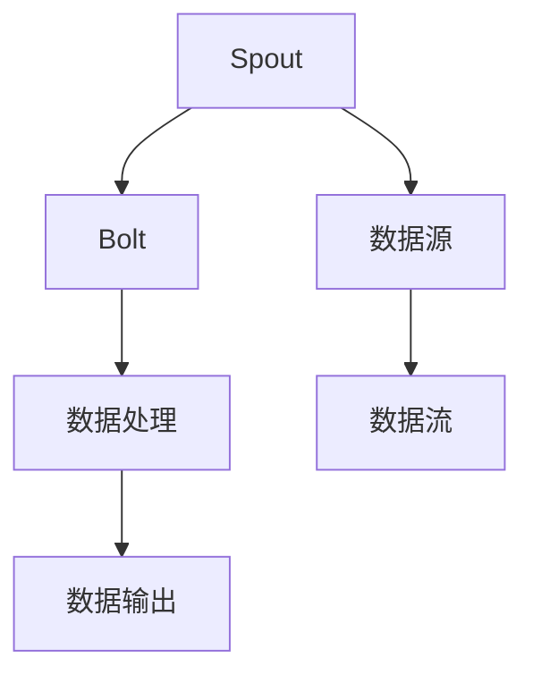
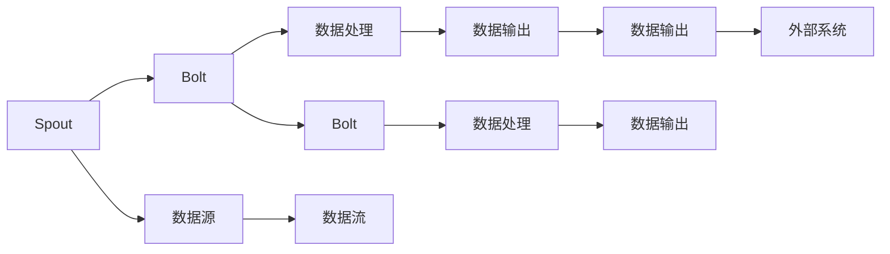
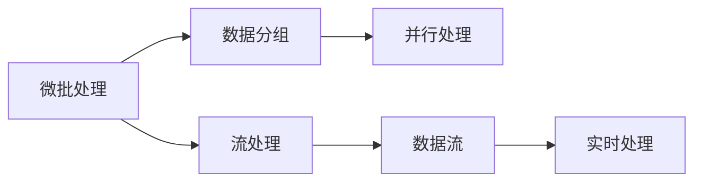
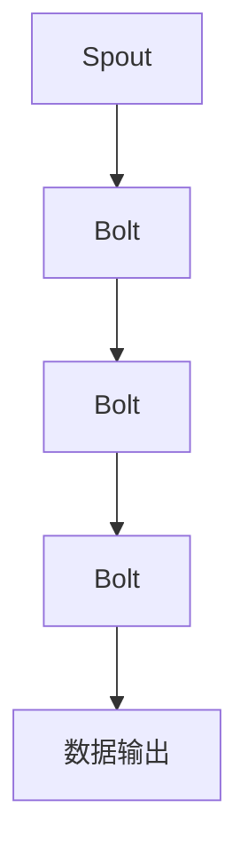

                 

# Storm原理与代码实例讲解

> 关键词：Storm,分布式流处理,Apache Storm,高吞吐量,高可靠性,可扩展性

## 1. 背景介绍

### 1.1 问题由来
在当今数据爆炸的时代，大数据的处理和分析成为了企业竞争的核心。实时数据流处理是其中一种关键技术，它可以帮助企业实时获取数据洞察，快速响应市场变化。然而，传统的批处理方式难以应对实时数据的处理需求，而且数据延迟较高，无法满足实时性要求。为了解决这些问题，分布式流处理技术应运而生，其中的代表是Apache Storm。

### 1.2 问题核心关键点
Apache Storm是一种分布式流处理框架，能够高效地处理实时数据流，适用于需要实时响应的应用场景，如实时分析、实时计算、实时数据采集等。Storm框架的核心特性包括：

- **高吞吐量**：能够处理每秒数百万条数据的处理需求，确保数据的实时性和可靠性。
- **高可靠性**：支持容错处理，保证任务的可靠性和数据的完整性。
- **高可扩展性**：通过扩展集群节点，能够轻松应对海量数据流的处理。

Storm的分布式计算模型采用微批处理和流处理相结合的方式，既能保证处理效率，又能处理无界数据流。通过Spout和Bolt组件，Storm构建了实时数据流处理的全链路处理流程，可以实现复杂的数据处理和计算。

### 1.3 问题研究意义
研究Apache Storm的原理与代码实例，对于理解分布式流处理框架的核心技术和实际应用具有重要意义。通过学习Storm的分布式计算模型和关键组件的实现原理，可以深入掌握实时数据流处理的实现方式，为实际应用提供可靠的技术支持。此外，通过分析Storm的代码实例，可以帮助开发者更好地理解和应用其核心特性和功能，提升开发效率和系统性能。

## 2. 核心概念与联系

### 2.1 核心概念概述

为了更好地理解Apache Storm的原理与代码实例，本节将介绍几个密切相关的核心概念：

- **分布式流处理**：通过分布式计算框架对实时数据流进行并行处理，实现高吞吐量、高可靠性的数据处理。
- **Apache Storm**：一种开源的分布式流处理框架，提供了Spout和Bolt组件，支持微批处理和流处理，适用于需要实时响应的应用场景。
- **Spout**：Storm中的数据源，负责从外部系统读取数据，并生成数据流。
- **Bolt**：Storm中的数据处理组件，负责数据的接收、处理、计算和输出。
- **Topology**：Storm中的计算图，由Spout和Bolt组成，定义了数据流的处理逻辑。

这些核心概念之间的关系可以通过以下Mermaid流程图来展示：



这个流程图展示了Spout、Bolt和Topology的基本关系：

1. Spout从数据源读取数据，生成数据流。
2. Bolt接收数据流，进行处理和计算。
3. 处理结果通过Bolt输出，传递给下游Bolt或外部系统。

### 2.2 概念间的关系

这些核心概念之间存在着紧密的联系，形成了Apache Storm的分布式流处理生态系统。下面我们通过几个Mermaid流程图来展示这些概念之间的关系。

#### 2.2.1 Storm的分布式计算模型



这个流程图展示了Storm的分布式计算模型。Spout从数据源读取数据，生成数据流，经过多个Bolt处理后，最终输出到外部系统。

#### 2.2.2 微批处理与流处理



这个流程图展示了微批处理和流处理的基本关系。微批处理将数据分组后进行并行处理，流处理则对实时数据流进行持续处理，两者结合使用，能够满足不同的数据处理需求。

#### 2.2.3 Storm Topology的构建



这个流程图展示了Topology的基本构建方式。Topology由Spout和Bolt组成，定义了数据流的处理逻辑。通过连接多个Bolt，可以实现复杂的数据处理和计算。

### 2.3 核心概念的整体架构

最后，我们用一个综合的流程图来展示这些核心概念在大规模数据流处理中的整体架构：

```mermaid
graph TB
    A[大规模数据源] --> B[Spout]
    B --> C[Bolt]
    C --> D[Bolt]
    D --> E[数据输出]
    A --> F[数据采样]
    F --> G[Bolt]
    G --> H[Bolt]
    H --> I[Bolt]
    I --> J[Bolt]
    J --> K[Bolt]
    K --> L[Bolt]
    L --> M[Bolt]
    M --> N[Bolt]
    N --> O[Bolt]
    O --> P[Bolt]
    P --> Q[Bolt]
    Q --> R[Bolt]
    R --> S[Bolt]
    S --> T[Bolt]
    T --> U[Bolt]
    U --> V[Bolt]
    V --> W[Bolt]
    W --> X[Bolt]
    X --> Y[Bolt]
    Y --> Z[Bolt]
    Z --> AA[Bolt]
    AA --> AB[Bolt]
    AB --> AC[Bolt]
    AC --> AD[Bolt]
    AD --> AE[Bolt]
    AE --> AF[Bolt]
    AF --> AG[Bolt]
    AG --> AH[Bolt]
    AH --> AI[Bolt]
    AI --> AJ[Bolt]
    AJ --> AK[Bolt]
    AK --> AL[Bolt]
    AL --> AM[Bolt]
    AM --> AN[Bolt]
    AN --> AO[Bolt]
    AO --> AP[Bolt]
    AP --> AQ[Bolt]
    AQ --> AR[Bolt]
    AR --> AS[Bolt]
    AS --> AT[Bolt]
    AT --> AU[Bolt]
    AU --> AV[Bolt]
    AV --> AW[Bolt]
    AW --> AX[Bolt]
    AX --> AY[Bolt]
    AY --> AZ[Bolt]
    AZ --> BA[Bolt]
    BA --> BB[Bolt]
    BB --> BC[Bolt]
    BC --> BD[Bolt]
    BD --> BE[Bolt]
    BE --> BF[Bolt]
    BF --> BG[Bolt]
    BG --> BH[Bolt]
    BH --> BI[Bolt]
    BI --> BJ[Bolt]
    BJ --> BK[Bolt]
    BK --> BL[Bolt]
    BL --> BM[Bolt]
    BM --> BN[Bolt]
    BN --> BO[Bolt]
    BO --> BP[Bolt]
    BP --> BQ[Bolt]
    BQ --> BR[Bolt]
    BR --> BS[Bolt]
    BS --> BT[Bolt]
    BT --> BU[Bolt]
    BU --> BV[Bolt]
    BV --> BW[Bolt]
    BW --> BX[Bolt]
    BX --> BY[Bolt]
    BY --> BZ[Bolt]
    BZ --> CA[Bolt]
    CA --> CB[Bolt]
    CB --> CC[Bolt]
    CC --> CD[Bolt]
    CD --> CE[Bolt]
    CE --> CF[Bolt]
    CF --> CG[Bolt]
    CG --> CH[Bolt]
    CH --> CI[Bolt]
    CI --> CJ[Bolt]
    CJ --> CK[Bolt]
    CK --> CL[Bolt]
    CL --> CM[Bolt]
    CM --> CN[Bolt]
    CN --> CO[Bolt]
    CO --> CP[Bolt]
    CP --> CQ[Bolt]
    CQ --> CR[Bolt]
    CR --> CS[Bolt]
    CS --> CT[Bolt]
    CT --> CU[Bolt]
    CU --> CV[Bolt]
    CV --> CW[Bolt]
    CW --> CX[Bolt]
    CX --> CY[Bolt]
    CY --> CZ[Bolt]
    CZ --> DA[Bolt]
    DA --> DB[Bolt]
    DB --> DC[Bolt]
    DC --> DD[Bolt]
    DD --> DE[Bolt]
    DE --> DF[Bolt]
    DF --> DG[Bolt]
    DG --> DH[Bolt]
    DH --> DI[Bolt]
    DI --> DJ[Bolt]
    DJ --> DK[Bolt]
    DK --> DL[Bolt]
    DL --> DM[Bolt]
    DM --> DN[Bolt]
    DN --> DO[Bolt]
    DO --> DP[Bolt]
    DP --> DQ[Bolt]
    DQ --> DR[Bolt]
    DR --> DS[Bolt]
    DS --> DT[Bolt]
    DT --> DU[Bolt]
    DU --> DV[Bolt]
    DV --> DW[Bolt]
    DW --> DX[Bolt]
    DX --> DY[Bolt]
    DY --> DZ[Bolt]
    DZ --> EA[Bolt]
    EA --> EB[Bolt]
    EB --> EC[Bolt]
    EC --> ED[Bolt]
    ED --> EE[Bolt]
    EE --> EF[Bolt]
    EF --> EG[Bolt]
    EG --> EH[Bolt]
    EH --> EI[Bolt]
    EI --> EJ[Bolt]
    EJ --> EK[Bolt]
    EK --> EL[Bolt]
    EL --> EM[Bolt]
    EM --> EN[Bolt]
    EN --> EO[Bolt]
    EO --> EP[Bolt]
    EP --> EQ[Bolt]
    EQ --> ER[Bolt]
    ER --> ES[Bolt]
    ES --> ET[Bolt]
    ET --> EU[Bolt]
    EU --> EV[Bolt]
    EV --> EW[Bolt]
    EW --> EX[Bolt]
    EX --> EY[Bolt]
    EY --> EZ[Bolt]
    EZ --> FA[Bolt]
    FA --> FB[Bolt]
    FB --> FC[Bolt]
    FC --> FD[Bolt]
    FD --> FE[Bolt]
    FE --> FF[Bolt]
    FF --> FG[Bolt]
    FG --> FH[Bolt]
    FH --> FI[Bolt]
    FI --> FJ[Bolt]
    FJ --> FK[Bolt]
    FK --> FL[Bolt]
    FL --> FM[Bolt]
    FM --> FN[Bolt]
    FN --> FO[Bolt]
    FO --> FP[Bolt]
    FP --> FQ[Bolt]
    FQ --> FR[Bolt]
    FR --> FS[Bolt]
    FS --> FT[Bolt]
    FT --> FU[Bolt]
    FU --> FV[Bolt]
    FV --> FW[Bolt]
    FW --> FX[Bolt]
    FX --> FY[Bolt]
    FY --> FZ[Bolt]
    FZ --> GA[Bolt]
    GA --> GB[Bolt]
    GB --> GC[Bolt]
    GC --> GD[Bolt]
    GD --> GE[Bolt]
    GE --> GF[Bolt]
    GF --> GG[Bolt]
    GG --> GH[Bolt]
    GH --> GI[Bolt]
    GI --> GJ[Bolt]
    GJ --> GK[Bolt]
    GK --> GL[Bolt]
    GL --> GM[Bolt]
    GM --> GN[Bolt]
    GN --> GO[Bolt]
    GO --> GP[Bolt]
    GP --> GQ[Bolt]
    GQ --> GR[Bolt]
    GR --> GS[Bolt]
    GS --> GT[Bolt]
    GT --> GU[Bolt]
    GU -->GV[Bolt]
    GV --> GW[Bolt]
    GW --> GX[Bolt]
    GX --> GY[Bolt]
    GY --> GZ[Bolt]
    GZ --> HA[Bolt]
    HA --> HB[Bolt]
    HB --> HC[Bolt]
    HC --> HD[Bolt]
    HD --> HE[Bolt]
    HE --> HF[Bolt]
    HF --> HG[Bolt]
    HG --> HH[Bolt]
    HH --> HI[Bolt]
    HI --> HJ[Bolt]
    HJ --> HK[Bolt]
    HK --> HL[Bolt]
    HL --> HM[Bolt]
    HM --> HN[Bolt]
    HN --> HO[Bolt]
    HO --> HP[Bolt]
    HP --> HQ[Bolt]
    HQ --> HR[Bolt]
    HR --> HS[Bolt]
    HS --> HT[Bolt]
    HT --> HU[Bolt]
    HU --> HV[Bolt]
    HV --> HW[Bolt]
    HW --> HX[Bolt]
    HX --> HY[Bolt]
    HY --> HZ[Bolt]
    HZ --> IA[Bolt]
    IA --> IB[Bolt]
    IB --> IC[Bolt]
    IC --> ID[Bolt]
    ID --> IE[Bolt]
    IE --> IF[Bolt]
    IF --> IG[Bolt]
    IG --> IH[Bolt]
    IH --> IJ[Bolt]
    IJ --> IK[Bolt]
    IK --> IL[Bolt]
    IL --> IM[Bolt]
    IM --> IN[Bolt]
    IN --> IO[Bolt]
    IO --> IP[Bolt]
    IP --> IQ[Bolt]
    IQ --> IR[Bolt]
    IR --> IS[Bolt]
    IS --> IT[Bolt]
    IT --> IU[Bolt]
    IU --> IV[Bolt]
    IV --> IW[Bolt]
    IW --> IX[Bolt]
    IX --> IY[Bolt]
    IY --> IZ[Bolt]
    IZ --> JA[Bolt]
    JA --> JB[Bolt]
    JB --> JC[Bolt]
    JC --> JD[Bolt]
    JD -->JE[Bolt]
    JE --> JF[Bolt]
    JF --> JG[Bolt]
    JG --> JH[Bolt]
    JH --> JI[Bolt]
    JI --> JJ[Bolt]
    JJ --> JK[Bolt]
    JK --> JL[Bolt]
    JL --> JM[Bolt]
    JM --> JN[Bolt]
    JN --> JO[Bolt]
    JO --> JP[Bolt]
    JP --> JQ[Bolt]
    JQ --> JR[Bolt]
    JR --> JS[Bolt]
    JS --> JT[Bolt]
    JT --> JU[Bolt]
    JU --> JV[Bolt]
    JV --> JW[Bolt]
    JW --> JX[Bolt]
    JX --> JY[Bolt]
    JY --> JZ[Bolt]
    JZ --> KA[Bolt]
    KA --> KB[Bolt]
    KB --> KC[Bolt]
    KC --> KD[Bolt]
    KD --> KE[Bolt]
    KE --> KF[Bolt]
    KF --> KG[Bolt]
    KG --> KH[Bolt]
    KH --> KI[Bolt]
    KI --> KJ[Bolt]
    KJ --> KK[Bolt]
    KK --> KL[Bolt]
    KL --> KM[Bolt]
    KM --> KN[Bolt]
    KN --> KO[Bolt]
    KO --> KP[Bolt]
    KP --> KQ[Bolt]
    KQ --> KR[Bolt]
    KR --> KS[Bolt]
    KS --> KT[Bolt]
    KT --> KU[Bolt]
    KU --> KV[Bolt]
    KV --> KW[Bolt]
    KW --> KX[Bolt]
    KX --> KY[Bolt]
    KY --> KZ[Bolt]
    KZ --> LA[Bolt]
    LA --> LB[Bolt]
    LB --> LC[Bolt]
    LC --> LD[Bolt]
    LD --> LE[Bolt]
    LE --> LF[Bolt]
    LF --> LG[Bolt]
    LG --> LH[Bolt]
    LH --> LI[Bolt]
    LI --> LJ[Bolt]
    LJ --> LK[Bolt]
    LK --> LL[Bolt]
    LL --> LM[Bolt]
    LM --> LN[Bolt]
    LN --> LO[Bolt]
    LO --> LP[Bolt]
    LP --> LQ[Bolt]
    LQ --> LR[Bolt]
    LR --> LS[Bolt]
    LS --> LT[Bolt]
    LT --> LU[Bolt]
    LU --> LV[Bolt]
    LV --> LW[Bolt]
    LW --> LX[Bolt]
    LX --> LY[Bolt]
    LY --> LZ[Bolt]
    LZ --> MA[Bolt]
    MA --> MB[Bolt]
    MB --> MC[Bolt]
    MC --> MD[Bolt]
    MD --> ME[Bolt]
    ME --> MF[Bolt]
    MF --> MG[Bolt]
    MG --> MH[Bolt]
    MH --> MI[Bolt]
    MI --> MJ[Bolt]
    MJ --> MK[Bolt]
    MK --> ML[Bolt]
    ML --> MM[Bolt]
    MM --> MN[Bolt]
    MN --> MO[Bolt]
    MO --> MP[Bolt]
    MP --> MQ[Bolt]
    MQ --> MR[Bolt]
    MR --> MS[Bolt]
    MS --> MT[Bolt]
    MT --> MU[Bolt]
    MU --> MV[Bolt]
    MV --> MW[Bolt]
    MW --> MX[Bolt]
    MX --> MY[Bolt]
    MY --> MZ[Bolt]
    MZ --> NA[Bolt]
    NA --> NB[Bolt]
    NB --> NC[Bolt]
    NC --> ND[Bolt]
    ND --> NE[Bolt]
    NE --> NF[Bolt]
    NF --> NG[Bolt]
    NG --> NH[Bolt]
    NH --> NI[Bolt]
    NI --> NJ[Bolt]
    NJ --> NK[Bolt]
    NK --> NL[Bolt]
    NL --> NM[Bolt]
    NM --> NN[Bolt]
    NN --> NO[Bolt]
    NO --> NP[Bolt]
    NP --> NQ[Bolt]
    NQ --> NR[Bolt]
    NR --> NS[Bolt]
    NS --> NT[Bolt]
    NT --> NU[Bolt]
    NU --> NV[Bolt]
    NV --> NW[Bolt]
    NW --> NX[Bolt]
    NX --> NY[Bolt]
    NY --> NZ[Bolt]
    NZ --> OA[Bolt]
    OA --> OB[Bolt]
    OB --> OC[Bolt]
    OC --> OD[Bolt]
    OD --> OE[Bolt]
    OE --> OF[Bolt]
    OF --> OG[Bolt]
    OG --> OH[Bolt]
    OH --> OI[Bolt]
    OI --> OJ[Bolt]
    OJ --> OK[Bolt]
    OK --> OL[Bolt]
    OL --> OM[Bolt]
    OM --> ON[Bolt]
    ON --> OO[Bolt]
    OO --> OP[Bolt]
    OP --> OQ[Bolt]
    OQ --> OR[Bolt]
    OR --> OS[Bolt]
    OS --> OT[Bolt]
    OT --> OU[Bolt]
    OU -->OV[Bolt]
    OV --> OW[Bolt]
    OW --> OX[Bolt]
    OX --> OY[Bolt]
    OY --> OZ[Bolt]
    OZ --> PA[Bolt]
    PA --> PB[Bolt]
    PB --> PC[Bolt]
    PC --> PD[Bolt]
    PD --> PE[Bolt]
    PE --> PF[Bolt]
    PF --> PG[Bolt]
    PG --> PH[Bolt]
    PH --> PI[Bolt]
    PI --> PJ[Bolt]
    PJ --> PK[Bolt]
    PK --> PL[Bolt]
    PL --> PM[Bolt]
    PM --> PN[Bolt]
    PN --> PO[Bolt]
    PO --> PP[Bolt]
    PP --> PQ[Bolt]
    PQ --> PR[Bolt]
    PR --> PS[Bolt]
    PS --> PT[Bolt]
    PT --> PU[Bolt]
    PU --> PV[Bolt]
    PV --> PW[Bolt]
    PW --> PX[Bolt]
    PX --> PY[Bolt]
    PY --> PZ[Bolt]
    PZ --> QA[Bolt]
    QA --> QB[Bolt]
    QB --> QC[Bolt]
    QC --> QD[Bolt]
    QD --> QE[Bolt]
    QE --> QF[Bolt]
    QF --> QG[Bolt]
    QG --> QH[Bolt]
    QH --> QI[Bolt]
    QI --> QJ[Bolt]
    QJ --> QK[Bolt]
    QK --> QL[Bolt]
    QL --> QM[Bolt]
    QM --> QN[Bolt]
    QN --> QO[Bolt]
    QO --> QP[Bolt]
    QP --> QQ[Bolt]
    QQ --> QR[Bolt]
    QR --> QS[Bolt]
    QS --> QT[Bolt]
    QT --> QU[Bolt]
    QU --> QV[Bolt]
    QV --> QW[Bolt]
    QW --> QX[Bolt]
    QX --> QY[Bolt]
    QY --> QZ[Bolt]
    QZ --> RA[Bolt]
    RA --> RB[Bolt]
    RB --> RC[Bolt]
    RC --> RD[Bolt]
    RD --> RE[Bolt]
    RE --> RF[Bolt]
    RF --> RG[Bolt]
    RG --> RH[Bolt]
    RH --> RI[Bolt]
    RI --> RJ[Bolt]
    RJ --> RK[Bolt]
    RK --> RL[Bolt]
    RL --> RM[Bolt]
    RM --> RN[Bolt]
    RN --> RO[Bolt]
    RO --> RP[Bolt]
    RP --> RQ[Bolt]
    RQ --> RR[Bolt]
    RR --> RS[Bolt]
    RS --> RT[Bolt]
    RT --> RU[Bolt]
    RU --> RV[Bolt]
    RV --> RW[Bolt]
    RW --> RX[Bolt]
    RX --> RY[Bolt]
    RY --> RZ[Bolt]
    RZ --> SA[Bolt]
    SA --> SB[Bolt]
    SB --> SC[Bolt]
    SC --> SD[Bolt]
    SD --> SE[Bolt]
    SE --> SF[Bolt]
    SF --> SG[Bolt]
    SG --> SH[Bolt]
    SH --> SI[Bolt]
    SI --> SJ[Bolt]
    SJ --> SK[Bolt]
    SK --> SL[Bolt]
    SL --> SM[Bolt]
    SM --> SN[Bolt]
    SN --> SO[Bolt]
    SO --> SP[Bolt]
    SP --> SQ[Bolt]
    SQ --> SR[Bolt]
    SR --> SS[Bolt]
    SS --> ST[Bolt]
    ST --> SU[Bolt]
    SU --> SV[Bolt]
    SV --> SW[Bolt]
    SW --> SX[Bolt]
    SX --> SY[Bolt]
    SY --> SZ[Bolt]
    SZ --> TA[Bolt]
    TA --> TB[Bolt]
    TB --> TC[Bolt]
    TC --> TD[Bolt]
    TD --> TE[Bolt]
    TE --> TF[Bolt]
    TF --> TG[Bolt]
    TG --> TH[Bolt]
    TH --> TI[Bolt]
    TI --> TJ[Bolt]
    TJ --> TK[Bolt]
    TK --> TL[Bolt]
    TL --> TM[Bolt]
    TM --> TN[Bolt]
    TN --> TO[Bolt]
    TO --> TP[Bolt]
    TP --> TQ[Bolt]
    TQ --> TR[Bolt]
    TR --> TS[Bolt]
    TS --> TT[Bolt]
    TT --> TU[Bolt]
    TU --> TV[Bolt]
    TV --> TW[Bolt]
    TW --> TX[Bolt]
    TX --> TY[Bolt]
    TY --> TZ[Bolt]
    TZ --> UA[Bolt]
    UA --> UB[Bolt]
    UB --> UC[Bolt]
    UC --> UD[Bolt]
    UD --> UE[Bolt]
    UE --> UF[Bolt]
    UF --> UG[Bolt]
    UG --> UH[Bolt]
    UH --> UI[Bolt]
    UI --> UJ[Bolt]
    UJ --> UK[Bolt]
    UK --> UL[Bolt]
    UL --> UM[Bolt]
    UM --> UN[Bolt]
    UN --> UO[Bolt]
    UO --> UP[Bolt]
    UP --> UQ[Bolt]
    UQ --> UR[Bolt]
    UR --> US[Bolt]
    US --> UT[Bolt]
    UT --> UU[Bolt]
    UU --> UV[Bolt]
    UV --> UW[Bolt]
    UW --> UX[Bolt]
    UX --> UY[Bolt]
    UY --> UZ[Bolt]
    UZ --> VA[Bolt]
    VA --> VB[Bolt]
    VB --> VC[Bolt]
    VC --> VD[Bolt]
    VD --> VE[Bolt]
    VE --> VF[Bolt]
    VF --> VG[Bolt]
    VG --> VH[Bolt]
    VH --> VI[Bolt]
    VI --> VJ[Bolt]
    VJ --> VK[Bolt]
    VK --> VL[Bolt]
    VL --> VM[Bolt]
    VM --> VN[Bolt]
    VN --> VO[Bolt]
    VO --> VP[Bolt]
    VP --> VQ[Bolt]
    VQ --> VR[Bolt]
    VR --> VS[Bolt]
    VS --> VT[Bolt]
    VT --> VU[Bolt]
    VU --> VV[Bolt]
    VV --> VW[Bolt]
    VW --> VX[Bolt]
    VX --> VY[Bolt]
    VY --> VZ[Bolt]
    VZ --> WA[Bolt]
    WA --> WB[Bolt]
    WB --> WC[Bolt]
    WC -->WD[Bolt]
    WD --> WE[Bolt]
    WE --> WF[Bolt]
    WF --> WG[Bolt]
    WG --> WH[Bolt]
    WH --> WI[Bolt]
    WI --> WJ[Bolt]
    WJ --> WK[Bolt]
    WK --> WL[Bolt]
    WL --> WM[Bolt]
    WM --> WN[Bolt]
    WN -->WO[Bolt]
    WO --> WP[Bolt]
    WP --> WQ[Bolt]
    WQ --> WR[Bolt]
    WR --> WS[Bolt]
    WS -->WT[Bolt]
    WT --> WU[Bolt]
    WU --> WV[Bolt]
    WV --> WW[Bolt]
    WW --> WX[Bolt]
    WX --> WY[Bolt]
    WY --> WZ[Bolt

