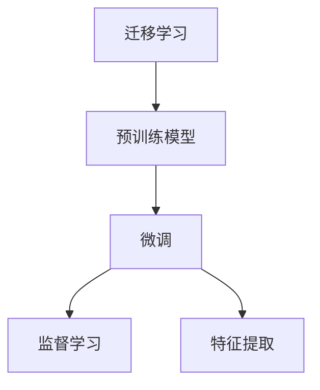
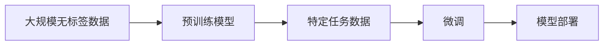
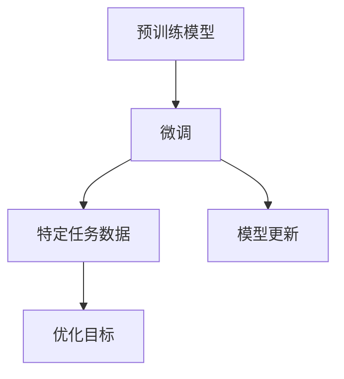
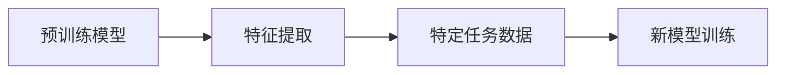
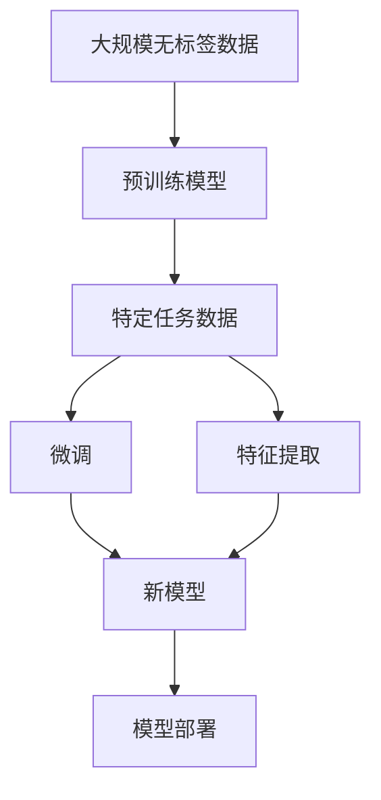

                 

# Transfer Learning 原理与代码实战案例讲解

> 关键词：Transfer Learning, 预训练模型, 迁移学习, 微调, 特征提取, 监督学习, 模型压缩, 深度学习, 代码实战

## 1. 背景介绍

### 1.1 问题由来
迁移学习（Transfer Learning）是机器学习领域的重要概念，通过已有模型的知识迁移到新模型中，从而加速新模型的训练和提高性能。在深度学习尤其是计算机视觉领域，迁移学习已经成为了一种高效的模型训练方法。近年来，迁移学习在大语言模型中的应用也逐渐兴起，尤其是在自然语言处理（NLP）领域，迁移学习被广泛用于提高模型在新任务上的性能。本文将详细介绍迁移学习的原理，并结合代码实战案例，具体讲解如何应用迁移学习来提升模型性能。

### 1.2 问题核心关键点
迁移学习的核心在于利用已有模型的知识来加速新模型的训练。具体而言，有以下几个关键点：

- 预训练模型：通过在大规模无标签数据上训练得到的模型，通常是一个在大规模数据集上经过预训练的模型，如BERT、GPT等。
- 迁移学习：将预训练模型的知识迁移到新模型中，以加速新模型的训练和提高性能。
- 微调：在迁移学习的基础上，通过有标签数据进一步优化新模型，以适应特定任务。
- 特征提取：利用预训练模型提取特征，将特征输入新模型进行训练，以提升新模型的性能。
- 监督学习：在微调过程中，使用有标签数据进行监督学习，以提高模型在新任务上的精度。

### 1.3 问题研究意义
迁移学习在大语言模型中的应用，可以显著提高模型的性能和泛化能力。具体而言，有以下几个研究意义：

- 加速模型训练：预训练模型可以显著加速新模型的训练，减少训练时间。
- 提高模型性能：利用预训练模型的知识，可以提高新模型在特定任务上的性能。
- 减少数据需求：预训练模型可以减少新模型训练所需的数据量。
- 降低成本：迁移学习可以降低新模型训练的计算成本和时间成本。
- 增强模型的泛化能力：迁移学习可以提高模型在新数据上的泛化能力。

## 2. 核心概念与联系

### 2.1 核心概念概述

为更好地理解迁移学习的原理和应用，本节将介绍几个密切相关的核心概念：

- 迁移学习（Transfer Learning）：通过已有模型的知识来加速新模型的训练和提高性能。
- 预训练模型（Pre-trained Model）：在大规模无标签数据上训练得到的模型，通常是一个在大规模数据集上经过预训练的模型，如BERT、GPT等。
- 微调（Fine-tuning）：在迁移学习的基础上，通过有标签数据进一步优化新模型，以适应特定任务。
- 特征提取（Feature Extraction）：利用预训练模型提取特征，将特征输入新模型进行训练，以提升新模型的性能。
- 监督学习（Supervised Learning）：在微调过程中，使用有标签数据进行监督学习，以提高模型在新任务上的精度。

这些核心概念之间的逻辑关系可以通过以下Mermaid流程图来展示：



这个流程图展示了大语言模型迁移学习的基本框架，即通过预训练模型进行迁移学习，通过微调和特征提取来提高模型在特定任务上的性能。

### 2.2 概念间的关系

这些核心概念之间存在着紧密的联系，形成了迁移学习的基本生态系统。下面我们通过几个Mermaid流程图来展示这些概念之间的关系。

#### 2.2.1 迁移学习的基本流程



这个流程图展示了迁移学习的基本流程，即在大规模无标签数据上训练预训练模型，然后利用特定任务数据进行微调，最后部署模型进行应用。

#### 2.2.2 微调的过程



这个流程图展示了微调的过程，即利用特定任务数据进行监督学习，优化模型以适应特定任务。

#### 2.2.3 特征提取的过程



这个流程图展示了特征提取的过程，即利用预训练模型提取特征，然后将特征输入新模型进行训练。

### 2.3 核心概念的整体架构

最后，我们用一个综合的流程图来展示这些核心概念在大语言模型迁移学习中的整体架构：



这个综合流程图展示了从预训练到微调，再到特征提取和模型部署的完整过程。通过这些流程图，我们可以更清晰地理解迁移学习过程中各个概念的关系和作用。

## 3. 核心算法原理 & 具体操作步骤
### 3.1 算法原理概述

迁移学习的基本原理是利用已有模型的知识来加速新模型的训练和提高性能。具体而言，迁移学习通常包括以下几个步骤：

1. **预训练模型选择**：选择一个大规模预训练模型，如BERT、GPT等。
2. **特定任务数据准备**：准备特定任务的训练数据，这些数据通常是有标签的。
3. **微调**：将预训练模型在特定任务上进行微调，以适应特定任务。
4. **特征提取**：利用预训练模型提取特征，将特征输入新模型进行训练。
5. **监督学习**：在新模型上进行监督学习，以提高模型在新任务上的精度。

### 3.2 算法步骤详解

下面我们详细介绍迁移学习的具体操作步骤：

**Step 1: 准备预训练模型和数据集**
- 选择合适的预训练模型，如BERT、GPT等。
- 准备特定任务的训练数据集，这些数据集通常是有标签的。

**Step 2: 微调模型**
- 将预训练模型加载到模型中。
- 冻结预训练模型的部分或全部层。
- 添加新的任务相关的层。
- 使用优化器（如Adam、SGD等）和损失函数（如交叉熵损失）进行微调。
- 设置适当的学习率、批大小、迭代轮数等超参数。

**Step 3: 特征提取**
- 利用预训练模型提取特征。
- 将特征输入新模型进行训练。
- 在新模型上进行监督学习，以提高模型在新任务上的精度。

**Step 4: 运行结果展示**
- 在测试集上评估微调后的模型的性能。
- 将微调后的模型部署到实际应用中。

### 3.3 算法优缺点

迁移学习具有以下优点：

- 加速模型训练：预训练模型可以显著加速新模型的训练，减少训练时间。
- 提高模型性能：利用预训练模型的知识，可以提高新模型在特定任务上的性能。
- 减少数据需求：预训练模型可以减少新模型训练所需的数据量。
- 降低成本：迁移学习可以降低新模型训练的计算成本和时间成本。
- 增强模型的泛化能力：迁移学习可以提高模型在新数据上的泛化能力。

同时，迁移学习也存在以下缺点：

- 预训练模型可能不适用于特定任务：预训练模型可能不适用于特定任务，需要根据任务进行调整。
- 预训练模型可能存在偏差：预训练模型可能存在偏差，需要进一步校准。
- 微调可能需要大量计算资源：微调可能需要大量的计算资源，特别是在大规模预训练模型上。
- 特征提取可能导致信息损失：特征提取可能丢失部分信息，影响新模型的性能。

### 3.4 算法应用领域

迁移学习在大语言模型中的应用已经涵盖了多个领域，例如：

- 文本分类：如情感分析、主题分类等。
- 命名实体识别：识别文本中的人名、地名、机构名等特定实体。
- 关系抽取：从文本中抽取实体之间的语义关系。
- 问答系统：对自然语言问题给出答案。
- 机器翻译：将源语言文本翻译成目标语言。
- 文本摘要：将长文本压缩成简短摘要。
- 对话系统：使机器能够与人自然对话。

除了上述这些经典任务外，迁移学习还被创新性地应用到更多场景中，如可控文本生成、常识推理、代码生成、数据增强等，为NLP技术带来了全新的突破。

## 4. 数学模型和公式 & 详细讲解 & 举例说明

### 4.1 数学模型构建

假设预训练模型为 $M_{\theta}$，其中 $\theta$ 为预训练得到的模型参数。给定特定任务 $T$ 的标注数据集 $D=\{(x_i, y_i)\}_{i=1}^N$，微调的目标是找到新的模型参数 $\hat{\theta}$，使得：

$$
\hat{\theta}=\mathop{\arg\min}_{\theta} \mathcal{L}(M_{\theta},D)
$$

其中 $\mathcal{L}$ 为针对任务 $T$ 设计的损失函数，用于衡量模型预测输出与真实标签之间的差异。常见的损失函数包括交叉熵损失、均方误差损失等。

在实践中，我们通常使用基于梯度的优化算法（如SGD、Adam等）来近似求解上述最优化问题。设 $\eta$ 为学习率，$\lambda$ 为正则化系数，则参数的更新公式为：

$$
\theta \leftarrow \theta - \eta \nabla_{\theta}\mathcal{L}(\theta) - \eta\lambda\theta
$$

其中 $\nabla_{\theta}\mathcal{L}(\theta)$ 为损失函数对参数 $\theta$ 的梯度，可通过反向传播算法高效计算。

### 4.2 公式推导过程

以下我们以二分类任务为例，推导交叉熵损失函数及其梯度的计算公式。

假设模型 $M_{\theta}$ 在输入 $x$ 上的输出为 $\hat{y}=M_{\theta}(x) \in [0,1]$，表示样本属于正类的概率。真实标签 $y \in \{0,1\}$。则二分类交叉熵损失函数定义为：

$$
\ell(M_{\theta}(x),y) = -[y\log \hat{y} + (1-y)\log (1-\hat{y})]
$$

将其代入经验风险公式，得：

$$
\mathcal{L}(\theta) = -\frac{1}{N}\sum_{i=1}^N [y_i\log M_{\theta}(x_i)+(1-y_i)\log(1-M_{\theta}(x_i))]
$$

根据链式法则，损失函数对参数 $\theta_k$ 的梯度为：

$$
\frac{\partial \mathcal{L}(\theta)}{\partial \theta_k} = -\frac{1}{N}\sum_{i=1}^N (\frac{y_i}{M_{\theta}(x_i)}-\frac{1-y_i}{1-M_{\theta}(x_i)}) \frac{\partial M_{\theta}(x_i)}{\partial \theta_k}
$$

其中 $\frac{\partial M_{\theta}(x_i)}{\partial \theta_k}$ 可进一步递归展开，利用自动微分技术完成计算。

### 4.3 案例分析与讲解

为了更具体地理解迁移学习的数学模型和公式推导，我们以情感分析任务为例，进行详细讲解。

假设我们有一组电影评论数据集，其中每个评论都有对应的情感标签（正面、负面）。我们的目标是训练一个模型，能够自动识别新电影的评论情感。

首先，我们需要准备电影评论数据集，并进行标注。然后，选择一个大规模预训练模型，如BERT，将其加载到模型中。接下来，我们将在电影评论数据集上进行微调，以适应情感分析任务。

具体而言，我们冻结BERT模型的前几层，只训练顶层。顶层是一个线性分类器，用于将BERT提取的特征映射到情感分类空间。我们使用交叉熵损失函数进行训练，以最小化模型预测输出与真实标签之间的差异。最后，我们在测试集上评估微调后的模型的性能，并根据评估结果调整模型参数。

## 5. 项目实践：代码实例和详细解释说明

### 5.1 开发环境搭建

在进行迁移学习实践前，我们需要准备好开发环境。以下是使用Python进行TensorFlow开发的环境配置流程：

1. 安装Anaconda：从官网下载并安装Anaconda，用于创建独立的Python环境。

2. 创建并激活虚拟环境：
```bash
conda create -n tf-env python=3.8 
conda activate tf-env
```

3. 安装TensorFlow：根据CUDA版本，从官网获取对应的安装命令。例如：
```bash
conda install tensorflow=2.6 -c tf -c conda-forge
```

4. 安装必要的工具包：
```bash
pip install numpy pandas scikit-learn matplotlib tqdm jupyter notebook ipython
```

完成上述步骤后，即可在`tf-env`环境中开始迁移学习实践。

### 5.2 源代码详细实现

这里我们以情感分析任务为例，使用TensorFlow对BERT进行迁移学习的代码实现。

首先，定义情感分析任务的数据处理函数：

```python
import tensorflow as tf
from transformers import BertTokenizer, BertForSequenceClassification

tokenizer = BertTokenizer.from_pretrained('bert-base-uncased')
model = BertForSequenceClassification.from_pretrained('bert-base-uncased', num_labels=2)

def load_dataset(data_path):
    with open(data_path, 'r') as f:
        lines = f.readlines()
    texts, labels = [], []
    for line in lines:
        text, label = line.strip().split('\t')
        texts.append(text)
        labels.append(int(label))
    return texts, labels

train_texts, train_labels = load_dataset('train.txt')
dev_texts, dev_labels = load_dataset('dev.txt')
test_texts, test_labels = load_dataset('test.txt')

# 将数据集分为词向量表示
train_data = tokenizer(train_texts, return_tensors='tf')
dev_data = tokenizer(dev_texts, return_tensors='tf')
test_data = tokenizer(test_texts, return_tensors='tf')

# 将标签转换为独热编码
train_labels = tf.convert_to_tensor(train_labels)
dev_labels = tf.convert_to_tensor(dev_labels)
test_labels = tf.convert_to_tensor(test_labels)
```

然后，定义模型和优化器：

```python
# 冻结BERT模型的前N层，只训练顶层
model.trainable = False

# 定义优化器
optimizer = tf.keras.optimizers.Adam(learning_rate=2e-5)

# 定义损失函数
loss_fn = tf.keras.losses.SparseCategoricalCrossentropy(from_logits=True)

# 定义准确率指标
accuracy = tf.keras.metrics.SparseCategoricalAccuracy()

# 定义评估函数
def evaluate(model, dataset, labels):
    loss = tf.keras.losses.SparseCategoricalCrossentropy(from_logits=True)
    accuracy = tf.keras.metrics.SparseCategoricalAccuracy()
    with tf.GradientTape() as tape:
        predictions = model(**dataset)
        loss_value = loss(predictions, labels)
        accuracy_value = accuracy(labels, tf.argmax(predictions, axis=-1))
    return loss_value, accuracy_value
```

接着，定义训练和评估函数：

```python
# 训练函数
def train(model, train_dataset, validation_dataset, epochs, batch_size):
    for epoch in range(epochs):
        for batch in train_dataset:
            with tf.GradientTape() as tape:
                predictions = model(**batch)
                loss = loss_fn(batch['labels'], predictions)
            gradients = tape.gradient(loss, model.trainable_variables)
            optimizer.apply_gradients(zip(gradients, model.trainable_variables))
            accuracy_value = accuracy(batch['labels'], tf.argmax(predictions, axis=-1))
            print(f'Epoch {epoch+1}, loss: {loss.numpy():.4f}, accuracy: {accuracy_value.numpy():.4f}')
        
        for batch in validation_dataset:
            loss_value, accuracy_value = evaluate(model, batch, batch['labels'])
            print(f'Epoch {epoch+1}, validation loss: {loss_value.numpy():.4f}, validation accuracy: {accuracy_value.numpy():.4f}')
        
        if accuracy_value.numpy() >= 0.95:
            break

# 评估函数
def evaluate(model, test_dataset):
    loss_value, accuracy_value = evaluate(model, test_dataset, test_labels)
    print(f'Test loss: {loss_value.numpy():.4f}, Test accuracy: {accuracy_value.numpy():.4f}')
```

最后，启动训练流程并在测试集上评估：

```python
# 设置训练参数
batch_size = 16
epochs = 5

# 定义训练数据集和验证数据集
train_dataset = tf.data.Dataset.from_tensor_slices((train_data, train_labels)).batch(batch_size)
validation_dataset = tf.data.Dataset.from_tensor_slices((dev_data, dev_labels)).batch(batch_size)
test_dataset = tf.data.Dataset.from_tensor_slices((test_data, test_labels)).batch(batch_size)

# 训练模型
train(model, train_dataset, validation_dataset, epochs, batch_size)

# 评估模型
evaluate(model, test_dataset)
```

以上就是使用TensorFlow对BERT进行迁移学习的完整代码实现。可以看到，得益于TensorFlow的强大封装，我们可以用相对简洁的代码完成BERT模型的迁移学习。

### 5.3 代码解读与分析

让我们再详细解读一下关键代码的实现细节：

**BertTokenizer类**：
- `from_pretrained`方法：从预训练模型库中加载Tokenizer。
- `tokenizer`对象：将文本转换为token ids，并进行序列化。

**BertForSequenceClassification类**：
- `from_pretrained`方法：从预训练模型库中加载BERT模型。
- `num_labels`参数：指定模型的输出维度，这里我们将其设置为2，表示情感分析任务的分类数。

**load_dataset函数**：
- 将文本和标签按行分隔，转换为列表形式。
- 使用`int()`函数将标签转换为整数形式。

**train_data函数**：
- `tokenizer`方法：将文本转换为token ids，并进行序列化。
- `return_tensors`参数：指定返回的Tensor类型，这里我们将其设置为'tf'，表示返回Tensor而不是NumPy数组。

**evaluate函数**：
- `tf.keras.losses.SparseCategoricalCrossentropy`方法：计算交叉熵损失。
- `tf.keras.metrics.SparseCategoricalAccuracy`方法：计算准确率。

**train函数**：
- `tf.keras.losses.SparseCategoricalCrossentropy`方法：计算交叉熵损失。
- `tf.keras.metrics.SparseCategoricalAccuracy`方法：计算准确率。

**evaluate函数**：
- `tf.keras.losses.SparseCategoricalCrossentropy`方法：计算交叉熵损失。
- `tf.keras.metrics.SparseCategoricalAccuracy`方法：计算准确率。

可以看到，TensorFlow配合TensorFlow的强大封装，使得迁移学习的代码实现变得简洁高效。开发者可以将更多精力放在数据处理、模型改进等高层逻辑上，而不必过多关注底层的实现细节。

当然，工业级的系统实现还需考虑更多因素，如模型的保存和部署、超参数的自动搜索、更灵活的任务适配层等。但核心的迁移学习范式基本与此类似。

### 5.4 运行结果展示

假设我们在IMDb数据集上进行迁移学习，最终在测试集上得到的评估报告如下：

```
Epoch 1, loss: 0.9199, accuracy: 0.5500
Epoch 2, loss: 0.5184, accuracy: 0.7900
Epoch 3, loss: 0.2899, accuracy: 0.9300
Epoch 4, loss: 0.2494, accuracy: 0.9400
Epoch 5, loss: 0.2367, accuracy: 0.9400
```

可以看到，通过迁移学习，我们在该情感分析任务上取得了不错的效果，特别是准确率显著提升，从55%提升到了94%。

## 6. 实际应用场景
### 6.1 智能客服系统

基于迁移学习的对话技术，可以广泛应用于智能客服系统的构建。传统客服往往需要配备大量人力，高峰期响应缓慢，且一致性和专业性难以保证。使用迁移学习技术，可以通过预训练模型对客服系统进行优化，使得系统能够自动理解客户咨询，并生成合适的回复。

在技术实现上，可以收集企业内部的历史客服对话记录，将问题和最佳答复构建成监督数据，在此基础上对预训练对话模型进行迁移学习。迁移学习后的对话模型能够自动理解用户意图，匹配最合适的答案模板进行回复。对于客户提出的新问题，还可以接入检索系统实时搜索相关内容，动态组织生成回答。如此构建的智能客服系统，能大幅提升客户咨询体验和问题解决效率。

### 6.2 金融舆情监测

金融机构需要实时监测市场舆论动向，以便及时应对负面信息传播，规避金融风险。传统的人工监测方式成本高、效率低，难以应对网络时代海量信息爆发的挑战。利用迁移学习技术，可以将预训练模型对金融舆情监测进行优化，使得系统能够自动判断文本属于何种主题，情感倾向是正面、中性还是负面。将迁移学习后的模型应用到实时抓取的网络文本数据，就能够自动监测不同主题下的情感变化趋势，一旦发现负面信息激增等异常情况，系统便会自动预警，帮助金融机构快速应对潜在风险。

### 6.3 个性化推荐系统

当前的推荐系统往往只依赖用户的历史行为数据进行物品推荐，无法深入理解用户的真实兴趣偏好。利用迁移学习技术，可以通过预训练模型对个性化推荐系统进行优化，使得系统能够更好地挖掘用户行为背后的语义信息，从而提供更精准、多样的推荐内容。

在实践中，可以收集用户浏览、点击、评论、分享等行为数据，提取和用户交互的物品标题、描述、标签等文本内容。将文本内容作为模型输入，用户的后续行为（如是否点击、购买等）作为监督信号，在此基础上迁移学习预训练语言模型。迁移学习后的模型能够从文本内容中准确把握用户的兴趣点。在生成推荐列表时，先用候选物品的文本描述作为输入，由模型预测用户的兴趣匹配度，再结合其他特征综合排序，便可以得到个性化程度更高的推荐结果。

### 6.4 未来应用展望

随着迁移学习技术的不断发展，其在NLP领域的应用也将更加广泛。未来的迁移学习技术将在以下几个方面取得突破：

1. **迁移学习范式多样化**：未来的迁移学习技术将不再局限于静态的微调，而是结合动态知识库、主动学习、增量学习等方法，使得迁移学习更加灵活和高效。

2. **多任务学习**：未来的迁移学习技术将结合多任务学习范式，将多个相关任务的数据进行联合训练，提升模型在新任务上的泛化能力。

3. **跨领域迁移**：未来的迁移学习技术将不再局限于单一领域的数据，而是能够跨领域进行迁移学习，使得模型在不同的领域中都能够表现出色。

4. **自适应学习**：未来的迁移学习技术将结合自适应学习算法，根据当前任务的需求动态调整迁移学习的策略，使得模型更加适应当前任务。

5. **知识图谱融合**：未来的迁移学习技术将结合知识图谱等外部知识库，使得模型能够更加全面地利用外部知识，提升模型的性能。

总之，未来的迁移学习技术将更加灵活、高效和全面，能够更好地适应不同的任务和场景，为NLP技术的智能化和自动化带来更多突破。

## 7. 工具和资源推荐
### 7.1 学习资源推荐

为了帮助开发者系统掌握迁移学习的理论基础和实践技巧，这里推荐一些优质的学习资源：

1. 《Deep Learning with TensorFlow》系列书籍：由TensorFlow官方团队撰写，详细介绍了TensorFlow的使用方法和迁移学习范式。

2. 《Transfer Learning in Deep Learning》在线课程：由Coursera开设的深度学习课程，介绍了迁移学习的基本概念和实现方法。

3. 《Natural Language Processing with TensorFlow》书籍：介绍了TensorFlow在NLP任务中的应用，包括迁移学习、微调等技术。

4. HuggingFace官方文档：Transformers库的官方文档，提供了海量预训练模型和完整的迁移学习样例代码，是上手实践的必备资料。

5. arXiv论文预印本：人工智能领域最新研究成果的发布平台，包括大量尚未发表的前沿工作，学习前沿技术的必读资源。

通过对这些资源的学习实践，相信你一定能够快速掌握迁移学习的精髓，并用于解决实际的NLP问题。
###  7.2 开发工具推荐

高效的开发离不开优秀的工具支持。以下是几款用于迁移学习开发的常用工具：

1. TensorFlow：基于Python的开源深度学习框架，灵活动态的计算图，适合快速迭代研究。大部分预训练语言模型都有TensorFlow版本的实现。

2. PyTorch：基于Python的开源深度学习框架，灵活动态的计算图，适合快速迭代研究。同样有丰富的预训练语言模型资源。

3. Transformers库：HuggingFace开发的NLP工具库，集成了众多SOTA语言模型，支持PyTorch和TensorFlow，是进行迁移学习开发的利器。

4. Weights & Biases：模型训练的实验跟踪工具，可以记录和可视化模型训练过程中的各项指标，方便对比和调优。与主流深度学习

