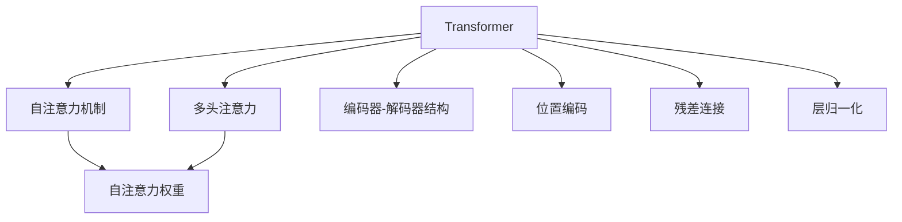
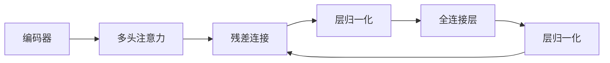
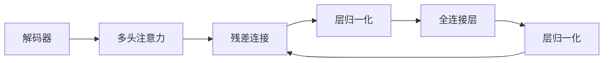

                 

# Transformer 原理与代码实例讲解

> 关键词：Transformer, 自注意力机制, 编码器-解码器结构, 注意力权重, 参数共享, 多头注意力

## 1. 背景介绍

### 1.1 问题由来
自2017年Google开源了第一篇Transformer论文以来，基于Transformer结构的模型迅速在自然语言处理(NLP)领域成为主流。Transformer的提出，彻底改变了传统的基于循环神经网络(RNN)和卷积神经网络(CNN)的序列建模范式，带来了预训练语言模型(Pretrained Language Models)的革命。

当前，Transformer结构不仅在NLP领域取得了卓越的成果，还被广泛应用到计算机视觉、语音识别、推荐系统等诸多领域。深入理解Transformer的工作原理，对于开发者和研究者来说都具有重要意义。

### 1.2 问题核心关键点
Transformer的核心是自注意力机制(Self-Attention)，它使得模型可以同时关注序列中的所有位置，无需像RNN那样逐个计算。这种机制不仅提升了计算效率，还带来了更强的表征学习能力。Transformer还包括编码器-解码器结构(Encoder-Decoder Architecture)，通过多头注意力(Multi-Head Attention)机制，实现并行化计算，进一步加速了模型的训练和推理。

Transformer的核心思想和实现细节，通过本文将进行详细介绍，并通过代码实例，深入理解其原理和应用。

## 2. 核心概念与联系

### 2.1 核心概念概述

为更好地理解Transformer，本节将介绍几个核心概念：

- **Transformer**：以自注意力机制为基础的序列建模模型，包括编码器和解码器两个部分，广泛应用于机器翻译、文本生成、问答等NLP任务。
- **自注意力机制(Self-Attention)**：根据输入序列中的位置，计算每个位置与其他位置之间的注意力权重，使得模型可以关注序列中的任意位置。
- **多头注意力(Multi-Head Attention)**：通过多个注意力头并行处理，提升模型的表示能力和泛化能力。
- **编码器-解码器结构(Encoder-Decoder Architecture)**：将序列建模分为编码和解码两个阶段，每个阶段都包含多个自注意力层，提高模型的处理效率。
- **位置编码(Positional Encoding)**：为序列中的每个位置赋予独特的编码，以区分不同位置。
- **残差连接(Residual Connections)**：在每层之间引入残差连接，帮助梯度在网络中更好地传递。
- **层归一化(Layer Normalization)**：对每层输入进行归一化，加速模型的训练和收敛。

这些核心概念之间的逻辑关系可以通过以下Mermaid流程图来展示：

这个流程图展示了大语言模型的核心概念及其之间的关系：

1. 大语言模型通过自注意力机制实现序列建模。
2. 多头注意力提升了模型对序列的关注能力和泛化能力。
3. 编码器-解码器结构将序列建模分为两个阶段。
4. 位置编码为序列中的每个位置赋予独特编码。
5. 残差连接加速了梯度传递。
6. 层归一化帮助模型更好地收敛。

这些核心概念共同构成了Transformer的基本框架，使得模型可以高效、灵活地处理序列数据。

### 2.2 概念间的关系

这些核心概念之间存在着紧密的联系，形成了Transformer的完整生态系统。下面我通过几个Mermaid流程图来展示这些概念之间的关系。

#### 2.2.1 Transformer的基本架构

这个流程图展示了Transformer的基本架构：输入序列经过编码器，然后通过解码器得到输出序列。

#### 2.2.2 编码器结构

这个流程图展示了编码器内部的结构，包括多头注意力、残差连接、层归一化、全连接层等组件。

#### 2.2.3 解码器结构

这个流程图展示了解码器内部的结构，与编码器类似。

## 3. 核心算法原理 & 具体操作步骤
### 3.1 算法原理概述

Transformer的核心是自注意力机制，它通过计算注意力权重，实现对序列中每个位置的关注。在编码器中，每个位置可以通过多头注意力机制同时关注序列中的其他位置，从而学习到更丰富的语义信息。解码器则通过多头注意力和掩码机制，预测下一个位置。

Transformer的算法流程主要分为以下几个步骤：

1. 输入嵌入(Embedding)：将输入序列中的每个词或字符嵌入到一个高维向量空间中，形成初始的输入表示。
2. 多头自注意力(Multi-Head Self-Attention)：计算输入序列中每个位置与其他位置的注意力权重，并根据权重加权求和，得到每个位置的多头自注意力表示。
3. 残差连接和层归一化(Residual Connection and Layer Normalization)：将多头自注意力表示与原始输入表示进行残差连接，并对其进行层归一化，加速模型训练和收敛。
4. 全连接层(Fully Connected Layer)：对层归一化后的向量进行线性变换，得到最终的输出表示。
5. 解码器的注意力机制(Decoder Attention)：在解码器中，通过多头自注意力和掩码机制，计算每个位置与所有位置之间的注意力权重，预测下一个位置的输出。
6. 解码器残差连接和层归一化(Residual Connection and Layer Normalization)：与编码器类似，将多头自注意力表示与原始输入表示进行残差连接，并对其进行层归一化。
7. 解码器全连接层(Fully Connected Layer)：对层归一化后的向量进行线性变换，得到最终的输出表示。

### 3.2 算法步骤详解

#### 3.2.1 输入嵌入

输入嵌入是将输入序列中的每个词或字符嵌入到一个高维向量空间中。假设有 $L$ 个词的输入序列，其中每个词由 $d_{input}$ 维的词向量表示。设输入序列为 $X=[x_1,x_2,...,x_L]$，其中 $x_i \in \mathbb{R}^{d_{input}}$。则输入嵌入可以表示为：

$$
X_{embed} = X \cdot \mathbf{W}_{in}
$$

其中 $\mathbf{W}_{in} \in \mathbb{R}^{d_{model} \times d_{input}}$ 为嵌入矩阵，$d_{model}$ 为模型嵌入空间维度。

#### 3.2.2 多头自注意力

多头自注意力是Transformer的核心组件之一。它通过计算输入序列中每个位置与其他位置的注意力权重，并根据权重加权求和，得到每个位置的多头自注意力表示。

假设有 $H$ 个注意力头，每个头的大小为 $d_{key}=d_{value}=d_{k=v}$。设输入嵌入为 $X_{embed} \in \mathbb{R}^{L \times d_{model}}$，则多头自注意力的计算过程如下：

1. 计算查询向量、键向量和值向量：
$$
Q = X_{embed} \cdot \mathbf{W}_Q \in \mathbb{R}^{L \times d_{k=v}}
$$
$$
K = X_{embed} \cdot \mathbf{W}_K \in \mathbb{R}^{L \times d_{k=v}}
$$
$$
V = X_{embed} \cdot \mathbf{W}_V \in \mathbb{R}^{L \times d_{k=v}}
$$

2. 计算注意力权重：
$$
S = \frac{Q \cdot K^T}{\sqrt{d_{k=v}}} \in \mathbb{R}^{L \times L}
$$
$$
a = \mathrm{Softmax}(S) \in \mathbb{R}^{L \times L}
$$

3. 计算多头自注意力表示：
$$
A = V \cdot a \in \mathbb{R}^{L \times d_{k=v}}
$$

4. 对多头自注意力表示进行拼接和线性变换：
$$
A_{f} = \mathrm{Concat}(A_1, A_2, ..., A_H) \in \mathbb{R}^{L \times d_{k=v} \times H}
$$
$$
A_{f} = A_{f} \cdot \mathbf{W}_O \in \mathbb{R}^{L \times d_{model}}
$$

其中 $\mathbf{W}_Q, \mathbf{W}_K, \mathbf{W}_V, \mathbf{W}_O$ 均为线性变换矩阵。

#### 3.2.3 残差连接和层归一化

残差连接和层归一化是Transformer中的重要组件，帮助模型更好地训练和收敛。

残差连接通过将输入表示与多头自注意力表示相加，使得信息得以在网络中更好地传递：

$$
X_{enc} = X_{embed} + A_{f}
$$

层归一化通过将输入表示进行归一化，加速模型训练和收敛：

$$
X_{enc} = \frac{X_{enc}}{\sqrt{d_{model}}}
$$

其中 $d_{model}$ 为模型嵌入空间维度。

#### 3.2.4 全连接层

全连接层通过线性变换，将层归一化后的向量进一步转换为输出表示：

$$
X_{enc} = X_{enc} \cdot \mathbf{W}_F + b_F \in \mathbb{R}^{L \times d_{model}}
$$

其中 $\mathbf{W}_F, b_F$ 分别为线性变换矩阵和偏置向量。

#### 3.2.5 解码器注意力机制

解码器注意力机制通过多头自注意力和掩码机制，计算每个位置与所有位置之间的注意力权重，预测下一个位置的输出。

假设有 $H$ 个注意力头，每个头的大小为 $d_{key}=d_{value}=d_{k=v}$。设输入嵌入为 $X_{embed} \in \mathbb{R}^{L \times d_{model}}$，则解码器多头自注意力的计算过程如下：

1. 计算查询向量、键向量和值向量：
$$
Q = X_{embed} \cdot \mathbf{W}_Q \in \mathbb{R}^{L \times d_{k=v}}
$$
$$
K = X_{embed} \cdot \mathbf{W}_K \in \mathbb{R}^{L \times d_{k=v}}
$$
$$
V = X_{embed} \cdot \mathbf{W}_V \in \mathbb{R}^{L \times d_{k=v}}
$$

2. 计算注意力权重：
$$
S = \frac{Q \cdot K^T}{\sqrt{d_{k=v}}} \in \mathbb{R}^{L \times L}
$$
$$
a = \mathrm{Softmax}(S) \in \mathbb{R}^{L \times L}
$$

3. 计算多头自注意力表示：
$$
A = V \cdot a \in \mathbb{R}^{L \times d_{k=v}}
$$

4. 对多头自注意力表示进行拼接和线性变换：
$$
A_{f} = \mathrm{Concat}(A_1, A_2, ..., A_H) \in \mathbb{R}^{L \times d_{k=v} \times H}
$$
$$
A_{f} = A_{f} \cdot \mathbf{W}_O \in \mathbb{R}^{L \times d_{model}}
$$

其中 $\mathbf{W}_Q, \mathbf{W}_K, \mathbf{W}_V, \mathbf{W}_O$ 均为线性变换矩阵。

#### 3.2.6 残差连接和层归一化

残差连接和层归一化与编码器类似。

#### 3.2.7 解码器全连接层

解码器全连接层通过线性变换，将层归一化后的向量转换为输出表示：

$$
X_{dec} = X_{embed} + A_{f}
$$

其中 $X_{embed}$ 为解码器的输入嵌入，$A_{f}$ 为解码器的多头自注意力表示。

### 3.3 算法优缺点

Transformer具有以下优点：

1. 计算效率高：自注意力机制的并行化计算，使得Transformer在处理长序列时，相较于RNN和CNN等传统模型，计算效率更高。
2. 表征能力强：多头自注意力机制使得Transformer可以同时关注序列中的所有位置，学习到更丰富的语义信息。
3. 模型泛化能力强：通过多头注意力机制，Transformer可以并行处理多个头，提升模型的泛化能力。

同时，Transformer也存在一些缺点：

1. 参数量大：由于Transformer的层数和头数通常较大，模型参数量也相对较多。
2. 计算资源需求高：Transformer的计算复杂度较高，需要较高级的硬件支持。
3. 需要大量标注数据：Transformer的训练通常需要大量的标注数据，才能获得较好的效果。

### 3.4 算法应用领域

Transformer广泛应用于机器翻译、文本生成、问答等NLP任务，具体应用场景包括：

1. 机器翻译：将一种语言的文本翻译成另一种语言的文本。使用Transformer进行机器翻译，可以有效提升翻译质量，降低成本。
2. 文本生成：生成符合特定风格、主题的文本。Transformer可以学习到文本中的语言规律，生成流畅自然的文本。
3. 问答系统：对自然语言问题给出答案。Transformer可以理解问题的语义，匹配最合适的答案。
4. 文本摘要：将长文本压缩成简短摘要。Transformer可以抓取文本的关键信息，生成摘要。
5. 对话系统：使机器能够与人自然对话。Transformer可以理解对话历史，生成合适的回复。

除了这些常见的应用场景，Transformer还可以应用于语音识别、图像描述、推荐系统等领域，为各行各业提供智能解决方案。

## 4. 数学模型和公式 & 详细讲解
### 4.1 数学模型构建

Transformer的数学模型可以通过自注意力机制、多头注意力、残差连接、层归一化等组件进行建模。以下是一个基本的Transformer模型的数学模型构建。

假设输入序列为 $X=[x_1,x_2,...,x_L]$，其中每个词由 $d_{input}$ 维的词向量表示。设输入嵌入为 $X_{embed} \in \mathbb{R}^{L \times d_{input}}$。

Transformer模型的计算过程包括编码器和解码器两个部分，具体计算过程如下：

1. 输入嵌入：
$$
X_{embed} = X \cdot \mathbf{W}_{in} \in \mathbb{R}^{L \times d_{model}}
$$

2. 多头自注意力：
$$
Q = X_{embed} \cdot \mathbf{W}_Q \in \mathbb{R}^{L \times d_{k=v}}
$$
$$
K = X_{embed} \cdot \mathbf{W}_K \in \mathbb{R}^{L \times d_{k=v}}
$$
$$
V = X_{embed} \cdot \mathbf{W}_V \in \mathbb{R}^{L \times d_{k=v}}
$$
$$
S = \frac{Q \cdot K^T}{\sqrt{d_{k=v}}} \in \mathbb{R}^{L \times L}
$$
$$
a = \mathrm{Softmax}(S) \in \mathbb{R}^{L \times L}
$$
$$
A = V \cdot a \in \mathbb{R}^{L \times d_{k=v}}
$$
$$
A_{f} = \mathrm{Concat}(A_1, A_2, ..., A_H) \in \mathbb{R}^{L \times d_{k=v} \times H}
$$
$$
A_{f} = A_{f} \cdot \mathbf{W}_O \in \mathbb{R}^{L \times d_{model}}
$$

3. 残差连接和层归一化：
$$
X_{enc} = X_{embed} + A_{f} \in \mathbb{R}^{L \times d_{model}}
$$
$$
X_{enc} = \frac{X_{enc}}{\sqrt{d_{model}}} \in \mathbb{R}^{L \times d_{model}}
$$

4. 全连接层：
$$
X_{enc} = X_{enc} \cdot \mathbf{W}_F + b_F \in \mathbb{R}^{L \times d_{model}}
$$

5. 多头自注意力：
$$
Q = X_{embed} \cdot \mathbf{W}_Q \in \mathbb{R}^{L \times d_{k=v}}
$$
$$
K = X_{embed} \cdot \mathbf{W}_K \in \mathbb{R}^{L \times d_{k=v}}
$$
$$
V = X_{embed} \cdot \mathbf{W}_V \in \mathbb{R}^{L \times d_{k=v}}
$$
$$
S = \frac{Q \cdot K^T}{\sqrt{d_{k=v}}} \in \mathbb{R}^{L \times L}
$$
$$
a = \mathrm{Softmax}(S) \in \mathbb{R}^{L \times L}
$$
$$
A = V \cdot a \in \mathbb{R}^{L \times d_{k=v}}
$$
$$
A_{f} = \mathrm{Concat}(A_1, A_2, ..., A_H) \in \mathbb{R}^{L \times d_{k=v} \times H}
$$
$$
A_{f} = A_{f} \cdot \mathbf{W}_O \in \mathbb{R}^{L \times d_{model}}
$$

6. 残差连接和层归一化：
$$
X_{dec} = X_{embed} + A_{f} \in \mathbb{R}^{L \times d_{model}}
$$
$$
X_{dec} = \frac{X_{dec}}{\sqrt{d_{model}}} \in \mathbb{R}^{L \times d_{model}}
$$

7. 全连接层：
$$
X_{dec} = X_{dec} \cdot \mathbf{W}_F + b_F \in \mathbb{R}^{L \times d_{model}}
$$

### 4.2 公式推导过程

以下是Transformer模型的详细数学推导过程。

假设输入序列为 $X=[x_1,x_2,...,x_L]$，其中每个词由 $d_{input}$ 维的词向量表示。设输入嵌入为 $X_{embed} \in \mathbb{R}^{L \times d_{input}}$。

Transformer模型的计算过程包括编码器和解码器两个部分，具体计算过程如下：

1. 输入嵌入：
$$
X_{embed} = X \cdot \mathbf{W}_{in} \in \mathbb{R}^{L \times d_{model}}
$$

2. 多头自注意力：
$$
Q = X_{embed} \cdot \mathbf{W}_Q \in \mathbb{R}^{L \times d_{k=v}}
$$
$$
K = X_{embed} \cdot \mathbf{W}_K \in \mathbb{R}^{L \times d_{k=v}}
$$
$$
V = X_{embed} \cdot \mathbf{W}_V \in \mathbb{R}^{L \times d_{k=v}}
$$
$$
S = \frac{Q \cdot K^T}{\sqrt{d_{k=v}}} \in \mathbb{R}^{L \times L}
$$
$$
a = \mathrm{Softmax}(S) \in \mathbb{R}^{L \times L}
$$
$$
A = V \cdot a \in \mathbb{R}^{L \times d_{k=v}}
$$
$$
A_{f} = \mathrm{Concat}(A_1, A_2, ..., A_H) \in \mathbb{R}^{L \times d_{k=v} \times H}
$$
$$
A_{f} = A_{f} \cdot \mathbf{W}_O \in \mathbb{R}^{L \times d_{model}}
$$

3. 残差连接和层归一化：
$$
X_{enc} = X_{embed} + A_{f} \in \mathbb{R}^{L \times d_{model}}
$$
$$
X_{enc} = \frac{X_{enc}}{\sqrt{d_{model}}} \in \mathbb{R}^{L \times d_{model}}
$$

4. 全连接层：
$$
X_{enc} = X_{enc} \cdot \mathbf{W}_F + b_F \in \mathbb{R}^{L \times d_{model}}
$$

5. 多头自注意力：
$$
Q = X_{embed} \cdot \mathbf{W}_Q \in \mathbb{R}^{L \times d_{k=v}}
$$
$$
K = X_{embed} \cdot \mathbf{W}_K \in \mathbb{R}^{L \times d_{k=v}}
$$
$$
V = X_{embed} \cdot \mathbf{W}_V \in \mathbb{R}^{L \times d_{k=v}}
$$
$$
S = \frac{Q \cdot K^T}{\sqrt{d_{k=v}}} \in \mathbb{R}^{L \times L}
$$
$$
a = \mathrm{Softmax}(S) \in \mathbb{R}^{L \times L}
$$
$$
A = V \cdot a \in \mathbb{R}^{L \times d_{k=v}}
$$
$$
A_{f} = \mathrm{Concat}(A_1, A_2, ..., A_H) \in \mathbb{R}^{L \times d_{k=v} \times H}
$$
$$
A_{f} = A_{f} \cdot \mathbf{W}_O \in \mathbb{R}^{L \times d_{model}}
$$

6. 残差连接和层归一化：
$$
X_{dec} = X_{embed} + A_{f} \in \mathbb{R}^{L \times d_{model}}
$$
$$
X_{dec} = \frac{X_{dec}}{\sqrt{d_{model}}} \in \mathbb{R}^{L \times d_{model}}
$$

7. 全连接层：
$$
X_{dec} = X_{dec} \cdot \mathbf{W}_F + b_F \in \mathbb{R}^{L \times d_{model}}
$$

### 4.3 案例分析与讲解

为了更好地理解Transformer的工作原理，我们可以以机器翻译为例，进行案例分析。

假设我们要将一个英文句子翻译成中文，输入序列为 $X_{in}=[x_1,x_2,...,x_L]$，其中 $x_i$ 表示第 $i$ 个英文单词。设输入嵌入为 $X_{in_{embed}} \in \mathbb{R}^{L \times d_{input}}$，解码器嵌入为 $X_{out_{embed}} \in \mathbb{R}^{L \times d_{input}}$。

Transformer模型的计算过程如下：

1. 输入嵌入：
$$
X_{in_{embed}} = X_{in} \cdot \mathbf{W}_{in} \in \mathbb{R}^{L \times d_{model}}
$$

2. 多头自注意力：
$$
Q_{in} = X_{in_{embed}} \cdot \mathbf{W}_Q \in \mathbb{R}^{L \times d_{k=v}}
$$
$$
K_{in} = X_{in_{embed}} \cdot \mathbf{W}_K \in \mathbb{R}^{L \times d_{k=v}}
$$
$$
V_{in} = X_{in_{embed}} \cdot \mathbf{W}_V \in \mathbb{R}^{L \times d_{k=v}}
$$
$$
S_{in} = \frac{Q_{in} \cdot K_{in}^T}{\sqrt{d_{k=v}}} \in \mathbb{R}^{L \times L}
$$
$$
a_{in} = \mathrm{Softmax}(S_{in}) \in \mathbb{R}^{L \times L}
$$
$$
A_{in} = V_{in} \cdot a_{in} \in \math

