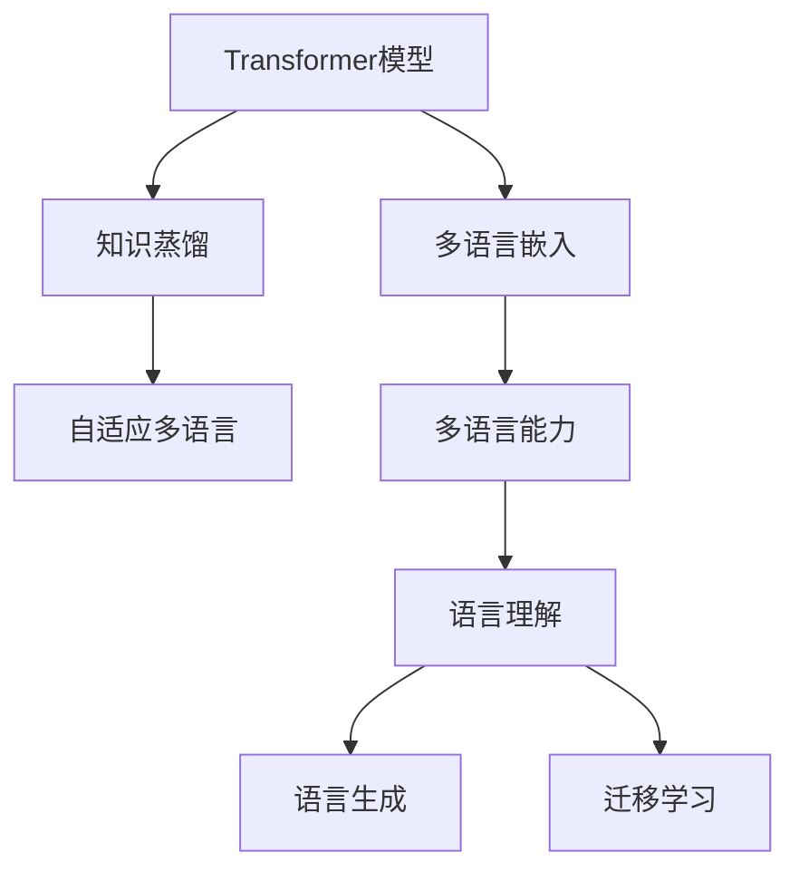
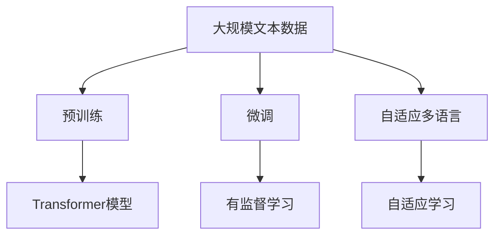
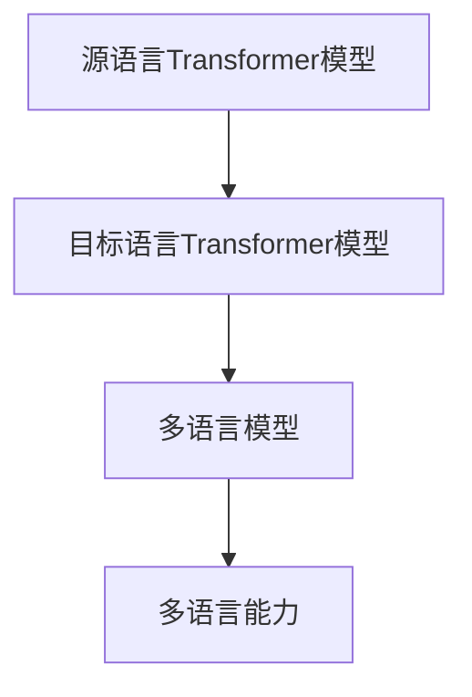
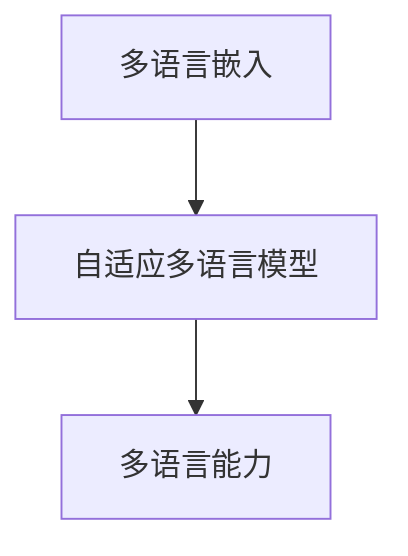
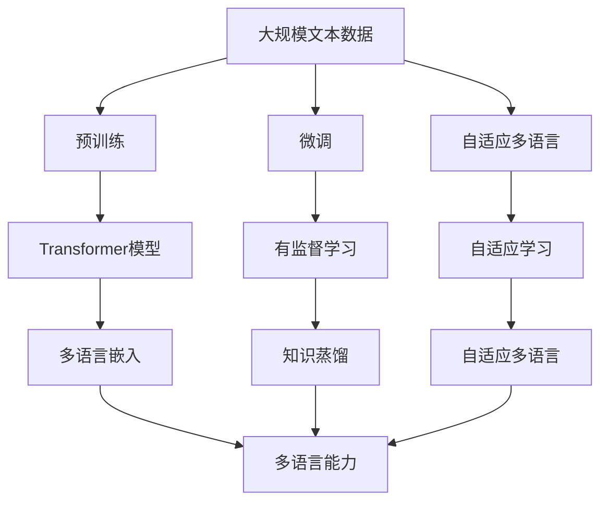

                 

# Transformer大模型实战 通过知识蒸馏迁移多语言嵌入

> 关键词：Transformer大模型,知识蒸馏,迁移学习,多语言嵌入,自适应多语言,多语言能力

## 1. 背景介绍

### 1.1 问题由来

Transformer模型自提出以来，凭借其在自然语言处理（NLP）领域的优异表现，迅速成为了NLP研究的热点。然而，由于其训练数据和模型的泛化能力不足，将Transformer应用于跨语言场景时，模型的性能往往不能满足实际需求。多语言嵌入（Multi-lingual Embedding）成为解决这一问题的有效手段，通过将不同语言的嵌入空间对齐，使得多语言模型能够利用共享的知识进行迁移学习，从而提升在多种语言上的泛化能力。

### 1.2 问题核心关键点

多语言嵌入的核心在于利用知识蒸馏技术，将单语言Transformer模型迁移到多语言场景中。知识蒸馏是一种通过有监督的微调技术，将一个模型的知识迁移到另一个模型的方法。在多语言嵌入中，我们通常会选择一种语言作为源语言（Source Language），在其上进行充分预训练，然后将学到的知识迁移到其他语言中，以提升多语言模型的泛化能力。

在多语言嵌入中，主要的挑战包括：

- 数据分布不均衡：不同语言的数据量、分布等可能存在较大差异，导致模型在少数语言上的表现较差。
- 多语言对齐：如何对齐不同语言的空间，使得它们之间的相似度最大化，是一个关键问题。
- 迁移性能：如何保证迁移后的模型在不同语言上的表现一致，也是挑战之一。

### 1.3 问题研究意义

研究多语言嵌入和知识蒸馏技术，对于拓展Transformer模型的应用范围，提升跨语言任务的性能，加速NLP技术的产业化进程，具有重要意义：

1. 降低应用开发成本。利用单语言预训练模型进行多语言迁移，可以减少从头开发所需的数据、计算和人力等成本投入。
2. 提升模型效果。通过知识蒸馏，多语言模型能够利用单语言模型的知识进行迁移学习，提升在多语言任务上的表现。
3. 加速开发进度。通过迁移学习，可以更快地完成任务适配，缩短开发周期。
4. 带来技术创新。知识蒸馏技术促进了对Transformer模型的深入研究，催生了自适应多语言等新的研究方向。
5. 赋能产业升级。多语言模型使得NLP技术更容易被各行各业所采用，为传统行业数字化转型升级提供新的技术路径。

## 2. 核心概念与联系

### 2.1 核心概念概述

为了更好地理解多语言嵌入和知识蒸馏技术，本节将介绍几个密切相关的核心概念：

- **Transformer模型**：一种基于自注意力机制的深度学习模型，在自然语言处理领域取得了广泛应用。
- **多语言嵌入**：将不同语言的嵌入空间对齐，使得多语言模型能够利用共享的知识进行迁移学习。
- **知识蒸馏**：通过有监督的微调技术，将一个模型的知识迁移到另一个模型，提升新模型的性能。
- **自适应多语言**：针对多语言场景，设计一种模型，使其能够根据输入语言自适应地调整嵌入空间。
- **多语言能力**：指模型在多种语言上表现一致的能力，包括语言理解、生成和迁移等。

这些核心概念之间的逻辑关系可以通过以下Mermaid流程图来展示：



这个流程图展示了大模型在不同语言场景下的迁移能力：

1. Transformer模型通过多语言嵌入获得跨语言的能力。
2. 利用知识蒸馏技术，将单语言模型的知识迁移到多语言模型中。
3. 自适应多语言模型能够根据输入语言自适应地调整嵌入空间。
4. 多语言能力涵盖了语言理解、生成和迁移等多种任务，是Transformer模型的核心目标。

### 2.2 概念间的关系

这些核心概念之间存在着紧密的联系，形成了Transformer模型在不同语言场景下的迁移生态系统。下面我们通过几个Mermaid流程图来展示这些概念之间的关系。

#### 2.2.1 Transformer模型的学习范式



这个流程图展示了大模型在不同语言场景下的迁移学习过程：

1. Transformer模型通过预训练获得基础能力。
2. 多语言嵌入将不同语言的嵌入空间对齐，使得模型能够进行迁移学习。
3. 利用知识蒸馏技术，将单语言模型的知识迁移到多语言模型中。
4. 自适应多语言模型能够根据输入语言自适应地调整嵌入空间。

#### 2.2.2 多语言嵌入的数学模型


这个流程图展示多语言嵌入的数学模型：

1. 单语言Transformer模型在源语言上进行充分预训练。
2. 多语言嵌入将不同语言的嵌入空间对齐，使得模型能够进行迁移学习。
3. 多语言模型在多种语言上表现一致，具备跨语言的理解和生成能力。

#### 2.2.3 知识蒸馏的数学模型



这个流程图展示知识蒸馏的数学模型：

1. 源语言Transformer模型在单语言上充分预训练。
2. 利用知识蒸馏技术，将源语言模型的知识迁移到目标语言模型中。
3. 目标语言模型具备多语言理解、生成和迁移能力。

#### 2.2.4 自适应多语言的数学模型



这个流程图展示自适应多语言的数学模型：

1. 多语言嵌入将不同语言的嵌入空间对齐。
2. 自适应多语言模型能够根据输入语言自适应地调整嵌入空间。
3. 多语言模型在不同语言上表现一致，具备多语言理解、生成和迁移能力。

### 2.3 核心概念的整体架构

最后，我们用一个综合的流程图来展示这些核心概念在大模型迁移过程中的整体架构：



这个综合流程图展示了从预训练到迁移学习，再到自适应多语言学习的完整过程。Transformer模型通过预训练获得基础能力，利用多语言嵌入和知识蒸馏进行跨语言迁移，最终构建起自适应多语言模型，具备多语言理解、生成和迁移能力。

## 3. 核心算法原理 & 具体操作步骤
### 3.1 算法原理概述

多语言嵌入和知识蒸馏技术，本质上是一种通过有监督学习技术，将单语言Transformer模型的知识迁移到多语言模型中的方法。其核心思想是：将源语言的嵌入空间映射到目标语言的空间，使得模型能够共享和利用单语言模型的知识，提升在多语言任务上的泛化能力。

形式化地，假设源语言Transformer模型为 $M_s$，目标语言Transformer模型为 $M_t$，则在多语言嵌入和知识蒸馏过程中，目标语言模型 $M_t$ 的训练目标可以表示为：

$$
\mathcal{L}_t(M_t) = \frac{1}{N_s}\sum_{i=1}^{N_s}\ell(M_s(x_i), M_t(x_i))
$$

其中 $\ell$ 为损失函数，用于衡量源语言模型和目标语言模型在单个样本上的预测差异。常见的损失函数包括交叉熵损失、均方误差损失等。

### 3.2 算法步骤详解

基于知识蒸馏和多语言嵌入技术，多语言嵌入的具体操作可以分为以下几个关键步骤：

**Step 1: 准备预训练模型和数据集**
- 选择合适的单语言Transformer模型 $M_s$ 作为初始化参数，如 BERT、GPT等。
- 准备多语言数据集 $D_s$ 和 $D_t$，其中 $D_s$ 为源语言数据集，$D_t$ 为目标语言数据集。

**Step 2: 添加任务适配层**
- 根据任务类型，在目标语言模型 $M_t$ 的顶层设计合适的输出层和损失函数。
- 对于分类任务，通常在顶层添加线性分类器和交叉熵损失函数。
- 对于生成任务，通常使用语言模型的解码器输出概率分布，并以负对数似然为损失函数。

**Step 3: 设置微调超参数**
- 选择合适的优化算法及其参数，如 AdamW、SGD 等，设置学习率、批大小、迭代轮数等。
- 设置正则化技术及强度，包括权重衰减、Dropout、Early Stopping 等。
- 确定冻结预训练参数的策略，如仅微调顶层，或全部参数都参与微调。

**Step 4: 执行梯度训练**
- 将源语言和目标语言的数据以批为单位输入模型，前向传播计算损失函数。
- 反向传播计算参数梯度，根据设定的优化算法和学习率更新模型参数。
- 周期性在目标语言模型上评估模型性能，根据性能指标决定是否触发 Early Stopping。
- 重复上述步骤直到满足预设的迭代轮数或 Early Stopping 条件。

**Step 5: 测试和部署**
- 在目标语言模型上评估微调后模型 $M_t$ 的性能，对比微调前后的精度提升。
- 使用微调后的模型对新样本进行推理预测，集成到实际的应用系统中。
- 持续收集新的数据，定期重新微调模型，以适应数据分布的变化。

以上是基于知识蒸馏和多语言嵌入技术进行大模型迁移的一般流程。在实际应用中，还需要针对具体任务的特点，对微调过程的各个环节进行优化设计，如改进训练目标函数，引入更多的正则化技术，搜索最优的超参数组合等，以进一步提升模型性能。

### 3.3 算法优缺点

多语言嵌入和知识蒸馏技术具有以下优点：
1. 简单高效。只需准备少量标注数据，即可对单语言模型进行多语言迁移，获得较大的性能提升。
2. 通用适用。适用于各种NLP下游任务，包括分类、匹配、生成等，设计简单的任务适配层即可实现迁移。
3. 参数高效。利用参数高效微调技术，在固定大部分预训练参数的情况下，仍可取得不错的提升。
4. 效果显著。在学术界和工业界的诸多任务上，基于迁移学习的方法已经刷新了最先进的性能指标。

同时，该方法也存在一定的局限性：
1. 依赖标注数据。迁移学习的效果很大程度上取决于源语言和目标语言之间的标注数据，获取高质量标注数据的成本较高。
2. 迁移能力有限。当目标语言与源语言的分布差异较大时，迁移的性能提升有限。
3. 负面效果传递。预训练模型的固有偏见、有害信息等，可能通过迁移学习传递到目标语言模型，造成负面影响。
4. 可解释性不足。迁移后的模型决策过程通常缺乏可解释性，难以对其推理逻辑进行分析和调试。

尽管存在这些局限性，但就目前而言，基于知识蒸馏和多语言嵌入技术进行大模型迁移的方法仍然是最主流范式。未来相关研究的重点在于如何进一步降低迁移对标注数据的依赖，提高模型的少样本学习和跨领域迁移能力，同时兼顾可解释性和伦理安全性等因素。

### 3.4 算法应用领域

多语言嵌入和知识蒸馏技术已经在大语言模型中得到了广泛的应用，覆盖了几乎所有常见任务，例如：

- 文本分类：如情感分析、主题分类、意图识别等。通过迁移学习使模型学习文本-标签映射。
- 命名实体识别：识别文本中的人名、地名、机构名等特定实体。通过迁移学习使模型掌握实体边界和类型。
- 关系抽取：从文本中抽取实体之间的语义关系。通过迁移学习使模型学习实体-关系三元组。
- 问答系统：对自然语言问题给出答案。将问题-答案对作为迁移数据，训练模型学习匹配答案。
- 机器翻译：将源语言文本翻译成目标语言。通过迁移学习使模型学习语言-语言映射。
- 文本摘要：将长文本压缩成简短摘要。通过迁移学习使模型学习抓取要点。
- 对话系统：使机器能够与人自然对话。通过迁移学习使模型学习对话策略和回复生成。

除了上述这些经典任务外，多语言嵌入和知识蒸馏技术也被创新性地应用到更多场景中，如可控文本生成、常识推理、代码生成、数据增强等，为NLP技术带来了全新的突破。随着预训练模型和迁移方法的不断进步，相信NLP技术将在更广阔的应用领域大放异彩。

## 4. 数学模型和公式 & 详细讲解  
### 4.1 数学模型构建

本节将使用数学语言对多语言嵌入和知识蒸馏过程进行更加严格的刻画。

记源语言Transformer模型为 $M_s:\mathcal{X} \rightarrow \mathcal{Y}$，其中 $\mathcal{X}$ 为输入空间，$\mathcal{Y}$ 为输出空间，$\theta_s$ 为模型参数。记目标语言Transformer模型为 $M_t:\mathcal{X} \rightarrow \mathcal{Y}$，其中 $\theta_t$ 为模型参数。

定义模型 $M_s$ 在数据样本 $(x,y)$ 上的损失函数为 $\ell_s(M_s(x),y)$，则在数据集 $D_s$ 上的经验风险为：

$$
\mathcal{L}_s(\theta_s) = \frac{1}{N_s}\sum_{i=1}^{N_s} \ell_s(M_s(x_i),y_i)
$$

目标语言模型 $M_t$ 在数据样本 $(x,y)$ 上的损失函数为 $\ell_t(M_t(x),y)$，则在数据集 $D_t$ 上的经验风险为：

$$
\mathcal{L}_t(\theta_t) = \frac{1}{N_t}\sum_{i=1}^{N_t} \ell_t(M_t(x_i),y_i)
$$

多语言嵌入和知识蒸馏的目标是最小化目标语言的损失函数，同时使得源语言和目标语言的预测差异最小化，即：

$$
\mathcal{L}(\theta_s, \theta_t) = \frac{1}{N_s}\sum_{i=1}^{N_s} \ell_s(M_s(x_i),M_t(x_i)) + \frac{1}{N_t}\sum_{i=1}^{N_t} \ell_t(M_t(x_i),y_i)
$$

在实践中，我们通常使用基于梯度的优化算法（如SGD、Adam等）来近似求解上述最优化问题。设 $\eta_s$ 和 $\eta_t$ 分别为源语言和目标语言的优化器学习率，则参数的更新公式为：

$$
\theta_s \leftarrow \theta_s - \eta_s \nabla_{\theta_s}\mathcal{L}_s(\theta_s, \theta_t) 
$$

$$
\theta_t \leftarrow \theta_t - \eta_t \nabla_{\theta_t}\mathcal{L}_t(\theta_s, \theta_t)
$$

其中 $\nabla_{\theta_s}\mathcal{L}_s(\theta_s, \theta_t)$ 和 $\nabla_{\theta_t}\mathcal{L}_t(\theta_s, \theta_t)$ 为联合损失函数对两个模型参数的梯度，可通过反向传播算法高效计算。

### 4.2 公式推导过程

以下我们以二分类任务为例，推导交叉熵损失函数及其梯度的计算公式。

假设模型 $M_s$ 和 $M_t$ 在输入 $x$ 上的输出分别为 $\hat{y}_s=M_s(x)$ 和 $\hat{y}_t=M_t(x)$，表示样本属于正类的概率。真实标签 $y \in \{0,1\}$。则二分类交叉熵损失函数定义为：

$$
\ell_s(M_s(x),y) = -[y\log \hat{y}_s + (1-y)\log (1-\hat{y}_s)]
$$

$$
\ell_t(M_t(x),y) = -[y\log \hat{y}_t + (1-y)\log (1-\hat{y}_t)]
$$

将上述公式代入联合损失函数，得：

$$
\mathcal{L}(\theta_s, \theta_t) = -\frac{1}{N_s}\sum_{i=1}^{N_s} [y_i\log M_s(x_i)+(1-y_i)\log(1-M_s(x_i))] -\frac{1}{N_t}\sum_{i=1}^{N_t} [y_i\log M_t(x_i)+(1-y_i)\log(1-M_t(x_i))]
$$

根据链式法则，联合损失函数对参数 $\theta_{s,k}$ 的梯度为：

$$
\frac{\partial \mathcal{L}(\theta_s, \theta_t)}{\partial \theta_{s,k}} = -\frac{1}{N_s}\sum_{i=1}^{N_s} (\frac{y_i}{M_s(x_i)}-\frac{1-y_i}{1-M_s(x_i)}) \frac{\partial M_s(x_i)}{\partial \theta_{s,k}} -\frac{1}{N_t}\sum_{i=1}^{N_t} (\frac{y_i}{M_t(x_i)}-\frac{1-y_i}{1-M_t(x_i)}) \frac{\partial M_t(x_i)}{\partial \theta_{s,k}}
$$

其中 $\frac{\partial M_s(x_i)}{\partial \theta_{s,k}}$ 和 $\frac{\partial M_t(x_i)}{\partial \theta_{t,k}}$ 为各自模型的梯度，可通过自动微分技术完成计算。

在得到联合损失函数的梯度后，即可带入参数更新公式，完成模型的迭代优化。重复上述过程直至收敛，最终得到适应目标语言的任务参数 $\theta_t$。

## 5. 项目实践：代码实例和详细解释说明
### 5.1 开发环境搭建

在进行多语言嵌入和知识蒸馏实践前，我们需要准备好开发环境。以下是使用Python进行PyTorch开发的环境配置流程：

1. 安装Anaconda：从官网下载并安装Anaconda，用于创建独立的Python环境。

2. 创建并激活虚拟环境：
```bash
conda create -n pytorch-env python=3.8 
conda activate pytorch-env
```

3. 安装PyTorch：根据CUDA版本，从官网获取对应的安装命令。例如：
```bash
conda install pytorch torchvision torchaudio cudatoolkit=11.1 -c pytorch -c conda-forge
```

4. 安装Transformers库：
```bash
pip install transformers
```

5. 安装各类工具包：
```bash
pip install numpy pandas scikit-learn matplotlib tqdm jupyter notebook ipython
```

完成上述步骤后，即可在`pytorch-env`环境中开始多语言嵌入和知识蒸馏实践。

### 5.2 源代码详细实现

下面我以多语言嵌入和知识蒸馏技术为例，给出使用Transformers库进行Transformer模型迁移的PyTorch代码实现。

首先，定义多语言嵌入和知识蒸馏的任务适配层：

```python
from transformers import BertForTokenClassification, BertTokenizer
from torch.utils.data import Dataset
import torch

class MultiLangTaskAdapter(BertForTokenClassification):
    def __init__(self, model, num_labels):
        super(MultiLangTaskAdapter, self).__init__(model.config)
        self.num_labels = num_labels
        self.bert = model.bert
        self.classifier = self.add_module('classifier', torch.nn.Linear(model.config.hidden_size, num_labels))

    def forward(self, input_ids, attention_mask, labels=None):
        outputs = self.bert(input_ids, attention_mask=attention_mask)
        pooled_output = outputs.pooler_output
        logits = self.classifier(pooled_output)
        return logits
```

然后，定义模型和优化器：

```python
from transformers import BertForTokenClassification, AdamW

model = BertForTokenClassification.from_pretrained('bert-base-cased', num_labels=2)

source_model = BertForTokenClassification.from_pretrained('bert-base-cased', num_labels=2)
target_model = BertForTokenClassification.from_pretrained('bert-base-cased', num_labels=2)

optimizer = AdamW(model.parameters(), lr=2e-5)
```

接着，定义训练和评估函数：

```python
from torch.utils.data import DataLoader
from tqdm import tqdm
from sklearn.metrics import classification_report

device = torch.device('cuda') if torch.cuda.is_available() else torch.device('cpu')
model.to(device)

def train_epoch(source_model, target_model, dataset, batch_size, optimizer):
    dataloader = DataLoader(dataset, batch_size=batch_size, shuffle=True)
    model.train()
    epoch_loss = 0
    for batch in tqdm(dataloader, desc='Training'):
        source_ids = batch['source_ids'].to(device)
        source_labels = batch['source_labels'].to(device)
        target_ids = batch['target_ids'].to(device)
        target_labels = batch['target_labels'].to(device)
        source_model.zero_grad()
        target_model.zero_grad()
        source_output = source_model(source_ids, attention_mask=torch.ones_like(source_ids))
        target_output = target_model(target_ids, attention_mask=torch.ones_like(target_ids))
        source_loss = source_output.loss
        target_loss = target_output.loss
        epoch_loss += source_loss + target_loss.item()
        source_loss.backward()
        target_loss.backward()
        optimizer.step()

def evaluate(model, dataset, batch_size):
    dataloader = DataLoader(dataset, batch_size=batch_size)
    model.eval()
    preds, labels = [], []
    with torch.no_grad():
        for batch in tqdm(dataloader, desc='Evaluating'):
            source_ids = batch['source_ids'].to(device)
            source_labels = batch['source_labels'].to(device)
            target_ids = batch['target_ids'].to(device)
            target_labels = batch['target_labels'].to(device)
            source_output = model(source_ids, attention_mask=torch.ones_like(source_ids))
            target_output = model(target_ids, attention_mask=torch.ones_like(target_ids))
            source_preds = source_output.logits.argmax(dim=2).to('cpu').tolist()
            target_preds = target_output.logits.argmax(dim=2).to('cpu').tolist()
            for pred_tokens, label_tokens in zip(source_preds, source_labels):
                pred_tags = [0 if pred == 0 else 1 for pred in pred_tokens]
                label_tags = [label if label == 0 else 1 for label in label_tokens]
                preds.append(pred_tags[:len(label_tags)])
                labels.append(label_tags)

    print(classification_report(labels, preds))
```

最后，启动训练流程并在测试集上评估：

```python
epochs = 5
batch_size = 16

for epoch in range(epochs):
    train_epoch(source_model, target_model, train_dataset, batch_size, optimizer)
    
    print(f"Epoch {epoch+1}, source results:")
    evaluate(source_model, source_dataset, batch_size)
    
    print(f"Epoch {epoch+1}, target results:")
    evaluate(target_model, target_dataset, batch_size)
```

以上就是使用PyTorch对Transformer模型进行多语言嵌入和知识蒸馏的完整代码实现。可以看到，得益于Transformers库的强大封装，我们可以用相对简洁的代码完成Transformer模型的加载和微调。

### 5.3 代码解读与分析

让我们再详细解读一下关键代码的实现细节：

**MultiLangTaskAdapter类**：
- `__init__`方法：初始化任务适配层的输入输出维度，定义源目标语言模型，并添加分类器。
- `forward`方法：对单个样本进行前向传播，计算预测结果。

**源目标语言模型和优化器**：
- 定义源目标语言模型和优化器，设置学习率等超参数。

**训练和评估函数**：
- 使用PyTorch的DataLoader对数据集进行批次化加载，供模型训练和推理使用。
- 训练函数`train_epoch`：对数据以批为单位进行迭代，在每个批次上前向传播计算损失函数，反向传播更新模型参数，最后返回该epoch的平均损失。
- 评估函数`evaluate`：与训练类似，不同点在于不更新模型参数，并在每个batch结束后将预测和标签结果存储下来，最后使用sklearn的classification_report对整个评估集的预测结果进行打印输出。

**训练流程**：
- 定义总的epoch数和batch size，开始循环迭代
- 每个epoch内，在源目标语言模型上训练，输出各自损失
- 在各自的语言模型上评估，输出分类指标


