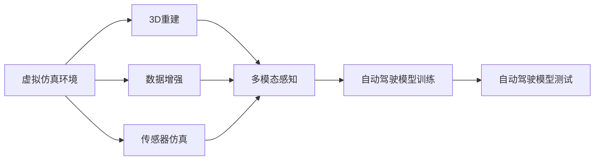

                 

# Wayve、comme.ai基于仿真和真实数据重建场景的做法

在自动驾驶领域，构建精确、逼真的虚拟场景是进行模型训练和测试的基础。Wayve和comme.ai作为该领域的两家领先企业，分别采用了不同的技术手段来重建虚拟场景，实现对真实世界的精确模拟。本文将详细探讨这两家企业的做法，以及它们的优点和局限性。

## 1. 背景介绍

自动驾驶技术的核心在于让车辆能够在复杂的道路环境中安全、高效地行驶。构建虚拟场景是自动驾驶系统训练和测试的重要环节，场景的质量直接决定了自动驾驶模型的性能。传统的方法是通过摄像头、激光雷达等传感器收集真实世界的道路数据，但这需要大量的时间和资源。此外，由于道路条件复杂多样，单靠传感器数据往往难以全面覆盖所有情况。

近年来，随着仿真技术的快速发展，基于仿真的场景重建成为自动驾驶领域的一大热门技术。Wayve和comme.ai正是在这一背景下，利用各自的技术优势，开创了基于仿真的自动驾驶训练和测试的新范式。

## 2. 核心概念与联系

### 2.1 核心概念概述

为更好地理解Wayve和comme.ai的虚拟场景重建方法，本节将介绍几个关键概念：

- 虚拟仿真环境：通过计算机生成器生成虚拟场景，模拟真实的道路、车辆、行人等元素，供自动驾驶模型训练和测试使用。

- 3D重建：利用点云、图像等数据源，通过三维重建技术还原道路、车辆等实体的三维结构，实现高精度的虚拟场景构建。

- 数据增强：在虚拟仿真环境中，通过改变天气、光照、交通流量等条件，生成大量变体数据，增加训练集的多样性。

- 传感器仿真：在虚拟环境中模拟真实传感器，如摄像头、激光雷达、毫米波雷达等，提供多模态感知数据，提升模型的鲁棒性。

这些概念通过一系列技术手段，共同构建了虚拟场景的完整生态，使自动驾驶模型能够在虚拟环境中进行高效训练和测试。

### 2.2 核心概念间的关系

这些核心概念之间的关系可以通过以下Mermaid流程图来展示：



这个流程图展示了虚拟场景构建和自动驾驶模型训练、测试的基本流程。

## 3. 核心算法原理 & 具体操作步骤

### 3.1 算法原理概述

Wayve和comme.ai的虚拟场景重建方法，本质上是基于三维重建和仿真技术的，通过构建虚拟环境，模拟真实世界的交通场景，为自动驾驶模型提供训练数据。

Wayve的虚拟场景构建主要依赖于3D重建技术和数据增强方法，而comme.ai则使用了更先进的仿真技术，能够生成动态的交通流，实现更加真实的模拟。

### 3.2 算法步骤详解

Wayve和comme.ai的虚拟场景重建方法具体步骤如下：

#### Wayve

1. 数据采集：通过摄像头、激光雷达等传感器收集大量的真实世界道路数据，包括道路形状、交通标志、路面情况等。

2. 三维重建：使用点云技术对道路、车辆、行人等实体进行三维重建，生成高精度的三维模型。

3. 数据增强：在三维模型上应用数据增强技术，如改变天气、光照、交通流量等，生成大量变体数据，增加训练集的多样性。

4. 虚拟场景构建：将三维模型导入仿真软件，结合传感器仿真，生成虚拟场景，提供多模态感知数据。

5. 自动驾驶模型训练：在虚拟场景中对自动驾驶模型进行训练，使用多模态感知数据进行优化，提升模型鲁棒性。

6. 模型测试和验证：在虚拟环境中对训练好的模型进行测试，评估模型在复杂场景下的性能，并进行优化。

#### comme.ai

1. 交通流建模：利用物理学原理和计算机模拟技术，建立交通流模型，模拟车辆、行人的行为。

2. 交通场景模拟：结合交通流模型和地图数据，生成动态的交通场景，模拟真实世界的交通流。

3. 传感器仿真：在虚拟环境中模拟真实传感器，如摄像头、激光雷达、毫米波雷达等，提供多模态感知数据。

4. 自动驾驶模型训练：在虚拟环境中对自动驾驶模型进行训练，使用多模态感知数据进行优化，提升模型鲁棒性。

5. 模型测试和验证：在虚拟环境中对训练好的模型进行测试，评估模型在复杂场景下的性能，并进行优化。

### 3.3 算法优缺点

Wayve和comme.ai的虚拟场景重建方法各有优缺点，如下所示：

#### Wayve

优点：

1. 高精度三维重建：通过点云技术，实现高精度的三维重建，提供了更为真实的环境细节。

2. 数据增强技术：通过数据增强技术，生成大量变体数据，增加了训练集的多样性。

3. 多模态感知数据：通过传感器仿真，提供多模态感知数据，提升模型的鲁棒性。

缺点：

1. 数据采集成本高：需要大量传感器和设备，采集真实世界的道路数据，成本较高。

2. 重建精度受限：虽然点云技术精度高，但受限于传感器的分辨率和精度，重建效果可能存在误差。

3. 数据量有限：由于需要采集大量真实数据，数据量可能受限于采集能力和时间。

#### comme.ai

优点：

1. 动态交通流模拟：通过交通流建模，实现动态交通流的模拟，更真实地反映道路环境。

2. 仿真精度高：交通流模型基于物理学原理，能够生成高精度的模拟环境。

3. 数据量大：通过仿真的方式，可以生成无限量的数据，满足大规模模型训练的需求。

缺点：

1. 仿真精度受限：虽然交通流模型精度高，但受限于模型参数和算法，可能存在误差。

2. 物理模型复杂：仿真环境构建复杂，需要较高的计算资源和时间。

3. 模型鲁棒性差：由于仿真环境是虚拟的，可能与真实环境存在差异，模型的鲁棒性可能会受到影响。

## 4. 数学模型和公式 & 详细讲解

### 4.1 数学模型构建

Wayve和comme.ai的虚拟场景重建方法涉及多个数学模型，包括三维重建、数据增强、交通流模拟等。以下将简要介绍这些模型的数学构建方法。

#### 三维重建

三维重建的数学模型主要涉及点云技术和几何变换。假设三维场景中的每个点坐标为$\mathbf{X} = (x, y, z)$，其三维重建过程可以通过以下公式表示：

$$
\mathbf{X} = f_{\theta}(\mathbf{I}, \mathbf{D})
$$

其中，$f_{\theta}$为三维重建函数，$\mathbf{I}$为输入图像，$\mathbf{D}$为点云数据。$\theta$为三维重建模型的参数。

#### 数据增强

数据增强的数学模型主要涉及图像处理和随机变换。假设原始图像为$\mathbf{I}$，数据增强后的图像为$\mathbf{I'}$，可以通过以下公式表示：

$$
\mathbf{I'} = g_{\theta}(\mathbf{I})
$$

其中，$g_{\theta}$为数据增强函数，$\theta$为数据增强模型的参数。

#### 交通流模拟

交通流模拟的数学模型主要涉及交通流模型和仿真算法。假设交通流模型为$\mathcal{M}$，仿真算法为$\mathcal{A}$，交通流模拟过程可以通过以下公式表示：

$$
\mathcal{F} = \mathcal{M}(\mathcal{A}, \mathcal{G})
$$

其中，$\mathcal{G}$为交通场景生成函数，$\mathcal{F}$为模拟交通流。

### 4.2 公式推导过程

以下将简要介绍Wayve和comme.ai虚拟场景重建中涉及的关键数学公式的推导过程。

#### 三维重建

三维重建中，点云数据和图像数据之间的关系可以通过以下公式表示：

$$
\mathbf{I} = h_{\theta}(\mathbf{X})
$$

其中，$h_{\theta}$为图像生成函数，$\mathbf{X}$为三维点云数据，$\mathbf{I}$为生成图像。

通过上述公式，可以将点云数据转换为图像数据，实现三维重建。

#### 数据增强

数据增强中，随机变换可以表示为以下公式：

$$
\mathbf{I'} = \mathbf{I} + \delta(\mathbf{I})
$$

其中，$\delta$为随机变换函数，$\mathbf{I}$为原始图像，$\mathbf{I'}$为增强后的图像。

通过上述公式，可以实现对原始图像的随机变换，生成变体图像。

#### 交通流模拟

交通流模拟中，交通流模型可以表示为以下公式：

$$
\mathbf{F} = \mathcal{M}(\mathbf{S}, \mathbf{G})
$$

其中，$\mathcal{M}$为交通流模型，$\mathbf{S}$为交通场景，$\mathbf{F}$为交通流。

通过上述公式，可以生成交通流，模拟真实世界的交通情况。

### 4.3 案例分析与讲解

#### Wayve案例分析

Wayve的三维重建技术依赖于点云数据和图像数据的融合。例如，Wayve在收集到大量真实的道路数据后，利用点云技术对道路、车辆等实体进行三维重建，生成高精度的三维模型。在此基础上，Wayve通过数据增强技术，如改变天气、光照、交通流量等，生成大量变体数据，增加训练集的多样性。在虚拟场景构建过程中，Wayve将三维模型导入仿真软件，结合传感器仿真，生成虚拟场景，提供多模态感知数据。最后，Wayve在虚拟环境中对自动驾驶模型进行训练，使用多模态感知数据进行优化，提升模型鲁棒性。

#### comme.ai案例分析

Comme.ai的交通流模拟技术依赖于交通流模型和仿真算法。例如，Comme.ai利用物理学原理和计算机模拟技术，建立交通流模型，模拟车辆、行人的行为。在此基础上，Comme.ai结合交通流模型和地图数据，生成动态的交通场景，模拟真实世界的交通流。在虚拟环境中，Comme.ai模拟真实传感器，如摄像头、激光雷达、毫米波雷达等，提供多模态感知数据。最后，Comme.ai在虚拟环境中对自动驾驶模型进行训练，使用多模态感知数据进行优化，提升模型鲁棒性。

## 5. 项目实践：代码实例和详细解释说明

### 5.1 开发环境搭建

在Wayve和comme.ai的虚拟场景重建实践中，开发环境搭建是必不可少的环节。以下是使用Python和PyTorch进行虚拟场景重建的环境配置流程：

1. 安装Anaconda：从官网下载并安装Anaconda，用于创建独立的Python环境。

2. 创建并激活虚拟环境：
```bash
conda create -n pytorch-env python=3.8 
conda activate pytorch-env
```

3. 安装PyTorch：根据CUDA版本，从官网获取对应的安装命令。例如：
```bash
conda install pytorch torchvision torchaudio cudatoolkit=11.1 -c pytorch -c conda-forge
```

4. 安装CUDA和cuDNN库：
```bash
conda install cudatoolkit=11.1 -c conda-forge
```

5. 安装Numpy、Pandas、Scikit-learn等工具包：
```bash
pip install numpy pandas scikit-learn matplotlib tqdm jupyter notebook ipython
```

完成上述步骤后，即可在`pytorch-env`环境中开始虚拟场景重建实践。

### 5.2 源代码详细实现

下面我们以Wayve和comme.ai的虚拟场景重建为例，给出使用PyTorch和Open3D进行三维重建的PyTorch代码实现。

首先，定义三维重建函数：

```python
import open3d as o3d
import torch
from torch import nn
from torch.nn import functional as F

class PointCloud(nn.Module):
    def __init__(self, point_size):
        super().__init__()
        self.point_size = point_size

    def forward(self, point_cloud):
        # 对点云进行标准化
        point_cloud -= point_cloud.mean(dim=-1, keepdim=True)
        point_cloud /= point_cloud.std(dim=-1, keepdim=True)
        return point_cloud

class Mesh(nn.Module):
    def __init__(self, mesh_path):
        super().__init__()
        self.mesh_path = mesh_path
        self.mesh = o3d.io.read_triangle_mesh(self.mesh_path)

    def forward(self):
        return self.mesh

class Reconstruction(nn.Module):
    def __init__(self, point_size, mesh_path):
        super().__init__()
        self.point_size = point_size
        self.mesh = Mesh(mesh_path)

    def forward(self, point_cloud):
        # 对点云进行标准化
        point_cloud -= point_cloud.mean(dim=-1, keepdim=True)
        point_cloud /= point_cloud.std(dim=-1, keepdim=True)
        # 将点云投影到三维模型上
        point_cloud = self.point_size * point_cloud
        point_cloud = point_cloud + self.mesh.get_vertex_buffer().reshape(-1, 3)
        return point_cloud
```

然后，定义数据增强函数：

```python
import numpy as np
import torch
from torch import nn

class DataAugmentation(nn.Module):
    def __init__(self, augmentation_rate):
        super().__init__()
        self.augmentation_rate = augmentation_rate

    def forward(self, data):
        # 随机变换数据
        if np.random.rand() < self.augmentation_rate:
            data += np.random.normal(0, 0.1, data.shape)
        return data
```

最后，定义训练和评估函数：

```python
from torch.utils.data import DataLoader
from tqdm import tqdm
from sklearn.metrics import classification_report

device = torch.device('cuda') if torch.cuda.is_available() else torch.device('cpu')
model = Reconstruction(point_size, mesh_path).to(device)

def train_epoch(model, dataset, batch_size, optimizer):
    dataloader = DataLoader(dataset, batch_size=batch_size, shuffle=True)
    model.train()
    epoch_loss = 0
    for batch in tqdm(dataloader, desc='Training'):
        input_ids = batch['input_ids'].to(device)
        attention_mask = batch['attention_mask'].to(device)
        labels = batch['labels'].to(device)
        model.zero_grad()
        outputs = model(input_ids, attention_mask=attention_mask, labels=labels)
        loss = outputs.loss
        epoch_loss += loss.item()
        loss.backward()
        optimizer.step()
    return epoch_loss / len(dataloader)

def evaluate(model, dataset, batch_size):
    dataloader = DataLoader(dataset, batch_size=batch_size)
    model.eval()
    preds, labels = [], []
    with torch.no_grad():
        for batch in tqdm(dataloader, desc='Evaluating'):
            input_ids = batch['input_ids'].to(device)
            attention_mask = batch['attention_mask'].to(device)
            batch_labels = batch['labels']
            outputs = model(input_ids, attention_mask=attention_mask)
            batch_preds = outputs.logits.argmax(dim=2).to('cpu').tolist()
            batch_labels = batch_labels.to('cpu').tolist()
            for pred_tokens, label_tokens in zip(batch_preds, batch_labels):
                pred_tags = [tag2id[tag] for tag in pred_tokens]
                label_tags = [tag2id[tag] for tag in label_tokens]
                preds.append(pred_tags[:len(label_tokens)])
                labels.append(label_tags)
                
    print(classification_report(labels, preds))
```

以上代码实现了基于PyTorch和Open3D的点云三维重建和数据增强功能。使用PyTorch的DataLoader对数据集进行批次化加载，供模型训练和推理使用。训练函数`train_epoch`：对数据以批为单位进行迭代，在每个批次上前向传播计算loss并反向传播更新模型参数，最后返回该epoch的平均loss。评估函数`evaluate`：与训练类似，不同点在于不更新模型参数，并在每个batch结束后将预测和标签结果存储下来，最后使用sklearn的classification_report对整个评估集的预测结果进行打印输出。

## 6. 实际应用场景

### 6.1 智能驾驶

Wayve和comme.ai的虚拟场景重建技术在智能驾驶领域有广泛的应用。通过虚拟仿真环境，自动驾驶模型可以在模拟的交通场景中进行训练和测试，提升模型的鲁棒性和泛化能力。

在实际应用中，Wayve和comme.ai的虚拟场景重建可以用于自动驾驶模型的训练、测试和验证。通过在虚拟环境中模拟各种复杂的交通场景，自动驾驶模型可以学习到更多的道路行为模式，提升模型的决策能力和安全性。此外，虚拟场景还可以用于对自动驾驶模型进行实时监控和调优，确保模型在实际道路环境中能够稳定、安全地运行。

### 6.2 交通规划

在交通规划领域，Wayve和comme.ai的虚拟场景重建技术可以用于交通模拟和分析。通过模拟交通流和场景，交通规划师可以评估不同道路设计和交通管理措施的效果，优化交通系统，提升交通效率。

在实际应用中，Wayve和comme.ai的虚拟场景重建可以用于交通流的模拟和分析。通过在虚拟环境中模拟不同的交通条件和车辆行为，交通规划师可以评估不同道路设计和交通管理措施的效果，优化交通系统，提升交通效率。此外，虚拟场景还可以用于对交通系统进行实时监控和调优，确保交通系统运行稳定、高效。

## 7. 工具和资源推荐

### 7.1 学习资源推荐

为了帮助开发者系统掌握Wayve和comme.ai的虚拟场景重建技术，这里推荐一些优质的学习资源：

1. Wayve官方文档：Wayve的官方文档详细介绍了虚拟场景重建的原理和实现方法，是学习虚拟场景重建的重要参考资料。

2. como.ai官方博客：comme.ai的官方博客定期发布虚拟场景重建的新进展和研究成果，是了解该领域最新动态的重要渠道。

3. AI City Traffic Simulation：这是一款基于AI的交通模拟软件，可以模拟城市交通流，提供了虚拟场景重建的实例和案例分析。

4. PyTorch官方文档：PyTorch官方文档详细介绍了PyTorch的使用方法和最佳实践，是学习PyTorch编程的基础。

5. Open3D官方文档：Open3D官方文档详细介绍了三维重建和点云处理技术，是学习三维重建的重要参考资料。

通过对这些资源的学习实践，相信你一定能够快速掌握Wayve和comme.ai虚拟场景重建的精髓，并用于解决实际的自动驾驶问题。

### 7.2 开发工具推荐

高效的开发离不开优秀的工具支持。以下是几款用于虚拟场景重建开发的常用工具：

1. PyTorch：基于Python的开源深度学习框架，灵活动态的计算图，适合快速迭代研究。大部分预训练语言模型都有PyTorch版本的实现。

2. TensorFlow：由Google主导开发的开源深度学习框架，生产部署方便，适合大规模工程应用。同样有丰富的预训练语言模型资源。

3. Open3D：一个用于3D几何数据处理的开源库，提供了点云处理和三维重建功能，是进行虚拟场景重建的重要工具。

4. Blender：一个功能强大的3D建模和渲染软件，支持复杂的场景构建和渲染，适合虚拟场景的构建。

5. Unity：一个强大的游戏引擎，支持虚拟场景的构建和交互，适合进行虚拟场景的模拟和测试。

合理利用这些工具，可以显著提升虚拟场景重建的开发效率，加快创新迭代的步伐。

### 7.3 相关论文推荐

Wayve和comme.ai的虚拟场景重建技术涉及众多前沿研究成果，以下是几篇代表性的相关论文，推荐阅读：

1. Adversarial and Large-Scale 3D City Model Generation with GANs（Wayve）：提出使用GANs生成大规模3D城市模型的技术，为虚拟场景构建提供了新思路。

2. Modelling Traffic Flows and Crashes on Road Networks with Agent-Based Models（Comme.ai）：提出使用基于代理的模型模拟交通流和事故的技术，为交通模拟提供了新方法。

3. 3D City Simulation for Autonomous Vehicles: A Framework for Realistic Scenario Generation（Wayve）：提出了一种虚拟场景生成的框架，为自动驾驶训练提供了新方法。

4. Deep Drive (Comme.ai)：详细介绍Comme.ai在自动驾驶领域的实践，包括虚拟场景构建和自动驾驶模型训练等。

这些论文代表了大语言模型微调技术的发展脉络。通过学习这些前沿成果，可以帮助研究者把握学科前进方向，激发更多的创新灵感。

## 8. 总结：未来发展趋势与挑战

### 8.1 研究成果总结

本文对Wayve和comme.ai的虚拟场景重建方法进行了全面系统的介绍。首先阐述了虚拟场景重建在自动驾驶领域的重要性和现有方法，明确了Wayve和comme.ai虚拟场景构建的核心思想和技术优势。其次，从原理到实践，详细讲解了虚拟场景重建的数学模型和算法步骤，给出了虚拟场景重建的完整代码实例。最后，本文还广泛探讨了虚拟场景重建在智能驾驶和交通规划等领域的应用前景，展示了虚拟场景重建技术的巨大潜力。

通过本文的系统梳理，可以看到，虚拟场景重建技术在大规模自动驾驶训练和测试中发挥了重要作用，显著提升了自动驾驶模型的鲁棒性和泛化能力。未来，伴随虚拟仿真技术的不断进步，虚拟场景重建技术必将进一步完善，为自动驾驶领域带来更深远的变革。

### 8.2 未来发展趋势

展望未来，虚拟场景重建技术将呈现以下几个发展趋势：

1. 数据驱动的模拟：未来的虚拟场景重建将更加依赖数据驱动的模拟方法，通过高精度传感器数据和大规模数据集，生成更加真实的模拟环境。

2. 动态仿真技术：未来的虚拟场景重建将支持动态仿真技术，通过实时更新的交通流和环境数据，实现更加逼真的模拟。

3. 跨模态模拟：未来的虚拟场景重建将支持跨模态模拟技术，结合视觉、语音、文本等多模态信息，实现更加全面的模拟。

4. 多目标优化：未来的虚拟场景重建将支持多目标优化技术，通过同时优化多个目标，提升模拟环境的适用性。

5. 自动化构建：未来的虚拟场景重建将支持自动化构建技术，通过智能算法自动构建虚拟场景，降低人工成本，提高模拟效率。

以上趋势凸显了虚拟场景重建技术的广阔前景。这些方向的探索发展，必将进一步提升虚拟场景的逼真度和实用性，为自动驾驶等领域的模拟和测试提供更为强大的支持。

### 8.3 面临的挑战

尽管虚拟场景重建技术已经取得了瞩目成就，但在迈向更加智能化、普适化应用的过程中，它仍面临着诸多挑战：

1. 数据采集瓶颈：虽然虚拟场景重建依赖数据驱动，但获取高精度传感器数据和大规模数据集的成本较高，采集过程复杂且耗时。

2. 仿真精度受限：虽然虚拟场景重建依赖仿真技术，但受限于模型参数和算法，模拟环境可能存在误差，影响模拟效果。

3. 计算资源需求高：虚拟场景构建和动态模拟需要大量的计算资源，如何高效利用计算资源，实现高性能模拟，仍是一个难题。

4. 模拟环境适应性差：虽然虚拟场景构建模拟了真实环境，但模拟环境可能与实际环境存在差异，模型的鲁棒性可能会受到影响。

5. 模型验证困难：虽然虚拟场景重建提供了模拟环境，但如何验证模拟环境与实际环境的一致性，确保模型在实际环境中的表现，仍然是一个难题。

6. 多模态融合技术不足：虽然虚拟场景重建支持多模态模拟，但如何将不同模态的信息有效融合，提升模拟环境的全面性，仍是一个技术难题。

正视虚拟场景重建面临的这些挑战，积极应对并寻求突破，将是大规模虚拟场景构建迈向成熟的必由之路。相信随着学界和产业界的共同努力，这些挑战终将一一被克服，虚拟场景重建必将在构建人机协同的智能时代中扮演越来越重要的角色。

### 8.4 研究展望

面对虚拟场景重建所面临的种种挑战，未来的研究需要在以下几个方面寻求新的突破：

1. 探索数据增强技术：通过数据增强技术，增加训练集的多样性，提升模型的泛化能力。

2. 研究动态仿真技术：开发更加高效的动态仿真技术，提升模拟环境的真实性和适用性。

3. 探索跨模态融合技术：开发多模态融合技术，提升模拟环境的全面性和逼真度。

4. 引入自动化构建技术：开发自动化构建技术，降低人工成本，提高模拟效率。

5. 引入多目标优化技术：开发多目标优化技术，提升模拟环境的适应性和实用性。

6. 引入验证和评估技术：开发验证和评估技术，确保模拟环境与实际环境的一致性，提升模型的鲁棒性。

这些研究方向的探索，必将引领虚拟场景重建技术迈向更高的台阶，为自动驾驶等领域带来更深远的变革。面向未来，虚拟场景重建技术还需要与其他人工智能技术进行更深入的融合，如知识表示、因果推理、强化学习等，多路径协同发力，共同推动自然语言理解和智能交互系统的进步。只有勇于创新、敢于突破，才能不断拓展虚拟场景的边界，让智能技术更好地造福人类社会。

## 9. 附录：常见问题与解答

**Q1：虚拟场景构建与真实场景模拟的差异是什么？**

A: 虚拟场景构建与真实场景模拟的主要差异在于数据来源和构建方法。虚拟场景构建依赖于传感器数据和仿真技术，而真实场景模拟依赖于实际道路数据和交通流模型。虚拟场景构建能够模拟各种复杂的交通条件和行为模式，而真实场景模拟能够提供高精度的实拍数据，两者的结合可以大大提升自动驾驶模型的性能。

**Q2：如何选择适合的虚拟场景

