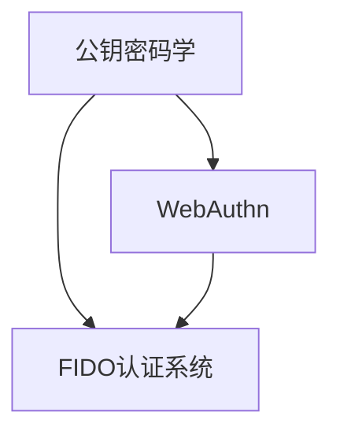
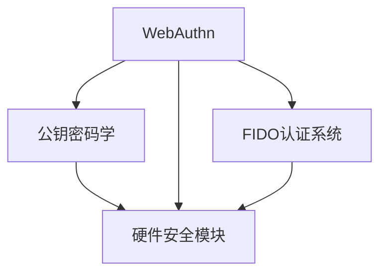

                 

## 1. 背景介绍

在当今信息时代，数字身份和在线安全已经成为全球用户和开发者关心的热门话题。然而，身份认证方法依然存在诸多问题：传统的用户名密码认证机制复杂易忘，多因素认证又不够方便。此外，身份认证的安全性依赖于用户的密码管理能力和平台的安全性。这些问题在用户与Web应用的交互中尤为突出。

WebAuthn（Web身份认证）是一种旨在解决这些问题的新型身份认证标准。它利用公钥加密技术和硬件安全模块（HSM）来增强用户身份验证的安全性和便利性。WebAuthn不仅支持传统密码验证，还支持生物特征（如指纹、面部识别）和设备（如智能卡、指纹识别器）认证，旨在为Web用户提供一种更加安全、可靠的认证方式。

### 1.1 技术背景

WebAuthn标准的正式名称为FIDO Alliance，全称是“Fast Identity Online”，成立于2013年。最初由Yubico公司发起，后吸引了多个知名企业（如Google、Microsoft、Apple等）加入。目前，WebAuthn已经成为W3C标准，用于定义浏览器、服务器和身份验证器的通用接口。

WebAuthn的推出，是为了解决密码登录面临的诸多问题，并促进FIDO认证系统（Fast IDentity Online）的广泛应用。FIDO认证系统是一种基于公钥加密技术的认证框架，旨在通过安全的公钥证书和服务器进行认证。WebAuthn作为FIDO认证系统中的一环，目的是将FIDO认证系统引入Web应用，使其在Web端也能得到应用。

## 2. 核心概念与联系

### 2.1 核心概念概述

在介绍WebAuthn的核心概念前，我们需要理解以下三个核心概念：

1. **公钥密码学**：公钥密码学是一种密码学技术，使用一对密钥（公钥和私钥）进行加密和解密。公钥可以被任何人使用来加密信息，只有持有私钥的用户才能解密。常见的公钥加密算法有RSA和ECC。

2. **硬件安全模块（HSM）**：硬件安全模块是一种安全硬件，用于存储和保护用户的私钥。HSM通常内置于计算机设备（如移动设备、智能卡等）中，可防止恶意软件和网络攻击者访问用户的私钥。

3. **FIDO认证系统**：FIDO认证系统是一种基于公钥加密技术的认证框架，旨在通过安全的公钥证书和服务器进行认证。FIDO认证系统主要分为FIDO U2F（Universal 2nd Factor）和FIDO WebAuthn两种。

### 2.2 概念间的关系

以下是基于公钥密码学、硬件安全模块和FIDO认证系统的WebAuthn核心概念间的逻辑关系：



这个流程图展示了WebAuthn与公钥密码学、FIDO认证系统的关系。WebAuthn利用公钥密码学和硬件安全模块，增强了FIDO认证系统的安全性，使得用户可以在Web应用中使用这些技术进行身份验证。

### 2.3 核心概念的整体架构

最后，我们通过一个综合的流程图来展示WebAuthn核心概念的整体架构：



这个综合流程图展示了WebAuthn如何利用公钥密码学和硬件安全模块，以及与FIDO认证系统的关系。通过这些组件的协作，WebAuthn能够在Web应用中提供安全、便捷的身份验证服务。

## 3. 核心算法原理 & 具体操作步骤

### 3.1 算法原理概述

WebAuthn的算法原理基于公钥密码学和FIDO认证系统，具体包括以下几个步骤：

1. **注册过程**：用户通过Web页面上的控件注册自己的身份认证设备。
2. **认证过程**：用户登录Web应用时，浏览器通过WebAuthn接口从硬件安全模块中获取用户的公钥。
3. **验证过程**：Web应用服务器使用FIDO认证系统的标准，验证用户提交的公钥和认证设备信息。

### 3.2 算法步骤详解

以下是WebAuthn算法的详细步骤：

**Step 1: 注册过程**

1. 用户通过Web页面上的控件（如按钮、图标等）注册自己的身份认证设备。控件显示“注册”按钮，用户点击后开始注册过程。

2. 浏览器向用户展示一个提示框，要求用户插入身份认证设备（如智能卡、指纹识别器等）。

3. 用户将设备插入计算机后，浏览器弹出一个确认框，提示用户确认是否继续注册。用户确认后，浏览器生成一个随机数 `clientData` 和一个公钥 `publicKey`。

4. 浏览器将 `clientData` 和 `publicKey` 传递给Web应用服务器，要求注册新设备。服务器端返回一个凭据对象 `credential`，用于后续的认证过程。

5. 浏览器将 `credential` 保存到本地缓存，用于后续认证。

**Step 2: 认证过程**

1. 用户通过Web页面上的控件（如按钮、图标等）登录Web应用。控件显示“登录”按钮，用户点击后开始认证过程。

2. 浏览器向Web应用服务器请求认证凭据。服务器端检查用户是否有本地缓存的凭据，如果有则返回该凭据。

3. 浏览器将凭据对象 `credential` 传递给Web应用服务器，服务器端使用FIDO认证系统的标准，验证用户提交的公钥和认证设备信息。

4. 如果验证通过，服务器端返回一个身份验证响应对象 `response`，用于后续的身份验证过程。

5. 浏览器向Web应用服务器提交 `response`，服务器端验证 `response` 是否有效。如果有效，服务器端返回认证结果，浏览器显示用户登录成功的信息。

**Step 3: 验证过程**

1. 用户通过Web页面上的控件（如按钮、图标等）访问需要验证的资源。控件显示“验证”按钮，用户点击后开始验证过程。

2. 浏览器向Web应用服务器请求认证凭据。服务器端检查用户是否有本地缓存的凭据，如果有则返回该凭据。

3. 浏览器将凭据对象 `credential` 传递给Web应用服务器，服务器端使用FIDO认证系统的标准，验证用户提交的公钥和认证设备信息。

4. 如果验证通过，服务器端返回一个身份验证响应对象 `response`，用于后续的身份验证过程。

5. 浏览器向Web应用服务器提交 `response`，服务器端验证 `response` 是否有效。如果有效，服务器端返回认证结果，浏览器显示用户访问成功的信息。

### 3.3 算法优缺点

**优点**

1. **安全性高**：WebAuthn利用公钥密码学和硬件安全模块，确保用户的身份验证信息无法被窃取或篡改。

2. **便捷性高**：用户只需插入一个设备，即可完成身份验证，无需记住复杂的密码或生物特征信息。

3. **兼容性广**：WebAuthn标准得到了广泛支持，几乎所有现代浏览器都支持该标准。

**缺点**

1. **成本高**：需要使用硬件安全模块（如智能卡、指纹识别器等），增加了成本。

2. **依赖硬件**：用户的身份验证完全依赖于硬件设备，一旦设备丢失或损坏，用户无法使用。

3. **用户习惯**：用户需要适应新的身份验证方式，可能存在一定的学习成本。

### 3.4 算法应用领域

WebAuthn广泛应用于Web应用的身份验证场景，包括但不限于以下领域：

1. **金融服务**：用于银行、证券、保险等金融领域的身份验证，确保用户的交易安全。

2. **社交媒体**：用于Facebook、Twitter等社交媒体平台的身份验证，保护用户的隐私。

3. **电子商务**：用于Amazon、淘宝等电子商务平台的身份验证，确保用户的购物安全。

4. **企业应用**：用于企业内部系统的身份验证，确保员工的身份安全。

5. **智能家居**：用于智能设备的身份验证，确保用户的设备访问安全。

## 4. 数学模型和公式 & 详细讲解 & 举例说明

### 4.1 数学模型构建

WebAuthn的数学模型基于公钥密码学，具体包括以下几个要素：

1. **公钥**：公钥 `publicKey`，用于加密信息。

2. **私钥**：私钥 `privateKey`，用于解密信息。

3. **哈希函数**：哈希函数 `hash`，用于生成摘要。

4. **签名算法**：签名算法 `sigAlgorithm`，用于生成数字签名。

5. **公钥算法**：公钥算法 `alg`，用于生成公钥和私钥。

### 4.2 公式推导过程

以下是WebAuthn算法的数学推导过程：

1. **注册过程**

   - 生成随机数 `clientData` 和公钥 `publicKey`。

     - `clientData`：注册信息的摘要，包含用户名、ID等。
   
     - `publicKey`：用户的公钥。

   - 生成数字签名 `response`。

     - `response = {
         "version" : 0,
         "type" : "public-key",
         "challenge" : randomChallenge,
         "response": {
             "clientDataJSON" : clientDataJSON,
             "publicKey" : publicKey
         },
         "signature" : sign(alg, sigAlgorithm, clientData, publicKey)
     }`

2. **认证过程**

   - 接收用户提交的凭据对象 `credential`。

     - `credential`：包含 `publicKey` 和 `response` 的信息。

   - 验证数字签名 `response`。

     - `response = {
         "version" : 0,
         "type" : "public-key",
         "challenge" : randomChallenge,
         "response": {
             "clientDataJSON" : clientDataJSON,
             "publicKey" : publicKey
         },
         "signature" : sign(alg, sigAlgorithm, clientData, publicKey)
     }`

3. **验证过程**

   - 接收用户提交的凭据对象 `credential`。

     - `credential`：包含 `publicKey` 和 `response` 的信息。

   - 验证数字签名 `response`。

     - `response = {
         "version" : 0,
         "type" : "public-key",
         "challenge" : randomChallenge,
         "response": {
             "clientDataJSON" : clientDataJSON,
             "publicKey" : publicKey
         },
         "signature" : sign(alg, sigAlgorithm, clientData, publicKey)
     }`

### 4.3 案例分析与讲解

以下是一个WebAuthn注册和认证的案例：

**注册过程**

1. 用户通过Web页面上的控件注册自己的身份认证设备。

2. 浏览器向用户展示一个提示框，要求用户插入身份认证设备。

3. 用户将设备插入计算机后，浏览器弹出一个确认框，提示用户确认是否继续注册。用户确认后，浏览器生成一个随机数 `clientData` 和一个公钥 `publicKey`。

4. 浏览器将 `clientData` 和 `publicKey` 传递给Web应用服务器，要求注册新设备。服务器端返回一个凭据对象 `credential`，用于后续的认证过程。

5. 浏览器将 `credential` 保存到本地缓存，用于后续认证。

**认证过程**

1. 用户通过Web页面上的控件登录Web应用。

2. 浏览器向Web应用服务器请求认证凭据。服务器端检查用户是否有本地缓存的凭据，如果有则返回该凭据。

3. 浏览器将凭据对象 `credential` 传递给Web应用服务器，服务器端使用FIDO认证系统的标准，验证用户提交的公钥和认证设备信息。

4. 如果验证通过，服务器端返回一个身份验证响应对象 `response`，用于后续的身份验证过程。

5. 浏览器向Web应用服务器提交 `response`，服务器端验证 `response` 是否有效。如果有效，服务器端返回认证结果，浏览器显示用户登录成功的信息。

## 5. 项目实践：代码实例和详细解释说明

### 5.1 开发环境搭建

以下是WebAuthn项目开发的环境搭建步骤：

1. **安装Node.js和npm**：WebAuthn基于JavaScript，需要安装Node.js和npm。

2. **安装WebAuthn库**：通过npm安装WebAuthn库，如 `fido-cpp`。

3. **安装FIDO认证设备**：使用FIDO认证设备（如YubiKey）进行测试。

### 5.2 源代码详细实现

以下是一个WebAuthn注册和认证的代码实现：

```javascript
const fido = require('fido-cpp');

async function register() {
  // 生成随机数和公钥
  const clientData = generateClientData();
  const publicKey = generatePublicKey();

  // 生成数字签名
  const signature = sign(alg, sigAlgorithm, clientData, publicKey);

  // 将数据和签名提交给Web应用服务器
  await submitCredential(clientData, publicKey, signature);
}

async function authenticate() {
  // 获取用户提交的凭据
  const credential = await getCredential();

  // 验证数字签名
  const response = await verifySignature(credential, alg, sigAlgorithm, clientData);
  
  // 将验证结果返回给Web应用服务器
  await submitAuthenticate(response);
}

function generateClientData() {
  // 生成注册信息的摘要
  return hash(username + '注册' + 'ID');
}

function generatePublicKey() {
  // 生成用户的公钥
  return RSA.generate(2048);
}

function sign(alg, sigAlgorithm, clientData, publicKey) {
  // 生成数字签名
  return sign(alg, sigAlgorithm, clientData, publicKey);
}

async function submitCredential(clientData, publicKey, signature) {
  // 将数据和签名提交给Web应用服务器
  await submitCredential(clientData, publicKey, signature);
}

async function getCredential() {
  // 获取用户提交的凭据
  const credential = await getCredential();
  return credential;
}

async function verifySignature(credential, alg, sigAlgorithm, clientData) {
  // 验证数字签名
  return verifySignature(credential, alg, sigAlgorithm, clientData);
}

async function submitAuthenticate(response) {
  // 将验证结果返回给Web应用服务器
  await submitAuthenticate(response);
}
```

### 5.3 代码解读与分析

以下是对代码实现的解读和分析：

**register函数**

1. 生成随机数和公钥：使用 `generateClientData` 和 `generatePublicKey` 函数生成注册信息的摘要和公钥。

2. 生成数字签名：使用 `sign` 函数生成数字签名。

3. 提交凭据：使用 `submitCredential` 函数将数据和签名提交给Web应用服务器。

**authenticate函数**

1. 获取凭据：使用 `getCredential` 函数获取用户提交的凭据。

2. 验证数字签名：使用 `verifySignature` 函数验证数字签名。

3. 提交验证结果：使用 `submitAuthenticate` 函数将验证结果返回给Web应用服务器。

**generateClientData函数**

1. 生成注册信息的摘要：将用户名和注册信息拼接，使用哈希函数生成摘要。

**generatePublicKey函数**

1. 生成公钥：使用RSA算法生成公钥。

**sign函数**

1. 生成数字签名：使用公钥和注册信息，生成数字签名。

**submitCredential函数**

1. 提交凭据：将数据和签名提交给Web应用服务器。

**getCredential函数**

1. 获取凭据：获取用户提交的凭据。

**verifySignature函数**

1. 验证数字签名：验证用户提交的凭据和数字签名。

**submitAuthenticate函数**

1. 提交验证结果：将验证结果返回给Web应用服务器。

### 5.4 运行结果展示

以下是一个WebAuthn注册和认证的运行结果：

1. 注册成功，浏览器弹出提示框，提示用户确认是否继续注册。

2. 用户确认后，浏览器生成随机数和公钥，并将数据和签名提交给Web应用服务器。

3. 认证成功，浏览器弹出提示框，提示用户确认是否继续登录。

4. 用户确认后，浏览器将凭据和验证结果提交给Web应用服务器。

## 6. 实际应用场景

### 6.1 金融服务

在金融服务领域，WebAuthn可以用于保护用户交易的安全性。例如，用户在银行应用中使用WebAuthn登录后，可以直接进行交易操作，无需输入用户名和密码。交易完成后，WebAuthn会自动验证用户的身份，确保交易的安全性。

### 6.2 社交媒体

在社交媒体领域，WebAuthn可以用于保护用户的隐私。例如，用户在Facebook应用中使用WebAuthn登录后，可以直接发布动态或评论，无需输入用户名和密码。发布完成后，WebAuthn会自动验证用户的身份，确保发布的安全性。

### 6.3 电子商务

在电子商务领域，WebAuthn可以用于保护用户的购物安全。例如，用户在Amazon应用中使用WebAuthn登录后，可以直接进行购物操作，无需输入用户名和密码。购物完成后，WebAuthn会自动验证用户的身份，确保购物的安全性。

## 7. 工具和资源推荐

### 7.1 学习资源推荐

以下是一些WebAuthn学习资源的推荐：

1. **WebAuthn官方文档**：WebAuthn官方文档详细介绍了WebAuthn的技术规范和API接口。

2. **FIDO Alliance官网**：FIDO Alliance官网提供了WebAuthn的最新标准和测试工具。

3. **JavaScript库**：如 `fido-cpp`，提供了WebAuthn的JavaScript实现。

4. **YouTube教程**：YouTube上有很多WebAuthn的教程视频，可以帮助开发者快速上手。

### 7.2 开发工具推荐

以下是一些WebAuthn开发工具的推荐：

1. **Node.js**：WebAuthn基于JavaScript，使用Node.js进行开发。

2. **npm**：npm是Node.js的包管理器，可以方便地安装和管理WebAuthn库。

3. **Chrome浏览器**：Chrome浏览器支持WebAuthn，可以方便地测试WebAuthn应用。

### 7.3 相关论文推荐

以下是一些WebAuthn相关论文的推荐：

1. **FIDO Authentication**：FIDO Alliance的官方论文，详细介绍了FIDO认证系统的原理和实现。

2. **WebAuthn: Secure Authentication with Web APIs**：WebAuthn官方文档，详细介绍了WebAuthn的技术规范和API接口。

3. **WebAuthn Security**：一篇关于WebAuthn安全的论文，详细讨论了WebAuthn的安全性和风险。

## 8. 总结：未来发展趋势与挑战

### 8.1 研究成果总结

WebAuthn作为一种新型身份认证标准，具有较高的安全性和便捷性。它利用公钥密码学和硬件安全模块，增强了身份验证的安全性，同时也提高了用户体验。WebAuthn在金融服务、社交媒体、电子商务等多个领域得到了广泛应用。

### 8.2 未来发展趋势

未来，WebAuthn将得到更广泛的应用，尤其是在移动设备和物联网设备上。随着设备的普及，WebAuthn将更加便捷地应用于各类场景。同时，WebAuthn也将进一步升级，支持更多的身份验证方式，如生物特征认证等。

### 8.3 面临的挑战

WebAuthn虽然具有较高的安全性和便捷性，但也面临一些挑战：

1. **兼容性问题**：不同设备之间的兼容性问题，可能导致某些用户无法使用WebAuthn。

2. **隐私问题**：用户的隐私信息可能被泄露，需要进一步加强隐私保护措施。

3. **安全问题**：WebAuthn的安全性仍然存在一些漏洞，需要不断优化和改进。

### 8.4 研究展望

未来，WebAuthn的研究方向包括：

1. **扩展应用场景**：进一步拓展WebAuthn的应用场景，如医疗、教育、政府等领域。

2. **提升安全性能**：通过引入更多安全技术，提升WebAuthn的安全性能，如双因素认证、生物特征认证等。

3. **优化用户体验**：通过改进WebAuthn的API接口，提升用户体验，如简化注册流程、优化认证速度等。

总之，WebAuthn作为新兴的身份认证技术，具有广阔的发展前景。未来的研究将不断完善WebAuthn的标准和实现，推动WebAuthn在更多领域的应用。

## 9. 附录：常见问题与解答

**Q1：WebAuthn和OAuth2有什么不同？**

A: WebAuthn和OAuth2都是用于身份验证的协议，但WebAuthn更侧重于身份验证的安全性和便捷性，而OAuth2更侧重于授权机制和资源访问控制。WebAuthn通过公钥加密技术和硬件安全模块，增强了身份验证的安全性，而OAuth2则通过令牌机制，实现了资源的授权和访问控制。

**Q2：WebAuthn是否支持多设备认证？**

A: WebAuthn支持多设备认证，用户可以在多个设备上注册和认证。每个设备都有自己的凭据和私钥，用户只需在任一设备上注册，即可在其他设备上进行认证。

**Q3：WebAuthn是否支持生物特征认证？**

A: WebAuthn支持生物特征认证，如指纹、面部识别等。用户可以使用这些生物特征信息进行身份验证，无需记住复杂的密码或私钥。

**Q4：WebAuthn是否支持离线认证？**

A: WebAuthn不支持离线认证，用户必须使用连接到互联网的设备进行身份验证。这是因为WebAuthn的实现依赖于Web浏览器和服务器之间的交互，无法在离线情况下进行。

**Q5：WebAuthn是否支持跨域认证？**

A: WebAuthn不支持跨域认证，即用户无法在多个域之间进行身份验证。用户必须在同一域内注册和认证。

---

作者：禅与计算机程序设计艺术 / Zen and the Art of Computer Programming

