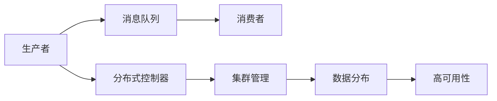
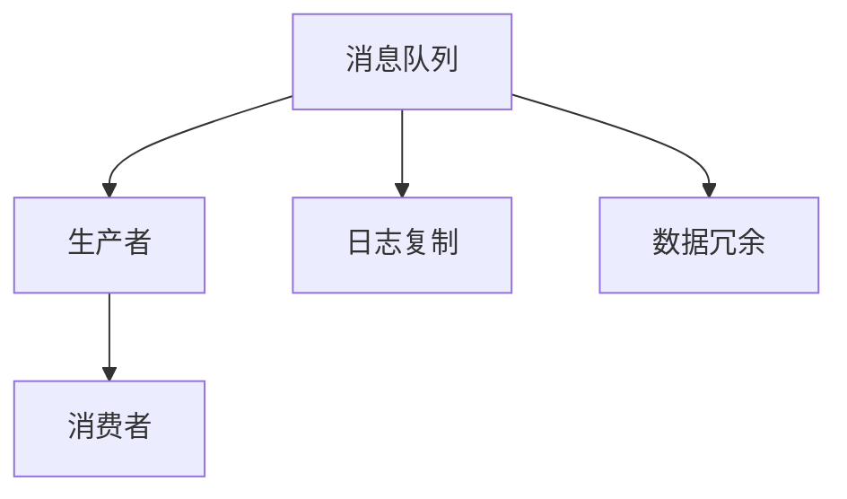
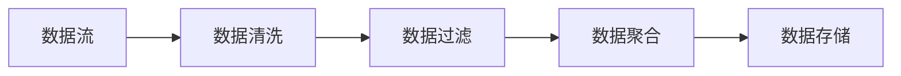
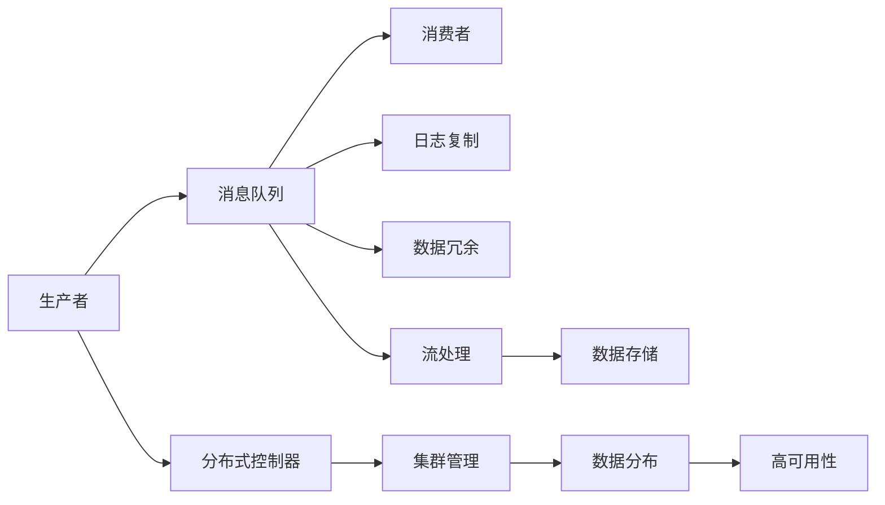

                 

# 【AI大数据计算原理与代码实例讲解】Kafka

> 关键词：Kafka, 分布式流处理, 高吞吐量, 数据可靠性, 容错, 消息队列

## 1. 背景介绍

### 1.1 问题由来
随着互联网和移动互联网的飞速发展，数据量呈指数级增长。如何高效存储和处理大规模数据，成为各大企业迫切需要解决的问题。传统的单节点存储和处理系统在面对海量数据时，显得力不从心。此时，分布式数据处理技术应运而生，旨在通过多节点并行处理，提升系统的处理能力和数据可靠性。

Kafka作为一款成熟的分布式流处理系统，在实际应用中已经得到广泛验证，是数据驱动型企业必须掌握的重要技术。它不仅具备高吞吐量、数据可靠性、容错性强等优势，还能灵活支持各种数据处理场景，从日志收集、实时数据分析到大规模数据流处理，无所不能。

### 1.2 问题核心关键点
Kafka的核心原理包括：

- 消息队列：Kafka通过消息队列的形式，将数据流进行分段存储，支持高吞吐量的数据读写。
- 分布式架构：通过多节点集群的方式，实现数据的高可用性和容错性。
- 流处理：支持实时流数据处理，具有强大的数据清洗、过滤和聚合能力。
- 高可靠性：通过日志复制、版本控制等机制，保证数据的一致性和可靠性。
- 高吞吐量：通过多副本、异步写盘等优化，实现每秒数十万条消息的吞吐量。
- 低延迟：通过批量写盘、零拷贝等技术，减少数据传输延迟。

Kafka的这些特性，使得它成为数据处理领域的明星工具，广泛应用于企业内部数据流通、外部数据交换、大数据分析等多个场景。掌握Kafka的原理与实践，对于提升数据处理能力和系统稳定性具有重要意义。

### 1.3 问题研究意义
研究Kafka的原理与实践，对于提升数据处理能力、保障数据可靠性、优化系统架构具有重要意义：

1. 提升数据处理能力。通过Kafka的高吞吐量特性，可以处理海量的实时数据，支持企业级数据流的稳定传输。
2. 保障数据可靠性。Kafka通过日志复制、版本控制等机制，保证数据的一致性和可靠性，减少数据丢失和损坏的风险。
3. 优化系统架构。Kafka的分布式架构，使得数据处理过程可以水平扩展，提升系统的可扩展性和稳定性。
4. 支持多种数据处理场景。Kafka不仅能处理日志数据，还能支持实时数据分析、流处理、分布式事务等。
5. 集成大数据生态。Kafka与Hadoop、Spark、Flink等大数据工具无缝集成，形成统一的数据处理生态。

掌握Kafka的技术，将大大提升企业数据处理和存储的能力，推动数字化转型的进程。

## 2. 核心概念与联系

### 2.1 核心概念概述

为了更好地理解Kafka的工作原理和应用场景，本节将介绍几个密切相关的核心概念：

- Kafka分布式流处理系统：由Apache基金会开发的开源分布式流处理平台，具有高吞吐量、高可靠性、低延迟等特点，适用于处理实时数据流。
- 消息队列：用于在生产者和消费者之间传递消息，保证数据流的可靠性和稳定性。
- 分布式架构：通过集群管理，实现数据的水平扩展和高可用性。
- 流处理：支持实时数据的清洗、过滤和聚合，进行数据流的高级处理。
- 高可靠性：通过日志复制、版本控制等机制，保证数据的一致性和可靠性。
- 高吞吐量：支持每秒数十万条消息的吞吐量，满足大规模数据流的处理需求。
- 低延迟：通过批量写盘、零拷贝等技术，减少数据传输延迟。

这些核心概念之间存在着紧密的联系，形成了Kafka的完整生态系统。

### 2.2 概念间的关系

这些核心概念之间存在着紧密的联系，形成了Kafka的完整生态系统。下面我们通过几个Mermaid流程图来展示这些概念之间的关系。

#### 2.2.1 Kafka分布式架构



这个流程图展示了大规模数据流在Kafka系统中的处理流程：生产者将数据写入消息队列，消费者从队列中读取数据进行处理，分布式控制器负责集群管理和数据分配，确保数据的高可用性和稳定性。

#### 2.2.2 消息队列



这个流程图展示了Kafka消息队列的基本工作流程。生产者将数据写入队列，消费者从队列中读取数据，队列通过日志复制和数据冗余机制，保证数据的高可靠性和一致性。

#### 2.2.3 流处理



这个流程图展示了Kafka的流处理能力。数据流经过清洗、过滤、聚合等处理，最终存储到外部存储系统。

### 2.3 核心概念的整体架构

最后，我们用一个综合的流程图来展示这些核心概念在Kafka系统中的整体架构：



这个综合流程图展示了Kafka系统的整体架构，从数据产生、传输、处理到存储的全过程。生产者将数据写入消息队列，经过分布式控制器管理和数据分配，通过日志复制和数据冗余保证数据的可靠性，最终进行流处理并存储到外部存储系统。

## 3. 核心算法原理 & 具体操作步骤

### 3.1 算法原理概述

Kafka的核心原理包括以下几个方面：

1. 分布式架构：通过多节点集群的方式，实现数据的高可用性和容错性。
2. 消息队列：将数据流进行分段存储，支持高吞吐量的数据读写。
3. 流处理：支持实时流数据处理，具有强大的数据清洗、过滤和聚合能力。
4. 高可靠性：通过日志复制、版本控制等机制，保证数据的一致性和可靠性。
5. 高吞吐量：通过多副本、异步写盘等优化，实现每秒数十万条消息的吞吐量。
6. 低延迟：通过批量写盘、零拷贝等技术，减少数据传输延迟。

### 3.2 算法步骤详解

Kafka的具体操作步骤可以分为以下几个步骤：

**Step 1: 安装和配置Kafka集群**

1. 安装Kafka服务器：在服务器上安装Kafka，解压并启动Kafka服务。
2. 配置Kafka参数：修改Kafka配置文件，设置节点信息、日志路径、broker数量等参数。
3. 配置Zookeeper：Kafka依赖于Zookeeper进行集群管理，配置Zookeeper节点和端口信息。

**Step 2: 创建主题和分区**

1. 创建主题：通过Kafka命令行或API创建主题，指定主题名、分区数、副本数等参数。
2. 创建分区：根据主题名和分区数，将数据流分配到不同的分区中。

**Step 3: 发送数据**

1. 使用Kafka API或命令行向主题发送数据，指定分区和偏移量。
2. 生产者可以使用不同的序列化方式，将原始数据转换为二进制格式，供Kafka处理。

**Step 4: 接收数据**

1. 消费者使用Kafka API或命令行从主题接收数据，指定分区和偏移量。
2. 消费者可以按照不同的主题订阅数据流，进行分布式消费。
3. 消费者可以从Kafka中读取数据，进行实时处理和存储。

**Step 5: 数据处理和存储**

1. 数据流经过Kafka的流处理模块，进行数据清洗、过滤和聚合等处理。
2. 处理后的数据可以存储到外部存储系统，如Hadoop、Elasticsearch等。
3. 数据可以用于实时分析和离线分析，支持多种数据处理场景。

### 3.3 算法优缺点

Kafka具有以下优点：

1. 高吞吐量：支持每秒数十万条消息的吞吐量，满足大规模数据流的处理需求。
2. 高可靠性：通过日志复制、版本控制等机制，保证数据的一致性和可靠性。
3. 低延迟：通过批量写盘、零拷贝等技术，减少数据传输延迟。
4. 分布式架构：支持多节点集群管理，实现数据的高可用性和容错性。
5. 流处理：支持实时流数据处理，具有强大的数据清洗、过滤和聚合能力。

Kafka也存在以下缺点：

1. 配置复杂：Kafka的配置参数较多，需要仔细调整和测试。
2. 维护难度高：Kafka的集群管理和故障排查较复杂，需要一定的运维经验。
3. 资源占用高：Kafka的集群管理和数据处理需要占用大量资源，需注意资源配置。

### 3.4 算法应用领域

Kafka的分布式流处理能力，使其在以下几个领域得到了广泛应用：

- 日志收集：用于收集和存储企业内部的操作日志、访问日志、错误日志等。
- 实时数据分析：用于实时分析和处理数据流，提取有价值的信息和洞见。
- 数据交换：用于企业间的数据交换和共享，支持异构数据源的集成和统一。
- 分布式事务：用于支持分布式事务处理，保证数据的完整性和一致性。
- 大数据分析：用于与Hadoop、Spark、Flink等大数据工具集成，支持大规模数据分析。
- 物联网数据处理：用于处理物联网设备的实时数据流，支持设备监控和远程控制。

## 4. 数学模型和公式 & 详细讲解 & 举例说明

### 4.1 数学模型构建

Kafka的核心数据模型包括消息队列和数据流。消息队列用于存储数据流，数据流则通过Kafka的流处理模块进行实时处理。

定义Kafka主题为 $T$，主题中的数据流为 $S$，数据流中的消息为 $M$。消息队列由若干个分区组成，每个分区包含若干个消息副本。设 $P$ 为分区数，$C$ 为副本数，$D$ 为分区编号，$R$ 为消息副本编号。则消息队列可以表示为：

$$
Q = \{(P, C, D, R)|M \in S\}
$$

定义消息队列 $Q$ 中的数据流为 $S$，消息流 $S$ 中的消息为 $M$。每个消息 $M$ 由消息内容 $C$ 和消息时间戳 $T$ 组成。则消息流 $S$ 可以表示为：

$$
S = \{M=(C, T)|M \in Q\}
$$

### 4.2 公式推导过程

在Kafka中，数据流 $S$ 经过流处理模块进行清洗、过滤、聚合等处理，最终存储到外部存储系统 $H$ 中。设 $F$ 为数据流 $S$ 的流处理模块，$P$ 为流处理模块 $F$ 的参数。则数据流处理过程可以表示为：

$$
S' = F(S, P)
$$

其中 $S'$ 为处理后的数据流，$P$ 为流处理模块的参数，可以包含各种数据清洗和过滤规则。

处理后的数据流 $S'$ 可以存储到外部存储系统 $H$ 中。定义存储系统 $H$ 为：

$$
H = \{M'|M' \in S'\}
$$

### 4.3 案例分析与讲解

假设我们使用Kafka处理一条新闻数据流，将新闻内容进行清洗和聚合，存储到Hadoop中。

**Step 1: 创建主题和分区**

1. 创建主题：
```bash
bin/kafka-topics.sh --create --zookeeper localhost:2181 --replication-factor 2 --partitions 3 --topic news
```

2. 创建分区：
```bash
bin/kafka-topics.sh --zookeeper localhost:2181 --replication-factor 2 --partitions 3 --topic news
```

**Step 2: 发送数据**

1. 安装Kafka客户端，编写数据生产代码：
```java
Properties props = new Properties();
props.put("bootstrap.servers", "localhost:9092");
props.put("acks", "all");
props.put("retries", 0);
props.put("batch.size", 16384);
props.put("linger.ms", 1);
props.put("buffer.memory", 33554432);
props.put("key.serializer", "org.apache.kafka.common.serialization.StringSerializer");
props.put("value.serializer", "org.apache.kafka.common.serialization.StringSerializer");

Producer<String, String> producer = new KafkaProducer<>(props);
for (int i = 0; i < 100; i++) {
    String topic = "news";
    String message = "新闻 " + i;
    producer.send(new ProducerRecord<>(topic, message));
}
producer.close();
```

2. 启动Kafka服务，通过命令行或API接收数据：
```bash
bin/kafka-console-consumer.sh --bootstrap-server localhost:9092 --topic news --from-beginning
```

**Step 3: 数据处理和存储**

1. 使用Hadoop进行数据处理：
```java
public class KafkaHadoopExample {
    public static void main(String[] args) throws Exception {
        Configuration conf = new Configuration();
        Job job = Job.getInstance(conf, "KafkaToHadoop");
        job.setJarByClass(KafkaHadoopExample.class);
        job.setMapperClass(KafkaMapper.class);
        job.setReducerClass(KafkaReducer.class);
        job.setOutputKeyClass(Text.class);
        job.setOutputValueClass(Text.class);
        job.setInputFormatClass(KafkaInputFormat.class);
        job.setOutputFormatClass(TextOutputFormat.class);
        job.setJobName("KafkaToHadoop");
        job.setOutputPath(new Path(args[1]));
        System.exit(job.waitForCompletion(true) ? 0 : 1);
    }
}

public class KafkaMapper extends Mapper<Object, Text, Text, Text> {
    public void map(Object key, Text value, Context context) throws IOException, InterruptedException {
        String[] fields = value.toString().split(",");
        String id = fields[0];
        String time = fields[1];
        String content = fields[2];
        context.write(new Text(id), new Text(time + " " + content));
    }
}

public class KafkaReducer extends Reducer<Text, Text, Text, Text> {
    public void reduce(Text key, Iterable<Text> values, Context context) throws IOException, InterruptedException {
        Iterator<Text> iter = values.iterator();
        String time = iter.next().toString().substring(0, 10);
        StringBuffer buffer = new StringBuffer();
        while (iter.hasNext()) {
            buffer.append(iter.next().toString());
        }
        context.write(key, new Text(time + " " + buffer.toString()));
    }
}

public class KafkaInputFormat extends InputFormat<Object, Text> {
    public RecordReader<Object, Text> createRecordReader(JobContext context) throws IOException, InterruptedException {
        return new KafkaRecordReader(context);
    }
}

public class KafkaRecordReader extends RecordReader<Object, Text> {
    private KafkaConsumer<String, String> consumer;
    private Iterator<Entry<String, String>> iterator;
    private Text key = new Text();
    private Text value = new Text();
    private int offset = 0;

    public KafkaRecordReader(JobContext context) throws IOException, InterruptedException {
        String[] topics = context.getConfiguration().getStrings("topic", new String[] { "news" });
        String bootstrapServers = context.getConfiguration().getString("bootstrap.servers", "localhost:9092");
        String groupId = context.getConfiguration().getString("group.id", "mygroup");
        String topic = topics[0];
        consumer = new KafkaConsumer<>(ConsumerConfig.create(consumerConfig()).groupId(groupId).bootstrapServers(bootstrapServers).topics(Collections.singleton(topic)));
        iterator = consumer.iterator();
    }

    public void seek(long offset) throws IOException, InterruptedException {
        consumer.seek(new TopicPartition(Integer.parseInt(iterator.hasNext() ? iterator.next().getKey() : 0), offset);
    }

    public long getOffset() throws IOException, InterruptedException {
        return consumer.position(new TopicPartition(Integer.parseInt(iterator.hasNext() ? iterator.next().getKey() : 0));
    }

    public Text getKey() throws IOException, InterruptedException {
        return key;
    }

    public Text getValue() throws IOException, InterruptedException {
        return value;
    }

    public void close() throws IOException, InterruptedException {
        consumer.close();
    }
}
```

2. 启动Hadoop作业，将处理后的数据存储到Hadoop中：
```bash
hadoop jar KafkaToHadoop.jar news /user/hadoop/news
```

通过这个案例，可以看到Kafka如何进行数据流的生产、接收、处理和存储，以及与Hadoop的无缝集成。Kafka强大的分布式流处理能力，使得数据流处理变得高效便捷，成为企业数据处理的重要工具。

## 5. 项目实践：代码实例和详细解释说明

### 5.1 开发环境搭建

在进行Kafka项目实践前，我们需要准备好开发环境。以下是使用Python进行Kafka开发的环境配置流程：

1. 安装JDK：从官网下载并安装Java Development Kit，确保环境变量配置正确。
2. 安装Kafka：从官网下载并安装Kafka，解压并启动Kafka服务。
3. 安装Kafka Python客户端：使用pip安装Kafka-Python客户端。

完成上述步骤后，即可在本地环境进行Kafka开发。

### 5.2 源代码详细实现

下面我们以消息队列的基本使用为例，给出使用Kafka-Python客户端进行消息生产的PyTorch代码实现。

首先，导入必要的库和配置：

```python
from kafka import KafkaProducer
import logging
import os

logging.basicConfig(level=logging.INFO)
props = {
    "bootstrap.servers": "localhost:9092",
    "acks": "all",
    "retries": 0,
    "batch.size": 16384,
    "linger.ms": 1,
    "buffer.memory": 33554432,
    "key.serializer": "org.apache.kafka.common.serialization.StringSerializer",
    "value.serializer": "org.apache.kafka.common.serialization.StringSerializer"
}
```

然后，定义Kafka生产者：

```python
producer = KafkaProducer(**props)
```

接着，定义发送数据的函数：

```python
def send_message(topic, message):
    producer.send(topic, key=key, value=message)
```

最后，启动生产者并发送数据：

```python
while True:
    key = input("请输入消息key：")
    message = input("请输入消息内容：")
    send_message("news", message)
```

通过这个代码实例，可以看到使用Kafka-Python客户端进行消息生产的完整流程，以及如何通过函数调用发送数据。Kafka-Python客户端简单易用，为Kafka的开发提供了便捷的工具支持。

### 5.3 代码解读与分析

让我们再详细解读一下关键代码的实现细节：

**KafkaProducer配置**：
- 配置Kafka生产者，指定服务器的地址、ack机制、重试次数、批处理大小、延迟时间、缓冲区大小等参数。
- 指定key和value序列化方式，确保生产者能够正确处理原始数据。

**send_message函数**：
- 定义一个发送数据的函数，指定主题、key和value。
- 通过生产者发送数据，并指定key和value的实际内容。

**主循环**：
- 使用while循环，不断接收用户输入，并调用send_message函数发送数据。
- 通过函数调用，将输入的消息key和内容转换为生产者可以接受的数据格式。

通过这个代码实例，可以看到Kafka-Python客户端简单易用的特点，以及如何通过函数调用实现数据的生产和发送。Kafka-Python客户端为Kafka的开发提供了便捷的工具支持，开发者可以更加专注于业务逻辑的实现，而不必过多关注底层的细节。

### 5.4 运行结果展示

假设我们通过上述代码实例，成功发送了一条消息到Kafka主题，可以通过以下代码来接收和查看该消息：

```python
from kafka import KafkaConsumer

props = {
    "bootstrap.servers": "localhost:9092",
    "group.id": "mygroup",
    "enable.auto.commit": True,
    "auto.offset.reset": "earliest"
}

consumer = KafkaConsumer("news", **props)
for message in consumer:
    print(message.key, message.value)
```

通过这个代码实例，可以看到使用Kafka-Python客户端进行消息接收的完整流程，以及如何通过迭代器接收消息并打印输出。Kafka-Python客户端的API设计简洁高效，开发者可以通过简单的函数调用实现数据的接收和处理。

## 6. 实际应用场景

### 6.1 智能客服系统

基于Kafka的分布式流处理能力，智能客服系统可以高效处理企业内部的客服对话数据，支持实时客服响应和历史数据分析。

在技术实现上，可以收集企业内部的客服对话记录，将问题和最佳答复构建成监督数据，在此基础上对Kafka集群进行配置和优化。通过Kafka的流处理模块，对数据流进行清洗、过滤、聚合等处理，提取有价值的信息和洞见。最终，系统可以自动匹配用户咨询，提供最佳答复，并持续优化客服策略，提升客户体验。

### 6.2 金融舆情监测

Kafka的分布式架构和高可靠性，使其能够实时处理和分析大规模的金融舆情数据。金融机构可以通过Kafka实时抓取网络舆情，自动监测金融市场的动态变化，及时发现风险。

具体而言，可以收集金融领域相关的新闻、报道、评论等文本数据，并对其进行情感分析。通过Kafka的流处理模块，对数据流进行清洗、过滤、聚合等处理，提取有价值的信息和洞见。最终，系统可以自动监测舆情变化，自动预警风险，帮助金融机构快速应对潜在风险。

### 6.3 个性化推荐系统

Kafka的高吞吐量特性，使得个性化推荐系统可以高效处理用户行为数据，支持实时推荐和离线分析。

在技术实现上，可以收集用户浏览、点击、评论、分享等行为数据，提取和用户交互的物品标题、描述、标签等文本内容。通过Kafka的流处理模块，对数据流进行清洗、过滤、聚合等处理，提取用户的兴趣点。在生成推荐列表时，先用候选物品的文本描述作为输入，由Kafka的流处理模块进行数据清洗和处理，再结合其他特征综合排序，便可以得到个性化程度更高的推荐结果。

### 6.4 未来应用展望

随着Kafka技术的不断发展，其在更多领域得到了应用，为传统行业带来了变革性影响。

在智慧医疗领域，Kafka可以用于实时监控病人的健康数据，自动生成健康报告，辅助医生诊疗，加速新药开发进程。

在智能教育领域，Kafka可以用于实时分析学生的学习行为，提供个性化推荐，因材施教，促进教育公平，提高教学质量。

在智慧城市治理中，Kafka可以用于实时监测城市事件，分析舆情变化，提高城市管理的自动化和智能化水平，构建更安全、高效的未来城市。

此外，在企业生产、社会治理、文娱传媒等众多领域，Kafka的应用也将不断涌现，为NLP技术带来了全新的突破。相信随着Kafka技术的持续演进，其在数据处理领域的应用将更加广泛和深入。

## 7. 工具和资源推荐

### 7.1 学习资源推荐

为了帮助开发者系统掌握Kafka的理论基础和实践技巧，这里推荐一些优质的学习资源：

1. Apache Kafka官网文档：Apache基金会提供的官方文档，详细介绍了Kafka的架构、安装、配置、使用等各方面的内容。
2. Kafka系列教程：一些优秀的Kafka教程，如《Kafka从入门到精通》、《Kafka深度剖析》等，帮助初学者快速上手Kafka。
3. Kafka经典案例：收集了一些Kafka在企业应用中的经典案例，包括日志收集、实时分析、流处理等，展示Kafka的实际应用效果。
4. Kafka高级配置：深入介绍了Kafka的高级配置参数，如分区、副本、消息流控制等，帮助开发者优化Kafka性能。
5. Kafka流处理：讲解了Kafka的流处理模块，包括数据清洗、过滤、聚合等处理，以及如何与大数据工具集成。

通过对这些资源的学习实践，相信你一定能够快速掌握Kafka的精髓，并用于解决实际的业务问题。

### 7.2 开发工具推荐

高效的开发离不开优秀的工具支持。以下是几款用于Kafka开发的工具：

1. Kafka官方客户端：Apache基金会提供的Kafka官方客户端，支持Java、Python、C++等多种语言，适合开发和运维。
2. Kafka-Python客户端：第三方开源的Kafka Python客户端，提供了简洁的API接口，方便开发者使用。
3. KafkaJ：Java语言开发的Kafka客户端，功能强大，适合大数据和流处理场景。
4. Kafka Streams：Kafka官方提供的流处理模块，支持实时流数据的清洗、过滤、聚合等处理，与Kafka无缝集成。
5. Kafka Connect：Kafka官方提供的连接器模块，支持多种数据源和数据流处理，方便与外部系统的集成。

合理利用这些工具，可以显著提升Kafka开发的效率，加速业务系统的开发和部署。

### 7.3 相关论文推荐

Kafka技术的不断发展，得益于学界的持续研究

