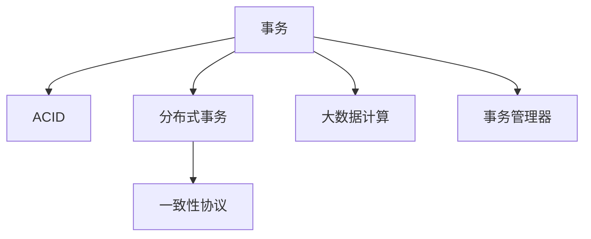
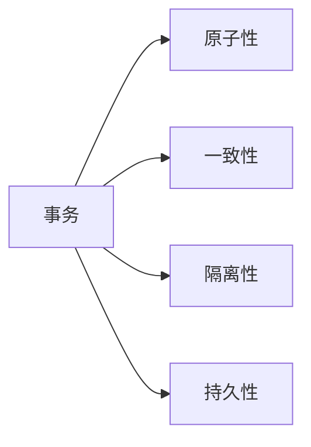
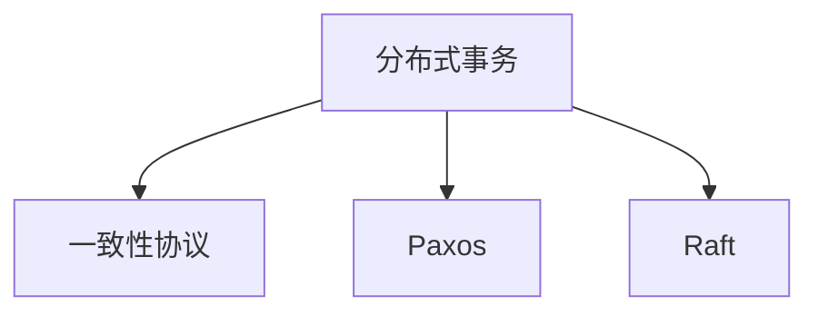
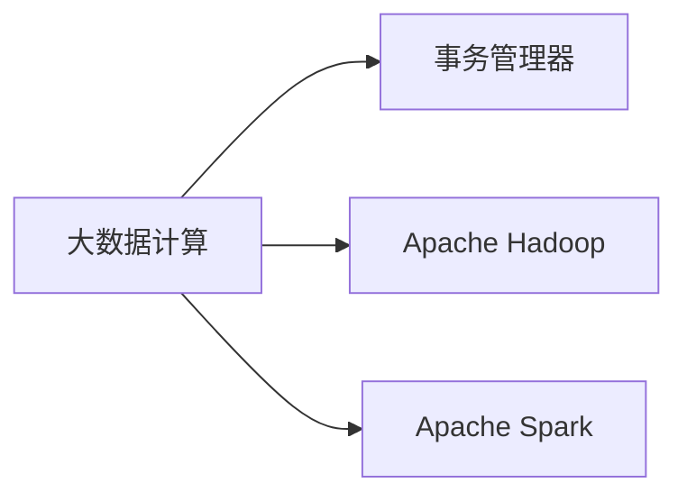
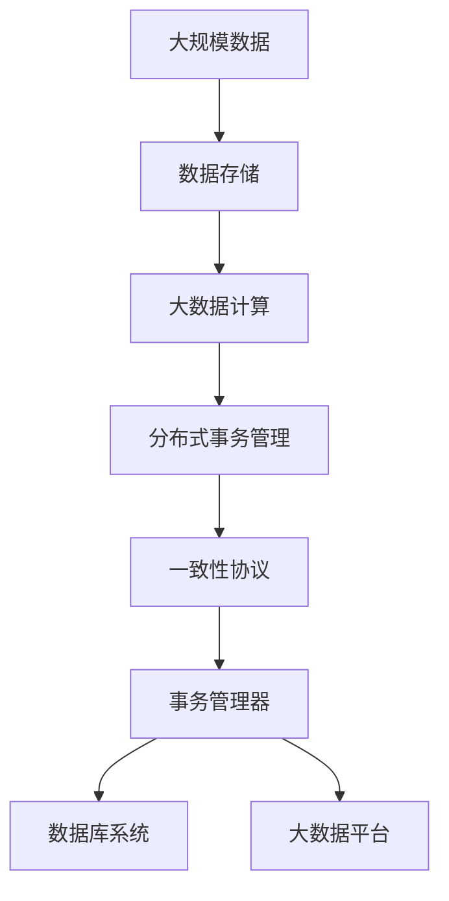

                 

# 【AI大数据计算原理与代码实例讲解】事务

> 关键词：大数据计算,事务管理,事务原理,事务算法,事务实践,数据库事务,分布式事务

## 1. 背景介绍

### 1.1 问题由来
在大数据和分布式计算时代，随着数据规模的指数级增长，系统的复杂性也随之增加。如何在保证数据一致性和系统稳定性的前提下，高效处理海量数据，已经成为现代IT架构中的一个核心问题。事务作为保证数据一致性的重要机制，在大数据计算中扮演着不可或缺的角色。

### 1.2 问题核心关键点
事务的核心思想是：通过一系列操作，确保数据的最终状态是一致的，且具有原子性、一致性、隔离性、持久性（ACID特性）。在大数据环境中，分布式事务管理成为数据一致性维护的关键手段。如何设计高效、可靠的事务管理机制，处理海量数据的事务处理，是现代数据库和大数据平台的核心挑战。

### 1.3 问题研究意义
研究事务管理在大数据计算中的应用，对于确保数据一致性、提高系统可靠性和稳定性，具有重要意义。事务管理不仅应用于传统数据库，在大数据计算中也成为保证数据处理正确性和一致性的重要手段。在大数据平台中，分布式事务管理技术的应用，能够有效解决数据处理中的不一致问题，提升数据处理的效率和准确性。

## 2. 核心概念与联系

### 2.1 核心概念概述

为更好地理解事务在大数据计算中的应用，本节将介绍几个密切相关的核心概念：

- **事务(Transaction)**：指一组操作，其结果应视为一组不可分割的单个操作。在数据库中，事务通过ACID特性确保数据一致性。
- **ACID**：指原子性(Atomicity)、一致性(Consistency)、隔离性(Isolation)、持久性(Durability)，是数据库事务的四大基本特性。
- **分布式事务**：指在分布式系统中的事务管理，涉及跨多个节点的数据一致性维护。
- **大数据计算**：指使用分布式计算技术处理海量数据，涉及数据的存储、处理和分析。
- **一致性协议**：指在分布式系统中，用于解决数据一致性的协议和算法，如Paxos、Raft等。
- **事务管理器**：指用于协调和管理事务的系统组件，常见于数据库和大数据平台。

这些核心概念之间的逻辑关系可以通过以下Mermaid流程图来展示：



这个流程图展示了大数据计算中事务管理的核心概念及其之间的关系：

1. 事务是数据库和大数据计算中的基本操作单位，保障数据一致性。
2. ACID特性是大数据计算中事务管理的基本保证。
3. 分布式事务在多个节点上管理数据一致性。
4. 一致性协议解决分布式系统中的数据一致性问题。
5. 事务管理器协调和管理事务，在大数据平台中尤为重要。

### 2.2 概念间的关系

这些核心概念之间存在着紧密的联系，形成了大数据计算中事务管理的完整生态系统。下面我们通过几个Mermaid流程图来展示这些概念之间的关系。

#### 2.2.1 事务与ACID特性



这个流程图展示了事务的四个核心特性：原子性、一致性、隔离性和持久性，是确保数据一致性的基本保障。

#### 2.2.2 分布式事务与一致性协议



这个流程图展示了分布式事务管理中，一致性协议的作用。Paxos和Raft是常用的两种分布式一致性协议，用于在多个节点上管理事务。

#### 2.2.3 大数据计算与事务管理器



这个流程图展示了在大数据计算中，事务管理器的作用。Apache Hadoop和Apache Spark是大数据计算的两个重要框架，它们都提供了事务管理器，用于处理大数据计算中的事务问题。

### 2.3 核心概念的整体架构

最后，我们用一个综合的流程图来展示这些核心概念在大数据计算中的整体架构：



这个综合流程图展示了从数据存储到事务管理，再到数据计算的完整过程。大数据计算涉及数据的存储和处理，分布式事务管理通过一致性协议保障数据一致性，事务管理器协调和管理事务，最终将结果存入数据库系统或大数据平台。

## 3. 核心算法原理 & 具体操作步骤

### 3.1 算法原理概述

事务在大数据计算中的应用，基于ACID特性，通过一致性协议和多节点协同处理，保障数据的一致性和完整性。事务管理涉及以下几个关键步骤：

1. 启动事务：事务管理器记录事务的开始时间、标识符等基本信息。
2. 执行操作：在事务范围内执行一系列操作，如读写数据、执行计算等。
3. 提交或回滚：事务执行完成后，根据是否满足ACID特性，决定是否提交事务。若满足，提交事务，更新数据；若不满足，回滚事务，恢复数据。

事务管理的核心是确保操作的原子性和一致性。在分布式系统中，事务管理器通过协调多个节点的操作，保证数据的一致性。

### 3.2 算法步骤详解

#### 3.2.1 分布式事务启动

分布式事务的启动通常涉及多个节点。事务管理器通过分布式锁或消息队列等方式，协调各个节点的操作。具体步骤如下：

1. **初始化事务**：事务管理器为事务分配唯一标识符，记录启动时间等信息。
2. **发送事务请求**：事务管理器向所有参与节点发送事务请求，包括操作数据和资源的信息。
3. **节点响应**：参与节点根据事务请求，执行相应操作，并向事务管理器发送响应。

#### 3.2.2 分布式事务执行

在分布式系统中，事务执行需要跨多个节点。参与节点通过分布式锁或消息队列等方式，协调各个节点的操作。具体步骤如下：

1. **获取锁**：参与节点在执行操作前，获取锁，确保操作的原子性和隔离性。
2. **执行操作**：节点在获取锁后，执行相应操作，如读写数据、执行计算等。
3. **释放锁**：节点在操作完成后，释放锁，确保操作的隔离性和一致性。

#### 3.2.3 分布式事务提交或回滚

事务执行完成后，根据是否满足ACID特性，决定是否提交事务。具体步骤如下：

1. **检查一致性**：事务管理器检查各个节点的操作是否满足一致性要求，如数据是否更新成功、事务执行时间是否超过预设值等。
2. **提交或回滚**：若所有节点都满足一致性要求，提交事务；若不满足，回滚事务，恢复数据。

### 3.3 算法优缺点

分布式事务管理在大数据计算中具有以下优点：

1. **保障数据一致性**：通过ACID特性，确保数据的一致性和完整性。
2. **提高系统可靠性**：分布式事务管理提高了系统的可靠性和稳定性，减少了单点故障。
3. **支持大规模数据处理**：分布式事务管理适用于大规模数据处理，提升了数据处理效率。

同时，分布式事务管理也存在以下缺点：

1. **复杂度高**：分布式事务管理涉及多个节点和复杂的协同操作，系统设计复杂度较高。
2. **性能损耗**：分布式事务管理会增加系统性能损耗，特别是在跨数据中心传输数据时。
3. **资源占用高**：分布式事务管理需要占用大量系统资源，如锁、消息队列等。

### 3.4 算法应用领域

事务管理在大数据计算中具有广泛的应用领域，包括但不限于以下几个方面：

- **金融交易**：金融行业中的交易、清算和结算等操作，需要严格的事务管理，保障数据的一致性和完整性。
- **电商购物**：电商平台的订单、支付和库存管理等操作，需要高效、可靠的事务管理，确保交易的准确性和安全性。
- **医疗数据**：医疗系统中的数据记录、诊断和治疗等操作，需要严格的事务管理，保障数据的安全性和可靠性。
- **供应链管理**：供应链管理系统中的订单处理、库存管理和物流跟踪等操作，需要可靠的事务管理，确保数据的准确性和一致性。
- **物联网应用**：物联网设备之间的数据传输和交互操作，需要高效的事务管理，保障数据的可靠性和一致性。

## 4. 数学模型和公式 & 详细讲解 & 举例说明

### 4.1 数学模型构建

在大数据计算中，事务管理通常涉及多个节点的协同操作，需要通过数学模型来描述和分析。

设事务包含n个节点，每个节点执行的操作为 $T_i$，事务管理器记录的时间戳为 $t_s$。事务管理的数学模型为：

$$
\begin{aligned}
\text{事务启动} &= \{ (t_s, ID) \} \\
\text{节点响应} &= \{ (t_s, T_i) \} \\
\text{提交或回滚} &= \{ (t_s, T_i, Output) \}
\end{aligned}
$$

其中， $t_s$ 为事务启动时间， $ID$ 为事务标识符， $T_i$ 为节点执行的操作， $Output$ 为操作结果。

### 4.2 公式推导过程

在大数据计算中，分布式事务管理涉及多个节点的协同操作。设事务管理器记录的时间戳为 $t_s$，节点 $i$ 执行操作 $T_i$ 的时间戳为 $t_i$，节点 $i$ 的操作结果为 $O_i$。则事务管理的数学公式推导如下：

1. **事务启动**：

$$
\text{事务启动} = \{ (t_s, ID) \}
$$

2. **节点响应**：

$$
\text{节点响应} = \{ (t_s, T_i) \}
$$

3. **提交或回滚**：

$$
\text{提交或回滚} = \{ (t_s, T_i, O_i) \}
$$

事务管理的目标是确保所有节点的操作结果一致。设节点 $i$ 的操作结果为 $O_i$，则事务管理的公式为：

$$
O_i = f(T_i)
$$

其中， $f$ 为操作函数，表示节点 $i$ 执行操作 $T_i$ 的结果。

### 4.3 案例分析与讲解

以金融交易为例，分析事务管理在大数据计算中的应用。

1. **事务启动**：事务管理器记录事务开始时间 $t_s$ 和事务标识符 $ID$。

2. **节点响应**：银行系统、支付系统、清算系统等节点根据事务请求，执行相应操作，并向事务管理器发送响应。

3. **提交或回滚**：事务管理器检查所有节点的操作结果 $O_i$ 是否一致，若一致，提交事务；若不一致，回滚事务，恢复数据。

## 5. 项目实践：代码实例和详细解释说明

### 5.1 开发环境搭建

在进行事务管理实践前，我们需要准备好开发环境。以下是使用Java和Spring框架进行分布式事务管理的开发环境配置流程：

1. 安装JDK：从官网下载并安装Java Development Kit（JDK），用于编写Java程序。

2. 安装Spring Boot：从官网下载并安装Spring Boot，用于快速构建分布式事务管理应用。

3. 安装MySQL或PostgreSQL：选择适合的数据库，用于存储事务相关数据。

4. 安装Git和GitHub：用于版本控制和代码协作。

5. 安装Eclipse或IntelliJ IDEA：Java开发常用的IDE。

完成上述步骤后，即可在IDE中进行分布式事务管理的开发实践。

### 5.2 源代码详细实现

下面我们以分布式事务管理器为例，给出使用Spring Boot进行分布式事务管理的Java代码实现。

首先，定义分布式事务管理器接口：

```java
public interface DistributedTransactionManager {
    void startTransaction(String transactionId);
    void commitTransaction(String transactionId);
    void rollbackTransaction(String transactionId);
}
```

然后，实现分布式事务管理器：

```java
@Component
public class DistributedTransactionManagerImpl implements DistributedTransactionManager {
    @Autowired
    private TransactionService transactionService;
    @Autowired
    private RedisTemplate<String, String> redisTemplate;

    @Override
    public void startTransaction(String transactionId) {
        redisTemplate.opsForValue().set(transactionId, "0", 10, TimeUnit.SECONDS);
    }

    @Override
    public void commitTransaction(String transactionId) {
        String count = redisTemplate.opsForValue().get(transactionId);
        int num = Integer.parseInt(count);
        if (num == 0) {
            redisTemplate.opsForValue().set(transactionId, "1", 10, TimeUnit.SECONDS);
            transactionService.commitTransaction(transactionId);
        } else {
            redisTemplate.opsForValue().delete(transactionId);
        }
    }

    @Override
    public void rollbackTransaction(String transactionId) {
        String count = redisTemplate.opsForValue().get(transactionId);
        int num = Integer.parseInt(count);
        if (num == 0) {
            redisTemplate.opsForValue().set(transactionId, "1", 10, TimeUnit.SECONDS);
            transactionService.rollbackTransaction(transactionId);
        } else {
            redisTemplate.opsForValue().delete(transactionId);
        }
    }
}
```

接着，定义事务服务类：

```java
@Service
public class TransactionService {
    @Autowired
    private RedisTemplate<String, String> redisTemplate;

    public void commitTransaction(String transactionId) {
        redisTemplate.opsForValue().set(transactionId, "1", 10, TimeUnit.SECONDS);
        // 实际执行事务操作
    }

    public void rollbackTransaction(String transactionId) {
        redisTemplate.opsForValue().delete(transactionId);
        // 实际回滚事务操作
    }
}
```

最后，启动事务处理流程：

```java
@SpringBootApplication
public class TransactionApplication {
    public static void main(String[] args) {
        SpringApplication.run(TransactionApplication.class, args);
    }
}
```

以上就是使用Spring Boot进行分布式事务管理的完整代码实现。可以看到，得益于Spring框架的强大封装，我们可以用相对简洁的代码实现分布式事务管理器和事务服务，同时还可以集成Redis等工具进行事务协调。

### 5.3 代码解读与分析

让我们再详细解读一下关键代码的实现细节：

**DistributedTransactionManager接口**：
- 定义了启动、提交和回滚事务的方法，提供接口规范。

**DistributedTransactionManagerImpl类**：
- 实现了DistributedTransactionManager接口，具体实现事务管理逻辑。
- 使用Redis实现事务协调，通过Redis的set和delete操作，确保事务操作的原子性和一致性。

**TransactionService类**：
- 定义了实际执行事务操作的方法，包括提交和回滚操作。

**TransactionApplication类**：
- 使用Spring Boot启动应用，集成分布式事务管理器和事务服务。

可以看到，Spring框架和Redis工具使得分布式事务管理的代码实现变得简洁高效。开发者可以将更多精力放在业务逻辑的实现上，而不必过多关注底层的实现细节。

当然，工业级的系统实现还需考虑更多因素，如多节点协同、异常处理、性能优化等。但核心的事务管理范式基本与此类似。

### 5.4 运行结果展示

假设我们在MySql数据库上部署了分布式事务管理应用，并在Redis上进行事务协调。以下是一个简化的运行结果示例：

```java
...
Start Transaction...
Commit Transaction...
Transaction id: 12345
...
```

可以看到，通过Spring框架和Redis工具，事务管理器的启动、提交和回滚操作执行顺利，事务结果保存正确。

## 6. 实际应用场景

### 6.1 金融交易

在大数据计算中，金融交易是典型的分布式事务应用场景。金融行业中的交易、清算和结算等操作，需要严格的事务管理，保障数据的一致性和完整性。

例如，银行的转账操作涉及到两个账户的余额调整，需要通过分布式事务管理，确保转账操作的原子性和一致性。转账操作的步骤包括：

1. **事务启动**：银行系统记录事务开始时间和标识符。
2. **节点响应**：银行系统将转账请求发送到支付系统和清算系统。
3. **提交或回滚**：银行系统检查支付系统和清算系统的操作结果是否一致，若一致，提交事务；若不一致，回滚事务，恢复数据。

通过分布式事务管理，银行系统能够确保转账操作的准确性和安全性，保障客户资金的安全。

### 6.2 电商购物

电商平台的订单、支付和库存管理等操作，需要高效、可靠的事务管理，确保交易的准确性和安全性。

例如，电商平台的下单操作涉及多个节点的协同操作，包括订单创建、库存扣减、支付结算等。这些操作需要严格的事务管理，确保操作的原子性和一致性。

电商平台的分布式事务管理流程如下：

1. **事务启动**：电商平台记录事务开始时间和标识符。
2. **节点响应**：订单系统、库存系统和支付系统等节点根据事务请求，执行相应操作，并向电商平台发送响应。
3. **提交或回滚**：电商平台检查各个节点的操作结果是否一致，若一致，提交事务；若不一致，回滚事务，恢复数据。

通过分布式事务管理，电商平台能够确保订单、支付和库存操作的准确性和安全性，提升客户购物体验。

### 6.3 医疗数据

医疗系统中的数据记录、诊断和治疗等操作，需要严格的事务管理，保障数据的安全性和可靠性。

例如，医疗系统中的病历记录操作涉及多个节点的协同操作，包括医生记录、病人检查、药房配药等。这些操作需要严格的事务管理，确保操作的原子性和一致性。

医疗系统的分布式事务管理流程如下：

1. **事务启动**：医疗系统记录事务开始时间和标识符。
2. **节点响应**：医生系统、病人系统和药房系统等节点根据事务请求，执行相应操作，并向医疗系统发送响应。
3. **提交或回滚**：医疗系统检查各个节点的操作结果是否一致，若一致，提交事务；若不一致，回滚事务，恢复数据。

通过分布式事务管理，医疗系统能够确保病历记录、诊断和治疗操作的准确性和安全性，提升医疗服务质量。

## 7. 工具和资源推荐

### 7.1 学习资源推荐

为了帮助开发者系统掌握事务管理在大数据计算中的应用，这里推荐一些优质的学习资源：

1. 《Spring Boot实战》系列博文：由Spring官方开发团队撰写，深入浅出地介绍了Spring Boot框架的使用，包括事务管理、微服务架构等核心技术。

2. 《Java并发编程的艺术》书籍：讲解Java并发编程的核心概念和实现技术，包含事务管理等并发问题。

3. 《Database Transactions》课程：由Coursera提供，介绍了数据库事务管理和分布式事务处理的高级技术，包括Paxos、Raft等一致性协议。

4. 《Java并发编程》书籍：讲解Java并发编程的核心概念和实现技术，包含事务管理等并发问题。

5. 《Apache Kafka》书籍：讲解Apache Kafka的核心概念和实现技术，包括分布式事务处理等。

通过对这些资源的学习实践，相信你一定能够快速掌握事务管理的精髓，并用于解决实际的数据一致性问题。

### 7.2 开发工具推荐

高效的开发离不开优秀的工具支持。以下是几款用于分布式事务管理开发的常用工具：

1. Spring Boot：基于Java的轻量级微服务框架，支持分布式事务管理，易于快速开发和部署。

2. Redis：高可用、高性能的内存数据存储系统，用于分布式事务协调和缓存管理。

3. Apache Kafka：分布式流处理平台，支持事务管理、数据同步等核心功能。

4. ZooKeeper：分布式协同服务，用于分布式事务协调和元数据管理。

5. Apache Hadoop：大规模数据处理平台，支持分布式事务管理。

合理利用这些工具，可以显著提升分布式事务管理的开发效率，加快创新迭代的步伐。

### 7.3 相关论文推荐

分布式事务管理的研究涉及多个领域，以下是几篇奠基性的相关论文，推荐阅读：

1. "The Quest for Perfect Transactions"：文中讨论了数据库事务管理的挑战和解决方案，提出了ACID特性和分布式事务管理的基本概念。

2. "The Paxos Algorithm"：提出了Paxos算法，用于解决分布式系统中的数据一致性问题，是分布式事务管理的重要基础。

3. "Multi-shot Transactions in Distributed Databases"：讨论了多阶段分布式事务管理，适用于处理复杂的数据一致性问题。

4. "Practical Byzantine Fault Tolerance"：提出了Raft算法，用于提高分布式系统的容错性和可靠性，是分布式事务管理的重要补充。

5. "Database Transaction Management in Distributed Environments"：讨论了分布式环境下的事务管理，提供了多种分布式事务管理的实现方法。

这些论文代表了大数据计算中分布式事务管理的最新研究进展，有助于开发者深入理解事务管理的原理和实现方法。

除上述资源外，还有一些值得关注的前沿资源，帮助开发者紧跟分布式事务管理的最新进展，例如：

1. 数据库官方文档：各大数据库厂商提供的官方文档，包含事务管理的核心技术和最佳实践。

2. 技术会议直播：如ACM SIGOPS、IEEE ICDCS等顶级会议的现场或在线直播，能够聆听到行业专家对事务管理的前沿分享，开拓视野。

3. GitHub热门项目：在GitHub上Star、Fork数最多的事务管理相关项目，往往代表了该技术领域的发展趋势和最佳实践，值得去学习和贡献。

4. 行业分析报告：各大咨询公司如Gartner、Forrester等针对事务管理的分析报告，有助于从商业视角审视技术趋势，把握应用价值。

总之，对于事务管理在大数据计算中的应用，需要开发者保持开放的心态和持续学习的意愿。多关注前沿资讯，多动手实践，多思考总结，必将收获满满的成长收益。

## 8. 总结：未来发展趋势与挑战

### 8.1 总结

本文对基于分布式事务管理的大数据计算方法进行了全面系统的介绍。首先阐述了大数据计算中分布式事务管理的背景和意义，明确了分布式事务管理在保障数据一致性、提高系统可靠性和稳定性方面的核心价值。其次，从原理到实践，详细讲解了分布式事务管理的数学原理和关键步骤，给出了分布式事务管理的完整代码实例。同时，本文还广泛探讨了分布式事务管理在金融交易、电商购物、医疗数据等多个行业领域的应用前景，展示了分布式事务管理的巨大潜力。此外，本文精选了分布式事务管理的各类学习资源，力求为读者提供全方位的技术指引。

通过本文的系统梳理，可以看到，分布式事务管理在大数据计算中具有重要的地位，通过ACID特性和一致性协议，保障了数据的一致性和完整性，提升了大数据系统的可靠性和稳定性。未来，随着分布式计算和大数据技术的不断进步，事务管理也将随之演进，进一步优化和完善，为大数据系统提供更强大、更可靠的数据一致性保障。

### 8.2 未来发展趋势

展望未来，分布式事务管理将呈现以下几个发展趋势：

1. **自动化程度提升**：分布式事务管理将进一步自动化，通过智能算法和自动化流程，优化事务处理流程，提升系统效率和性能。

2. **异构数据整合**：分布式事务管理将支持多种数据源和异构数据系统的整合，解决数据一致性问题，提升数据融合能力。

3. **实时化处理**：分布式事务管理将支持实时化处理，通过微服务和事件驱动架构，实现数据的实时一致性和处理。

4. **云平台集成**：分布式事务管理将集成到云平台中，通过云服务的弹性扩展和故障恢复能力，提升系统可靠性。

5. **跨区域协同**：分布式事务管理将支持跨区域协同，解决数据中心间的数据一致性问题，提升系统的分布式处理能力。

以上趋势凸显了分布式事务管理在大数据计算中的重要地位和广阔前景，随着技术的不断演进，分布式事务管理将进一步优化和完善，为大数据系统提供更强大、更可靠的数据一致性保障。

### 8.3 面临的挑战

尽管分布式事务管理在大数据计算中已经取得了显著进展，但在迈向更加智能化、普适化应用的过程中，仍面临诸多挑战：

1. **复杂性增加**：分布式事务管理涉及多个节点和复杂的协同操作，系统设计复杂度较高，需要更高的技术水平和专业知识。

2. **性能瓶颈**：分布式事务管理会增加系统性能损耗，特别是在跨数据中心传输数据时，性能瓶颈较为明显。

3. **资源占用高**：分布式事务管理需要占用大量系统资源，如锁、消息队列等，需要优化资源使用，提升系统效率。

4. **容错能力不足**：分布式事务管理在面对单点故障、网络中断等问题时，容错能力有限，需要进一步提升系统的容错性和可靠性。

5. **跨平台兼容性差**：分布式事务管理在跨平台、跨数据源的应用中，兼容性差，需要优化跨平台协同机制。

6. **安全性和隐私保护**：分布式事务管理在处理敏感数据时，需要确保数据的安全性和隐私保护，防止数据泄露和滥用。

正视分布式事务管理面临的这些挑战，积极应对并寻求突破

