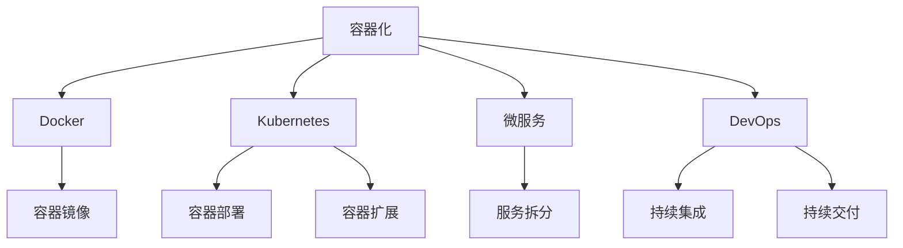
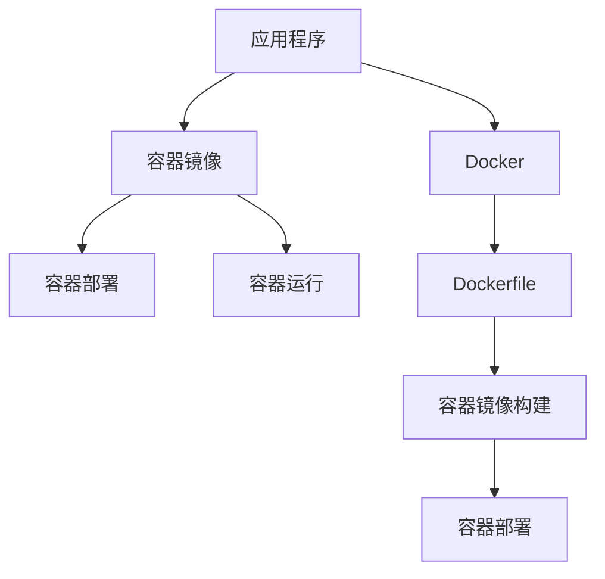
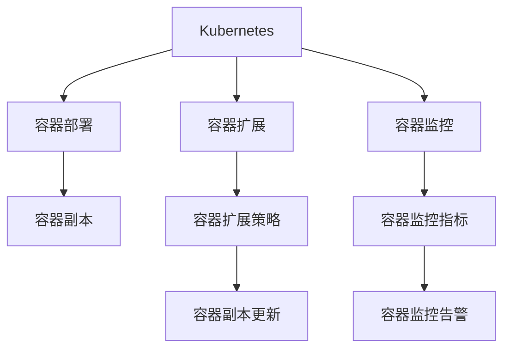
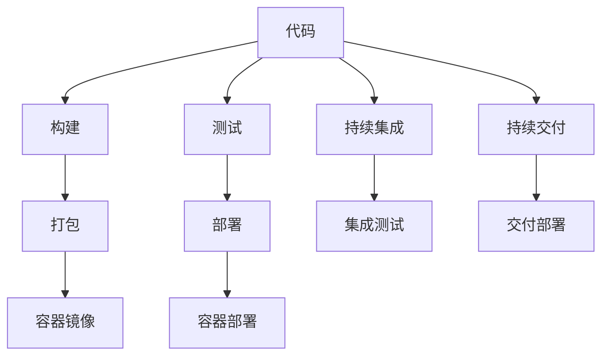
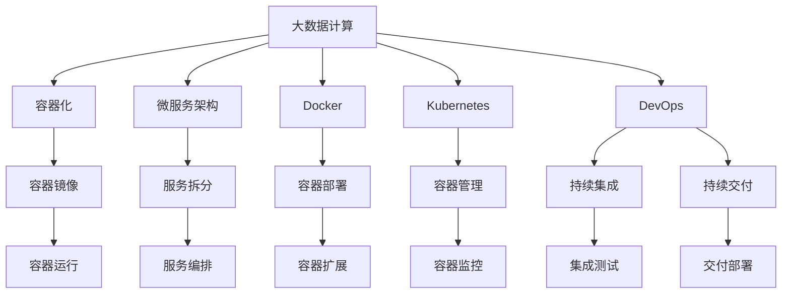

                 

# 【AI大数据计算原理与代码实例讲解】容器

> 关键词：容器化、Docker、Kubernetes、微服务、DevOps、持续集成持续部署(CI/CD)

## 1. 背景介绍

### 1.1 问题由来
在大数据时代，应用程序的复杂度和规模不断增大，分布式计算系统变得越来越普遍。如何高效、稳定地管理和部署这些系统，成为了一个重要的挑战。容器技术应运而生，通过隔离和抽象底层硬件，使得应用程序能够在异构环境中部署和运行，极大地简化了系统的管理和维护。

随着容器技术的发展，越来越多的企业开始采用容器化技术，以提高系统的灵活性和扩展性。然而，随着容器数量的增加，如何有效地管理和调度这些容器，成为了一个亟待解决的问题。此时，Kubernetes应运而生，它是一个开源的容器编排系统，能够自动化管理容器的部署、扩展、更新等生命周期管理任务，成为容器生态中的核心组件。

### 1.2 问题核心关键点
容器化和Kubernetes技术的发展，极大地提升了应用程序的部署效率和管理灵活性。然而，实现高效、稳定的容器化部署和管理，仍然需要系统性地理解和掌握其核心概念和原理。

容器技术涉及的核心概念包括：
- **容器化**：将应用程序及其依赖打包到容器中，使得应用程序能够在异构环境中稳定运行。
- **Docker**：一个开源的容器引擎，提供了一种简单、高效的方式来实现容器化。
- **Kubernetes**：一个开源的容器编排系统，用于自动化管理容器部署、扩展、更新等任务。
- **微服务架构**：一种架构风格，将应用程序拆分成多个小型、独立的服务，每个服务只关注单一职责。
- **DevOps**：一种文化、流程和工具组合，旨在缩短软件从开发到交付的时间，提升系统稳定性和可靠性。

这些概念之间的联系可以概括为：容器化技术为微服务架构的实现提供了基础，而Docker和Kubernetes则分别解决了容器部署和管理的难题。DevOps文化则确保了系统的持续集成和持续交付，从而提升系统的稳定性和可靠性。

## 2. 核心概念与联系

### 2.1 核心概念概述

为更好地理解容器化和Kubernetes技术，本节将介绍几个密切相关的核心概念：

- **容器化**：通过将应用程序和其依赖打包到容器中，使得应用程序能够在异构环境中稳定运行。容器化技术简化了应用程序的部署和管理，提高了系统的灵活性和扩展性。

- **Docker**：一个开源的容器引擎，提供了一种简单、高效的方式来实现容器化。Docker将应用程序和其依赖打包到一个轻量级的、可移植的容器中，并通过Docker镜像来快速部署和扩展。

- **Kubernetes**：一个开源的容器编排系统，用于自动化管理容器部署、扩展、更新等任务。Kubernetes提供了丰富的API和工具，支持大规模容器集群的自动化管理和扩展。

- **微服务架构**：一种架构风格，将应用程序拆分成多个小型、独立的服务，每个服务只关注单一职责。微服务架构通过服务组合和编排，实现系统的灵活和可扩展性，降低了系统复杂性。

- **DevOps**：一种文化、流程和工具组合，旨在缩短软件从开发到交付的时间，提升系统稳定性和可靠性。DevOps文化强调持续集成、持续交付、自动化测试和监控，确保系统的快速迭代和高效交付。

这些核心概念之间的联系可以通过以下Mermaid流程图来展示：



这个流程图展示了容器化技术的基本原理及其与其他核心概念的联系：

1. 容器化技术为微服务架构的实现提供了基础，Docker提供了容器化的工具，Kubernetes则实现了容器的自动化部署和管理。
2. DevOps文化通过持续集成和持续交付，确保了系统的快速迭代和高效交付。
3. 微服务架构通过服务组合和编排，实现系统的灵活和可扩展性，降低了系统复杂性。

### 2.2 概念间的关系

这些核心概念之间存在着紧密的联系，形成了容器化和大数据计算的整体生态系统。下面我通过几个Mermaid流程图来展示这些概念之间的关系。

#### 2.2.1 容器化技术的实现



这个流程图展示了应用程序如何通过容器化技术进行部署和管理。应用程序首先通过Dockerfile构建容器镜像，然后通过Docker部署到服务器上运行。

#### 2.2.2 Kubernetes的集群管理



这个流程图展示了Kubernetes如何管理容器集群。Kubernetes能够自动化管理容器的部署、扩展和监控，通过容器副本和扩展策略来确保系统的稳定性和可靠性。

#### 2.2.3 DevOps的持续集成与持续交付



这个流程图展示了DevOps如何通过持续集成和持续交付来提升系统交付效率。持续集成将代码自动构建和测试，持续交付则通过自动化部署和监控，确保系统的快速迭代和高效交付。

### 2.3 核心概念的整体架构

最后，我们用一个综合的流程图来展示这些核心概念在大数据计算中的应用：



这个综合流程图展示了从大数据计算到容器化、微服务、Docker、Kubernetes和DevOps的完整流程。大数据计算通过容器化和微服务架构实现了系统的灵活和可扩展性，Docker和Kubernetes提供了容器化部署和管理的工具，DevOps文化则确保了系统的持续集成和持续交付。

## 3. 核心算法原理 & 具体操作步骤
### 3.1 算法原理概述

容器化和Kubernetes技术的核心算法原理，在于通过抽象和隔离底层硬件，实现应用程序的稳定部署和管理。其核心思想如下：

1. **容器化**：通过将应用程序及其依赖打包到容器中，使得应用程序能够在异构环境中稳定运行。容器化技术简化了应用程序的部署和管理，提高了系统的灵活性和扩展性。

2. **Docker**：Docker提供了一种简单、高效的方式来实现容器化。Docker通过构建镜像和运行容器，使得应用程序能够在异构环境中快速部署和扩展。

3. **Kubernetes**：Kubernetes提供了丰富的API和工具，用于自动化管理容器部署、扩展、更新等任务。Kubernetes通过容器编排和调度，实现了容器的自动化管理和扩展。

### 3.2 算法步骤详解

容器化和Kubernetes技术的核心算法步骤如下：

1. **容器镜像构建**：通过Dockerfile定义应用程序及其依赖，构建容器镜像。Dockerfile是用于构建容器的配置文件，定义了应用程序的构建过程和依赖环境。

2. **容器部署**：将容器镜像部署到Kubernetes集群中。Kubernetes通过Pod和Service来管理容器的部署和扩展。Pod是Kubernetes中最小的部署单元，包含一个或多个容器。Service用于定义Pod的访问策略和负载均衡。

3. **容器扩展**：通过Horizontal Pod Autoscaler(HPA)来自动扩展容器副本。HPA根据CPU使用率等指标自动调整Pod的副本数量，确保系统的稳定性和扩展性。

4. **容器监控**：通过Kubernetes集成的Prometheus和Grafana，对容器集群进行实时监控和可视化。Prometheus用于收集和存储监控数据，Grafana用于展示和分析监控数据。

5. **持续集成和持续交付**：通过Jenkins、GitLab等工具，实现代码的持续集成和持续交付。持续集成将代码自动构建和测试，持续交付则通过自动化部署和监控，确保系统的快速迭代和高效交付。

### 3.3 算法优缺点

容器化和Kubernetes技术的核心算法优点如下：

- **简化部署**：通过容器化技术，应用程序能够在异构环境中快速部署和扩展，简化了系统的管理和维护。

- **提高灵活性**：通过微服务架构和容器编排，系统能够灵活应对业务需求的变化，提高了系统的可扩展性和灵活性。

- **提升可靠性**：通过容器编排和自动扩展，系统能够在异常情况下快速恢复，提高了系统的稳定性和可靠性。

- **自动化管理**：通过Kubernetes的自动化管理工具，系统能够自动化部署、扩展和监控，减少了人工操作的复杂性和风险。

容器化和Kubernetes技术的核心算法缺点如下：

- **学习成本高**：容器化和Kubernetes技术涉及众多的概念和工具，学习成本较高。初学者需要花费较多的时间和精力来掌握这些技术。

- **复杂度增加**：容器化和Kubernetes技术虽然简化了系统部署和管理，但同时也增加了系统的复杂度。开发者需要理解容器的生命周期管理和容器编排的策略。

- **性能开销**：容器化和Kubernetes技术引入了额外的开销，如容器的启动和停止、监控和日志等。这些开销可能会影响系统的性能和效率。

- **资源限制**：容器化和Kubernetes技术对资源的限制较高，如CPU、内存和网络带宽等。开发者需要合理配置资源以满足系统的需求。

### 3.4 算法应用领域

容器化和Kubernetes技术在多个领域得到了广泛应用，包括但不限于以下领域：

- **云平台**：云平台通过容器化和Kubernetes技术，实现了应用程序的快速部署和扩展，提高了云平台的灵活性和可靠性。

- **金融行业**：金融行业通过容器化和Kubernetes技术，实现了高并发和高可用性，提高了系统的稳定性和可靠性。

- **互联网公司**：互联网公司通过容器化和Kubernetes技术，实现了系统的快速迭代和高效交付，提升了产品的竞争力和用户体验。

- **企业内部系统**：企业通过容器化和Kubernetes技术，实现了系统的灵活扩展和高效管理，提升了企业的IT管理效率。

## 4. 数学模型和公式 & 详细讲解 & 举例说明（备注：数学公式请使用latex格式，latex嵌入文中独立段落使用 $$，段落内使用 $)
### 4.1 数学模型构建

容器化和Kubernetes技术的核心算法可以抽象为以下数学模型：

设应用程序依赖集为$D$，容器化后的镜像为$M_D$，容器编排系统为$K$。定义容器化的数学模型如下：

$$
M_D = f(D)
$$

其中$f$为容器化函数，将应用程序依赖$D$转化为容器镜像$M_D$。

定义容器编排系统的数学模型如下：

$$
K = g(M_D)
$$

其中$g$为容器编排函数，将容器镜像$M_D$转化为容器编排系统$K$。

### 4.2 公式推导过程

根据上述数学模型，可以推导出以下公式：

$$
K = g(f(D))
$$

其中$g$为容器编排函数，$f$为容器化函数。这意味着，通过容器化技术将应用程序依赖转化为容器镜像，然后再通过容器编排系统将容器镜像转化为容器集群，实现了应用程序的自动化部署和管理。

### 4.3 案例分析与讲解

以一个简单的电子商务网站为例，分析其容器化和Kubernetes技术的部署过程。

1. **应用程序依赖**：电子商务网站依赖多个组件，如Web服务器、数据库、消息队列等。

2. **容器化**：通过Dockerfile定义Web服务器、数据库、消息队列等组件的构建过程和依赖环境，构建容器镜像。

3. **容器编排**：通过Kubernetes的Deployment和Service定义Web服务器、数据库、消息队列等组件的部署和访问策略。

4. **容器扩展**：通过Horizontal Pod Autoscaler(HPA)自动调整Web服务器Pod的副本数量，确保系统的稳定性和扩展性。

5. **容器监控**：通过Prometheus和Grafana对Web服务器、数据库、消息队列等组件进行实时监控和可视化。

## 5. 项目实践：代码实例和详细解释说明
### 5.1 开发环境搭建

在进行容器化实践前，我们需要准备好开发环境。以下是使用Docker和Kubernetes进行容器化部署的环境配置流程：

1. 安装Docker：从官网下载并安装Docker，用于构建和部署容器镜像。

2. 安装Kubernetes：从官网下载并安装Kubernetes，用于容器编排和管理。

3. 安装Kubectl：从官网下载并安装Kubectl，用于管理Kubernetes集群。

4. 配置Docker和Kubernetes：通过Docker配置文件和Kubernetes配置文件，配置Docker和Kubernetes环境。

### 5.2 源代码详细实现

这里以一个简单的Web服务器为例，展示如何使用Docker和Kubernetes进行容器化部署。

首先，编写Dockerfile文件，定义Web服务器的构建过程和依赖环境：

```Dockerfile
# 使用Docker的最新版本
FROM nginx:latest

# 将应用代码拷贝到容器
COPY . /usr/share/nginx/html

# 将Nginx配置文件拷贝到容器
COPY nginx.conf /etc/nginx/nginx.conf

# 定义暴露的端口
EXPOSE 80

# 定义启动命令
CMD ["nginx", "-g", "daemon off;"]
```

然后，在Dockerfile所在目录下，创建一个包含Web服务器代码的目录，命名为“webapp”：

```bash
mkdir webapp
cd webapp
vi index.html
```

接下来，构建Docker镜像：

```bash
docker build -t my-webapp .
```

最后，使用Kubernetes部署Web服务器：

1. 创建Deployment：

```yaml
apiVersion: apps/v1
kind: Deployment
metadata:
  name: my-webapp-deployment
spec:
  replicas: 3
  selector:
    matchLabels:
      app: my-webapp
  template:
    metadata:
      labels:
        app: my-webapp
    spec:
      containers:
      - name: my-webapp-container
        image: my-webapp:latest
        ports:
        - containerPort: 80
```

2. 创建Service：

```yaml
apiVersion: v1
kind: Service
metadata:
  name: my-webapp-service
spec:
  selector:
    app: my-webapp
  ports:
    - protocol: TCP
      port: 80
      targetPort: 80
  type: LoadBalancer
```

### 5.3 代码解读与分析

让我们再详细解读一下关键代码的实现细节：

**Dockerfile**：
- 定义了Web服务器的构建过程和依赖环境，包括使用最新版本的Nginx作为基础镜像，拷贝Web服务器代码和Nginx配置文件，暴露80端口，并定义了启动命令。

**Deployment配置文件**：
- 定义了Web服务器的Deployment，包括副本数量、选择器、Pod模板等。

**Service配置文件**：
- 定义了Web服务器的Service，包括选择器、端口映射、负载均衡等。

### 5.4 运行结果展示

假设我们在一个Kubernetes集群上成功部署了Web服务器，可以通过Kubectl查看容器的运行状态：

```bash
kubectl get pods
```

如果看到类似于以下输出，说明Web服务器容器正在运行：

```
NAME                        READY   STATUS    RESTARTS   AGE
my-webapp-deployment-7f9v8   1/1     Running   0          2m
my-webapp-deployment-7f9v9   1/1     Running   0          2m
my-webapp-deployment-7f9v6   1/1     Running   0          2m
```

此时，可以通过浏览器访问Web服务器，查看Web页面是否正常显示。

## 6. 实际应用场景
### 6.1 智能运维平台

容器化和Kubernetes技术在智能运维平台中的应用，极大地提升了系统的稳定性和可扩展性。传统的运维方式需要大量的手工操作和监控，容易出错且效率低下。通过容器化技术，可以将运维任务封装成多个独立的容器，通过Kubernetes进行自动化管理和扩展。

例如，可以创建多个容器分别处理日志、监控、报警等任务，通过Service和Deployment进行负载均衡和自动扩展。这样可以大大简化运维流程，提高系统的稳定性和可靠性。

### 6.2 大数据分析平台

大数据分析平台通过容器化和Kubernetes技术，实现了数据的快速部署和扩展，提高了大数据分析的效率和灵活性。通过容器化技术，可以将大数据分析任务封装成多个独立的容器，通过Kubernetes进行自动化管理和扩展。

例如，可以创建多个容器分别处理数据采集、数据清洗、数据处理和数据分析等任务，通过Service和Deployment进行负载均衡和自动扩展。这样可以大大简化大数据分析流程，提高数据处理效率和系统可靠性。

### 6.3 实时数据流平台

实时数据流平台通过容器化和Kubernetes技术，实现了实时数据的快速部署和扩展，提高了实时数据的处理效率和灵活性。通过容器化技术，可以将实时数据处理任务封装成多个独立的容器，通过Kubernetes进行自动化管理和扩展。

例如，可以创建多个容器分别处理实时数据采集、实时数据存储、实时数据处理和实时数据展示等任务，通过Service和Deployment进行负载均衡和自动扩展。这样可以大大简化实时数据处理流程，提高实时数据处理效率和系统可靠性。

### 6.4 未来应用展望

随着容器化和Kubernetes技术的不断发展，未来将在更多领域得到应用，为各种业务系统带来变革性影响。

在智慧城市治理中，容器化和Kubernetes技术可以应用于城市事件监测、舆情分析、应急指挥等环节，提高城市管理的自动化和智能化水平，构建更安全、高效的未来城市。

在智能制造领域，容器化和Kubernetes技术可以应用于工业互联网平台，实现工业设备的快速部署和扩展，提高工业生产的效率和灵活性。

在金融行业，容器化和Kubernetes技术可以应用于金融大数据分析平台，实现金融数据的快速部署和扩展，提高金融数据的处理效率和系统可靠性。

总之，容器化和Kubernetes技术的发展前景广阔，将推动各个行业的数字化转型，为社会经济的发展注入新的动力。

## 7. 工具和资源推荐
### 7.1 学习资源推荐

为了帮助开发者系统掌握容器化和Kubernetes技术，这里推荐一些优质的学习资源：

1. **《Kubernetes实战》**：这是一本深入浅出地讲解Kubernetes技术的书籍，从Kubernetes基础到高级应用，涵盖了Kubernetes的方方面面。

2. **Docker官方文档**：Docker官方提供了丰富的文档和教程，包括Docker的基本概念、容器化部署和容器编排等内容。

3. **Kubernetes官方文档**：Kubernetes官方提供了详细的文档和教程，包括Kubernetes的基础概念、部署和管理等内容。

4. **Kubernetes中文社区**：Kubernetes中文社区提供了大量的Kubernetes学习资源，包括Kubernetes中文文档、代码示例和实战案例等内容。

5. **DevOps2019大会**：DevOps2019大会汇集了全球DevOps领域的专家和爱好者，分享了最新的DevOps技术和实践经验，是学习DevOps技术的绝佳平台。

通过这些学习资源，相信你一定能够快速掌握容器化和Kubernetes技术的精髓，并用于解决实际的业务问题。

### 7.2 开发工具推荐

高效的开发离不开优秀的工具支持。以下是几款用于容器化和Kubernetes开发的常用工具：

1. **Docker**：Docker是一个开源的容器引擎，提供了一种简单、高效的方式来实现容器化。Docker通过构建镜像和运行容器，使得应用程序能够在异构环境中快速部署和扩展。

2. **Kubernetes**：Kubernetes是一个开源的容器编排系统，用于自动化管理容器部署、扩展、更新等任务。Kubernetes提供了丰富的API和工具，支持大规模容器集群的自动化管理和扩展。

3. **Kubectl**：Kubectl是Kubernetes的命令行工具，用于管理Kubernetes集群。Kubectl支持丰富的操作命令，方便用户管理和监控Kubernetes集群。

4. **Jenkins**：Jenkins是一个开源的自动化持续集成工具，用于自动化构建、测试和部署应用程序。Jenkins支持与Docker和Kubernetes的无缝集成，方便用户实现持续集成和持续交付。

5. **Prometheus**：Prometheus是一个开源的监控系统，用于收集和存储监控数据，并支持实时告警和可视化展示。Prometheus通过Grafana等工具，方便用户对系统进行监控和分析。

6. **GitLab**：GitLab是一个开源的代码管理和DevOps平台，支持代码仓库、持续集成、持续交付和自动化运维等功能。GitLab与Docker和Kubernetes的无缝集成，方便用户实现全面的DevOps流程。

合理利用这些工具，可以显著提升容器化和Kubernetes开发的效率，加快创新迭代的步伐。

### 7.3 相关论文推荐

容器化和Kubernetes技术的发展离不开学界的持续研究。以下是几篇奠基性的相关论文，推荐阅读：

1. **《Container: A Linear Hierarchy of Resource Abstraction》**：这篇论文是Docker项目的开源文档，详细介绍了Docker容器的基本概念和实现原理。

2. **《Kubernetes: Scaling Containerized Applications》**：这篇论文是Kubernetes项目的开源文档，详细介绍了Kubernetes集群的部署和管理方法。

3. **《Continuous Deployment with Docker》**：这篇论文介绍如何使用Docker实现持续集成和持续交付，是容器化与DevOps结合的经典案例。

4. **《A Comprehensive Study of Kubernetes Cluster Operations》**：这篇论文深入研究了Kubernetes集群的自动化操作，提出了许多集群管理的最佳实践。

5. **《Scalable and Reliable Container Management with Kubernetes》**：这篇论文探讨了Kubernetes集群的扩展性和可靠性，提出了多种集群管理策略。

这些论文代表了大规模容器化和Kubernetes技术的发展脉络。通过学习这些前沿成果，可以帮助研究者把握学科前进方向，激发更多的创新灵感。

除上述资源外，还有一些值得关注的前沿资源，帮助开发者紧跟容器化和Kubernetes技术的最新进展，例如：

1. **Kubernetes社区博客**：Kubernetes社区博客汇集了全球Kubernetes领域的专家和爱好者，分享了最新的Kubernetes技术和实践经验，是学习Kubernetes技术的最佳平台。

2. **DevOps年度报告**：DevOps年度报告汇集了全球DevOps领域的最新研究进展和最佳实践，是学习DevOps技术的绝佳资源。

3. **Docker Swarm官方文档**：Docker Swarm是Docker提供的容器编排工具，用于管理和扩展Docker容器集群。Docker Swarm官方文档详细介绍了Docker Swarm的基础概念和实现原理。

4. **Kubernetes扩展插件**：Kubernetes社区提供了大量的扩展插件，用于增强Kubernetes集群的功能和性能。通过学习这些插件的实现，可以更好地掌握Kubernetes技术的细节和最佳实践。

总之，对于容器化和Kubernetes技术的学习和实践，需要开发者保持开放的心态和持续学习的意愿。多关注前沿资讯，多动手实践，多思考总结，必将收获满满的成长收益。

## 8. 总结：未来发展趋势与挑战
### 8.1 总结

本文对容器化和Kubernetes技术进行了全面系统的介绍。首先阐述了容器化和Kubernetes技术的研究背景和意义，明确了这些技术在简化应用程序部署、提高系统灵活性和扩展性方面的独特价值。其次，从原理到实践，详细讲解了容器化和Kubernetes技术的核心算法和具体操作步骤，给出了容器化部署的完整代码实例。同时，本文还广泛探讨了容器化技术在多个行业领域的应用前景，展示了容器化技术的应用潜力。

通过本文的系统梳理，可以看到，容器化和Kubernetes技术正在成为云计算和分布式计算的核心范式，极大地提升了系统的部署效率和管理灵活性。未来的容器化和Kubernetes技术将继续发展，进一步推动各行各业的数字化转型。

### 8.2 未来发展趋势

展望未来，容器化和Kubernetes技术将呈现以下几个发展趋势：

1. **Kubernetes扩展**：Kubernetes将在更多的领域得到应用，如边缘计算、物联网、人工智能等。容器化和Kubernetes技术的生态系统将不断扩展，涵盖更多的应用场景。

2. **容器编排优化**：容器编排技术将不断优化，实现更高效、更灵活的容器管理。未来将出现更多先进的调度算法和资源管理策略，提高系统的稳定性和扩展性。

3. **容器编排智能化**：容器编排将引入更多的智能化技术，如机器学习、自动化运维等。通过智能化管理，容器编排系统将能够自动调整资源配置，优化系统性能。

4. **DevOps文化普及**：DevOps文化将继续推广，实现更快速、更高效的持续集成和持续交付。DevOps文化将成为企业IT管理的标准，提升企业的IT管理水平。

5. **跨平台容器化**：容器化和Kubernetes技术将向更多平台扩展，如边缘计算平台、嵌入式系统等。跨平台的容器化技术将使得容器应用更加通用和灵活。

### 8.3 面临的挑战

尽管容器化和Kubernetes技术已经取得了显著的成就，但在迈向更加智能化

