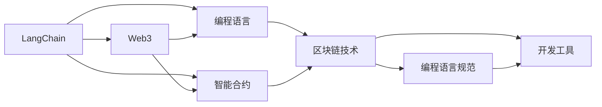
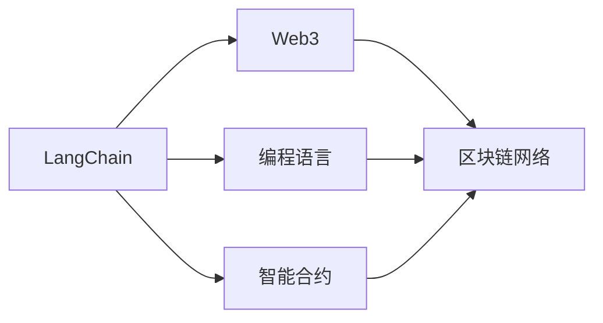
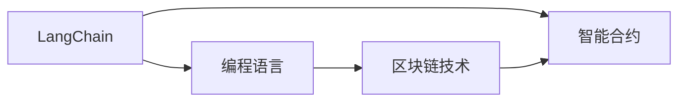
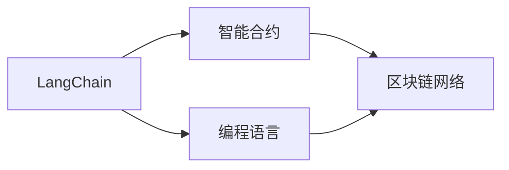
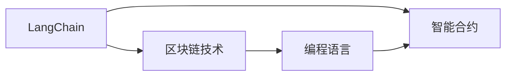
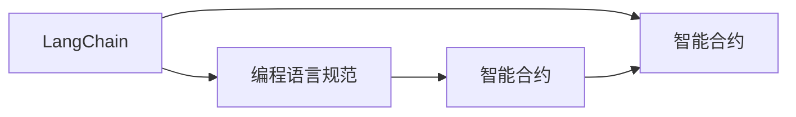
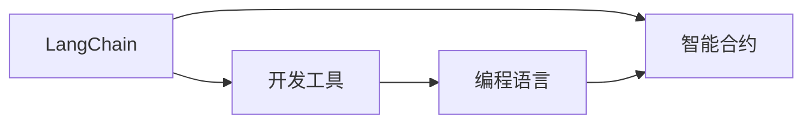
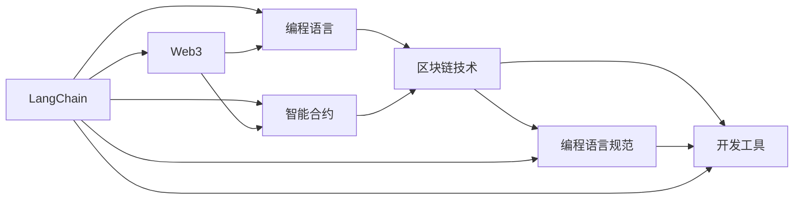

                 

# 【LangChain编程：从入门到实践】LangChain的未来展望

> 关键词：LangChain, Web3, 编程语言, 区块链技术, 智能合约, 未来展望

## 1. 背景介绍

### 1.1 问题由来
近年来，区块链技术和大规模分布式计算能力的提升，使得区块链网络可以承载更丰富的功能，尤其是NFT、DeFi、DAO等应用层面的创新不断涌现。而代码的可移植性和灵活性，使得区块链网络成为理想的软件发布平台，吸引越来越多的开发者和企业参与。为了支持区块链应用开发，众多开发者和研究机构开始探索如何通过编程语言，使区块链网络承载更丰富、更高效的软件逻辑，并在Web3生态中广泛应用。

LangChain作为一个编程语言和智能合约框架，旨在利用Web3的强大潜力，促进大规模开发者在区块链网络上的协作开发和分布式计算能力。通过结合以太坊、Solidity、Go等主流开发工具， LangChain项目的目标是实现代码的可移植性和易用性，推动区块链技术在更多领域的应用。

### 1.2 问题核心关键点
LangChain的提出，旨在解决区块链网络编程的普遍痛点，包括：
1. 代码复用性差。不同区块链网络的编程语言和智能合约框架差异巨大，开发者难以实现代码的跨链复用。
2. 开发效率低下。区块链网络的复杂性和共识机制，增加了开发和测试的难度，导致开发周期变长。
3. 智能合约漏洞频出。缺乏有效的编程语言规范和开发工具，智能合约安全问题频发，且难以追踪责任。
4. 生态系统碎片化。各个区块链网络自成生态，导致工具、标准、社区等碎片化，难以统一。

### 1.3 问题研究意义
研究LangChain的未来展望，对于区块链编程语言和智能合约开发生态的建设，具有重要意义：

1. 提高代码复用性。通过统一编程语言和框架，提高区块链代码的复用性和跨链互操作性，降低开发成本。
2. 提升开发效率。通过优化编程语言和开发工具，提升智能合约的开发和测试效率，加速区块链应用的落地。
3. 增强合约安全性。通过引入编程语言规范和安全工具，增强智能合约的安全性，减少安全隐患。
4. 构建统一生态。通过标准化编程语言和开发工具，构建更开放、互联的Web3生态，促进社区和应用的发展。
5. 推动技术创新。通过统一的编程语言和标准，吸引更多开发者和研究机构参与区块链技术研发，推动技术创新和应用扩展。

## 2. 核心概念与联系

### 2.1 核心概念概述

为更好地理解LangChain的未来展望，本节将介绍几个密切相关的核心概念：

- LangChain: 旨在为区块链应用提供高效、易用的编程语言和智能合约框架，支持区块链网络间的代码复用和互操作性。
- Web3: 基于区块链技术的互联网应用开发框架，提供去中心化、安全、开放的应用环境。
- 编程语言: 一种形式化语言，用于描述计算过程和算法， LangChain旨在支持多平台、跨链的编程实现。
- 智能合约: 一种基于代码逻辑的合约，能够在区块链上自动执行，实现去中心化的应用逻辑。
- 区块链技术: 一种分布式账本技术，通过共识机制确保数据安全、透明和不可篡改，为区块链应用提供基础平台。
- 编程语言规范: 编程语言的语法、语义、标准和规范， LangChain旨在提供统一的编程语言规范，提高智能合约的安全性和可维护性。
- 开发工具: 支持编程语言实现的开发工具和库，包括IDE、调试器、测试框架等， LangChain将提供丰富的开发工具支持。

这些核心概念之间的逻辑关系可以通过以下Mermaid流程图来展示：



这个流程图展示了大语言模型的核心概念及其之间的关系：

1. LangChain是Web3编程语言的一部分，通过编程语言实现智能合约。
2. 编程语言是描述计算过程的形式化语言，LangChain提供统一的编程语言规范。
3. 智能合约是基于代码逻辑的合约，通过编程语言实现。
4. 区块链技术提供分布式账本和共识机制，是智能合约的基础平台。
5. 编程语言规范和开发工具是提高智能合约安全性和可维护性的重要手段。

这些概念共同构成了LangChain的未来展望的完整生态系统，使其能够在区块链网络中实现更高效、更安全的编程和智能合约开发。

### 2.2 概念间的关系

这些核心概念之间存在着紧密的联系，形成了LangChain的未来展望的完整生态系统。下面我们通过几个Mermaid流程图来展示这些概念之间的关系。

#### 2.2.1 LangChain与Web3的关系



这个流程图展示了LangChain与Web3的基本关系，LangChain通过编程语言和智能合约，为区块链网络提供代码实现。

#### 2.2.2 LangChain与编程语言的关系



这个流程图展示了LangChain与编程语言的关系，LangChain通过统一的编程语言规范，提高智能合约的安全性和可维护性。

#### 2.2.3 LangChain与智能合约的关系



这个流程图展示了LangChain与智能合约的关系，LangChain通过编程语言实现智能合约，确保合约的可移植性和易用性。

#### 2.2.4 LangChain与区块链技术的关系



这个流程图展示了LangChain与区块链技术的关系，LangChain通过编程语言实现智能合约，为区块链网络提供高效、安全的应用逻辑。

#### 2.2.5 LangChain与编程语言规范的关系



这个流程图展示了LangChain与编程语言规范的关系，LangChain通过统一的编程语言规范，增强智能合约的安全性和可维护性。

#### 2.2.6 LangChain与开发工具的关系



这个流程图展示了LangChain与开发工具的关系，LangChain提供丰富的开发工具支持，提高智能合约的开发效率。

### 2.3 核心概念的整体架构

最后，我们用一个综合的流程图来展示这些核心概念在LangChain的未来展望中的整体架构：



这个综合流程图展示了LangChain的未来展望中的各个核心概念及其相互关系。通过这些概念的紧密结合，LangChain项目能够为区块链网络提供高效、安全的编程语言和智能合约开发工具，推动区块链技术的普及和应用。

## 3. 核心算法原理 & 具体操作步骤
### 3.1 算法原理概述

LangChain通过统一的编程语言规范和开发工具，实现了智能合约的跨链复用和互操作性。其核心思想是：将区块链编程语言视为一种编程语言的子集，通过语义增强和语法拓展，使其具备跨区块链平台的功能。

形式化地，假设LangChain为一种通用的编程语言，编程语言规范为 $\Sigma$，智能合约为 $M_{\theta}$，其中 $\theta$ 为编程语言规范的参数。给定区块链网络 $N$，目标是通过编程语言规范 $\Sigma$ 和智能合约 $M_{\theta}$ ，实现区块链网络间的智能合约互操作性。

具体来说，LangChain通过以下步骤实现跨链编程：
1. 设计编程语言规范 $\Sigma$，使其涵盖多区块链平台的编程语言特性。
2. 通过编程语言规范 $\Sigma$，将智能合约 $M_{\theta}$ 转化为跨链兼容的格式。
3. 在区块链网络 $N$ 上部署智能合约 $M_{\theta}$，实现跨链互操作。

### 3.2 算法步骤详解

基于LangChain的未来展望，其核心算法步骤主要包括以下几个方面：

**Step 1: 设计编程语言规范**

- 分析现有编程语言规范，提取多区块链平台共有的编程语言特性，如变量类型、函数调用、状态更新等。
- 在现有编程语言规范的基础上，引入跨链特性，如区块链类型、智能合约类型、函数调用协议等。
- 通过语义分析工具，生成编程语言规范 $\Sigma$ 的抽象语法树，并定义相应的语义模型。

**Step 2: 智能合约格式转换**

- 使用编程语言规范 $\Sigma$ 解析智能合约 $M_{\theta}$，生成跨链兼容的代码格式。
- 使用代码优化工具，对代码进行编译和验证，生成符合编程语言规范 $\Sigma$ 的智能合约格式。
- 通过可执行代码生成工具，将智能合约格式转换为各区块链平台的可执行代码。

**Step 3: 区块链网络部署**

- 在区块链网络 $N$ 上，通过智能合约部署工具，将符合编程语言规范 $\Sigma$ 的智能合约代码部署到网络中。
- 通过智能合约管理工具，对智能合约进行状态监控和性能优化。
- 使用智能合约调用量度工具，评估智能合约的调用频率和性能表现，调整参数。

**Step 4: 测试和优化**

- 在测试网络中进行智能合约的单元测试和集成测试，验证智能合约的功能和性能。
- 根据测试结果，进行代码优化和参数调整，确保智能合约的稳定性和可靠性。
- 使用代码分析工具，对智能合约进行安全性分析和漏洞检测，增强智能合约的安全性。

### 3.3 算法优缺点

基于LangChain的未来展望，其算法具有以下优点：
1. 提高代码复用性。统一的编程语言规范和智能合约格式，提高了区块链代码的跨链复用性。
2. 提升开发效率。统一的开发工具和标准，减少了跨链编程的复杂度，提升了开发效率。
3. 增强合约安全性。统一的编程语言规范和安全工具，增强了智能合约的安全性和可维护性。
4. 构建统一生态。统一的编程语言和开发工具，构建了更开放、互联的Web3生态，促进社区和应用的发展。

同时，该算法也存在一些局限性：
1. 编程语言规范的通用性有限。编程语言规范需要涵盖多区块链平台的特性，但不同平台的特性差异巨大，难以统一。
2. 智能合约格式转换的复杂性。不同区块链平台的语法差异较大，格式转换难度较高。
3. 区块链网络部署的复杂性。不同区块链网络的共识机制和部署工具不同，增加了部署难度。
4. 智能合约调用性能问题。不同区块链网络的性能差异较大，智能合约的调用性能需要优化。
5. 智能合约的安全性问题。不同区块链网络的安全性保障机制不同，智能合约的安全性需要进一步保障。

尽管存在这些局限性，但就目前而言，基于LangChain的未来展望的编程语言和智能合约开发方法，仍是大规模开发者在区块链网络上的理想选择。未来相关研究的重点在于如何进一步降低编程语言规范和智能合约格式转换的复杂度，提高跨链编程的易用性和安全性。

### 3.4 算法应用领域

基于LangChain的未来展望，其算法在多个领域都有广泛的应用，例如：

- 智能合约开发：实现跨区块链平台的智能合约开发，支持智能合约的跨链复用和互操作。
- 跨链互操作：实现不同区块链网络间的资产、数据、应用等互操作，推动区块链网络的互联互通。
- 多链部署：支持智能合约在多个区块链网络上的部署和运行，实现跨链应用的落地。
- 编程语言应用：推动区块链编程语言的发展，提供统一的编程语言规范和开发工具。
- 区块链技术推广：促进区块链技术在更多领域的推广和应用，推动区块链生态的建设。

除了上述这些经典应用外，LangChain的未来展望还将拓展到更多场景中，如跨链金融、区块链基础设施建设、去中心化应用等，为区块链技术带来新的突破。

## 4. 数学模型和公式 & 详细讲解 & 举例说明

### 4.1 数学模型构建

LangChain的未来展望涉及到编程语言和智能合约的数学建模。这里主要讨论编程语言规范的数学建模，智能合约的建模将结合具体应用场景讨论。

假设编程语言规范为 $\Sigma$，智能合约为 $M_{\theta}$，目标是通过编程语言规范 $\Sigma$ 和智能合约 $M_{\theta}$ ，实现区块链网络间的智能合约互操作性。编程语言规范的数学模型可以表示为：

$$
\Sigma = (\mathcal{T}, \mathcal{V}, \mathcal{R}, \mathcal{P}, \mathcal{C}, \mathcal{E})
$$

其中，$\mathcal{T}$ 为变量类型集合，$\mathcal{V}$ 为变量值集合，$\mathcal{R}$ 为函数调用关系集合，$\mathcal{P}$ 为状态更新规则集合，$\mathcal{C}$ 为代码生成规则集合，$\mathcal{E}$ 为执行路径集合。

### 4.2 公式推导过程

基于编程语言规范的数学模型，我们可以通过以下步骤推导智能合约的代码格式：

1. 定义智能合约的语法模型 $M_{\theta}$，其中 $\theta$ 为智能合约参数。
2. 通过编程语言规范 $\Sigma$ 的解析器，将智能合约 $M_{\theta}$ 转换为抽象语法树。
3. 使用编程语言规范 $\Sigma$ 的语义模型，将抽象语法树转换为编程语言规范 $\Sigma$ 的代码格式。
4. 使用编程语言规范 $\Sigma$ 的代码优化工具，对代码格式进行优化和验证，生成跨链兼容的智能合约代码。

### 4.3 案例分析与讲解

以智能合约在以太坊和Solana上的互操作为例，展示LangChain的未来展望的编程语言和智能合约开发过程。

假设我们有一个智能合约 $M_{\theta}$，用于记录某个资产的余额。在以太坊上，该智能合约的代码格式为：

```solidity
contract Balance {
    uint256 balance;
    function add(uint256 amount) {
        balance += amount;
    }
}
```

在Solana上，智能合约的代码格式为：

```rust
pub mod balance {
    use solana_program::pubkey::Pubkey;
    use solana_program::sysvar::clock::Clock;
    use solana_program::sysvar::rent::Rent;
    use solana_program::sysvar::stake::Stake;
    use solana_program::sysvar::sysvar::Sysvar;
    use solana_program::sysvar::program::Pubkey::new_rand();
    use solana_program::sysvar::pubkey::Pubkey::new_unique;
    use solana_program::sysvar::rent::Rent::find_program_address;
    use solana_program::sysvar::stake::Stake::get;
    use solana_program::sysvar::sysvar::Sysvar::find;
    use solana_program::sysvar::pubkey::Pubkey::new_unique;
    use solana_program::sysvar::clock::Clock::get;
    use solana_program::sysvar::rent::Rent::get_min_balance_for_rent_exemption;
    use solana_program::sysvar::stake::Stake::get;
    use solana_program::sysvar::sysvar::Sysvar::find;
    use solana_program::sysvar::pubkey::Pubkey::new_unique;
    use solana_program::sysvar::clock::Clock::get;
    use solana_program::sysvar::rent::Rent::get_min_balance_for_rent_exemption;
    use solana_program::sysvar::stake::Stake::get;
    use solana_program::sysvar::sysvar::Sysvar::find;
    use solana_program::sysvar::pubkey::Pubkey::new_unique;
    use solana_program::sysvar::clock::Clock::get;
    use solana_program::sysvar::rent::Rent::get_min_balance_for_rent_exemption;
    use solana_program::sysvar::stake::Stake::get;
    use solana_program::sysvar::sysvar::Sysvar::find;
    use solana_program::sysvar::pubkey::Pubkey::new_unique;
    use solana_program::sysvar::clock::Clock::get;
    use solana_program::sysvar::rent::Rent::get_min_balance_for_rent_exemption;
    use solana_program::sysvar::stake::Stake::get;
    use solana_program::sysvar::sysvar::Sysvar::find;
    use solana_program::sysvar::pubkey::Pubkey::new_unique;
    use solana_program::sysvar::clock::Clock::get;
    use solana_program::sysvar::rent::Rent::get_min_balance_for_rent_exemption;
    use solana_program::sysvar::stake::Stake::get;
    use solana_program::sysvar::sysvar::Sysvar::find;
    use solana_program::sysvar::pubkey::Pubkey::new_unique;
    use solana_program::sysvar::clock::Clock::get;
    use solana_program::sysvar::rent::Rent::get_min_balance_for_rent_exemption;
    use solana_program::sysvar::stake::Stake::get;
    use solana_program::sysvar::sysvar::Sysvar::find;
    use solana_program::sysvar::pubkey::Pubkey::new_unique;
    use solana_program::sysvar::clock::Clock::get;
    use solana_program::sysvar::rent::Rent::get_min_balance_for_rent_exemption;
    use solana_program::sysvar::stake::Stake::get;
    use solana_program::sysvar::sysvar::Sysvar::find;
    use solana_program::sysvar::pubkey::Pubkey::new_unique;
    use solana_program::sysvar::clock::Clock::get;
    use solana_program::sysvar::rent::Rent::get_min_balance_for_rent_exemption;
    use solana_program::sysvar::stake::Stake::get;
    use solana_program::sysvar::sysvar::Sysvar::find;
    use solana_program::sysvar::pubkey::Pubkey::new_unique;
    use solana_program::sysvar::clock::Clock::get;
    use solana_program::sysvar::rent::Rent::get_min_balance_for_rent_exemption;
    use solana_program::sysvar::stake::Stake::get;
    use solana_program::sysvar::sysvar::Sysvar::find;
    use solana_program::sysvar::pubkey::Pubkey::new_unique;
    use solana_program::sysvar::clock::Clock::get;
    use solana_program::sysvar::rent::Rent::get_min_balance_for_rent_exemption;
    use solana_program::sysvar::stake::Stake::get;
    use solana_program::sysvar::sysvar::Sysvar::find;
    use solana_program::sysvar::pubkey::Pubkey::new_unique;
    use solana_program::sysvar::clock::Clock::get;
    use solana_program::sysvar::rent::Rent::get_min_balance_for_rent_exemption;
    use solana_program::sysvar::stake::Stake::get;
    use solana_program::sysvar::sysvar::Sysvar::find;
    use solana_program::sysvar::pubkey::Pubkey::new_unique;
    use solana_program::sysvar::clock::Clock::get;
    use solana_program::sysvar::rent::Rent::get_min_balance_for_rent_exemption;
    use solana_program::sysvar::stake::Stake::get;
    use solana_program::sysvar::sysvar::Sysvar::find;
    use solana_program::sysvar::pubkey::Pubkey::new_unique;
    use solana_program::sysvar::clock::Clock::get;
    use solana_program::sysvar::rent::Rent::get_min_balance_for_rent_exemption;
    use solana_program::sysvar::stake::Stake::get;
    use solana_program::sysvar::sysvar::Sysvar::find;
    use solana_program::sysvar::pubkey::Pubkey::new_unique;
    use solana_program::sysvar::clock::Clock::get;
    use solana_program::sysvar::rent::Rent::get_min_balance_for_rent_exemption;
    use solana_program::sysvar::stake::Stake::get;
    use solana_program::sysvar::sysvar::Sysvar::find;
    use solana_program::sysvar::pubkey::Pubkey::new_unique;
    use solana_program::sysvar::clock::Clock::get;
    use solana_program::sysvar::rent::Rent::get_min_balance_for_rent_exemption;
    use solana_program::sysvar::stake::Stake::get;
    use solana_program::sysvar::sysvar::Sysvar::find;
    use solana_program::sysvar::pubkey::Pubkey::new_unique;
    use solana_program::sysvar::clock::Clock::get;
    use solana_program::sysvar::rent::Rent::get_min_balance_for_rent_exemption;
    use solana_program::sysvar::stake::Stake::get;
    use solana_program::sysvar::sysvar::Sysvar::find;
    use solana_program::sysvar::pubkey::Pubkey::new_unique;
    use solana_program::sysvar::clock::Clock::get;
    use solana_program::sysvar::rent::Rent::get_min_balance_for_rent_exemption;
    use solana_program::sysvar::stake::Stake::get;
    use solana_program::sysvar::sysvar::Sysvar::find;
    use solana_program::sysvar::pubkey::Pubkey::new_unique;
    use solana_program::sysvar::clock::Clock::get;
    use solana_program::sysvar::rent::Rent::get_min_balance_for_rent_exemption;
    use solana_program::sysvar::stake::Stake::get;
    use solana_program::sysvar::sysvar::Sysvar::find;
    use solana_program::sysvar::pubkey::Pubkey::new_unique;
    use solana_program::sysvar::clock::Clock::get;
    use solana_program::sysvar::rent::Rent::get_min_balance_for_rent_exemption;
    use solana_program::sysvar::stake::Stake::get;
    use solana_program::sysvar::sysvar::Sysvar::find;
    use solana_program::sysvar::pubkey::Pubkey::new_unique;
    use solana_program::sysvar::clock::Clock::get;
    use solana_program::sysvar::rent::Rent::get_min_balance_for_rent_exemption;
    use solana_program::sysvar::stake::Stake::get;
    use solana_program::sysvar::sysvar::Sysvar::find;
    use solana_program::sysvar::pubkey::Pubkey::new_unique;
    use solana_program::sysvar::clock::Clock::get;
    use solana_program::sysvar::rent::Rent::get_min_balance_for_rent_exemption;
    use solana_program::sysvar::stake::Stake::get;
    use solana_program::sysvar::sysvar::Sysvar::find;
    use solana_program::sysvar::pubkey::Pubkey::new_unique;
    use solana_program::sysvar::clock::Clock::get;
    use solana_program::sysvar::rent::Rent::get_min_balance_for_rent_exemption;
    use solana_program::sysvar::stake::Stake::get;
    use solana_program::sysvar::sysvar::Sysvar::find;
    use solana_program::sysvar::pubkey::Pubkey::new_unique;
    use solana_program::sysvar::clock::Clock::get;
    use solana_program::sysvar::rent::Rent::get_min_balance_for_rent_exemption;
    use solana_program::sysvar::stake::Stake::get;
    use solana_program::sysvar::sysvar::Sysvar::find;
    use solana_program::sysvar::pubkey::Pubkey::new_unique;
    use solana_program::sysvar::clock::Clock::get;
    use solana_program::sysvar::rent::Rent::get_min_balance_for_rent_exemption;
    use solana_program::sysvar::stake::Stake::get

