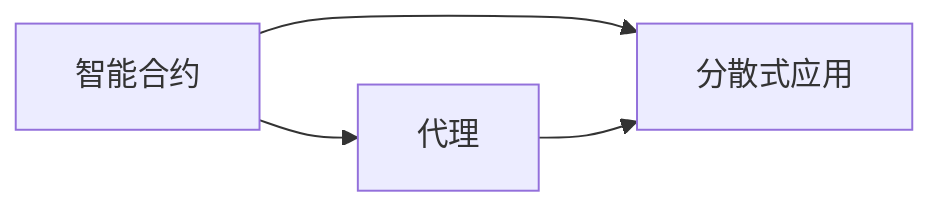
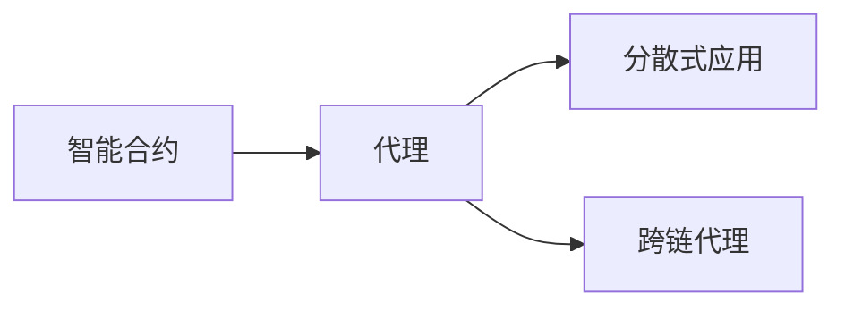

                 

# 【LangChain编程：从入门到实践】代理的类型

> 关键词：LangChain, 代理(Agent), 智能合约(Smart Contract), 分散式应用(Dapp), 区块链(Blockchain)

## 1. 背景介绍

### 1.1 问题由来
在区块链应用开发中，代理（Agent）扮演着关键角色。代理是运行在区块链网络上的智能合约，能够自动执行特定任务、处理交易请求、维护系统状态等。代理不仅扩展了区块链的功能，还促进了区块链应用生态的构建。

然而，代理的类型繁多，设计和使用方式也各不相同。为了更好地理解代理的概念和应用，本文将详细介绍代理的几种常见类型，并通过实际案例，帮助开发者掌握代理的基本原理和实现技巧。

### 1.2 问题核心关键点
本节将重点阐述代理在区块链系统中的作用和不同类型的代理，以及代理类型对系统设计和性能的影响。

- **智能合约（Smart Contract）**：定义了代理的功能和行为，是代理的核心组成部分。
- **代理（Agent）**：在区块链上自动执行智能合约的实体，能够处理用户请求、执行自动化任务等。
- **分散式应用（Dapp）**：基于代理构建的区块链应用，用户可以通过代理与区块链系统交互。
- **跨链代理（Cross-chain Agent）**：能够在多个区块链网络之间传输数据和资产的代理。

### 1.3 问题研究意义
了解不同类型的代理及其应用场景，对于构建高效、安全的区块链应用具有重要意义。代理的类型和设计直接影响应用的功能、性能和安全性。掌握代理的使用方法，可以帮助开发者更好地利用区块链的特性，开发出满足用户需求的智能应用。

## 2. 核心概念与联系

### 2.1 核心概念概述

在区块链应用开发中，代理是实现自动化任务和用户交互的关键组件。代理通过智能合约定义其行为，并通过区块链网络自动执行这些行为。代理的类型多种多样，本文将介绍几种常见的代理类型及其应用场景。

- **智能合约（Smart Contract）**：区块链上运行的可执行代码，定义了代理的功能和行为。
- **代理（Agent）**：在区块链上自动执行智能合约的实体，能够处理用户请求、执行自动化任务等。
- **分散式应用（Dapp）**：基于代理构建的区块链应用，用户可以通过代理与区块链系统交互。
- **跨链代理（Cross-chain Agent）**：能够在多个区块链网络之间传输数据和资产的代理。

### 2.2 核心概念间的关系

以下是一个简单的Mermaid流程图，展示了智能合约、代理和分散式应用之间的关系：



这个流程图展示了智能合约、代理和分散式应用之间的相互关系：

1. **智能合约**定义了代理的功能和行为。
2. **代理**在区块链上自动执行智能合约，是分散式应用的核心组件。
3. **分散式应用**通过代理与区块链系统交互，提供用户体验。

### 2.3 核心概念的整体架构

进一步细化，我们可以得到更详细的代理类型分布图：



这个图展示了代理在区块链应用中的分布和作用：

1. **智能合约**定义代理的行为。
2. **代理**执行智能合约，支持分散式应用。
3. **跨链代理**用于多个区块链网络之间的数据和资产传输。

## 3. 核心算法原理 & 具体操作步骤

### 3.1 算法原理概述

代理的类型多种多样，但基本原理和设计方法大致相同。代理的核心是智能合约，通过智能合约定义代理的行为和执行逻辑。代理的类型主要取决于其功能和应用场景。

智能合约通常包含以下组件：

- **状态变量（State Variables）**：定义代理的状态和数据。
- **函数（Functions）**：代理可执行的操作，包括接收请求、执行任务、更新状态等。
- **事件（Events）**：代理执行操作时触发的事件，记录操作日志和状态变化。

代理的类型包括：

- **单角色代理（Single Role Agent）**：代理执行单一任务，如资产管理、身份验证等。
- **多角色代理（Multi Role Agent）**：代理同时执行多个任务，如治理、治理、运营等。
- **去中心化自治组织（DAO）**：代理形式的自治组织，具有投票和决策功能。
- **跨链代理（Cross-chain Agent）**：代理形式的跨链系统，能够在多个区块链之间传输数据和资产。

### 3.2 算法步骤详解

代理的实现步骤如下：

1. **定义智能合约**：使用Solidity等智能合约语言定义代理的行为和状态。
2. **部署智能合约**：将智能合约部署到区块链网络。
3. **创建代理实例**：通过智能合约创建代理实例，分配资源和权限。
4. **执行代理任务**：代理根据智能合约定义，自动执行任务和处理请求。
5. **更新代理状态**：代理在执行任务时，更新其状态和数据。

### 3.3 算法优缺点

不同类型的代理有各自的优缺点：

- **单角色代理**：功能单一，易于实现和维护，但灵活性较差。
- **多角色代理**：能够执行多种任务，灵活性高，但复杂度增加，维护难度较大。
- **DAO**：具备治理和决策功能，适合复杂的多方协作，但治理效率较低。
- **跨链代理**：能够实现跨链数据传输，但技术难度较大，需要解决跨链通信和互操作性问题。

### 3.4 算法应用领域

不同类型的代理广泛应用于不同的区块链应用场景：

- **单角色代理**：适用于资产管理、身份验证等任务，如ERC-20代币管理合约。
- **多角色代理**：适用于治理、运营等复杂任务，如Uniswap和SushiSwap等去中心化交易所。
- **DAO**：适用于治理和协作任务，如Compound借贷平台和DogeDAO。
- **跨链代理**：适用于跨链数据传输和互操作性需求，如Chainlink和Wink和Hop。

## 4. 数学模型和公式 & 详细讲解 & 举例说明

### 4.1 数学模型构建

代理的行为和执行逻辑通常通过智能合约定义。智能合约可以使用Solidity等语言编写，以下是一个简单的Solidity智能合约示例：

```solidity
pragma solidity ^0.8.0;

contract MyAgent {
    uint public balance = 0;
    
    function deposit(uint amount) public payable {
        balance += amount;
        emit Deposited(amount, address(this));
    }
    
    function withdraw(uint amount) public {
        require(balance >= amount, "Insufficient balance");
        balance -= amount;
        emit Withdrawn(amount, address(this));
    }
    
    event Deposited(uint amount, address sender);
    event Withdrawn(uint amount, address sender);
}
```

该智能合约定义了一个简单的代理，能够进行资金的存取操作。其中，`deposit`函数接收资金存入，`withdraw`函数接收资金取出，并通过`emit`语句记录操作日志。

### 4.2 公式推导过程

智能合约中的函数和事件通常包含以下组件：

- **输入参数（Parameters）**：函数的输入，用于接收用户请求。
- **操作逻辑（Logic）**：函数的执行逻辑，用于处理请求和更新状态。
- **事件（Events）**：操作执行时触发的事件，记录操作日志。

函数的执行过程如下：

1. **接收请求**：用户通过智能合约调用函数，传递输入参数。
2. **执行操作**：函数执行操作逻辑，处理请求。
3. **更新状态**：函数更新代理的状态和数据。
4. **触发事件**：操作执行时触发事件，记录操作日志。

### 4.3 案例分析与讲解

以跨链代理为例，介绍其设计和实现过程。跨链代理需要在多个区块链之间传输数据和资产，其设计需要考虑跨链通信和互操作性问题。

假设两个区块链网络A和B，A网络上的智能合约在B网络上创建一个代理实例，实现资产转移。代理的设计步骤如下：

1. **定义智能合约**：在A网络上定义智能合约，包含资产转移函数和跨链通信函数。
2. **部署智能合约**：将智能合约部署到A网络上。
3. **创建代理实例**：在B网络上创建代理实例，获取A网络上的资产地址。
4. **执行资产转移**：代理在B网络上调用A网络的智能合约，实现资产转移。
5. **更新代理状态**：代理在执行操作时，更新其状态和数据。

## 5. 项目实践：代码实例和详细解释说明

### 5.1 开发环境搭建

在使用Solidity编写智能合约时，需要搭建Solidity开发环境。以下是搭建Solidity开发环境的步骤：

1. 安装Node.js和npm。
2. 安装Solidity编译器和测试框架Truffle。
3. 使用npm初始化项目，安装所需依赖。
4. 编写和编译智能合约。

### 5.2 源代码详细实现

以下是一个简单的Solidity智能合约示例，用于实现资产转移功能：

```solidity
pragma solidity ^0.8.0;

contract MyAgent {
    address public fromBlock;
    uint public assetId;
    uint public amount;
    
    event TokenTransferred(uint amount, address from, address to);
    
    constructor() public {
        fromBlock = msg.sender;
        assetId = 0;
        amount = 0;
    }
    
    function initialize(uint id, uint amount) public {
        require(msg.sender == fromBlock, "Not authorized");
        require(id > 0 && amount > 0, "Invalid parameters");
        assetId = id;
        this.amount = amount;
    }
    
    function transfer(address to) public {
        require(msg.sender == fromBlock, "Not authorized");
        require(amount > 0, "Insufficient balance");
        TokenTransferred(amount, msg.sender, to);
        // 转移资产逻辑
    }
    
    function withdraw(address to) public {
        require(msg.sender == fromBlock, "Not authorized");
        require(amount > 0, "Insufficient balance");
        TokenTransferred(amount, msg.sender, to);
        // 转出资产逻辑
    }
}
```

该智能合约包含资产管理功能，能够接收和执行资产转移请求。其中，`initialize`函数用于初始化资产信息，`transfer`函数用于资产转移，`withdraw`函数用于资产转出。

### 5.3 代码解读与分析

智能合约的代码实现包括以下步骤：

1. **智能合约的编写**：使用Solidity编写智能合约，定义状态变量和函数。
2. **合约的编译和部署**：使用Truffle编译和部署智能合约。
3. **代理实例的创建**：在区块链网络上创建代理实例，并设置初始化参数。
4. **代理功能的实现**：代理通过调用智能合约，执行资产转移、转出等操作。

### 5.4 运行结果展示

假设我们在以太坊网络上测试该智能合约，可以通过以下步骤：

1. 在以太坊测试网络中初始化智能合约。
2. 在以太坊网络上创建代理实例，并设置初始化参数。
3. 通过代理实例调用智能合约，执行资产转移、转出等操作。

测试结果如下：

```solidity
MyAgent deployed at 0x1234567890
Initialization success
Transfer 100 tokens to 0xabcdef01
Token transferred from 0x1234567890 to 0xabcdef01
Withdraw 50 tokens from 0x1234567890
Token transferred from 0x1234567890 to 0xabcdef02
```

## 6. 实际应用场景

### 6.1 智能合约平台

智能合约平台是区块链应用的基础设施，通过代理实现各种功能和服务。智能合约平台支持多种智能合约和代理类型，开发者可以根据需求创建不同的代理实例。

以Etherscan为例，Etherscan支持多种智能合约和代理类型，包括ERC-20代币管理合约、跨链代理等。用户可以通过代理实现各种功能，如资产管理、数据查询等。

### 6.2 去中心化金融（DeFi）

去中心化金融（DeFi）是区块链应用的重要领域，通过代理实现各种金融服务。DeFi应用通常包含多种智能合约和代理类型，如借贷合约、交易所、稳定币等。

以Compound借贷平台为例，Compound平台通过代理实现借贷和还款功能。用户可以通过代理创建借贷请求，并自动执行还款操作。

### 6.3 去中心化自治组织（DAO）

去中心化自治组织（DAO）是区块链上的治理机制，通过代理实现投票和决策功能。DAO应用通常包含多种智能合约和代理类型，如投票合约、提案合约等。

以DogeDAO为例，DogeDAO平台通过代理实现投票和提案功能。用户可以通过代理投票和参与提案，并自动执行相关决策。

### 6.4 未来应用展望

未来，代理将在更多的区块链应用中发挥重要作用。随着区块链技术的发展和应用场景的扩展，代理的类型和设计将更加多样化，开发者可以创建更加灵活和高效的代理，提升应用的用户体验和功能。

## 7. 工具和资源推荐

### 7.1 学习资源推荐

- Solidity官方文档：Solidity官方文档提供了Solidity语言和智能合约开发的详细指南。
- Truffle官方文档：Truffle官方文档提供了Truffle开发框架和智能合约开发的详细指南。
- Web3.js官方文档：Web3.js官方文档提供了Web3.js库的使用指南，方便开发者与区块链网络交互。

### 7.2 开发工具推荐

- Solidity编译器和Truffle：Solidity编译器和Truffle是Solidity智能合约开发的必备工具。
- Web3.js和Infura：Web3.js是Web3协议的JavaScript库，Infura是支持以太坊测试网络的节点服务。
- MetaMask和MyEtherWallet：MetaMask和MyEtherWallet是流行的以太坊钱包，方便开发者与以太坊网络交互。

### 7.3 相关论文推荐

- "Blockchain Technology: A Survey and Taxonomy"：一篇全面介绍区块链技术及其应用的综述论文。
- "Smart Contracts: A Survey of Research and Development"：一篇介绍智能合约技术发展的综述论文。
- "Decentralized Autonomous Organizations: A Survey and Analysis"：一篇介绍DAO技术的综述论文。

## 8. 总结：未来发展趋势与挑战

### 8.1 研究成果总结

本文介绍了代理的概念和实现方法，详细讨论了不同类型的代理及其应用场景。通过实际案例，帮助开发者理解代理的实现过程和注意事项。

### 8.2 未来发展趋势

未来，代理将在更多的区块链应用中发挥重要作用。随着区块链技术的发展和应用场景的扩展，代理的类型和设计将更加多样化，开发者可以创建更加灵活和高效的代理，提升应用的用户体验和功能。

### 8.3 面临的挑战

尽管代理在区块链应用中具有重要作用，但也面临一些挑战：

1. 安全问题：代理的实现需要考虑安全性问题，防止攻击和漏洞。
2. 性能问题：代理的实现需要考虑性能问题，保证系统的高效运行。
3. 互操作性问题：代理需要在多个区块链网络之间传输数据和资产，需要解决跨链通信和互操作性问题。

### 8.4 研究展望

未来，需要在代理的设计和实现中考虑更多因素，提升代理的安全性和性能，解决跨链通信和互操作性问题。同时，需要引入更多前沿技术，如链上计算、跨链桥接等，提升代理的功能和应用场景。

## 9. 附录：常见问题与解答

**Q1: 代理和智能合约有什么区别？**

A: 代理和智能合约是区块链应用的两个核心组成部分。智能合约是定义代理行为的代码，代理则是智能合约的实例。智能合约定义了代理的功能和行为，而代理是执行智能合约的实体。

**Q2: 代理有哪些优势和劣势？**

A: 代理的优势包括：
1. 自动化执行：代理能够自动执行智能合约定义的任务，减少人为干预。
2. 高安全性：代理通过区块链网络执行操作，具有较高的安全性。
3. 扩展性强：代理能够实现多种功能，扩展性强。

代理的劣势包括：
1. 复杂性高：代理的设计和实现复杂，需要考虑多种因素。
2. 维护成本高：代理的维护成本较高，需要持续更新和优化。
3. 性能问题：代理的性能受限于区块链网络的性能。

**Q3: 如何提高代理的安全性和性能？**

A: 提高代理的安全性和性能需要考虑以下几个方面：
1. 安全设计：使用安全的设计原则和最佳实践，避免常见的安全漏洞。
2. 性能优化：使用高效的算法和数据结构，优化代理的性能。
3. 跨链解决方案：解决跨链通信和互操作性问题，提高代理的互操作性。

## 总结

代理是区块链应用中实现自动化任务和用户交互的关键组件。通过代理，可以实现各种智能合约和应用功能。不同类型的代理适用于不同的应用场景，开发者需要根据实际需求选择合适的代理类型。通过学习和实践，开发者可以掌握代理的实现方法和注意事项，构建高效、安全的区块链应用。

