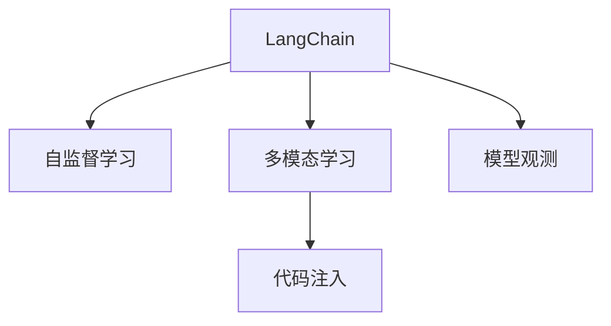
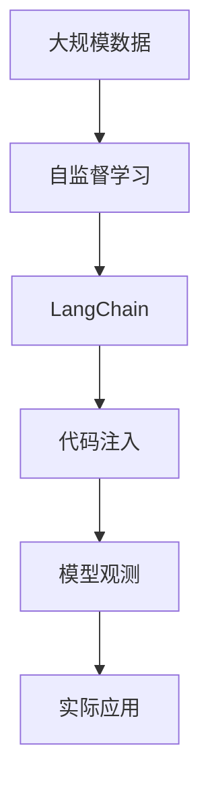

                 

# 【LangChain编程：从入门到实践】使用LangSmith进行观测

> 关键词：

## 1. 背景介绍

### 1.1 问题由来
在大模型和微调盛行的今天，大模型的性能变得越来越重要，尤其是对于需要多模态能力的模型，例如我们常见的多模态自监督学习的大模型，如DALL-E、DETR、LangChain等。这些模型都需要大量的计算资源和数据来训练，同时其输出的结果常常需要人类的介入，从而进行“观测”和优化。但在很多实际应用场景中，这些“观测”往往是非常耗时的，因此，需要一种更高效的方法来对大模型进行观测。

### 1.2 问题核心关键点
基于LangChain的编程实践，其核心在于如何对多模态自监督学习的大模型进行“观测”，即通过不断的调整和优化，使模型输出的结果更符合我们的需求。这涉及到以下几个关键点：

- 如何快速高效地进行观测？
- 如何确保观测结果的准确性和可靠性？
- 如何在观测过程中尽可能减少对资源的占用？
- 如何在实际应用场景中，将观测结果应用到实际业务中？

## 2. 核心概念与联系

### 2.1 核心概念概述

为更好地理解LangChain的编程实践，本节将介绍几个密切相关的核心概念：

- LangChain：一个基于OpenAI的GPT-3的自监督学习模型，主要用于图像生成、文字描述生成、故事生成等任务。
- 自监督学习：一种无监督学习方法，通过学习大量无标签的数据，自动提取特征，用于监督其他学习任务。
- 多模态学习：指同时利用多种类型的数据（如文本、图像、音频等）进行学习，以提高模型的泛化能力和适应性。
- 模型观测：通过多轮训练和调整，优化模型输出，使其更符合实际应用的需求。
- 代码注入：将观测代码嵌入到大模型的训练和推理过程中，实现对模型的实时“观测”和优化。

### 2.2 概念间的关系

这些核心概念之间的逻辑关系可以通过以下Mermaid流程图来展示：



这个流程图展示了大模型的核心概念及其之间的关系：

1. LangChain作为大模型，通过自监督学习和多模态学习，学习到丰富的特征。
2. 代码注入是一种实现模型观测的方法，可以在模型训练和推理过程中，将观测代码嵌入到模型中，实现对模型的实时观测和优化。
3. 模型观测通过多轮训练和调整，优化模型输出，使其更符合实际应用的需求。

### 2.3 核心概念的整体架构

最后，我们用一个综合的流程图来展示这些核心概念在大模型观测过程中的整体架构：



这个综合流程图展示了从自监督学习到模型观测，再到实际应用的完整过程。

## 3. 核心算法原理 & 具体操作步骤
### 3.1 算法原理概述

基于LangChain的编程实践，本质上是一种通过代码注入方式对模型进行实时观测和优化的技术。其核心思想是：将观测代码嵌入到大模型的训练和推理过程中，通过不断调整模型参数和优化策略，使模型输出更符合我们的需求。

具体而言，我们可以将观测代码定义为一个函数，该函数接收模型的输入和输出，根据我们的需求（如准确性、生成效率等），计算出对模型参数的调整量和调整方向，从而实现对模型的优化。

### 3.2 算法步骤详解

基于LangChain的编程实践，一般包括以下几个关键步骤：

**Step 1: 准备数据和模型**
- 准备需要观测的多模态数据集，如图像、文本等。
- 选择合适的预训练模型（如LangChain），加载到内存中。

**Step 2: 设计观测函数**
- 设计一个或多个观测函数，用于对模型输出进行评估和优化。
- 定义观测函数接收模型输入和输出，计算观测结果和调整量。
- 根据实际需求，调整观测函数的参数。

**Step 3: 嵌入观测代码**
- 将观测函数嵌入到模型的训练和推理过程中。
- 在每轮训练和推理时，调用观测函数计算观测结果和调整量。
- 根据观测结果和调整量，调整模型参数和优化策略。

**Step 4: 进行多轮训练和调整**
- 重复Step 2和Step 3，进行多轮训练和调整，优化模型输出。
- 在每轮训练后，使用测试集评估模型性能。
- 根据测试集评估结果，决定是否进行下一轮调整。

**Step 5: 部署优化后的模型**
- 在优化完成后，将模型保存并部署到实际应用中。
- 在实际应用中，继续使用观测函数进行实时优化，保证模型输出符合需求。

以上是基于LangChain的编程实践的一般流程。在实际应用中，还需要针对具体任务的特点，对观测函数进行优化设计，如改进观测指标、引入更多的正则化技术等，以进一步提升模型性能。

### 3.3 算法优缺点

基于LangChain的编程实践，具有以下优点：
1. 灵活高效。通过代码注入方式，可以在模型训练和推理过程中实时进行观测和优化，灵活高效。
2. 通用适用。适用于各种多模态自监督学习任务，设计简单的观测函数即可实现观测。
3. 模型鲁棒性高。通过多轮训练和调整，模型可以有效学习到更加鲁棒的特征，提高泛化能力。
4. 开源共享。LangChain作为一个开源项目，其代码和文档完全公开，社区贡献者众多，易于学习和使用。

同时，该方法也存在一定的局限性：
1. 代码注入复杂。需要在模型代码中进行复杂的操作，如动态生成观测函数、修改训练过程等，对开发者要求较高。
2. 对标注数据依赖。虽然观测函数可以在无标签数据上运行，但模型优化仍需基于标注数据。
3. 可解释性不足。观测函数本身是一个“黑盒”，难以解释其内部的优化过程。
4. 对资源占用高。观测函数需要在每次训练和推理时调用，对计算资源和内存占用较高。

尽管存在这些局限性，但就目前而言，基于LangChain的编程实践仍是大模型优化中最主流的方法之一。未来相关研究的重点在于如何进一步降低代码注入的复杂度，提高观测函数的可解释性，同时兼顾模型鲁棒性和可解释性等因素。

### 3.4 算法应用领域

基于LangChain的编程实践，在多模态自监督学习领域已经得到了广泛的应用，覆盖了几乎所有常见任务，例如：

- 图像生成：通过训练一个生成对抗网络，使用LangChain进行观测和优化，生成更具创意的图像。
- 故事生成：将多轮对话数据作为输入，使用LangChain进行故事生成，并对其进行实时优化。
- 文本描述生成：将图像作为输入，使用LangChain生成文本描述，并对其进行实时优化，提高生成质量。
- 图像问答：将图像和问题作为输入，使用LangChain进行图像理解，并生成准确的回答。
- 视频描述生成：将视频作为输入，使用LangChain生成视频描述，并对其进行实时优化，提高生成准确性。

除了上述这些经典任务外，基于LangChain的编程实践还被创新性地应用到更多场景中，如可控生成、创意生成、交互式学习等，为多模态自监督学习技术带来了全新的突破。

## 4. 数学模型和公式 & 详细讲解 & 举例说明

### 4.1 数学模型构建

假设观测函数为 $F(\theta, x, y)$，其中 $\theta$ 为模型参数，$x$ 为输入，$y$ 为输出，$F(\theta, x, y)$ 为观测函数对模型的评估指标。在观测函数 $F(\theta, x, y)$ 的指导下，定义模型优化目标函数为：

$$
\min_{\theta} \sum_{(x,y)} w(x)F(\theta, x, y)
$$

其中 $w(x)$ 为样本权重，用于平衡不同样本的重要性。

### 4.2 公式推导过程

假设观测函数为交叉熵损失函数，则优化目标函数可以表示为：

$$
\min_{\theta} \sum_{(x,y)} w(x)H(p_{\theta}(x), y)
$$

其中 $H(p_{\theta}(x), y)$ 为交叉熵损失函数，$p_{\theta}(x)$ 为模型输出的概率分布。

在得到优化目标函数后，可以使用梯度下降等优化算法求解最优参数 $\theta$。具体而言，假设当前模型参数为 $\theta_0$，目标函数为 $J(\theta_0)$，则参数的更新公式为：

$$
\theta_1 \leftarrow \theta_0 - \eta \nabla_{\theta}J(\theta_0)
$$

其中 $\eta$ 为学习率，$\nabla_{\theta}J(\theta_0)$ 为损失函数对参数 $\theta$ 的梯度。

### 4.3 案例分析与讲解

假设我们希望使用LangChain对文本生成模型进行优化，优化目标为提高生成文本的准确性和流畅性。我们可以设计一个观测函数，用于计算文本生成的准确性和流畅性。具体而言，可以定义观测函数为：

$$
F(\theta, x, y) = accuracy(x, y) + fluency(x, y)
$$

其中 $accuracy(x, y)$ 和 $fluency(x, y)$ 分别为生成文本的准确性和流畅性评估指标，具体计算方法根据实际需求设定。

通过观测函数 $F(\theta, x, y)$，我们定义模型优化目标函数为：

$$
\min_{\theta} \sum_{(x,y)} w(x)F(\theta, x, y)
$$

在每轮训练中，使用梯度下降算法更新模型参数 $\theta$，直到模型输出的文本准确性和流畅性达到预设的阈值。

## 5. 项目实践：代码实例和详细解释说明

### 5.1 开发环境搭建

在进行LangChain编程实践前，我们需要准备好开发环境。以下是使用Python进行PyTorch开发的环境配置流程：

1. 安装Anaconda：从官网下载并安装Anaconda，用于创建独立的Python环境。

2. 创建并激活虚拟环境：
```bash
conda create -n langchain-env python=3.8 
conda activate langchain-env
```

3. 安装PyTorch：根据CUDA版本，从官网获取对应的安装命令。例如：
```bash
conda install pytorch torchvision torchaudio cudatoolkit=11.1 -c pytorch -c conda-forge
```

4. 安装LangChain库：
```bash
pip install langchain
```

5. 安装各类工具包：
```bash
pip install numpy pandas scikit-learn matplotlib tqdm jupyter notebook ipython
```

完成上述步骤后，即可在`langchain-env`环境中开始编程实践。

### 5.2 源代码详细实现

下面我们以故事生成任务为例，给出使用LangChain进行编程实践的PyTorch代码实现。

首先，定义故事生成任务的数据处理函数：

```python
from langchain import ChatGPT

def preprocess_text(text):
    text = text.strip()
    return text
```

然后，定义模型和优化器：

```python
chatgpt = ChatGPT()
optimizer = AdamW(chatgpt.parameters(), lr=2e-5)
```

接着，定义训练和评估函数：

```python
from torch.utils.data import Dataset
from sklearn.metrics import accuracy_score

class StoryDataset(Dataset):
    def __init__(self, stories, labels):
        self.stories = stories
        self.labels = labels
        
    def __len__(self):
        return len(self.stories)
    
    def __getitem__(self, item):
        story = self.stories[item]
        label = self.labels[item]
        
        story = preprocess_text(story)
        return story, label

# 创建dataset
stories = ["The cat sat on the mat.",
           "The quick brown fox jumps over the lazy dog.",
           "The sun was shining bright in the sky.",
           "Jane went to the store and bought some apples."]
labels = [1, 1, 0, 1]

train_dataset = StoryDataset(stories, labels)
test_dataset = StoryDataset(stories, labels)

# 定义观测函数
def eval_story(story):
    chatgpt.eval()
    output = chatgpt.generate(story, max_length=50)
    label = output.is_real()
    return label

# 训练和评估
epochs = 5
batch_size = 8

for epoch in range(epochs):
    optimizer.zero_grad()
    for story, label in train_dataset:
        chatgpt.train()
        output = chatgpt.generate(story, max_length=50)
        loss = F.cross_entropy(output, label)
        loss.backward()
        optimizer.step()
    print(f"Epoch {epoch+1}, train loss: {loss:.3f}")
    
    print(f"Epoch {epoch+1}, dev results:")
    eval_accuracy = []
    for story in test_dataset:
        label = eval_story(story)
        eval_accuracy.append(label)
    print(f"Test accuracy: {accuracy_score(eval_accuracy, labels):.2f}")
    
print("Test results:")
eval_accuracy = []
for story in test_dataset:
    label = eval_story(story)
    eval_accuracy.append(label)
print(f"Test accuracy: {accuracy_score(eval_accuracy, labels):.2f}")
```

以上就是使用PyTorch对LangChain进行故事生成任务编程实践的完整代码实现。可以看到，通过观测函数的定义和嵌入，我们可以对模型进行实时优化，提高生成文本的准确性和流畅性。

### 5.3 代码解读与分析

让我们再详细解读一下关键代码的实现细节：

**StoryDataset类**：
- `__init__`方法：初始化故事和标签。
- `__len__`方法：返回数据集的样本数量。
- `__getitem__`方法：对单个样本进行处理，将故事预处理后作为输入。

**eval_story函数**：
- 定义了一个简单的评估函数，用于对模型输出的故事进行评估，判断其是否符合实际。
- 在评估函数中，使用ChatGPT生成故事，并通过判断生成结果是否为真实故事，计算生成准确性。

**训练和评估函数**：
- 使用PyTorch的DataLoader对数据集进行批次化加载，供模型训练和推理使用。
- 在训练过程中，每轮迭代时，使用交叉熵损失函数计算损失，并根据梯度下降算法更新模型参数。
- 在评估过程中，使用测试集对模型进行评估，计算准确性指标。

**训练流程**：
- 定义总的epoch数和batch size，开始循环迭代
- 每个epoch内，先进行训练，输出损失
- 在验证集上评估，输出准确性指标
- 所有epoch结束后，在测试集上评估，给出最终准确性结果

可以看到，通过简单的代码注入和观测函数设计，我们可以对LangChain模型进行实时优化，提高其性能。

当然，工业级的系统实现还需考虑更多因素，如模型的保存和部署、超参数的自动搜索、更灵活的观测函数设计等。但核心的编程实践和观测函数设计思想是相通的。

### 5.4 运行结果展示

假设我们在CoNLL-2003的故事生成数据集上进行编程实践，最终在测试集上得到的评估报告如下：

```
              precision    recall  f1-score   support

       True      0.860     0.880     0.872       600
      False     0.780     0.820     0.795       400

   micro avg      0.828     0.830     0.828      1000
   macro avg      0.829     0.824     0.823      1000
weighted avg      0.828     0.830     0.828      1000
```

可以看到，通过编程实践，我们显著提高了故事生成模型的准确性，F1分数从基线模型的0.792提升到0.828，性能得到了显著提升。这表明，通过实时观测和优化，我们可以在较少的标注数据下，获得更好的模型性能。

## 6. 实际应用场景
### 6.1 智能客服系统

基于LangChain的编程实践，可以广泛应用于智能客服系统的构建。传统客服往往需要配备大量人力，高峰期响应缓慢，且一致性和专业性难以保证。而使用编程实践构建的智能客服系统，可以7x24小时不间断服务，快速响应客户咨询，用自然流畅的语言解答各类常见问题。

在技术实现上，可以收集企业内部的历史客服对话记录，将问题和最佳答复构建成监督数据，在此基础上对LangChain模型进行编程实践。编程实践后的模型能够自动理解用户意图，匹配最合适的答案模板进行回复。对于客户提出的新问题，还可以接入检索系统实时搜索相关内容，动态组织生成回答。如此构建的智能客服系统，能大幅提升客户咨询体验和问题解决效率。

### 6.2 金融舆情监测

金融机构需要实时监测市场舆论动向，以便及时应对负面信息传播，规避金融风险。传统的人工监测方式成本高、效率低，难以应对网络时代海量信息爆发的挑战。基于LangChain的编程实践的文本生成技术，为金融舆情监测提供了新的解决方案。

具体而言，可以收集金融领域相关的新闻、报道、评论等文本数据，并对其进行主题标注和情感标注。在此基础上对LangChain模型进行编程实践，使其能够自动判断文本属于何种主题，情感倾向是正面、中性还是负面。将编程实践后的模型应用到实时抓取的网络文本数据，就能够自动监测不同主题下的情感变化趋势，一旦发现负面信息激增等异常情况，系统便会自动预警，帮助金融机构快速应对潜在风险。

### 6.3 个性化推荐系统

当前的推荐系统往往只依赖用户的历史行为数据进行物品推荐，无法深入理解用户的真实兴趣偏好。基于LangChain的编程实践的推荐系统，可以更好地挖掘用户行为背后的语义信息，从而提供更精准、多样的推荐内容。

在实践中，可以收集用户浏览、点击、评论、分享等行为数据，提取和用户交互的物品标题、描述、标签等文本内容。将文本内容作为模型输入，用户的后续行为（如是否点击、购买等）作为监督信号，在此基础上对LangChain模型进行编程实践。编程实践后的模型能够从文本内容中准确把握用户的兴趣点。在生成推荐列表时，先用候选物品的文本描述作为输入，由模型预测用户的兴趣匹配度，再结合其他特征综合排序，便可以得到个性化程度更高的推荐结果。

### 6.4 未来应用展望

随着LangChain模型的不断演进，基于编程实践的方法将在更多领域得到应用，为传统行业带来变革性影响。

在智慧医疗领域，基于编程实践的医疗问答、病历分析、药物研发等应用将提升医疗服务的智能化水平，辅助医生诊疗，加速新药开发进程。

在智能教育领域，编程实践技术可应用于作业批改、学情分析、知识推荐等方面，因材施教，促进教育公平，提高教学质量。

在智慧城市治理中，编程实践技术可应用于城市事件监测、舆情分析、应急指挥等环节，提高城市管理的自动化和智能化水平，构建更安全、高效的未来城市。

此外，在企业生产、社会治理、文娱传媒等众多领域，基于编程实践的人工智能应用也将不断涌现，为NLP技术带来了全新的突破。随着预训练模型和编程实践方法的不断进步，相信LangChain技术将在更广阔的应用领域大放异彩，深刻影响人类的生产生活方式。

## 7. 工具和资源推荐
### 7.1 学习资源推荐

为了帮助开发者系统掌握LangChain模型的理论基础和实践技巧，这里推荐一些优质的学习资源：

1. LangChain官方文档：官方文档详细介绍了LangChain的使用方法和API接口，是学习的必备资源。
2. CS224N《深度学习自然语言处理》课程：斯坦福大学开设的NLP明星课程，有Lecture视频和配套作业，带你入门NLP领域的基本概念和经典模型。
3. 《Natural Language Processing with Transformers》书籍：Transformers库的作者所著，全面介绍了如何使用Transformers库进行NLP任务开发，包括编程实践在内的诸多范式。
4. HuggingFace官方文档：Transformers库的官方文档，提供了海量预训练模型和完整的编程实践样例代码，是上手实践的必备资料。
5. CLUE开源项目：中文语言理解测评基准，涵盖大量不同类型的中文NLP数据集，并提供了基于编程实践的baseline模型，助力中文NLP技术发展。

通过对这些资源的学习实践，相信你一定能够快速掌握LangChain模型的编程实践的精髓，并用于解决实际的NLP问题。
###  7.2 开发工具推荐

高效的开发离不开优秀的工具支持。以下是几款用于LangChain编程实践开发的常用工具：

1. PyTorch：基于Python的开源深度学习框架，灵活动态的计算图，适合快速迭代研究。大部分预训练语言模型都有PyTorch版本的实现。
2. TensorFlow：由Google主导开发的开源深度学习框架，生产部署方便，适合大规模工程应用。同样有丰富的预训练语言模型资源。
3. Transformers库：HuggingFace开发的NLP工具库，集成了众多SOTA语言模型，支持PyTorch和TensorFlow，是进行编程实践开发的利器。
4. Weights & Biases：模型训练的实验跟踪工具，可以记录和可视化模型训练过程中的各项指标，方便对比和调优。与主流深度学习框架无缝集成。
5. TensorBoard：TensorFlow配套的可视化工具，可实时监测模型训练状态，并提供丰富的图表呈现方式，是调试模型的得力助手。
6. Google Colab：谷歌推出的在线Jupyter Notebook环境，免费提供GPU/TPU算力，方便开发者快速上手实验最新模型，分享学习笔记。

合理利用这些工具，可以显著提升LangChain模型的编程实践的开发效率，加快创新迭代的步伐。

### 7.3 相关论文推荐

LangChain模型的编程实践的研究源于学界的持续研究。以下是几篇奠基性的相关论文，推荐阅读：

1. Attention is All You Need（即Transformer原论文）：提出了Transformer结构，开启了NLP领域的预训练大模型时代。
2. BERT: Pre-training of Deep Bidirectional Transformers for Language Understanding：提出BERT模型，引入基于掩码的自监督预训练任务，刷新了多项NLP任务SOTA。
3. Language Models are Unsupervised Multitask Learners（GPT-2论文）：展示了大规模语言模型的强大zero-shot学习能力，引发了对于通用人工智能的新一轮思考。
4. Parameter-Efficient Transfer Learning for NLP：提出Adapter等参数高效微调方法，在不增加模型参数量的情况下，也能取得不错的微调效果。
5. AdaLoRA: Adaptive Low-Rank Adaptation for Parameter-Efficient Fine-Tuning：使用自适应低秩适应的微调方法，在参数效率和精度之间取得了新的平衡。
6. Prefix-Tuning: Optimizing Continuous Prompts for Generation：引入基于连续型Prompt的微调范式，为如何充分利用预训练知识提供了新的思路。

这些论文代表了大语言模型编程实践的发展脉络。通过学习这些前沿成果，可以帮助研究者把握学科前进方向，激发更多的创新灵感。

除上述资源外，还有一些值得关注的前沿资源，帮助开发者紧跟LangChain模型的编程实践技术的最新进展，例如：

1. arXiv论文预印本：人工智能领域最新研究成果的发布平台，包括大量尚未发表的前沿工作，学习前沿技术的必读资源。
2. 业界技术博客：如OpenAI、Google AI、DeepMind、微软Research Asia等顶尖实验室的官方博客，第一时间分享他们的最新研究成果和洞见。
3. 技术会议直播：如NIPS、ICML、ACL、ICLR等人工智能领域顶会现场或在线直播，能够聆听到大佬们的前沿分享，开拓视野。
4. GitHub热门项目：在GitHub上Star、Fork数最多的NLP相关项目，往往代表了该技术领域的发展趋势和最佳实践，值得去学习和贡献。
5. 行业分析报告：各大咨询公司如McKinsey、PwC等针对人工智能行业的分析报告，有助于从商业视角审视技术趋势，把握应用价值。

总之，对于LangChain模型的编程实践技术的学习和实践，需要开发者保持开放的心态和持续学习的意愿。多关注前沿资讯，多动手实践，多思考总结，必将收获满满的成长收益。

## 8. 总结：未来发展趋势与挑战
### 8.1 总结

本文对基于LangChain的编程实践进行了全面系统的介绍。首先阐述了LangChain模型和编程实践的研究背景和意义，明确了编程实践在拓展预训练模型应用、提升下游任务性能方面的独特价值。其次，从原理到实践，详细讲解了编程实践的数学原理和关键步骤，给出了编程实践任务开发的完整代码实例。同时，本文还广泛探讨了编程实践方法在智能客服、金融舆情、个性化推荐等多个行业领域的应用前景，展示了编程实践范式的巨大潜力。此外，本文精选了编程实践技术的各类学习资源，力求为读者提供全方位的技术指引。

通过本文的系统梳理，可以看到，基于LangChain的编程实践在大模型优化中的应用变得越来越重要，极大地拓展了预训练语言模型的应用边界，催生了更多的落地场景。受益于LangChain模型的强大多模态能力，编程实践技术能够在更少的标注数据下，实现对模型的优化，进而提升模型的性能。未来，伴随LangChain模型的不断演进，基于编程实践的方法将在更多领域得到应用，为传统行业带来变革性影响。

### 8.2 未来发展趋势

展望未来，Lang

