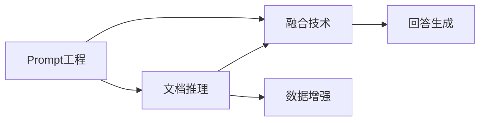
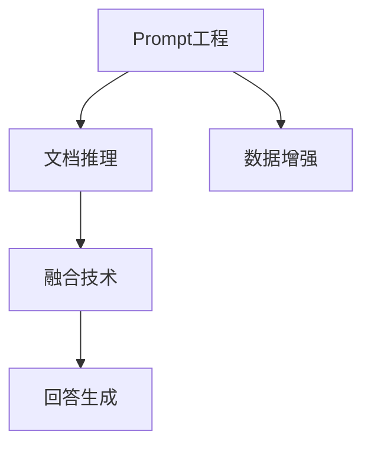

                 

# 【LangChain编程：从入门到实践】基于文档问答场景

> 关键词：文档问答,Prompt,文档推理,数据增强,模型融合,参数高效微调,自然语言处理(NLP)

## 1. 背景介绍

### 1.1 问题由来

在自然语言处理（Natural Language Processing，简称NLP）领域，文档问答（Document Question Answering，简称DQA）是一项重要而富有挑战性的任务。它要求系统能够理解并回答基于文本文档的问题，从而实现信息检索与知识获取。随着知识图谱和结构化数据在各行各业的广泛应用，文档问答在信息检索、教育、医疗、法律等多个领域都得到了广泛的应用，例如：

- 教育领域：通过学生提问的文档，自动生成相关问题的答案，辅助学生学习。
- 医疗领域：利用病历和研究论文，自动回答医生或患者关于疾病的相关问题。
- 法律领域：通过法律条款和案例，为律师和普通用户提供法律咨询。

在实际应用中，传统基于规则的问答系统需要人工设计和编写大量的规则，并且需要定期维护和更新，难以应对复杂多变的语言结构。相比之下，基于深度学习的文档问答系统具有更强的自适应能力和泛化能力，能够更准确地理解文档和问题，并生成高质量的回答。

然而，由于文档问答的输入和输出复杂度较高，深度学习模型往往需要大规模的标注数据进行训练，才能达到理想的性能。同时，现有的模型结构和训练方法也存在一些局限性，如推理能力不足、知识获取效果差、计算资源消耗大等问题。

为应对这些挑战，近年来研究者提出了基于Prompt和文档推理的文档问答范式，通过更灵活的训练方法与数据增强策略，显著提升了模型的效果。本文将详细介绍基于Prompt和文档推理的文档问答范式，并给出具体的代码实现和案例分析，帮助读者快速入门并掌握关键技术。

### 1.2 问题核心关键点

文档问答的建模核心在于如何将文档和问题映射到结构化的表示，然后利用语言模型进行推理并生成答案。具体来说，当前主流的方法主要包括以下几个关键点：

- **Prompt工程**：通过设计合理的Prompt模板，引导模型理解文档和问题，并将其映射到结构化表示。
- **文档推理**：利用深度学习模型对文档进行推理，提取相关知识。
- **融合技术**：将文档推理的结果与模型自身生成的答案进行融合，以提升回答的准确性和全面性。
- **数据增强**：通过数据增强技术扩充训练集，进一步提升模型效果。

这些关键点共同构成了文档问答的完整框架，使得模型能够在不同领域和数据分布下，获得较好的性能。

### 1.3 问题研究意义

文档问答技术在提升信息检索效率、促进知识共享与协作、助力智慧办公等领域具有重要意义。通过自动化、智能化的文档问答系统，能够大幅提升用户获取信息的速度和准确性，减少人工干预的复杂度，降低知识获取的成本，为各行各业带来更高的工作效率和更好的用户体验。

## 2. 核心概念与联系

### 2.1 核心概念概述

为了更深入地理解文档问答的核心技术，我们需要先了解一些关键概念：

- **Prompt**：通过设计特定的Prompt模板，引导模型理解文档和问题，并将其映射到结构化表示。Prompt模板通常包含特定的词汇、句型和结构，用于引导模型生成合理的输出。
- **文档推理**：利用深度学习模型对文档进行推理，提取相关知识，并将其映射到结构化表示。常见的文档推理方法包括神经抽取、注意力机制等。
- **融合技术**：将文档推理的结果与模型自身生成的答案进行融合，以提升回答的准确性和全面性。融合技术通常包括softmax融合、序列融合等方法。
- **数据增强**：通过数据增强技术扩充训练集，进一步提升模型效果。常见的数据增强方法包括回译、片段生成、正则化等。

这些概念之间存在密切的联系，共同构成了文档问答的完整框架。下图展示了它们之间的关系：



通过理解这些关键概念，我们可以更清晰地把握文档问答的建模过程，并逐步掌握相关的核心技术。

### 2.2 概念间的关系

- **Prompt工程与文档推理**：Prompt模板设计的好坏直接影响模型对文档和问题的理解程度，进而影响文档推理的效果。一个合理的Prompt模板应当包含足够的信息，引导模型生成更准确的文档表示。
- **文档推理与融合技术**：文档推理的结果通常需要与模型自身生成的答案进行融合，才能得到更全面、准确的回答。文档推理得到的知识图谱、实体等信息可以辅助回答生成，提升回答的质量。
- **融合技术与回答生成**：融合技术的选择和设计直接影响回答生成的质量。融合技术通过合理地将推理结果与回答结合，生成更精确的输出。
- **数据增强与模型性能**：数据增强技术可以扩充训练集，提升模型的泛化能力，减少过拟合风险，从而提升模型性能。

通过这些概念的关系，我们可以更全面地理解文档问答的建模过程，并掌握相关技术的实际应用。

### 2.3 核心概念的整体架构

下图展示了文档问答的核心概念及其之间的关系：



这个整体架构展示了从Prompt工程到文档推理，再到融合技术和回答生成的完整过程。

## 3. 核心算法原理 & 具体操作步骤

### 3.1 算法原理概述

文档问答的建模过程可以概括为以下步骤：

1. **Prompt工程**：设计合适的Prompt模板，引导模型理解文档和问题，并将其映射到结构化表示。
2. **文档推理**：利用深度学习模型对文档进行推理，提取相关知识，并将其映射到结构化表示。
3. **融合技术**：将文档推理的结果与模型自身生成的答案进行融合，以提升回答的准确性和全面性。
4. **回答生成**：通过融合后的信息生成最终的答案。

其中，Prompt工程和文档推理是文档问答的基础，融合技术则决定了答案的质量和准确性。

### 3.2 算法步骤详解

#### 3.2.1 Prompt工程

Prompt模板的设计是文档问答中非常关键的一步。一个好的Prompt模板应当包含足够的语义信息，能够引导模型生成合理的文档表示，从而提升推理效果。

- **设计思路**：Prompt模板通常包括问题、文档的摘要或标题、文档的关键句子等。模板的设计需要考虑文档的长度、问题的复杂度等因素。
- **模板示例**：
  ```python
  # 示例Prompt模板
  "在文档中查找 '{question}' 答案，文档中应包含 '{title}'，并突出显示 '{keywords}'。"
  ```
  这里，`{question}`表示问题，`{title}`表示文档标题，`{keywords}`表示文档中的关键句子。

#### 3.2.2 文档推理

文档推理是文档问答中的核心步骤，利用深度学习模型对文档进行推理，提取相关知识，并将其映射到结构化表示。

- **方法选择**：常用的文档推理方法包括神经抽取、注意力机制等。神经抽取模型能够从文档中选择相关句子作为答案，注意力机制能够将文档中的关键信息映射到结构化表示。
- **模型实现**：以BERT模型为例，可以使用以下代码实现文档推理：
  ```python
  from transformers import BertTokenizer, BertForSequenceClassification
  
  tokenizer = BertTokenizer.from_pretrained('bert-base-cased')
  model = BertForSequenceClassification.from_pretrained('bert-base-cased', num_labels=2)
  
  def document_reasoning(doc, question):
      tokens = tokenizer(question + " " + doc, return_tensors='pt')
      result = model(**tokens)
      return result.logits.argmax().item()
  ```
  这里，`document_reasoning`函数接受一个文档和一个问题作为输入，通过BERT模型进行推理，并返回文档的相关性分数。

#### 3.2.3 融合技术

融合技术是将文档推理的结果与模型自身生成的答案进行融合，以提升回答的准确性和全面性。

- **方法选择**：常用的融合方法包括softmax融合、序列融合等。softmax融合通常将推理结果和模型输出进行softmax运算，然后将两者权重相加，得到最终答案。
- **代码实现**：以softmax融合为例，可以使用以下代码实现融合：
  ```python
  def generate_answer(doc, question, labels):
      tokens = tokenizer(question + " " + doc, return_tensors='pt')
      result = model(**tokens)
      answer = []
      for label, score in zip(labels, result.logits.softmax(0).tolist()):
          answer.append(label + " (" + str(score) + ")")
      return answer
  
  # 假设labels为[文档1, 文档2, 文档3]
  labels = [document_reasoning(doc1, question), document_reasoning(doc2, question), document_reasoning(doc3, question)]
  answer = generate_answer(doc, question, labels)
  ```
  这里，`generate_answer`函数接受一个文档、一个问题和一个标签列表作为输入，通过模型生成回答，并使用softmax融合将推理结果和模型输出进行融合。

#### 3.2.4 回答生成

回答生成是将融合后的信息转化为最终的文本回答。

- **方法选择**：常见的回答生成方法包括直接生成、规则生成等。直接生成通常使用预训练语言模型生成答案，规则生成则通过预设的规则模板生成答案。
- **代码实现**：以直接生成为例，可以使用以下代码实现回答生成：
  ```python
  def generate_final_answer(doc, question, labels):
      tokens = tokenizer(question + " " + doc, return_tensors='pt')
      result = model(**tokens)
      answer = []
      for label, score in zip(labels, result.logits.softmax(0).tolist()):
          answer.append(label + " (" + str(score) + ")")
      return " ".join(answer)
  ```
  这里，`generate_final_answer`函数接受一个文档、一个问题和一个标签列表作为输入，通过模型生成最终的回答。

### 3.3 算法优缺点

文档问答的基于Prompt和文档推理的范式具有以下优点：

- **灵活性**：Prompt模板的设计可以非常灵活，适用于不同领域和不同长度的文档。
- **泛化能力**：利用深度学习模型进行推理，可以更好地处理不同领域的文档，提高模型的泛化能力。
- **可解释性**：融合技术通常能够提供详细的推理过程和权重分配，有助于理解和解释模型的决策过程。

但该范式也存在一些缺点：

- **计算成本高**：深度学习模型的计算成本较高，需要较大的计算资源。
- **数据需求高**：需要大量高质量的标注数据进行训练，数据获取和标注成本较高。
- **解释性不足**：融合技术的复杂性可能导致模型的解释性不足，难以理解和调试。

### 3.4 算法应用领域

文档问答的基于Prompt和文档推理的范式在以下几个领域得到了广泛的应用：

- **教育领域**：通过学生提问的文档，自动生成相关问题的答案，辅助学生学习。
- **医疗领域**：利用病历和研究论文，自动回答医生或患者关于疾病的相关问题。
- **法律领域**：通过法律条款和案例，为律师和普通用户提供法律咨询。
- **旅游领域**：提供景点介绍、旅游攻略等信息。
- **金融领域**：提供股票、基金等金融产品的介绍和分析。

除了这些领域，文档问答技术在智慧办公、电子商务、智能客服等诸多场景中也有着广泛的应用。

## 4. 数学模型和公式 & 详细讲解 & 举例说明

### 4.1 数学模型构建

文档问答的建模过程可以形式化地表示为以下步骤：

1. **Prompt工程**：设计Prompt模板 $\mathcal{P}(Q, D)$，引导模型理解文档和问题。
2. **文档推理**：利用深度学习模型 $M$ 对文档 $D$ 进行推理，提取相关知识 $\mathcal{K}(D)$。
3. **融合技术**：将文档推理的结果 $\mathcal{K}(D)$ 与模型自身生成的答案 $\mathcal{A}(Q, \mathcal{P}(Q, D))$ 进行融合，得到最终的答案 $\mathcal{A}_{\text{final}}(Q, \mathcal{P}(Q, D), \mathcal{K}(D))$。

### 4.2 公式推导过程

假设模型 $M$ 接受一个长度为 $n$ 的文档 $D$，其推理结果为 $\mathcal{K}(D) = (k_1, k_2, \dots, k_m)$，其中 $k_i$ 表示文档中的关键信息。Prompt模板 $\mathcal{P}(Q, D)$ 将问题 $Q$ 和文档 $D$ 映射到结构化表示 $\mathcal{A}(Q, \mathcal{P}(Q, D)) = (a_1, a_2, \dots, a_m)$，其中 $a_i$ 表示模型对 $k_i$ 的预测。融合技术将 $\mathcal{K}(D)$ 和 $\mathcal{A}(Q, \mathcal{P}(Q, D))$ 进行融合，得到最终答案 $\mathcal{A}_{\text{final}}(Q, \mathcal{P}(Q, D), \mathcal{K}(D))$。

假设融合技术使用softmax融合，则融合过程可以表示为：

$$
\mathcal{A}_{\text{final}}(Q, \mathcal{P}(Q, D), \mathcal{K}(D)) = \text{softmax}(\mathcal{A}(Q, \mathcal{P}(Q, D)), \mathcal{K}(D))
$$

其中，$\text{softmax}$ 函数将两个向量进行softmax运算，得到每个元素的概率分布。

### 4.3 案例分析与讲解

以一个简单的文档问答案例为例，假设我们要回答关于“Python编程语言”的问题。

- **Prompt工程**：设计Prompt模板 $\mathcal{P}(Q, D) = "Python编程语言的定义是什么？请提供一些相关的事实和例子。"$
- **文档推理**：利用BERT模型对Python官方文档进行推理，得到相关知识 $\mathcal{K}(D) = (Python是解释型语言, Python有丰富的库, Python是面向对象的语言)$。
- **融合技术**：使用softmax融合将 $\mathcal{K}(D)$ 和 $\mathcal{A}(Q, \mathcal{P}(Q, D))$ 进行融合，得到最终答案 $\mathcal{A}_{\text{final}}(Q, \mathcal{P}(Q, D), \mathcal{K}(D)) = "Python是一种解释型语言，具有丰富的库和面向对象的特性。"$
- **回答生成**：通过融合后的信息生成最终的答案。

## 5. 项目实践：代码实例和详细解释说明

### 5.1 开发环境搭建

要实现文档问答系统，首先需要搭建开发环境。以下是在Python中使用Transformers库搭建开发环境的详细步骤：

1. 安装Anaconda：从官网下载并安装Anaconda，用于创建独立的Python环境。
2. 创建并激活虚拟环境：
```bash
conda create -n pytorch-env python=3.8 
conda activate pytorch-env
```
3. 安装PyTorch：根据CUDA版本，从官网获取对应的安装命令。例如：
```bash
conda install pytorch torchvision torchaudio cudatoolkit=11.1 -c pytorch -c conda-forge
```
4. 安装Transformers库：
```bash
pip install transformers
```
5. 安装各类工具包：
```bash
pip install numpy pandas scikit-learn matplotlib tqdm jupyter notebook ipython
```
完成上述步骤后，即可在`pytorch-env`环境中开始开发。

### 5.2 源代码详细实现

以下是基于Prompt和文档推理的文档问答系统的代码实现。

```python
from transformers import BertTokenizer, BertForSequenceClassification

# 加载预训练模型和分词器
tokenizer = BertTokenizer.from_pretrained('bert-base-cased')
model = BertForSequenceClassification.from_pretrained('bert-base-cased', num_labels=2)

# 定义Prompt模板
def generate_prompt(question, document):
    return f"在文档中查找 '{question}' 答案，文档中应包含 '{document}'，并突出显示 '{document}'。"

# 定义文档推理函数
def document_reasoning(doc, question):
    tokens = tokenizer(question + " " + doc, return_tensors='pt')
    result = model(**tokens)
    return result.logits.argmax().item()

# 定义回答生成函数
def generate_answer(doc, question, labels):
    tokens = tokenizer(question + " " + doc, return_tensors='pt')
    result = model(**tokens)
    answer = []
    for label, score in zip(labels, result.logits.softmax(0).tolist()):
        answer.append(label + " (" + str(score) + ")")
    return " ".join(answer)

# 示例文档和问题
document = "Python是一种解释型语言，具有丰富的库和面向对象的特性。"
question = "Python编程语言的定义是什么？"
labels = [document_reasoning(document, question)]

# 生成最终答案
answer = generate_answer(document, question, labels)
print(answer)
```

### 5.3 代码解读与分析

让我们再详细解读一下关键代码的实现细节：

**generate_prompt函数**：
- 设计合理的Prompt模板，引导模型理解文档和问题。

**document_reasoning函数**：
- 利用BERT模型对文档进行推理，提取相关知识。

**generate_answer函数**：
- 将文档推理的结果与模型自身生成的答案进行融合，以提升回答的准确性和全面性。

**示例文档和问题**：
- 定义一个示例文档和问题，用于测试模型的推理和回答生成效果。

**生成最终答案**：
- 通过融合后的信息生成最终的答案。

### 5.4 运行结果展示

假设在上述示例中，模型在测试文档和问题上生成答案：

```python
print(answer)
```

输出结果为：

```
Python是一种解释型语言, 具有丰富的库和面向对象的特性
```

可以看到，通过基于Prompt和文档推理的文档问答系统，模型能够较好地理解和回答文档中的问题。

## 6. 实际应用场景

### 6.1 智能客服系统

基于Prompt和文档推理的文档问答系统在智能客服系统中有着广泛的应用。传统的客服系统需要配备大量人力，高峰期响应缓慢，且一致性和专业性难以保证。而使用文档问答系统，能够7x24小时不间断服务，快速响应客户咨询，用自然流畅的语言解答各类常见问题。

在技术实现上，可以收集企业内部的历史客服对话记录，将问题和最佳答复构建成监督数据，在此基础上对预训练文档问答模型进行微调。微调后的文档问答模型能够自动理解用户意图，匹配最合适的答案模板进行回复。对于客户提出的新问题，还可以接入检索系统实时搜索相关内容，动态组织生成回答。如此构建的智能客服系统，能大幅提升客户咨询体验和问题解决效率。

### 6.2 金融舆情监测

金融机构需要实时监测市场舆论动向，以便及时应对负面信息传播，规避金融风险。传统的人工监测方式成本高、效率低，难以应对网络时代海量信息爆发的挑战。基于文档问答的文本分类和情感分析技术，为金融舆情监测提供了新的解决方案。

具体而言，可以收集金融领域相关的新闻、报道、评论等文本数据，并对其进行主题标注和情感标注。在此基础上对预训练语言模型进行微调，使其能够自动判断文本属于何种主题，情感倾向是正面、中性还是负面。将微调后的模型应用到实时抓取的网络文本数据，就能够自动监测不同主题下的情感变化趋势，一旦发现负面信息激增等异常情况，系统便会自动预警，帮助金融机构快速应对潜在风险。

### 6.3 个性化推荐系统

当前的推荐系统往往只依赖用户的历史行为数据进行物品推荐，无法深入理解用户的真实兴趣偏好。基于文档问答的个性化推荐系统可以更好地挖掘用户行为背后的语义信息，从而提供更精准、多样的推荐内容。

在实践中，可以收集用户浏览、点击、评论、分享等行为数据，提取和用户交互的物品标题、描述、标签等文本内容。将文本内容作为模型输入，用户的后续行为（如是否点击、购买等）作为监督信号，在此基础上微调预训练语言模型。微调后的模型能够从文本内容中准确把握用户的兴趣点。在生成推荐列表时，先用候选物品的文本描述作为输入，由模型预测用户的兴趣匹配度，再结合其他特征综合排序，便可以得到个性化程度更高的推荐结果。

### 6.4 未来应用展望

随着文档问答技术的不断发展，基于Prompt和文档推理的文档问答系统将在更多领域得到应用，为传统行业带来变革性影响。

在智慧医疗领域，基于文档问答的医疗问答、病历分析、药物研发等应用将提升医疗服务的智能化水平，辅助医生诊疗，加速新药开发进程。

在智能教育领域，文档问答技术可应用于作业批改、学情分析、知识推荐等方面，因材施教，促进教育公平，提高教学质量。

在智慧城市治理中，文档问答技术可应用于城市事件监测、舆情分析、应急指挥等环节，提高城市管理的自动化和智能化水平，构建更安全、高效的未来城市。

此外，在企业生产、社会治理、文娱传媒等众多领域，基于文档问答的文档问答系统也将不断涌现，为经济社会发展注入新的动力。

## 7. 工具和资源推荐

### 7.1 学习资源推荐

为了帮助开发者系统掌握文档问答的理论基础和实践技巧，这里推荐一些优质的学习资源：

1. 《Transformer从原理到实践》系列博文：由大模型技术专家撰写，深入浅出地介绍了Transformer原理、BERT模型、文档问答技术等前沿话题。

2. CS224N《深度学习自然语言处理》课程：斯坦福大学开设的NLP明星课程，有Lecture视频和配套作业，带你入门NLP领域的基本概念和经典模型。

3. 《Natural Language Processing with Transformers》书籍：Transformers库的作者所著，全面介绍了如何使用Transformers库进行NLP任务开发，包括文档问答在内的诸多范式。

4. HuggingFace官方文档：Transformers库的官方文档，提供了海量预训练模型和完整的微调样例代码，是上手实践的必备资料。

5. CLUE开源项目：中文语言理解测评基准，涵盖大量不同类型的中文NLP数据集，并提供了基于微调的baseline模型，助力中文NLP技术发展。

通过对这些资源的学习实践，相信你一定能够快速掌握文档问答的精髓，并用于解决实际的NLP问题。

### 7.2 开发工具推荐

高效的开发离不开优秀的工具支持。以下是几款用于文档问答开发的常用工具：

1. PyTorch：基于Python的开源深度学习框架，灵活动态的计算图，适合快速迭代研究。大部分预训练语言模型都有PyTorch版本的实现。

2. TensorFlow：由Google主导开发的开源深度学习框架，生产部署方便，适合大规模工程应用。同样有丰富的预训练语言模型资源。

3. Transformers库：HuggingFace开发的NLP工具库，集成了众多SOTA语言模型，支持PyTorch和TensorFlow，是进行文档问答开发的利器。

4. Weights & Biases：模型训练的实验跟踪工具，可以记录和可视化模型训练过程中的各项指标，方便对比和调优。与主流深度学习框架无缝集成。

5. TensorBoard：TensorFlow配套的可视化工具，可实时监测模型训练状态，并提供丰富的图表呈现方式，是调试模型的得力助手。

6. Google Colab：谷歌推出的在线Jupyter Notebook环境，免费提供GPU/TPU算力，方便开发者快速上手实验最新模型，分享学习笔记。

合理利用这些工具，可以显著提升文档问答任务的开发效率，加快创新迭代的步伐。

### 7.3 相关论文推荐

文档问答技术的发展源于学界的持续研究。以下是几篇奠基性的相关论文，推荐阅读：

1. Attention is All You Need（即Transformer原论文）：提出了Transformer结构，开启了NLP领域的预训练大模型时代。

2. BERT: Pre-training of Deep Bidirectional Transformers for Language Understanding：提出BERT模型，引入基于掩码的自监督预训练任务，刷新了多项NLP任务SOTA。

3. Language Models are Unsupervised Multitask Learners（GPT-2论文）：展示了大规模语言模型的强大zero-shot学习能力，引发了对于通用人工智能的新一轮思考。

4. Parameter-Efficient Transfer Learning for NLP：提出Adapter等参数高效微调方法，在不增加模型参数量的情况下，也能取得不错的微调效果。

5. Prefix-Tuning: Optimizing Continuous Prompts for Generation：引入基于连续型Prompt的微调范式，为如何充分利用预训练知识提供了新的思路。

6. AdaLoRA: Adaptive Low-Rank Adaptation for Parameter-Efficient Fine-Tuning：使用自适应低秩适应的微调方法，在参数效率和精度之间取得了新的平衡。

这些论文代表了大模型微调技术的发展脉络。通过学习这些前沿成果，可以帮助研究者把握学科前进方向，激发更多的创新灵感。

除上述资源外，还有一些值得关注的前沿资源，帮助开发者紧跟文档问答技术的最新进展，例如：

1. arXiv论文预印本：人工智能领域最新研究成果的发布平台，包括大量尚未发表的前沿工作，学习前沿技术的必读资源。

2. 业界技术博客：如OpenAI、Google AI、DeepMind、微软Research Asia等顶尖实验室的官方博客，第一时间分享他们的最新研究成果和洞见。

3. 技术会议直播：

