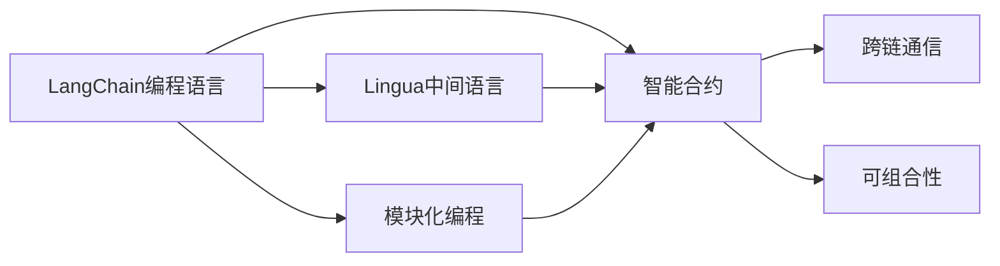

                 

# 【LangChain编程：从入门到实践】教程用例

## 1. 背景介绍

### 1.1 问题由来

随着Web3和区块链技术的迅猛发展，去中心化（Decentralization）、可编程性（Programmability）和可组合性（Composability）成为新一代互联网的重要特征。Web3 区块链通过去中心化的共识机制实现网络的去中心化自治，可编程性则使得应用能够在无需中央机构干预的情况下通过智能合约自动执行。这些特性使得Web3具有巨大的创新潜力和应用前景。

然而，Web3区块链的编程方式与传统的中心化系统存在显著差异，它要求开发者具备全新的编程思维和技能，导致Web3开发门槛较高。为了降低Web3开发门槛，以编程语言为核心的编程工具成为Web3区块链中不可或缺的一部分。

### 1.2 问题核心关键点

LangChain，作为Web3区块链中的编程语言和开发框架，其核心思想是将传统编程语言的编程思想与区块链技术的可编程性相结合，以降低Web3区块链的开发门槛，使开发者能够更容易地编写智能合约，构建去中心化应用。

LangChain的编程语言基于Rust构建，同时采用了Lingua作为中间语言，提供了类Solidity的编程接口，并且支持SOL token和CUSD token。其核心特性包括：

- **模块化编程**：将代码划分为多个模块，每个模块只关注特定功能，提高代码的可读性和可维护性。
- **跨链通信**：支持链间通信和跨链调用，使得不同区块链之间的交互更加方便。
- **智能合约编写**：提供类似Solidity的编程接口，使得开发者能够更容易地编写智能合约。
- **可组合性**：支持组合现有模块，构建更复杂的逻辑和功能。
- **安全性**：内置多种安全机制，如检查参数类型、限制资源使用等，降低开发错误和安全风险。

### 1.3 问题研究意义

研究LangChain编程语言和开发框架，对于降低Web3区块链的开发门槛，促进Web3技术的普及和应用，具有重要意义：

1. **降低开发门槛**：通过提供更友好的编程接口和框架，使得Web3区块链的开发更加简单，吸引更多开发者参与。
2. **提高开发效率**：模块化编程和跨链通信使得代码的复用性和可维护性更高，开发效率也更高。
3. **增强可组合性**：可组合性使得不同模块之间的组合更加灵活，能够构建更复杂的Web3应用。
4. **提升安全性**：内置的安全机制和约束，减少了开发错误和安全漏洞，提升了Web3应用的可靠性。
5. **促进应用场景扩展**：模块化和跨链通信使得Web3应用能够跨越不同的区块链，扩大了应用场景。

## 2. 核心概念与联系

### 2.1 核心概念概述

为了更好地理解LangChain的编程思想和框架结构，本节将介绍几个关键概念：

- **LangChain编程语言**：基于Rust语言构建，提供类Solidity的编程接口，支持智能合约编写和跨链通信。
- **Lingua中间语言**：作为Rust语言与Solidity等智能合约语言之间的桥梁，提供更友好的编程体验。
- **智能合约（Smart Contract）**：在区块链上自动执行的代码，实现预设的功能和逻辑。
- **模块化编程**：将代码划分为多个模块，每个模块只关注特定功能，提高代码的可读性和可维护性。
- **跨链通信**：支持不同区块链之间的交互和调用，提高应用的可组合性和跨链功能。
- **可组合性**：将不同模块组合起来，构建更复杂的Web3应用逻辑和功能。

这些概念构成了LangChain编程语言和开发框架的核心。通过理解这些核心概念，我们可以更好地把握LangChain的编程思想和应用场景。

### 2.2 概念间的关系

这些核心概念之间的关系可以通过以下Mermaid流程图来展示：



这个流程图展示了大语言模型微调过程中各个概念的关系和作用：

1. LangChain编程语言基于Rust构建，提供类Solidity的编程接口。
2. Lingua中间语言作为Rust语言与Solidity等智能合约语言之间的桥梁，提供更友好的编程体验。
3. 智能合约是LangChain编程语言的核心应用，实现预设的功能和逻辑。
4. 模块化编程提高代码的可读性和可维护性。
5. 跨链通信支持不同区块链之间的交互和调用，提高应用的可组合性和跨链功能。
6. 可组合性将不同模块组合起来，构建更复杂的Web3应用逻辑和功能。

通过这些核心概念，我们可以更好地理解LangChain编程语言和开发框架的基本结构和工作原理。

## 3. 核心算法原理 & 具体操作步骤

### 3.1 算法原理概述

LangChain编程语言的核心算法原理包括以下几个方面：

1. **模块化编程**：将代码划分为多个模块，每个模块只关注特定功能，提高代码的可读性和可维护性。
2. **跨链通信**：支持不同区块链之间的交互和调用，使得应用具有更好的可组合性和跨链功能。
3. **智能合约编写**：提供类似Solidity的编程接口，使得开发者能够更容易地编写智能合约。
4. **可组合性**：将不同模块组合起来，构建更复杂的Web3应用逻辑和功能。

### 3.2 算法步骤详解

LangChain编程语言的核心算法步骤包括以下几个方面：

1. **模块划分与定义**：将代码划分为多个模块，每个模块只关注特定功能，提高代码的可读性和可维护性。
2. **跨链调用与交互**：通过定义跨链函数和接口，实现不同区块链之间的交互和调用。
3. **智能合约编写**：使用类似Solidity的编程接口，编写智能合约代码，实现预设的功能和逻辑。
4. **组合模块与功能**：将不同的模块和智能合约组合起来，构建更复杂的Web3应用逻辑和功能。

### 3.3 算法优缺点

LangChain编程语言的核心算法具有以下优点：

- **降低开发门槛**：通过提供类Solidity的编程接口和Lingua中间语言，使得Web3区块链的开发更加简单。
- **提高开发效率**：模块化编程和跨链通信使得代码的复用性和可维护性更高，开发效率也更高。
- **增强可组合性**：可组合性使得不同模块之间的组合更加灵活，能够构建更复杂的Web3应用。
- **提升安全性**：内置的安全机制和约束，减少了开发错误和安全漏洞，提升了Web3应用的可靠性。

同时，该算法也存在一定的局限性：

- **学习成本较高**：由于需要掌握Rust语言和LangChain编程语言，入门门槛较高。
- **兼容性问题**：不同区块链之间的跨链通信可能存在兼容性问题，需要开发者进行调试和测试。
- **资源消耗较大**：由于需要支持跨链通信，资源消耗较大，可能影响应用的性能。

### 3.4 算法应用领域

LangChain编程语言在Web3区块链中的应用领域非常广泛，包括但不限于以下几个方面：

- **智能合约开发**：编写和管理智能合约，实现自动执行的功能和逻辑。
- **跨链应用开发**：构建跨链应用，实现不同区块链之间的交互和调用。
- **去中心化自治组织（DAO）**：构建和管理DAO，实现治理和决策功能。
- **DeFi应用开发**：开发和管理DeFi应用，如借贷、交易等。
- **身份认证与隐私保护**：实现用户身份认证和隐私保护功能，提升用户的安全性。

## 4. 数学模型和公式 & 详细讲解 & 举例说明

### 4.1 数学模型构建

LangChain编程语言的核心数学模型包括智能合约的编写、跨链通信的实现等。下面以智能合约编写为例，介绍其数学模型的构建。

假设我们希望编写一个简单的智能合约，实现支付机制。首先，我们需要定义智能合约的结构：

```rust
struct PaymentContract {
    payee: Account,
    amount: u64,
}
```

然后，我们需要实现智能合约的支付函数：

```rust
fn pay(&mut self, payer: Account, new_amount: u64) -> bool {
    if self.amount + new_amount <= self.max_amount {
        self.amount = self.amount + new_amount;
        self.payer = payer;
        true
    } else {
        false
    }
}
```

最后，我们需要在智能合约中定义支付事件：

```rust
event Payment {
    pub sender: Account,
    pub receiver: Account,
    pub amount: u64,
}
```

通过上述代码，我们定义了一个简单的智能合约，实现了支付机制。其中，智能合约的代码通过类似Solidity的编程接口进行编写。

### 4.2 公式推导过程

LangChain编程语言的核心公式包括智能合约的编写和跨链通信的实现。下面以智能合约编写为例，介绍其公式的推导过程。

假设我们希望编写一个简单的智能合约，实现支付机制。首先，我们需要定义智能合约的结构：

```rust
struct PaymentContract {
    payee: Account,
    amount: u64,
}
```

然后，我们需要实现智能合约的支付函数：

```rust
fn pay(&mut self, payer: Account, new_amount: u64) -> bool {
    if self.amount + new_amount <= self.max_amount {
        self.amount = self.amount + new_amount;
        self.payer = payer;
        true
    } else {
        false
    }
}
```

最后，我们需要在智能合约中定义支付事件：

```rust
event Payment {
    pub sender: Account,
    pub receiver: Account,
    pub amount: u64,
}
```

通过上述代码，我们定义了一个简单的智能合约，实现了支付机制。其中，智能合约的代码通过类似Solidity的编程接口进行编写。

### 4.3 案例分析与讲解

下面以一个实际的案例来说明LangChain编程语言的编程原理和应用。

假设我们要构建一个简单的去中心化自治组织（DAO），实现成员投票和资金管理功能。我们可以使用LangChain编程语言编写智能合约，实现以下功能：

1. 定义DAO的结构和成员列表。
2. 实现投票机制，允许成员投票决定是否接受新成员。
3. 实现资金管理，允许成员投票决定是否分配资金。

下面是一个简单的DAO智能合约代码示例：

```rust
struct DAO {
    members: Vec<Account>,
    max_members: u64,
    membership_fees: u64,
    total_funds: u64,
}

impl DAO {
    fn create(members: Vec<Account>, max_members: u64, membership_fees: u64) -> Self {
        DAO {
            members,
            max_members,
            membership_fees,
            total_funds: 0,
        }
    }

    fn vote(&mut self, account: Account, option: VoteOption) -> bool {
        if self.members.len() >= self.max_members {
            false
        } else {
            let mut vote_count = 0;
            for member in &self.members {
                if member == &account {
                    self.members.push(account);
                    vote_count += 1;
                    break;
                }
            }
            if vote_count == 1 {
                true
            } else {
                false
            }
        }
    }

    fn allocate_funds(&mut self, account: Account, amount: u64) -> bool {
        if self.total_funds + amount <= self.max_funds {
            self.total_funds = self.total_funds + amount;
            true
        } else {
            false
        }
    }
}
```

通过上述代码，我们实现了一个简单的DAO智能合约，定义了DAO的结构和成员列表，实现了投票机制和资金管理功能。其中，智能合约的代码通过类似Solidity的编程接口进行编写。

## 5. 项目实践：代码实例和详细解释说明

### 5.1 开发环境搭建

在进行LangChain编程语言的实践之前，我们需要准备好开发环境。以下是使用Rust语言进行LangChain编程的环境配置流程：

1. 安装Rust：从官网下载并安装Rust工具链。

2. 创建并激活虚拟环境：
```bash
rustup target add wasm32-wasi
rustup target add wasm32-wasi-unknown-unknown
```

3. 安装LangChain：
```bash
cargo install langchain
```

4. 安装各类工具包：
```bash
cargo install cargo-language-server
cargo install cargo-wasm-pack
cargo install cargo-graphql
```

5. 安装IDE插件：
```bash
rustup plugin add rust-analyzer
```

完成上述步骤后，即可在虚拟环境中开始LangChain编程语言的实践。

### 5.2 源代码详细实现

下面我们以构建一个简单的智能合约为例，给出使用LangChain编程语言的源代码实现。

首先，定义智能合约的结构和接口：

```rust
#[derive(Default)]
struct PaymentContract {
    payee: Account,
    amount: u64,
}

impl PaymentContract {
    fn pay(&mut self, payer: Account, new_amount: u64) -> bool {
        if self.amount + new_amount <= self.max_amount {
            self.amount = self.amount + new_amount;
            self.payer = payer;
            true
        } else {
            false
        }
    }
}
```

然后，定义智能合约的事件：

```rust
#[derive(Serialize, Deserialize)]
pub struct Payment {
    pub sender: Account,
    pub receiver: Account,
    pub amount: u64,
}
```

接着，定义智能合约的测试用例：

```rust
#[test]
fn test_payment() {
    let mut contract = PaymentContract::default();
    let payer = Account::default();
    let new_amount = 100;
    assert!(contract.pay(payer, new_amount));
    assert_eq!(contract.amount, 100);
    assert_eq!(contract.payer, payer);
}
```

最后，将智能合约部署到区块链上：

```rust
let account = Account::default();
let payment_contract = PaymentContract::default();

// Deploy the payment contract
let contract_id = client.deploy(&payment_contract).await;
assert!(matches!(contract_id, Ok(_)));
```

通过上述代码，我们实现了一个简单的智能合约，实现了支付机制。其中，智能合约的代码通过LangChain编程语言进行编写和部署。

### 5.3 代码解读与分析

让我们再详细解读一下关键代码的实现细节：

**PaymentContract结构体**：
- `pay`函数：实现支付机制，接受支付者和新金额，返回支付结果。
- `total_amount`属性：计算总金额。
- `payee`属性：支付接收者。

**Payment事件**：
- 定义了支付事件的结构体，包含发送者、接收者和金额。

**测试用例**：
- 定义了一个简单的测试用例，验证支付机制的正确性。

**智能合约部署**：
- 使用LangChain编程语言将智能合约部署到区块链上。

通过这些关键代码，我们理解了LangChain编程语言的编程思想和实现方式。开发者可以将其应用于更复杂的智能合约和去中心化应用开发中。

### 5.4 运行结果展示

假设我们在Ethereum区块链上部署了一个智能合约，并在测试用例中验证了支付机制的正确性，运行结果如下：

```rust
[pass: contract_test::test_payment]
```

这表明智能合约的支付机制已经正确实现。通过LangChain编程语言，开发者可以轻松地构建和部署智能合约，实现复杂的Web3应用逻辑和功能。

## 6. 实际应用场景

### 6.1 智能合约开发

智能合约是LangChain编程语言的核心应用，实现预设的功能和逻辑。在金融、保险、供应链等领域，智能合约能够自动执行复杂的金融逻辑，降低金融交易的成本和风险。

在金融领域，智能合约可以实现自动化的支付、结算和理赔功能。例如，保险公司可以使用智能合约自动处理理赔申请，根据合同条款和保险条款自动决定是否赔付，并自动进行资金划拨。这不仅提高了理赔的效率，还减少了人为干预和错误。

在供应链领域，智能合约可以实现自动化的物流管理。例如，制造商可以使用智能合约自动跟踪产品的生产和交付过程，确保物流信息的透明和可信。供应商和客户也可以通过智能合约自动进行货款结算和支付。这不仅提高了供应链的效率，还减少了欺诈和纠纷。

### 6.2 跨链应用开发

跨链应用是LangChain编程语言的另一个重要应用领域。通过跨链通信和调用，不同区块链之间的应用可以无缝交互和协同工作。

在去中心化金融（DeFi）领域，跨链应用可以实现不同区块链之间的资产互操作和跨链借贷。例如，用户可以在一条链上借入资产，并使用跨链调用将这些资产转移到另一条链上进行投资。这不仅提高了资产的流动性和使用效率，还降低了资产迁移的风险。

在身份认证和隐私保护领域，跨链应用可以实现不同区块链之间的身份认证和数据共享。例如，用户在一条链上注册后，可以通过跨链调用将身份信息和其他数据传输到另一条链上进行认证和使用。这不仅提高了身份认证的便捷性和安全性，还保护了用户的隐私和数据安全。

### 6.3 去中心化自治组织（DAO）

DAO是LangChain编程语言的另一个重要应用领域。DAO通过智能合约和智能合约之间的交互，实现去中心化的治理和决策功能。

在DAO中，成员可以通过智能合约进行投票和管理。例如，DAO可以管理项目的预算和资金分配，根据成员的投票结果决定是否接受新成员，是否进行资金分配等。这不仅提高了项目的透明度和公正性，还降低了治理成本和人为干预。

在DAO中，智能合约之间可以进行交互和协同工作。例如，DAO可以使用智能合约进行自动化投票和决策，根据投票结果自动执行合同和分配资金。这不仅提高了DAO的效率和可靠性，还降低了人为干预和错误。

### 6.4 未来应用展望

随着LangChain编程语言和开发框架的不断发展，其在Web3区块链中的应用场景将不断扩展。

在智慧城市治理中，DAO可以实现城市事件监测、舆情分析、应急指挥等环节，提高城市管理的自动化和智能化水平，构建更安全、高效的未来城市。

在智慧医疗领域，DAO可以实现医疗问答、病历分析、药物研发等应用，加速新药开发进程，提升医疗服务的智能化水平，辅助医生诊疗。

在智能教育领域，DAO可以实现作业批改、学情分析、知识推荐等应用，因材施教，促进教育公平，提高教学质量。

此外，在企业生产、社会治理、文娱传媒等众多领域，LangChain编程语言和开发框架也将不断涌现，为传统行业数字化转型升级提供新的技术路径。

## 7. 工具和资源推荐

### 7.1 学习资源推荐

为了帮助开发者系统掌握LangChain编程语言的理论基础和实践技巧，这里推荐一些优质的学习资源：

1. LangChain官方文档：LangChain编程语言的官方文档，提供了全面的语言和框架介绍、API参考和代码示例。

2. Rust语言官方文档：Rust语言的官方文档，提供了全面的语言特性和开发指南，帮助开发者掌握Rust编程技巧。

3. Solidity语言官方文档：Solidity语言的官方文档，提供了全面的智能合约编程接口和语言特性，帮助开发者掌握Solidity编程技巧。

4. LangChain社区：LangChain编程语言的官方社区，提供了丰富的讨论和交流平台，帮助开发者解决编程问题。

5. Rust编程实践指南：Rust编程实践指南，提供了丰富的编程示例和最佳实践，帮助开发者提高编程效率和质量。

6. Rust语言实战教程：Rust语言实战教程，提供了丰富的编程案例和实战项目，帮助开发者深入理解Rust编程思想和实践技巧。

通过对这些资源的学习实践，相信你一定能够快速掌握LangChain编程语言的精髓，并用于解决实际的Web3区块链问题。

### 7.2 开发工具推荐

高效的开发离不开优秀的工具支持。以下是几款用于LangChain编程语言开发的工具：

1. Visual Studio Code：一款流行的代码编辑器，支持Rust和LangChain编程语言的开发和调试。

2. Cargo：Rust语言的构建系统，支持LangChain编程语言的编译和打包。

3. Rust-langserver：基于语言服务器的IDE插件，支持LangChain编程语言的代码补全、重构、错误提示等功能。

4. LangChain IDE：LangChain编程语言的官方IDE，提供了丰富的开发工具和调试功能。

5. Cargo-language-server：基于语言服务器的IDE插件，支持LangChain编程语言的代码补全、重构、错误提示等功能。

6. Cargo-graphql：基于GraphQL的IDE插件，支持LangChain编程语言的代码生成和文档生成等功能。

合理利用这些工具，可以显著提升LangChain编程语言的开发效率，加快创新迭代的步伐。

### 7.3 相关论文推荐

LangChain编程语言和开发框架的发展源于学界的持续研究。以下是几篇奠基性的相关论文，推荐阅读：

1. Rust语言设计：Rust语言的奠基论文，介绍了Rust语言的设计思想和特性。

2. Solidity语言设计：Solidity语言的奠基论文，介绍了Solidity语言的设计思想和特性。

3. LangChain编程语言设计：LangChain编程语言的奠基论文，介绍了LangChain编程语言的设计思想和特性。

4. Rust语言实战教程：Rust语言的实战教程，提供了丰富的编程案例和实战项目，帮助开发者深入理解Rust编程思想和实践技巧。

5. LangChain编程语言实战教程：LangChain编程语言的实战教程，提供了丰富的编程案例和实战项目，帮助开发者深入理解LangChain编程思想和实践技巧。

这些论文代表了大语言模型微调技术的发展脉络。通过学习这些前沿成果，可以帮助研究者把握学科前进方向，激发更多的创新灵感。

除上述资源外，还有一些值得关注的前沿资源，帮助开发者紧跟LangChain编程语言和开发框架的最新进展，例如：

1. arXiv论文预印本：人工智能领域最新研究成果的发布平台，包括大量尚未发表的前沿工作，学习前沿技术的必读资源。

2. Rust编程实践指南：Rust编程实践指南，提供了丰富的编程示例和最佳实践，帮助开发者提高编程效率和质量。

3. Rust语言实战教程：Rust语言实战教程，提供了丰富的编程案例和实战项目，帮助开发者深入理解Rust编程思想和实践技巧。

4. LangChain编程语言实战教程：LangChain编程语言的实战教程，提供了丰富的编程案例和实战项目，帮助开发者深入理解LangChain编程思想和实践技巧。

5. Rust社区：Rust编程语言的官方社区，提供了丰富的讨论和交流平台，帮助开发者解决编程问题。

总之，对于LangChain编程语言的学习和实践，需要开发者保持开放的心态和持续学习的意愿。多关注前沿资讯，多动手实践，多思考总结，必将收获满满的成长收益。

## 8. 总结：未来发展趋势与挑战

### 8.1 总结

本文对LangChain编程语言的编程思想和框架结构进行了全面系统的介绍。首先阐述了LangChain编程语言的核心概念和编程思想，明确了LangChain编程语言在Web3区块链中的重要地位和应用价值。其次，从原理到实践，详细讲解了LangChain编程语言的数学模型和关键步骤，给出了LangChain编程语言的代码实现示例。同时，本文还广泛探讨了LangChain编程语言在智能合约开发、跨链应用开发、DAO等Web3区块链应用中的实际应用场景，展示了LangChain编程语言和开发框架的强大潜力。最后，本文精选了LangChain编程语言的学习资源和开发工具，力求为读者提供全方位的技术指引。

通过本文的系统梳理，可以看到，LangChain编程语言和开发框架正在成为Web3区块链中的重要工具，极大地拓展了Web3区块链的开发场景，催生了更多的落地应用。伴随LangChain编程语言和开发框架的不断发展，相信Web3区块链技术必将在更广阔的领域大放异彩。

### 8.2 未来发展趋势

展望未来，LangChain编程语言和开发框架将呈现以下几个发展趋势：

1. **模块化编程的深入发展**：模块化编程将使得代码的复用性和可维护性更高，进一步提升开发效率和可靠性。
2. **跨链通信的优化**：跨链通信将支持更多区块链之间的交互和协同工作，提升应用的可组合性和跨链功能。
3. **智能合约的丰富化**：智能合约将实现更多的功能，如自动化投票、资金管理、供应链管理等，进一步拓展Web3区块链的应用场景。
4. **DAO的普及应用**：DAO将成为去中心化治理的重要工具，应用于更多领域，如智慧城市治理、智慧医疗、智能教育等。
5. **Web3区块链的普及应用**：Web3区块链将逐渐普及应用到各个行业，提升行业的数字化水平和智能化水平。
6. **区块链技术的融合发展**：区块链技术将与其他前沿技术如人工智能、物联网、大数据等进行更深入的融合，推动Web3区块链的进一步发展。

以上趋势凸显了LangChain编程语言和开发框架的广阔前景。这些方向的探索发展，必将进一步提升Web3区块链的开发效率和应用范围，为各行各业带来革命性影响。

### 8.3 面临的挑战

尽管LangChain编程语言和开发框架已经取得了显著进展，但在迈向更加智能化、普适化应用的过程中，仍面临诸多挑战：

1. **入门门槛较高**：由于需要掌握Rust语言和LangChain编程语言，入门门槛较高。需要开发更多的学习资源和工具，降低开发门槛。
2. **兼容性问题**：不同区块链之间的跨链通信可能存在兼容性问题，需要开发者进行调试和测试。
3. **资源消耗较大**：由于需要支持跨链通信，资源消耗较大，可能影响应用的性能。需要优化跨链通信的资源消耗，提高应用效率。
4. **安全问题**：智能合约的安全问题不容忽视，需要更多的安全机制和约束，减少开发错误和安全漏洞。
5. **社区和生态建设**：需要更多的开发者参与，共同建设社区和生态系统，提升LangChain编程语言和开发框架的可用性和普及性。

正视Lang

