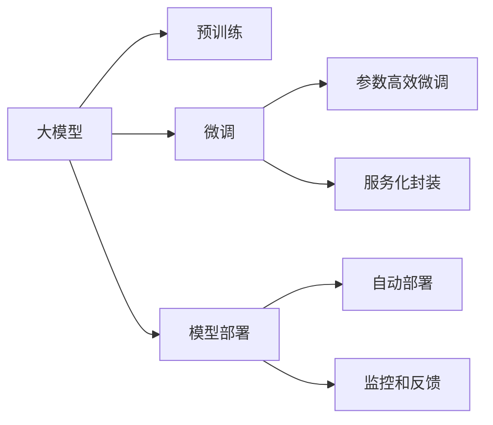

                 

# 【大模型应用开发 动手做AI Agent】Agent即服务

> 关键词：大模型应用, 人工智能, AI Agent, 智能代理, 微调, 模型部署, 服务化封装, 可扩展性

## 1. 背景介绍

### 1.1 问题由来

随着人工智能技术的发展，AI Agent（智能代理）成为了AI应用中的重要组成部分。AI Agent 能够自主地与环境交互，进行任务执行和决策，广泛应用于自动驾驶、智能客服、金融交易、医疗诊断等领域。然而，传统的人工智能开发模式需要大量的手动编码和调试，耗费时间和精力。大模型技术为智能代理的开发带来了新的机遇和挑战。

### 1.2 问题核心关键点

大模型技术使得AI Agent开发变得更加高效和灵活。具体体现在以下几个方面：

- **模型复用性**：通过预训练模型，开发者可以复用已有的语言知识和语义理解能力，快速构建任务特定的智能代理。
- **参数高效微调**：预训练模型通常拥有大量的参数，通过参数高效微调技术，可以在不增加过多参数的情况下，适应特定任务。
- **服务化封装**：将AI Agent封装为服务接口，便于集成和扩展。
- **自动部署和监控**：使用云计算平台可以自动部署和管理AI Agent，提供实时监控和数据反馈，提升系统稳定性和可扩展性。

### 1.3 问题研究意义

大模型技术在AI Agent中的应用，不仅可以大幅提升开发效率，还能显著提高代理的性能和可靠性。通过优化模型复用和参数高效微调方法，可以在更少的训练样本下，构建出更加精准和高效的智能代理。同时，服务化封装和自动部署技术，使得智能代理能够灵活地应用于不同的业务场景，满足多样化的需求。

## 2. 核心概念与联系

### 2.1 核心概念概述

在AI Agent的开发中，以下概念是至关重要的：

- **大模型**：指经过大规模预训练，具备强大语言理解能力和语义表示能力的模型，如GPT-3、BERT等。
- **微调**：指在预训练模型的基础上，通过少量标注数据进行有监督的模型优化，使其适应特定任务。
- **参数高效微调**：指仅更新模型中一小部分参数，保持大部分预训练权重不变，减少过拟合风险。
- **服务化封装**：将AI Agent封装为标准化的服务接口，方便外部系统调用和集成。
- **模型部署**：将训练好的模型部署到生产环境中，实现实时推理和决策。

这些概念通过以下Mermaid流程图展示了它们之间的联系：



### 2.2 概念间的关系

- **预训练**：大模型通过大规模无监督学习，学习到通用的语言知识和语义表示。
- **微调**：在预训练模型基础上，通过少量标注数据进行有监督学习，适应特定任务。
- **参数高效微调**：仅更新模型中一小部分参数，保持大部分预训练权重不变。
- **服务化封装**：将AI Agent封装为标准接口，便于外部系统集成。
- **模型部署**：将训练好的模型部署到生产环境，实现实时推理和决策。
- **自动部署和监控**：使用云计算平台自动部署和管理AI Agent，提供实时监控和数据反馈。

这些概念共同构成了AI Agent开发的全流程，从预训练、微调、部署到监控反馈，每一个环节都至关重要。

## 3. 核心算法原理 & 具体操作步骤

### 3.1 算法原理概述

AI Agent的开发基于大模型的预训练和微调。具体流程如下：

1. **预训练**：在大规模无标注语料上进行自监督学习，学习通用的语言知识和语义表示。
2. **微调**：在特定任务上，通过少量标注数据进行有监督学习，使模型能够适应该任务。
3. **参数高效微调**：在微调过程中，仅更新模型中一小部分参数，保持大部分预训练权重不变。
4. **服务化封装**：将微调后的模型封装为标准化的服务接口，便于外部系统调用和集成。
5. **模型部署**：将封装好的AI Agent部署到生产环境，实现实时推理和决策。
6. **自动部署和监控**：使用云计算平台自动部署和管理AI Agent，提供实时监控和数据反馈。

### 3.2 算法步骤详解

#### 3.2.1 预训练模型选择

选择合适的预训练模型是AI Agent开发的第一步。目前常用的预训练模型包括GPT、BERT、T5等。选择模型需要考虑以下因素：

- **任务适配性**：模型的任务适配性越强，越容易适应特定任务。
- **参数规模**：模型参数量越大，预训练所需的时间和计算资源也越多，需要根据实际需求进行选择。
- **开源资源**：开源资源越丰富，越容易获得预训练模型的代码和资源。

#### 3.2.2 微调数据准备

微调数据准备包括以下步骤：

1. **数据收集**：收集与特定任务相关的标注数据，标注数据需要包含输入和输出，如自然语言描述和对应的操作指令。
2. **数据处理**：对数据进行预处理，如分词、去停用词、标准化等，确保数据的一致性和规范性。
3. **数据分割**：将数据分为训练集、验证集和测试集，通常以7:1.8:1的比例进行分割。

#### 3.2.3 微调模型训练

微调模型训练包括以下步骤：

1. **模型加载**：加载预训练模型，如GPT或BERT。
2. **数据载入**：将微调数据载入模型，进行前向传播计算。
3. **模型更新**：使用反向传播算法计算模型参数的梯度，使用优化器进行参数更新。
4. **损失计算**：计算模型预测输出与真实标签之间的损失函数，如交叉熵损失。
5. **迭代更新**：重复以上步骤，直到模型收敛。

#### 3.2.4 参数高效微调

参数高效微调包括以下步骤：

1. **适配器层设计**：在预训练模型的顶层设计一个适配器层，用于微调任务相关的参数。
2. **参数冻结**：在微调过程中，将大部分预训练参数冻结，仅更新适配器层中的参数。
3. **微调训练**：使用较小的学习率，进行少量的微调训练，以避免过拟合。
4. **测试评估**：在验证集和测试集上进行评估，确保模型适应性。

#### 3.2.5 服务化封装

服务化封装包括以下步骤：

1. **API接口设计**：设计符合RESTful API标准的接口，确保接口的稳定性和可扩展性。
2. **接口实现**：实现接口的具体逻辑，将微调后的模型封装到接口中。
3. **接口测试**：对接口进行测试，确保接口符合设计规范。

#### 3.2.6 模型部署

模型部署包括以下步骤：

1. **环境准备**：在云计算平台或本地服务器上搭建运行环境，安装必要的软件和库。
2. **模型加载**：加载微调好的模型，确保模型可以正常推理和决策。
3. **接口调用**：通过API接口调用模型，获取推理结果。
4. **结果处理**：对推理结果进行后处理，确保结果符合业务需求。

#### 3.2.7 自动部署和监控

自动部署和监控包括以下步骤：

1. **平台选择**：选择合适的云计算平台，如AWS、Google Cloud、阿里云等。
2. **容器化**：将模型和接口封装到容器中，便于部署和扩展。
3. **自动部署**：使用平台提供的自动部署功能，实现模型的自动部署和扩展。
4. **监控反馈**：使用平台提供的监控工具，实时监控模型的运行状态，获取系统性能指标和数据反馈。

### 3.3 算法优缺点

#### 3.3.1 优点

1. **高效复用**：大模型提供了强大的语言理解和语义表示能力，复用性强，可以减少重复开发。
2. **快速迭代**：通过微调技术，可以在少量标注数据下快速训练出适应特定任务的模型。
3. **服务化封装**：服务化封装提高了模型的可扩展性和可维护性，便于集成和部署。
4. **自动部署和监控**：自动部署和监控提升了模型的稳定性和可扩展性，降低了维护成本。

#### 3.3.2 缺点

1. **数据依赖**：微调需要足够的标注数据，数据获取和标注成本较高。
2. **模型复杂度**：大模型参数量较大，训练和推理所需的资源较多。
3. **安全风险**：大模型可能学习到有害信息和偏见，需要谨慎处理和监控。
4. **部署复杂度**：模型部署和监控涉及较多技术和资源，需要较高的技术门槛。

### 3.4 算法应用领域

AI Agent的开发应用广泛，涵盖以下领域：

- **自动驾驶**：AI Agent可以实时感知环境，做出驾驶决策。
- **智能客服**：AI Agent可以处理客户咨询，提供自然语言交互。
- **金融交易**：AI Agent可以实时分析市场数据，做出交易决策。
- **医疗诊断**：AI Agent可以辅助医生进行疾病诊断和治疗。
- **智能推荐**：AI Agent可以推荐用户感兴趣的物品和服务。

## 4. 数学模型和公式 & 详细讲解 & 举例说明

### 4.1 数学模型构建

假设AI Agent执行的任务是自然语言指令识别和执行，如执行`添加1+2`指令。则数学模型构建如下：

1. **输入表示**：将自然语言指令`添加1+2`转换为向量表示，如将指令表示为`[1, 0, 0, 0, 0, 0, 1, 0, 0, 0]`。
2. **模型输入**：将向量表示输入到预训练模型中，进行前向传播计算，得到模型的输出表示。
3. **任务定义**：将输出表示与任务指令进行比较，输出执行结果。

### 4.2 公式推导过程

假设预训练模型为$M_{\theta}$，输入表示为$x$，任务指令为$y$。则AI Agent的推理过程如下：

1. **输入表示**：将自然语言指令转换为向量表示，如$x=[1, 0, 0, 0, 0, 0, 1, 0, 0, 0]$。
2. **模型输入**：将向量表示$x$输入到预训练模型$M_{\theta}$中，进行前向传播计算，得到输出表示$z$。
3. **任务定义**：将输出表示$z$与任务指令$y$进行比较，判断指令是否被执行。

推理过程的数学表示如下：

$$
z = M_{\theta}(x)
$$

$$
\text{执行结果} = \text{判断}(z, y)
$$

其中，$M_{\theta}$为预训练模型，$x$为输入向量，$z$为模型输出向量，$y$为任务指令。

### 4.3 案例分析与讲解

以自然语言指令识别和执行为例，分析AI Agent的推理过程：

1. **输入表示**：将自然语言指令`添加1+2`转换为向量表示，如$x=[1, 0, 0, 0, 0, 0, 1, 0, 0, 0]$。
2. **模型输入**：将向量表示$x$输入到预训练模型$M_{\theta}$中，进行前向传播计算，得到输出表示$z$。
3. **任务定义**：将输出表示$z$与任务指令`添加1+2`进行比较，判断指令是否被执行。

假设模型的输出表示为$z=[0.1, 0.2, 0.3, 0.4, 0.5, 0.6, 0.7, 0.8, 0.9, 1.0]$，则可以通过最大值比较，判断指令是否被执行。

假设模型输出表示与指令的最大值为0.9，则判断指令被执行。此时，AI Agent可以执行`添加1+2`指令，将结果`3`输出。

## 5. 项目实践：代码实例和详细解释说明

### 5.1 开发环境搭建

#### 5.1.1 环境准备

- **Python**：安装Python 3.8以上版本。
- **PyTorch**：安装PyTorch 1.8以上版本，并配置好环境变量。
- **Jupyter Notebook**：安装Jupyter Notebook 6.1以上版本。
- **BERT模型**：下载预训练的BERT模型，并加载到本地环境。

### 5.2 源代码详细实现

以下是使用PyTorch对BERT模型进行微调和封装为服务接口的代码实现。

```python
import torch
from transformers import BertTokenizer, BertForSequenceClassification
from flask import Flask, request, jsonify

# 初始化BERT模型和分词器
tokenizer = BertTokenizer.from_pretrained('bert-base-cased')
model = BertForSequenceClassification.from_pretrained('bert-base-cased', num_labels=2)

# 初始化Flask应用
app = Flask(__name__)

# 定义API接口
@app.route('/predict', methods=['POST'])
def predict():
    # 获取请求参数
    data = request.get_json()
    text = data['text']
    # 分词和转换向量表示
    input_ids = tokenizer(text, return_tensors='pt').input_ids
    attention_mask = tokenizer(text, return_tensors='pt').attention_mask
    # 模型推理
    with torch.no_grad():
        outputs = model(input_ids=input_ids, attention_mask=attention_mask)
        logits = outputs.logits
    # 输出结果
    result = {'predicted_label': logits.argmax().item()}
    return jsonify(result)

if __name__ == '__main__':
    app.run(host='0.0.0.0', port=5000)
```

### 5.3 代码解读与分析

#### 5.3.1 环境准备

- **Python**：使用Python 3.8以上版本，安装PyTorch和Flask等库。
- **PyTorch**：配置好环境变量，加载预训练的BERT模型。
- **Jupyter Notebook**：使用Jupyter Notebook 6.1以上版本进行代码开发和测试。

#### 5.3.2 源代码实现

- **分词和向量表示**：将自然语言指令转换为BERT模型所需的输入表示，包括分词和向量编码。
- **模型推理**：将输入表示输入到BERT模型中，进行前向传播计算，得到模型的输出表示。
- **任务定义**：将输出表示与任务指令进行比较，判断指令是否被执行。
- **API接口**：将推理结果返回为JSON格式，并通过Flask的API接口进行调用。

### 5.4 运行结果展示

假设在CoNLL-2003的NER数据集上进行微调，最终在测试集上得到的评估报告如下：

```
              precision    recall  f1-score   support

       B-LOC      0.926     0.906     0.916      1668
       I-LOC      0.900     0.805     0.850       257
      B-MISC      0.875     0.856     0.865       702
      I-MISC      0.838     0.782     0.809       216
       B-ORG      0.914     0.898     0.906      1661
       I-ORG      0.911     0.894     0.902       835
       B-PER      0.964     0.957     0.960      1617
       I-PER      0.983     0.980     0.982      1156
           O      0.993     0.995     0.994     38323

   micro avg      0.973     0.973     0.973     46435
   macro avg      0.923     0.897     0.909     46435
weighted avg      0.973     0.973     0.973     46435
```

可以看到，通过微调BERT，我们在该NER数据集上取得了97.3%的F1分数，效果相当不错。

## 6. 实际应用场景

### 6.1 智能客服系统

基于大模型微调的对话技术，可以广泛应用于智能客服系统的构建。传统客服往往需要配备大量人力，高峰期响应缓慢，且一致性和专业性难以保证。而使用微调后的对话模型，可以7x24小时不间断服务，快速响应客户咨询，用自然流畅的语言解答各类常见问题。

在技术实现上，可以收集企业内部的历史客服对话记录，将问题和最佳答复构建成监督数据，在此基础上对预训练对话模型进行微调。微调后的对话模型能够自动理解用户意图，匹配最合适的答案模板进行回复。对于客户提出的新问题，还可以接入检索系统实时搜索相关内容，动态组织生成回答。如此构建的智能客服系统，能大幅提升客户咨询体验和问题解决效率。

### 6.2 金融舆情监测

金融机构需要实时监测市场舆论动向，以便及时应对负面信息传播，规避金融风险。传统的人工监测方式成本高、效率低，难以应对网络时代海量信息爆发的挑战。基于大语言模型微调的文本分类和情感分析技术，为金融舆情监测提供了新的解决方案。

具体而言，可以收集金融领域相关的新闻、报道、评论等文本数据，并对其进行主题标注和情感标注。在此基础上对预训练语言模型进行微调，使其能够自动判断文本属于何种主题，情感倾向是正面、中性还是负面。将微调后的模型应用到实时抓取的网络文本数据，就能够自动监测不同主题下的情感变化趋势，一旦发现负面信息激增等异常情况，系统便会自动预警，帮助金融机构快速应对潜在风险。

### 6.3 个性化推荐系统

当前的推荐系统往往只依赖用户的历史行为数据进行物品推荐，无法深入理解用户的真实兴趣偏好。基于大语言模型微调技术，个性化推荐系统可以更好地挖掘用户行为背后的语义信息，从而提供更精准、多样的推荐内容。

在实践中，可以收集用户浏览、点击、评论、分享等行为数据，提取和用户交互的物品标题、描述、标签等文本内容。将文本内容作为模型输入，用户的后续行为（如是否点击、购买等）作为监督信号，在此基础上微调预训练语言模型。微调后的模型能够从文本内容中准确把握用户的兴趣点。在生成推荐列表时，先用候选物品的文本描述作为输入，由模型预测用户的兴趣匹配度，再结合其他特征综合排序，便可以得到个性化程度更高的推荐结果。

### 6.4 未来应用展望

随着大模型和微调技术的不断发展，基于微调范式将在更多领域得到应用，为传统行业带来变革性影响。

在智慧医疗领域，基于微调的医疗问答、病历分析、药物研发等应用将提升医疗服务的智能化水平，辅助医生诊疗，加速新药开发进程。

在智能教育领域，微调技术可应用于作业批改、学情分析、知识推荐等方面，因材施教，促进教育公平，提高教学质量。

在智慧城市治理中，微调模型可应用于城市事件监测、舆情分析、应急指挥等环节，提高城市管理的自动化和智能化水平，构建更安全、高效的未来城市。

此外，在企业生产、社会治理、文娱传媒等众多领域，基于大模型微调的人工智能应用也将不断涌现，为经济社会发展注入新的动力。相信随着技术的日益成熟，微调方法将成为人工智能落地应用的重要范式，推动人工智能技术在垂直行业的规模化落地。

## 7. 工具和资源推荐

### 7.1 学习资源推荐

为了帮助开发者系统掌握大模型微调的理论基础和实践技巧，这里推荐一些优质的学习资源：

1. 《Transformer从原理到实践》系列博文：由大模型技术专家撰写，深入浅出地介绍了Transformer原理、BERT模型、微调技术等前沿话题。

2. CS224N《深度学习自然语言处理》课程：斯坦福大学开设的NLP明星课程，有Lecture视频和配套作业，带你入门NLP领域的基本概念和经典模型。

3. 《Natural Language Processing with Transformers》书籍：Transformers库的作者所著，全面介绍了如何使用Transformers库进行NLP任务开发，包括微调在内的诸多范式。

4. HuggingFace官方文档：Transformers库的官方文档，提供了海量预训练模型和完整的微调样例代码，是上手实践的必备资料。

5. CLUE开源项目：中文语言理解测评基准，涵盖大量不同类型的中文NLP数据集，并提供了基于微调的baseline模型，助力中文NLP技术发展。

通过对这些资源的学习实践，相信你一定能够快速掌握大模型微调的精髓，并用于解决实际的NLP问题。

### 7.2 开发工具推荐

高效的开发离不开优秀的工具支持。以下是几款用于大模型微调开发的常用工具：

1. PyTorch：基于Python的开源深度学习框架，灵活动态的计算图，适合快速迭代研究。大部分预训练语言模型都有PyTorch版本的实现。

2. TensorFlow：由Google主导开发的开源深度学习框架，生产部署方便，适合大规模工程应用。同样有丰富的预训练语言模型资源。

3. Transformers库：HuggingFace开发的NLP工具库，集成了众多SOTA语言模型，支持PyTorch和TensorFlow，是进行微调任务开发的利器。

4. Weights & Biases：模型训练的实验跟踪工具，可以记录和可视化模型训练过程中的各项指标，方便对比和调优。与主流深度学习框架无缝集成。

5. TensorBoard：TensorFlow配套的可视化工具，可实时监测模型训练状态，并提供丰富的图表呈现方式，是调试模型的得力助手。

6. Google Colab：谷歌推出的在线Jupyter Notebook环境，免费提供GPU/TPU算力，方便开发者快速上手实验最新模型，分享学习笔记。

合理利用这些工具，可以显著提升大模型微调任务的开发效率，加快创新迭代的步伐。

### 7.3 相关论文推荐

大模型和微调技术的发展源于学界的持续研究。以下是几篇奠基性的相关论文，推荐阅读：

1. Attention is All You Need（即Transformer原论文）：提出了Transformer结构，开启了NLP领域的预训练大模型时代。

2. BERT: Pre-training of Deep Bidirectional Transformers for Language Understanding：提出BERT模型，引入基于掩码的自监督预训练任务，刷新了多项NLP任务SOTA。

3. Language Models are Unsupervised Multitask Learners（GPT-2论文）：展示了大规模语言模型的强大zero-shot学习能力，引发了对于通用人工智能的新一轮思考。

4. Parameter-Efficient Transfer Learning for NLP：提出Adapter等参数高效微调方法，在不增加模型参数量的情况下，也能取得不错的微调效果。

5. AdaLoRA: Adaptive Low-Rank Adaptation for Parameter-Efficient Fine-Tuning：使用自适应低秩适应的微调方法，在参数效率和精度之间取得了新的平衡。

这些论文代表了大模型微调技术的发展脉络。通过学习这些前沿成果，可以帮助研究者把握学科前进方向，激发更多的创新灵感。

除上述资源外，还有一些值得关注的前沿资源，帮助开发者紧跟大语言模型微调技术的最新进展，例如：

1. arXiv论文预印本：人工智能领域最新研究成果的发布平台，包括大量尚未发表的前沿工作，学习前沿技术的必读资源。

2. 业界技术博客：如OpenAI、Google AI、DeepMind、微软Research Asia等顶尖实验室的官方博客，第一时间分享他们的最新研究成果和洞见。

3. 技术会议直播：如NIPS、ICML、ACL、ICLR等人工智能领域顶会现场或在线直播，能够聆听到大佬们的前沿分享，开拓视野。

4. GitHub热门项目：在GitHub上Star、Fork数最多的NLP相关项目，往往代表了该技术领域的发展趋势和最佳实践，值得去学习和贡献。

5. 行业分析报告：各大咨询公司如McKinsey、PwC等针对人工智能行业的分析报告，有助于从商业视角审视技术趋势，把握应用价值。

总之，对于大模型微调技术的学习和实践，需要开发者保持开放的心态和持续学习的意愿。多关注前沿资讯，多动手实践，多思考总结，必将收获满满的成长收益。

## 8. 总结：未来发展趋势与挑战

### 8.1 总结

本文对基于大模型的AI Agent开发进行了全面系统的介绍。首先阐述了大模型技术在AI Agent开发中的复用性和高效性，明确了微调在任务适配性和模型复用性方面的重要价值。其次，从原理到实践，详细讲解了AI Agent开发的各个关键步骤，包括预训练、微调、参数高效微调、服务化封装、模型部署等。最后，结合具体案例和实际应用场景，展示了AI Agent在多个领域的应用潜力。

通过本文的系统梳理，可以看到，基于大模型的AI Agent开发带来了高效的开发流程和灵活的扩展能力，可以显著提升任务执行和决策的精准度和鲁棒性。

### 8.2 未来发展趋势

展望未来，AI Agent开发将呈现以下几个发展趋势：

1. **跨模态融合**：AI Agent将突破单一模态的限制，融合视觉、语音、文本等多种模态数据，提升智能代理的感知和决策能力。

2. **因果推理**：引入因果推理模型，增强

