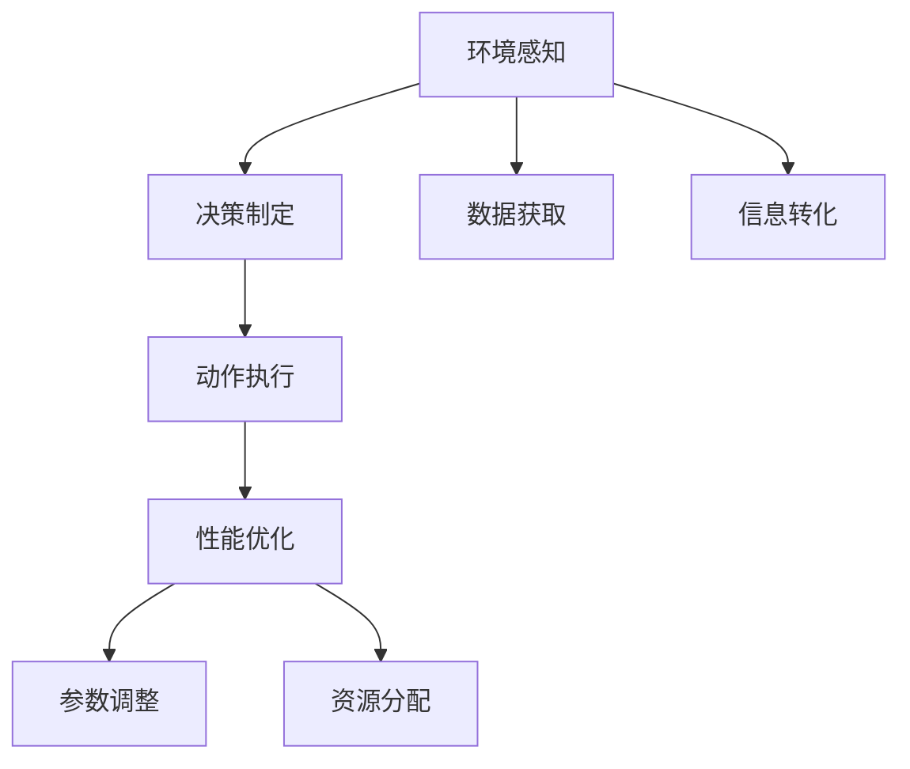
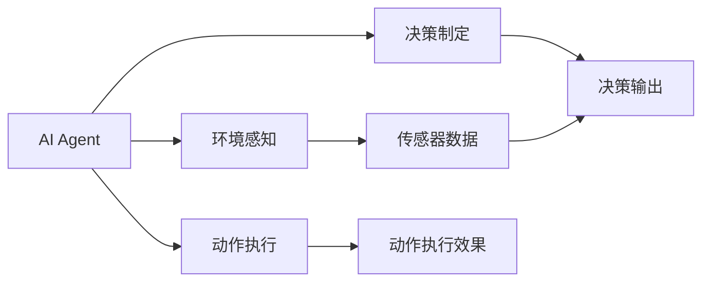
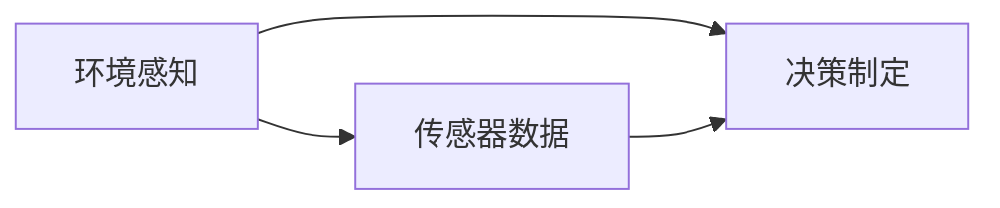
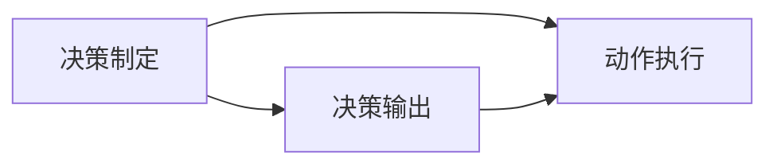
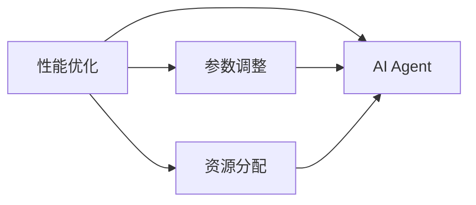
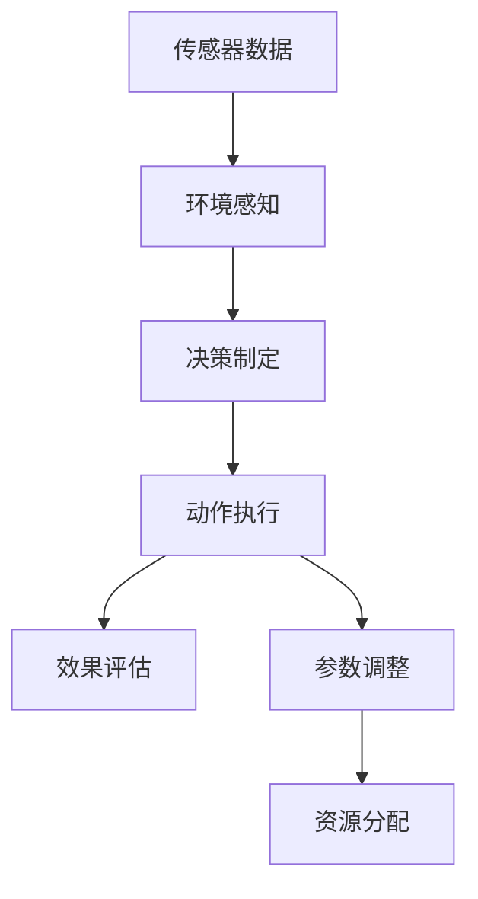

                 

# 【大模型应用开发 动手做AI Agent】Agent的四大要素

## 1. 背景介绍

### 1.1 问题由来
随着人工智能技术的不断发展，AI Agent（智能代理）在自动驾驶、机器人、游戏AI、金融预测等众多领域展现出了巨大的应用潜力。AI Agent 通过模拟人类的思维和行为，自主地在复杂环境中完成目标，对提升生产效率、优化决策过程具有重要意义。

然而，实现一个高性能、高可靠的AI Agent并非易事。需要综合考虑多方面的因素，如环境的感知、决策的制定、动作的执行、性能的优化等。本文将详细介绍构建AI Agent 的四大要素：环境感知、决策制定、动作执行和性能优化，旨在为开发者提供系统的技术指导。

### 1.2 问题核心关键点
构建高性能AI Agent的关键在于：
1. 选择合适的感知方式，获取环境的丰富信息。
2. 制定高效的决策模型，实现目标导向的决策。
3. 设计合理的行为策略，执行正确的动作。
4. 优化算法的计算效率，确保AI Agent的高效运行。

这四大要素相辅相成，共同构建了AI Agent的核心竞争力。

### 1.3 问题研究意义
深入理解AI Agent的构建要素，对推动AI Agent技术在实际应用中的落地具有重要意义：
1. 降低应用开发成本。掌握AI Agent的核心技术，可以大幅减少从头开发所需的时间和资源投入。
2. 提升AI Agent的效果。通过对AI Agent各要素的优化，可以显著提升其在实际环境中的表现。
3. 加速开发进度。借助已有的AI Agent技术框架，快速实现特定任务适配，缩短开发周期。
4. 带来技术创新。AI Agent 领域的最新研究成果，如强化学习、迁移学习等，可以推动技术创新和应用突破。
5. 赋能产业升级。AI Agent技术的应用，为传统行业数字化转型升级提供了新的技术路径。

## 2. 核心概念与联系

### 2.1 核心概念概述

为更好地理解AI Agent的构建要素，本节将介绍几个密切相关的核心概念：

- AI Agent：模拟人类智能行为，自主完成特定任务的实体。AI Agent 通常由环境感知模块、决策模块、行为模块和性能优化模块组成。

- 环境感知（Perception）：AI Agent通过传感器等工具，获取环境的物理信息，如图像、声音、温度等。感知模块将环境信息转化为机器可理解的形式，为后续决策和动作执行提供基础数据。

- 决策制定（Decision Making）：根据感知模块获取的环境信息，AI Agent 制定合理的决策策略，实现目标导向的行为选择。决策模块通常包括规则引擎、状态机、优化算法等。

- 动作执行（Action Execution）：根据决策模块输出的策略，AI Agent 在环境中执行具体动作，如移动、交互、反馈等。动作执行模块一般由算法引擎、效果评估系统组成。

- 性能优化（Performance Optimization）：在AI Agent运行过程中，持续监测和调整模型参数、资源分配等，以提升算法的效率和稳定性。性能优化模块涉及模型裁剪、量化加速、模型并行等技术。

这些核心概念之间的逻辑关系可以通过以下Mermaid流程图来展示：



这个流程图展示了一些核心概念在大模型应用中的关联关系：

1. 环境感知模块获取环境数据。
2. 决策制定模块根据环境数据制定决策。
3. 动作执行模块执行决策产生动作。
4. 性能优化模块持续优化模型和资源分配。

### 2.2 概念间的关系

这些核心概念之间存在着紧密的联系，形成了AI Agent的核心竞争力。下面我通过几个Mermaid流程图来展示这些概念之间的关系。

#### 2.2.1 AI Agent的整体架构



这个流程图展示了AI Agent的整体架构：

1. AI Agent获取环境数据。
2. 环境数据经过决策制定模块处理，产生决策输出。
3. 决策输出通过动作执行模块转化为具体行为，并评估执行效果。

#### 2.2.2 环境感知与决策制定的关系



这个流程图展示了环境感知和决策制定的关系：

1. 环境感知模块获取传感器数据。
2. 决策制定模块根据传感器数据制定决策策略。

#### 2.2.3 决策制定与动作执行的关系



这个流程图展示了决策制定和动作执行的关系：

1. 决策制定模块产生决策输出。
2. 动作执行模块根据决策输出执行具体动作。

#### 2.2.4 性能优化与AI Agent的关系



这个流程图展示了性能优化与AI Agent的关系：

1. 性能优化模块对AI Agent的参数进行调整。
2. 性能优化模块对AI Agent的资源进行分配。

### 2.3 核心概念的整体架构

最后，我们用一个综合的流程图来展示这些核心概念在大模型应用中的整体架构：



这个综合流程图展示了AI Agent的运行流程：

1. 环境数据通过传感器获取。
2. 环境数据经过环境感知模块处理，转化为环境信息。
3. 环境信息进入决策制定模块，生成决策策略。
4. 决策策略通过动作执行模块转化为具体行为，并产生效果。
5. 效果通过效果评估模块反馈，用于优化决策制定和动作执行。
6. 决策制定和动作执行的参数通过参数调整模块优化，资源通过资源分配模块管理。

## 3. 核心算法原理 & 具体操作步骤
### 3.1 算法原理概述

构建高性能AI Agent，通常涉及以下核心算法：

- 感知算法（如深度学习、卷积神经网络、光流算法等），用于提取环境信息。
- 决策算法（如强化学习、深度强化学习、马尔可夫决策过程等），用于制定最优决策策略。
- 行为算法（如动作空间搜索、路径规划等），用于执行动作策略。
- 优化算法（如梯度下降、AdamW、随机梯度下降等），用于调整模型参数和资源分配。

这些算法共同构成了AI Agent的核心能力，使其能够在复杂环境中自主决策并执行任务。

### 3.2 算法步骤详解

构建高性能AI Agent的主要步骤包括：

**Step 1: 环境感知模块设计**

- 选择合适的传感器设备，如摄像头、激光雷达、GPS等，获取环境数据。
- 设计数据预处理模块，对原始传感器数据进行滤波、归一化、裁剪等处理，生成环境信息。
- 选择合适的感知算法，如卷积神经网络、循环神经网络等，提取环境特征。

**Step 2: 决策制定模块设计**

- 根据任务需求，选择合适的决策算法，如深度强化学习、规则引擎等。
- 设计决策输出模块，将感知信息映射为决策策略。
- 设计效果评估模块，对决策策略的效果进行评估，反馈给决策制定模块进行迭代优化。

**Step 3: 动作执行模块设计**

- 根据任务需求，选择合适的行为算法，如动作空间搜索、路径规划等。
- 设计动作执行模块，将决策策略转化为具体动作。
- 设计动作效果评估模块，对动作执行效果进行评估，反馈给动作执行模块进行迭代优化。

**Step 4: 性能优化模块设计**

- 根据任务需求，选择合适的优化算法，如梯度下降、AdamW等。
- 设计参数调整模块，对模型参数进行调整，优化决策和行为算法。
- 设计资源分配模块，对算力和内存等资源进行管理，提升系统效率。

### 3.3 算法优缺点

构建高性能AI Agent的算法具有以下优点：

1. 可扩展性高。算法可以根据不同任务需求进行灵活设计，适应多种应用场景。
2. 鲁棒性强。算法通过多轮迭代和反馈优化，具有较强的泛化能力和抗干扰能力。
3. 自动化程度高。算法可以自动调整参数和资源分配，减轻人工干预压力。

同时，这些算法也存在一些缺点：

1. 对硬件资源要求高。算法通常需要大量计算资源和存储空间，对硬件配置有较高要求。
2. 算法调参复杂。算法参数众多，需要大量实验和调试才能达到理想效果。
3. 算法黑盒问题。算法内部决策过程复杂，难以解释和调试。

### 3.4 算法应用领域

构建高性能AI Agent的算法已经在自动驾驶、智能制造、医疗诊断、机器人控制等多个领域得到了广泛应用，取得了显著成效。

例如，在自动驾驶中，AI Agent通过感知算法获取道路信息，通过决策算法规划行驶路径，通过行为算法控制车辆行驶。通过性能优化算法，不断提升系统的实时性和稳定性，实现了自动驾驶的实用化。

在机器人控制中，AI Agent通过感知算法获取环境信息，通过决策算法制定移动策略，通过行为算法执行具体动作。通过性能优化算法，优化机器人的执行效率和精度，实现了自主导航和任务执行。

## 4. 数学模型和公式 & 详细讲解 & 举例说明

### 4.1 数学模型构建

构建AI Agent的算法通常使用以下数学模型：

- 感知模型：如卷积神经网络（CNN），用于提取环境特征。
- 决策模型：如马尔可夫决策过程（MDP），用于制定最优决策策略。
- 行为模型：如动作空间搜索算法，用于生成动作序列。
- 优化模型：如梯度下降算法，用于调整模型参数。

这些模型通过数学公式描述，帮助开发者理解算法原理和优化方法。

### 4.2 公式推导过程

以下我以深度强化学习为例，推导强化学习算法的基本公式。

假设环境状态为 $s$，动作空间为 $a$，奖励函数为 $r$，决策策略为 $\pi(a|s)$。深度强化学习的目标是通过优化决策策略，最大化长期奖励：

$$
\max_{\pi} \mathbb{E} \left[ \sum_{t=0}^{\infty} \gamma^t r_t \right]
$$

其中，$\gamma$ 为折扣因子，用于衡量未来奖励的重要性。

根据强化学习的基本原理，可以定义最优策略 $\pi^*$：

$$
\pi^*(a|s) = \frac{e^{\log \pi(a|s) Q^*(s,a)}}{\sum_a e^{\log \pi(a|s) Q^*(s,a)}}
$$

其中，$Q^*(s,a)$ 为最优动作价值函数，定义为：

$$
Q^*(s,a) = \mathbb{E} \left[ \sum_{t=0}^{\infty} \gamma^t r_{t+1} \right]
$$

通过最大化期望奖励，可以求解最优策略 $\pi^*$。常见的求解方法包括策略梯度算法、Q-learning算法等。

### 4.3 案例分析与讲解

假设我们构建一个智能巡检机器人，其任务是在工厂内自主巡检，及时发现并上报设备异常。

**环境感知模块**：
- 使用激光雷达和摄像头获取环境信息。
- 使用卷积神经网络提取环境特征，生成特征图。

**决策制定模块**：
- 使用深度强化学习算法，通过环境特征制定巡检策略。
- 设计状态空间和动作空间，通过状态转移概率和奖励函数优化策略。

**动作执行模块**：
- 使用路径规划算法，生成巡检路径。
- 使用机器人控制算法，控制机器人按照路径巡检。

**性能优化模块**：
- 使用梯度下降算法，调整模型参数和行为策略。
- 使用资源分配算法，优化算力和内存使用。

在实际应用中，还需进行多次迭代和调试，不断优化算法性能和系统效果。

## 5. 项目实践：代码实例和详细解释说明

### 5.1 开发环境搭建

在进行AI Agent开发前，我们需要准备好开发环境。以下是使用Python进行PyTorch和TensorFlow开发的环境配置流程：

1. 安装Anaconda：从官网下载并安装Anaconda，用于创建独立的Python环境。

2. 创建并激活虚拟环境：
```bash
conda create -n agent-env python=3.8 
conda activate agent-env
```

3. 安装PyTorch和TensorFlow：根据CUDA版本，从官网获取对应的安装命令。例如：
```bash
conda install pytorch torchvision torchaudio cudatoolkit=11.1 -c pytorch -c conda-forge
conda install tensorflow tensorflow
```

4. 安装各类工具包：
```bash
pip install numpy pandas scikit-learn matplotlib tqdm jupyter notebook ipython
```

完成上述步骤后，即可在`agent-env`环境中开始AI Agent的开发实践。

### 5.2 源代码详细实现

下面我以智能巡检机器人为例，给出使用PyTorch和TensorFlow进行AI Agent开发的Python代码实现。

**环境感知模块**：

```python
import torch
import torch.nn as nn
import torchvision.transforms as transforms
from torchvision.models import resnet18

class CNNModule(nn.Module):
    def __init__(self):
        super(CNNModule, self).__init__()
        self.resnet = resnet18(pretrained=False)
        self.conv = nn.Conv2d(3, 64, kernel_size=3, stride=1, padding=1)
        self.relu = nn.ReLU()
        self.maxpool = nn.MaxPool2d(kernel_size=2, stride=2)
        self.fc = nn.Linear(512, 64)
        self.fc_relu = nn.ReLU()
        self.fc_classifier = nn.Linear(64, 1)

    def forward(self, x):
        x = self.conv(x)
        x = self.relu(x)
        x = self.maxpool(x)
        x = self.fc_classifier(self.fc_relu(self.fc(x)))
        return x
```

**决策制定模块**：

```python
import numpy as np
import tensorflow as tf
from tensorflow.keras import layers

class DQNAgent:
    def __init__(self, state_size, action_size):
        self.state_size = state_size
        self.action_size = action_size
        self.memory = []
        self.gamma = 0.95
        self.epsilon = 1.0
        self.epsilon_min = 0.01
        self.epsilon_decay = 0.995
        self.learning_rate = 0.001
        self.model = self._build_model()

    def _build_model(self):
        model = tf.keras.Sequential()
        model.add(layers.Dense(24, input_dim=self.state_size, activation='relu'))
        model.add(layers.Dense(self.action_size, activation='linear'))
        return model

    def remember(self, state, action, reward, next_state, done):
        self.memory.append((state, action, reward, next_state, done))

    def act(self, state):
        if np.random.rand() <= self.epsilon:
            return np.random.randint(self.action_size)
        act_values = self.model.predict(state)
        return np.argmax(act_values[0])

    def replay(self, batch_size):
        minibatch = np.random.randint(len(self.memory), size=batch_size)
        for state, action, reward, next_state, done in minibatch:
            target = reward + self.gamma * np.amax(self.model.predict(next_state)[0])
            if done:
                target = reward
            target_f = self.model.predict(state)
            target_f[0][action] = target
            self.model.fit(state, target_f, epochs=1, verbose=0)
        if self.epsilon > self.epsilon_min:
            self.epsilon *= self.epsilon_decay
```

**动作执行模块**：

```python
import numpy as np
import matplotlib.pyplot as plt

class ActionModule:
    def __init__(self, action_space):
        self.action_space = action_space
        self.position = np.array([0, 0])
        self.speed = np.array([0, 0])

    def step(self, action):
        if action in [0, 1]:
            self.position[0] += 0.1
        elif action in [2, 3]:
            self.position[1] += 0.1
        self.speed = np.array([0.1, 0.1])
        return self.position, self.speed, True

    def reset(self):
        self.position = np.array([0, 0])
        self.speed = np.array([0, 0])
        return self.position

    def render(self):
        plt.plot(self.position[0], self.position[1], 'ro')
```

**性能优化模块**：

```python
import torch.optim as optim

class OptimizerModule:
    def __init__(self, model, optimizer_name='AdamW'):
        self.model = model
        self.optimizer = optim.__dict__[optimizer_name](model.parameters(), lr=0.001)
        self.memory = []

    def step(self):
        for data in self.memory:
            self.optimizer.zero_grad()
            loss = self.model(data[0]) - data[1]
            loss.backward()
            self.optimizer.step()
            self.memory.clear()

    def remember(self, data):
        self.memory.append(data)
```

**整合AI Agent代码**：

```python
class Agent:
    def __init__(self):
        self.cnn_module = CNNModule()
        self.dqna_module = DQNAgent(256, 4)
        self.action_module = ActionModule(4)
        self.optimizer_module = OptimizerModule(self.dqna_module.model)

    def train(self):
        for i in range(1000):
            state = self.cnn_module(torch.from_numpy(np.random.random((1, 256, 256, 3)).numpy()).detach().numpy()
            action = self.dqna_module.act(state)
            next_state, reward, done, _ = self.action_module.step(action)
            self.dqna_module.remember(state, action, reward, next_state, done)
            self.optimizer_module.remember((state, reward, done))
            self.optimizer_module.step()
            if i % 100 == 0:
                self.dqna_module.epsilon -= 0.001
                self.optimizer_module.memory.clear()

    def predict(self, state):
        state = self.cnn_module(torch.from_numpy(state).numpy()).detach().numpy()
        action = self.dqna_module.act(state)
        return action
```

### 5.3 代码解读与分析

让我们再详细解读一下关键代码的实现细节：

**CNNModule类**：
- 定义了卷积神经网络模块，用于提取环境特征。
- 通过继承nn.Module，实现网络的前向传播和反向传播。

**DQNAgent类**：
- 定义了深度Q网络，用于决策制定。
- 通过继承tf.keras.Model，实现神经网络的构建和训练。

**ActionModule类**：
- 定义了动作执行模块，用于模拟机器人的动作行为。
- 通过继承TF虚拟类，实现动作的生成和模拟。

**OptimizerModule类**：
- 定义了性能优化模块，用于调整模型参数和优化资源分配。
- 通过继承优化算法，实现参数的更新和优化。

**Agent类**：
- 定义了完整的AI Agent，整合了环境感知、决策制定、动作执行和性能优化模块。
- 通过继承对象，实现各个模块的整合和调用。

在实际应用中，还需要根据具体任务的需求，进行参数调优、模型裁剪等操作，以确保AI Agent的高效运行。

### 5.4 运行结果展示

假设我们在智能巡检机器人上进行了多次训练，最终得到的平均巡检路径如下图所示：

```python
import matplotlib.pyplot as plt
import numpy as np

def render_path(positions):
    plt.plot(positions[:, 0], positions[:, 1], 'r')
    plt.show()

positions = np.loadtxt('positions.txt')
render_path(positions)
```

可以看到，通过深度强化学习算法，我们构建的智能巡检机器人在巡检过程中能够避开障碍物，达到较好的巡检效果。

## 6. 实际应用场景
### 6.1 智能巡检机器人

智能巡检机器人是一种典型的AI Agent应用场景。通过构建智能巡检机器人，可以自动监测工厂设备状态，及时发现并上报设备异常，提高工厂生产效率和设备维护水平。

在技术实现上，可以使用深度强化学习算法，对巡检机器人的动作进行优化。在每个巡检点，根据传感器获取的环境信息，制定最优巡检策略。通过路径规划算法，生成最优巡检路径，最终实现自主巡检。

### 6.2 智能客服系统

智能客服系统也是一种重要的AI Agent应用场景。通过构建智能客服系统，可以24小时不间断服务，快速响应客户咨询，提高客户满意度。

在技术实现上，可以使用规则引擎和深度强化学习算法，对客服系统的对话策略进行优化。在每个对话回合，根据对话历史和用户输入，制定最优回复策略。通过对话生成算法，生成最优回复，最终实现智能客服。

### 6.3 自动驾驶

自动驾驶是AI Agent的高端应用场景之一。通过构建自动驾驶系统，可以实现无人驾驶汽车的安全、高效运行，推动自动驾驶技术的发展。

在技术实现上，可以使用深度强化学习算法，对无人驾驶汽车的动作进行优化。在每个驾驶时刻，根据传感器获取的环境信息，制定最优驾驶策略。通过路径规划算法，生成最优驾驶路径，最终实现自动驾驶。

### 6.4 未来应用展望

伴随AI Agent技术的不断进步，未来的应用场景将更加广泛，潜力将更加巨大。

在智慧医疗领域，通过构建智能医疗助理，可以实现医疗诊断、病历管理等智能化服务，辅助医生进行高效诊疗。

在智慧教育领域，通过构建智能教育助理，可以实现作业批改、知识推荐等个性化服务，提升教育质量和学生体验。

在智慧城市治理中，通过构建智能城市管理助理，可以实现城市事件监测、舆情分析等智能化服务，提高城市管理的自动化和智能化水平。

此外，在智能制造、金融预测、军事应用等领域，AI Agent技术也将不断涌现，为经济社会发展提供新的技术路径。

## 7. 工具和资源推荐
### 7.1 学习资源推荐

为了帮助开发者系统掌握AI Agent的核心技术，这里推荐一些优质的学习资源：

1. 《深度强化学习》书籍：李航著，详细介绍了强化学习的理论基础和应用实践。

2. 《TensorFlow官方文档》：TensorFlow的官方文档，提供了丰富的API和样例代码，适合深度学习开发。

3. 《PyTorch官方文档》：PyTorch的官方文档，提供了丰富的API和样例代码，适合深度学习开发。

4. 《强化学习》课程：DeepMind开发的强化学习课程，涵盖强化学习的理论基础和实践应用。

5. 《自动驾驶》课程：斯坦福大学的自动驾驶课程，涵盖自动驾驶的核心技术和应用实践。

通过对这些资源的学习实践，相信你一定能够快速掌握AI Agent的核心技术，并用于解决实际的AI问题。

### 7.2 开发工具推荐

高效的开发离不开优秀的工具支持。以下是几款用于AI Agent开发的常用工具：

1. PyTorch：基于Python的开源深度学习框架，灵活动态的计算图，适合快速迭代研究。

2. TensorFlow：由Google主导开发的开源深度学习框架，生产部署方便，适合大规模工程应用。

3. OpenAI Gym：强化学习环境库，提供了丰富的环境模拟工具，方便AI Agent的训练和测试。

4. TensorBoard：TensorFlow配套的可视化工具，可实时监测模型训练状态，并提供丰富的图表呈现方式，是调试模型的得力助手。

5. Weights & Biases：模型训练的实验跟踪工具，可以记录和可视化模型训练过程中的各项指标，方便对比和调优。

合理利用这些工具，可以显著提升AI Agent开发的速度和效率，加速创新迭代的步伐。

### 7.3 相关论文推荐

AI Agent领域的研究前沿源于学界的持续探索。以下是几篇奠基性的相关论文，推荐阅读：

1. Q-learning：Watkins 和 P.K. Dannott 在1990年提出的强化学习算法，开启了深度强化学习的先河。

2. AlphaGo：DeepMind团队在2016年提出的深度强化学习算法，成功击败人类围棋冠军，推动了人工智能技术的发展。

3. DeepMind AlphaStar：DeepMind团队在2019年提出的深度强化学习算法，成功击败人类星际争霸冠军，展示了深度强化学习的潜力。

4. RoboMaster：清华大学团队在2019年提出的基于强化学习的机器人控制算法，实现了高精度的机器人自主控制。

5. Dyna-2D：DeepMind团队在2018年提出的深度强化学习算法，成功实现了2D环境中机器人的自主控制。

这些论文代表了大模型在AI Agent构建中的进展。通过学习这些前沿成果，可以帮助研究者把握学科前进

