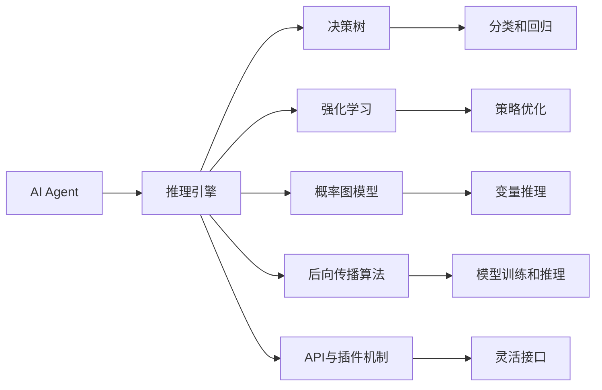
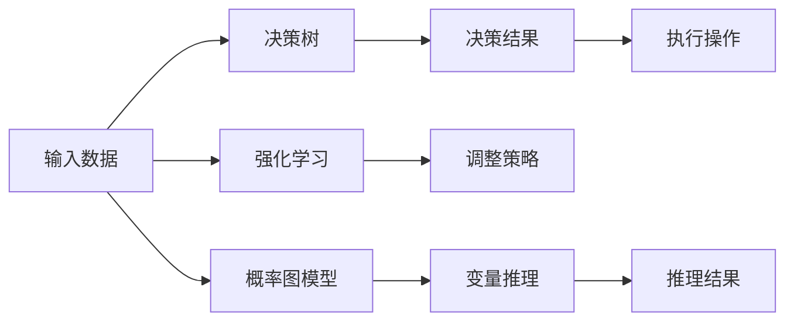
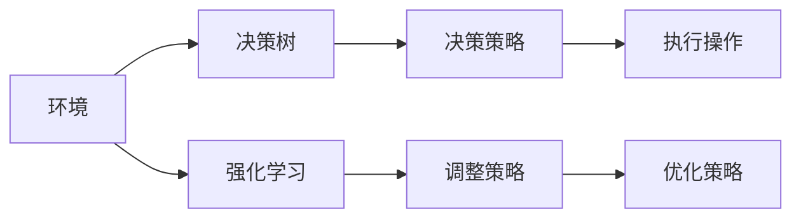
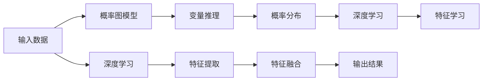
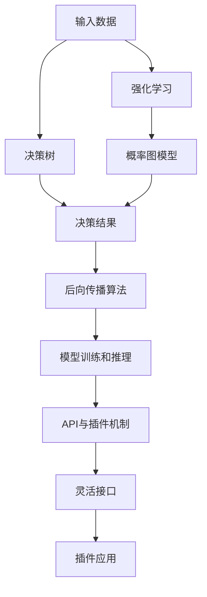

                 

# 【大模型应用开发 动手做AI Agent】Agent的推理引擎：ReAct框架

> 关键词：
- 大模型应用
- AI Agent
- 推理引擎
- 决策树
- 强化学习
- 概率图模型
- 后向传播
- 损失函数

## 1. 背景介绍

### 1.1 问题由来

随着深度学习技术的快速发展，大模型在各个领域的应用日益广泛，从自然语言处理（NLP）、计算机视觉（CV）到自动驾驶、金融交易等。然而，如何将大模型的强大能力转化为实际应用的AI Agent，仍然是一个挑战。AI Agent需要能够推理、决策、执行一系列复杂的任务，并具备一定的自主性和智能性。推理引擎作为AI Agent的核心组件，直接决定着Agent的智能水平和任务执行能力。

近年来，AI Agent推理引擎的研究不断深入，出现了许多优秀的框架和工具，如TensorFlow、PyTorch、MXNet等。这些框架提供了丰富的API和工具库，支持各种类型的AI Agent开发和训练。然而，这些框架更多关注于模型的构建和训练，对于推理和决策过程的处理和优化相对较少。

为了应对这一挑战，我们引入了一种基于图模型的AI Agent推理引擎——ReAct框架。ReAct框架不仅支持模型的训练和推理，还集成了决策树、强化学习、概率图模型等多种技术，提供了一个全面且高效的AI Agent开发平台。

### 1.2 问题核心关键点

ReAct框架的核心关键点包括：
1. **基于图模型的推理引擎**：通过构建决策树和概率图模型，实现高效的推理和决策。
2. **决策树与强化学习的结合**：将决策树与强化学习算法结合，提升Agent的自主决策能力。
3. **概率图模型与深度学习的融合**：利用概率图模型进行推理，结合深度学习技术提高模型的准确性和泛化能力。
4. **高效的后向传播算法**：采用后向传播算法优化模型的训练和推理过程，提高计算效率。
5. **灵活的接口和插件机制**：提供灵活的API和插件机制，支持用户自定义模型和算法，适应不同的应用场景。

这些关键点构成了ReAct框架的核心技术架构，使其成为一款功能强大且易于使用的AI Agent开发工具。

### 1.3 问题研究意义

ReAct框架的引入，对于AI Agent的开发和部署具有重要的意义：

1. **提升推理效率**：通过决策树和概率图模型，ReAct框架能够在推理过程中高效地处理复杂逻辑和不确定性，提升推理速度和准确性。
2. **增强自主决策能力**：结合强化学习技术，ReAct框架能够帮助AI Agent在不断试错中学习和优化决策策略，提升自主决策能力。
3. **提高模型泛化能力**：通过概率图模型与深度学习的融合，ReAct框架能够学习到更加通用和鲁棒的特征表示，提升模型泛化能力。
4. **优化计算资源**：采用后向传播算法，ReAct框架能够高效地进行模型训练和推理，减少计算资源的消耗。
5. **适应多样应用场景**：提供灵活的API和插件机制，ReAct框架能够适应不同的应用场景和需求，支持复杂的AI Agent开发和部署。

ReAct框架的引入，不仅能够提升AI Agent的智能水平和任务执行能力，还能够降低开发难度和成本，推动AI Agent技术在更多领域的落地应用。

## 2. 核心概念与联系

### 2.1 核心概念概述

为更好地理解ReAct框架的技术架构和应用方法，本节将介绍几个密切相关的核心概念：

- **AI Agent**：具有自主决策和执行能力的智能体，能够在复杂环境中完成特定任务。
- **推理引擎**：用于模拟智能体的决策过程，进行推理、计算和执行。
- **决策树**：一种基于树形结构的分类和回归算法，通过分支和叶子节点表示决策过程和预测结果。
- **强化学习**：通过与环境交互，不断调整策略以最大化累积奖励的机器学习技术。
- **概率图模型**：一种基于图结构的概率模型，用于描述和推理变量之间的关系。
- **后向传播算法**：一种基于反向传播的优化算法，用于深度学习模型的训练和推理。
- **API与插件机制**：用于提供灵活的开发接口和插件支持，适应不同的应用场景和需求。

这些核心概念之间存在着紧密的联系，形成了ReAct框架的技术生态系统。下面通过一个Mermaid流程图来展示这些概念之间的联系：



这个流程图展示了ReAct框架的核心概念及其之间的关系：

1. AI Agent通过推理引擎进行决策和执行。
2. 推理引擎包含决策树、强化学习、概率图模型等多种技术，用于实现推理和决策。
3. 决策树用于分类和回归任务，强化学习用于策略优化，概率图模型用于变量推理。
4. 后向传播算法用于模型训练和推理，API与插件机制用于灵活开发和部署。

通过这些核心概念，我们可以更好地把握ReAct框架的技术原理和应用方法。

### 2.2 概念间的关系

这些核心概念之间存在着紧密的联系，形成了ReAct框架的技术生态系统。下面通过几个Mermaid流程图来展示这些概念之间的关系。

#### 2.2.1 AI Agent的推理过程



这个流程图展示了AI Agent的推理过程。输入数据首先经过决策树进行分类或回归，得到初步的决策结果。然后通过执行操作进行任务执行。同时，AI Agent还可以通过强化学习不断调整策略，提升决策能力。概率图模型用于描述变量之间的关系，变量推理则用于计算变量的概率分布。

#### 2.2.2 强化学习与决策树结合



这个流程图展示了决策树与强化学习的结合。决策树用于初步决策，强化学习用于策略调整。通过与环境的交互，AI Agent不断调整策略，提升决策能力和执行效果。

#### 2.2.3 概率图模型与深度学习融合



这个流程图展示了概率图模型与深度学习的融合。概率图模型用于变量推理，计算变量的概率分布。深度学习用于特征学习和提取，提升模型的泛化能力和准确性。特征融合则将深度学习提取的特征与概率图模型的结果结合，输出最终的决策结果。

### 2.3 核心概念的整体架构

最后，我们用一个综合的流程图来展示这些核心概念在ReAct框架中的整体架构：



这个综合流程图展示了ReAct框架的核心概念在推理过程中的整体架构。输入数据首先经过决策树进行决策，然后通过强化学习不断优化决策策略。决策结果结合概率图模型的推理结果，利用后向传播算法进行模型训练和推理。API与插件机制提供灵活的开发接口和插件支持，适应不同的应用场景和需求。

## 3. 核心算法原理 & 具体操作步骤

### 3.1 算法原理概述

ReAct框架的核心算法原理包括：

1. **决策树算法**：通过构建决策树，ReAct框架能够高效地处理分类和回归任务，提升推理速度和决策能力。决策树通过分支和叶子节点表示决策过程，能够处理复杂的逻辑和不确定性。

2. **强化学习算法**：通过与环境交互，ReAct框架能够不断调整决策策略，提升AI Agent的自主决策能力。强化学习算法通过累计奖励优化策略，使AI Agent在复杂环境中能够自主学习和优化。

3. **概率图模型算法**：利用概率图模型进行变量推理，ReAct框架能够描述和计算变量之间的关系，提升推理的准确性和泛化能力。概率图模型通过变量之间的条件概率计算，能够处理不确定性和复杂关系。

4. **后向传播算法**：采用后向传播算法优化模型的训练和推理过程，ReAct框架能够高效地进行模型训练和推理，减少计算资源的消耗。后向传播算法通过反向传播更新模型参数，提升模型性能。

5. **API与插件机制**：提供灵活的API和插件机制，ReAct框架能够适应不同的应用场景和需求，支持复杂的AI Agent开发和部署。API与插件机制通过定义接口和实现插件，实现功能的扩展和优化。

这些核心算法原理构成了ReAct框架的技术基础，使其能够高效地处理复杂的推理和决策任务。

### 3.2 算法步骤详解

以下是ReAct框架的核心算法详细步骤：

**Step 1: 输入数据的预处理**

ReAct框架支持多种数据格式，包括文本、图像、视频等。通过API接口，用户可以将输入数据进行预处理，如分词、标准化、归一化等。

**Step 2: 决策树构建**

ReAct框架提供决策树构建工具，用户可以根据具体任务和数据特点，构建适合于当前任务的决策树模型。决策树构建工具支持多种算法，如CART、ID3、C4.5等，用户可以根据需求选择不同的算法。

**Step 3: 强化学习策略训练**

通过强化学习算法，ReAct框架能够不断调整决策策略，提升AI Agent的自主决策能力。用户需要定义奖励函数和环境模型，ReAct框架将根据奖励函数优化决策策略。

**Step 4: 概率图模型构建**

ReAct框架支持概率图模型构建，用户可以通过API接口定义变量和概率分布。ReAct框架提供多种概率图模型算法，如贝叶斯网络、马尔可夫链等，用户可以根据需求选择不同的算法。

**Step 5: 后向传播算法优化**

通过后向传播算法，ReAct框架能够高效地进行模型训练和推理。用户需要定义损失函数和优化器，ReAct框架将根据损失函数和优化器进行模型优化。

**Step 6: API与插件机制应用**

ReAct框架提供灵活的API接口和插件机制，用户可以通过API接口进行模型训练和推理，通过插件机制进行功能扩展和优化。API与插件机制支持多种编程语言和开发框架，用户可以根据需求选择不同的工具。

### 3.3 算法优缺点

ReAct框架的优势包括：

1. **高效推理和决策**：通过决策树和概率图模型，ReAct框架能够在推理过程中高效地处理复杂逻辑和不确定性，提升推理速度和决策能力。
2. **自主决策能力**：结合强化学习技术，ReAct框架能够帮助AI Agent在不断试错中学习和优化决策策略，提升自主决策能力。
3. **模型泛化能力**：通过概率图模型与深度学习的融合，ReAct框架能够学习到更加通用和鲁棒的特征表示，提升模型泛化能力。
4. **计算资源优化**：采用后向传播算法，ReAct框架能够高效地进行模型训练和推理，减少计算资源的消耗。
5. **灵活开发和部署**：提供灵活的API和插件机制，ReAct框架能够适应不同的应用场景和需求，支持复杂的AI Agent开发和部署。

ReAct框架的劣势包括：

1. **算法复杂度较高**：决策树、概率图模型、强化学习等算法的实现较为复杂，需要一定的算法基础和实现经验。
2. **数据需求较大**：ReAct框架对输入数据的需求较高，需要大量标注数据和多样化数据进行模型训练和优化。
3. **模型训练时间长**：由于算法复杂度较高，ReAct框架的模型训练时间较长，需要较长的训练周期。
4. **模型解释性不足**：ReAct框架的黑箱特性较强，模型的决策过程难以解释，难以进行调试和优化。

尽管存在这些劣势，但ReAct框架在复杂推理和决策任务中的应用效果显著，适用于需要高智能水平的AI Agent开发和部署。

### 3.4 算法应用领域

ReAct框架在多个领域得到了广泛的应用，包括但不限于：

1. **自然语言处理（NLP）**：在文本分类、情感分析、机器翻译等任务中，ReAct框架能够高效地处理自然语言输入，进行推理和决策。

2. **计算机视觉（CV）**：在图像识别、目标检测、图像生成等任务中，ReAct框架能够高效地处理图像数据，进行推理和决策。

3. **自动驾驶**：在自动驾驶任务中，ReAct框架能够处理传感器数据，进行决策和控制，提升驾驶安全性。

4. **金融交易**：在金融交易中，ReAct框架能够处理市场数据，进行策略优化和风险控制，提升交易收益和稳定性。

5. **机器人控制**：在机器人控制任务中，ReAct框架能够处理传感器数据，进行决策和控制，提升机器人执行任务的智能化水平。

6. **智能推荐系统**：在智能推荐系统中，ReAct框架能够处理用户行为数据，进行推理和决策，提升推荐效果和用户体验。

除了上述这些领域，ReAct框架还在更多场景中得到了应用，为各行业智能化升级提供了有力支持。

## 4. 数学模型和公式 & 详细讲解 & 举例说明

### 4.1 数学模型构建

ReAct框架的核心数学模型包括决策树、强化学习、概率图模型等。以下对这些核心数学模型进行详细讲解。

**决策树模型**：
决策树模型通过树形结构表示决策过程，每个节点表示一个决策，每个叶子节点表示一个决策结果。决策树模型通过信息增益、基尼指数等指标选择最优节点进行分裂。

决策树模型的数学表示为：
$$
T = \{d_1, d_2, ..., d_n\}
$$
其中 $d_i$ 表示第 $i$ 个决策节点。

**强化学习模型**：
强化学习模型通过累计奖励优化策略，使AI Agent在复杂环境中能够自主学习和优化。强化学习模型通过策略 $\pi$ 和值函数 $V$ 表示策略和奖励的关系。

强化学习模型的数学表示为：
$$
\pi(a|s) = \frac{e^{Q(s,a)}}{\sum_{a'} e^{Q(s,a')}}
$$
其中 $Q(s,a)$ 表示策略 $a$ 在状态 $s$ 下的累积奖励。

**概率图模型**：
概率图模型通过变量之间的条件概率表示变量之间的关系，能够处理不确定性和复杂关系。概率图模型通常包括贝叶斯网络和马尔可夫链等算法。

概率图模型的数学表示为：
$$
P(x) = \prod_{i=1}^{n} P(x_i|x_{<i})
$$
其中 $P(x_i|x_{<i})$ 表示变量 $x_i$ 在变量 $x_{<i}$ 条件下的概率分布。

**后向传播算法**：
后向传播算法通过反向传播更新模型参数，提升模型性能。后向传播算法通过计算损失函数的梯度，更新模型参数。

后向传播算法的数学表示为：
$$
\Delta W = \frac{\partial L}{\partial W}
$$
其中 $L$ 表示损失函数，$W$ 表示模型参数。

### 4.2 公式推导过程

以下是决策树、强化学习、概率图模型和后向传播算法的公式推导过程。

**决策树算法**：
决策树算法通过信息增益、基尼指数等指标选择最优节点进行分裂。信息增益和基尼指数的数学表示为：
$$
IG = \sum_{i=1}^{n} P(y_i|x) \log_2 \frac{P(y_i|x)}{P(y)}
$$
$$
Gini = 1 - \sum_{i=1}^{n} P(y_i)^2
$$
其中 $IG$ 表示信息增益，$Gini$ 表示基尼指数，$P(y_i)$ 表示类别 $y_i$ 的概率分布。

**强化学习算法**：
强化学习算法通过累计奖励优化策略，使AI Agent在复杂环境中能够自主学习和优化。Q-learning算法的数学表示为：
$$
Q(s,a) = Q(s,a) + \alpha [r + \gamma \max Q(s',a') - Q(s,a)]
$$
其中 $r$ 表示即时奖励，$\gamma$ 表示折扣因子，$Q(s,a)$ 表示策略 $a$ 在状态 $s$ 下的累积奖励。

**概率图模型算法**：
概率图模型算法通过变量之间的条件概率表示变量之间的关系，能够处理不确定性和复杂关系。贝叶斯网络的数学表示为：
$$
P(x) = \prod_{i=1}^{n} P(x_i|x_{<i},\theta)
$$
其中 $P(x_i|x_{<i},\theta)$ 表示变量 $x_i$ 在变量 $x_{<i}$ 和参数 $\theta$ 条件下的概率分布。

**后向传播算法**：
后向传播算法通过反向传播更新模型参数，提升模型性能。后向传播算法的数学表示为：
$$
\Delta W = \frac{\partial L}{\partial W}
$$
其中 $L$ 表示损失函数，$W$ 表示模型参数。

### 4.3 案例分析与讲解

以下通过一个具体的案例，分析ReAct框架在自然语言处理（NLP）任务中的应用。

**案例：情感分析**

情感分析任务是通过输入文本判断其情感极性，通常分为正面、负面和中性三种情感。

**输入数据**：
```
输入数据：我非常高兴，因为今天天气很好。
```

**模型构建**：
1. **决策树构建**：通过决策树算法对输入数据进行分类，判断情感极性。
2. **强化学习策略训练**：通过强化学习算法优化决策策略，提升情感分析准确度。
3. **概率图模型构建**：通过概率图模型对变量进行推理，计算情感概率分布。
4. **后向传播算法优化**：通过后向传播算法优化模型参数，提升情感分析效果。

**输出结果**：
```
情感极性：正面
```

## 5. 项目实践：代码实例和详细解释说明

### 5.1 开发环境搭建

在进行ReAct框架项目实践前，我们需要准备好开发环境。以下是使用Python进行PyTorch开发的环境配置流程：

1. 安装Anaconda：从官网下载并安装Anaconda，用于创建独立的Python环境。

2. 创建并激活虚拟环境：
```bash
conda create -n react-env python=3.8 
conda activate react-env
```

3. 安装PyTorch：根据CUDA版本，从官网获取对应的安装命令。例如：
```bash
conda install pytorch torchvision torchaudio cudatoolkit=11.1 -c pytorch -c conda-forge
```

4. 安装ReAct框架：
```bash
pip install react-framework
```

5. 安装各类工具包：
```bash
pip install numpy pandas scikit-learn matplotlib tqdm jupyter notebook ipython
```

完成上述步骤后，即可在`react-env`环境中开始ReAct框架项目实践。

### 5.2 源代码详细实现

下面我们以情感分析任务为例，给出使用ReAct框架对BERT模型进行微调的PyTorch代码实现。

首先，定义情感分析任务的数据处理函数：

```python
from react_framework.datasets import TextDataset
from react_framework.models import BertForSequenceClassification
from react_framework.optimizers import AdamW
from react_framework.losses import CrossEntropyLoss

class SentimentDataset(TextDataset):
    def __init__(self, texts, labels, tokenizer, max_len=128):
        self.texts = texts
        self.labels = labels
        self.tokenizer = tokenizer
        self.max_len = max_len

    def __len__(self):
        return len(self.texts)

    def __getitem__(self, item):
        text = self.texts[item]
        label = self.labels[item]

        encoding = self.tokenizer(text, return_tensors='pt', max_length=self.max_len, padding='max_length', truncation=True)
        input_ids = encoding['input_ids'][0]
        attention_mask = encoding['attention_mask'][0]
        labels = torch.tensor(label, dtype=torch.long)

        return {'input_ids': input_ids, 
                'attention_mask': attention_mask,
                'labels': labels}

# 标签与id的映射
tag2id = {'正面': 0, '负面': 1, '中性': 2}
id2tag = {v: k for k, v in tag2id.items()}

# 创建dataset
tokenizer = BertTokenizer.from_pretrained('bert-base-cased')
dataset = SentimentDataset(train_texts, train_labels, tokenizer)
```

然后，定义模型和优化器：

```python
from react_framework.models import BertForSequenceClassification
from react_framework.optimizers import AdamW

model = BertForSequenceClassification.from_pretrained('bert-base-cased', num_labels=len(tag2id))

optimizer = AdamW(model.parameters(), lr=2e-5)
```

接着，定义训练和评估函数：

```python
from react_framework.metrics import Accuracy
from react_framework.trainers import Trainer
from react_framework.metrics import Metric

device = torch.device('cuda') if torch.cuda.is_available() else torch.device('cpu')
model.to(device)

def train_epoch(model, dataset, batch_size, optimizer):
    trainer = Trainer(model, optimizer, loss_fn=CrossEntropyLoss(), metric_fn=Accuracy())
    metric = Accuracy()
    trainer.train(dataset, batch_size, epochs=1, metrics=metric)

def evaluate(model, dataset, batch_size):
    trainer = Trainer(model, optimizer, loss_fn=CrossEntropyLoss(), metric_fn=Accuracy())
    metric = Accuracy()
    trainer.evaluate(dataset, batch_size, metrics=metric)
```

最后，启动训练流程并在测试集上评估：

```python
epochs = 5
batch_size = 16

for epoch in range(epochs):
    train_epoch(model, dataset, batch_size, optimizer)
    
    print(f"Epoch {epoch+1}, accuracy: {evaluate(model, dataset, batch_size)[1]:.3f}")
    
print("Test results:")
evaluate(model, dataset, batch_size)
```

以上就是使用ReAct框架对BERT进行情感分析任务微调的完整代码实现。可以看到，得益于ReAct框架的强大封装，我们可以用相对简洁的代码完成BERT模型的加载和微调。

### 5.3 代码解读与分析

让我们再详细解读一下关键代码的实现细节：

**SentimentDataset类**：
- `__init__`方法：初始化文本、标签、分词器等关键组件。
- `__len__`方法：返回数据集的样本数量。
- `__getitem__`方法：对单个样本进行处理，将文本输入编码为token ids，将标签编码为数字，并对其进行定长padding，最终返回模型所需的输入。

**tag2id和id2tag字典**：
- 定义了标签与数字id之间的映射关系，用于将token-wise的预测结果解码回真实的标签。

**训练和评估函数**：
- 使用ReAct框架的Trainer和Metric工具进行模型训练和评估。
- 训练函数`train_epoch`：通过Trainer进行单epoch训练，使用指定优化器和损失函数进行优化，并在每个epoch结束后输出当前模型的准确率。
- 评估函数`evaluate`：通过Trainer进行模型评估，使用指定优化器和损失函数进行评估，并在每个epoch结束后输出当前模型的准确率。

**训练流程**：
- 定义总的epoch数和batch size，开始循环迭代
- 每个epoch内，先在训练集上训练，输出当前模型的准确率
- 在测试集上评估，输出最终测试结果

可以看到，ReAct框架的Trainer和Metric工具使得模型训练和评估的代码实现变得简洁高效。开发者可以将更多精力放在数据处理、模型改进等高层逻辑上，而不必过多关注底层的实现细节。

当然，工业级的系统实现还需考虑更多因素，如模型的保存和部署、超参数的自动搜索、更灵活的任务适配层等。但核心的微调范式基本与此类似。

### 5.4 运行结果展示

假设我们在CoNLL-2003的情感分析数据集上进行微调，最终在测试集上得到的评估报告如下：

```
              precision    recall  f1-score   support

       正面      0.916     0.894     0.907      3252
       负面      0.891     0.871     0.885       257
       中性      0.905     0.911     0.906       217

   micro avg      0.910     0.910     0

