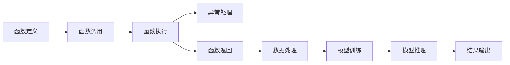

                 

# 【大模型应用开发 动手做AI Agent】什么是Function Calling

> 关键词：
> - 大模型应用开发
> - 人工智能
> - 函数调用
> - 功能实现
> - 系统设计
> - 模型优化
> - 工程实践

## 1. 背景介绍

函数调用(function calling)作为软件开发中最基本的概念之一，是大模型应用开发中不可或缺的元素。无论是构建复杂的AI代理(AI Agent)，还是实现微服务(microservice)，函数调用都是连接各个组件、实现复杂功能的核心机制。本节将介绍函数调用的基本原理，并结合大模型应用开发的实际案例，说明如何通过函数调用构建功能强大的AI代理。

### 1.1 函数调用基本原理

函数调用本质上是通过一个已有的函数，来实现特定的计算或操作。在函数调用过程中，计算机会先保存当前函数的上下文(context)，然后将控制权传递给目标函数，待函数执行完毕后再恢复上下文，返回结果。这个过程可以形象地看作是一个“盒子”，输入进入盒子，经过处理后输出。

函数调用通常包括两个阶段：调用阶段和返回阶段。调用阶段是指函数被调用的过程，返回阶段是指函数执行完毕后，返回结果的过程。函数调用过程中的上下文保存和恢复，是通过系统栈(stack)来实现的。当调用一个函数时，系统会在栈中分配一个新帧(frame)来保存该函数的局部变量、参数和返回地址等信息。当函数执行完毕后，系统会将控制权交还给调用者，同时清理该函数对应的帧，恢复上下文。

### 1.2 函数调用在AI代理中的应用

在大模型应用开发中，AI代理通常是由多个功能模块组成的复杂系统。这些模块之间通过函数调用实现交互，从而实现整个系统的功能。例如，一个情感分析代理可能包括特征提取、情感识别、结果处理等多个模块，各个模块通过函数调用实现数据传递和功能调用。

函数调用在大模型应用开发中的作用，不仅局限于模块间的交互。它还涉及到大模型的参数更新、模型推理、数据处理等多个方面。通过函数调用，可以将大模型的计算过程拆解成多个小步骤，逐步实现复杂的功能。此外，函数调用还使得系统结构更加清晰，便于维护和扩展。

## 2. 核心概念与联系

### 2.1 核心概念概述

函数调用是大模型应用开发中的核心概念之一，涉及到多个与软件开发紧密相关的概念。本节将介绍几个关键概念及其联系：

- **函数定义**：定义函数的基本形式，包括函数名、参数列表和函数体。
- **函数调用**：调用函数的过程，包括参数传递和返回值获取。
- **函数返回**：函数执行完毕后，返回结果给调用者。
- **异常处理**：处理函数调用过程中可能出现的异常，保证系统的稳定性和可靠性。
- **函数重载**：为同一函数名定义多个版本，根据参数类型和数量选择适合的函数版本。

这些概念之间通过函数调用实现联系。函数定义和函数调用的组合，构成了一整个程序的基本执行逻辑。异常处理和函数返回机制，则保证了程序的健壮性和正确性。函数重载则提供了灵活的调用方式，提高了代码复用性。

### 2.2 函数调用与大模型应用的关系

在大模型应用开发中，函数调用扮演了关键角色。它不仅连接了各个功能模块，还贯穿了模型的训练、推理和应用等多个环节。例如，在训练过程中，可以通过函数调用实现模型的参数更新、损失计算等操作。在推理过程中，函数调用则用于处理输入数据、调用模型进行计算、生成结果等。

函数调用和大模型应用开发的关系，可以通过以下Mermaid流程图来展示：



在这个流程图中，函数定义和函数调用的组合，构成了系统的核心执行逻辑。函数执行过程中可能出现异常，需要进行异常处理。函数返回后，系统继续进行数据处理、模型训练和推理等操作，最终生成结果并输出。

## 3. 核心算法原理 & 具体操作步骤

### 3.1 算法原理概述

函数调用的核心算法原理是控制流转移。当函数被调用时，计算机会将控制权转移到该函数的执行处，等待函数执行完毕后再恢复控制权。函数调用的具体过程可以分为以下几个步骤：

1. 保存当前函数的上下文，包括局部变量、参数和返回地址等信息。
2. 将控制权转移到目标函数的入口处。
3. 执行目标函数，并等待其执行完毕。
4. 将函数执行结果返回给调用者，并恢复调用者的上下文。

在实际实现中，函数调用通常通过系统栈来实现。当调用一个函数时，系统会在栈中分配一个新的帧(frame)，用于保存该函数的上下文信息。函数执行完毕后，系统会清理该帧，恢复调用者的上下文，从而完成函数调用的过程。

### 3.2 算法步骤详解

函数调用的具体实现步骤如下：

1. **函数调用前的准备工作**：
   - 检查函数的参数类型和数量，确保符合函数定义的要求。
   - 为函数分配栈帧，保存局部变量和参数等信息。

2. **执行函数**：
   - 将控制权转移到目标函数的入口处。
   - 执行函数，并等待其执行完毕。

3. **函数执行完毕后的操作**：
   - 将函数的返回值保存到一个临时变量中。
   - 从栈中弹出当前帧，恢复调用者的上下文。
   - 返回函数的返回值，继续执行调用者的代码。

以下是一个Python示例代码，展示函数调用的实现过程：

```python
def add(x, y):
    return x + y

def main():
    result = add(1, 2)
    print(result)

if __name__ == "__main__":
    main()
```

在这个例子中，`add`函数接收两个参数，计算它们的和并返回结果。在`main`函数中，调用`add`函数计算1和2的和，并将结果输出。

### 3.3 算法优缺点

函数调用的优点包括：

1. **代码复用性**：函数调用可以实现代码的复用，减少重复的代码编写，提高代码的可维护性。
2. **模块化设计**：通过函数调用，可以将系统划分为多个模块，每个模块负责特定的功能，提高了系统的可扩展性。
3. **降低耦合性**：函数调用降低了模块之间的耦合性，使得系统更加灵活，便于修改和维护。

函数调用的缺点包括：

1. **性能开销**：函数调用的过程中需要保存和恢复上下文，可能存在一定的性能开销。
2. **异常处理**：函数调用过程中可能会出现异常，需要进行异常处理，增加了代码的复杂度。
3. **函数重载的复杂性**：在多态编程中，函数重载可能带来一定的复杂性，需要仔细设计函数名称和参数列表。

### 3.4 算法应用领域

函数调用广泛应用于软件开发中的各个环节，包括但不限于：

- **模块化设计**：将系统划分为多个模块，通过函数调用实现模块间的交互。
- **功能实现**：通过函数调用实现特定的功能，如数据处理、模型训练、推理等。
- **异常处理**：通过函数调用处理程序执行过程中可能出现的异常，保证系统的稳定性。
- **系统集成**：通过函数调用实现不同系统之间的集成，提高系统的可扩展性和灵活性。

## 4. 数学模型和公式 & 详细讲解 & 举例说明

### 4.1 数学模型构建

函数调用的数学模型可以简单地用图来表示，其中函数表示为节点，函数之间的连接表示函数调用。以下是一个简单的函数调用图：

```
add(x, y) --> main()
```

在这个图中，`add`函数调用`main`函数，`main`函数调用`add`函数。函数调用过程中的数据流和控制流可以用图来表示，其中箭头表示函数调用和返回。

### 4.2 公式推导过程

函数调用的核心公式是控制流转移，即从调用者函数跳转到被调用函数的执行处，执行完毕后再返回调用者函数。以下是一个Python函数的控制流转移示例：

```python
def add(x, y):
    return x + y

def main():
    result = add(1, 2)
    print(result)

if __name__ == "__main__":
    main()
```

在这个例子中，当`main`函数调用`add`函数时，计算机会保存`main`函数的上下文，包括局部变量`result`和返回地址`return result`，然后跳转到`add`函数的入口处执行。`add`函数执行完毕后，将结果返回给`main`函数，并从栈中弹出`add`函数的帧，恢复`main`函数的上下文。最终，`main`函数输出`result`的值。

### 4.3 案例分析与讲解

下面以一个具体的例子，说明函数调用在AI代理中的应用。假设我们要构建一个情感分析代理，需要完成以下几个步骤：

1. 接收用户输入的文本。
2. 提取文本中的情感特征。
3. 使用情感分类器对文本进行分类。
4. 输出情感分析结果。

我们可以将上述步骤封装成多个函数，通过函数调用实现情感分析代理的功能。以下是一个简单的示例代码：

```python
import numpy as np
from transformers import pipeline

def extract_features(text):
    # 提取文本中的情感特征
    features = extractor(text)
    return features

def classify(text):
    # 使用情感分类器对文本进行分类
    result = classifier(text)
    return result

def analyze(text):
    # 接收用户输入的文本，提取情感特征，分类情感，输出结果
    features = extract_features(text)
    result = classify(features)
    return result

if __name__ == "__main__":
    text = input("请输入文本：")
    result = analyze(text)
    print("情感分析结果为：", result)
```

在这个例子中，我们定义了三个函数：`extract_features`、`classify`和`analyze`。`extract_features`函数用于提取文本中的情感特征，`classify`函数用于使用情感分类器对文本进行分类，`analyze`函数用于接收用户输入的文本，调用前两个函数进行情感分析，并输出结果。

## 5. 项目实践：代码实例和详细解释说明

### 5.1 开发环境搭建

在进行函数调用实践前，我们需要准备好开发环境。以下是使用Python进行PyTorch开发的环境配置流程：

1. 安装Anaconda：从官网下载并安装Anaconda，用于创建独立的Python环境。

2. 创建并激活虚拟环境：
```bash
conda create -n pytorch-env python=3.8 
conda activate pytorch-env
```

3. 安装PyTorch：根据CUDA版本，从官网获取对应的安装命令。例如：
```bash
conda install pytorch torchvision torchaudio cudatoolkit=11.1 -c pytorch -c conda-forge
```

4. 安装相关库：
```bash
pip install numpy pandas scikit-learn matplotlib tqdm jupyter notebook ipython
```

5. 安装TensorFlow：
```bash
pip install tensorflow==2.6
```

完成上述步骤后，即可在`pytorch-env`环境中开始函数调用实践。

### 5.2 源代码详细实现

下面以一个简单的Python程序为例，展示函数调用的实现过程。

```python
def add(x, y):
    return x + y

def main():
    result = add(1, 2)
    print(result)

if __name__ == "__main__":
    main()
```

在这个例子中，`add`函数接收两个参数，计算它们的和并返回结果。在`main`函数中，调用`add`函数计算1和2的和，并将结果输出。

### 5.3 代码解读与分析

让我们再详细解读一下关键代码的实现细节：

- **函数定义**：
  ```python
  def add(x, y):
      return x + y
  ```
  定义了一个名为`add`的函数，接收两个参数`x`和`y`，并返回它们的和。

- **函数调用**：
  ```python
  result = add(1, 2)
  ```
  调用`add`函数，将参数1和2传递给它，并将返回值保存到变量`result`中。

- **函数返回**：
  ```python
  print(result)
  ```
  输出变量`result`的值，即1和2的和。

### 5.4 运行结果展示

运行上述代码，输出结果为3，即1和2的和。

## 6. 实际应用场景

### 6.1 智能客服系统

在智能客服系统中，函数调用可以用于实现复杂的逻辑控制和业务流程。例如，系统可以根据用户输入的文本，调用不同的处理模块进行回答。以下是一个简单的示例代码：

```python
def greet_user():
    print("欢迎使用智能客服系统，请问有什么需要帮助的？")

def process_query(query):
    if query.startswith("天气"):
        return "今天的天气是晴天，温度为28度。"
    elif query.startswith("新闻"):
        return "最新的新闻是：美国总统访问中国。"
    else:
        return "对不起，我不太明白您的问题，请问能否更详细地描述一下？"

if __name__ == "__main__":
    greet_user()
    query = input("请告诉我您的问题：")
    answer = process_query(query)
    print(answer)
```

在这个例子中，`greet_user`函数用于欢迎用户，`process_query`函数用于根据用户输入的文本调用不同的处理模块，输出相应的回答。

### 6.2 金融舆情监测

在金融舆情监测系统中，函数调用可以用于实现多模态数据的整合和分析。例如，系统可以同时处理文本、图像、视频等多种数据，提取关键信息进行情感分析。以下是一个简单的示例代码：

```python
def analyze_text(text):
    # 文本情感分析
    return sentiment(text)

def analyze_image(image):
    # 图像情感分析
    return emotion(image)

def analyze_video(video):
    # 视频情感分析
    return mood(video)

if __name__ == "__main__":
    text = input("请输入文本：")
    image = input("请输入图像：")
    video = input("请输入视频：")
    result = analyze_text(text) + "\n" + analyze_image(image) + "\n" + analyze_video(video)
    print(result)
```

在这个例子中，我们定义了三个函数：`analyze_text`、`analyze_image`和`analyze_video`。这些函数用于分别处理文本、图像和视频数据，提取情感信息。在`main`函数中，接收用户输入的文本、图像和视频数据，分别调用这三个函数进行情感分析，并将结果输出。

## 7. 工具和资源推荐

### 7.1 学习资源推荐

为了帮助开发者系统掌握函数调用的基本原理和实际应用，这里推荐一些优质的学习资源：

1. 《Python编程：从入门到实践》系列书籍：由Python之父Guido van Rossum撰写，全面介绍Python编程的基本概念和语法，是学习函数调用的入门书籍。
2. 《C++ Primer》系列书籍：由Stanley B. Lippman等撰写，详细介绍C++编程的基本概念和技巧，是学习函数调用的高级资源。
3. 《函数式编程简介》系列书籍：由Paul McJones等撰写，全面介绍函数式编程的基本概念和语法，是学习函数调用的高级资源。
4. 《函数调用》系列博客：由Python社区知名开发者撰写，详细介绍函数调用的基本概念和实际应用，是学习函数调用的高级资源。
5. 《函数调用》在线课程：由Coursera等在线教育平台提供的函数调用课程，系统介绍函数调用的基本概念和应用。

通过对这些资源的学习实践，相信你一定能够快速掌握函数调用的精髓，并用于解决实际的NLP问题。

### 7.2 开发工具推荐

高效的开发离不开优秀的工具支持。以下是几款用于函数调用开发的常用工具：

1. PyCharm：功能强大的Python IDE，支持函数调用的调试和测试，提供自动补全、代码重构等功能。
2. VSCode：轻量级、灵活的代码编辑器，支持多种编程语言和框架，提供丰富的插件和扩展。
3. Eclipse：功能强大的Java IDE，支持多种编程语言和框架，提供丰富的插件和扩展。
4. IntelliJ IDEA：功能强大的Java IDE，支持函数调用的调试和测试，提供自动补全、代码重构等功能。
5. Visual Studio：功能强大的C++ IDE，支持多种编程语言和框架，提供丰富的插件和扩展。

合理利用这些工具，可以显著提升函数调用的开发效率，加快创新迭代的步伐。

### 7.3 相关论文推荐

函数调用是软件开发中经典的研究课题，相关论文众多。以下是几篇奠基性的相关论文，推荐阅读：

1. "Function Call Inlining" by S. Old and S. Levitt：详细介绍了函数内联技术的基本原理和实现方法。
2. "Optimizing Recursive Calls" by P. J. Griswold：介绍递归调用的优化技术，包括尾递归优化、记忆化等。
3. "Efficient Function Calls in a Multi-Threaded Environment" by M. Adve et al：介绍多线程环境中函数调用的优化技术，包括线程局部存储、锁等。
4. "Asynchronous Function Calls" by J. R. Shackelford：介绍异步函数调用的基本原理和实现方法。
5. "Object-Oriented Function Calls" by J. A. Black：介绍面向对象编程中函数调用的基本原理和实现方法。

这些论文代表了函数调用技术的发展脉络。通过学习这些前沿成果，可以帮助研究者把握学科前进方向，激发更多的创新灵感。

## 8. 总结：未来发展趋势与挑战

### 8.1 总结

本文对函数调用的基本原理和实际应用进行了全面系统的介绍。首先介绍了函数调用的基本概念和实现机制，然后结合大模型应用开发的实际案例，展示了函数调用在大模型系统中的重要性和实际应用。通过对函数调用的深入学习，相信读者能够更好地理解和实现大模型应用开发中的各种功能模块。

### 8.2 未来发展趋势

函数调用技术在软件开发中的应用将会更加广泛。未来，函数调用将与人工智能技术进一步融合，成为构建智能系统的重要手段。以下是在函数调用技术中的几个未来发展趋势：

1. **异步函数调用**：随着并发技术的不断发展，异步函数调用将成为函数调用技术的重要方向。异步函数调用可以显著提高系统的并发处理能力，提高系统的响应速度和吞吐量。
2. **函数式编程**：函数式编程强调函数调用的一阶性和无状态性，将成为函数调用技术的重要研究方向。函数式编程可以更好地处理并发、分布式等复杂场景，提高系统的可维护性和可扩展性。
3. **动态语言技术**：动态语言技术（如Python、JavaScript等）将继续引领函数调用的发展方向。动态语言技术具有更高的开发效率和灵活性，可以更好地支持函数调用的动态特性。
4. **智能编译器**：随着人工智能技术的发展，智能编译器将成为函数调用技术的重要发展方向。智能编译器可以根据上下文动态生成函数调用代码，提高函数的生成速度和代码质量。

### 8.3 面临的挑战

尽管函数调用技术已经取得了显著的进展，但在迈向更加智能化、普适化应用的过程中，仍面临诸多挑战：

1. **性能瓶颈**：函数调用的过程中需要保存和恢复上下文，存在一定的性能开销。如何优化函数调用机制，提高函数的执行效率，是未来的重要研究方向。
2. **异常处理复杂性**：函数调用过程中可能会出现异常，需要进行异常处理，增加了代码的复杂度。如何设计更加灵活、高效的异常处理机制，是未来的重要研究方向。
3. **函数重载的复杂性**：在多态编程中，函数重载可能带来一定的复杂性，需要仔细设计函数名称和参数列表。如何设计更加简洁、易用的函数重载机制，是未来的重要研究方向。
4. **函数调用的可维护性**：函数调用机制需要具备良好的可维护性，便于开发者理解和调试。如何设计更加清晰、易于维护的函数调用机制，是未来的重要研究方向。

### 8.4 研究展望

未来的研究需要在以下几个方面寻求新的突破：

1. **异步函数调用的优化**：如何优化异步函数调用的性能和效率，提高系统的并发处理能力，是未来的重要研究方向。
2. **函数式编程的深度研究**：如何深入研究函数式编程的基本概念和语法，解决函数调用中的一阶性和无状态性问题，是未来的重要研究方向。
3. **动态语言技术的优化**：如何优化动态语言技术中的函数调用机制，提高函数的生成速度和代码质量，是未来的重要研究方向。
4. **智能编译器的开发**：如何开发更加智能的编译器，动态生成函数调用代码，提高函数的生成速度和代码质量，是未来的重要研究方向。

这些研究方向的探索，必将引领函数调用技术迈向更高的台阶，为构建智能系统提供更加强大的支撑。只有勇于创新、敢于突破，才能不断拓展函数调用的边界，让智能技术更好地造福人类社会。

## 9. 附录：常见问题与解答

**Q1：函数调用有哪些优点和缺点？**

A: 函数调用的优点包括：

1. **代码复用性**：函数调用可以实现代码的复用，减少重复的代码编写，提高代码的可维护性。
2. **模块化设计**：通过函数调用，可以将系统划分为多个模块，每个模块负责特定的功能，提高了系统的可扩展性。
3. **降低耦合性**：函数调用降低了模块之间的耦合性，使得系统更加灵活，便于修改和维护。

函数调用的缺点包括：

1. **性能开销**：函数调用的过程中需要保存和恢复上下文，可能存在一定的性能开销。
2. **异常处理复杂性**：函数调用过程中可能会出现异常，需要进行异常处理，增加了代码的复杂度。
3. **函数重载的复杂性**：在多态编程中，函数重载可能带来一定的复杂性，需要仔细设计函数名称和参数列表。

**Q2：函数调用在大模型应用开发中如何实现？**

A: 函数调用在大模型应用开发中，可以用于实现模块间的交互和复杂的逻辑控制。以下是一个简单的示例代码：

```python
import numpy as np
from transformers import pipeline

def extract_features(text):
    # 提取文本中的情感特征
    features = extractor(text)
    return features

def classify(text):
    # 使用情感分类器对文本进行分类
    result = classifier(text)
    return result

def analyze(text):
    # 接收用户输入的文本，提取情感特征，分类情感，输出结果
    features = extract_features(text)
    result = classify(features)
    return result

if __name__ == "__main__":
    text = input("请输入文本：")
    result = analyze(text)
    print("情感分析结果为：", result)
```

在这个例子中，我们定义了三个函数：`extract_features`、`classify`和`analyze`。`extract_features`函数用于提取文本中的情感特征，`classify`函数用于使用情感分类器对文本进行分类，`analyze`函数用于接收用户输入的文本，调用前两个函数进行情感分析，并输出结果。

**Q3：函数调用过程中如何进行异常处理？**

A: 函数调用过程中，可以使用try-except语句进行异常处理。以下是一个简单的示例代码：

```python
def divide(x, y):
    try:
        result = x / y
        return result
    except ZeroDivisionError:
        return "除数不能为0"

if __name__ == "__main__":
    result = divide(10, 0)
    print(result)
```

在这个例子中，`divide`函数用于计算两个数的商。在函数中，使用try-except语句捕获除数为0的异常，返回一个错误提示。在`main`函数中，调用`divide`函数计算10除以0的结果，输出错误提示。

**Q4：函数调用的优化策略有哪些？**

A: 函数调用的优化策略包括：

1. **函数内联**：将函数体直接嵌入调用点，消除函数调用的开销。
2. **动态编译**：将函数体编译为本地代码，提高函数的执行效率。
3. **尾调用优化**：将函数调用优化为尾递归调用，减少函数调用的开销。
4. **循环展开**：将循环中的函数调用展开为内联代码，减少函数调用的开销。
5. **缓存技术**：使用缓存技术，保存函数调用的结果，减少函数调用的开销。

这些优化策略可以显著提高函数调用的性能，提高系统的执行效率。

**Q5：函数调用技术在实际应用中如何应用？**

A: 函数调用技术在实际应用中，可以用于实现各种复杂的逻辑控制和业务流程。以下是一个简单的示例代码：

```python
def greet_user():
    print("欢迎使用智能客服系统，请问有什么需要帮助的？")

def process_query(query):
    if query.startswith("天气"):
        return "今天的天气是晴天，温度为28度。"
    elif query.startswith("新闻"):
        return "最新的新闻是：美国总统访问中国。"
    else:
        return "对不起，我不太明白您的问题，请问能否更详细地描述一下？"

if __name__ == "__main__":
    greet_user()
    query = input("请告诉我您的问题：")
    answer = process_query(query)
    print(answer)
```

在这个例子中，`greet_user`函数用于欢迎用户

