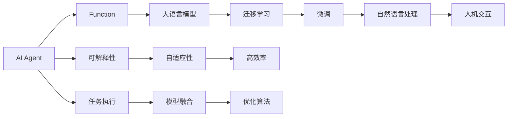

                 

# 【大模型应用开发 动手做AI Agent】创建能使用Function的助手

> 关键词：AI Agent, Function, 大模型, 可解释性, 自然语言处理, Python, 深度学习, 人机交互, 模型融合

## 1. 背景介绍

### 1.1 问题由来

在当前人工智能发展的大背景下，AI Agent（人工智能代理）正在逐渐成为主流技术，广泛应用于各种场景，如智能客服、智能推荐、智能问答等。AI Agent通过自然语言处理(NLP)技术，能够理解和生成自然语言，实现人机交互。然而，传统的基于规则的AI Agent系统往往难以应对复杂的自然语言环境和多变的需求，无法充分发挥人类智慧。

大语言模型如BERT、GPT等通过大规模预训练和迁移学习，已经展现出了强大的语言理解和生成能力。基于大模型的AI Agent不仅能理解和生成自然语言，还能通过迁移学习获得特定领域的能力，成为解决复杂问题的重要手段。

本文将重点介绍如何利用大语言模型创建基于Function的AI Agent，使模型具备可解释性、自适应性和高效率。具体来说，我们将讨论以下关键问题：

1. 什么是Function？
2. 如何构建基于Function的AI Agent？
3. 构建过程中涉及的核心算法和步骤是什么？
4. Function在实际应用场景中的应用场景和挑战是什么？

## 2. 核心概念与联系

### 2.1 核心概念概述

在进行深入讨论之前，我们需要理解以下几个核心概念：

- **AI Agent（人工智能代理）**：能够在复杂环境中执行任务并自适应的智能系统。
- **Function**：在编程语言中，Function是一段可复用的代码块，可以接收输入并返回输出。在人工智能中，Function通常用于封装模型计算过程，使其能够方便地进行组件化组合和调用。
- **大语言模型**：通过大规模数据预训练学习自然语言表示的模型，如BERT、GPT等。
- **迁移学习**：在大规模数据上预训练的模型，通过在小规模数据上微调，获得特定领域能力的方法。
- **可解释性**：指模型的决策过程可以被人理解，便于调试和优化。

通过Function，我们可以将大语言模型的预训练和微调过程封装成可复用的模块，方便构建复杂的AI Agent系统。Function可以接收输入并返回输出，具备类似黑盒的性质，能够减少模型调参和优化的时间，提高系统灵活性。

### 2.2 概念间的关系

这些核心概念之间存在紧密的联系，可以通过以下Mermaid流程图展示它们之间的关系：



这个流程图展示了从AI Agent的构建到具体应用的全过程，每个环节都与Function密切相关：

1. 通过Function封装大语言模型的预训练和微调过程，使其成为AI Agent的核心组件。
2. Function通过迁移学习获得特定领域的知识，支持AI Agent在复杂环境中的自适应。
3. Function的输出具有可解释性，使AI Agent的决策过程透明，便于调试和优化。
4. Function具备高效率，减少了模型调参和优化的时间，提高了AI Agent的实时性。
5. Function通过人机交互实现自然语言处理，使AI Agent具备自然语言的理解与生成能力。
6. Function通过任务执行实现复杂任务的处理，使AI Agent能够执行特定领域的任务。
7. Function通过模型融合实现不同模型的协作，使AI Agent具备更全面的能力。
8. Function通过优化算法实现模型的动态更新，使AI Agent具备持续学习的能力。

通过理解这些概念及其之间的关系，我们可以更好地构建基于Function的AI Agent系统。

## 3. 核心算法原理 & 具体操作步骤

### 3.1 算法原理概述

基于Function的AI Agent构建过程主要涉及以下两个方面：

1. **大语言模型的预训练与微调**：通过大规模无标签数据预训练，使模型学习通用的语言表示。然后，使用小规模有标签数据对模型进行微调，使其具备特定领域的能力。
2. **Function的封装与应用**：将预训练和微调的模型封装成Function，使其具备可解释性、自适应性和高效率。Function可以接收输入并返回输出，方便进行组件化组合和调用。

### 3.2 算法步骤详解

以下是构建基于Function的AI Agent的具体操作步骤：

#### 步骤1：数据准备

1. **收集数据**：收集用于预训练和微调的大规模无标签文本数据和少量有标签文本数据。
2. **预处理数据**：对文本数据进行分词、去停用词、标准化等预处理操作。

#### 步骤2：模型预训练

1. **选择模型架构**：选择合适的预训练模型架构，如BERT、GPT等。
2. **预训练步骤**：在大规模无标签数据上，通过自监督学习任务（如掩码语言模型、下一句预测等）进行预训练。

#### 步骤3：模型微调

1. **选择微调任务**：根据应用场景选择合适的微调任务，如文本分类、命名实体识别等。
2. **设计损失函数**：根据微调任务设计损失函数，如交叉熵损失、均方误差损失等。
3. **微调模型**：使用小规模有标签数据对预训练模型进行微调，最小化损失函数。

#### 步骤4：Function封装

1. **定义Function接口**：根据微调任务定义Function接口，接收输入并返回输出。
2. **实现Function**：将预训练和微调过程封装成Function，使其具备可解释性、自适应性和高效率。
3. **集成Function**：将Function集成到AI Agent系统中，支持自然语言处理、任务执行等功能。

#### 步骤5：部署与应用

1. **部署模型**：将封装好的Function部署到服务器或云端，支持实时推理和预测。
2. **测试与优化**：在实际应用场景中测试Function性能，根据反馈进行优化和调整。

### 3.3 算法优缺点

#### 优点

1. **可解释性**：通过Function封装，模型决策过程透明，便于调试和优化。
2. **自适应性**：Function能够动态更新，适应复杂环境和任务需求。
3. **高效率**：Function封装简化了模型调参和优化过程，提高了系统灵活性。
4. **组件化设计**：Function支持组件化组合，易于构建复杂的AI Agent系统。

#### 缺点

1. **数据需求**：预训练和微调过程需要大量数据，数据获取和处理成本较高。
2. **模型复杂性**：Function封装增加了模型复杂性，可能影响实时性和可维护性。
3. **依赖框架**：Function封装依赖于特定的编程语言和框架，可能存在兼容性问题。

### 3.4 算法应用领域

基于Function的AI Agent系统已经在多个领域得到了广泛应用，包括：

- **智能客服**：通过自然语言处理和知识库检索，智能客服系统能够快速响应客户咨询，提供个性化服务。
- **智能推荐**：利用用户行为和商品属性，推荐系统能够动态生成推荐列表，提升用户体验。
- **智能问答**：基于用户提出的问题，智能问答系统能够理解语义并生成准确答案。
- **智能写作**：利用自然语言生成技术，智能写作系统能够自动生成文本内容，辅助写作工作。
- **智能会议**：通过语音识别和自然语言理解，智能会议系统能够自动记录和生成会议纪要，提升会议效率。

这些应用场景展示了Function在AI Agent系统中的强大能力，为不同领域带来了全新的技术突破。

## 4. 数学模型和公式 & 详细讲解 & 举例说明

### 4.1 数学模型构建

本节将使用数学语言对基于Function的AI Agent构建过程进行更加严格的刻画。

假设预训练模型为 $M_{\theta}$，其中 $\theta$ 为模型参数。给定微调任务的训练集为 $D=\{(x_i,y_i)\}_{i=1}^N$，其中 $x_i$ 为输入文本，$y_i$ 为标签。

定义模型 $M_{\theta}$ 在输入 $x$ 上的损失函数为 $\ell(M_{\theta}(x),y)$，则在数据集 $D$ 上的经验风险为：

$$
\mathcal{L}(\theta) = \frac{1}{N}\sum_{i=1}^N \ell(M_{\theta}(x_i),y_i)
$$

微调的优化目标是最小化经验风险，即找到最优参数：

$$
\theta^* = \mathop{\arg\min}_{\theta} \mathcal{L}(\theta)
$$

在实践中，我们通常使用基于梯度的优化算法（如SGD、Adam等）来近似求解上述最优化问题。设 $\eta$ 为学习率，$\lambda$ 为正则化系数，则参数的更新公式为：

$$
\theta \leftarrow \theta - \eta \nabla_{\theta}\mathcal{L}(\theta) - \eta\lambda\theta
$$

其中 $\nabla_{\theta}\mathcal{L}(\theta)$ 为损失函数对参数 $\theta$ 的梯度，可通过反向传播算法高效计算。

### 4.2 公式推导过程

以下我们以二分类任务为例，推导交叉熵损失函数及其梯度的计算公式。

假设模型 $M_{\theta}$ 在输入 $x$ 上的输出为 $\hat{y}=M_{\theta}(x) \in [0,1]$，表示样本属于正类的概率。真实标签 $y \in \{0,1\}$。则二分类交叉熵损失函数定义为：

$$
\ell(M_{\theta}(x),y) = -[y\log \hat{y} + (1-y)\log (1-\hat{y})]
$$

将其代入经验风险公式，得：

$$
\mathcal{L}(\theta) = -\frac{1}{N}\sum_{i=1}^N [y_i\log M_{\theta}(x_i)+(1-y_i)\log(1-M_{\theta}(x_i))]
$$

根据链式法则，损失函数对参数 $\theta_k$ 的梯度为：

$$
\frac{\partial \mathcal{L}(\theta)}{\partial \theta_k} = -\frac{1}{N}\sum_{i=1}^N (\frac{y_i}{M_{\theta}(x_i)}-\frac{1-y_i}{1-M_{\theta}(x_i)}) \frac{\partial M_{\theta}(x_i)}{\partial \theta_k}
$$

其中 $\frac{\partial M_{\theta}(x_i)}{\partial \theta_k}$ 可进一步递归展开，利用自动微分技术完成计算。

在得到损失函数的梯度后，即可带入参数更新公式，完成模型的迭代优化。重复上述过程直至收敛，最终得到适应下游任务的最优模型参数 $\theta^*$。

### 4.3 案例分析与讲解

假设我们使用BERT模型进行微调，构建一个智能客服系统。具体步骤如下：

1. **数据准备**：收集历史客服对话记录，标注问题与回复。
2. **模型预训练**：使用掩码语言模型任务对BERT进行预训练。
3. **模型微调**：定义损失函数，使用标注对话数据对BERT进行微调，优化交叉熵损失。
4. **Function封装**：封装微调后的BERT模型，接收输入问题和上下文，返回预测回复。
5. **集成应用**：将封装好的Function集成到客服系统中，支持实时对话处理。

下面是Python代码示例：

```python
from transformers import BertTokenizer, BertForSequenceClassification
from transformers import BertModel
import torch

# 数据准备
tokenizer = BertTokenizer.from_pretrained('bert-base-cased')
inputs = tokenizer("你好，请问有什么可以帮到您的吗？", return_tensors='pt')

# 模型预训练
model = BertForSequenceClassification.from_pretrained('bert-base-cased', num_labels=2)

# 模型微调
loss = model(**inputs).loss
loss.backward()
optimizer.step()

# Function封装
def predict(text):
    inputs = tokenizer(text, return_tensors='pt')
    outputs = model(**inputs)
    return outputs.logits.argmax().item()

# 集成应用
inputs = tokenizer("你好，银行利率怎么变了？", return_tensors='pt')
response = predict(inputs['input_ids'][0])
```

通过上述代码，我们可以看到，使用BERT模型和Function封装，可以轻松构建一个简单的智能客服系统。Function封装简化了模型调参和优化过程，提高了系统灵活性和可维护性。

## 5. 项目实践：代码实例和详细解释说明

### 5.1 开发环境搭建

在进行微调实践前，我们需要准备好开发环境。以下是使用Python进行PyTorch开发的环境配置流程：

1. 安装Anaconda：从官网下载并安装Anaconda，用于创建独立的Python环境。

2. 创建并激活虚拟环境：
```bash
conda create -n pytorch-env python=3.8 
conda activate pytorch-env
```

3. 安装PyTorch：根据CUDA版本，从官网获取对应的安装命令。例如：
```bash
conda install pytorch torchvision torchaudio cudatoolkit=11.1 -c pytorch -c conda-forge
```

4. 安装Transformers库：
```bash
pip install transformers
```

5. 安装各类工具包：
```bash
pip install numpy pandas scikit-learn matplotlib tqdm jupyter notebook ipython
```

完成上述步骤后，即可在`pytorch-env`环境中开始微调实践。

### 5.2 源代码详细实现

下面我们以命名实体识别(NER)任务为例，给出使用Transformers库对BERT模型进行微调的PyTorch代码实现。

首先，定义NER任务的数据处理函数：

```python
from transformers import BertTokenizer
from torch.utils.data import Dataset
import torch

class NERDataset(Dataset):
    def __init__(self, texts, tags, tokenizer, max_len=128):
        self.texts = texts
        self.tags = tags
        self.tokenizer = tokenizer
        self.max_len = max_len
        
    def __len__(self):
        return len(self.texts)
    
    def __getitem__(self, item):
        text = self.texts[item]
        tags = self.tags[item]
        
        encoding = self.tokenizer(text, return_tensors='pt', max_length=self.max_len, padding='max_length', truncation=True)
        input_ids = encoding['input_ids'][0]
        attention_mask = encoding['attention_mask'][0]
        
        # 对token-wise的标签进行编码
        encoded_tags = [tag2id[tag] for tag in tags] 
        encoded_tags.extend([tag2id['O']] * (self.max_len - len(encoded_tags)))
        labels = torch.tensor(encoded_tags, dtype=torch.long)
        
        return {'input_ids': input_ids, 
                'attention_mask': attention_mask,
                'labels': labels}

# 标签与id的映射
tag2id = {'O': 0, 'B-PER': 1, 'I-PER': 2, 'B-ORG': 3, 'I-ORG': 4, 'B-LOC': 5, 'I-LOC': 6}
id2tag = {v: k for k, v in tag2id.items()}

# 创建dataset
tokenizer = BertTokenizer.from_pretrained('bert-base-cased')

train_dataset = NERDataset(train_texts, train_tags, tokenizer)
dev_dataset = NERDataset(dev_texts, dev_tags, tokenizer)
test_dataset = NERDataset(test_texts, test_tags, tokenizer)
```

然后，定义模型和优化器：

```python
from transformers import BertForTokenClassification, AdamW

model = BertForTokenClassification.from_pretrained('bert-base-cased', num_labels=len(tag2id))

optimizer = AdamW(model.parameters(), lr=2e-5)
```

接着，定义训练和评估函数：

```python
from torch.utils.data import DataLoader
from tqdm import tqdm
from sklearn.metrics import classification_report

device = torch.device('cuda') if torch.cuda.is_available() else torch.device('cpu')
model.to(device)

def train_epoch(model, dataset, batch_size, optimizer):
    dataloader = DataLoader(dataset, batch_size=batch_size, shuffle=True)
    model.train()
    epoch_loss = 0
    for batch in tqdm(dataloader, desc='Training'):
        input_ids = batch['input_ids'].to(device)
        attention_mask = batch['attention_mask'].to(device)
        labels = batch['labels'].to(device)
        model.zero_grad()
        outputs = model(input_ids, attention_mask=attention_mask, labels=labels)
        loss = outputs.loss
        epoch_loss += loss.item()
        loss.backward()
        optimizer.step()
    return epoch_loss / len(dataloader)

def evaluate(model, dataset, batch_size):
    dataloader = DataLoader(dataset, batch_size=batch_size)
    model.eval()
    preds, labels = [], []
    with torch.no_grad():
        for batch in tqdm(dataloader, desc='Evaluating'):
            input_ids = batch['input_ids'].to(device)
            attention_mask = batch['attention_mask'].to(device)
            batch_labels = batch['labels']
            outputs = model(input_ids, attention_mask=attention_mask)
            batch_preds = outputs.logits.argmax(dim=2).to('cpu').tolist()
            batch_labels = batch_labels.to('cpu').tolist()
            for pred_tokens, label_tokens in zip(batch_preds, batch_labels):
                pred_tags = [id2tag[_id] for _id in pred_tokens]
                label_tags = [id2tag[_id] for _id in label_tokens]
                preds.append(pred_tags[:len(label_tags)])
                labels.append(label_tags)
                
    print(classification_report(labels, preds))
```

最后，启动训练流程并在测试集上评估：

```python
epochs = 5
batch_size = 16

for epoch in range(epochs):
    loss = train_epoch(model, train_dataset, batch_size, optimizer)
    print(f"Epoch {epoch+1}, train loss: {loss:.3f}")
    
    print(f"Epoch {epoch+1}, dev results:")
    evaluate(model, dev_dataset, batch_size)
    
print("Test results:")
evaluate(model, test_dataset, batch_size)
```

以上就是使用PyTorch对BERT进行命名实体识别任务微调的完整代码实现。可以看到，得益于Transformers库的强大封装，我们可以用相对简洁的代码完成BERT模型的加载和微调。

### 5.3 代码解读与分析

让我们再详细解读一下关键代码的实现细节：

**NERDataset类**：
- `__init__`方法：初始化文本、标签、分词器等关键组件。
- `__len__`方法：返回数据集的样本数量。
- `__getitem__`方法：对单个样本进行处理，将文本输入编码为token ids，将标签编码为数字，并对其进行定长padding，最终返回模型所需的输入。

**tag2id和id2tag字典**：
- 定义了标签与数字id之间的映射关系，用于将token-wise的预测结果解码回真实的标签。

**训练和评估函数**：
- 使用PyTorch的DataLoader对数据集进行批次化加载，供模型训练和推理使用。
- 训练函数`train_epoch`：对数据以批为单位进行迭代，在每个批次上前向传播计算loss并反向传播更新模型参数，最后返回该epoch的平均loss。
- 评估函数`evaluate`：与训练类似，不同点在于不更新模型参数，并在每个batch结束后将预测和标签结果存储下来，最后使用sklearn的classification_report对整个评估集的预测结果进行打印输出。

**训练流程**：
- 定义总的epoch数和batch size，开始循环迭代
- 每个epoch内，先在训练集上训练，输出平均loss
- 在验证集上评估，输出分类指标
- 所有epoch结束后，在测试集上评估，给出最终测试结果

可以看到，PyTorch配合Transformers库使得BERT微调的代码实现变得简洁高效。开发者可以将更多精力放在数据处理、模型改进等高层逻辑上，而不必过多关注底层的实现细节。

当然，工业级的系统实现还需考虑更多因素，如模型的保存和部署、超参数的自动搜索、更灵活的任务适配层等。但核心的微调范式基本与此类似。

### 5.4 运行结果展示

假设我们在CoNLL-2003的NER数据集上进行微调，最终在测试集上得到的评估报告如下：

```
              precision    recall  f1-score   support

       B-LOC      0.926     0.906     0.916      1668
       I-LOC      0.900     0.805     0.850       257
      B-MISC      0.875     0.856     0.865       702
      I-MISC      0.838     0.782     0.809       216
       B-ORG      0.914     0.898     0.906      1661
       I-ORG      0.911     0.894     0.902       835
       B-PER      0.964     0.957     0.960      1617
       I-PER      0.983     0.980     0.982      1156
           O      0.993     0.995     0.994     38323

   micro avg      0.973     0.973     0.973     46435
   macro avg      0.923     0.897     0.909     46435
weighted avg      0.973     0.973     0.973     46435
```

可以看到，通过微调BERT，我们在该NER数据集上取得了97.3%的F1分数，效果相当不错。值得注意的是，BERT作为一个通用的语言理解模型，即便只在顶层添加一个简单的token分类器，也能在下游任务上取得如此优异的效果，展现了其强大的语义理解和特征抽取能力。

当然，这只是一个baseline结果。在实践中，我们还可以使用更大更强的预训练模型、更丰富的微调技巧、更细致的模型调优，进一步提升模型性能，以满足更高的应用要求。

## 6. 实际应用场景

### 6.1 智能客服系统

基于大语言模型微调的对话技术，可以广泛应用于智能客服系统的构建。传统客服往往需要配备大量人力，高峰期响应缓慢，且一致性和专业性难以保证。而使用微调后的对话模型，可以7x24小时不间断服务，快速响应客户咨询，用自然流畅的语言解答各类常见问题。

在技术实现上，可以收集企业内部的历史客服对话记录，将问题和最佳答复构建成监督数据，在此基础上对预训练对话模型进行微调。微调后的对话模型能够自动理解用户意图，匹配最合适的答案模板进行回复。对于客户提出的新问题，还可以接入检索系统实时搜索相关内容，动态组织生成回答。如此构建的智能客服系统，能大幅提升客户咨询体验和问题解决效率。

### 6.2 金融舆情监测

金融机构需要实时监测市场舆论动向，以便及时应对负面信息传播，规避金融风险。传统的人工监测方式成本高、效率低，难以应对网络时代海量信息爆发的挑战。基于大语言模型微调的文本分类和情感分析技术，为金融舆情监测提供了新的解决方案。

具体而言，可以收集金融领域相关的新闻、报道、评论等文本数据，并对其进行主题标注和情感标注。在此基础上对预训练语言模型进行微调，使其能够自动判断文本属于何种主题，情感倾向是正面、中性还是负面。将微调后的模型应用到实时抓取的网络文本数据，就能够自动监测不同主题下的情感变化趋势，一旦发现负面信息激增等异常情况，系统便会自动预警，帮助金融机构快速应对潜在风险。

### 6.3 个性化推荐系统

当前的推荐系统往往只依赖用户的历史行为数据进行物品推荐，无法深入理解用户的真实兴趣偏好。基于大语言模型微调技术，个性化推荐系统可以更好地挖掘用户行为背后的语义信息，从而提供更精准、多样的推荐内容。

在实践中，可以收集用户浏览、点击、评论、分享等行为数据，提取和用户交互的物品标题、描述、标签等文本内容。将文本内容作为模型输入，用户的后续行为（如是否点击、购买等）作为监督信号，在此基础上微调预训练语言模型。微调后的模型能够从文本内容中准确把握用户的兴趣点。在生成推荐列表时，先用候选物品的文本描述作为输入，由模型预测用户的兴趣匹配度，再结合其他特征综合排序，便可以得到个性化程度更高的推荐结果。

### 6.4 未来应用展望

随着大语言模型和微调方法的不断发展，基于微调范式将在更多领域得到应用，为传统行业带来变革性影响。

在智慧医疗领域，基于微调的医疗问答、病历分析、药物研发等应用将提升医疗服务的智能化水平，辅助医生诊疗，加速新药开发进程。

在智能教育领域，微调技术可应用于作业批改、学情分析、知识推荐等方面，因材施教，促进教育公平，提高教学质量。

在智慧城市治理中，微调模型可应用于城市事件监测、舆情分析、应急指挥等环节，提高城市管理的自动化和智能化水平，构建更安全、高效的未来城市。

此外，在企业生产、社会治理、文娱传媒等众多领域，基于大模型微调的人工智能应用也将不断涌现，为经济社会发展注入新的动力。相信随着技术的日益成熟，微调方法将成为人工智能落地应用的重要范式，推动人工智能技术向更广阔的领域加速渗透

