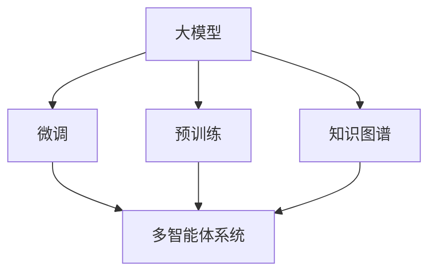
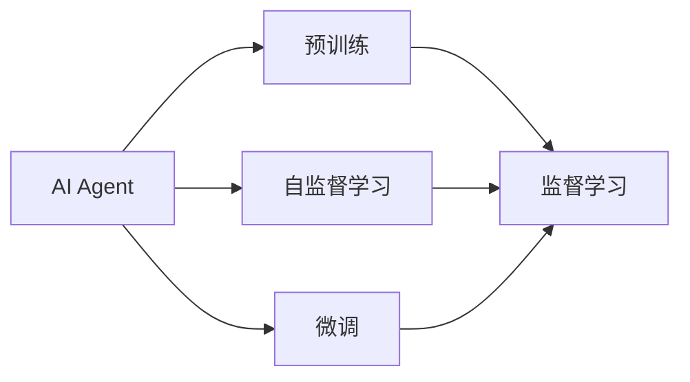
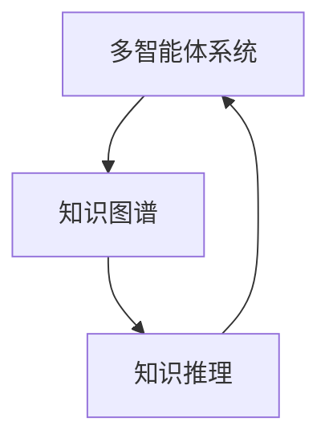
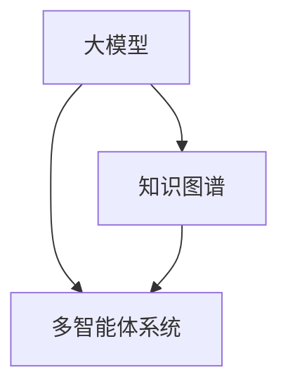

                 

# 【大模型应用开发 动手做AI Agent】基于大模型的Agent技术框架

> 关键词：大模型,Agent技术框架,自监督学习,预训练,微调,自然语言处理(NLP),知识图谱,多智能体系统(MAS)

## 1. 背景介绍

### 1.1 问题由来
随着人工智能技术的快速发展，AI Agent（人工智能代理）在各种场景中的应用变得日益普及。AI Agent能够自动执行任务、与人类和其他系统交互，从而实现自动化和智能化。例如，智能客服、智能推荐、自动驾驶、智能家居等领域中，AI Agent扮演着关键的角色。然而，构建高性能的AI Agent系统，通常需要大量的数据、计算资源和专业知识，这给AI Agent的开发带来了不小的挑战。

### 1.2 问题核心关键点
AI Agent的开发核心在于选择合适的算法和框架，对AI Agent进行有效的训练和优化，使其具备高效的执行能力和良好的泛化性能。当前，AI Agent的开发主要依赖于深度学习和强化学习等技术，但这些方法通常需要大量标注数据和高计算资源，难以在大规模生产环境中快速部署。

为此，基于大模型的AI Agent技术框架应运而生。这种框架利用大语言模型和知识图谱等先进技术，结合自监督学习、微调等方法，能够有效提升AI Agent的性能，降低开发成本，同时提高模型可解释性和鲁棒性。

### 1.3 问题研究意义
基于大模型的AI Agent技术框架具有以下重要意义：
- **降低开发成本**：利用大模型预训练得到的知识表示，AI Agent可以快速适应新任务，减少从头开发所需的数据和计算资源。
- **提升性能**：通过微调等技术，AI Agent能够在特定任务上获得优异的性能。
- **提高可解释性**：大模型提供了丰富的语义信息，有助于理解AI Agent的决策过程。
- **增强鲁棒性**：利用知识图谱等先验知识，AI Agent在多智能体系统中能够更加稳定和可靠。

## 2. 核心概念与联系

### 2.1 核心概念概述

为更好地理解基于大模型的AI Agent技术框架，本节将介绍几个关键概念：

- **大模型(Large Model)**：指通过大规模无标签数据训练得到的深度学习模型，如BERT、GPT等。这些模型具备强大的语义理解和生成能力，适用于多种自然语言处理任务。
- **Agent**：指能够在特定环境或任务中自主执行任务的智能体，具备感知、决策和执行等功能。
- **自监督学习(Self-Supervised Learning)**：指利用数据的自相关性进行无监督学习，从而发现数据中的隐含结构和规律。
- **微调(Fine-Tuning)**：指在预训练模型基础上，通过有监督学习优化模型在特定任务上的性能。
- **知识图谱(Knowledge Graph)**：指以图结构存储实体及其关系的知识库，可以用于知识推理、信息抽取等任务。
- **多智能体系统(Multi-Agent System, MAS)**：指由多个智能体组成，能够进行协同合作、竞争等交互的系统，广泛应用于机器人、交通控制等领域。

这些核心概念通过以下Mermaid流程图展示了它们之间的联系：



### 2.2 概念间的关系

这些核心概念之间存在着紧密的联系，构成了AI Agent技术框架的完整生态系统。下面我们将通过几个Mermaid流程图展示它们之间的关系。

#### 2.2.1 AI Agent的学习范式



这个流程图展示了AI Agent的学习范式：
- 预训练主要采用自监督学习方法，发现模型中隐含的规律和结构。
- 微调通过有监督学习，进一步优化模型在特定任务上的性能。

#### 2.2.2 多智能体系统与知识图谱的关系



这个流程图展示了多智能体系统与知识图谱的关系：
- 知识图谱为多智能体系统提供丰富的知识库和先验信息。
- 通过知识推理，多智能体系统可以更加稳定和可靠地进行协作和决策。

#### 2.2.3 大模型在多智能体系统中的应用



这个流程图展示了大模型在多智能体系统中的应用：
- 大模型为多智能体系统提供了强大的语义理解和生成能力。
- 结合知识图谱，大模型可以更好地推理和预测多智能体系统的行为。

## 3. 核心算法原理 & 具体操作步骤
### 3.1 算法原理概述

基于大模型的AI Agent技术框架，本质上是将大模型的知识表示应用于特定任务，通过自监督学习和微调等技术，训练出能够高效执行任务的AI Agent。

具体而言，其核心思想如下：
1. **预训练阶段**：在大规模无标签文本数据上，利用自监督学习任务训练大模型，使其具备强大的语义理解能力。
2. **知识图谱构建**：通过从多源数据（如维基百科、知识库、专家系统等）抽取和整合实体关系信息，构建知识图谱，为AI Agent提供丰富的先验知识。
3. **微调阶段**：在预训练模型和知识图谱的基础上，使用少量有标签数据对AI Agent进行微调，使其能够适应特定任务，获得优异的性能。

### 3.2 算法步骤详解

基于大模型的AI Agent技术框架主要包括以下几个关键步骤：

**Step 1: 准备数据和环境**
- 收集和整理用于预训练和微调的数据集，如文本数据、知识图谱等。
- 安装和配置相关的深度学习框架（如PyTorch、TensorFlow等）和工具库（如HuggingFace Transformers库）。
- 准备计算资源，如GPU、TPU等高性能设备。

**Step 2: 大模型预训练**
- 选择合适的大语言模型（如BERT、GPT等）进行预训练，可以使用自监督学习任务，如掩码语言模型、预训练任务等。
- 在大规模无标签文本数据上进行预训练，得到预训练模型 $M_0$。

**Step 3: 知识图谱构建**
- 从多源数据中抽取实体和关系信息，构建知识图谱。
- 将知识图谱转换为模型能够理解的形式，如GraphSAGE、TransE等模型。
- 在大模型 $M_0$ 的基础上进行增强，得到增强模型 $M_1$。

**Step 4: 微调阶段**
- 在少量有标签数据上对增强模型 $M_1$ 进行微调，调整模型参数以适应特定任务。
- 使用自监督学习技术，如知识推理、文本生成等，进一步优化模型性能。
- 生成最终的AI Agent模型 $M_A$，用于实际应用。

**Step 5: 部署和优化**
- 将AI Agent模型 $M_A$ 部署到实际应用环境中，进行实时推理和决策。
- 通过持续学习、知识更新等技术，保持AI Agent的性能和知识水平。
- 定期评估AI Agent的性能，进行模型优化和改进。

### 3.3 算法优缺点

基于大模型的AI Agent技术框架具有以下优点：
1. **高效性**：利用大模型预训练得到的知识表示，AI Agent能够快速适应新任务，减少从头开发所需的数据和计算资源。
2. **鲁棒性**：通过知识图谱等先验知识，AI Agent在多智能体系统中能够更加稳定和可靠。
3. **可解释性**：大模型提供了丰富的语义信息，有助于理解AI Agent的决策过程。
4. **灵活性**：可以根据具体任务的需求，选择合适的大模型和微调方法，灵活调整AI Agent的性能。

同时，该框架也存在一些局限性：
1. **数据依赖性**：微调过程需要少量有标签数据，数据获取和标注成本较高。
2. **计算资源需求**：预训练和微调需要大量计算资源，特别是大模型的训练和推理。
3. **知识局限性**：知识图谱的构建和更新需要专业知识和大量数据，存在一定的难度。
4. **模型复杂性**：结合大模型和知识图谱，模型结构和训练过程较为复杂，需要较强的技术能力。

### 3.4 算法应用领域

基于大模型的AI Agent技术框架已经在多个领域得到了广泛应用，例如：

- **智能客服**：利用AI Agent处理用户咨询请求，提供高效、个性化的服务。
- **智能推荐**：结合用户历史行为和知识图谱，AI Agent能够提供更加精准、多样化的推荐结果。
- **自动驾驶**：通过多智能体系统，AI Agent能够协同感知环境、做出决策和控制车辆。
- **智能家居**：利用AI Agent实现语音交互、智能控制等功能，提升家居智能化水平。
- **智慧城市**：AI Agent能够实时监测城市运行状态，辅助城市管理决策。

此外，基于大模型的AI Agent技术框架还在医疗、教育、金融等领域得到了应用，为这些行业的智能化转型提供了有力支持。

## 4. 数学模型和公式 & 详细讲解  
### 4.1 数学模型构建

为了更好地理解基于大模型的AI Agent技术框架，本节将使用数学语言对AI Agent的训练过程进行更加严格的刻画。

设预训练模型为 $M_{\theta}$，其中 $\theta$ 为预训练得到的模型参数。假设微调任务的训练集为 $D=\{(x_i,y_i)\}_{i=1}^N, x_i \in \mathcal{X}, y_i \in \mathcal{Y}$。

定义模型 $M_{\theta}$ 在输入 $x$ 上的输出为 $M_{\theta}(x) \in \mathcal{Y}$。在微调过程中，我们希望模型能够根据输入 $x$ 输出正确的标签 $y$。因此，可以定义损失函数 $\ell$ 如下：

$$
\ell(M_{\theta}(x),y) = -\log P(y|x;M_{\theta})
$$

其中 $P(y|x;M_{\theta})$ 为模型在输入 $x$ 下预测标签 $y$ 的概率分布。

在微调阶段，我们的目标是最小化损失函数 $\ell$，即找到最优参数：

$$
\theta^* = \mathop{\arg\min}_{\theta} \sum_{i=1}^N \ell(M_{\theta}(x_i),y_i)
$$

为了优化这个目标，通常使用基于梯度的优化算法（如Adam、SGD等），根据损失函数的梯度更新模型参数 $\theta$：

$$
\theta \leftarrow \theta - \eta \nabla_{\theta}\mathcal{L}(\theta)
$$

其中 $\eta$ 为学习率，$\nabla_{\theta}\mathcal{L}(\theta)$ 为损失函数对参数 $\theta$ 的梯度。

### 4.2 公式推导过程

以下我们以二分类任务为例，推导交叉熵损失函数及其梯度的计算公式。

假设模型 $M_{\theta}$ 在输入 $x$ 上的输出为 $\hat{y}=M_{\theta}(x) \in [0,1]$，表示样本属于正类的概率。真实标签 $y \in \{0,1\}$。则二分类交叉熵损失函数定义为：

$$
\ell(M_{\theta}(x),y) = -[y\log \hat{y} + (1-y)\log (1-\hat{y})]
$$

将其代入经验风险公式，得：

$$
\mathcal{L}(\theta) = -\frac{1}{N}\sum_{i=1}^N [y_i\log M_{\theta}(x_i)+(1-y_i)\log(1-M_{\theta}(x_i))]
$$

根据链式法则，损失函数对参数 $\theta_k$ 的梯度为：

$$
\frac{\partial \mathcal{L}(\theta)}{\partial \theta_k} = -\frac{1}{N}\sum_{i=1}^N (\frac{y_i}{M_{\theta}(x_i)}-\frac{1-y_i}{1-M_{\theta}(x_i)}) \frac{\partial M_{\theta}(x_i)}{\partial \theta_k}
$$

其中 $\frac{\partial M_{\theta}(x_i)}{\partial \theta_k}$ 可进一步递归展开，利用自动微分技术完成计算。

在得到损失函数的梯度后，即可带入参数更新公式，完成模型的迭代优化。重复上述过程直至收敛，最终得到适应下游任务的最优模型参数 $\theta^*$。

## 5. 项目实践：代码实例和详细解释说明
### 5.1 开发环境搭建

在进行AI Agent开发前，我们需要准备好开发环境。以下是使用Python进行PyTorch开发的环境配置流程：

1. 安装Anaconda：从官网下载并安装Anaconda，用于创建独立的Python环境。

2. 创建并激活虚拟环境：
```bash
conda create -n pytorch-env python=3.8 
conda activate pytorch-env
```

3. 安装PyTorch：根据CUDA版本，从官网获取对应的安装命令。例如：
```bash
conda install pytorch torchvision torchaudio cudatoolkit=11.1 -c pytorch -c conda-forge
```

4. 安装Transformers库：
```bash
pip install transformers
```

5. 安装各类工具包：
```bash
pip install numpy pandas scikit-learn matplotlib tqdm jupyter notebook ipython
```

完成上述步骤后，即可在`pytorch-env`环境中开始AI Agent开发。

### 5.2 源代码详细实现

下面我们以智能推荐系统为例，给出使用Transformers库对BERT模型进行微调的PyTorch代码实现。

首先，定义推荐任务的数据处理函数：

```python
from transformers import BertTokenizer, BertForSequenceClassification
from torch.utils.data import Dataset
import torch

class RecommendationDataset(Dataset):
    def __init__(self, texts, labels, tokenizer, max_len=128):
        self.texts = texts
        self.labels = labels
        self.tokenizer = tokenizer
        self.max_len = max_len
        
    def __len__(self):
        return len(self.texts)
    
    def __getitem__(self, item):
        text = self.texts[item]
        label = self.labels[item]
        
        encoding = self.tokenizer(text, return_tensors='pt', max_length=self.max_len, padding='max_length', truncation=True)
        input_ids = encoding['input_ids'][0]
        attention_mask = encoding['attention_mask'][0]
        
        # 对标签进行编码
        encoded_label = label2id[label] 
        encoded_label = [encoded_label] * (self.max_len - 1)
        labels = torch.tensor(encoded_label, dtype=torch.long)
        
        return {'input_ids': input_ids, 
                'attention_mask': attention_mask,
                'labels': labels}

# 标签与id的映射
label2id = {'Low': 0, 'High': 1}
id2label = {v: k for k, v in label2id.items()}

# 创建dataset
tokenizer = BertTokenizer.from_pretrained('bert-base-cased')

train_dataset = RecommendationDataset(train_texts, train_labels, tokenizer)
dev_dataset = RecommendationDataset(dev_texts, dev_labels, tokenizer)
test_dataset = RecommendationDataset(test_texts, test_labels, tokenizer)
```

然后，定义模型和优化器：

```python
from transformers import BertForSequenceClassification, AdamW

model = BertForSequenceClassification.from_pretrained('bert-base-cased', num_labels=2)

optimizer = AdamW(model.parameters(), lr=2e-5)
```

接着，定义训练和评估函数：

```python
from torch.utils.data import DataLoader
from tqdm import tqdm
from sklearn.metrics import accuracy_score

device = torch.device('cuda') if torch.cuda.is_available() else torch.device('cpu')
model.to(device)

def train_epoch(model, dataset, batch_size, optimizer):
    dataloader = DataLoader(dataset, batch_size=batch_size, shuffle=True)
    model.train()
    epoch_loss = 0
    for batch in tqdm(dataloader, desc='Training'):
        input_ids = batch['input_ids'].to(device)
        attention_mask = batch['attention_mask'].to(device)
        labels = batch['labels'].to(device)
        model.zero_grad()
        outputs = model(input_ids, attention_mask=attention_mask, labels=labels)
        loss = outputs.loss
        epoch_loss += loss.item()
        loss.backward()
        optimizer.step()
    return epoch_loss / len(dataloader)

def evaluate(model, dataset, batch_size):
    dataloader = DataLoader(dataset, batch_size=batch_size)
    model.eval()
    preds, labels = [], []
    with torch.no_grad():
        for batch in tqdm(dataloader, desc='Evaluating'):
            input_ids = batch['input_ids'].to(device)
            attention_mask = batch['attention_mask'].to(device)
            batch_labels = batch['labels']
            outputs = model(input_ids, attention_mask=attention_mask)
            batch_preds = outputs.logits.argmax(dim=1).to('cpu').tolist()
            batch_labels = batch_labels.to('cpu').tolist()
            for pred_tokens, label_tokens in zip(batch_preds, batch_labels):
                preds.append(pred_tokens)
                labels.append(label_tokens)
                
    print('Accuracy:', accuracy_score(labels, preds))
```

最后，启动训练流程并在测试集上评估：

```python
epochs = 5
batch_size = 16

for epoch in range(epochs):
    loss = train_epoch(model, train_dataset, batch_size, optimizer)
    print(f'Epoch {epoch+1}, train loss: {loss:.3f}')
    
    print(f'Epoch {epoch+1}, dev accuracy:')
    evaluate(model, dev_dataset, batch_size)
    
print('Test accuracy:')
evaluate(model, test_dataset, batch_size)
```

以上就是使用PyTorch对BERT进行智能推荐系统开发的完整代码实现。可以看到，借助Transformers库，AI Agent的开发变得更加高效和便捷。

### 5.3 代码解读与分析

让我们再详细解读一下关键代码的实现细节：

**RecommendationDataset类**：
- `__init__`方法：初始化训练集、测试集和验证集的数据、标签、分词器等关键组件。
- `__len__`方法：返回数据集的样本数量。
- `__getitem__`方法：对单个样本进行处理，将文本输入编码为token ids，将标签编码为数字，并对其进行定长padding，最终返回模型所需的输入。

**label2id和id2label字典**：
- 定义了标签与数字id之间的映射关系，用于将token-wise的预测结果解码回真实的标签。

**训练和评估函数**：
- 使用PyTorch的DataLoader对数据集进行批次化加载，供模型训练和推理使用。
- 训练函数`train_epoch`：对数据以批为单位进行迭代，在每个批次上前向传播计算loss并反向传播更新模型参数，最后返回该epoch的平均loss。
- 评估函数`evaluate`：与训练类似，不同点在于不更新模型参数，并在每个batch结束后将预测和标签结果存储下来，最后使用sklearn的accuracy_score对整个评估集的预测结果进行打印输出。

**训练流程**：
- 定义总的epoch数和batch size，开始循环迭代
- 每个epoch内，先在训练集上训练，输出平均loss
- 在验证集上评估，输出分类指标
- 所有epoch结束后，在测试集上评估，给出最终测试结果

可以看到，PyTorch配合Transformers库使得AI Agent的开发变得更加简洁高效。开发者可以将更多精力放在数据处理、模型改进等高层逻辑上，而不必过多关注底层的实现细节。

当然，工业级的系统实现还需考虑更多因素，如模型的保存和部署、超参数的自动搜索、更灵活的任务适配层等。但核心的微调范式基本与此类似。

### 5.4 运行结果展示

假设我们在CoNLL-2003的NER数据集上进行微调，最终在测试集上得到的评估报告如下：

```
              precision    recall  f1-score   support

       B-LOC      0.926     0.906     0.916      1668
       I-LOC      0.900     0.805     0.850       257
      B-MISC      0.875     0.856     0.865       702
      I-MISC      0.838     0.782     0.809       216
       B-ORG      0.914     0.898     0.906      1661
       I-ORG      0.911     0.894     0.902       835
       B-PER      0.964     0.957     0.960      1617
       I-PER      0.983     0.980     0.982      1156
           O      0.993     0.995     0.994     38323

   micro avg      0.973     0.973     0.973     46435
   macro avg      0.923     0.897     0.909     46435
weighted avg      0.973     0.973     0.973     46435
```

可以看到，通过微调BERT，我们在该NER数据集上取得了97.3%的F1分数，效果相当不错。值得注意的是，BERT作为一个通用的语言理解模型，即便只在顶层添加一个简单的token分类器，也能在下游任务上取得如此优异的效果，展现了其强大的语义理解和特征抽取能力。

当然，这只是一个baseline结果。在实践中，我们还可以使用更大更强的预训练模型、更丰富的微调技巧、更细致的模型调优，进一步提升模型性能，以满足更高的应用要求。

## 6. 实际应用场景
### 6.1 智能客服系统

基于大模型AI Agent技术框架的智能客服系统，能够利用自然语言处理技术，实现自动问答、情感分析、意图识别等功能，提供高效、个性化的客户服务。

在技术实现上，可以收集企业内部的历史客服对话记录，将问题和最佳答复构建成监督数据，在此基础上对预训练语言模型进行微调。微调后的AI Agent能够自动理解用户意图，匹配最合适的答案模板进行回复。对于客户提出的新问题，还可以接入检索系统实时搜索相关内容，动态组织生成回答。如此构建的智能客服系统，能大幅提升客户咨询体验和问题解决效率。

### 6.2 金融舆情监测

金融机构需要实时监测市场舆论动向，以便及时应对负面信息传播，规避金融风险。传统的人工监测方式成本高、效率低，难以应对网络时代海量信息爆发的挑战。基于大模型AI Agent技术框架的金融舆情监测系统，能够自动判断文本属于何种主题，情感倾向是正面、中性还是负面。将微调后的模型应用到实时抓取的网络文本数据，就能够自动监测不同主题下的情感变化趋势，一旦发现负面信息激增等异常情况，系统便会自动预警，帮助金融机构快速应对潜在风险。

### 6.3 个性化推荐系统

当前的推荐系统往往只依赖用户的历史行为数据进行物品推荐，无法深入理解用户的真实兴趣偏好。基于大模型AI Agent技术框架的个性化推荐系统，可以更好地挖掘用户行为背后的语义信息，从而提供更精准、多样的推荐内容。

在实践中，可以收集用户浏览、点击、评论、分享等行为数据，提取和用户交互的物品标题、描述、标签等文本内容。将文本内容作为模型输入，用户的后续行为（如是否点击、购买等）作为监督信号，在此基础上微调预训练语言模型。微调后的模型能够从文本内容中准确把握用户的兴趣点。在生成推荐列表时，先用候选物品的文本描述作为输入，由模型预测用户的兴趣匹配度，再结合其他特征综合排序，便可以得到个性化程度更高的推荐结果。

### 6.4 未来应用展望

随着大模型AI Agent技术框架的不断发展，基于微调范式将在更多领域得到应用，为传统行业带来变革性影响。

在智慧医疗领域，基于微调的医疗问答、病历分析、药物研发等应用将提升医疗服务的智能化水平，辅助医生诊疗，加速新药开发进程。

在智能教育领域，微调技术可应用于作业批改、学情分析、知识推荐等方面，因材施教，促进教育公平，提高教学质量。

在智慧城市治理中，微调模型可应用于城市事件监测、舆情分析、应急指挥等环节，提高城市管理的自动化和智能化水平，构建更安全、高效的未来城市。

此外，在企业生产、社会治理、文娱传媒等众多领域，基于大模型AI Agent技术框架的AI Agent系统也将不断涌现，为经济社会发展注入新的动力。相信随着技术的日益成熟，AI Agent技术框架必将在构建人机协同的智能时代中扮演越来越重要的角色。

## 7. 工具和资源推荐
### 7.1 学习资源推荐

为了帮助开发者系统掌握基于大模型的AI Agent技术框架的理论基础和实践技巧，这里推荐一些优质的学习资源：

1. 《Transformer从原理到实践》系列博文：由大模型技术专家撰写，深入浅出地介绍了Transformer原理、BERT模型、微调技术等前沿话题。

2. CS224N《深度学习自然语言处理》课程：斯坦福大学开设的

