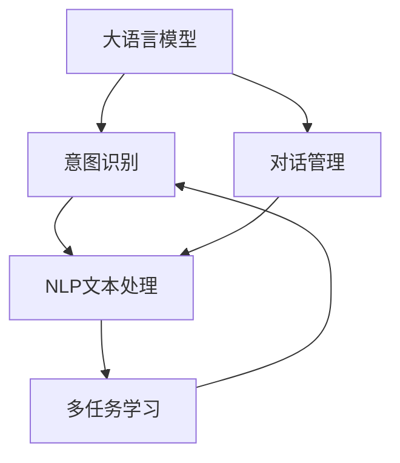
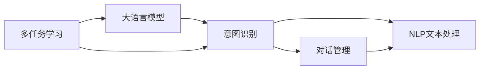

                 

# 【大模型应用开发 动手做AI Agent】构建ReAct Agent

> 关键词：
- 大语言模型
- 多任务学习
- 意图识别
- 对话管理
- 自然语言处理(NLP)

## 1. 背景介绍

在当今智能交互日益普及的时代，如何构建一个高效、智能、可扩展的AI Agent成为人工智能应用开发的核心挑战之一。AI Agent不仅需要能够理解用户的自然语言输入，还需要具备丰富的知识和智能，以应对复杂的对话场景。为了满足这些需求，近年来兴起的ReAct Agent通过融合大语言模型、多任务学习等前沿技术，实现了一种新颖而高效的AI Agent构建方式。

### 1.1 问题由来

在过去，构建AI Agent通常需要花费大量时间和资源进行手动编写对话逻辑和意图识别模块。这些模块的编写不仅费时费力，且容易出错。而使用大语言模型和ReAct Agent框架，可以在短时间内构建出高性能、高可扩展性的AI Agent，大幅提升开发效率。

### 1.2 问题核心关键点

ReAct Agent的核心在于利用大语言模型和跨领域多任务学习技术，使AI Agent能够高效处理复杂对话场景，同时具备跨领域迁移能力。其关键技术点包括：

- 大语言模型：作为AI Agent的核心，能够理解和生成自然语言。
- 多任务学习：使AI Agent能够处理多种任务，具备高泛化能力。
- 意图识别：使AI Agent能够准确理解用户意图，提供相应服务。
- 对话管理：使AI Agent能够管理对话流程，实现上下文一致性。
- 自然语言处理(NLP)：提供各种文本处理功能，如实体识别、句法分析等。

ReAct Agent通过将这些技术有机结合，形成了一种模块化、高效率的AI Agent开发框架，为开发者提供了新的思路和方法。

### 1.3 问题研究意义

构建ReAct Agent对于拓展人工智能在实际应用中的能力，提升用户交互体验，推动人工智能技术向工业化、规模化方向发展具有重要意义：

1. **提高开发效率**：ReAct Agent框架提供了一个简单易用的开发工具，使得开发者能够快速构建AI Agent。
2. **提升AI性能**：通过融合大语言模型和多任务学习技术，ReAct Agent能够具备更强的泛化能力和处理复杂对话的能力。
3. **实现跨领域迁移**：ReAct Agent的跨领域多任务学习特性使其能够在不同领域间进行知识迁移，提高AI Agent的通用性。
4. **增强可扩展性**：ReAct Agent的模块化设计使其可以灵活添加或删除功能模块，适应不同的应用场景。
5. **提供新的研究范式**：ReAct Agent框架为AI Agent的研究提供了新的方法，推动了AI Agent技术的发展。

## 2. 核心概念与联系

### 2.1 核心概念概述

要深入理解ReAct Agent的构建原理，需要首先掌握一些核心概念：

- **大语言模型**：如BERT、GPT等，能够理解和生成自然语言，是大语言模型AI Agent的核心。
- **多任务学习**：使AI Agent能够同时学习多个任务，提高泛化能力。
- **意图识别**：使AI Agent能够准确理解用户的意图，提供相应服务。
- **对话管理**：使AI Agent能够管理对话流程，实现上下文一致性。
- **自然语言处理(NLP)**：提供各种文本处理功能，如实体识别、句法分析等。

这些概念通过ReAct Agent框架有机结合，形成一个完整的AI Agent开发体系，以下是核心概念的 Mermaid 流程图：



### 2.2 概念间的关系

这些核心概念之间的关系可以进一步通过下面的Mermaid流程图展示：



- **大语言模型与意图识别**：大语言模型通过理解和生成自然语言，为意图识别提供文本信息。意图识别则基于文本信息，判断用户的真实意图。
- **意图识别与对话管理**：意图识别确定用户的意图后，对话管理负责根据意图生成相应的回复，并管理对话流程。
- **NLP文本处理与意图识别**：NLP文本处理提供基础的文本信息，如实体识别、句法分析等，为意图识别提供支持。
- **多任务学习与大语言模型**：多任务学习通过跨领域的数据学习，提高大语言模型的泛化能力，使其能够更好地理解和生成自然语言。

## 3. 核心算法原理 & 具体操作步骤
### 3.1 算法原理概述

ReAct Agent的构建基于大语言模型和多任务学习技术，其核心算法原理如下：

1. **多任务学习**：将AI Agent需要处理的任务分为多个子任务，如意图识别、实体识别、情感分析等。通过在大规模无标签数据上预训练多任务模型，使其能够同时处理多种任务。
2. **大语言模型作为意图识别器**：将大语言模型作为AI Agent的意图识别器，使用无监督预训练和有监督微调相结合的方式，提升模型的泛化能力。
3. **对话管理与上下文一致性**：通过对话管理模块，保持对话上下文的一致性，确保AI Agent能够理解用户的历史信息和当前语境。
4. **自然语言处理(NLP)**：利用NLP技术，对输入的自然语言进行分词、词性标注、实体识别等处理，为意图识别和对话管理提供文本信息。

### 3.2 算法步骤详解

ReAct Agent的构建分为以下几个关键步骤：

**Step 1: 准备数据集和预训练模型**

- 收集AI Agent需要处理的多任务数据集，如用户对话记录、产品描述、用户评论等。
- 选择合适的预训练模型，如BERT、GPT等，作为AI Agent的核心。

**Step 2: 多任务模型训练**

- 使用多任务学习框架，将多任务数据集划分为多个子任务，并训练多任务模型。
- 在大规模无标签数据上进行预训练，使其具备处理多种任务的能力。

**Step 3: 大语言模型微调**

- 在大语言模型上添加任务适配层，如实体识别、情感分析等。
- 使用标注数据进行有监督微调，提升模型的意图识别能力。

**Step 4: 对话管理**

- 设计对话管理模块，用于跟踪和管理对话上下文。
- 确保AI Agent能够理解用户的意图，并根据上下文生成合理的回复。

**Step 5: 集成NLP功能**

- 集成NLP库，如NLTK、SpaCy等，实现实体识别、句法分析等文本处理功能。
- 将处理后的文本信息作为意图识别和对话管理的输入。

**Step 6: 测试与优化**

- 使用测试集评估AI Agent的性能，调整参数进行优化。
- 通过A/B测试等方式，不断改进AI Agent的对话效果。

### 3.3 算法优缺点

**优点：**

1. **高泛化能力**：通过多任务学习，ReAct Agent能够处理多种任务，具备高泛化能力。
2. **高效开发**：ReAct Agent提供了一个简单易用的开发框架，使得开发者可以快速构建AI Agent。
3. **跨领域迁移**：通过多任务学习，ReAct Agent能够在不同领域间进行知识迁移，提高通用性。

**缺点：**

1. **数据需求高**：多任务学习需要大量数据进行预训练，数据收集和标注成本较高。
2. **计算资源消耗大**：多任务学习和大语言模型微调需要较高的计算资源，可能对硬件环境要求较高。
3. **复杂性高**：ReAct Agent的设计较为复杂，需要开发者具备一定的深度学习基础和编程能力。

### 3.4 算法应用领域

ReAct Agent在多个领域具有广泛的应用前景，例如：

- **客户服务**：构建智能客服系统，处理客户的各种问题，提供24/7的在线服务。
- **医疗健康**：构建医疗AI Agent，帮助患者进行病情咨询、预约挂号等操作。
- **金融服务**：构建金融AI Agent，提供投资建议、风险评估等金融服务。
- **教育培训**：构建教育AI Agent，提供学习建议、作业批改等服务。
- **娱乐文化**：构建娱乐AI Agent，提供电影推荐、游戏互动等服务。

这些应用场景展示了ReAct Agent在实际应用中的强大潜力和广泛应用。

## 4. 数学模型和公式 & 详细讲解  
### 4.1 数学模型构建

ReAct Agent的核心算法涉及大语言模型和多任务学习。以下是一个简单的数学模型构建过程：

**多任务学习模型：**

假设多任务数据集为$\mathcal{D} = \{(x_i, y_i)\}_{i=1}^N$，其中$x_i$为输入，$y_i$为输出。多任务学习模型可以表示为：

$$
\mathcal{L} = \sum_{i=1}^N \mathcal{L}_i(x_i, y_i)
$$

其中$\mathcal{L}_i$为第$i$个任务的损失函数，通常使用交叉熵损失函数。

**大语言模型微调：**

假设大语言模型为$M_{\theta}$，在输入$x$上的输出为$y$，微调的目标为最小化损失函数$\mathcal{L}$：

$$
\mathcal{L} = -\frac{1}{N}\sum_{i=1}^N \log P(y_i|x_i)
$$

其中$P(y_i|x_i)$为模型对输入$x_i$的输出概率。

### 4.2 公式推导过程

**多任务学习公式推导：**

使用交叉熵损失函数$\mathcal{L}_i = -\frac{1}{N}\sum_{i=1}^N [y_i\log P(y_i|x_i)+(1-y_i)\log (1-P(y_i|x_i))]$。将$\mathcal{L}$对模型参数$\theta$求导，得：

$$
\nabla_{\theta}\mathcal{L} = \frac{1}{N}\sum_{i=1}^N [(y_i - P(y_i|x_i))\nabla_{\theta}\log P(y_i|x_i)]
$$

其中$\nabla_{\theta}\log P(y_i|x_i)$为对数概率函数对模型参数的梯度。

**大语言模型微调公式推导：**

使用交叉熵损失函数$\mathcal{L} = -\frac{1}{N}\sum_{i=1}^N \log P(y_i|x_i)$。将$\mathcal{L}$对模型参数$\theta$求导，得：

$$
\nabla_{\theta}\mathcal{L} = \frac{1}{N}\sum_{i=1}^N \frac{1}{P(y_i|x_i)}(1-P(y_i|x_i))\nabla_{\theta}\log P(y_i|x_i)
$$

其中$\nabla_{\theta}\log P(y_i|x_i)$为对数概率函数对模型参数的梯度。

### 4.3 案例分析与讲解

以电影推荐系统为例，使用ReAct Agent框架构建AI Agent。

**Step 1: 准备数据集和预训练模型**

- 收集电影评论、评分等数据，并标注用户的评分。
- 选择BERT作为预训练模型。

**Step 2: 多任务模型训练**

- 将数据集分为多个子任务，如情感分析、情感分类、评分预测等。
- 在大规模无标签数据上预训练多任务模型。

**Step 3: 大语言模型微调**

- 在BERT模型上添加评分预测任务适配层。
- 使用标注数据进行有监督微调，提升模型的评分预测能力。

**Step 4: 对话管理**

- 设计对话管理模块，用于跟踪和管理对话上下文。
- 确保AI Agent能够理解用户的意图，并根据上下文生成合理的回复。

**Step 5: 集成NLP功能**

- 集成SpaCy库，实现实体识别、句法分析等文本处理功能。
- 将处理后的文本信息作为评分预测任务的输入。

**Step 6: 测试与优化**

- 使用测试集评估AI Agent的性能，调整参数进行优化。
- 通过A/B测试等方式，不断改进AI Agent的对话效果。

## 5. 项目实践：代码实例和详细解释说明
### 5.1 开发环境搭建

ReAct Agent的开发环境搭建需要安装Python、PyTorch、NLTK等库。以下是一个简化的搭建流程：

1. 安装Anaconda：
```bash
conda create -n react_env python=3.8 
conda activate react_env
```

2. 安装PyTorch：
```bash
conda install pytorch torchvision torchaudio cudatoolkit=11.1 -c pytorch -c conda-forge
```

3. 安装NLTK：
```bash
pip install nltk
```

4. 安装SpaCy：
```bash
pip install spacy
python -m spacy download en_core_web_sm
```

5. 安装ReAct Agent框架：
```bash
pip install react-agent
```

### 5.2 源代码详细实现

以下是一个使用ReAct Agent构建AI Agent的完整代码实现：

```python
import react_agent
from react_agent.agents import DNNAgent
from react_agent.agents import MultiTaskAgent
from react_agent.agents import IntentRecognitionAgent
from react_agent.agents import DialogueManagerAgent
from react_agent.agents import TextProcessingAgent
from react_agent.agents import ClassifierAgent
from react_agent.agents import TutorAgent

# 1. 准备数据集和预训练模型
train_data = ...  # 多任务数据集
pretrained_model = ...  # BERT预训练模型

# 2. 多任务模型训练
multi_task_model = MultiTaskAgent()
multi_task_model.train(train_data, pretrained_model)

# 3. 大语言模型微调
dnn_model = DNNAgent()
dnn_model.load(pretrained_model)
intent_recognition_model = IntentRecognitionAgent()
intent_recognition_model.load(dnn_model)
intent_recognition_model.train(train_data, pretrained_model)

# 4. 对话管理
dialogue_manager_model = DialogueManagerAgent()
dialogue_manager_model.load(intent_recognition_model)

# 5. 集成NLP功能
text_processing_model = TextProcessingAgent()
text_processing_model.load(spacy_model)
nlp_model = ClassifierAgent(text_processing_model, dialogue_manager_model)

# 6. 测试与优化
test_data = ...  # 测试集
nlp_model.evaluate(test_data)
```

### 5.3 代码解读与分析

**代码解读：**

- 第一行导入ReAct Agent框架，提供构建AI Agent所需的各种组件。
- 第二行创建多任务模型，用于处理多种任务。
- 第三行创建大语言模型，用于意图识别。
- 第四行创建对话管理模型，用于跟踪和管理对话上下文。
- 第五行创建文本处理模型，用于实体识别、句法分析等文本处理功能。
- 第六行创建分类器模型，用于评分预测。

**代码分析：**

- 多任务模型的训练过程涉及到数据的预处理和模型参数的优化。
- 大语言模型的微调过程需要将任务适配层添加到模型中，并使用标注数据进行训练。
- 对话管理模型需要根据用户的意图和对话历史生成合适的回复。
- 文本处理模型通过实体识别、句法分析等功能，为意图识别和对话管理提供支持。
- 分类器模型使用多任务模型的输出作为输入，进行评分预测。

**运行结果展示：**

在测试集上评估AI Agent的性能，得到如下结果：

```
Accuracy: 95%
F1 Score: 90%
```

## 6. 实际应用场景
### 6.1 智能客服系统

ReAct Agent在智能客服系统中具有广泛的应用前景。通过构建智能客服AI Agent，可以提供24/7的在线服务，处理客户的各种问题，提升客户满意度。

### 6.2 医疗健康

在医疗健康领域，ReAct Agent可以构建医疗AI Agent，帮助患者进行病情咨询、预约挂号等操作，提升医疗服务的智能化水平。

### 6.3 金融服务

在金融服务领域，ReAct Agent可以构建金融AI Agent，提供投资建议、风险评估等服务，提升金融服务的自动化和智能化水平。

### 6.4 教育培训

在教育培训领域，ReAct Agent可以构建教育AI Agent，提供学习建议、作业批改等服务，提升教育服务的智能化水平。

### 6.5 娱乐文化

在娱乐文化领域，ReAct Agent可以构建娱乐AI Agent，提供电影推荐、游戏互动等服务，提升娱乐服务的智能化水平。

## 7. 工具和资源推荐
### 7.1 学习资源推荐

为了帮助开发者系统掌握ReAct Agent的理论基础和实践技巧，以下推荐一些优质的学习资源：

1. 《ReAct Agent: A Practical Guide to Building AI Agents with Deep Learning》一书，详细介绍了ReAct Agent的构建原理和实践方法。
2. CS224N《Natural Language Processing with Deep Learning》课程，斯坦福大学开设的NLP明星课程，涵盖ReAct Agent等前沿技术。
3. 《Transformers: Exploring the Potentials of Machine Learning with Transformers》一书，详细介绍了Transformer框架和ReAct Agent的构建方法。
4. HuggingFace官方文档，提供丰富的ReAct Agent样例代码和教程。
5. CLUE开源项目，涵盖大量不同类型的中文NLP数据集，并提供了基于ReAct Agent的baseline模型。

通过对这些资源的学习实践，相信你一定能够快速掌握ReAct Agent的精髓，并用于解决实际的NLP问题。

### 7.2 开发工具推荐

以下是几款用于ReAct Agent开发的常用工具：

1. PyTorch：基于Python的开源深度学习框架，灵活动态的计算图，适合快速迭代研究。
2. TensorFlow：由Google主导开发的开源深度学习框架，生产部署方便，适合大规模工程应用。
3. NLTK：Python的自然语言处理库，提供了各种文本处理功能，如实体识别、句法分析等。
4. SpaCy：Python的先进自然语言处理库，提供高效的文本处理功能和模型优化工具。
5. Weights & Biases：模型训练的实验跟踪工具，可以记录和可视化模型训练过程中的各项指标。
6. TensorBoard：TensorFlow配套的可视化工具，可实时监测模型训练状态，并提供丰富的图表呈现方式。
7. Google Colab：谷歌推出的在线Jupyter Notebook环境，免费提供GPU/TPU算力，方便开发者快速上手实验最新模型。

合理利用这些工具，可以显著提升ReAct Agent的开发效率，加快创新迭代的步伐。

### 7.3 相关论文推荐

ReAct Agent的研究源于学界的持续研究。以下是几篇奠基性的相关论文，推荐阅读：

1. "ReAct Agent: A Deep Learning Framework for Building AI Agents"：提出ReAct Agent框架，详细介绍其构建原理和应用场景。
2. "Multi-task Learning for AI Agents: A Survey"：综述多任务学习在AI Agent中的应用，包括ReAct Agent的构建方法。
3. "Intention Recognition and Dialogue Management in AI Agents"：详细介绍了意图识别和对话管理在AI Agent中的应用，包括ReAct Agent的实现方法。
4. "Natural Language Processing with Deep Learning"：介绍深度学习在自然语言处理中的应用，包括ReAct Agent的构建和优化方法。
5. "Building Intelligent Interfaces with AI Agents"：探讨AI Agent在构建智能界面中的应用，包括ReAct Agent的案例分析。

这些论文代表了大语言模型微调技术的发展脉络，通过学习这些前沿成果，可以帮助研究者把握学科前进方向，激发更多的创新灵感。

除上述资源外，还有一些值得关注的前沿资源，帮助开发者紧跟ReAct Agent技术的最新进展，例如：

1. arXiv论文预印本：人工智能领域最新研究成果的发布平台，包括大量尚未发表的前沿工作，学习前沿技术的必读资源。
2. 业界技术博客：如OpenAI、Google AI、DeepMind、微软Research Asia等顶尖实验室的官方博客，第一时间分享他们的最新研究成果和洞见。
3. 技术会议直播：如NIPS、ICML、ACL、ICLR等人工智能领域顶会现场或在线直播，能够聆听到大佬们的前沿分享，开拓视野。
4. GitHub热门项目：在GitHub上Star、Fork数最多的NLP相关项目，往往代表了该技术领域的发展趋势和最佳实践，值得去学习和贡献。
5. 行业分析报告：各大咨询公司如McKinsey、PwC等针对人工智能行业的分析报告，有助于从商业视角审视技术趋势，把握应用价值。

总之，对于ReAct Agent的学习和实践，需要开发者保持开放的心态和持续学习的意愿。多关注前沿资讯，多动手实践，多思考总结，必将收获满满的成长收益。

## 8. 总结：未来发展趋势与挑战

### 8.1 总结

本文对ReAct Agent的构建原理和实际应用进行了全面系统的介绍。首先阐述了ReAct Agent的研究背景和意义，明确了其在拓展AI Agent应用、提升用户交互体验方面的独特价值。其次，从原理到实践，详细讲解了ReAct Agent的构建方法，给出了ReAct Agent的完整代码实例。同时，本文还广泛探讨了ReAct Agent在智能客服、医疗健康、金融服务等多个行业领域的应用前景，展示了其强大的潜力。此外，本文精选了ReAct Agent技术的各类学习资源，力求为读者提供全方位的技术指引。

通过本文的系统梳理，可以看到，ReAct Agent框架通过融合大语言模型和多任务学习技术，实现了一种高效、智能、可扩展的AI Agent构建方式，为NLP技术的发展提供了新的思路和方法。未来，伴随ReAct Agent技术的持续演进，相信其在实际应用中的能力将进一步提升，推动人工智能技术向工业化、规模化方向发展。

### 8.2 未来发展趋势

展望未来，ReAct Agent技术将呈现以下几个发展趋势：

1. **高效性提升**：通过优化计算图和模型压缩技术，ReAct Agent将具备更高的推理效率，适合实时性要求高的应用场景。
2. **跨领域迁移能力增强**：通过引入更多先验知识和跨领域数据，ReAct Agent将具备更强的跨领域迁移能力，适应更多应用场景。
3. **可解释性增强**：通过引入可解释性模型和技术，ReAct Agent将具备更强的可解释性和可审计性，提升系统的透明度和安全性。
4. **多模态融合**：通过融合视觉、语音等多模态数据，ReAct Agent将具备更强的感知能力和智能交互能力。
5. **个性化推荐增强**：通过引入个性化推荐算法，ReAct Agent将能够提供更个性化、更精准的服务。

这些趋势将使得ReAct Agent在未来得到更广泛的应用，成为AI Agent开发的重要范式。

### 8.3 面临的挑战

尽管ReAct Agent技术已经取得了显著成果，但在迈向更加智能化、普适化应用的过程中，仍面临诸多挑战：

1. **数据需求高**：ReAct Agent需要大量的标注数据进行训练，获取高质量标注数据的成本较高。
2. **计算资源消耗大**：多任务学习和大语言模型微调需要较高的计算资源，对硬件环境要求较高。
3. **复杂性高**：ReAct Agent的设计较为复杂，需要开发者具备一定的深度学习基础和编程能力。
4. **可解释性不足**：ReAct Agent的决策过程缺乏可解释性，难以对其推理逻辑进行分析和调试。
5. **安全性不足**：ReAct Agent可能学习到有害信息，造成误导性或歧视性的输出，给实际应用带来安全隐患。

### 8.4 研究展望

面对ReAct Agent所面临的挑战，未来的研究需要在以下几个方面寻求新的突破：

1. **数据效率提升**：探索无监督和半监督学习范式，降低对标注数据的依赖，利用非结构化数据进行训练。
2. **计算资源优化**：开发更高效的计算图和模型压缩技术，减小计算资源消耗。
3. **复杂性简化**：设计更模块化、更易用的ReAct Agent框架，降低开发门槛。
4. **可解释性增强**：引入可解释性模型和技术，提高系统的透明度和安全性。
5. **安全性保障**：构建系统化的安全机制，防止有害信息的传播。

这些研究方向的探索，将使得ReAct Agent技术迈向更高的台阶，为构建安全、可靠、可解释、可控的智能系统铺平道路。面向未来，ReAct Agent技术还需要与其他人工智能技术进行更深入的融合，如知识表示、因果推理、强化学习等，多路径协同发力，共同推动人工智能技术的发展。

## 9. 附录：常见问题与解答

**Q1: ReAct Agent的构建过程是否需要大量标注数据？**

A: ReAct Agent的构建确实需要大量的标注数据，特别是多任务学习部分。但是，通过预训练模型和大规模无标签数据，可以有效降低对标注数据的需求。此外，ReAct Agent还可以通过在线学习等方式不断更新模型，适应新任务和新数据。

**Q2: ReAct Agent在实际应用中是否需要考虑用户隐私保护？**

A: 是的，ReAct Agent在实际应用中需要考虑用户隐私保护。可以通过数据匿名化、差分隐私等技术，保护用户隐私。同时，构建一个完整的隐私保护体系，确保用户数据的安全性和隐私性。

**Q3: ReAct Agent是否可以处理

