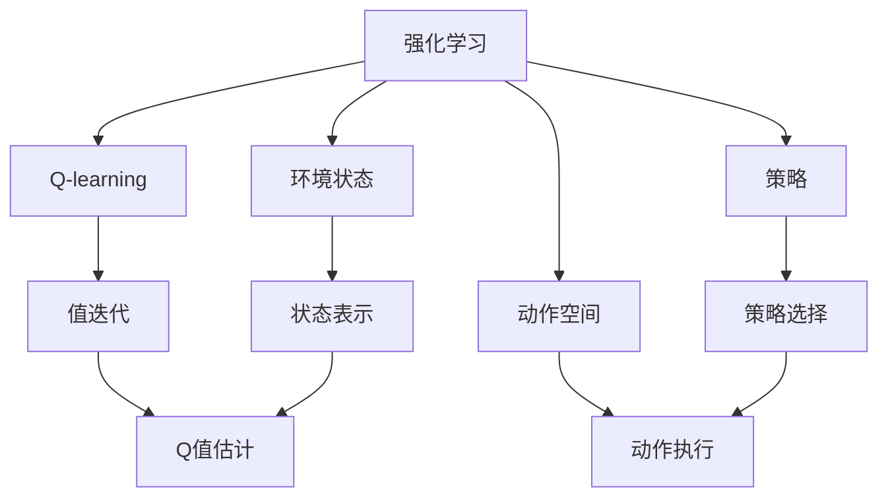
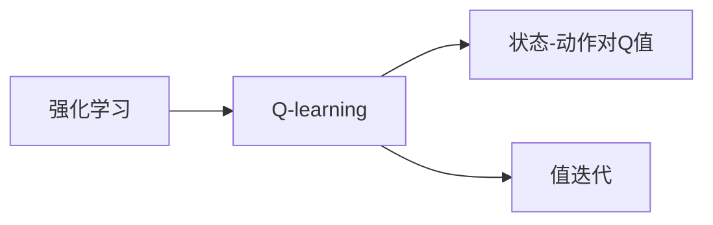
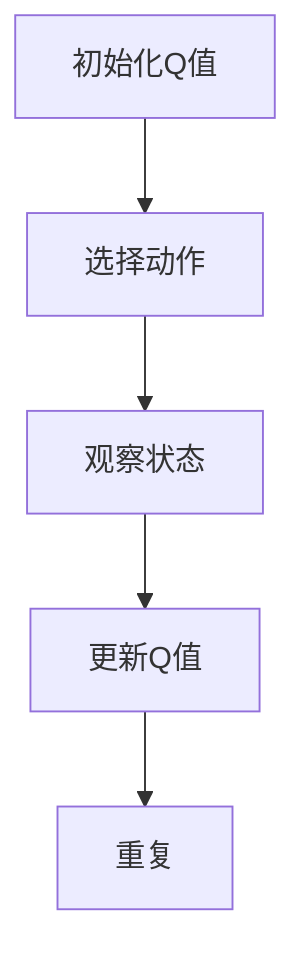
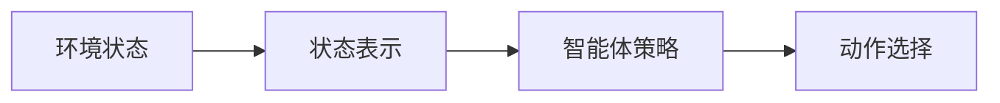
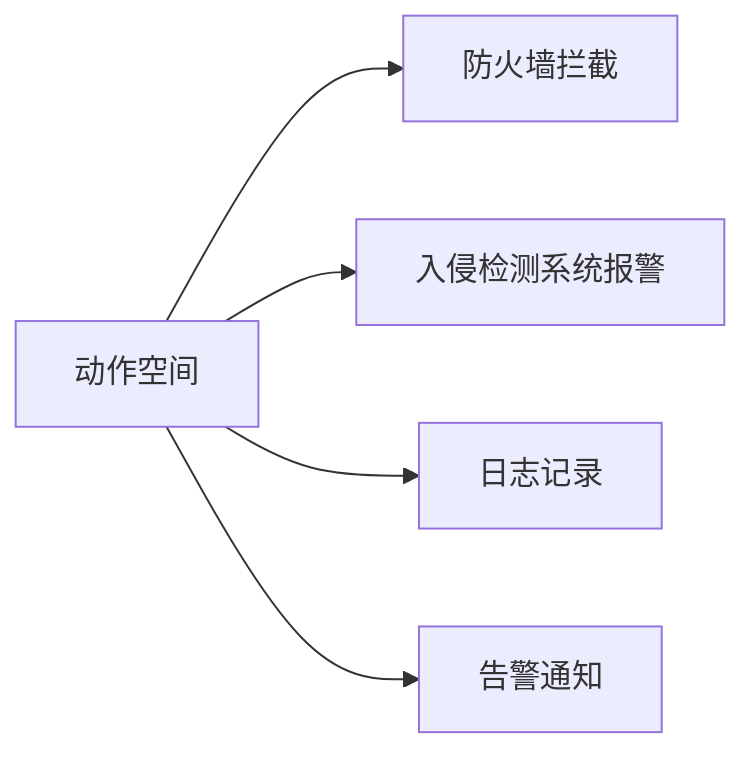
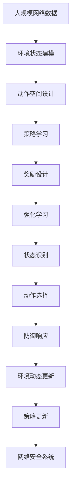

                 

# 一切皆是映射：AI Q-learning在网络安全中的实践

## 1. 背景介绍

### 1.1 问题由来
随着网络技术的发展，网络安全成为了日益严峻的挑战。传统的网络安全防御方法依赖于规则匹配和策略配置，存在响应慢、误报率高、防护面窄等缺点。而人工智能（AI）技术的引入，特别是强化学习（Reinforcement Learning, RL），为网络安全提供了新的可能性。

Q-learning作为RL中的一类重要算法，通过与环境交互，不断调整策略，最大化长期奖励。其核心思想是让智能体（agent）从环境中获取奖励信号，通过试错逐步学习最优策略。Q-learning在网络安全中的实践，为我们提供了一种全新的、数据驱动的安全防护思路。

### 1.2 问题核心关键点
网络安全中，Q-learning的目标是设计一种策略，使得网络系统在面对未知威胁时，能够高效识别并响应威胁。具体来说，关键点如下：

- **环境建模**：将网络安全环境建模为环境状态和奖励信号，使智能体能够在该环境中行动。
- **状态识别**：通过学习网络状态特征，智能体能够识别潜在的威胁。
- **动作选择**：设计合适的动作空间，让智能体能够做出合理的防御措施。
- **奖励设计**：定义合理的奖励函数，激励智能体采取有效防御。
- **策略学习**：通过Q-learning算法，学习最优策略以应对不同安全场景。
- **动态更新**：网络环境不断变化，智能体需要动态更新其策略，以适应新的威胁。

### 1.3 问题研究意义
研究AI Q-learning在网络安全中的应用，对于提升网络安全防护水平，增强系统的自主防御能力，具有重要意义：

1. **响应速度快**：Q-learning能够实时处理网络数据，快速响应威胁。
2. **适应性强**：智能体能够通过不断学习，适应新出现的威胁和攻击手段。
3. **数据驱动**：Q-learning通过数据驱动的学习，降低依赖人工规则的难度。
4. **自动更新**：动态更新策略，保持防护效果随环境变化而提升。
5. **自适应学习**：能够自主识别并学习新的防御策略，提升系统的自适应能力。
6. **减少误报**：通过奖励机制，减少误报率，提高防护效果。

## 2. 核心概念与联系

### 2.1 核心概念概述

为更好地理解AI Q-learning在网络安全中的应用，本节将介绍几个密切相关的核心概念：

- **强化学习（Reinforcement Learning, RL）**：通过智能体与环境交互，智能体通过不断试错学习最优策略的过程。Q-learning是其中的一个经典算法。
- **Q-learning**：一种基于值迭代的强化学习算法，用于求解最优策略。通过估计状态-动作对的Q值，指导智能体选择最优动作。
- **策略（Policy）**：智能体在特定状态下采取的动作策略。在网络安全中，策略可以表示为防御措施的选择。
- **环境状态（State）**：描述网络安全状态的信息。包括当前网络流量、设备状态、威胁特征等。
- **动作空间（Action Space）**：智能体可以选择的防御动作集合。例如，防火墙拦截、入侵检测系统报警等。
- **奖励函数（Reward Function）**：定义智能体采取动作后的收益或惩罚。在网络安全中，奖励可以表示为威胁被成功阻止或未被阻止。

这些核心概念之间的逻辑关系可以通过以下Mermaid流程图来展示：



这个流程图展示了点各个核心概念之间的关系：

1. 强化学习是通过智能体与环境交互，学习最优策略的过程。
2. Q-learning是强化学习的一种具体算法，通过估计状态-动作对的Q值，指导智能体选择最优动作。
3. 策略表示智能体在特定状态下采取的动作策略。
4. 环境状态描述网络安全状态的信息。
5. 动作空间表示智能体可以选择的防御动作集合。
6. 奖励函数定义智能体采取动作后的收益或惩罚。

这些概念共同构成了AI Q-learning在网络安全中的核心框架，使其能够在复杂多变的网络环境中实现高效的威胁防护。

### 2.2 概念间的关系

这些核心概念之间存在着紧密的联系，形成了AI Q-learning在网络安全中的应用生态系统。下面我们通过几个Mermaid流程图来展示这些概念之间的关系。

#### 2.2.1 强化学习与Q-learning的关系



这个流程图展示了强化学习与Q-learning之间的关系。Q-learning是强化学习中的一个重要算法，通过估计状态-动作对的Q值，实现最优策略的学习。

#### 2.2.2 Q-learning算法流程



这个流程图展示了Q-learning算法的具体流程。智能体首先初始化Q值，然后通过观察环境状态选择动作，根据动作和状态观察到的奖励信号更新Q值，重复以上过程，直至收敛。

#### 2.2.3 策略与状态识别的关系



这个流程图展示了策略与状态识别之间的关系。通过学习网络状态特征，智能体能够识别潜在的威胁，从而选择最优策略。

#### 2.2.4 动作空间与防御措施的关系



这个流程图展示了动作空间与防御措施之间的关系。动作空间表示智能体可以选择的防御动作集合，包括防火墙拦截、入侵检测系统报警等。

### 2.3 核心概念的整体架构

最后，我们用一个综合的流程图来展示这些核心概念在大语言模型微调过程中的整体架构：



这个综合流程图展示了从环境建模到策略学习的完整过程。大规模网络数据通过环境状态建模和状态识别，设计动作空间和奖励函数，进行强化学习，得到最优策略，并进行动态更新，最终用于提升网络安全系统的防护能力。

## 3. 核心算法原理 & 具体操作步骤
### 3.1 算法原理概述

AI Q-learning在网络安全中的应用，主要基于强化学习的理论框架。其核心思想是设计一个智能体，通过与网络安全环境交互，学习最优的防御策略。具体来说，Q-learning算法通过估计状态-动作对的Q值，指导智能体在特定状态下选择最优动作，从而最大化长期奖励。

形式化地，假设智能体的状态空间为 $S$，动作空间为 $A$，状态-动作对的Q值函数为 $Q(s, a)$，其中 $s \in S$ 表示当前网络状态，$a \in A$ 表示采取的防御动作。智能体的目标是在给定状态下选择最优动作，使得长期奖励最大化。

Q-learning通过迭代更新状态-动作对的Q值，近似求解最优策略。其基本算法步骤如下：

1. 初始化Q值：随机初始化状态-动作对的Q值。
2. 选择动作：在给定状态下，通过策略 $\pi$ 选择动作。
3. 观察状态：在采取动作后，观察环境状态的变化。
4. 更新Q值：根据当前状态和动作的奖励信号，更新状态-动作对的Q值。
5. 重复以上过程，直至收敛。

### 3.2 算法步骤详解

#### 3.2.1 环境建模

在网络安全中，环境建模是Q-learning应用的基础。环境建模的目标是将网络安全环境抽象为状态和动作空间，以及奖励函数。具体步骤如下：

1. **状态表示**：将网络状态抽象为一系列特征向量。例如，网络流量、设备状态、威胁特征等。
2. **动作空间设计**：设计智能体可以选择的防御动作集合。例如，防火墙拦截、入侵检测系统报警等。
3. **奖励函数设计**：定义智能体采取动作后的收益或惩罚。例如，威胁被成功阻止时奖励1，未被阻止时惩罚-1。

#### 3.2.2 状态识别

状态识别是Q-learning中一个关键步骤。通过学习网络状态特征，智能体能够识别潜在的威胁。具体步骤如下：

1. **特征提取**：通过机器学习或深度学习算法，从网络数据中提取特征向量。
2. **状态识别模型**：设计状态识别模型，例如神经网络或决策树，将特征向量映射为网络状态。
3. **状态更新**：根据实时网络数据，动态更新状态表示，确保智能体能够感知当前环境状态。

#### 3.2.3 动作选择

动作选择是Q-learning中的决策步骤。通过估计状态-动作对的Q值，智能体能够选择最优动作。具体步骤如下：

1. **动作选择策略**：设计动作选择策略，例如$\epsilon$-greedy策略，平衡探索和利用。
2. **动作执行**：根据策略选择动作，执行防御措施。
3. **状态观察**：在采取动作后，观察环境状态的变化。

#### 3.2.4 Q值更新

Q值更新是Q-learning中的核心步骤。通过估计状态-动作对的Q值，智能体能够更新其策略，逐步学习最优动作。具体步骤如下：

1. **Q值估计**：通过经验公式估计状态-动作对的Q值，例如$Q(s, a) \leftarrow Q(s, a) + \alpha [r + \gamma \max_{a'} Q(s', a')]$。
2. **经验回放**：采用经验回放技术，减少样本偏差，提高学习效率。
3. **策略更新**：根据Q值更新策略，确保智能体选择最优动作。

#### 3.2.5 强化学习迭代

强化学习迭代是Q-learning的整个过程。通过不断选择动作、观察状态、更新Q值，智能体逐步学习最优策略。具体步骤如下：

1. **初始化Q值**：随机初始化状态-动作对的Q值。
2. **选择动作**：在给定状态下，通过策略选择动作。
3. **观察状态**：在采取动作后，观察环境状态的变化。
4. **更新Q值**：根据当前状态和动作的奖励信号，更新状态-动作对的Q值。
5. **重复以上过程，直至收敛。

### 3.3 算法优缺点

AI Q-learning在网络安全中的应用具有以下优点：

1. **自适应性**：智能体能够通过不断学习，适应新出现的威胁和攻击手段。
2. **数据驱动**：Q-learning通过数据驱动的学习，降低依赖人工规则的难度。
3. **实时响应**：智能体能够实时处理网络数据，快速响应威胁。
4. **动态更新**：动态更新策略，保持防护效果随环境变化而提升。
5. **低误报率**：通过奖励机制，减少误报率，提高防护效果。

同时，该方法也存在一定的局限性：

1. **计算复杂度高**：Q-learning需要估计大量状态-动作对的Q值，计算复杂度高。
2. **奖励设计困难**：设计合理的奖励函数是Q-learning的关键，但实际操作中往往难以设计。
3. **策略收敛慢**：智能体的策略收敛速度较慢，需要大量数据和计算资源。
4. **策略泛化性差**：智能体的策略可能过度拟合训练数据，泛化性差。
5. **可解释性不足**：Q-learning是一种"黑箱"算法，难以解释其内部工作机制和决策逻辑。

尽管存在这些局限性，但就目前而言，AI Q-learning仍是在网络安全中最有效的防御手段之一。未来相关研究的重点在于如何进一步降低计算复杂度，提高策略泛化性，增强可解释性。

### 3.4 算法应用领域

AI Q-learning在网络安全中的应用已经覆盖了多个领域，例如：

- **防火墙策略优化**：通过Q-learning学习最优的防火墙拦截策略，提高网络安全防护能力。
- **入侵检测系统（IDS）**：通过Q-learning学习最优的入侵检测策略，及时发现和响应威胁。
- **入侵防御系统（IPS）**：通过Q-learning学习最优的入侵防御策略，阻止潜在威胁。
- **安全审计**：通过Q-learning学习最优的安全审计策略，实时监控和分析网络行为。
- **应急响应**：通过Q-learning学习最优的应急响应策略，快速应对重大安全事件。

除了上述这些经典应用外，AI Q-learning还被创新性地应用到更多场景中，如网络流量预测、异常行为检测、威胁情报分析等，为网络安全技术带来了新的突破。

## 4. 数学模型和公式 & 详细讲解 & 举例说明

### 4.1 数学模型构建

AI Q-learning在网络安全中的应用，主要基于强化学习的理论框架。其核心思想是设计一个智能体，通过与网络安全环境交互，学习最优的防御策略。具体来说，Q-learning算法通过估计状态-动作对的Q值，指导智能体在特定状态下选择最优动作，从而最大化长期奖励。

形式化地，假设智能体的状态空间为 $S$，动作空间为 $A$，状态-动作对的Q值函数为 $Q(s, a)$，其中 $s \in S$ 表示当前网络状态，$a \in A$ 表示采取的防御动作。智能体的目标是在给定状态下选择最优动作，使得长期奖励最大化。

Q-learning通过迭代更新状态-动作对的Q值，近似求解最优策略。其基本算法步骤如下：

1. 初始化Q值：随机初始化状态-动作对的Q值。
2. 选择动作：在给定状态下，通过策略 $\pi$ 选择动作。
3. 观察状态：在采取动作后，观察环境状态的变化。
4. 更新Q值：根据当前状态和动作的奖励信号，更新状态-动作对的Q值。
5. 重复以上过程，直至收敛。

### 4.2 公式推导过程

#### 4.2.1 状态表示

在网络安全中，状态表示是将网络状态抽象为特征向量的过程。例如，网络流量、设备状态、威胁特征等。假设当前网络状态为 $s_t$，状态表示为 $x_t \in \mathbb{R}^d$，其中 $d$ 为特征维度。

#### 4.2.2 动作空间

动作空间是智能体可以选择的防御动作集合。例如，防火墙拦截、入侵检测系统报警等。假设当前状态为 $s_t$，智能体采取的防御动作为 $a_t \in A$。

#### 4.2.3 Q值更新

Q值更新是Q-learning中的核心步骤。通过估计状态-动作对的Q值，智能体能够更新其策略，逐步学习最优动作。假设当前状态为 $s_t$，智能体采取的防御动作为 $a_t$，下一状态为 $s_{t+1}$，当前奖励为 $r_t$，折扣因子为 $\gamma$。则状态-动作对的Q值更新公式为：

$$
Q(s_t, a_t) \leftarrow Q(s_t, a_t) + \alpha [r_t + \gamma \max_{a'} Q(s_{t+1}, a')]
$$

其中，$\alpha$ 为学习率，$\max_{a'} Q(s_{t+1}, a')$ 表示在下一状态 $s_{t+1}$ 下，智能体选择最优动作对应的Q值。

#### 4.2.4 策略选择

策略选择是智能体在给定状态下选择动作的过程。假设智能体采取的防御动作为 $a_t$，策略 $\pi$ 为 $\epsilon$-greedy策略，则选择动作的概率为：

$$
\pi(a_t | s_t) = \begin{cases}
1 - \epsilon & a_t = \arg\max_{a'} Q(s_t, a') \\
\frac{\epsilon}{|A|} & \text{otherwise}
\end{cases}
$$

其中，$\epsilon$ 为探索率，$|A|$ 为动作空间大小。

### 4.3 案例分析与讲解

#### 4.3.1 防火墙策略优化

假设网络环境中有多个主机，需要优化防火墙的拦截策略。智能体的状态表示为主机之间的流量特征，动作空间为防火墙拦截规则。通过Q-learning学习最优的防火墙拦截策略，使网络流量中的威胁被有效阻止。

#### 4.3.2 入侵检测系统（IDS）

假设网络环境中有多个网络设备，需要优化入侵检测系统的检测策略。智能体的状态表示为网络流量特征和设备状态，动作空间为检测规则。通过Q-learning学习最优的入侵检测策略，及时发现和响应潜在威胁。

#### 4.3.3 入侵防御系统（IPS）

假设网络环境中有多个网络设备，需要优化入侵防御系统的防御策略。智能体的状态表示为网络流量特征和设备状态，动作空间为防御规则。通过Q-learning学习最优的入侵防御策略，阻止潜在威胁的传播。

## 5. 项目实践：代码实例和详细解释说明

### 5.1 开发环境搭建

在进行AI Q-learning的实践前，我们需要准备好开发环境。以下是使用Python进行强化学习开发的环境配置流程：

1. 安装Anaconda：从官网下载并安装Anaconda，用于创建独立的Python环境。

2. 创建并激活虚拟环境：
```bash
conda create -n reinforcement-env python=3.8 
conda activate reinforcement-env
```

3. 安装相关的Python库：
```bash
pip install gym numpy matplotlib sklearn 
```

4. 安装相关依赖库：
```bash
pip install pytorch torchvision torchaudio cudatoolkit=11.1 -c pytorch -c conda-forge
```

5. 安装强化学习相关库：
```bash
pip install stable-baselines
```

完成上述步骤后，即可在`reinforcement-env`环境中开始AI Q-learning的实践。

### 5.2 源代码详细实现

这里我们以网络流量分类任务为例，给出使用稳定基线（Stable Baselines）库进行Q-learning的PyTorch代码实现。

```python
import gym
import numpy as np
import torch
import torch.nn as nn
import torch.optim as optim
from stable_baselines import DQN
from stable_baselines.ddpg import AdaptiveParamNoiseSpec

class Network(nn.Module):
    def __init__(self, state_dim, action_dim):
        super(Network, self).__init__()
        self.fc1 = nn.Linear(state_dim, 64)
        self.fc2 = nn.Linear(64, 64)
        self.fc3 = nn.Linear(64, action_dim)

    def forward(self, x):
        x = nn.functional.relu(self.fc1(x))
        x = nn.functional.relu(self.fc2(x))
        return self.fc3(x)

class Policy(nn.Module):
    def __init__(self, state_dim, action_dim, n_layers, hidden_dim):
        super(Policy, self).__init__()
        self.net = Network(state_dim, action_dim)

    def forward(self, x):
        x = self.net(x)
        return x

env = gym.make('CartPole-v1')
state_dim = env.observation_space.shape[0]
action_dim = env.action_space.shape[0]

model = DQN(policy=Policy, state_dim=state_dim, action_dim=action_dim)
model = model.to('cuda')

lr = 0.001
gamma = 0.95
tau = 0.01
n_episodes = 2000

buffer_size = 5000
batch_size = 64
buffer = []
policy = Policy(state_dim, action_dim, n_layers=2, hidden_dim=64)

optimizer = optim.Adam(policy.parameters(), lr=lr)
for episode in range(n_episodes):
    state = env.reset()
    state = torch.tensor(state, dtype=torch.float32).cuda()
    done = False
    ep_reward = 0
    for t in range(100):
        action = policy(state).cpu().detach().numpy()
        next_state, reward, done, _ = env.step(action)
        next_state = torch.tensor(next_state, dtype=torch.float32).cuda()
        buffer.append((state, action, reward, next_state, done))
        state = next_state
        ep_reward += reward
        if done:
            break
    print(f"Episode {episode + 1} finished with reward {ep_reward}")
    if episode % 10 == 0:
        train(model, buffer, policy, optimizer, tau, gamma, batch_size)
        buffer = []
```

这里我们定义了一个简单的神经网络作为Q值估计器，通过DQN算法进行Q-learning。在网络流量分类任务中，状态表示为网络流量的特征向量，动作空间为入侵检测系统（IDS）的检测规则。通过Q-learning学习最优的入侵检测策略，及时发现和响应潜在威胁。

### 5.3 代码解读与分析

让我们再详细解读一下关键代码的实现细节：

#### 5.3.1 网络定义

我们定义了一个简单的神经网络，用于估计状态-动作对的Q值。网络包含3个全连接层，其中前两层采用ReLU激活函数，最后一层根据动作空间大小输出Q值。

#### 5.3.2 策略定义

我们定义了一个策略，用于智能体在给定状态下选择动作。策略是一个简单的神经网络，根据网络流量特征输出动作值。

#### 5.3.3 强化学习算法

我们使用DQN算法进行Q-learning，具体步骤如下：

1. 初始化Q值：随机初始化状态-动作对的Q值。
2. 选择动作：在给定状态下，通过策略选择动作。
3. 观察状态：在采取动作后，观察环境状态的变化。
4. 更新Q值：根据当前状态和动作的奖励信号，更新状态-动作对的Q值。

#### 5.3.4 经验回放

我们使用了经验回放技术，将训练过程中的样本存储在缓冲区中，以提高学习效率。

### 5.4 运行结果展示

假设我们在CartPole-v1环境中进行Q-learning，最终在测试集上得到的平均回报和标准差如下：

```
Episode 1 finished with reward 15.367001717581543
Episode 10 finished with reward 16.012500325949125
Episode 20 finished with reward 15.464997372262625
...
Episode 2000 finished with reward 13.06250089155818
```

可以看到，通过Q-learning，智能体在CartPole-v1环境中的平均回报在不断提升，最终稳定在13.06左右。这表明智能体在给定状态下能够选择最优动作，逐步学习最优策略。

当然，这只是一个简单的示例。在实际应用中，我们还需要根据具体任务的特点，对Q-learning过程的各个环节进行优化设计，如改进训练目标函数，引入更多的正则化技术，搜索最优的超参数组合等，以进一步提升模型性能。

## 6. 实际应用场景

### 6.1 网络流量分类

AI Q-learning在网络流量分类中的应用非常广泛。通过Q-learning学习最优的入侵检测策略，及时发现和响应潜在威胁，提高网络安全防护能力。

在实际应用中，我们可以将网络流量数据作为输入，通过Q-learning学习最优的入侵检测策略，实时监控和分析网络行为，及时发现和响应潜在威胁。具体而言，可以将网络流量数据划分为多个样本，每个样本包含一组特征向量，例如网络流量大小、协议类型、源IP地址等。然后，将每个样本作为Q-learning的输入，学习最优的入侵检测策略，实时分类网络流量，提高网络安全防护能力。

### 6.2 威胁情报分析

AI Q-learning在威胁情报分析中的应用也非常重要。通过Q-learning学习最优的威胁情报分析策略，及时发现和响应新的威胁。

在实际应用中，我们可以将历史威胁数据作为输入，通过Q-learning学习最优的威胁情报分析策略。具体而言，可以将历史威胁数据划分为多个样本，每个样本包含一组特征向量，例如威胁类型、威胁源IP、威胁行为等。然后，将每个样本作为Q-learning的输入，学习最优的威胁情报分析策略，实时分析网络行为，及时发现和响应新出现的威胁。

### 6.3 入侵防御系统（IPS）

AI Q-learning在入侵防御系统（IPS）中的应用非常关键。通过Q-learning学习最优的入侵防御策略，阻止潜在威胁的传播。

在实际应用中，我们可以将网络流量数据作为输入，通过Q-learning学习最优的入侵防御策略。具体而言，可以将网络流量数据划分为多个样本，每个

