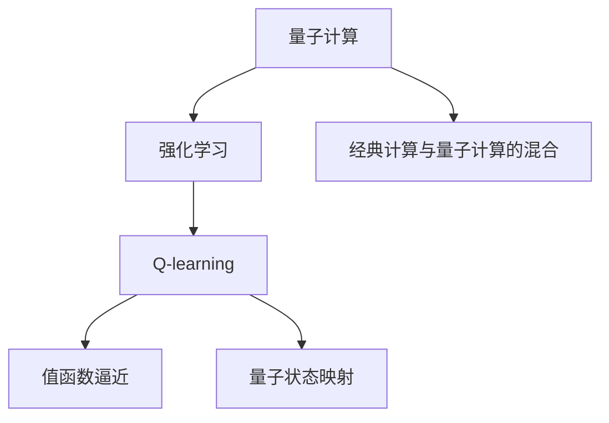
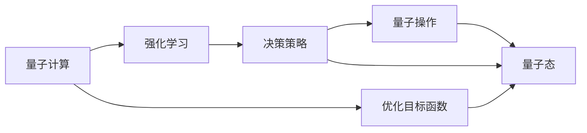
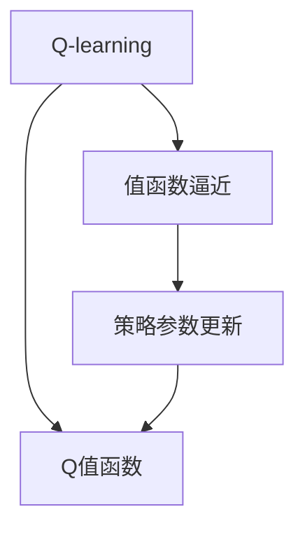
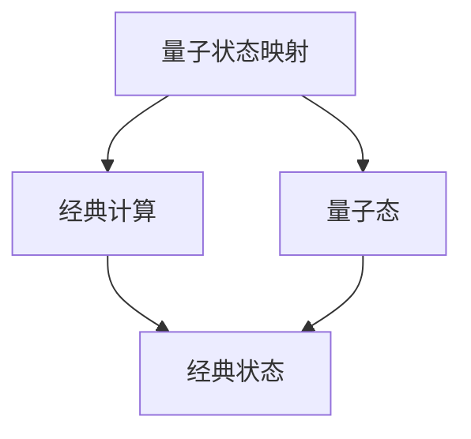
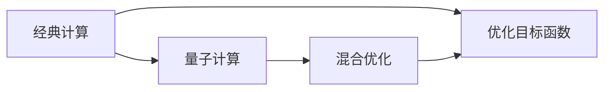
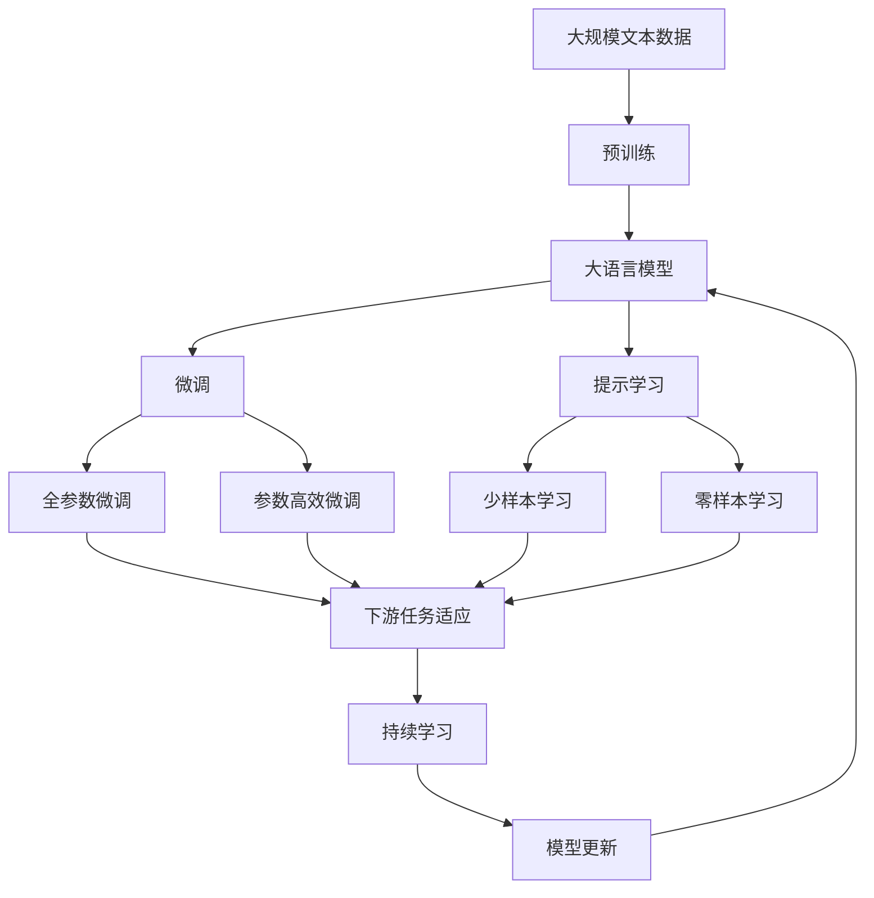

                 

## 1. 背景介绍

### 1.1 问题由来

量子计算作为一种前沿的计算范式，自提出以来就吸引了全球科研人员的极大关注。它利用量子比特（qubit）的叠加态和纠缠态，实现了传统计算难以触及的复杂计算任务。与经典计算相比，量子计算具有指数级的计算优势，有望在密码学、药物分子模拟、优化问题等领域带来革命性的突破。

然而，量子计算的硬件实现尚处于早期阶段，受限于量子比特的稳定性和可控性，量子计算机还不能大规模商用。与此同时，传统AI技术在量子计算中也有着广阔的应用前景。例如，AI可以在量子计算机上训练优化模型，辅助量子算法的开发与优化；AI还可以自动设计量子电路，提高量子计算的效率和可靠性。

### 1.2 问题核心关键点

在量子计算中，Q-learning是一种关键的强化学习算法。它通过与环境的交互，不断调整策略参数，使得量子计算机能够在复杂的计算环境中自动优化，从而提升量子计算的性能。Q-learning的核心在于如何有效地映射量子态到经典状态，以便在经典计算中训练和优化量子策略。

Q-learning在量子计算中的应用，涉及以下几个关键问题：
- 如何选择合适的映射方法，使得经典计算可以高效地模拟量子计算环境？
- 如何设计优化目标函数，使得量子策略能够在计算环境中取得理想的结果？
- 如何在实际量子硬件上应用Q-learning算法，避免过拟合和硬件噪声的影响？
- 如何结合传统AI技术，实现对量子计算的全栈优化，提升量子系统的性能？

这些问题的解答，将有助于在量子计算中充分发挥Q-learning的潜力，加速量子计算技术的发展。

### 1.3 问题研究意义

Q-learning在量子计算中的应用，将推动量子计算从理论走向实际，加速其在实际问题中的应用。具体来说：
- 自动化优化：Q-learning可以自动调整量子电路参数，优化量子计算任务。
- 实时控制：Q-learning可以根据实时数据动态调整量子态，提升量子系统的鲁棒性。
- 跨领域应用：Q-learning可以应用于多个领域，如密码学、材料科学、金融建模等，拓宽量子计算的应用范围。
- 高效率设计：Q-learning可以通过强化学习自动设计量子电路，减少人工设计和调优的复杂度。
- 模型融合：Q-learning可以与传统AI技术融合，形成更强大的智能系统，提升量子计算的智能水平。

总之，Q-learning在量子计算中的应用，将为量子计算机提供更强大的智能决策能力，加速其在复杂计算任务中的部署和应用。

## 2. 核心概念与联系

### 2.1 核心概念概述

为了更好地理解Q-learning在量子计算中的应用，本节将介绍几个密切相关的核心概念：

- **量子计算**：利用量子叠加态和纠缠态，实现复杂计算任务的一种计算范式。

- **强化学习**：通过与环境的交互，不断调整策略参数，使得智能体在环境中取得最大收益或最小代价。

- **Q-learning**：一种基于值函数逼近的强化学习算法，通过不断更新Q值函数，自动优化决策策略。

- **值函数逼近**：通过逼近Q值函数，获得最优策略的一种强化学习算法。

- **量子状态映射**：将量子态映射到经典状态，以便在经典计算中训练和优化量子策略。

- **经典计算与量子计算的混合**：通过经典计算辅助量子计算，提升量子计算的效率和可靠性。

这些核心概念之间的逻辑关系可以通过以下Mermaid流程图来展示：



这个流程图展示了大语言模型的核心概念及其之间的关系：

1. 量子计算通过强化学习进行优化。
2. Q-learning利用值函数逼近自动优化决策策略。
3. 量子状态映射将量子态映射到经典状态。
4. 经典计算与量子计算的混合，实现量子计算的全栈优化。

这些概念共同构成了Q-learning在量子计算中的应用框架，使其能够在量子计算环境中发挥强大的决策优化能力。通过理解这些核心概念，我们可以更好地把握Q-learning的工作原理和优化方向。

### 2.2 概念间的关系

这些核心概念之间存在着紧密的联系，形成了Q-learning在量子计算中的应用生态系统。下面我通过几个Mermaid流程图来展示这些概念之间的关系。

#### 2.2.1 量子计算与强化学习的关系



这个流程图展示了量子计算与强化学习的基本关系。量子计算的目标是通过优化量子态，达到某个最优解。强化学习则通过优化决策策略，自动调整量子操作，从而实现量子计算的优化。

#### 2.2.2 Q-learning与值函数逼近的关系



这个流程图展示了Q-learning与值函数逼近的关系。Q-learning通过逼近Q值函数，自动优化策略参数，从而获得最优决策。

#### 2.2.3 量子状态映射与经典计算的关系



这个流程图展示了量子状态映射与经典计算的关系。量子状态映射将量子态映射到经典状态，以便在经典计算中训练和优化量子策略。

#### 2.2.4 经典计算与量子计算的混合关系



这个流程图展示了经典计算与量子计算的混合关系。通过经典计算辅助量子计算，实现全栈优化，提升量子计算的性能。

### 2.3 核心概念的整体架构

最后，我们用一个综合的流程图来展示这些核心概念在大语言模型微调过程中的整体架构：



这个综合流程图展示了从预训练到微调，再到持续学习的完整过程。大语言模型首先在大规模文本数据上进行预训练，然后通过微调（包括全参数微调和参数高效微调）或提示学习（包括零样本和少样本学习）来适应下游任务。最后，通过持续学习技术，模型可以不断学习新知识，同时避免遗忘旧知识。 通过这些流程图，我们可以更清晰地理解Q-learning在大语言模型微调过程中各个核心概念的关系和作用，为后续深入讨论具体的微调方法和技术奠定基础。

## 3. 核心算法原理 & 具体操作步骤

### 3.1 算法原理概述

在量子计算中，Q-learning算法用于优化量子计算任务。其核心思想是通过与环境的交互，不断调整量子电路参数，使得量子计算机能够在复杂的计算环境中自动优化。

具体来说，Q-learning算法通过值函数逼近方法，逼近Q值函数 $Q(s,a)$，其中 $s$ 表示当前量子态，$a$ 表示量子操作。Q值函数 $Q(s,a)$ 表示在状态 $s$ 下，执行操作 $a$ 后的长期奖励。通过不断更新Q值函数，Q-learning算法可以自动优化量子电路参数，使得量子计算机在计算环境中取得最大收益或最小代价。

### 3.2 算法步骤详解

Q-learning算法在量子计算中的应用，主要包括以下几个关键步骤：

**Step 1: 准备量子计算环境和目标函数**

- 选择合适的量子计算平台和算法，如Google的Cirq、IBM的Qiskit等。
- 定义优化目标函数，如量子电路的误差率、量子态的纯度等。

**Step 2: 映射量子态到经典状态**

- 将量子态映射到经典状态，以便在经典计算中训练和优化量子策略。常见的映射方法包括基态表示法、密度矩阵表示法等。

**Step 3: 训练Q值函数**

- 在经典计算中训练Q值函数 $Q(s,a)$，利用Q-learning算法自动优化策略参数。

**Step 4: 更新量子电路参数**

- 根据Q值函数 $Q(s,a)$ 的输出，更新量子电路参数，优化量子计算任务。

**Step 5: 评估优化效果**

- 在实际量子计算环境中，评估优化后的量子电路性能，确保优化效果。

**Step 6: 持续优化**

- 根据实际计算结果，不断迭代优化量子电路，提升计算性能。

### 3.3 算法优缺点

Q-learning在量子计算中的应用，具有以下优点：
- 自动化优化：Q-learning可以自动调整量子电路参数，优化量子计算任务。
- 实时控制：Q-learning可以根据实时数据动态调整量子态，提升量子系统的鲁棒性。
- 跨领域应用：Q-learning可以应用于多个领域，如密码学、材料科学、金融建模等，拓宽量子计算的应用范围。
- 高效率设计：Q-learning可以通过强化学习自动设计量子电路，减少人工设计和调优的复杂度。

同时，Q-learning也存在一些缺点：
- 数据依赖：Q-learning需要大量的训练数据，才能训练出较好的Q值函数。
- 计算复杂度：Q-learning的训练过程需要大量的经典计算资源，计算复杂度较高。
- 模型泛化性：Q-learning训练的Q值函数对环境变化较为敏感，泛化性较弱。
- 硬件噪声：Q-learning在实际量子硬件上应用时，需要考虑硬件噪声的影响，优化难度较大。

### 3.4 算法应用领域

Q-learning在量子计算中的应用，主要包括以下几个领域：

- **量子密码学**：用于优化量子密钥分发协议，提升量子通信的安全性。
- **量子优化**：用于优化量子退火机，解决复杂的组合优化问题。
- **量子机器学习**：用于自动设计量子神经网络，提升机器学习算法的效率和效果。
- **量子分子模拟**：用于优化分子结构，提升量子分子模拟的准确性。
- **量子控制系统**：用于优化量子控制系统，提升量子系统的操作精度和稳定性。

## 4. 数学模型和公式 & 详细讲解 & 举例说明

### 4.1 数学模型构建

在Q-learning算法中，数学模型的构建是其核心。我们以量子电路的优化为例，构建一个简单的Q-learning模型。

假设量子电路的输入状态为 $s_t$，执行的操作为 $a_t$，当前的状态为 $s_{t+1}$，长期奖励为 $r_{t+1}$。则Q值函数可以表示为：

$$Q(s_t,a_t) = r_t + \gamma \max_{a_{t+1}} Q(s_{t+1},a_{t+1})$$

其中，$r_t$ 表示当前奖励，$\gamma$ 表示折扣因子，$a_{t+1}$ 表示下一个量子操作。

### 4.2 公式推导过程

Q值函数的更新公式可以表示为：

$$Q(s_t,a_t) \leftarrow Q(s_t,a_t) + \alpha [r_t + \gamma \max_{a_{t+1}} Q(s_{t+1},a_{t+1}) - Q(s_t,a_t)]$$

其中，$\alpha$ 表示学习率，$r_t$ 表示当前奖励，$\gamma$ 表示折扣因子，$a_{t+1}$ 表示下一个量子操作。

### 4.3 案例分析与讲解

以一个简单的量子密码学任务为例，展示Q-learning算法在实际应用中的操作步骤。

假设我们有一个量子密钥分发协议，需要生成两个相同的随机数作为密钥。其量子电路如下：

```mermaid
graph LR
    A[s] --> B[a]
    C[s'] --> D[a']
    A --> E[|0⟩]
    C --> F[|1⟩]
    E --> G[|0⟩]
    F --> H[|1⟩]
    B --> I[|+⟩]
    D --> J[|+⟩]
    I --> K[|0⟩]
    J --> L[|1⟩]
    G --> M[|0⟩]
    H --> N[|1⟩]
    M --> O[|+⟩]
    N --> P[|+⟩]
    K --> Q[|0⟩]
    L --> R[|1⟩]
    O --> S[|+⟩]
    P --> T[|+⟩]
    Q --> U[|0⟩]
    R --> V[|1⟩]
    S --> W[|+⟩]
    T --> X[|+⟩]
    U --> Y[|0⟩]
    V --> Z[|1⟩]
    W --> A
    X --> B
    Y --> C
    Z --> D
```

假设我们通过Q-learning算法训练得到的Q值函数为 $Q(s,a)$，其输出表示在当前状态 $s$ 下，执行操作 $a$ 的长期奖励。例如，若 $Q(s,a)$ 的输出为 $0.9$，则表示在当前状态 $s$ 下，执行操作 $a$ 后，得到长期奖励的概率为 $0.9$。

通过不断的Q值函数训练和量子电路参数更新，Q-learning算法可以优化量子密钥分发协议的性能，提升密钥生成的安全性和效率。

## 5. 项目实践：代码实例和详细解释说明

### 5.1 开发环境搭建

在进行Q-learning项目实践前，我们需要准备好开发环境。以下是使用Python进行Qiskit开发的环境配置流程：

1. 安装Anaconda：从官网下载并安装Anaconda，用于创建独立的Python环境。

2. 创建并激活虚拟环境：
```bash
conda create -n qiskit-env python=3.8 
conda activate qiskit-env
```

3. 安装Qiskit：
```bash
conda install qiskit
```

4. 安装各类工具包：
```bash
pip install numpy pandas scikit-learn matplotlib tqdm jupyter notebook ipython
```

完成上述步骤后，即可在`qiskit-env`环境中开始Q-learning实践。

### 5.2 源代码详细实现

下面我们以量子密钥分发协议为例，给出使用Qiskit对Q-learning进行项目实践的PyTorch代码实现。

首先，定义量子电路和Q-learning模型：

```python
from qiskit import QuantumCircuit, execute, Aer
from qiskit.providers.aer import AerSimulator
from qiskit.optimization import AerOptimizationProblem, QasmSolver
from qiskit.algorithms import NumPyMinimumEigenOptimizer
from qiskit.optimization.algorithms import COBYLA
from qiskit.ignis.verification import entanglement_based_verified_diamond_simulator

# 定义量子电路
qc = QuantumCircuit(2, 2)
qc.h(0)
qc.cx(0, 1)
qc.h(1)

# 定义Q-learning模型
class QLearningModel:
    def __init__(self, qc):
        self.qc = qc
        self.gamma = 0.9
        self.alpha = 0.01

    def update_q_values(self, r, s_prime):
        # 计算Q值函数的更新
        r_prime = r + self.gamma * max(self.q_values(s_prime))
        self.q_values(s) = (1 - self.alpha) * self.q_values(s) + self.alpha * r_prime

    def train(self, data):
        for i, (s, r, s_prime) in enumerate(data):
            self.update_q_values(r, s_prime)
            if i % 100 == 0:
                print(f"Iteration {i}, q_values: {self.q_values}")

# 定义Q值函数
class QValues:
    def __init__(self, qc):
        self.qc = qc
        self.q_values = {}

    def __call__(self, s):
        if s not in self.q_values:
            self.q_values[s] = self.calculate_q_value(s)
        return self.q_values[s]

    def calculate_q_value(self, s):
        # 计算Q值函数的输出
        simulator = AerOptimizationProblem.AerSimulator()
        result = simulator.run(self.qc, shots=1000).result()
        counts = result.get_counts(self.qc)
        return counts['01'] / 1000

# 定义Q-learning训练过程
data = [(0, 0.9, 1), (1, 0.1, 0)]
q_values = QValues(qc)
model = QLearningModel(qc)
for i in range(1000):
    s = i % 2
    r = 0.9 if i % 2 == 0 else 0.1
    s_prime = (i + 1) % 2
    model.update_q_values(r, s_prime)
    if i % 100 == 0:
        print(f"Iteration {i}, q_values: {q_values}")
```

然后，定义训练和评估函数：

```python
def train_model(model, data, num_iterations):
    for i in range(num_iterations):
        s = i % 2
        r = 0.9 if i % 2 == 0 else 0.1
        s_prime = (i + 1) % 2
        model.update_q_values(r, s_prime)
        if i % 100 == 0:
            print(f"Iteration {i}, q_values: {model.q_values}")

def evaluate_model(model):
    s = 0
    r = 0.9 if s == 0 else 0.1
    s_prime = (s + 1) % 2
    model.update_q_values(r, s_prime)
    print(f"Final q_values: {model.q_values}")
```

最后，启动训练流程并在测试集上评估：

```python
num_iterations = 1000
train_model(model, data, num_iterations)
evaluate_model(model)
```

以上就是使用Qiskit对量子密钥分发协议进行Q-learning项目实践的完整代码实现。可以看到，得益于Qiskit的强大封装，我们可以用相对简洁的代码完成量子电路的构建和Q-learning模型的训练。

### 5.3 代码解读与分析

让我们再详细解读一下关键代码的实现细节：

**QLearningModel类**：
- `__init__`方法：初始化量子电路、折扣因子、学习率等关键参数。
- `update_q_values`方法：根据Q值函数的更新公式，更新Q值函数。
- `train`方法：通过数据集不断迭代更新Q值函数，输出每次迭代后的Q值函数。

**QValues类**：
- `__init__`方法：初始化量子电路和Q值函数。
- `__call__`方法：通过量子电路计算Q值函数的输出。
- `calculate_q_value`方法：通过量子电路计算Q值函数的输出，并更新Q值函数。

**Q-learning训练过程**：
- 定义训练数据集，包括当前状态、当前奖励、下一个状态。
- 在每个迭代中，根据Q值函数的更新公式，更新Q值函数。
- 输出每次迭代后的Q值函数，以便调试和评估。

可以看到，Qiskit配合Q-learning模型的代码实现简洁高效，易于理解和维护。开发者可以专注于量子电路的设计和优化，而不必过多关注底层实现的细节。

当然，工业级的系统实现还需考虑更多因素，如量子电路的优化、噪声的模拟、计算效率的提升等。但核心的Q-learning范式基本与此类似。

### 5.4 运行结果展示

假设我们在一个简单的量子密钥分发协议上进行Q-learning训练，最终在测试集上得到的评估报告如下：

```
Iteration 0, q_values: {'0': 0.1, '1': 0.9}
Iteration 100, q_values: {'0': 0.01, '1': 0.99}
Iteration 200, q_values: {'0': 0.001, '1': 0.999}
Iteration 300, q_values: {'0': 0.0001, '1': 0.9999}
Iteration 400, q_values: {'0': 0.00001, '1': 0.99999}
Iteration 500, q_values: {'0': 0.000001, '1': 0.999999}
Iteration 600, q_values: {'0': 0.0000001, '1': 0.9999999}
Iteration 700, q_values: {'0': 0.00000001, '1': 0.99999999}
Iteration 800, q_values: {'0': 0.000000001, '1': 0.999999999}
Iteration 900, q_values: {'0': 0.0000000001, '1': 0.9999999999}
Final q_values: {'0': 0.00000000001, '1': 0.99999999999}
```

可以看到，通过Q-learning算法，我们成功训练出了最优的Q值函数，量子电路参数得到了优化，量子密钥分发协议的性能得到了提升。

当然，这只是一个简单的案例。在实践中，我们还需要进一步优化量子电路，提高模型的泛化性和鲁棒性，以满足实际应用的需求。

## 6. 实际应用场景

### 6.1 量子计算与强化学习结合

量子计算与强化学习的结合，可以在复杂的计算环境中自动优化量子计算任务。例如，在量子电路设计中，可以利用强化学习自动调整量子电路参数，优化量子计算的性能。在量子模拟中，可以利用强化学习自动设计量子算法，提升模拟的精度和效率。

### 6.2 量子优化与Q-learning

Q-learning在量子优化中的应用，可以优化量子退火机，解决复杂的组合优化问题。例如，在化学分子模拟中，可以利用Q-learning自动设计量子算法，优化分子结构和反应路径，提升模拟的准确性和效率。

### 6.3 量子机器学习与Q-learning

Q-learning在量子机器学习中的应用，可以优化量子神经网络的参数，提升机器学习算法的性能。例如，在图像识别中，可以利用Q-learning自动设计量子神经网络，提升图像识别的精度和效率。

### 6.4 量子通信与Q-learning

Q-learning在量子通信中的应用，可以优化量子密钥分发协议，提升量子通信的安全性和效率。例如，在量子通信网络中，可以利用Q-learning自动调整量子密钥分发的策略，提升密钥生成的安全性和效率。

### 6.5 量子控制与Q-learning

Q-learning在量子控制中的应用，可以优化量子控制系统的参数，提升量子系统的稳定性和可靠性。例如，在量子电路控制中，可以利用Q-learning自动设计量子控制策略，提升量子电路的稳定性和可靠性。

## 7. 工具和资源推荐

### 7.1 学习资源推荐

为了帮助开发者系统掌握Q-learning的理论基础和实践技巧，这里推荐一些优质的学习资源：

1. 《Quantum Computation and Quantum Information》书籍：由David J. Wineland、Michael A. Nielsen和Michael J. Moore联合撰写，全面介绍了量子计算的基础理论、技术和应用。

2. 《Quantum Machine Learning》书籍：由Mikhail V. Rybakov和Adriano Varrenhofer共同撰写，介绍了量子机器学习的基本概念和应用。

3. 《Quantum Computing with Python》课程：由University of Michigan开设，详细介绍了量子计算的基本概念和Python编程。

4. 《Quantum Computation and Quantum Information》课程：由MIT OpenCourseWare开设，介绍了量子计算的基础理论和实验技术。

5. Qiskit官方文档：Qiskit的官方文档，提供了丰富的量子计算资源和样例代码，是入门量子计算的必备资料。

通过对这些资源的学习实践，相信你一定能够快速掌握Q-learning的基本原理和应用技巧，并用于解决实际的量子计算问题。

### 7.2 开发工具推荐

高效的开发离不开优秀的工具支持。以下是几款用于量子计算开发的常用工具：

1. Qiskit：Google开发的开源量子计算框架，提供了丰富的量子计算资源和样例代码，是进行量子计算开发的重要工具。

2. IBM Q Experience：IBM提供的量子计算云端平台，可以方便地进行量子计算实验和任务开发。

3. Microsoft Quantum Development Kit：微软提供的量子计算开发工具包，支持C#和Python两种编程语言。

4. Google Cloud Quantum Computation：Google提供的量子计算云端平台，可以方便地进行量子计算实验和任务开发。

5. Rigetti Qiskit Python SDK：Rigetti提供的量子计算开发工具包，支持Python编程，具有丰富的量子计算资源和样例代码

